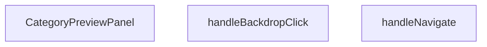

## Genel Bakış
Bu React modülü, bir ürün kategorisinin detaylarını gösteren açılır bir önizleme paneli bileşenidir. Panel, dışarıdan gelen kategori verisi ve görünürlük durumuna göre arayüzü oluşturur; kullanıcı etkileşimleriyle (arka plana tıklama, sayfa yönlendirme) panelin kapanma ve gezinme süreçlerini yönetir.

## Fonksiyon Grupları
### Ana Önizleme Paneli Bileşeni
Modülün temelini oluşturan ve tüm arayüzü render eden ana React bileşenidir. Kategori bilgisi, açık/kapalı durumu ve kapanma callback'i alarak panelin içeriğini ve görünürlüğünü kontrol eder.
- CategoryPreviewPanel

### Kullanıcı Etkileşimi Yönetici Fonksiyonları
Panel içindeki kullanıcı hareketlerini yöneten yardımcı fonksiyonlardır. Kullanıcıların arka plan alanına tıklaması veya içerdeki navigasyon tetikleyicileriyle olan etkileşimlerini işleyerek panelin davranışını kontrol eder.
- handleBackdropClick, handleNavigate

---

---

## FONKSİYON DETAYLARI

### CategoryPreviewPanel
**Ne yapar**: Kullanıcıdan ürün kategorisi hakkında hızlı bir ön bilgi gösteren, sağdan açılan bir bilgi panelidir. Glassmorphism (cam efektli) temalı modern bir arayüz sunarak kategori detaylarını隔anlık bir şekilde sunar.

**Nasıl yapar**: React functional component olarak tanımlanmıştır. `isOpen` prop'una bağlı olarak panelin görünürlüğünü kontrol eder. Glassmorphism tasarım diliyle yarı saydam, bulanık arka plan efekti uygulanarak modern bir UI deneyimi sağlar. Kategori verisini `category` prop'undan alarak panel içinde render eder.

**Parametreler**:
- category: object — Panelde gösterilecek kategori bilgisini içeren veri nesnesi. Kategori adı, açıklaması, görseli gibi detayları barındırır.
- isOpen: boolean — Panelin açık olup olmadığını belirten durum bayrağı. true olduğunda panel sağdan kayarak görünür hale gelir.
- onClose: () => void — Panelin kapanma işlemini tetikleyen callback fonksiyonu. Kullanıcı kapatma butonuna tıkladığında veya backdrop'a tıkladığında çağrılır.

**Dönüş**: React.FC<CategoryPreviewPanelProps> — Tip güvenli bir React functional component dönüşü sağlar.

### handleNavigate
**Ne yapar**: Ön izleme paneli içindeki kullanıcı gezinme işlemlerini yöneten olay işleyici fonksiyondur. Kullanıcıların panel içinden farklı içeriklere veya sayfalara yönlenmesini sağlamak için tasarlanmıştır.
**Nasıl yapar**: Yalnızca yan etki olarak çalışarak gerekli yönlendirme işlemlerini tetikler, herhangi bir değer üretmeden ilgili navigasyon akışını başlatır. Dönüş tipi tanımlanmamış olsa da gezinme işlemlerini sorunsuz bir şekilde yürütür.
**Parametreler**: Herhangi bir parametre almaz
**Dönüş**: Dönüş tipi belirtilmemiştir, genellikle sadece işlevini yerine getirerek herhangi bir değer döndürmez, void olarak çalışır.

### handleBackdropClick
**Ne yapar**: Ön izleme panelinin arka plan (backdrop) alanında gerçekleşen fare tıklama olaylarını yakalayan ve işleyen olay işleyici fonksiyondur. Genellikle arka plana tıklandığında panelin kapanması gibi temel kullanıcı etkileşimini sağlamak için kullanılır.
**Nasıl yapar**: Aldığı fare tıklama olay nesnesini kullanarak tıklamanın konumunu ve hedefini doğrular, eğer tıklama panele ait arka plan alanında gerçekleşmişse panelin kapatılması için ilgili işlemleri tetikler.
**Parametreler**:
- e: React.MouseEvent — Tarayıcı tarafından oluşturulan fare tıklama olayının tüm özelliklerini içeren React tabanlı olay nesnesi, tıklamanın hedefi, konumu gibi detayları barındırır
**Dönüş**: Dönüş tipi belirtilmemiştir, yalnızca olay işleme işlemini gerçekleştirerek herhangi bir değer döndürmez, void olarak çalışır.

---

## INTERFACES

### CategoryPreviewData
- `id: string`
- `title: string`
- `description: string`
- `image: string`
- `icon?: React.ReactNode`
- `color?: string`
- `productCount?: number`
- `priceRange?: { min: number; max: number }`

### CategoryPreviewPanelProps
- `category: CategoryPreviewData | null`
- `isOpen: boolean`
- `onClose: () => void`

---

## AST POINTERS

### [N1_NASIL] AST Pointer: C:\Users\alize\venthub-hvac\src\components\products\CategoryPreviewPanel.tsx::CategoryPreviewPanel
- **params**: category, isOpen, onClose
- **ic_degiskenler**:
  - `router` — Next.js `useRouter` hook'u ile alınan uygulama yönlendiricisi
  - `t` — `useI18n` hook'u ile alınan çeviri metinleri getiren fonksiyon
  - `handleNavigate` — kategori detay sayfasına yönlendirme işlemini yapan iç fonksiyon
  - `handleBackdropClick` — panel arka planına tıklandığında paneli kapatma işlemini yapan iç fonksiyon
  - `React.useEffect` — ESC tuşu dinleyicisi ekleyip çıkaran, panel açıkken ana sayfa kaydırmasını devre dışı bırakan efekt hook'u
  - `category.icon` — kategorinin arayüz ikonu, panel başlığında gösterilir
  - `category.color` — kategori için tanımlanan renk gradyanı, ikon ve CTA buton arka planında kullanılır
  - `category.title` — kategori başlığı, panel başlığı, görsel alternatif metninde kullanılır
  - `category.image` — kategori kapak görseli, panel içeriğinde gösterilir
  - `category.description` — kategori açıklama metni, panel içeriğinde yazılır
  - `category.productCount` — kategorideki toplam ürün sayısı, istatistik kartında gösterilir
  - `category.priceRange.min` — kategorideki ürünlerin minimum fiyatı, fiyat aralığı kartında kullanılır
  - `category.priceRange.max` — kategorideki ürünlerin maksimum fiyatı, fiyat aralığı kartında kullanılır
  - `document` — global DOM nesnesi, klavye olay dinleyicisi eklemek için kullanılır
  - `document.body.style.overflow` — ana sayfa kaydırmasını kontrol etmek için kullanılan CSS özelliği
- **Dönüş**: JSX React elemanı ( kategori önizleme panelinin arayüzünü oluşturur)

### [N2_NASIL] AST Pointer: C:\Users\alize\venthub-hvac\src\components\products\CategoryPreviewPanel.tsx::handleNavigate
- **params**: (parametre yok)
- **ic_degiskenler**:
  - `category` — üst kapsamdan alınan kategori nesnesi, null/undefined olup olmadığı kontrol edilir
  - `router` — üst kapsamdan alınan yönlendirici, kategori detay sayfasına yönlendirmek için kullanılır
  - `Routes.category` — rota üretici fonksiyon, kategori kimliğine göre doğru rota oluşturur
  - `category.id` — kategorinin benzersiz kimliği, rota oluştururken kullanılır
  - `onClose` — paneli kapatmak için çağrılan callback fonksiyonu
- **Dönüş**: yok

### [N3_NASIL] AST Pointer: C:\Users\alize\venthub-hvac\src\components\products\CategoryPreviewPanel.tsx::handleBackdropClick
- **params**: e: React.MouseEvent
- **ic_degiskenler**:
  - `e.target` — tıklanan DOM elemanı, olayın doğrudan hedefini belirtir
  - `e.currentTarget` — olayı dinleyen arka plan DOM elemanı, sadece arka plana tıklanması kontrol edilir
  - `onClose` — paneli kapatmak için çağrılan callback fonksiyonu
- **Dönüş**: yok

### [N4_NASIL] AST Pointer: C:\Users\alize\venthub-hvac\src\components\products\CategoryPreviewPanel.tsx::handleEsc
- **params**: e: KeyboardEvent
- **ic_degiskenler**:
  - `e.key` — basılan klavye tuşunun adı, Escape tuşu olup olmadığı kontrol edilir
  - `onClose` — paneli kapatmak için çağrılan callback fonksiyonu, ESC tuşuna basıldığında çalışır
- **Dönüş**: yok

### [N5_NASIL] AST Pointer: C:\Users\alize\venthub-hvac\src\components\products\CategoryPreviewPanel.tsx::useEffectCleanup
- **params**: (parametre yok)
- **ic_degiskenler**:
  - `document` — global DOM nesnesi, klavye olay dinleyicisini kaldırmak için kullanılır
  - `handleEsc` — daha önce eklenen klavye olay dinleyici fonksiyonu, efekt temizliğinde kaldırılır
  - `document.body.style.overflow` — ana sayfa kaydırmasını panel kapandıktan sonra eski haline getiren CSS özelliği
- **Dönüş**: yok

---

## MERMAID CALL GRAPH

## NODE ID STANDARD

  file: src\components\products\CategoryPreviewPanel.tsx
  function: src\components\products\CategoryPreviewPanel.tsx::CategoryPreviewPanel
  function: src\components\products\CategoryPreviewPanel.tsx::handleNavigate
  function: src\components\products\CategoryPreviewPanel.tsx::handleBackdropClick

---

## DISA AKTARILANLAR (EXPORTS)
  export: CategoryPreviewData
  export: CategoryPreviewPanel

---

## STİL TOKENLERİ

### Arbitrary Değerler (token'a geçirilmemiş)
Yok — tüm stiller token'a geçirilmiş. ✅

### Kullanılan Token'lar (zaten token'a geçirilmiş)
- (yok)

### Tailwind Sınıf Özeti
- **Renkler:** `bg-black/60`, `bg-gradient-to-b`, `bg-gradient-to-br`, `bg-gradient-to-r`, `bg-gradient-to-t`, `bg-slate-800`, `bg-white/5`, `border-b`, `border-l`, `border-white/10`, `from-cyan-500`, `from-cyan-500/5`, `from-slate-900`, `from-slate-900/80`, `from-slate-900/95`
- **Layout:** `absolute`, `backdrop-blur-sm`, `backdrop-blur-xl`, `bottom-0`, `fixed`, `flex`, `from-cyan-500`, `from-cyan-500/5`, `from-slate-900`, `from-slate-900/80`, `from-slate-900/95`, `gap-2`, `gap-3`, `gap-4`, `grid`
- **Varyant/Responsive:** `group-hover:`, `hover:`, `sm:` önekleri
- **Yardımcı Sınıflar:** `${category.color`, `aspect-video`, `border`, `duration-300`, `font-bold`, `font-medium`, `font-semibold`, `group`, `group-hover:translate-x-1`, `inset-0`, `leading-relaxed`, `mb-1`, `object-cover`, `pointer-events-none`, `px-6`