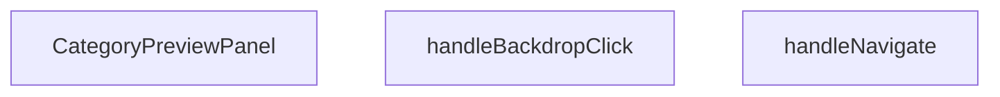

## Genel Bakış
Bu React modülü, ürün platformunda belirli bir ürün kategorisinin detaylarını açılır bir önizleme paneli olarak sunan bileşeni barındırır. Dışarıdan iletilen kategori verileri ve panelin açık/kapalı durumuna göre arayüzü render eder, kullanıcı etkileşimleriyle panelin çalışmasını yönetir.

## Fonksiyon Grupları
### Ana Önizleme Paneli Bileşeni
Modülün temel işlevini yerine getiren ana React bileşenidir, dışarıdan kategori bilgisi, panelin görünürlük durumu ve kapanma tetikleyicisini alarak önizleme arayüzünü oluşturur.
- CategoryPreviewPanel

### Kullanıcı Etkileşimi Yönetici Fonksiyonları
Panel içindeki kullanıcı hareketlerini işleyen yardımcı fonksiyonlardır, arka plana tıklama ve farklı sayfalara yönlendirme isteklerini yöneterek panelin davranışını kontrol eder.
- handleBackdropClick, handleNavigate

---

## AXIOMS – Mimari Varsayımlar
Bu React kategorisi önizleme paneli bileşeninin sorunsuz çalışması için, kendisine iletilen tüm prop'ların geçerli tiplerde olması, çalıştığı ortamın temel React olaylarını ve sayfa yönlendirme altyapısını desteklemesi zorunludur.

[Aksiyom 1]: Eğer component'e `category` prop'u geçerli bir kategori nesnesi olarak iletilmezse, panele herhangi bir kategori içeriği yüklenemez, kullanıcı boş bir panelle karşılaşır.
[Aksiyom 2]: Eğer component'e `isOpen` boolean tipinde açık/kapalı durumu belirten prop iletilmezse, panelin görünürlüğü yönetilemez, panel hiçbir zaman doğru şekilde açılamaz veya kapatılamaz.
[Aksiyom 3]: Eğer component'e `onClose` fonksiyon tipinde kapatma işlemini yöneten prop iletilmezse, tüm kullanıcı odaklı kapatma tetikleyicileri çalışmaz, panel sonsuza kadar açık kalır.
[Aksiyom 4]: Eğer çalıştığı ortam React.MouseEvent interface'ini desteklemiyorsa, `handleBackdropClick` fonksiyonu tetiklenemez, arka plana tıklayarak paneli kapatma özelliği devre dışı kalır.
[Aksiyom 5]: Eğer uygulamada sayfa yönlendirmesi için gerekli altyapı entegre edilmemişse, `handleNavigate` fonksiyonu çalışmaz, kullanıcı panelden ilgili kategori detay sayfasına yönlendirilemez.

---

## FONKSIYON DETAYLARI

### CategoryPreviewPanel
**Ne yapar**: Ürün kategorileri için sağdan açılan hızlı ön izleme (quick view) paneli olarak çalışan React fonksiyonel bileşenidir. Glassmorphism tema yapısına sahip bu panel, seçilen kategorinin temel bilgilerini kullanıcıya özet olarak sunar.
**Nasıl yapar**: Props aracılığıyla aldığı kategori verisi, panelin açık/kapalı durumu ve kapatma geri çağırma fonksiyonunu kullanarak panelin görünürlüğünü ve içeriğini yönetir. Panelin konumu, stili ve çalışma mantığı tanımlı tema ve kullanım senaryolarına uygun olarak yapılandırılır.
**Parametreler**:
- category: CategoryPreviewPanelProps kapsamında tanımlı kategori nesnesi — Panelde gösterilecek olan ürün kategorisinin tüm detaylarını içeren veri nesnesi
- isOpen: boolean — Panelin ekranda görünür olup olmadığını belirten durum değeri
- onClose: function — Kullanıcı panelden çıkmak istediğinde tetiklenerek panelin kapalı duruma geçmesini sağlayan geri çağırma fonksiyonu
**Dönüş**: CategoryPreviewPanelProps ile uyumlu React.FC (React Fonksiyonel Bileşeni) döndürür, bu bileşen ilgili ön izleme panelini DOM üzerinde render etmek üzere tasarlanmıştır.

### handleNavigate
**Ne yapar**: Ön izleme paneli içindeki kullanıcı gezinme işlemlerini yöneten olay işleyici fonksiyondur. Kullanıcıların panel içinden farklı içeriklere veya sayfalara yönlenmesini sağlamak için tasarlanmıştır.
**Nasıl yapar**: Yalnızca yan etki olarak çalışarak gerekli yönlendirme işlemlerini tetikler, herhangi bir değer üretmeden ilgili navigasyon akışını başlatır. Dönüş tipi tanımlanmamış olsa da gezinme işlemlerini sorunsuz bir şekilde yürütür.
**Parametreler**: Herhangi bir parametre almaz
**Dönüş**: Dönüş tipi belirtilmemiştir, genellikle sadece işlevini yerine getirerek herhangi bir değer döndürmez, void olarak çalışır.

### handleBackdropClick
**Ne yapar**: Ön izleme panelinin arka plan (backdrop) alanında gerçekleşen fare tıklama olaylarını yakalayan ve işleyen olay işleyici fonksiyondur. Genellikle arka plana tıklandığında panelin kapanması gibi temel kullanıcı etkileşimini sağlamak için kullanılır.
**Nasıl yapar**: Aldığı fare tıklama olay nesnesini kullanarak tıklamanın konumunu ve hedefini doğrular, eğer tıklama panele ait arka plan alanında gerçekleşmişse panelin kapatılması için ilgili işlemleri tetikler.
**Parametreler**:
- e: React.MouseEvent — Tarayıcı tarafından oluşturulan fare tıklama olayının tüm özelliklerini içeren React tabanlı olay nesnesi, tıklamanın hedefi, konumu gibi detayları barındırır
**Dönüş**: Dönüş tipi belirtilmemiştir, yalnızca olay işleme işlemini gerçekleştirerek herhangi bir değer döndürmez, void olarak çalışır.

---

## INTERFACES

### CategoryPreviewData
- `id: string`
- `title: string`
- `description: string`
- `image: string`
- `icon?: React.ReactNode`
- `color?: string`
- `productCount?: number`
- `priceRange?: { min: number; max: number }`

### CategoryPreviewPanelProps
- `category: CategoryPreviewData | null`
- `isOpen: boolean`
- `onClose: () => void`

---

## AST POINTERS

### [N1_NASIL] AST Pointer: C:\Users\alize\venthub-hvac\src\components\products\CategoryPreviewPanel.tsx::CategoryPreviewPanel
- **params**: category, isOpen, onClose
- **ic_degiskenler**:
  - `router` — Next.js `useRouter` hook'u ile alınan uygulama yönlendiricisi
  - `t` — `useI18n` hook'u ile alınan çeviri metinleri getiren fonksiyon
  - `handleNavigate` — kategori detay sayfasına yönlendirme işlemini yapan iç fonksiyon
  - `handleBackdropClick` — panel arka planına tıklandığında paneli kapatma işlemini yapan iç fonksiyon
  - `React.useEffect` — ESC tuşu dinleyicisi ekleyip çıkaran, panel açıkken ana sayfa kaydırmasını devre dışı bırakan efekt hook'u
  - `category.icon` — kategorinin arayüz ikonu, panel başlığında gösterilir
  - `category.color` — kategori için tanımlanan renk gradyanı, ikon ve CTA buton arka planında kullanılır
  - `category.title` — kategori başlığı, panel başlığı, görsel alternatif metninde kullanılır
  - `category.image` — kategori kapak görseli, panel içeriğinde gösterilir
  - `category.description` — kategori açıklama metni, panel içeriğinde yazılır
  - `category.productCount` — kategorideki toplam ürün sayısı, istatistik kartında gösterilir
  - `category.priceRange.min` — kategorideki ürünlerin minimum fiyatı, fiyat aralığı kartında kullanılır
  - `category.priceRange.max` — kategorideki ürünlerin maksimum fiyatı, fiyat aralığı kartında kullanılır
  - `document` — global DOM nesnesi, klavye olay dinleyicisi eklemek için kullanılır
  - `document.body.style.overflow` — ana sayfa kaydırmasını kontrol etmek için kullanılan CSS özelliği
- **Dönüş**: JSX React elemanı ( kategori önizleme panelinin arayüzünü oluşturur)

### [N2_NASIL] AST Pointer: C:\Users\alize\venthub-hvac\src\components\products\CategoryPreviewPanel.tsx::handleNavigate
- **params**: (parametre yok)
- **ic_degiskenler**:
  - `category` — üst kapsamdan alınan kategori nesnesi, null/undefined olup olmadığı kontrol edilir
  - `router` — üst kapsamdan alınan yönlendirici, kategori detay sayfasına yönlendirmek için kullanılır
  - `Routes.category` — rota üretici fonksiyon, kategori kimliğine göre doğru rota oluşturur
  - `category.id` — kategorinin benzersiz kimliği, rota oluştururken kullanılır
  - `onClose` — paneli kapatmak için çağrılan callback fonksiyonu
- **Dönüş**: yok

### [N3_NASIL] AST Pointer: C:\Users\alize\venthub-hvac\src\components\products\CategoryPreviewPanel.tsx::handleBackdropClick
- **params**: e: React.MouseEvent
- **ic_degiskenler**:
  - `e.target` — tıklanan DOM elemanı, olayın doğrudan hedefini belirtir
  - `e.currentTarget` — olayı dinleyen arka plan DOM elemanı, sadece arka plana tıklanması kontrol edilir
  - `onClose` — paneli kapatmak için çağrılan callback fonksiyonu
- **Dönüş**: yok

### [N4_NASIL] AST Pointer: C:\Users\alize\venthub-hvac\src\components\products\CategoryPreviewPanel.tsx::handleEsc
- **params**: e: KeyboardEvent
- **ic_degiskenler**:
  - `e.key` — basılan klavye tuşunun adı, Escape tuşu olup olmadığı kontrol edilir
  - `onClose` — paneli kapatmak için çağrılan callback fonksiyonu, ESC tuşuna basıldığında çalışır
- **Dönüş**: yok

### [N5_NASIL] AST Pointer: C:\Users\alize\venthub-hvac\src\components\products\CategoryPreviewPanel.tsx::useEffectCleanup
- **params**: (parametre yok)
- **ic_degiskenler**:
  - `document` — global DOM nesnesi, klavye olay dinleyicisini kaldırmak için kullanılır
  - `handleEsc` — daha önce eklenen klavye olay dinleyici fonksiyonu, efekt temizliğinde kaldırılır
  - `document.body.style.overflow` — ana sayfa kaydırmasını panel kapandıktan sonra eski haline getiren CSS özelliği
- **Dönüş**: yok

---

## MERMAID CALL GRAPH

## NODE ID STANDARD

  file: src\components\products\CategoryPreviewPanel.tsx
  function: src\components\products\CategoryPreviewPanel.tsx::CategoryPreviewPanel
  function: src\components\products\CategoryPreviewPanel.tsx::handleNavigate
  function: src\components\products\CategoryPreviewPanel.tsx::handleBackdropClick

---

## DISA AKTARILANLAR (EXPORTS)
  export: CategoryPreviewData
  export: CategoryPreviewPanel