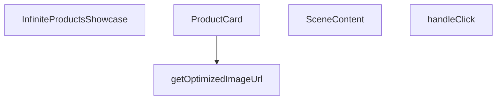

## Genel Bakış
Bu modül, ürünleri Three.js tabanlı 3B bir sahnede sonsuz kaydırma mantığıyla sergileyen React bileşenidir. Görsel optimizasyonu, etkileşimli ürün kartlarını ve 3B sahne yönetimini tek bir bileşen yapısında birleştirerek kullanıcıya akıcı bir vitrin deneyimi sunar.

## Fonksiyon Grupları
### Görsel Optimizasyonu
Ürün görsellerinin boyut ve format açısından optimize edilerek sunulmasını sağlayan yardımcı işlevi kapsar.
- getOptimizedImageUrl

### Kullanıcı Arayüzü Bileşenleri
Ürün kartlarının görsel ve etkileşimli yapısını, bu kartların 3B sahne içinde nasıl yerleştirileceğini tanımlayan bileşenleri içerir.
- ProductCard, SceneContent

### Olay İşleyicisi
Kullanıcının ürün kartlarına tıklama gibi etkileşimlerini yakalayıp ilgili tepkileri tetikleyen işlevleri barındırır.
- handleClick

### Ana Bileşen
Ürün listesini alarak sonsuz kaydırma mantığını uygular ve tüm alt bileşenleri bir araya getirerek tamamlı vitrini render eder.
- InfiniteProductsShowcase

---

## AXIOMS – Mimari Varsayımlar

Bu modül için, verilen fonksiyon imzalarına dayanan temel mimari varsayımlar şunlardır:

[Aksiyom 1]: Eğer `getOptimizedImageUrl` fonksiyonuna geçerli bir görsel URL'si (`url`) veya geçerli bir genişlik (`width`) parametresi verilmezse, işlevsel olmayan veya hatalı bir görsel URL'si döndürülür.

[Aksiyom 2]: Eğer `ProductCard` bileşenine geçerli bir `item` nesnesi (içeriğinde gerekli ürün bilgilerini taşıması beklenen) sağlanmazsa, bileşen ürün kartını doğru şekilde render edemez.

[Aksiyom 3]: Eğer `handleClick` olay işleyicisine geçerli bir `ThreeEvent<MouseEvent>` nesnesi verilmezse (örn. `e` parametresi null veya tanımsız ise), tıklama olayı beklenen şekilde işlenemez.

[Aksiyom 4]: Eğer `SceneContent` bileşenine geçerli bir `items` dizisi (en az bir ürün içermesi beklenen) sağlanmazsa veya `items` bir dizi değilse, sahne içeriği boş render edilir.

[Aksiyom 5]: Eğer `InfiniteProductsShowcase` ana bileşenine geçerli bir `items` dizisi (ürün listesini içermesi gereken) verilmezse, sonsuz kaydırmalı vitrin gösterimi başarısız olur ve bileşen boş render edilir.

---

## FONKSİYON DETAYLARI

### getOptimizedImageUrl
**Ne yapar**: Üç.js dokuları için next/image optimizasyonunu taklit eden yardımcı bir fonksiyondur. Bir görsel URL'sini alıp optimize edilmiş bir versiyonunu döndürür.
**Nasıl yapar**: (Belirtilmemiş; işlev gövdesi verilmemiştir.)
**Parametreler**:
- url: string — Optimize edilecek görselin URL adresi.
- width: (tip belirtilmemiş) — Görselin genişlik değeri.
**Dönüş**: void (veya bilinmiyor — kesin dönüş tipi verilmemiştir.)

### ProductCard
**Ne yapar**: Görsel ve başlık içeren bir ürün kartı bileşenidir. drei/Image kullanılarak optimize edilmiş bir görsel yükleme sunar.
**Nasıl yapar**: Ürün öğesini (`item`), indeksini ve kapsayıcı bilgilerini alarak bir 3D sahne içinde kartı oluşturur. Scroll offseti ve duraklama durumu gibi özellikleri yönetir.
**Parametreler**:
- item: ProductItem — Gösterilecek ürünün veri nesnesi.
- index: number — Ürünler listesindeki sıra numarası.
- total: number — Toplam ürün sayısı.
- gap: number — Kartlar arasındaki boşluk miktarı.
- scrollOffset: React.MutableRefObject<number> — Kaydırma konumunu referans olarak tutan nesne.
- isPaused: boolean — Otomatik kaydırmanın duraklatılıp duraklatılmadığını belirtir.
- onHover: (hovering: boolean) => void — Fare üzerine gelme olayında çağrılan callback fonksiyonu.
**Dönüş**: React.FC — Bir React fonksiyonel bileşeni döndürür.

### handleClick
**Ne yapar**: Ürün kartına tıklandığında tetiklenen olay işleyicisidir.
**Nasıl yapar**: (İç mantık belirtilmemiştir.)
**Parametreler**:
- e: ThreeEvent<MouseEvent> — Three.js üzerinden gelen fare tıklama olayı.
**Dönüş**: void (veya bilinmiyor — kesin dönüş tipi verilmemiştir.)

### SceneContent
**Ne yapar**: Performans odaklı otomatik kaydırma özelliğine sahip 3D sahne içeriği bileşenidir. Ürün kartlarını üç boyutlu uzayda düzenler ve otomatik olarak kaydırır.
**Nasıl yapar**: Öğeler listesini (`items`) alarak her bir öğe için `ProductCard` bileşeni oluşturur. `isPaused` ve `onHover` aracılığıyla kaydırma davranışını ve etkileşimleri yönetir.
**Parametreler**:
- items: ProductItem[] — Görüntülenecek ürün öğelerinin dizisi.
- isPaused: boolean — Otomatik kaydırmanın duraklatılıp duraklatılmadığını belirtir.
- onHover: (h: boolean) => void — Fare üzerine gelme olayında çağrılan callback fonksiyonu.
**Dönüş**: React.FC — Bir React fonksiyonel bileşeni döndürür.

### InfiniteProductsShowcase
**Ne yapar**: Ana optimize edilmiş 3D vitrin bileşenidir. next/image benzeri doku optimizasyonu, drei/Image ile azaltılmış çizim çağrıları ve uyarlanabilir performans ölçekleme gibi özellikler sunar. Sonsuz otomatik kaydırma sağlar.
**Nasıl yapar**: Kendisine iletilen ürün öğelerini (`items`) alarak bir `SceneContent` bileşeni oluşturur ve tüm vitrin mantığını bu alt bileşene devreder.
**Parametreler**:
- items: ProductItem[] — Vitrinde sergilenecek ürün öğeleri dizisi.
**Dönüş**: React.FC<InfiniteProductsShowcaseProps> — `InfiniteProductsShowcaseProps` prop tipine sahip bir React fonksiyonel bileşeni döndürür.

---

## INTERFACES

### ProductItem
- `id: string`
- `title: string`
- `image: string`

### InfiniteProductsShowcaseProps
- `items: ProductItem[]`

---

## AST POINTERS

### [N1_NASIL] AST Pointer: src/components/products/InfiniteProductsShowcase.tsx::getOptimizedImageUrl
- **params**: `url: string`, `width: number` (varsayılan 400)
- **ic_degiskenler**:
  - `base` — `url` stringinden query string (`?`之后) bölümü çıkarılmış temel URL; Supabase path manipülasyonunda kullanılır
  - `renderUrl` — `base` içindeki `/object/` segmenti `/render/image/` ile değiştirilmiş render-uyumlu URL
- **Dönüş**: string — Supabase görseli için optimize edilmiş webp render URL'i veya orijinal `url` (Supabase değilse)

---

## MERMAID CALL GRAPH

## NODE ID STANDARD

  file: src\components\products\InfiniteProductsShowcase.tsx
  function: src\components\products\InfiniteProductsShowcase.tsx::getOptimizedImageUrl
  function: src\components\products\InfiniteProductsShowcase.tsx::ProductCard
  function: src\components\products\InfiniteProductsShowcase.tsx::handleClick
  function: src\components\products\InfiniteProductsShowcase.tsx::SceneContent
  function: src\components\products\InfiniteProductsShowcase.tsx::InfiniteProductsShowcase

---

## DISA AKTARILANLAR (EXPORTS)
  export: InfiniteProductsShowcase
  export: ProductCard
  export: SceneContent
  export: getOptimizedImageUrl

---

## STİL TOKENLERİ

### Arbitrary Değerler (token'a geçirilmemiş)
Yok — tüm stiller token'a geçirilmiş. ✅

### Kullanılan Token'lar (zaten token'a geçirilmiş)
- `tracking-hvac-normal`

### Tailwind Sınıf Özeti
- **Renkler:** `bg-cyan-400`, `bg-cyan-500`, `bg-gradient-to-l`, `bg-gradient-to-r`, `bg-slate-900/50`, `bg-surface-darker`, `border-slate-800`, `from-surface-darker`, `text-cyan-400`, `text-xs`, `to-transparent`, `via-surface-darker/40`
- **Layout:** `absolute`, `backdrop-blur-md`, `bottom-6`, `flex`, `from-surface-darker`, `gap-3`, `h-2`, `h-full`, `h-showcase`, `hidden`, `inline-flex`, `items-center`, `left-0`, `left-1/2`, `overflow-hidden`
- **Varyant/Responsive:** `:`, `group-hover/canvas:` önekleri
- **Yardımcı Sınıflar:** `${isPaused`, `-translate-x-1/2`, `:`, `animate-ping`, `border`, `content-auto-showcase`, `duration-500`, `font-mono`, `group-hover/canvas:opacity-100`, `group/canvas`, `inset-y-0`, `opacity-60`, `opacity-75`, `pointer-events-none`, `px-4`