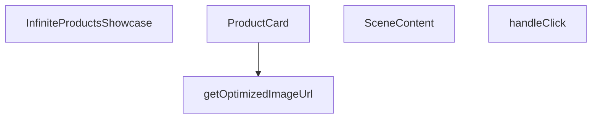

## Genel Bakış
Bu modül, Three.js/react-three-fiber altyapısını kullanarak ürün listesini 3D ortamda sonsuz kaydırmalı (infinite scroll) bir vitrin olarak sergileyen bir React bileşenidir. Ürün kartlarının animasyonlu gösterimi, hover etkileşimi ve görsel optimizasyonu gibi temel özellikleri içerir.

## Fonksiyon Grupları

### Ana Bileşen ve Sahne Yönetimi
Ana bileşen, dışarıdan gelen ürün listesini alır ve 3D sahne yapısını kurar. Sahne içeriği, ürünlerin konumlandırılması ve animasyon kontrolü gibi sorumlulukları üstlenir.
- InfiniteProductsShowcase, SceneContent

### Ürün Kartı ve Etkileşim
Tek bir ürünün 3D kart olarak render edilmesinden, tıklama olayının işlenmesinden ve hover durumunun yönetilmesinden sorumludur. Kart, kaydırma offset'i ve duraklatma durumuna göre konumlanır.
- ProductCard, handleClick

### Yardımcı Fonksiyonlar
Ürün görsellerinin istemci tarafında optimize edilmiş URL'lerinin üretilmesinden sorumludur. Belirli bir genişlik parametresine göre görsel boyutu ayarlanır.
- getOptimizedImageUrl

---

## AXIOMS – Mimari Varsayımlar

[Aksiyom 1]: Eğer `ProductItem` tipi tanımlı değilse, `ProductCard`, `SceneContent` ve `InfiniteProductsShowcase` bileşenleri derleme hatası verir.

[Aksiyom 2]: Eğer `items` prop'u bir dizi değilse, `SceneContent` ve `InfiniteProductsShowcase` bileşenleri beklenen davranışı göstermez.

[Aksiyom 3]: Eğer `scrollOffset` bir `React.MutableRefObject<number>` değilse, `ProductCard` bileşeni scroll konumunu doğru şekilde takip edemez.

[Aksiyom 4]: Eğer `onHover` bir fonksiyon değilse, `ProductCard` ve `SceneContent` bileşenleri hover durumunu üst bileşene bildiremez.

[Aksiyom 5]: Eğer `getOptimizedImageUrl` fonksiyonuna geçerli bir `url` string'i verilmezse, optimize edilmiş görsel URL'si üretilemez.

[Aksiyom 6]: Eğer `handleClick` fonksiyonuna geçerli bir `ThreeEvent<MouseEvent>` event'i verilmezse, Three.js sahnesindeki tıklama olayı işlenemez.

---

## FONKSİYON DETAYLARI

### getOptimizedImageUrl
**Ne yapar**: Three.js dokuları için next/image benzeri optimizasyon sağlayan yardımcı bir görüntü yükleyici fonksiyonudur. Görüntü URL'sini alır ve belirli bir genişliğe göre optimize edilmiş bir URL döndürür.

**Nasıl yapar**: Verilen görüntü URL'sini ve genişlik parametresini kullanarak optimize edilmiş bir görüntü URL'si oluşturur. next/image optimizasyon mantığını Three.js dokuları için taklit eder. Gövde içinde `() => getOptimizedImageUrl(item.image)` şeklinde bir kullanım gösterilmiştir; bu, fonksiyonun bir item nesnesinin image özelliğini alarak çağrıldığını gösterir.

**Parametreler**:
- url: string — Optimize edilecek görüntünün orijinal URL'si
- width: bilinmiyor — Görüntünün optimize edileceği hedef genişlik değeri

**Dönüş**: bilinmiyor — Kaynakta dönüş tipi belirtilmemiştir

### ProductCard
**Ne yapar**: Geliştirildi ancak detay üretilemedi.

### handleClick
**Ne yapar**: Geliştirildi ancak detay üretilemedi.

### SceneContent
**Ne yapar**: Geliştirildi ancak detay üretilemedi.

### InfiniteProductsShowcase
**Ne yapar**: Geliştirildi ancak detay üretilemedi.

---

## İTHALATLAR (IMPORTS)
- import: ../../hooks/useLocalizedRoutes::useLocalizedRoutes
- import: ./3d/core::VentHubCanvas
- import: @react-three/fiber::ThreeEvent
- import: @react-three/fiber::useFrame
- import: @react-three/fiber::useThree
- import: next/navigation::useRouter
- import: react::React
- import: react::Suspense
- import: react::useMemo
- import: react::useRef
- import: react::useState
- import: three::MathUtils
- import: three::type { Group, Mesh, MeshStandardMaterial }

---

## INTERFACES

### ProductItem
- `id: string`
- `title: string`
- `image: string`

### InfiniteProductsShowcaseProps
- `items: ProductItem[]`

---

## AST POINTERS

### [N1_NASIL] AST Pointer: InfiniteProductsShowcase.tsx::getOptimizedImageUrl
- **params**: `url` (string), `width` (varsayılan 400)
- **ic_degiskenler**:
  - `url` — kontrol edilen URL parametresi; boşsa kendisi döner
  - `width` — genişlik değeri, varsayılan 400; query string'e eklenir
  - `base` — `url.split('?')[0]` sonucu, URL'nin query string olmayan kısmı
  - `renderUrl` — `base`'in `/object/` içerip içermediğine göre düzenlenen URL; içeriyorsa `/render/image/` ile değiştirilir
- **Dönüş**: string — optimize edilmiş URL (`?width=...&quality=75&format=webp` eklenmiş) veya orijinal URL

### [N2_NASIL] AST Pointer: InfiniteProductsShowcase.tsx::ProductCard
- **params**: `item` (ProductItem), `index` (number), `total` (number), `gap` (number), `scrollOffset` (React.MutableRefObject<number>), `isPaused` (boolean), `onHover` ((hovering: boolean) => void)
- **ic_degiskenler**:
  - `groupRef` — `useRef<Group>(null)`, 3D grup referansı; `useFrame` içinde pozisyon ve rotasyon atanır
  - `imageRef` — `useRef<Mesh>(null)`, mesh referansı; hover zoom ve emissive efekti için kullanılır
  - `router` — `useRouter()`, Next.js router; `handleClick` içinde `router.push` ile navigasyon sağlar
  - `Routes` — `useLocalizedRoutes()`, yerelleştirilmiş rotalar; `Routes.category(item.id)` ile ürün sayfası URL'si oluşturulur
  - `hovered` — `useState(false)`, hover durumu; zoom ve glow efektlerini tetikler
  - `setHover` — `useState` setter; `onPointerOver`/`onPointerOut` olaylarında hover durumunu günceller
  - `optimizedUrl` — `useMemo(() => getOptimizedImageUrl(item.image), [item.image])` ile hesaplanan optimize edilmiş görsel URL'si
  - `sphereWidth` — `total * gap`, tüm ürünlerin toplam genişliği; sonsuz kaydırma döngüsü için modulo hesabında kullanılır
  - `handleClick` — `(e: ThreeEvent<MouseEvent>) => { e.stopPropagation(); router.push(Routes.category(item.id)) }` tıklama handler'ı
- **Dönüş**: JSX element — `<group>` içinde `<Float>`, `<DreiImage>`, hover'da `<mesh>` (glow ring), `<Text>` bileşenleri

### [N3_NASIL] AST Pointer: InfiniteProductsShowcase.tsx::handleClick (ProductCard içinde)
- **params**: `e` (ThreeEvent<MouseEvent>)
- **ic_degiskenler**:
  - `e` — tıklama olayı; `e.stopPropagation()` ile üst bileşenlere yayılımı engellenir
- **Dönüş**: yok — yan etki olarak `router.push(Routes.category(item.id))` çağrısı yapar

### [N4_NASIL] AST Pointer: InfiniteProductsShowcase.tsx::SceneContent
- **params**: `items` (ProductItem[]), `isPaused` (boolean), `onHover` ((h: boolean) => void)
- **ic_degiskenler**:
  - `gap` — sabit değer `5`; ürünler arası mesafe olarak kullanılır
  - `scrollOffset` — `useRef(0)`, kaydırma ofseti; `useFrame` içinde `delta * 0.02` kadar artırılır, 1'i geçince sıfırlanır
  - `camera` — `useThree()` ile alınan kamera nesnesi; `useFrame` içinde `MathUtils.lerp` ile nefes alma efekti uygulanır
  - `state` — `useFrame` callback'inin ilk parametresi; `state.clock.elapsedTime` kamera nefes alma animasyonunda kullanılır
  - `delta` — `useFrame` callback'inin ikinci parametresi; scrollOffset artış hızı için kullanılır
- **Dönüş**: JSX element — `<Bvh>` içinde `<group>`, `items.map` ile `<ProductCard>` listesi, zemin düzlemi (`<mesh>`), parçacıklar (`<Sparkles>`)

### [N5_NASIL] AST Pointer: InfiniteProductsShowcase.tsx::InfiniteProductsShowcase
- **params**: `items` (InfiniteProductsShowcaseProps.items)
- **ic_degiskenler**:
  - `isPaused` — `useState(false)`, duraklatma durumu; `SceneContent`'e `onHover` olarak `setIsPaused` gönderilir, hover'da true olur
  - `setIsPaused` — `useState` setter; `SceneContent` bileşeninin `onHover` prop'u olarak kullanılır
- **Dönüş**: JSX element veya `null` — `items` boşsa `null` döner; aksi halde `
` içinde `<VentHubCanvas>`, `<SceneContent>`, overlay talimatları ve sinematik gradient maskeleri render eder

---

## MERMAID CALL GRAPH

## NODE ID STANDARD

  file: InfiniteProductsShowcase.tsx
  function: InfiniteProductsShowcase.tsx::getOptimizedImageUrl
  function: InfiniteProductsShowcase.tsx::ProductCard
  function: InfiniteProductsShowcase.tsx::handleClick
  function: InfiniteProductsShowcase.tsx::SceneContent
  function: InfiniteProductsShowcase.tsx::InfiniteProductsShowcase

---

## DISA AKTARILANLAR (EXPORTS)
  export: InfiniteProductsShowcase
  export: ProductCard
  export: SceneContent
  export: getOptimizedImageUrl

---

## STİL TOKENLERİ

### Arbitrary Değerler (token'a geçirilmemiş)
Yok — tüm stiller token'a geçirilmiş. ✅

### Kullanılan Token'lar (zaten token'a geçirilmiş)
- `tracking-hvac-normal`

### Tailwind Sınıf Özeti
- **Renkler:** `bg-cyan-400`, `bg-cyan-500`, `bg-gradient-to-l`, `bg-gradient-to-r`, `bg-slate-900/50`, `bg-surface-darker`, `border-slate-800`, `from-surface-darker`, `text-cyan-400`, `text-xs`, `to-transparent`, `via-surface-darker/40`
- **Layout:** `absolute`, `backdrop-blur-md`, `bottom-6`, `flex`, `from-surface-darker`, `gap-3`, `h-2`, `h-full`, `h-showcase`, `hidden`, `inline-flex`, `items-center`, `left-0`, `left-1/2`, `overflow-hidden`
- **Varyant/Responsive:** `:`, `group-hover/canvas:` önekleri
- **Yardımcı Sınıflar:** `${isPaused`, `-translate-x-1/2`, `:`, `animate-ping`, `border`, `content-auto-showcase`, `duration-500`, `font-mono`, `group-hover/canvas:opacity-100`, `group/canvas`, `inset-y-0`, `opacity-60`, `opacity-75`, `pointer-events-none`, `px-4`