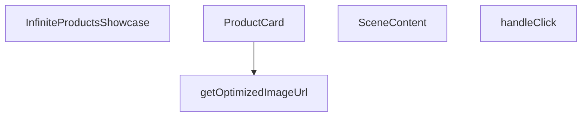

## Genel Bakış
Bu modül, Three.js tabanlı 3B sahnede ürünleri sonsuz kaydırma (infinite scroll) mantığıyla sergileyen bir React vitrin bileşenidir. Görsel optimizasyon, interaktif kart yapısı ve sahne yönetimini bir araya getirerek akıcı bir 3D ürün deneyimi sunar.

## Fonksiyon Grupları

### Görsel Optimizasyonu
Ürün görsellerinin URL'lerini istenen boyuta göre optimize ederek 3B sahne için uygun hale getirir.
- getOptimizedImageUrl

### Sahne Bileşenleri
3B sahne içindeki ürün kartlarının yerleşimini, animasyonunu ve sahne yapısını yöneten bileşenleri kapsar.
- ProductCard, SceneContent

### Etkileşim Yönetimi
Kullanıcının ürün kartlarıyla fare etkileşimlerini yakalayarak ilgili tepkileri tetikler.
- handleClick

### Ana Bileşen
Tüm alt bileşenleri bir araya getirerek sonsuz kaydırma mantığını uygular ve tam vitrini render eder.
- InfiniteProductsShowcase

---

## AXIOMS – Mimari Varsayımlar

Bu modül, Three.js 3B sahne ortamında sonsuz kaydırmalı ürün vitrini sunan bir React bileşenidir. Aşağıda modülün doğru çalışması için gereken mimari varsayımlar listelenmektedir.

---

**[Aksiyom 1]:** Eğer `getOptimizedImageUrl` fonksiyonuna geçilen `width` parametresi geçerli (pozitif, tanımlı bir sayı) değilse, görsel URL'i düzgün oluşturulmaz ve görsel optimizasyonu başarısız olur.

**[Aksiyom 2]:** Eğer `ProductCard` bileşenine geçirilen `scrollOffset` bir `React.MutableRefObject<number>` tipinde değilse, kaydırma ofseti paylaşılamaz ve sonsuz kaydırma senkronizasyonu bozulur.

**[Aksiyom 3]:** Eğer `InfiniteProductsShowcase` bileşenine geçirilen `items` boş bir dizi (`[]`) ise, sahne içinde rendered edilecek herhangi bir ürün kartı olmaz ve boş bir vitrin görüntülenir.

**[Aksiyom 4]:** Eğer `handleClick` fonksiyonuna Three.js dışı (örn: DOM tabanlı) bir MouseEvent geçirilirse, ThreeEvent<MouseEvent> tipi eşleşmez ve tıklama işleme başarısız olur veya beklenmeyen davranış oluşur.

**[Aksiyom 5]:** Eğer `ProductCard` bileşenine geçirilen `item` parametresi `ProductItem` tipinin beklediği alanları (örn: görsel URL'i) içermiyorsa, ürün kartı düzgün render edilemez.

**[Aksiyom 6]:** Eğer `SceneContent` bileşenine geçirilen `items` dizisi `ProductItem[]` tipiyle uyumsuz elemanlar içerirse, 3B sahne bileşenleri beklenmeyen veri nedeniyle hata verir.

**[Aksiyom 7]:** Eğer `isPaused` parametresi `boolean` tipinde değilse, kaydırma durdurma/devam ettirme mantığı düzgün çalışmaz ve animasyon kontrolü kaybedilir.

**[Aksiyom 8]:** Eğer `getOptimizedImageUrl` fonksiyonuna geçilen `url` boş string veya geçersiz bir URI ise, görsel optimizasyonu başarısız olur ve tarayıcıda kırık görsel ikonu görüntülenir.

---

## FONKSİYON DETAYLARI

### getOptimizedImageUrl
**Ne yapar**: Üç.js dokuları için next/image optimizasyonunu taklit eden yardımcı bir fonksiyondur. Bir görsel URL'sini alıp optimize edilmiş bir versiyonunu döndürür.
**Nasıl yapar**: (Belirtilmemiş; işlev gövdesi verilmemiştir.)
**Parametreler**:
- url: string — Optimize edilecek görselin URL adresi.
- width: (tip belirtilmemiş) — Görselin genişlik değeri.
**Dönüş**: void (veya bilinmiyor — kesin dönüş tipi verilmemiştir.)

### ProductCard
**Ne yapar**: Görsel ve başlık içeren bir ürün kartı bileşenidir. drei/Image kullanılarak optimize edilmiş bir görsel yükleme sunar.
**Nasıl yapar**: Ürün öğesini (`item`), indeksini ve kapsayıcı bilgilerini alarak bir 3D sahne içinde kartı oluşturur. Scroll offseti ve duraklama durumu gibi özellikleri yönetir.
**Parametreler**:
- item: ProductItem — Gösterilecek ürünün veri nesnesi.
- index: number — Ürünler listesindeki sıra numarası.
- total: number — Toplam ürün sayısı.
- gap: number — Kartlar arasındaki boşluk miktarı.
- scrollOffset: React.MutableRefObject<number> — Kaydırma konumunu referans olarak tutan nesne.
- isPaused: boolean — Otomatik kaydırmanın duraklatılıp duraklatılmadığını belirtir.
- onHover: (hovering: boolean) => void — Fare üzerine gelme olayında çağrılan callback fonksiyonu.
**Dönüş**: React.FC — Bir React fonksiyonel bileşeni döndürür.

### handleClick
**Ne yapar**: Ürün kartına tıklandığında tetiklenen olay işleyicisidir.
**Nasıl yapar**: (İç mantık belirtilmemiştir.)
**Parametreler**:
- e: ThreeEvent<MouseEvent> — Three.js üzerinden gelen fare tıklama olayı.
**Dönüş**: void (veya bilinmiyor — kesin dönüş tipi verilmemiştir.)

### SceneContent
**Ne yapar**: Performans odaklı otomatik kaydırma özelliğine sahip 3D sahne içeriği bileşenidir. Ürün kartlarını üç boyutlu uzayda düzenler ve otomatik olarak kaydırır.
**Nasıl yapar**: Öğeler listesini (`items`) alarak her bir öğe için `ProductCard` bileşeni oluşturur. `isPaused` ve `onHover` aracılığıyla kaydırma davranışını ve etkileşimleri yönetir.
**Parametreler**:
- items: ProductItem[] — Görüntülenecek ürün öğelerinin dizisi.
- isPaused: boolean — Otomatik kaydırmanın duraklatılıp duraklatılmadığını belirtir.
- onHover: (h: boolean) => void — Fare üzerine gelme olayında çağrılan callback fonksiyonu.
**Dönüş**: React.FC — Bir React fonksiyonel bileşeni döndürür.

### InfiniteProductsShowcase
**Ne yapar**: Ana optimize edilmiş 3D vitrin bileşenidir. next/image benzeri doku optimizasyonu, drei/Image ile azaltılmış çizim çağrıları ve uyarlanabilir performans ölçekleme gibi özellikler sunar. Sonsuz otomatik kaydırma sağlar.
**Nasıl yapar**: Kendisine iletilen ürün öğelerini (`items`) alarak bir `SceneContent` bileşeni oluşturur ve tüm vitrin mantığını bu alt bileşene devreder.
**Parametreler**:
- items: ProductItem[] — Vitrinde sergilenecek ürün öğeleri dizisi.
**Dönüş**: React.FC<InfiniteProductsShowcaseProps> — `InfiniteProductsShowcaseProps` prop tipine sahip bir React fonksiyonel bileşeni döndürür.

---

## İTHALATLAR (IMPORTS)
- import: ../../hooks/useLocalizedRoutes::useLocalizedRoutes
- import: ./3d/core::VentHubCanvas
- import: @react-three/fiber::ThreeEvent
- import: @react-three/fiber::useFrame
- import: @react-three/fiber::useThree
- import: next/navigation::useRouter
- import: react::React
- import: react::Suspense
- import: react::useMemo
- import: react::useRef
- import: react::useState
- import: three::MathUtils
- import: three::type { Group, Mesh, MeshStandardMaterial }

---

## INTERFACES

### ProductItem
- `id: string`
- `title: string`
- `image: string`

### InfiniteProductsShowcaseProps
- `items: ProductItem[]`

---

## AST POINTERS

### [N1_NASIL] AST Pointer: InfiniteProductsShowcase.tsx::getOptimizedImageUrl
- **params**: `url: string`, `width = 400`
- **ic_degiskenler**:
  - `base` — Supabase URL'sinden query string (`?` sonrası) bölümü kaldırılmış temel URL; `/object/` yolunu tespit etmek için kullanılır
  - `renderUrl` — Supabase image transform endpoint'ine dönüştürülmüş URL (`/object/` → `/render/image/`); optimizeli görsel isteği gönderilir
- **Dönüş**: `string` — Supabase görseli ise width/quality/format parametreli render URL, değilse orijinal URL aynen döner; boş `url` gelirse yine aynen döner

---

### [N2_NASIL] AST Pointer: InfiniteProductsShowcase.tsx::ProductCard
- **params**: `item`, `index`, `total`, `gap`, `scrollOffset: React.MutableRefObject<number>`, `isPaused: boolean`, `onHover: (hovering: boolean) => void`
- **ic_degiskenler**:
  - `groupRef` — `useRef<Group>(null)`: Ürün kartının 3D group referansı; useFrame içinde position ve rotation güncellenir
  - `imageRef` — `useRef<Mesh>(null)`: Ürün görselinin mesh referansı; hover'da scale lerp ve emissive pulse efekti uygulanır
  - `router` — `useRouter()`: Next.js navigasyon hook'u; ürün tıklamasında rota geçişi için kullanılır
  - `Routes` — `useLocalizedRoutes()`: Localized rota oluşturucu hook; `Routes.category(item.id)` ile kategori sayfasına yönlendirme yapılır
  - `hovered` — `useState(false)`: Ürün kartının hover durumunu tutar; mouse üzerine gelince `true`, ayrılınca `false` olur; scale ve renk değişimini tetikler
  - `optimizedUrl` — `useMemo(() => getOptimizedImageUrl(item.image), [item.image])`: `item.image` değiştiğinde optimize edilmiş görsel URL'sini hesaplar; DreiImage'e verilir
  - `sphereWidth` — `total * gap`: Tüm ürünlerin kapladığı toplam yatay genişlik; sonsuz kaydırma sarmalama (modulo) hesabında kullanılır
- **Dönüş**: JSX — `<group>` içinde Float sarmalı, DreiImage (ürün görseli), koşullu hover glow halkası (`ringGeometry + meshBasicMaterial`) ve ürün başlığı `Text` bileşeni

**ProductCard → useFrame callback** (`state, _delta`):
- **ic_degiskenler**:
  - `offset` — `scrollOffset.current`: Dışarıdan gelen kaydırma offset değeri; mevcut frame'deki scroll pozisyonunu tutar
  - `xPos` — hesaplanmış yatay pozisyon; `(index * gap) - (offset * sphereWidth)` formülüyle belirlenir, sonra modulo ile `[−sphereWidth/2, sphereWidth/2]` aralığına sarılır
  - `targetScale` — hover durumuna göre hedef ölçek: `true` ise `1.15`, `false` ise `1.0`; `MathUtils.lerp` ile yumuşak geçiş sağlar
  - `mat` — `imageRef.current.material as MeshStandardMaterial`: Ürün görselinin materyal referansı; hover pulse efekti için `emissiveIntensity` güncellenir

**ProductCard → handleClick** (`e: ThreeEvent<MouseEvent>`):
- **ic_degiskenler**: yok (closure içindeki `router`, `Routes`, `item` kullanılır)
- **Dönüş**: yok — `e.stopPropagation()` ile event yayılımını durdurur, ardından `router.push(Routes.category(item.id))` ile ürün detayına navigasyon yapar

---

### [N3_NASIL] AST Pointer: InfiniteProductsShowcase.tsx::SceneContent
- **params**: `items: ProductItem[]`, `isPaused: boolean`, `onHover: (h: boolean) => void`
- **ic_degiskenler**:
  - `gap` — `const gap = 5`: Ürün kartları arasındaki sabit yatay boşluk (birim); `ProductCard`'lara prop olarak aktarılır
  - `scrollOffset` — `useRef(0)`: Paylaşılan kaydırma offset referansı; tüm `ProductCard`'lar tarafından ortak kullanılır; `useFrame` içinde `delta * 0.02` hızıyla artırılır
  - `camera` — `useThree()` ile elde edilen kamera nesnesi; `useFrame` içinde "nefes alma" efekti için `position.x` ve `position.y` lerp ile güncellenir
- **Dönüş**: JSX — `<Bvh>` sarmalı içinde `Suspense` ile `items.map()` sobre `ProductCard`, zemin düzlemi (`planeGeometry + meshStandardMaterial`), ve parçacık efekti (`Sparkles` bileşeni)

**SceneContent → useFrame callback** (`state, delta`):
- **ic_degiskenler**: yok (closure'daki `isPaused`, `scrollOffset`, `camera` kullanılır)
- **Dönüş**: yok — `isPaused` değilse `scrollOffset.current`'i artırır (1'i aşınca 1 çıkararak döngüsel kaydırma sağlar); kamera pozisyonuna sinüs bazlı "nefes" hareketi uygular

---

### [N4_NASIL] AST Pointer: InfiniteProductsShowcase.tsx::InfiniteProductsShowcase
- **params**: `items: ProductItem[]`
- **ic_degiskenler**:
  - `isPaused` — `useState(false)`: Otomatik kaydırmanın duraklatılıp duraklatılmadığını tutar; `SceneContent`'e `isPaused` olarak, ürün hover edildiğinde `onHover` callback'i (`setIsPaused`) ile değiştirilir; overlay指示 yazısının metnini de kontrol eder
- **Dönüş**: JSX — `items` boşsa `null` döner; aksi halde `
` içinde `VentHubCanvas` (3D sahne), overlay指示 div'i (otomatik akış/duraklatıldı yazısı + animasyonlu nokta), ve sinematik gradient maskeler (sol/sağ kenar gradyanları)

---

## MERMAID CALL GRAPH

## NODE ID STANDARD

  file: src\components\products\InfiniteProductsShowcase.tsx
  function: src\components\products\InfiniteProductsShowcase.tsx::getOptimizedImageUrl
  function: src\components\products\InfiniteProductsShowcase.tsx::ProductCard
  function: src\components\products\InfiniteProductsShowcase.tsx::handleClick
  function: src\components\products\InfiniteProductsShowcase.tsx::SceneContent
  function: src\components\products\InfiniteProductsShowcase.tsx::InfiniteProductsShowcase

---

## DISA AKTARILANLAR (EXPORTS)
  export: InfiniteProductsShowcase
  export: ProductCard
  export: SceneContent
  export: getOptimizedImageUrl

---

## STİL TOKENLERİ

### Arbitrary Değerler (token'a geçirilmemiş)
Yok — tüm stiller token'a geçirilmiş. ✅

### Kullanılan Token'lar (zaten token'a geçirilmiş)
- `tracking-hvac-normal`

### Tailwind Sınıf Özeti
- **Renkler:** `bg-cyan-400`, `bg-cyan-500`, `bg-gradient-to-l`, `bg-gradient-to-r`, `bg-slate-900/50`, `bg-surface-darker`, `border-slate-800`, `from-surface-darker`, `text-cyan-400`, `text-xs`, `to-transparent`, `via-surface-darker/40`
- **Layout:** `absolute`, `backdrop-blur-md`, `bottom-6`, `flex`, `from-surface-darker`, `gap-3`, `h-2`, `h-full`, `h-showcase`, `hidden`, `inline-flex`, `items-center`, `left-0`, `left-1/2`, `overflow-hidden`
- **Varyant/Responsive:** `:`, `group-hover/canvas:` önekleri
- **Yardımcı Sınıflar:** `${isPaused`, `-translate-x-1/2`, `:`, `animate-ping`, `border`, `content-auto-showcase`, `duration-500`, `font-mono`, `group-hover/canvas:opacity-100`, `group/canvas`, `inset-y-0`, `opacity-60`, `opacity-75`, `pointer-events-none`, `px-4`