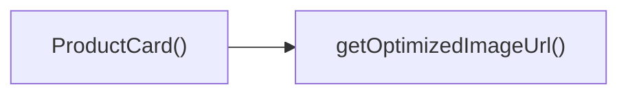

## Genel Bakış
Bu modül, VentHub HVAC platformu için geliştirilmiş, sonsuz kaydırma özelliğine sahip etkileşimli ürün vitrini React bileşenidir. 3B görselleştirme desteğiyle ürünleri akıcı bir animasyonla kullanıcıya sunar, resim optimizasyonu ve tüm kullanıcı etkileşimlerini tek bir modülde toplar.

## Fonksiyon Grupları
### Ana Giriş Bileşeni
Modülün dışarıya açılan ana giriş noktasıdır, tüm ürün vitrini yapısının çalışma akışını yönetir. Dışarıdan alınan ürün listesini iç alt bileşenlere ileterek vitrinin temelini oluşturur.
- InfiniteProductsShowcase

### Sahne ve Ürün Görünüm Bileşenleri
Vitrinin iç görsel yapısını oluşturan alt React bileşenlerini barındırır. 3B sahne içeriğini ve her ürün için özel kart görünümlerini oluşturarak konumlandırma, animasyon ve aralık ayarlarını yönetir.
- ProductCard, SceneContent

### Yardımcı ve Etkileşim İşlevleri
Görsel optimizasyon ve kullanıcı etkileşimlerini işleyen yardımcı fonksiyonlardır. Ürün resimlerini görüntüleme boyutuna göre optimize eder, tıklama ve fare üzerine gelme gibi kullanıcı aksiyonlarını yönetir.
- getOptimizedImageUrl, handleClick

---

## AXIOMS – Mimari Varsayımlar
Bu React tabanlı 3D sonsuz ürün vitrini modülü, kendisine ve tüm alt bileşenlerine aktarılan prop'ların yapısal olarak geçerli olmasını, ihtiyaç duyduğu Three.js kütüphanesinin çalışma ortamında erişilebilir olmasını ve resim optimizasyonu fonksiyonunun doğru çalışmasını varsayar.

[Aksiyom 1]: Eğer InfiniteProductsShowcase ana bileşenine aktarılan `items` dizisi boş, tanımsız ya da içindeki elemanlar ProductCard'ın işleyebileceği yapıda değilse, hiçbir ürün kartı doğru şekilde render edilemez, vitrin boş veya hatalı görünür.
[Aksiyom 2]: Eğer `getOptimizedImageUrl` fonksiyonuna iletilen orijinal resim url'si geçersiz ya da erişilemez değilse, tüm ürün kartlarında ürün görselleri yüklenemez, ürün görseli alanları boş kalır.
[Aksiyom 3]: Eğer modülün çalıştığı ortamda Three.js kütüphanesi yüklenmemiş ya da `ThreeEvent` tipi tanımlı değilse, `handleClick` fonksiyonu tıklama olaylarını yakalayamaz, ürün kartlarına tıklandığında hiçbir işlem tetiklenmez.
[Aksiyom 4]: Eğer ProductCard bileşenine aktarılan `index`, `total`, `gap`, `scrollOffset` gibi sayısal prop'lar tanımsız, geçersiz (NaN, negatif gibi) değilse, ürünlerin ekrandaki konumları ve aralıkları hatalı hesaplanır, vitrinin tüm düzeni bozulur.
[Aksiyom 5]: Eğer alt bileşenlere aktarılan `isPaused` boolean değeri ve `onHover` olay dinleyicisi tanımlı değilse, kaydırmayı duraklatma ve fare ile ürün üzerine gelme işlemleri çalışmaz, sonsuz kaydırma akışı kesintisiz olarak devam eder.

---

## FONKSIYON DETAYLARI

### getOptimizedImageUrl
**Ne yapar**: next/image resim optimizasyonunu Three.js dokuları için uyarlayan, resim yükleme performansını artırmak amacıyla tasarlanmış yardımcı fonksiyondur. Three.js ortamında kullanılacak resimlerin boyutlandırılıp optimize edilmiş URL'ler halinde sunulmasını sağlar.
**Nasıl yapar**: Girdi olarak aldığı orijinal resim URL'si ve istenen genişlik değerini kullanarak, Three.js'in doku yükleme gereksinimlerine uygun, boyutlandırılmış bir URL oluşturur. next/image'ın standart web optimizasyon mantığını 3B grafik ortamına özel olarak uyarlayarak çalışır, aşırı büyük resimlerin yüklenmesinin önüne geçer.
**Parametreler**:
- name: url, type: string — Orijinal, henüz optimize edilmemiş resmin erişim adresini içeren metin değeri
- name: width, type: belirtilmemiş — Optimize edilecek resmin hedef genişliğini belirten değer, boyutlandırma işlemi için kullanılır
**Dönüş**: Dönüş tipi belirtilmemiştir, void veya tanımsız olarak tanımlanmıştır.

---

### ProductCard
**Ne yapar**: InfiniteProductsShowcase yapısının temel yapı taşı olan, bireysel ürünleri 3B ortamda sergileyen React bileşenidir. Ürünün resmi ve başlığını barındırır, üç boyutlu sahne içindeki konum ve etkileşimleri yönetir.
**Nasıl yapar**: İçinde drei/Image kütüphanesini kullanarak gereksiz çizim çağrılarını azaltır, gelen konum, kaydırma ofseti ve diğer düzenleme parametreleriyle kartın ekrandaki konumunu hassas şekilde hesaplar. Fare ile kart üzerindeki etkileşimleri algılayarak ilgili geri çağırma fonksiyonlarını tetikler, otomatik kaydırma durumuna göre kartın hareketini yönetir.
**Parametreler**:
- name: item, type: ProductItem — Kart üzerinde sergilenecek tek ürünün tüm verilerini (resim, başlık gibi) içeren nesne
- name: index, type: number — Ürün listesi içindeki kartın sıra numarası, konum hesaplamalarında kullanılır
- name: total, type: number — Toplam ürün sayısı, sonsuz kaydırma mantığında konum hesapları için gereklidir
- name: gap, type: number — Ardışık ürün kartları arasındaki boşluk miktarı, sahne düzeni hesaplamalarında kullanılır
- name: scrollOffset, type: React.MutableRefObject<number> — Sahnenin mevcut kaydırma ofsetini saklayan değiştirilebilir referans nesnesi, kartın anlık konumunu güncel tutmak için kullanılır
- name: isPaused, type: boolean — Otomatik kaydırmanın durdurulup durdurulmadığını belirten boolean değer, kartın hareket durumunu kontrol eder
- name: onHover, type: (hovering: boolean) => void — Fare kartın üzerine geldiğinde veya ayrıldığında tetiklenen geri çağırma fonksiyonu, etkileşim durumunu ana bileşene bildirir
**Dönüş**: React bileşeni olarak, ekranda sergilenen 3B ürün kartı öğesini döndürür.

---

### handleClick
**Ne yapar**: Three.js sahnesi üzerindeki fare tıklama olaylarını yöneten olay işleyici fonksiyonudur, sahne veya ürün kartları üzerindeki tıklama etkileşimlerini işlemek için tasarlanmıştır.
**Nasıl yapar**: Three.js tarafından sarmalanan yerel fare olayı nesnesini alarak, tıklamanın konumunu ve hedefini algılar, ilgili aksiyonları tetiklemek için Three.js'in olay sistemiyle uyumlu çalışır.
**Parametreler**:
- name: e, type: ThreeEvent<MouseEvent> — Tarayıcının yerel fare olayını Three.js özelinde sarmalayan olay nesnesi, tıklama ile ilgili tüm meta verileri içerir
**Dönüş**: Dönüş tipi belirtilmemiştir, void veya tanımsız olarak tanımlanmıştır.

---

### SceneContent
**Ne yapar**: 3B ürün sergi sahnesinin tüm içeriğini barındıran, performans odaklı optimize edilmiş otomatik kaydırma özelliğine sahip React bileşenidir. Tüm ürün kartlarını bir arada toplayan ana sahne yapısıdır.
**Nasıl yapar**: İçinde tüm ürün kartlarını düzenler, otomatik kaydırma mantığını çalıştırarak sahnenin sürekli olarak akmasını sağlar, isPaused durumu geldiğinde kaydırmayı anında duraklatır. Sahne genelindeki performans iyileştirmelerini uygular, fare ile sahne üzerindeki etkileşimleri tüm sahne ölçeğinde yöneterek ilgili geri çağırma fonksiyonlarını tetikler.
**Parametreler**:
- name: items, type: ProductItem[] — Sahne içinde sergilenecek tüm ürünleri içeren dizi, her bir elemanı tek ürünün verilerini barındırır
- name: isPaused, type: boolean — Otomatik kaydırmanın durdurulup durdurulmadığını belirten boolean değer, sahnenin hareketini merkezi olarak kontrol eder
- name: onHover, type: (h: boolean) => void — Fare herhangi bir sahne öğesi üzerine geldiğinde veya ayrıldığında tetiklenen geri çağırma fonksiyonu, etkileşim durumunu ana bileşene iletir
**Dönüş**: React bileşeni olarak, tüm ürünleri ve kaydırma mantığını içeren 3B sahne içeriğini döndürür.

---

### InfiniteProductsShowcase
**Ne yapar**: Ürünlerin sonsuz kaydırılabilen 3B bir ortamda sergilenmesini sağlayan ana, tamamen optimize edilmiş React bileşenidir. Kullanıcıya hazır, tüm temel işlevleri barındıran bir ürün vitrini sunar.
**Nasıl yapar**: İçinde SceneContent ve tüm alt bileşenleri koordine ederek çalışır, doku optimizasyonu, gereksiz çizim çağrılarını azaltma, adaptif performans ölçeklemesi ve sonsuz otomatik kaydırma gibi tanımlı tüm özellikleri devreye alır. Girdi olarak aldığı ürün listesini alt bileşenlere ileterek tüm serginin çalışmasını tek merkezden yönetir, sahne genelindeki performans optimizasyonlarını uygular.
**Parametreler**:
- name: items, type: ProductItem[] — Bileşen içinde sergilenecek tüm ürünleri içeren dizi, InfiniteProductsShowcaseProps arayüzünde tanımlanan temel giriş değeridir
**Dönüş**: React.FC<InfiniteProductsShowcaseProps> tipinde, tüm 3B ürün vitrini işlevselliğini barındıran ana React bileşenini döndürür.

---

## INTERFACES

### ProductItem
- `id: string`
- `title: string`
- `image: string`

### InfiniteProductsShowcaseProps
- `items: ProductItem[]`

---

## AST POINTERS

### [N1_NASIL] AST Pointer: C:\Users\alize\venthub-hvac\src\components\products\InfiniteProductsShowcase.tsx::getOptimizedImageUrl
- **params**: url: string, width: number (varsayılan 400)
- **ic_degiskenler**:
  - `base` — URL'nin sorgu parametrelerinden önceki temel kısmı, Supabase URL'sini işlemek için ayıklanan değer
  - `renderUrl` — Supabase'den alınan orijinal nesne URL'sini, resim olarak render edilebilir formata dönüştürülen hali
- **Dönüş**: Optimize edilmiş resim URL'si, URL boşsa orijinal URL, Supabase harici URL'ler için orijinal URL

---

### [N2_NASIL] AST Pointer: C:\Users\alize\venthub-hvac\src\components\products\InfiniteProductsShowcase.tsx::ProductCard
- **params**: item: ProductItem, index: number, total: number, gap: number, scrollOffset: React.MutableRefObject<number>, isPaused: boolean, onHover: (hovering: boolean) => void
- **ic_degiskenler**:
  - `groupRef` — 3B ürün kartı grubunu referanslayan Three.js Group referansı
  - `imageRef` — Ürün resim mesh'ini referanslayan Three.js Mesh referansı
  - `router` — Next.js yönlendirme hook'u, ürün tıklamasında sayfa geçişi için kullanılır
  - `hovered` — Ürün üzerine gelinip gelinmediğini izleyen yerel state değeri
  - `optimizedUrl` — `getOptimizedImageUrl` ile üretilen, useMemo ile önbelleğe alınmış resim URL'si
  - `sphereWidth` — Tüm ürünlerin toplam kapladığı genişlik, sonsuz kaydırma mantığı için hesaplanan değer
  - `handleClick` — Ürün tıklamasında çalışan yerel callback fonksiyonu
- **Dönüş**: 3B ürün kartını render eden React JSX elementi

---

### [N3_NASIL] AST Pointer: C:\Users\alize\venthub-hvac\src\components\products\InfiniteProductsShowcase.tsx::ProductCard_useFrameCallback
- **params**: state: ReactThreeFiber.State, _delta: number
- **ic_degiskenler**:
  - `offset` — Genel kaydırma konumunu tutan `scrollOffset.current` değerinden alınan kaydırma ofseti
  - `xPos` — Ürün kartının X eksenindeki anlık konumu, sonsuz kaydırma için modulo mantığı ile sarmalanan değer
  - `targetScale` — Hover durumuna göre resim mesh'i için belirlenen hedef ölçek değeri
  - `mat` — Resim mesh'inin malzemesini cast ederek alınan Three.js MeshStandardMaterial nesnesi, hover efektleri için kullanılır
- **Dönüş**: yok

---

### [N4_NASIL] AST Pointer: C:\Users\alize\venthub-hvac\src\components\products\InfiniteProductsShowcase.tsx::ProductCard_handleClick
- **params**: e: ThreeEvent<MouseEvent>
- **ic_degiskenler**:
  - `e.stopPropagation()` — Tıklama olayının üst elementlere yayılmasını engeller
  - `router.push(Routes.category(item.id))` — Tıklanan ürünün kategori sayfasına yönlendirme yapar
- **Dönüş**: yok

---

### [N5_NASIL] AST Pointer: C:\Users\alize\venthub-hvac\src\components\products\InfiniteProductsShowcase.tsx::SceneContent
- **params**: items: ProductItem[], isPaused: boolean, onHover: (h: boolean) => void
- **ic_degiskenler**:
  - `gap` — Ürün kartları arasındaki boşluk miktarı, sabit 5 olarak ayarlanmış
  - `scrollOffset` — Genel kaydırma konumunu tutan React useRef referansı, sonsuz kaydırma için kullanılır
  - `camera` — `useThree` hook'u ile alınan Three.js sahne kamerası referansı
  - `items.map` — Tüm ürünler üzerinden geçerek her biri için ProductCard bileşeni oluşturan dizi döngüsü
- **Dönüş**: Tüm ürünleri ve sahne öğelerini içeren React JSX elementi

---

### [N6_NASIL] AST Pointer: C:\Users\alize\venthub-hvac\src\components\products\InfiniteProductsShowcase.tsx::SceneContent_useFrameCallback
- **params**: state: ReactThreeFiber.State, delta: number
- **ic_degiskenler**:
  - `scrollOffset.current` — Otomatik akışın konumunu tutan değer, duraklatılmadıkça her karede güncellenir
  - `camera.position.x` — Kameranın X pozisyonu, "nefes alma" efekti için lerp ile yumuşak güncellenir
  - `camera.position.y` — Kameranın Y pozisyonu, "nefes alma" efekti için lerp ile yumuşak güncellenir
- **Dönüş**: yok

---

### [N7_NASIL] AST Pointer: C:\Users\alize\venthub-hvac\src\components\products\InfiniteProductsShowcase.tsx::SceneContent_itemsMapCallback
- **params**: item: ProductItem, i: number
- **ic_degiskenler**:
  - `key` — React listeleri için benzersiz anahtar, `${item.id}-${i}` formatında oluşturulur
  - `ProductCard` — Her ürün için oluşturulan ürün kartı bileşeni, tüm gerekli prop'lar iletilir
- **Dönüş**: Her ürün için üretilmiş ProductCard JSX elementi

---

### [N8_NASIL] AST Pointer: C:\Users\alize\venthub-hvac\src\components\products\InfiniteProductsShowcase.tsx::InfiniteProductsShowcase
- **params**: items: ProductItem[]
- **ic_degiskenler**:
  - `isPaused` — Ürünlerin otomatik akışının duraklatılıp duraklatılmadığını tutan ana state değeri
  - `setIsPaused` — `isPaused` state'ini güncellemek için kullanılan useState setter fonksiyonu
- **Dönüş**: Tam ürün vitrinini, Canvas arayüzü ve tüm alt bileşenleri ile render eden React JSX elementi; `items` boşsa null döner

---

## ÇAĞRI HARİTASI

### Disariya Cagrilar (Outgoing)
Dosya içindeki ProductCard() fonksiyonu, ürün kartında gösterilecek görselin optimize edilmiş bağlantısını almak için dosya içindeki getOptimizedImageUrl fonksiyonunu çağırmaktadır.

### Disaridan Cagrilanlar (Incoming)
Sağlanan çağrı grafiği verisinde bu modülü kullanan herhangi bir dış dosya veya fonksiyon bilgisi bulunmamaktadır.

### Ic Ice Fonksiyonlar (Nested)
Yok

---

## DOSYA-İÇİ ÇAĞRI GRAFİĞİ
  ProductCard() → getOptimizedImageUrl()

---

## NODE ID STANDARD

  file: src\components\products\InfiniteProductsShowcase.tsx
  function: src\components\products\InfiniteProductsShowcase.tsx::getOptimizedImageUrl
  function: src\components\products\InfiniteProductsShowcase.tsx::ProductCard
  function: src\components\products\InfiniteProductsShowcase.tsx::handleClick
  function: src\components\products\InfiniteProductsShowcase.tsx::SceneContent
  function: src\components\products\InfiniteProductsShowcase.tsx::InfiniteProductsShowcase

---

## DISA AKTARILANLAR (EXPORTS)
  export: InfiniteProductsShowcase
  export: ProductCard
  export: SceneContent
  export: getOptimizedImageUrl