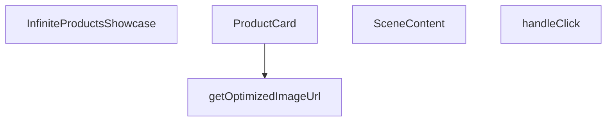

## Genel Bakış
Bu modül, ürünleri Three.js tabanlı 3B bir sahnede sonsuz kaydırma mantığıyla sergileyen React bileşenidir. Görsel optimizasyonu, etkileşimli ürün kartlarını ve 3B sahne yönetimini tek bir bileşen yapısında birleştirerek kullanıcıya akıcı bir vitrin deneyimi sunar.

## Fonksiyon Grupları
### Görsel Optimizasyonu
Ürün görsellerinin boyut ve format açısından optimize edilerek sunulmasını sağlayan yardımcı işlevi kapsar.
- getOptimizedImageUrl

### Kullanıcı Arayüzü Bileşenleri
Ürün kartlarının görsel ve etkileşimli yapısını, bu kartların 3B sahne içinde nasıl yerleştirileceğini tanımlayan bileşenleri içerir.
- ProductCard, SceneContent

### Olay İşleyicisi
Kullanıcının ürün kartlarına tıklama gibi etkileşimlerini yakalayıp ilgili tepkileri tetikleyen işlevleri barındırır.
- handleClick

### Ana Bileşen
Ürün listesini alarak sonsuz kaydırma mantığını uygular ve tüm alt bileşenleri bir araya getirerek tamamlı vitrini render eder.
- InfiniteProductsShowcase

---

## AXIOMS – Mimari Varsayımlar

Bu modül, Three.js tabanlı 3B sahnede sonsuz kaydırma ile ürün vitrini sergileme mantığına dayanır. Doğru çalışması için aşağıdaki mimari varsayımlar geçerlidir.

[Aksiyom 1]: Eğer `items` dizisi boş veya `undefined` ise, sahne içinde hiçbir ürün kartı oluşturulmaz ve 3B vitrin boş görünür.

[Aksiyom 2]: Eğer `getOptimizedImageUrl` fonksiyonuna geçerli bir `url` stringi verilmezse, görsel yüklenemez ve kartta kırık görsel ikonu görünür.

[Aksiyom 3]: Eğer `ProductCard` bileşenine `item` prop'u `undefined` olarak verilirse, kart içeriği hata verir veya boş render edilir.

[Aksiyom 4]: Eğer `scrollOffset` değeri hesaplanamazsa veya `NaN` ise, sonsuz kaydırma animasyonu başlamaz ve ürünler sabit kalır.

[Aksiyom 5]: Eğer `isPaused` değeri `true` ise, sonsuz kaydırma döngüsü durdurulur; `false` ise kaydırma devam eder.

[Aksiyom 6]: Eğer `items` dizisi tek bir ürün içermiyorsa (yani `total === 1`), sonsuz kaydırma mantığı yeterli eleman olmadığı için verimli çalışmayabilir.

[Aksiyom 7]: Eğer `gap` değeri tanımsız ise, ürünler arasındaki boşluk hesaplanamaz ve kartlar beklenmeyen şekilde konumlandırılabilir.

[Aksiyom 8]: Eğer `handleClick` fonksiyonu geçerli bir `ThreeEvent<MouseEvent>` parametresi almazsa, tıklama olayı işlenemez ve ürün detay yönlendirmesi çalışmaz.

[Aksiyom 9]: Eğer `onHover` callback'i tanımsız ise, fare üzerine gelindiğinde kart üzerinde herhangi bir hover efekti veya durum değişikliği tetiklenmez.

[Aksiyom 10]: Eğer `SceneContent` bileşenine `items` prop'u geçilmezse, 3B sahne içinde render edilecek hiçbir mesh/card objesi olmaz ve sahne boş kalır.

---

## FONKSİYON DETAYLARI

### getOptimizedImageUrl
**Ne yapar**: Üç.js dokuları için next/image optimizasyonunu taklit eden yardımcı bir fonksiyondur. Bir görsel URL'sini alıp optimize edilmiş bir versiyonunu döndürür.
**Nasıl yapar**: (Belirtilmemiş; işlev gövdesi verilmemiştir.)
**Parametreler**:
- url: string — Optimize edilecek görselin URL adresi.
- width: (tip belirtilmemiş) — Görselin genişlik değeri.
**Dönüş**: void (veya bilinmiyor — kesin dönüş tipi verilmemiştir.)

### ProductCard
**Ne yapar**: Görsel ve başlık içeren bir ürün kartı bileşenidir. drei/Image kullanılarak optimize edilmiş bir görsel yükleme sunar.
**Nasıl yapar**: Ürün öğesini (`item`), indeksini ve kapsayıcı bilgilerini alarak bir 3D sahne içinde kartı oluşturur. Scroll offseti ve duraklama durumu gibi özellikleri yönetir.
**Parametreler**:
- item: ProductItem — Gösterilecek ürünün veri nesnesi.
- index: number — Ürünler listesindeki sıra numarası.
- total: number — Toplam ürün sayısı.
- gap: number — Kartlar arasındaki boşluk miktarı.
- scrollOffset: React.MutableRefObject<number> — Kaydırma konumunu referans olarak tutan nesne.
- isPaused: boolean — Otomatik kaydırmanın duraklatılıp duraklatılmadığını belirtir.
- onHover: (hovering: boolean) => void — Fare üzerine gelme olayında çağrılan callback fonksiyonu.
**Dönüş**: React.FC — Bir React fonksiyonel bileşeni döndürür.

### handleClick
**Ne yapar**: Ürün kartına tıklandığında tetiklenen olay işleyicisidir.
**Nasıl yapar**: (İç mantık belirtilmemiştir.)
**Parametreler**:
- e: ThreeEvent<MouseEvent> — Three.js üzerinden gelen fare tıklama olayı.
**Dönüş**: void (veya bilinmiyor — kesin dönüş tipi verilmemiştir.)

### SceneContent
**Ne yapar**: Performans odaklı otomatik kaydırma özelliğine sahip 3D sahne içeriği bileşenidir. Ürün kartlarını üç boyutlu uzayda düzenler ve otomatik olarak kaydırır.
**Nasıl yapar**: Öğeler listesini (`items`) alarak her bir öğe için `ProductCard` bileşeni oluşturur. `isPaused` ve `onHover` aracılığıyla kaydırma davranışını ve etkileşimleri yönetir.
**Parametreler**:
- items: ProductItem[] — Görüntülenecek ürün öğelerinin dizisi.
- isPaused: boolean — Otomatik kaydırmanın duraklatılıp duraklatılmadığını belirtir.
- onHover: (h: boolean) => void — Fare üzerine gelme olayında çağrılan callback fonksiyonu.
**Dönüş**: React.FC — Bir React fonksiyonel bileşeni döndürür.

### InfiniteProductsShowcase
**Ne yapar**: Ana optimize edilmiş 3D vitrin bileşenidir. next/image benzeri doku optimizasyonu, drei/Image ile azaltılmış çizim çağrıları ve uyarlanabilir performans ölçekleme gibi özellikler sunar. Sonsuz otomatik kaydırma sağlar.
**Nasıl yapar**: Kendisine iletilen ürün öğelerini (`items`) alarak bir `SceneContent` bileşeni oluşturur ve tüm vitrin mantığını bu alt bileşene devreder.
**Parametreler**:
- items: ProductItem[] — Vitrinde sergilenecek ürün öğeleri dizisi.
**Dönüş**: React.FC<InfiniteProductsShowcaseProps> — `InfiniteProductsShowcaseProps` prop tipine sahip bir React fonksiyonel bileşeni döndürür.

---

## INTERFACES

### ProductItem
- `id: string`
- `title: string`
- `image: string`

### InfiniteProductsShowcaseProps
- `items: ProductItem[]`

---

## AST POINTERS

### [N1_NASIL] AST Pointer: `InfiniteProductsShowcase.tsx::getOptimizedImageUrl`
- **params**: `(url: string, width = 400)`
  - `url: string` — İşlenecek görsel URL'i; Supabase depolama bağlantısı veya harici URL olabilir
  - `width: number` — Hedef piksel genişliği, varsayılan 400
- **ic_degiskenler**:
  - `base` — `url.split('?')[0]` ile elde edilen query string öncesi kısım; orijinal dosya yolunu temsil eder
  - `renderUrl` — `base` içinde `/object/` varsa `/render/image/` ile değiştirilmiş Supabase render URL'i; yoksa `base` aynen kalır
- **Dönüş**: `string` — `?width=X&quality=75&format=webp` parametreli optimizasyonlu URL veya orijinal `url` (supabase değilse / boşsa)

---

## MERMAID CALL GRAPH

## NODE ID STANDARD

  file: src\components\products\InfiniteProductsShowcase.tsx
  function: src\components\products\InfiniteProductsShowcase.tsx::getOptimizedImageUrl
  function: src\components\products\InfiniteProductsShowcase.tsx::ProductCard
  function: src\components\products\InfiniteProductsShowcase.tsx::handleClick
  function: src\components\products\InfiniteProductsShowcase.tsx::SceneContent
  function: src\components\products\InfiniteProductsShowcase.tsx::InfiniteProductsShowcase

---

## DISA AKTARILANLAR (EXPORTS)
  export: InfiniteProductsShowcase
  export: ProductCard
  export: SceneContent
  export: getOptimizedImageUrl

---

## STİL TOKENLERİ

### Arbitrary Değerler (token'a geçirilmemiş)
Yok — tüm stiller token'a geçirilmiş. ✅

### Kullanılan Token'lar (zaten token'a geçirilmiş)
- `tracking-hvac-normal`

### Tailwind Sınıf Özeti
- **Renkler:** `bg-cyan-400`, `bg-cyan-500`, `bg-gradient-to-l`, `bg-gradient-to-r`, `bg-slate-900/50`, `bg-surface-darker`, `border-slate-800`, `from-surface-darker`, `text-cyan-400`, `text-xs`, `to-transparent`, `via-surface-darker/40`
- **Layout:** `absolute`, `backdrop-blur-md`, `bottom-6`, `flex`, `from-surface-darker`, `gap-3`, `h-2`, `h-full`, `h-showcase`, `hidden`, `inline-flex`, `items-center`, `left-0`, `left-1/2`, `overflow-hidden`
- **Varyant/Responsive:** `:`, `group-hover/canvas:` önekleri
- **Yardımcı Sınıflar:** `${isPaused`, `-translate-x-1/2`, `:`, `animate-ping`, `border`, `content-auto-showcase`, `duration-500`, `font-mono`, `group-hover/canvas:opacity-100`, `group/canvas`, `inset-y-0`, `opacity-60`, `opacity-75`, `pointer-events-none`, `px-4`