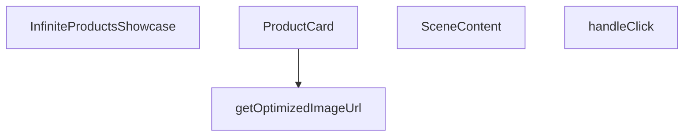

## Genel Bakış
Bu modül, ürünleri sonsuz kaydırma (infinite scroll) mantığıyla gösteren bir React bileşeni sağlar. Görsel optimizasyonu, ürün kartları ve 3B sahne içeriği gibi işlevleri birleştirerek kullanıcıya etkileşimli bir ürün vitrini sunar.

## Fonksiyon Grupları
### Görsel Optimizasyonu
Ürün görsellerinin istenen boyutta ve formatta sunulmasını sağlayan yardımcı işlevi içerir.
- getOptimizedImageUrl

### Kullanıcı Arayüzü Bileşenleri
Ürün kartlarının oluşturulması ve bu kartların bir koleksiyon olarak sahne içinde düzenlenmesini yönetir.
- ProductCard
- SceneContent

### Etkileşim İşleyicisi
Kullanıcının ürün kartlarına yaptığı tıklamaları yakalayıp ilgili yanıtları tetikler.
- handleClick

### Ana Bileşen
Ürün listesini alır, sonsuz kaydırma mantığını uygulayıp diğer bileşenleri bir araya getirerek tamamlı vitrini render eder.
- InfiniteProductsShowcase

---

## AXIOMS – Mimari Varsayımlar
Bu modül için özel aksiyom tanımlanmamıştır.

---

## FONKSİYON DETAYLARI

### getOptimizedImageUrl
**Ne yapar**: Üç.js dokuları için next/image optimizasyonunu taklit eden yardımcı bir fonksiyondur. Bir görsel URL'sini alıp optimize edilmiş bir versiyonunu döndürür.
**Nasıl yapar**: (Belirtilmemiş; işlev gövdesi verilmemiştir.)
**Parametreler**:
- url: string — Optimize edilecek görselin URL adresi.
- width: (tip belirtilmemiş) — Görselin genişlik değeri.
**Dönüş**: void (veya bilinmiyor — kesin dönüş tipi verilmemiştir.)

### ProductCard
**Ne yapar**: Görsel ve başlık içeren bir ürün kartı bileşenidir. drei/Image kullanılarak optimize edilmiş bir görsel yükleme sunar.
**Nasıl yapar**: Ürün öğesini (`item`), indeksini ve kapsayıcı bilgilerini alarak bir 3D sahne içinde kartı oluşturur. Scroll offseti ve duraklama durumu gibi özellikleri yönetir.
**Parametreler**:
- item: ProductItem — Gösterilecek ürünün veri nesnesi.
- index: number — Ürünler listesindeki sıra numarası.
- total: number — Toplam ürün sayısı.
- gap: number — Kartlar arasındaki boşluk miktarı.
- scrollOffset: React.MutableRefObject<number> — Kaydırma konumunu referans olarak tutan nesne.
- isPaused: boolean — Otomatik kaydırmanın duraklatılıp duraklatılmadığını belirtir.
- onHover: (hovering: boolean) => void — Fare üzerine gelme olayında çağrılan callback fonksiyonu.
**Dönüş**: React.FC — Bir React fonksiyonel bileşeni döndürür.

### handleClick
**Ne yapar**: Ürün kartına tıklandığında tetiklenen olay işleyicisidir.
**Nasıl yapar**: (İç mantık belirtilmemiştir.)
**Parametreler**:
- e: ThreeEvent<MouseEvent> — Three.js üzerinden gelen fare tıklama olayı.
**Dönüş**: void (veya bilinmiyor — kesin dönüş tipi verilmemiştir.)

### SceneContent
**Ne yapar**: Performans odaklı otomatik kaydırma özelliğine sahip 3D sahne içeriği bileşenidir. Ürün kartlarını üç boyutlu uzayda düzenler ve otomatik olarak kaydırır.
**Nasıl yapar**: Öğeler listesini (`items`) alarak her bir öğe için `ProductCard` bileşeni oluşturur. `isPaused` ve `onHover` aracılığıyla kaydırma davranışını ve etkileşimleri yönetir.
**Parametreler**:
- items: ProductItem[] — Görüntülenecek ürün öğelerinin dizisi.
- isPaused: boolean — Otomatik kaydırmanın duraklatılıp duraklatılmadığını belirtir.
- onHover: (h: boolean) => void — Fare üzerine gelme olayında çağrılan callback fonksiyonu.
**Dönüş**: React.FC — Bir React fonksiyonel bileşeni döndürür.

### InfiniteProductsShowcase
**Ne yapar**: Ana optimize edilmiş 3D vitrin bileşenidir. next/image benzeri doku optimizasyonu, drei/Image ile azaltılmış çizim çağrıları ve uyarlanabilir performans ölçekleme gibi özellikler sunar. Sonsuz otomatik kaydırma sağlar.
**Nasıl yapar**: Kendisine iletilen ürün öğelerini (`items`) alarak bir `SceneContent` bileşeni oluşturur ve tüm vitrin mantığını bu alt bileşene devreder.
**Parametreler**:
- items: ProductItem[] — Vitrinde sergilenecek ürün öğeleri dizisi.
**Dönüş**: React.FC<InfiniteProductsShowcaseProps> — `InfiniteProductsShowcaseProps` prop tipine sahip bir React fonksiyonel bileşeni döndürür.

---

## INTERFACES

### ProductItem
- `id: string`
- `title: string`
- `image: string`

### InfiniteProductsShowcaseProps
- `items: ProductItem[]`

---

## AST POINTERS

### [N1_NASIL] AST Pointer: C:\Users\alize\venthub-hvac\src\components\products\InfiniteProductsShowcase.tsx::getOptimizedImageUrl
- **params**: (url: string, width = 400)
- **ic_degiskenler**:
  - `base` — `url`’un “?” karakterinden önceki kısmını tutar; render URL oluşturmak için kullanılır.
  - `renderUrl` — `base` içinde “/object/” varsa “/render/image/” ile değiştirilmiş hali; son URL’ye ek parametreler eklenir.
- **Dönüş**: `string` (optimize edilmiş veya orijinal URL)

### [N2_NASIL] AST Pointer: C:\Users\alize\venthub-hvac\src\components\products\InfiniteProductsShowcase.tsx::ProductCard
- **params**: ({ item, index, total, gap, scrollOffset, isPaused, onHover })
- **ic_degiskenler**:
  - `groupRef` — `<group>` öğesinin referansı; konum ve dönüş animasyonları burada güncellenir.
  - `imageRef` — `<DreiImage>` mesh referansı; ölçek ve ışınım (emissive) efektleri burada uygulanır.
  - `router` — Next.js yönlendirme nesnesi; tıklama olayında kategori sayfasına yönlendirme yapılır.
  - `hovered` — `boolean` state; fare üzerindeyken `true`, çıkınca `false`.
  - `setHover` — `hovered` state’ini güncelleyen fonksiyon.
  - `optimizedUrl` — `item.image` için `getOptimizedImageUrl` ile elde edilen, texture olarak kullanılacak URL.
  - `sphereWidth` — `total * gap`; sonsuz kaydırma hesabında kullanılan toplam genişlik.
- **Dönüş**: `React.ReactElement` (JSX içinde `<group>` ve içindeki öğeler)

### [N3_NASIL] AST Pointer: C:\Users\alize\venthub-hvac\src\components\products\InfiniteProductsShowcase.tsx::ProductCard_useFrame
- **params**: (state, _delta)
- **ic_degiskenler**:
  - `offset` — `scrollOffset.current`; kaydırma miktarını tutar.
  - `xPos` — Hesaplanan X konumu; grup konumunu ve dönüşünü belirler.
  - `targetScale` — `hovered` durumuna göre `1.15` ya da `1.0`; ölçekleme lerp hedefi.
  - `mat` — `imageRef.current.material` tip dönüşümü; `MeshStandardMaterial` olarak kullanılır, emissive yoğunluğu burada ayarlanır.
- **Dönüş**: `yok` (yan etkileri: grup konumu/rotasyonu, mesh ölçeği ve materyal emissive ayarı)

### [N4_NASIL] AST Pointer: C:\Users\alize\venthub-hvac\src\components\products\InfiniteProductsShowcase.tsx::ProductCard_handleClick
- **params**: (e: ThreeEvent<MouseEvent>)
- **ic_degiskenler**:
  - `e` — Gelen fare olayı; `stopPropagation()` ile olay yayılımı durdurulur.
- **Dönüş**: `yok` (yan etki: `router.push(Routes.category(item.id))` ile sayfa yönlendirmesi)

### [N5_NASIL] AST Pointer: C:\Users\alize\venthub-hvac\src\components\products\InfiniteProductsShowcase.tsx::SceneContent
- **params**: ({ items, isPaused, onHover })
- **ic_degiskenler**:
  - `gap` — Ürün kartları arasındaki sabit mesafe; `5` olarak tanımlanır.
  - `scrollOffset` — `useRef(0)` ile oluşturulan kaydırma ofseti; `useFrame` içinde güncellenir.
  - `camera` — `useThree()` ile alınan kamera nesnesi; solunum (breathing) animasyonu burada uygulanır.
- **Dönüş**: `React.ReactElement` (JSX içinde `<Bvh>` ve sahne öğeleri)

### [N6_NASIL] AST Pointer: C:\Users\alize\venthub-hvac\src\components\products\InfiniteProductsShowcase.tsx::SceneContent_useFrame
- **params**: (state, delta)
- **ic_degiskenler**:
  - `scrollOffset` — `scrollOffset.current`; `isPaused` false olduğunda artar, 1’i geçtiğinde sıfırlanır.
  - `camera` — `camera.position.x` ve `camera.position.y`; `THREE.MathUtils.lerp` ile zaman bazlı sinüs fonksiyonlarıyla hareket ettirilir.
- **Dönüş**: `yok` (yan etkileri: `scrollOffset` ve `camera` konum güncellemeleri)

### [N7_NASIL] AST Pointer: C:\Users\alize\venthub-hvac\src\components\products\InfiniteProductsShowcase.tsx::SceneContent_mapCallback
- **params**: (item, i)
- **ic_degiskenler**:
  - `item` — Tek bir ürün nesnesi; `ProductCard` prop’ları içinde kullanılır.
  - `i` — Ürün indeks numarası; `ProductCard` prop’ları içinde kullanılır.
- **Dönüş**: `React.ReactElement` (`<ProductCard …/>`)

### [N8_NASIL] AST Pointer: C:\Users\alize\venthub-hvac\src\components\products\InfiniteProductsShowcase.tsx::InfiniteProductsShowcase
- **params**: ({ items })
- **ic_degiskenler**:
  - `isPaused` — `boolean` state; otomatik akışı duraklatma kontrolü.
  - `setIsPaused` — `isPaused` state’ini güncelleyen fonksiyon; `SceneContent` üzerinden hover durumuna göre tetiklenir.
- **Dönüş**: `React.ReactElement` (JSX içinde `<Canvas>` ve UI overlay)

---

## MERMAID CALL GRAPH

## NODE ID STANDARD

  file: src\components\products\InfiniteProductsShowcase.tsx
  function: src\components\products\InfiniteProductsShowcase.tsx::getOptimizedImageUrl
  function: src\components\products\InfiniteProductsShowcase.tsx::ProductCard
  function: src\components\products\InfiniteProductsShowcase.tsx::handleClick
  function: src\components\products\InfiniteProductsShowcase.tsx::SceneContent
  function: src\components\products\InfiniteProductsShowcase.tsx::InfiniteProductsShowcase

---

## DISA AKTARILANLAR (EXPORTS)
  export: InfiniteProductsShowcase
  export: ProductCard
  export: SceneContent
  export: getOptimizedImageUrl

---

## STİL TOKENLERİ

### Arbitrary Değerler (token'a geçirilmemiş)
Yok — tüm stiller token'a geçirilmiş. ✅

### Kullanılan Token'lar (zaten token'a geçirilmiş)
- `tracking-hvac-normal`

### Tailwind Sınıf Özeti
- **Renkler:** `bg-cyan-400`, `bg-cyan-500`, `bg-gradient-to-l`, `bg-gradient-to-r`, `bg-slate-900/50`, `bg-surface-darker`, `border-slate-800`, `from-surface-darker`, `text-cyan-400`, `text-xs`, `to-transparent`, `via-surface-darker/40`
- **Layout:** `absolute`, `backdrop-blur-md`, `bottom-6`, `flex`, `from-surface-darker`, `gap-3`, `h-2`, `h-550px`, `h-full`, `hidden`, `inline-flex`, `items-center`, `left-0`, `left-1/2`, `overflow-hidden`
- **Varyant/Responsive:** `:`, `group-hover/canvas:` önekleri
- **Yardımcı Sınıflar:** `${isPaused`, `-translate-x-1/2`, `:`, `animate-ping`, `border`, `content-auto`, `duration-500`, `font-mono`, `group-hover/canvas:opacity-100`, `group/canvas`, `inset-y-0`, `opacity-60`, `opacity-75`, `pointer-events-none`, `px-4`