## Genel Bakış
Bu modül, ürün kartlarını dairesel bir 3B yörüngede sergileyen interaktif bir vitrin bileşenidir. React ve Three.js altyapısı kullanılarak fare sürükleme, tıklama ve üzerine gelme gibi etkileşimlerle ürünleri gezinilebilir şekilde sunar. Paylaşılan durum yapısı üzerinden alt bileşenlerin koordinasyonunu sağlar.

## Fonksiyon Grupları

### Ana Vitrin Kontrolü
Sergileme sisteminin üst düzey yönetimini ve dış dünya ile iletişimi sağlayan ana bileşenlerdir. Dışarıdan gelen duraklama, odak değişimi ve kart tıklama olaylarını yöneterek tüm sistemin akışını kontrol eder.
- OrbitalProductsShowcase, CarouselItems

### 3B Sahne ve Geometri
Ürünlerin dairesel dizideki konumlarını belirleyen geometrik hesaplamaları ve 3B sahne yapısını oluşturur. Yörünge yarıçapı gibi temel değerleri hesaplar ve sahne bileşenini tanımlar.
- Stage, getRadius

### Kart Görselleştirme ve Malzemeler
Ürün kartlarının 3B görünümünü, animasyon düzeltmelerini ve malzeme ayarlarını tanımlar. Yer tutucu modeller, yükleme durumları ve kart materyalleri bu grupta yer alır.
- OrbitalCard, PlaceholderWireframe, SuspendedCardMaterial, MotionTransitionFix

### Etkileşim İşleyicileri
Kullanıcının fare ve işaretçi etkileşimlerini yakalayan olay işleyicilerini içerir. Kartların üzerine gelme, ayrılma, sürükleme başlatma, sürdürme ve bitirme gibi kullanıcı aksiyonlarını yönetir.
- handlePointerOver, handlePointerOut, handlePointerDownFull, handlePointerMove, handlePointerUp

---

## AXIOMS – Mimari Varsayımlar

Bu modül, ürün kartlarını dairesel bir 3B yörüngede sergileyen interaktif bir vitrin bileşenidir. Fonksiyon gövdeleri verilmediğinden, yalnızca imzalardan çıkarılabilen varsayımlar listelenmiştir.

[Aksiyom 1]: Eğer `sharedState` parametresi verilmezse, `Stage`, `OrbitalCard` ve `CarouselItems` bileşenleri paylaşılan duruma erişemez ve bileşenler arası koordinasyon sağlanamaz.

[Aksiyom 2]: Eğer `items` dizisi boş veya tanımsız ise, `CarouselItems` bileşeni yörüngede gösterilecek kart üretemez.

[Aksiyom 3]: Eğer `total` değeri 0 ise, `OrbitalCard` bileşeni dairesel hesaplamalarda bölme hatası riskiyle karşılaşır.

[Aksiyom 4]: Eğer `index` değeri 0 ile `total - 1` aralığının dışındaysa, `OrbitalCard` bileşeni yörüngede geçersiz bir konum hesaplar.

[Aksiyom 5]: Eğer `finalPath` null ise, `SuspendedCardMaterial` bileşeni kart yüzeyinde kullanılacak materyal için geçerli bir doku yoluna sahip değildir.

[Aksiyom 6]: Eğer `hovered` false ise, `SuspendedCardMaterial` bileşeni varsayılan (hover edilmemiş) materyal durumunu kullanır.

[Aksiyom 7]: Eğer `scale` parametresi `PlaceholderWireframe` bileşenine verilmezse, varsayılan değer 1 olarak kullanılır.

[Aksiyom 8]: Eğer `externalPause` parametresi `OrbitalProductsShowcase` bileşenine verilmezse, varsayılan değer false olarak kullanılır ve yörünge otomatik dönmeye devam eder.

[Aksiyom 9]: Eğer `isPaused` true ise, `CarouselItems` bileşeni yörünge animasyonunu duraklatır.

[Aksiyom 10]: Eğer `isDraggingRef` referansı true ise, sürükleme işlemi aktif demektir ve `OrbitalCard` bileşeni sürükleme davranışını uygular.

[Aksiyom 11]: Eğer `hintStage` değeri `'idle'`, `'tap'`, `'drag'`, `'cooldown'` veya `'finished'` dışında bir değer alırsa, `CarouselItems` bileşeni geçersiz bir ipucu durumunda kalır.

[Aksiyom 12]: Eğer `modelScale` değeri verilmezse, `OrbitalCard` ve `CarouselItems` bileşenleri 3B model ölçeklemesi için bir referans değerine sahip olmaz.

[Aksiyom 13]: Eğer `onHover` callback'i verilmezse, `OrbitalCard` ve `CarouselItems` bileşenleri hover olaylarını üst bileşene bildiremez.

[Aksiyom 14]: Eğer `onBringToFront` callback'i verilmezse, `OrbitalCard` bileşeni bir kartın ön plana getirilmesi gerektiğini üst bileşene bildiremez.

[Aksiyom 15]: Eğer `setIsDragging` callback'i verilmezse, `OrbitalCard` bileşeni sürükleme durumu değişikliğini üst bileşene bildiremez.

---

## FONKSİYON DETAYLARI

### Stage
**Ne yapar**: Orbital ürün karuselinin hemen yüklenen sahne zemini ve özel efektlerini oluşturan React bileşenidir. 3B sahnenin temel altyapısını oluşturarak tüm alt içeriklerin üzerinde çalışmasını sağlar.
**Nasıl yapar**: OrbitalProductsShowcase ana bileşeninin yükleme sırasının en başında çalışır, kendisine iletilen paylaşılmış durum referansını tüm alt bileşenlere ileterek tüm sahne öğelerinin ortak durumu paylaşmasını sağlar. Gerçek zamanlı efektleri sahne zeminiyle bütünleştirerek sorunsuz bir görsel deneyim sunar.
**Parametreler**:
- name: sharedState, type: React.MutableRefObject<SharedState> — Tüm sahne içindeki bileşenlerin paylaştığı ortak durumu tutan değiştirilebilir referans nesnesi
**Dönüş**: React.FC türünde, karusel sahnesini oluşturan React bileşeni döndürür.

### getRadius
**Ne yapar**: Orbital karusel içindeki ürün kartlarının 3B alanda düzgün dağılması için gerekli sahne yarıçapını hesaplayan yardımcı fonksiyondur.
**Nasıl yapar**: Toplam ürün sayısı, kart boyutları ve model ölçeği gibi değişkenlere göre optimum yarıçap değerini hesaplar, böylece kartlar birbiriyle çakışmadan düzgün bir dairesel düzende yer alır.
**Parametreler**: Bulunmamaktadır
**Dönüş**: Dönüş tipi belirtilmemiştir, karusel düzenlemesi için gerekli yarıçap değerini döndürmesi amaçlanmıştır.

### PlaceholderWireframe
**Ne yapar**: 3B yükleme animasyonu için kullanılan geçici wireframe şeklini oluşturan React bileşenidir. Gerçek 3B model veya dokü yüklenene kadar gösterilir.
**Nasıl yapar**: Girilen ölçek değerine göre boyutlandırılarak ekrana çizilir, yükleme sürecinde boşluk oluşturmadan kullanıcıya bir görsel ipucu sunar. Sahne içindeki konumuna uygun olarak ölçeklenerek orantısızlık yaratmaz.
**Parametreler**:
- name: scale, type: number | opsiyonel, varsayılan değeri 1 — Wireframe'in genel boyut çarpanını belirten ölçek değeri
**Dönüş**: Dönüş tipi belirtilmemiştir, React elementi olarak ekrana wireframe içeriği sunar.

### SuspendedCardMaterial
**Ne yapar**: Kategori dışı standart resimli kartlar için dokü yüklenene kadar bekleyen özel materyal bileşenidir.
**Nasıl yapar**: Kendisine iletilen son görsel yolu üzerinden doküyü yüklemeye çalışır, yükleme tamamlanana kadar geçici materyal kullanır. Fare kartın üzerindeyse (hovered) ekstra görsel efektler uygulayarak etkileşim olduğunu belli eder.
**Parametreler**:
- name: finalPath, type: string | null — Kartın yüklenecek son doküsünün dosya yolu, null olması durumunda geçici materyal sürekli gösterilir
- name: hovered, type: boolean — Fare imlecinin kart üzerinde olup olmadığını belirten bayrak, materyale ekstra efektler uygulamak için kullanılır
**Dönüş**: Dönüş tipi belirtilmemiştir, 3B kart üzerinde kullanılmak üzere hazırlanmış materyal öğesini döndürür.

### OrbitalCard
**Ne yapar**: 3B karusel içinde yer alan tek bir ürün kartını oluşturan ana ürün bileşenidir. Tüm kullanıcı etkileşimlerini ve kartın görsel özelliklerini yönetir.
**Nasıl yapar**: Kendisine iletilen ürün verisi, ortak durum ve geri çağırım fonksiyonlarını kullanarak 3B alanda konumlandırılır, sürükleme, tıklama, odaklama gibi tüm kullanıcı aksiyonlarını işler. Ön plana alma, sürükleme durumu ayarlama gibi işlemleri tetikler, kartın üzerine ipucu görselleri ekler ve model ölçeğine göre boyutlandırılır.
**Parametreler**:
- name: item, type: ProductItem — Kartın üzerinde gösterileceği ürün verisini içeren nesne
- name: index, type: number — Kartın karusel içindeki sıra numarası
- name: total, type: number — Karusel içindeki toplam kart sayısı
- name: sharedState, type: React.MutableRefObject<SharedState> — Tüm kartların paylaştığı ortak durumu tutan değiştirilebilir referans nesnesi
- name: onHover, type: (hovering: boolean) => void — Fare kart üzerine geldiğinde veya ayrıldığında tetiklenen, durumunu ileten geri çağırım fonksiyonu
- name: onBringToFront, type: (index: number) => void — Kartı en ön plana almak için tetiklenen, sıra numarasını ileten geri çağırım fonksiyonu
- name: setIsDragging, type: (dragging: boolean) => void — Kartın sürüklenme durumunu ayarlamak için kullanılan geri çağırım fonksiyonu
- name: isDraggingRef, type: React.MutableRefObject<boolean> — Kartın o anda sürüklenip sürüklenmediğini tutan değiştirilebilir referans
- name: onCardClick, type: (itemId: string, event?: MouseEvent) => void | opsiyonel — Kart tıklandığında tetiklenen, ürün kimliğini ve isteğe bağlı fare olayını ileten geri çağırım
- name: onFocusedItemChange, type: (itemId: string | null) => void | opsiyonel — Odaklanan ürün değiştiğinde tetiklenen, yeni odaklanan ürün kimliğini veya null değerini ileten geri çağırım
- name: isFrontCard, type: boolean — Kartın o anda en ön planda olup olmadığını belirten bayrak
- name: shouldShowTapHint, type: boolean — Kart üzerinde tıklama ipucunun gösterilip gösterilmeyeceğini belirten bayrak
- name: shouldShowDragHint, type: boolean — Kart üzerinde sürükleme ipucunun gösterilip gösterilmeyeceğini belirten bayrak
- name: modelScale, type: number — Kart 3B modelinin genel boyut çarpanını belirten ölçek değeri
**Dönüş**: React.FC türünde, tek ürün kartını ekrana çizen React bileşeni döndürür.

### handlePointerOver
**Ne yapar**: 3B sahne üzerindeki Three.js nesneleri üzerine fare imleci geldiğinde tetiklenen olay işleyici fonksiyonudur.
**Nasıl yapar**: Fare imlecinin 3B nesne üzerinde olduğunu algılar, ilgili kartın hover durumunu güncellemek için gerekli aksiyonları tetikler, görsel efektlerin devreye girmesini sağlar.
**Parametreler**:
- name: e, type: ThreeEvent<PointerEvent> — Three.js tarafından üretilen, fare üzerine gelme olayını içeren olay nesnesi
**Dönüş**: Dönüş tipi belirtilmemiştir, olay işleyici olarak çalışır.

### handlePointerOut
**Ne yapar**: 3B sahne üzerindeki Three.js nesnelerinden fare imleci ayrıldığında tetiklenen olay işleyici fonksiyonudur.
**Nasıl yapar**: Fare imlecinin nesneden ayrıldığını algılar, ilgili kartın aktif hover durumunu sıfırlar, uygulanan ekstra görsel efektleri kaldırır.
**Parametreler**:
- name: e, type: ThreeEvent<PointerEvent> — Three.js tarafından üretilen, fare ayrılma olayını içeren olay nesnesi
**Dönüş**: Dönüş tipi belirtilmemiştir, olay işleyici olarak çalışır.

### CarouselItems
**Ne yapar**: Tüm ürün kartlarını ve karusel mantığını yöneten, React Suspense bileşeni içinde çalışan ana koleksiyon bileşenidir.
**Nasıl yapar**: Kendisine iletilen ürün listesini alarak 3B karusel içinde düzenler, duraklatma, sürükleme, etkileşim tetikleme gibi tüm karusel işlevlerini yönetir. Alt kartlara gerekli tüm prop ve geri çağırım fonksiyonlarını iletir, ipucu sisteminin farklı aşamalarını yönetir, tüm ürünler yüklendiğinde hazırlık durumunu bildiren onReady geri çağırımını tetikler.
**Parametreler**:
- name: items, type: ProductItem[] — Karusel içinde gösterilecek tüm ürünlerin verisini içeren dizi
- name: isPaused, type: boolean — Karusel otomatik döngüsünün duraklatılıp duraklatılmadığını belirten bayrak
- name: onHover, type: (h: boolean) => void — Herhangi bir kartın üzerine gelindiğinde tetiklenen, durumunu ileten geri çağırım
- name: dragDelta, type: number — Kullanıcının sürükleme işlemiyle oluşturduğu konum değişikliği değeri
- name: onInteract, type: () => void — Kullanıcı herhangi bir etkileşimde bulunduğunda tetiklenen geri çağırım fonksiyonu
- name: sharedState, type: React.MutableRefObject<SharedState> — Tüm karusel öğelerinin paylaştığı ortak durumu tutan değiştirilebilir referans nesnesi
- name: isDraggingRef, type: React.MutableRefObject<boolean> — Herhangi bir kartın o anda sürüklenip sürüklenmediğini tutan değiştirilebilir referans
- name: setIsDragging, type: (val: boolean) => void — Genel sürükleme durumunu ayarlamak için kullanılan geri çağırım fonksiyonu
- name: onCardClick, type: (itemId: string, event?: MouseEvent) => void | opsiyonel — Herhangi bir kart tıklandığında tetiklenen, ürün kimliğini ve isteğe bağlı fare olayını ileten geri çağırım
- name: onFocusedItemChange, type: (itemId: string | null) => void | opsiyonel — Odaklanan ürün değiştiğinde tetiklenen, yeni odaklanan ürün kimliğini veya null değerini ileten geri çağırım
- name: onFrontCardChange, type: (itemId: string) => void | opsiyonel — En ön plandaki ürün değiştiğinde tetiklenen, yeni ön plandaki ürün kimliğini ileten geri çağırım
- name: shouldShowTapHint, type: boolean — Tüm kartlar üzerinde tıklama ipucunun gösterilip gösterilmeyeceğini belirten bayrak
- name: shouldShowDragHint, type: boolean — Tüm kartlar üzerinde sürükleme ipucunun gösterilip gösterilmeyeceğini belirten bayrak
- name: hintStage, type: 'idle' | 'tap' | 'drag' | 'cooldown' | 'finished' — İpucu sisteminin o andaki aşamasını belirten durum değeri
- name: onStageChange, type: (stage: 'idle' | 'tap' | 'drag' | 'cooldown' | 'finished') => void — İpucu aşaması değiştiğinde tetiklenen, yeni aşamayı ileten geri çağırım fonksiyonu
- name: modelScale, type: number — Tüm kart 3B modellerinin genel boyut çarpanını belirten ölçek değeri
- name: onReady, type: () => void — Tüm karusel öğeleri yüklendiğinde ve hazır olduğunda tetiklenen geri çağırım fonksiyonu
**Dönüş**: React.FC türünde, tüm ürün kartlarını ve karusel mantığını yöneten React bileşeni döndürür.

### MotionTransitionFix
**Ne yapar**: Framer Motion ölçek geçişleri sırasında React Three Fiber (R3F) başlangıç karelerini zorla render etmeye yarayan iç yardımcı fonksiyondur.
**Nasıl yapar**: Global window nesnesine gereksiz yeniden boyutlandırma olayları eklemeden, Framer Motion ile R3F arasındaki ölçek geçişi uyumsuzluğunu giderir, ilk karelerin doğru şekilde renderlanmasını sağlayarak görsel bozuklukları ortadan kaldırır.
**Parametreler**: Bulunmamaktadır
**Dönüş**: Dönüş tipi belirtilmemiştir, geçiş sırasında gerekli render işlemlerini tetikleyen iç yardımcı olarak çalışır.

### OrbitalProductsShowcase
**Ne yapar**: Tüm orbital ürün karuselini kapsayan ana üst React bileşenidir. Tüm alt bileşenleri birleştirerek tek bir kullanılabilir bileşen olarak sunar.
**Nasıl yapar**: İçinde Stage, CarouselItems, MotionTransitionFix gibi tüm alt bileşenleri bütünleştirir, dışarıdan alınan tüm prop ve geri çağırım fonksiyonlarını ilgili alt bileşenlere ileterek tüm karusel sisteminin sorunsuz çalışmasını sağlar. Harici duraklatma, ürün tıklama, odak ve ön planda olan ürün değişikliği gibi işlevleri destekler.
**Parametreler**:
- name: items, type: ProductItem[] — Karusel içinde gösterilecek tüm ürünlerin verisini içeren dizi
- name: onCardClick, type: (itemId: string, event?: MouseEvent) => void | opsiyonel — Herhangi bir kart tıklandığında dışarıya bildirmek için kullanılan geri çağırım fonksiyonu
- name: externalPause, type: boolean, varsayılan değeri false — Karusel otomatik döngüsünün dışarıdan gelen bir komutla duraklatılıp duraklatılmadığını belirten bayrak
- name: onFocusedItemChange, type: (itemId: string | null) => void | opsiyonel — Odaklanan ürün değiştiğinde dışarıya bildirmek için kullanılan geri çağırım
- name: onFrontCardChange, type: (itemId: string) => void | opsiyonel — En ön plandaki ürün değiştiğinde dışarıya bildirmek için kullanılan geri çağırım
*Girilen imza uyarınca kalan tüm özellikler `OrbitalProductsShowcaseProps` türü içinde tanımlıdır*
**Dönüş**: `React.FC<OrbitalProductsShowcaseProps>` türünde, tüm orbital ürün karuselini kapsayan ana React bileşeni döndürür.

### handlePointerDownFull
**Ne yapar**: Kullanıcının ekranda bir parmağını veya fare tıklamasını başlattığında tetiklenen olay işleyicisidir. Bu fonksiyon, orbital ürün vitrini üzerinde sürükleme veya kaydırma etkileşiminin başlangıç noktasını yakalamak için kullanılır. Pointer olayının başladığını tespit ederek sürükleme sürecini başlatır.

**Nasıl yapar**: Gelen React.PointerEvent nesnesini alarak etkileşimin başlangıç koordinatlarını (clientX, clientY) veya gerekli diğer özelliklerini kaydeder. Sürükleme modunun aktif hale gelmesini sağlar ve sonraki pointer hareketlerini yakalamaya hazırlanır.

**Parametreler**:
- e: React.PointerEvent — Kullanıcının ekranda tıkladığında veya dokunduğunda oluşan olay nesnesi. Başlangıç pozisyonu ve pointer kimliği gibi bilgileri içerir.

**Dönüş**: void — Fonksiyon herhangi bir değer döndürmez.

### handlePointerMove
**Ne yapar**: Geliştirildi ancak detay üretilemedi.

### handlePointerUp
**Ne yapar**: Geliştirildi ancak detay üretilemedi.

---

## İTHALATLAR (IMPORTS)
- import: ../../hooks/useLocalizedRoutes::useLocalizedRoutes
- import: ../../i18n/I18nProvider::useI18n
- import: ./3d/core::VentHubCanvas
- import: ./Category3DIcon::Category3DIcon
- import: @/config::ORBITAL_CAROUSEL_CONFIG
- import: @react-three/drei::Float
- import: @react-three/drei::Html
- import: @react-three/drei::Sparkles
- import: @react-three/drei::useTexture
- import: @react-three/fiber::ThreeEvent
- import: @react-three/fiber::useFrame
- import: @react-three/fiber::useThree
- import: framer-motion::useInView
- import: lucide-react::ChevronLeft
- import: lucide-react::ChevronRight
- import: lucide-react::MousePointerClick
- import: next/navigation::useRouter
- import: react::React
- import: react::Suspense
- import: react::useCallback
- import: react::useEffect
- import: react::useMemo
- import: react::useRef
- import: react::useState
- import: three::DoubleSide
- import: three::MathUtils
- import: three::SRGBColorSpace
- import: three::Vector3
- import: three::type { Group, Mesh, MeshStandardMaterial }

---

## INTERFACES

### ProductItem
- `id: string`
- `title: string`
- `image: string`
- `categorySlug?: string`
- `modelType?: string`

### OrbitalProductsShowcaseProps
- `items: ProductItem[]`
- `onCardClick?: (itemId: string, event?: MouseEvent) => void`
- `externalPause?: boolean`
- `onFocusedItemChange?: (itemId: string | null) => void`
- `onFrontCardChange?: (itemId: string) => void`
- `modelScale?: number`
- `containerHeight?: string | number`
- `skipHints?: boolean`

### SharedState
- `rotation: number`
- `target: number | null`
- `velocity: number`
- `pauseUntil: number`
- `startTime: number`
- `isReady: boolean`

---

## AST POINTERS

### [N1_NASIL] AST Pointer: OrbitalProductsShowcase.tsx::Stage
- **params**: `sharedState` — React.MutableRefObject<SharedState> tipinde paylaşılan durum referansı
- **ic_degiskenler**:
  - `getRadius` — Yarıçap animasyon hesaplayan iç fonksiyon; `sharedState.current.isReady` false ise 0 döner, aksi halde `CONFIG.radius` ile easeOut cubic interpolasyonu uygular
  - `currentRadius` — `getRadius()` çağrısının sonucu; genişleyen halka ve zemin geometrilerinde kullanılır
- **Dönüş**: JSX elementi — `<group>` içinde genişleyen halka (`ringGeometry`), zemin (`circleGeometry`) ve `Sparkles` partikülleri

### [N2_NASIL] AST Pointer: OrbitalProductsShowcase.tsx::getRadius
- **params**: yok
- **ic_degiskenler**:
  - `elapsed` — `(Date.now() - sharedState.current.startTime) / 2000` hesaplaması; animasyon ilerleme süresi (saniye cinsinden 2 saniyeye normalize)
- **Dönüş**: `number` — `CONFIG.radius` ile easeOut cubic interpolasyonu sonucu hesaplanan yarıçap değeri veya `sharedState.current.isReady` false ise `0`

### [N3_NASIL] AST Pointer: OrbitalProductsShowcase.tsx::PlaceholderWireframe
- **params**: `scale` — opsiyonel sayı, varsayılan değeri `1`
- **ic_degiskenler**:
  - `meshRef` — `useRef<Mesh>(null)` referansı; wireframe icosahedron mesh'ine erişim sağlar
  - `state` — `useFrame` callback parametresi; `state.clock.elapsedTime` ile rotasyon animasyonu hesaplanır
- **Dönüş**: JSX elementi — `<group>` içinde `<Float>` sarmalayıcı ile wireframe icosahedron geometrisi

### [N4_NASIL] AST Pointer: OrbitalProductsShowcase.tsx::SuspendedCardMaterial
- **params**: `finalPath` — `string | null` tipinde doku dosya yolu; `hovered` — `boolean` tipinde hover durumu
- **ic_degiskenler**:
  - `texture` — `useTexture(finalPath || '/images/placeholders/product-placeholder.png')` çağrısı sonucu; ürün kartının dokusu
- **Dönüş**: JSX elementi — `<meshStandardMaterial>`; `texture` map olarak, `hovered` true ise `CONFIG.glowColor` emissive renk ve `CONFIG.emissiveIntensity * 1.5` yoğunluk, aksi halde siyah ve 0 yoğunluk

### [N5_NASIL] AST Pointer: OrbitalProductsShowcase.tsx::OrbitalCard
- **params**: `item` — ProductItem, `index` — number, `total` — number, `sharedState` — React.MutableRefObject<SharedState>, `onHover` — (hovering: boolean) => void, `onBringToFront` — (index: number) => void, `setIsDragging` — (dragging: boolean) => void, `isDraggingRef` — React.MutableRefObject<boolean>, `onCardClick` — opsiyonel (itemId: string, event?: MouseEvent) => void, `onFocusedItemChange` — opsiyonel (itemId: string | null) => void, `isFrontCard` — boolean, `shouldShowTapHint` — boolean, `shouldShowDragHint` — boolean, `modelScale` — number
- **ic_degiskenler**:
  - `groupRef` — `useRef<Group>(null)` referansı; kart grubunun transform erişimi
  - `meshRef` — `useRef<Mesh>(null)` referansı; 2D plane mesh erişimi
  - `hover` — `useState(false)` durumu; kart hover durumu
  - `isNearFront` — `useState(false)` durumu; kartın ön planda olup olmadığı
  - `pointerDownPos` — `useRef({x:0, y:0})` referansı; tıklama başlangıç pozisyonu
  - `pointerDownTime` — `useRef(0)` referansı; tıklama başlangıç zamanı
  - `lastIsNearRef` — `useRef(false)` referansı; son isNear durumu (gereksiz re-render önlemi)
  - `targetScaleRef` — `useRef(new Vector3())` referansı; 3D ikon scale hedefi
  - `showTapHint` — `useState(false)` durumu; tap hint gösterim durumu
  - `externalShouldShowHint` — `shouldShowTapHint && isFrontCard` hesaplaması
  - `imageSrc` — `useMemo` ile hesaplanan resim URL'si; `item.categorySlug` varsa null, aksi halde `item.image`'den tam URL oluşturur
  - `router` — `useRouter()` hook sonucu; Next.js router
  - `Routes` — `useLocalizedRoutes()` hook sonucu; lokalize rotalar
  - `triggerAction` — kart tıklama mantığı; sürükleme modunu kapatır, kart öndeyse `onCardClick` çağırır, değilse `onBringToFront` ve `onFocusedItemChange` çağırır
  - `handlePointerDown` — `ThreeEvent<PointerEvent>` handler; `pointerDownPos` ve `pointerDownTime` kaydeder
  - `handlePointerUp` — `ThreeEvent<PointerEvent>` handler; boş (onClick ile işleniyor)
  - `handleClick` — `ThreeEvent<MouseEvent>` handler; sürükleme mesafesi 10px'den azsa `triggerAction` çağırır
  - `handleDoubleClick` — `ThreeEvent<MouseEvent>` handler; `router.push(Routes.category(item.id))` ile kategori sayfasına yönlendirir
  - `handlePointerOver` — `ThreeEvent<PointerEvent>` handler; hover durumunu aktif eder, cursor'u pointer yapar
  - `handlePointerOut` — `ThreeEvent<PointerEvent>` handler; hover durumunu pasif eder, cursor'u auto yapar
  - `animate` — `useFrame` callback fonksiyonu; vacuum suck-in animasyonu, pozisyon hesaplama, scale interpolasyonu, hover Z-offset uygulaması
- **Dönüş**: JSX elementi — `<group>` içinde 2D plane (`<planeGeometry>`) veya 3D ikon (`<icon-wrapper>`), `SuspendedCardMaterial` veya `PlaceholderWireframe`, tap hint overlay

### [N6_NASIL] AST Pointer: OrbitalProductsShowcase.tsx::handlePointerOver
- **params**: `e` — `ThreeEvent<PointerEvent>` tipinde pointer olayı
- **ic_degiskenler**: yok (doğrudan `setHover(true)`, `onHover(true)`, `document.body.style.cursor = 'pointer'` çağırır)
- **Dönüş**: yok

### [N7_NASIL] AST Pointer: OrbitalProductsShowcase.tsx::handlePointerOut
- **params**: `e` — `ThreeEvent<PointerEvent>` tipinde pointer olayı
- **ic_degiskenler**: yok (doğrudan `setHover(false)`, `onHover(false)`, `document.body.style.cursor = 'auto'` çağırır)
- **Dönüş**: yok

### [N8_NASIL] AST Pointer: OrbitalProductsShowcase.tsx::CarouselItems
- **params**: `items` — ProductItem[], `isPaused` — boolean, `onHover` — (h: boolean) => void, `dragDelta` — number, `onInteract` — () => void, `sharedState` — React.MutableRefObject<SharedState>, `isDraggingRef` — React.MutableRefObject<boolean>, `setIsDragging` — (val: boolean) => void, `onCardClick` — opsiyonel (itemId: string, event?: MouseEvent) => void, `onFocusedItemChange` — opsiyonel (itemId: string | null) => void, `onFrontCardChange` — opsiyonel (itemId: string) => void, `shouldShowTapHint` — boolean, `shouldShowDragHint` — boolean, `hintStage` — 'idle' | 'tap' | 'drag' | 'cooldown' | 'finished', `onStageChange` — (stage: 'idle' | 'tap' | 'drag' | 'cooldown' | 'finished') => void, `modelScale` — number, `onReady` — () => void
- **ic_degiskenler**:
  - `camera` — `useThree()` hook sonucu; kamera referansı
  - `lastFrontCardRef` — `useRef<string | null>(null)` referansı; son ön kart ID'si
  - `frontCardId` — `useState<string | null>(null)` durumu; şu anki ön kart ID'si
  - `frontCardChangeCountRef` — `useRef(0)` referansı; ön kart değişim sayacı
  - `hasBeenFocusedRef` — `useRef(false)` referansı; odaklanma geçmişi
  - `swayOffsetRef` — `useRef(0)` referansı; drag hint salınım offset'i
  - `elapsedTime` — `state.clock.elapsedTime`; kamera nefes alma efekti için zaman
  - `now` — `Date.now()`; güncel zaman damgası
  - `elapsedSec` — `(now - sharedState.current.startTime) / 1000`; animasyon başlangıcından geçen süre
  - `isEntryCompleted` — `elapsedSec >= (items.length * ANIM_STAGGER_DELAY + ANIM_DURATION)`; giriş animasyonu tamamlanma durumu
  - `isPausedByClick` — `now < sharedState.current.pauseUntil`; tıklama ile duraklatma durumu
  - `friction` — `0.95`; momentum sürtünme katsayısı
  - `diff` — hedef rotasyon farkı (target modu veya snap modu)
  - `dragSpeed` — `dragDelta * 0.005`; sürükleme hızı
  - `currentSpeed` — `delta * CONFIG.autoRotateSpeed`; otomatik dönüş hızı
  - `t` — `state.clock.elapsedTime % 3`; drag hint salınım zamanı
  - `step` — `(Math.PI * 2) / items.length`; kart açısal aralığı
  - `maxSway` — `step * 0.8`; maksimum salınım miktarı
  - `targetSway` — salınım hedef pozisyonu (sinüs dalgası)
  - `swayDelta` — `targetSway - swayOffsetRef.current`; salınım delta değeri
  - `total` — `items.length`; toplam kart sayısı
  - `currentRot` — `sharedState.current.rotation`; mevcut rotasyon
  - `closestTarget` — `Math.round(-currentRot / step) * step`; en yakın snap hedefi
  - `shortestDiff` — `Math.atan2(Math.sin(diff), Math.cos(diff))`; en kısa açı farkı
  - `currentTime` — `Date.now()`; mantık kontrolü için zaman
  - `isCarouselRotating` — carousel'in aktif dönme durumu
  - `frontIndex` — `Math.round(-sharedState.current.rotation / step) % total`; ön kart indeksi
  - `frontItem` — `items[frontIndex]`; ön kart öğesi
  - `count` — `frontCardChangeCountRef.current`; kart değişim sayısı
- **Dönüş**: JSX elementi — `<group>` içinde `items.map` ile `OrbitalCard` bileşenleri

### [N9_NASIL] AST Pointer: OrbitalProductsShowcase.tsx::MotionTransitionFix
- **params**: yok
- **ic_degiskenler**:
  - `invalidate` — `useThree()` hook sonucu; Three.js frame invalidation fonksiyonu
  - `interval` — `setInterval(() => invalidate(), 50)` sonucu; 50ms aralıkla frame yenileme
- **Dönüş**: `null` (JSX döndürmez, sadece yan etki)

### [N10_NASIL] AST Pointer: OrbitalProductsShowcase.tsx::OrbitalProductsShowcase
- **params**: `items` — ProductItem[], `onCardClick` — opsiyonel (itemId: string, event?: MouseEvent) => void, `externalPause` — boolean varsayılan `false`, `onFocusedItemChange` — opsiyonel (itemId: string | null) => void, `onFrontCardChange` — opsiyonel (itemId: string) => void, `modelScale` — number varsayılan `1.5`, `containerHeight` — number varsayılan `500`, `skipHints` — boolean varsayılan `false`
- **ic_degiskenler**:
  - `isPaused` — `useState(false)` durumu; carousel duraklatma durumu
  - `dragDelta` — `useState(0)` durumu; sürükleme delta değeri
  - `focusedItemId` — `useState<string | null>(null)` durumu; odaklanan kart ID'si
  - `containerRef` — `useRef<HTMLDivElement>(null)` referansı; ana container DOM elementi
  - `isInView` — `useInView(containerRef, { margin: "200px" })` sonucu; container görünürlik durumu
  - `observer` — `ResizeObserver` örneği; container boyut değişikliklerini izler
  - `hintStage` — `useState<'idle' | 'tap' | 'drag' | 'cooldown' | 'finished'>(skipHints ? 'finished' : 'idle')` durumu; hint animasyon aşaması
  - `isDraggingRef` — `useRef(false)` referansı; sürükleme durumu (ref)
  - `sharedState` — `useRef<SharedState>({...})` referansı; carousel paylaşılan durumu (rotation, target, velocity, pauseUntil, startTime, isReady)
  - `handleItemsReady` — `useCallback` fonksiyonu; `sharedState.current.isReady` true yapar ve `startTime` kaydeder
  - `timer` — `setTimeout` sonucu (hintStage useEffect'lerinde); hint aşama geçiş zamanlayıcıları
  - `shouldShowTapHint` — `hintStage === 'tap'` hesaplaması
  - `shouldShowDragHint` — `hintStage === 'drag'` hesaplaması
  - `handleSetIsDragging` — `useCallback` fonksiyonu; `isDraggingRef.current` değerini günceller
  - `handleFocusedItemChangeInternal` — `useCallback` fonksiyonu; `setFocusedItemId` çağırır ve `onFocusedItemChange`'i tetikler
  - `lastX` — `useRef(0)` referansı; son pointer X pozisyonu
  - `isDraggingState` — `useState(false)` durumu; sürükleme UI durumu
  - `handlePointerDownFull` — pointer down handler; `focusedItemId` varsa çıkış yapar, aksi halde sürükleme başlatır
  - `handlePointerMove` — pointer move handler; sürükleme aktifse delta hesaplar
  - `handlePointerUp` — pointer up handler; sürükleme durdurur ve delta sıfırlar
- **Dönüş**: JSX elementi — `
` container içinde `VentHubCanvas`, `MotionTransitionFix`, `Stage`, `CarouselItems` ve gradient overlay'ler

### [N11_NASIL] AST Pointer: OrbitalProductsShowcase.tsx::handlePointerDownFull
- **params**: `e` — `React.PointerEvent` tipinde pointer olayı
- **ic_degiskenler**:
  - `focusedItemId` — odaklanan kart ID'si; varsa fonksiyondan çıkış yapar
  - `isDraggingRef` — sürükleme referansı; `true` yapılır
  - `lastX` — son X pozisyonu referansı; `e.clientX` ile güncellenir
- **Dönüş**: yok

### [N12_NASIL] AST Pointer: OrbitalProductsShowcase.tsx::handlePointerMove
- **params**: `e` — `React.PointerEvent` tipinde pointer olayı
- **ic_degiskenler**:
  - `isDraggingRef` — sürükleme referansı; kontrol edilir
  - `focusedItemId` — odaklanan kart ID'si; varsa fonksiyondan çıkış yapar
  - `delta` — `e.clientX - lastX.current` hesaplaması; X eksenindeki hareket miktarı
  - `lastX` — son X pozisyonu referansı; `e.clientX` ile güncellenir
- **Dönüş**: yok

### [N13_NASIL] AST Pointer: OrbitalProductsShowcase.tsx::handlePointerUp
- **params**: yok
- **ic_degiskenler**:
  - `isDraggingRef` — sürükleme referansı; `false` yapılır
  - `setIsDraggingState` — sürükleme UI durumu setter'ı; `false` yapılır
  - `setDragDelta` — sürükleme delta setter'ı; 50ms gecikmeyle `0` yapılır
- **Dönüş**: yok

---

## MERMAID CALL GRAPH

```mermaid
graph TD
    OrbitalProductsShowcase_tsx__CarouselItems["CarouselItems"]
    OrbitalProductsShowcase_tsx__MotionTransitionFix["MotionTransitionFix"]
    OrbitalProductsShowcase_tsx__OrbitalCard["OrbitalCard"]
    OrbitalProductsShowcase_tsx__OrbitalProductsShowcase["OrbitalProductsShowcase"]
    OrbitalProductsShowcase_tsx__PlaceholderWireframe["PlaceholderWireframe"]
    OrbitalProductsShowcase_tsx__Stage["Stage"]
    OrbitalProductsShowcase_tsx__SuspendedCardMaterial["SuspendedCardMaterial"]
    OrbitalProductsShowcase_tsx__getRadius["getRadius"]
    OrbitalProductsShowcase_tsx__handlePointerDownFull["handlePointerDownFull"]
    OrbitalProductsShowcase_tsx__handlePointerMove["handlePointerMove"]
    OrbitalProductsShowcase_tsx__handlePointerOut["handlePointerOut"]
    OrbitalProductsShowcase_tsx__handlePointerOver["handlePointerOver"]
    OrbitalProductsShowcase_tsx__handlePointerUp["handlePointerUp"]
    OrbitalProductsShowcase_tsx__Stage --> OrbitalProductsShowcase_tsx__getRadius
```

## NODE ID STANDARD

  file: src\components\products\OrbitalProductsShowcase.tsx
  function: src\components\products\OrbitalProductsShowcase.tsx::Stage
  function: src\components\products\OrbitalProductsShowcase.tsx::getRadius
  function: src\components\products\OrbitalProductsShowcase.tsx::PlaceholderWireframe
  function: src\components\products\OrbitalProductsShowcase.tsx::SuspendedCardMaterial
  function: src\components\products\OrbitalProductsShowcase.tsx::OrbitalCard
  function: src\components\products\OrbitalProductsShowcase.tsx::handlePointerOver
  function: src\components\products\OrbitalProductsShowcase.tsx::handlePointerOut
  function: src\components\products\OrbitalProductsShowcase.tsx::CarouselItems
  function: src\components\products\OrbitalProductsShowcase.tsx::MotionTransitionFix
  function: src\components\products\OrbitalProductsShowcase.tsx::OrbitalProductsShowcase
  function: src\components\products\OrbitalProductsShowcase.tsx::handlePointerDownFull
  function: src\components\products\OrbitalProductsShowcase.tsx::handlePointerMove
  function: src\components\products\OrbitalProductsShowcase.tsx::handlePointerUp

---

## DISA AKTARILANLAR (EXPORTS)
  export: CarouselItems
  export: MotionTransitionFix
  export: OrbitalCard
  export: OrbitalProductsShowcase
  export: PlaceholderWireframe
  export: ProductItem
  export: Stage
  export: SuspendedCardMaterial

---

## STİL TOKENLERİ

### Arbitrary Değerler (token'a geçirilmemiş)
Yok — tüm stiller token'a geçirilmiş. ✅

### Kullanılan Token'lar (zaten token'a geçirilmiş)
- (yok)

### Tailwind Sınıf Özeti
- **Renkler:** `bg-cyan-500/20`, `bg-cyan-950/30`, `bg-gradient-to-l`, `bg-gradient-to-r`, `bg-slate-900/70`, `bg-slate-900/80`, `border-2`, `border-cyan-400/40`, `border-cyan-500/50`, `border-cyan-500/60`, `border-slate-700/50`, `from-surface-darker`, `md:text-sm`, `text-cyan-300`, `text-slate-200`
- **Layout:** `absolute`, `backdrop-blur-sm`, `flex`, `flex-col`, `from-surface-darker`, `gap-24`, `gap-3`, `h-16`, `h-18`, `h-8`, `h-9`, `items-center`, `justify-center`, `left-0`, `relative`
- **Varyant/Responsive:** `active:`, `md:`, `sm:` önekleri
- **Yardımcı Sınıflar:** `active:cursor-grabbing`, `animate-ping`, `animate-pulse`, `blur-md`, `border`, `cursor-grab`, `font-medium`, `font-semibold`, `inset-0`, `inset-y-0`, `pointer-events-none`, `px-3`, `px-4`, `py-1.5`, `rounded-full`