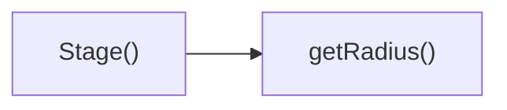

## Genel Bakış
Bu modül, ürünleri 3 boyutlu dairesel (yörüngesel) bir düzende interaktif olarak sergileyen bir React bileşeni sunar. Kullanıcıların ürün kartları üzerinde tıklama, fare ile üzerine gelme, sürükleme gibi işlemler yapmasını destekler, tüm alt bileşenler arasında paylaşılan durum yönetimiyle koordineli bir çalışma sağlar. Three.js tabanlı 3B görselleştirme özellikleriyle dinamik ve akıcı bir vitrin deneyimi sunar.

## Fonksiyon Grupları
### Ana Vitrin ve Koordinasyon Bileşenleri
Tüm sergileme sisteminin ana giriş noktası olan, ürün listelerini yöneten ve tüm alt bileşenlerin etkileşimlerini koordine eden sorumluluğa sahiptir.
- OrbitalProductsShowcase, CarouselItems

### 3B Sahne ve Yardımcı Matematiksel Fonksiyonlar
3B ortamı oluşturan ana sahneyi yöneten, dairesel düzendeki ürünlerin konumlandırılması için gerekli geometrik hesaplamaları yapan işlevleri barındırır.
- Stage, getRadius

### Görselleştirme ve Malzeme Bileşenleri
Ürün kartlarının görsel öğelerini, yer tutucu modellerini, animasyon düzeltmelerini ve yüzey malzemesi ayarlarını oluşturan bileşenleri içerir.
- PlaceholderWireframe, SuspendedCardMaterial, MotionTransitionFix

### Tekil Ürün Kartı İşlevleri
Tek bir ürün kartını oluşturan, kart üzerindeki fare etkileşimlerini yöneten ve kartın öne getirilmesi gibi özel işlemleri gerçekleştiren bileşenlerdir.
- OrbitalCard, handlePointerOver, handlePointerOut

### Genel Sürükleme ve Etkileşim Yöneticileri
Tüm sahne genelinde geçerli olan işaretçi (fare/dokunmatik) olaylarını yöneten, ürünler arasında sürükleyerek gezinme işlemini tamamen kontrol eden fonksiyonları içerir.
- handlePointerDownFull, handlePointerMove, handlePointerUp

---

## AXIOMS – Mimari Varsayımlar
Bu modül, 3B uzayda sıralanan ürün kartlarıyla etkileşim kurulmasını sağlayan orbital ürün vitrini React bileşenidir, çalışması için tüm alt bileşenlere eksiksiz prop iletimi, Three.js tabanlı ortam altyapısı ve senkron durum yönetimi zorunludur.

[Aksiyom 1]: Eğer tüm alt bileşenlere (Stage, OrbitalCard, CarouselItems) aktarılan sharedState ortak durumu eksik veya geçersiz iletilirse, bileşenler arası senkronizasyon bozulur, kart konumlandırması, duraklatma ve odaklama işlevleri çalışmaz.
[Aksiyom 2]: Eğer OrbitalCard bileşenine iletilen item, index, total zorunlu proplarından herhangi biri eksikse, 3B uzaydaki kartların konum hesaplaması yapılamaz, tüm orbital dizilim bozulur.
[Aksiyom 3]: Eğer SuspendedCardMaterial bileşenine iletilen finalPath doku yolu null olmayan geçersiz bir değer ise, kart kaplama malzemeleri yüklenemez, kartlar görünmez veya siyah görüntülenir.
[Aksiyom 4]: Eğer tanımlı tüm pointer olay işleyicileri (handlePointerOver, handlePointerOut, tam ekran pointer işleyicileri) ilgili 3B sahne elemanlarına bağlanmazsa, fare ile kart sürükleme, üzerine gelme, öne getirme gibi tüm kullanıcı etkileşimleri devre dışı kalır.
[Aksiyom 5]: Eğer OrbitalProductsShowcase ana bileşeninin externalPause durumu CarouselItems alt bileşenine isPaused olarak doğru iletilmezse, harici olarak karoseli duraklatma işlevi çalışmaz, kartlar döngüsüne devam eder.
[Aksiyom 6]: Eğer OrbitalCard bileşenine iletilen onHover, onBringToFront, setIsDragging geri çağırım fonksiyonlarından herhangi biri eksikse, kullanıcı etkileşimlerinden kaynaklanan durum güncellemeleri ana bileşene iletilemez, odaklanan kart değişiklikleri kaydedilemez.
[Aksiyom 7]: Eğer PlaceholderWireframe bileşenine iletilen scale propu 0'dan küçük veya sıfır olarak geçirilirse, yer tutucu tel çerçeve öğesi doğru ölçeklenemez, görünmez veya boyutsuz kalır.
[Aksiyom 8]: Eğer OrbitalProductsShowcase ana bileşenine iletilen onCardClick, onFocusedItemChange üst bileşen geri çağırımları tanımlı değilse, kart tıklama ve odak değişikliği olayları ana uygulama ile paylaşılamaz, modülün entegrasyonu bozulur.

---

## FONKSIYON DETAYLARI

### Stage
**Ne yapar**: Orbital ürün karuselinin hemen yüklenen sahne zemini ve özel efektlerini oluşturan React bileşenidir. 3B sahnenin temel altyapısını oluşturarak tüm alt içeriklerin üzerinde çalışmasını sağlar.
**Nasıl yapar**: OrbitalProductsShowcase ana bileşeninin yükleme sırasının en başında çalışır, kendisine iletilen paylaşılmış durum referansını tüm alt bileşenlere ileterek tüm sahne öğelerinin ortak durumu paylaşmasını sağlar. Gerçek zamanlı efektleri sahne zeminiyle bütünleştirerek sorunsuz bir görsel deneyim sunar.
**Parametreler**:
- name: sharedState, type: React.MutableRefObject<SharedState> — Tüm sahne içindeki bileşenlerin paylaştığı ortak durumu tutan değiştirilebilir referans nesnesi
**Dönüş**: React.FC türünde, karusel sahnesini oluşturan React bileşeni döndürür.

### getRadius
**Ne yapar**: Orbital karusel içindeki ürün kartlarının 3B alanda düzgün dağılması için gerekli sahne yarıçapını hesaplayan yardımcı fonksiyondur.
**Nasıl yapar**: Toplam ürün sayısı, kart boyutları ve model ölçeği gibi değişkenlere göre optimum yarıçap değerini hesaplar, böylece kartlar birbiriyle çakışmadan düzgün bir dairesel düzende yer alır.
**Parametreler**: Bulunmamaktadır
**Dönüş**: Dönüş tipi belirtilmemiştir, karusel düzenlemesi için gerekli yarıçap değerini döndürmesi amaçlanmıştır.

### PlaceholderWireframe
**Ne yapar**: 3B yükleme animasyonu için kullanılan geçici wireframe şeklini oluşturan React bileşenidir. Gerçek 3B model veya dokü yüklenene kadar gösterilir.
**Nasıl yapar**: Girilen ölçek değerine göre boyutlandırılarak ekrana çizilir, yükleme sürecinde boşluk oluşturmadan kullanıcıya bir görsel ipucu sunar. Sahne içindeki konumuna uygun olarak ölçeklenerek orantısızlık yaratmaz.
**Parametreler**:
- name: scale, type: number | opsiyonel, varsayılan değeri 1 — Wireframe'in genel boyut çarpanını belirten ölçek değeri
**Dönüş**: Dönüş tipi belirtilmemiştir, React elementi olarak ekrana wireframe içeriği sunar.

### SuspendedCardMaterial
**Ne yapar**: Kategori dışı standart resimli kartlar için dokü yüklenene kadar bekleyen özel materyal bileşenidir.
**Nasıl yapar**: Kendisine iletilen son görsel yolu üzerinden doküyü yüklemeye çalışır, yükleme tamamlanana kadar geçici materyal kullanır. Fare kartın üzerindeyse (hovered) ekstra görsel efektler uygulayarak etkileşim olduğunu belli eder.
**Parametreler**:
- name: finalPath, type: string | null — Kartın yüklenecek son doküsünün dosya yolu, null olması durumunda geçici materyal sürekli gösterilir
- name: hovered, type: boolean — Fare imlecinin kart üzerinde olup olmadığını belirten bayrak, materyale ekstra efektler uygulamak için kullanılır
**Dönüş**: Dönüş tipi belirtilmemiştir, 3B kart üzerinde kullanılmak üzere hazırlanmış materyal öğesini döndürür.

### OrbitalCard
**Ne yapar**: 3B karusel içinde yer alan tek bir ürün kartını oluşturan ana ürün bileşenidir. Tüm kullanıcı etkileşimlerini ve kartın görsel özelliklerini yönetir.
**Nasıl yapar**: Kendisine iletilen ürün verisi, ortak durum ve geri çağırım fonksiyonlarını kullanarak 3B alanda konumlandırılır, sürükleme, tıklama, odaklama gibi tüm kullanıcı aksiyonlarını işler. Ön plana alma, sürükleme durumu ayarlama gibi işlemleri tetikler, kartın üzerine ipucu görselleri ekler ve model ölçeğine göre boyutlandırılır.
**Parametreler**:
- name: item, type: ProductItem — Kartın üzerinde gösterileceği ürün verisini içeren nesne
- name: index, type: number — Kartın karusel içindeki sıra numarası
- name: total, type: number — Karusel içindeki toplam kart sayısı
- name: sharedState, type: React.MutableRefObject<SharedState> — Tüm kartların paylaştığı ortak durumu tutan değiştirilebilir referans nesnesi
- name: onHover, type: (hovering: boolean) => void — Fare kart üzerine geldiğinde veya ayrıldığında tetiklenen, durumunu ileten geri çağırım fonksiyonu
- name: onBringToFront, type: (index: number) => void — Kartı en ön plana almak için tetiklenen, sıra numarasını ileten geri çağırım fonksiyonu
- name: setIsDragging, type: (dragging: boolean) => void — Kartın sürüklenme durumunu ayarlamak için kullanılan geri çağırım fonksiyonu
- name: isDraggingRef, type: React.MutableRefObject<boolean> — Kartın o anda sürüklenip sürüklenmediğini tutan değiştirilebilir referans
- name: onCardClick, type: (itemId: string, event?: MouseEvent) => void | opsiyonel — Kart tıklandığında tetiklenen, ürün kimliğini ve isteğe bağlı fare olayını ileten geri çağırım
- name: onFocusedItemChange, type: (itemId: string | null) => void | opsiyonel — Odaklanan ürün değiştiğinde tetiklenen, yeni odaklanan ürün kimliğini veya null değerini ileten geri çağırım
- name: isFrontCard, type: boolean — Kartın o anda en ön planda olup olmadığını belirten bayrak
- name: shouldShowTapHint, type: boolean — Kart üzerinde tıklama ipucunun gösterilip gösterilmeyeceğini belirten bayrak
- name: shouldShowDragHint, type: boolean — Kart üzerinde sürükleme ipucunun gösterilip gösterilmeyeceğini belirten bayrak
- name: modelScale, type: number — Kart 3B modelinin genel boyut çarpanını belirten ölçek değeri
**Dönüş**: React.FC türünde, tek ürün kartını ekrana çizen React bileşeni döndürür.

### handlePointerOver
**Ne yapar**: 3B sahne üzerindeki Three.js nesneleri üzerine fare imleci geldiğinde tetiklenen olay işleyici fonksiyonudur.
**Nasıl yapar**: Fare imlecinin 3B nesne üzerinde olduğunu algılar, ilgili kartın hover durumunu güncellemek için gerekli aksiyonları tetikler, görsel efektlerin devreye girmesini sağlar.
**Parametreler**:
- name: e, type: ThreeEvent<PointerEvent> — Three.js tarafından üretilen, fare üzerine gelme olayını içeren olay nesnesi
**Dönüş**: Dönüş tipi belirtilmemiştir, olay işleyici olarak çalışır.

### handlePointerOut
**Ne yapar**: 3B sahne üzerindeki Three.js nesnelerinden fare imleci ayrıldığında tetiklenen olay işleyici fonksiyonudur.
**Nasıl yapar**: Fare imlecinin nesneden ayrıldığını algılar, ilgili kartın aktif hover durumunu sıfırlar, uygulanan ekstra görsel efektleri kaldırır.
**Parametreler**:
- name: e, type: ThreeEvent<PointerEvent> — Three.js tarafından üretilen, fare ayrılma olayını içeren olay nesnesi
**Dönüş**: Dönüş tipi belirtilmemiştir, olay işleyici olarak çalışır.

### CarouselItems
**Ne yapar**: Tüm ürün kartlarını ve karusel mantığını yöneten, React Suspense bileşeni içinde çalışan ana koleksiyon bileşenidir.
**Nasıl yapar**: Kendisine iletilen ürün listesini alarak 3B karusel içinde düzenler, duraklatma, sürükleme, etkileşim tetikleme gibi tüm karusel işlevlerini yönetir. Alt kartlara gerekli tüm prop ve geri çağırım fonksiyonlarını iletir, ipucu sisteminin farklı aşamalarını yönetir, tüm ürünler yüklendiğinde hazırlık durumunu bildiren onReady geri çağırımını tetikler.
**Parametreler**:
- name: items, type: ProductItem[] — Karusel içinde gösterilecek tüm ürünlerin verisini içeren dizi
- name: isPaused, type: boolean — Karusel otomatik döngüsünün duraklatılıp duraklatılmadığını belirten bayrak
- name: onHover, type: (h: boolean) => void — Herhangi bir kartın üzerine gelindiğinde tetiklenen, durumunu ileten geri çağırım
- name: dragDelta, type: number — Kullanıcının sürükleme işlemiyle oluşturduğu konum değişikliği değeri
- name: onInteract, type: () => void — Kullanıcı herhangi bir etkileşimde bulunduğunda tetiklenen geri çağırım fonksiyonu
- name: sharedState, type: React.MutableRefObject<SharedState> — Tüm karusel öğelerinin paylaştığı ortak durumu tutan değiştirilebilir referans nesnesi
- name: isDraggingRef, type: React.MutableRefObject<boolean> — Herhangi bir kartın o anda sürüklenip sürüklenmediğini tutan değiştirilebilir referans
- name: setIsDragging, type: (val: boolean) => void — Genel sürükleme durumunu ayarlamak için kullanılan geri çağırım fonksiyonu
- name: onCardClick, type: (itemId: string, event?: MouseEvent) => void | opsiyonel — Herhangi bir kart tıklandığında tetiklenen, ürün kimliğini ve isteğe bağlı fare olayını ileten geri çağırım
- name: onFocusedItemChange, type: (itemId: string | null) => void | opsiyonel — Odaklanan ürün değiştiğinde tetiklenen, yeni odaklanan ürün kimliğini veya null değerini ileten geri çağırım
- name: onFrontCardChange, type: (itemId: string) => void | opsiyonel — En ön plandaki ürün değiştiğinde tetiklenen, yeni ön plandaki ürün kimliğini ileten geri çağırım
- name: shouldShowTapHint, type: boolean — Tüm kartlar üzerinde tıklama ipucunun gösterilip gösterilmeyeceğini belirten bayrak
- name: shouldShowDragHint, type: boolean — Tüm kartlar üzerinde sürükleme ipucunun gösterilip gösterilmeyeceğini belirten bayrak
- name: hintStage, type: 'idle' | 'tap' | 'drag' | 'cooldown' | 'finished' — İpucu sisteminin o andaki aşamasını belirten durum değeri
- name: onStageChange, type: (stage: 'idle' | 'tap' | 'drag' | 'cooldown' | 'finished') => void — İpucu aşaması değiştiğinde tetiklenen, yeni aşamayı ileten geri çağırım fonksiyonu
- name: modelScale, type: number — Tüm kart 3B modellerinin genel boyut çarpanını belirten ölçek değeri
- name: onReady, type: () => void — Tüm karusel öğeleri yüklendiğinde ve hazır olduğunda tetiklenen geri çağırım fonksiyonu
**Dönüş**: React.FC türünde, tüm ürün kartlarını ve karusel mantığını yöneten React bileşeni döndürür.

### MotionTransitionFix
**Ne yapar**: Framer Motion ölçek geçişleri sırasında React Three Fiber (R3F) başlangıç karelerini zorla render etmeye yarayan iç yardımcı fonksiyondur.
**Nasıl yapar**: Global window nesnesine gereksiz yeniden boyutlandırma olayları eklemeden, Framer Motion ile R3F arasındaki ölçek geçişi uyumsuzluğunu giderir, ilk karelerin doğru şekilde renderlanmasını sağlayarak görsel bozuklukları ortadan kaldırır.
**Parametreler**: Bulunmamaktadır
**Dönüş**: Dönüş tipi belirtilmemiştir, geçiş sırasında gerekli render işlemlerini tetikleyen iç yardımcı olarak çalışır.

### OrbitalProductsShowcase
**Ne yapar**: Tüm orbital ürün karuselini kapsayan ana üst React bileşenidir. Tüm alt bileşenleri birleştirerek tek bir kullanılabilir bileşen olarak sunar.
**Nasıl yapar**: İçinde Stage, CarouselItems, MotionTransitionFix gibi tüm alt bileşenleri bütünleştirir, dışarıdan alınan tüm prop ve geri çağırım fonksiyonlarını ilgili alt bileşenlere ileterek tüm karusel sisteminin sorunsuz çalışmasını sağlar. Harici duraklatma, ürün tıklama, odak ve ön planda olan ürün değişikliği gibi işlevleri destekler.
**Parametreler**:
- name: items, type: ProductItem[] — Karusel içinde gösterilecek tüm ürünlerin verisini içeren dizi
- name: onCardClick, type: (itemId: string, event?: MouseEvent) => void | opsiyonel — Herhangi bir kart tıklandığında dışarıya bildirmek için kullanılan geri çağırım fonksiyonu
- name: externalPause, type: boolean, varsayılan değeri false — Karusel otomatik döngüsünün dışarıdan gelen bir komutla duraklatılıp duraklatılmadığını belirten bayrak
- name: onFocusedItemChange, type: (itemId: string | null) => void | opsiyonel — Odaklanan ürün değiştiğinde dışarıya bildirmek için kullanılan geri çağırım
- name: onFrontCardChange, type: (itemId: string) => void | opsiyonel — En ön plandaki ürün değiştiğinde dışarıya bildirmek için kullanılan geri çağırım
*Girilen imza uyarınca kalan tüm özellikler `OrbitalProductsShowcaseProps` türü içinde tanımlıdır*
**Dönüş**: `React.FC<OrbitalProductsShowcaseProps>` türünde, tüm orbital ürün karuselini kapsayan ana React bileşeni döndürür.

---

### handlePointerDownFull
**Ne yapar**: Orbital ürün vitrini bileşeninde kullanıcının ekran üzerinde pointer (fare, dokunmatik, kalem) ile basma işlemini başlattığı anda tetiklenir, ürün listesini kaydırma hareketinin temel başlangıç verilerini kaydederek kaydırma sürecini aktif hale getirir. Sadece bu başlangıç olayı ile tüm ekran boyutunda pointer hareketini takip edebilmek için gerekli altyapıyı hazırlar.
**Nasıl yapar**: İlk olarak olayın varsayılan tarayıcı davranışını engelleyerek yanlışlıkla sayfa kaydırması gibi istenmeyen etkileşimleri önler. Pointer olayının başlangıçtaki X ve Y koordinatlarını, zaman damgasını bileşenin iç durumuna kaydeder, aktif kaydırma bayrağını true olarak ayarlar ve ilgili vitrin DOM elemanı üzerinde pointer capture alarak pointer işaretçisinin vitrin alanı dışına çıksa bile hareketinin takip edilmesini sağlar.
**Parametreler**:
- name: e, type: React.PointerEvent — Kullanıcının pointer ile başlattığı etkileşimin tüm verilerini (konum, işaretçi türü, tıklama sayısı vb.) barındıran React uyumlu olay nesnesi
**Dönüş**: void, herhangi bir değer döndürmez, yalnızca bileşenin iç durumunu ve olay akışını yönetir.

### handlePointerMove
**Ne yapar**: Kullanıcı basılı tuttuğu pointer'ı hareket ettirdikçe sürekli tetiklenir, başlangıç noktasına göre anlık konum farkını hesaplayarak ürün vitrininin yatay kaydırma miktarını dinamik olarak günceller. Aynı zamanda pointer serbest bırakıldıktan sonra uygulanacak atalet hareketi için gerekli hız ve mesafe verilerini toplar.
**Nasıl yapar**: Önce aktif kaydırma bayrağını kontrol eder, eğer kullanıcı kaydırma işlemini başlatmamışsa hiçbir işlem yapmaz. Kayıtlı başlangıç koordinatları ile olaydaki anlık pointer koordinatları arasındaki farkı hesaplar, bu farkı kullanarak vitrinin CSS transform değerini güncellerek ürünlerin kullanıcı hareketiyle birlikte kaymasını sağlar. Anlık hareket hızını her adımda kaydederek atalet animasyonu için giriş verilerini toplar.
**Parametreler**:
- name: e, type: React.PointerEvent — Hareket anındaki pointer'ın güncel konumunu ve diğer etkileşim verilerini içeren React uyumlu olay nesnesi
**Dönüş**: void, herhangi bir değer döndürmez, yalnızca kaydırma konumunu ve takip verilerini günceller.

### handlePointerUp
**Ne yapar**: Kullanıcının pointer'ı serbest bıraktığı anda tetiklenir, aktif kaydırma işlemini sonlandırır, toplanan hız verilerine göre doğal atalet kaydırma animasyonunu başlatır ve tüm kaynakları serbest bırakır. Kısa süreli basma işlemlerini tıklama olarak algılayarak ilgili ürünün seçim işlemini tetikleme kontrolünü de yapar.
**Nasıl yapar**: Önce aktif kaydırma bayrağını false olarak ayarlar, vitrin DOM elemanı üzerindeki pointer capture iznini kaldırır. Kaydırma sırasında toplanan anlık hız değerini kullanarak, pointer serbest bırakıldıktan sonra ürün vitrininin yavaşlayarak durmasını sağlayan atalet animasyonunu tetikler. Eğer toplam kaydırma mesafesi eşik değerin altında kalırsa, işlemi tıklama olarak algılar ve ilgili ürünün detaylarını açmak veya ürün seçmek için gerekli adımları başlatır.
**Parametreler**: Herhangi bir giriş parametresi almaz.
**Dönüş**: void, herhangi bir değer döndürmez, yalnızca kaydırma sürecini sonlandırır ve sonrasındaki animasyon veya seçim etkileşimlerini yönetir.

---

## INTERFACES

### ProductItem
- `id: string`
- `title: string`
- `image: string`
- `categorySlug?: string`
- `modelType?: string`

### OrbitalProductsShowcaseProps
- `items: ProductItem[]`
- `onCardClick?: (itemId: string, event?: MouseEvent) => void`
- `externalPause?: boolean`
- `onFocusedItemChange?: (itemId: string | null) => void`
- `onFrontCardChange?: (itemId: string) => void`
- `modelScale?: number`
- `containerHeight?: string | number`
- `skipHints?: boolean`

### SharedState
- `rotation: number`
- `target: number | null`
- `velocity: number`
- `pauseUntil: number`
- `startTime: number`
- `isReady: boolean`

---

## AST POINTERS

### [N1_NASIL] AST Pointer: C:\Users\alize\venthub-hvac\src\components\products\OrbitalProductsShowcase.tsx::Stage
- **params**: sharedState: React.MutableRefObject<SharedState>
- **ic_degiskenler**:
  - `useFrame` — @react-three/fiber hook used to trigger re-renders for stage animations
  - `getRadius` — internal helper function that calculates current carousel radius based on shared load state
  - `currentRadius` — calculated radius value used to size the expanding ring mesh in the stage
- **Dönüş**: React.JSX.Element (3D group containing stage meshes and particle effects)

### [N2_NASIL] AST Pointer: C:\Users\alize\venthub-hvac\src\components\products\OrbitalProductsShowcase.tsx::getRadius
- **params**: (parametre yok)
- **ic_degiskenler**:
  - `sharedState.current.isReady` — flag indicating if all carousel assets are loaded, returns 0 radius before load completes
  - `sharedState.current.startTime` — timestamp when assets finished loading, used to calculate elapsed animation time
  - `elapsed` — normalized time since load, used to animate smooth radius expansion
- **Dönüş**: number (calculated current radius value for positioning carousel elements)

### [N3_NASIL] AST Pointer: C:\Users\alize\venthub-hvac\src\components\products\OrbitalProductsShowcase.tsx::PlaceholderWireframe
- **params**: scale?: number (defaults to 1)
- **ic_degiskenler**:
  - `meshRef` — React ref to the 3D mesh element, used to control rotation in animations
  - `useFrame` — @react-three/fiber hook that runs every frame to update mesh rotation values
  - `state.clock.elapsedTime` — global scene clock time used to calculate continuous rotation
- **Dönüş**: React.JSX.Element (animated wireframe icosahedron placeholder for unloaded product cards)

### [N4_NASIL] AST Pointer: C:\Users\alize\venthub-hvac\src\components\products\OrbitalProductsShowcase.tsx::SuspendedCardMaterial
- **params**: finalPath: string | null, hovered: boolean
- **ic_degiskenler**:
  - `texture` — product image texture loaded via @react-three/drei useTexture hook, used as card material map
  - `THREE.SRGBColorSpace` — color space assigned to texture to correct product image color rendering
- **Dönüş**: React.JSX.Element (THREE meshStandardMaterial configured for product cards with dynamic hover glow effect)

### [N5_NASIL] AST Pointer: C:\Users\alize\venthub-hvac\src\components\products\OrbitalProductsShowcase.tsx::OrbitalCard
- **params**: item: ProductItem, index: number, total: number, sharedState: React.MutableRefObject<SharedState>, onHover: (hovering: boolean) => void, onBringToFront: (index: number) => void, setIsDragging: (dragging: boolean) => void, isDraggingRef: React.MutableRefObject<boolean>, onCardClick?: (itemId: string, event?: MouseEvent) => void, onFocusedItemChange?: (itemId: string | null) => void, isFrontCard: boolean, shouldShowTapHint: boolean, shouldShowDragHint: boolean, modelScale: number
- **ic_degiskenler**:
  - `groupRef` — ref to the card's 3D group, used to control position, scale and rotation
  - `useFrame` — animation frame hook that runs every frame to update card position and state
  - `sharedState.current.isReady` — load state flag used to hide cards before entry animations start
  - `ANIM_STAGGER_DELAY` — constant to stagger entry animations of sequential cards
  - `lastIsNearRef` — ref tracking if the card is in the front half of the carousel
  - `setIsNearFront` — state setter to update front card status for UI depth effects
  - `hovered` — local state tracking if the card is currently hovered by the user
- **Dönüş**: React.JSX.Element (3D product card element positioned in the orbital carousel)

### [N6_NASIL] AST Pointer: C:\Users\alize\venthub-hvac\src\components\products\OrbitalProductsShowcase.tsx::handlePointerOver
- **params**: e: ThreeEvent<PointerEvent>
- **ic_degiskenler**:
  - `e.stopPropagation()` — method to block hover event from propagating to background cards
  - `setHover` — local state setter to mark the current card as hovered
  - `onHover` — parent callback to notify the carousel of the current card's hover state
  - `document.body.style.cursor` — DOM style update to set pointer cursor when hovering over interactive cards
- **Dönüş**: yok

### [N7_NASIL] AST Pointer: C:\Users\alize\venthub-hvac\src\components\products\OrbitalProductsShowcase.tsx::handlePointerOut
- **params**: e: ThreeEvent<PointerEvent>
- **ic_degiskenler**:
  - `e.stopPropagation()` — method to stop hover event from propagating to other scene elements
  - `setHover` — local state setter to mark the current card as no longer hovered
  - `onHover` — parent callback to notify the carousel of hover state end
  - `document.body.style.cursor` — DOM style update to reset cursor to default after hover ends
- **Dönüş**: yok

### [N8_NASIL] AST Pointer: C:\Users\alize\venthub-hvac\src\components\products\OrbitalProductsShowcase.tsx::CarouselItems
- **params**: items: ProductItem[], isPaused: boolean, onHover: (h: boolean) => void, dragDelta: number, onInteract: () => void, sharedState: React.MutableRefObject<SharedState>, isDraggingRef: React.MutableRefObject<boolean>, setIsDragging: (val: boolean) => void, onCardClick?: (itemId: string, event?: MouseEvent) => void, onFocusedItemChange?: (itemId: string | null) => void, onFrontCardChange?: (itemId: string) => void, shouldShowTapHint: boolean, shouldShowDragHint: boolean, hintStage: 'idle' | 'tap' | 'drag' | 'cooldown' | 'finished', onStageChange: (stage: 'idle' | 'tap' | 'drag' | 'cooldown' | 'finished') => void, modelScale: number, onReady: () => void
- **ic_degiskenler**:
  - `useThree().camera` — hook to access the Three.js scene camera for breathing animation
  - `lastFrontCardRef` — ref tracking the ID of the current front card to detect state changes
  - `frontCardId` — local state storing the ID of the card currently at the front of the carousel
  - `swayOffsetRef` — ref tracking drag hint sway animation offset value
  - `useEffect` — React hook to trigger onReady callback when component mounts
  - `useFrame` — animation frame hook that runs carousel rotation, drag, snap and auto-rotate logic
  - `items.map` — method to render all OrbitalCard components from the input items array
- **Dönüş**: React.JSX.Element (3D group containing all orbital product cards in the carousel)

### [N9_NASIL] AST Pointer: C:\Users\alize\venthub-hvac\src\components\products\OrbitalProductsShowcase.tsx::MotionTransitionFix
- **params**: (parametre yok)
- **ic_degiskenler**:
  - `useThree().invalidate` — hook to access Three.js frame invalidation method
  - `useEffect` — React hook that sets up interval to invalidate frames during Framer Motion transitions
  - `interval` — setInterval ID used to trigger frequent frame invalidations during layout transitions
  - `setTimeout` — timer to clear the invalidation interval after transition completes
- **Dönüş**: null (no UI element rendered, only resolves canvas layout issues during CSS transitions)

### [N10_NASIL] AST Pointer: C:\Users\alize\venthub-hvac\src\components\products\OrbitalProductsShowcase.tsx::OrbitalProductsShowcase
- **params**: items: ProductItem[], onCardClick?: (itemId: string, event?: MouseEvent) => void, externalPause = false, onFocusedItemChange?: (itemId: string | null) => void, onFrontCardChange?: (itemId: string) => void, modelScale = 1.5, containerHeight = 500, skipHints = false
- **ic_degiskenler**:
  - `isPaused` — local state to pause carousel auto-rotation
  - `dragDelta` — local state storing pointer drag distance for carousel movement
  - `focusedItemId` — local state storing ID of the user-selected focused card
  - `containerRef` — ref to the root DOM container of the component
  - `isInView` — Framer Motion useInView hook result indicating if the component is in the viewport
  - `ResizeObserver` — DOM API to observe container size changes and trigger canvas resizes
  - `hintStage` — local state tracking the carousel user hint sequence state
  - `sharedState` — main shared state ref passed to all child components, tracking rotation, velocity, load state etc.
  - `handleItemsReady` — useCallback-wrapped callback to mark assets as loaded and start entry animations
  - `isDraggingState` — local state tracking drag status for UI cursor updates
- **Dönüş**: React.JSX.Element (root component of the orbital product showcase, containing canvas and UI overlay elements)

### [N11_NASIL] AST Pointer: C:\Users\alize\venthub-hvac\src\components\products\OrbitalProductsShowcase.tsx::handlePointerDownFull
- **params**: e: React.PointerEvent
- **ic_degiskenler**:
  - `focusedItemId` — checked to block drag initiation if a card is already focused
  - `isDraggingRef.current` — set to true to mark the start of a user drag interaction
  - `setIsDraggingState` — state setter to update local drag state for UI cursor changes
  - `lastX.current` — updated to store the initial pointer X position at drag start
  - `setDragDelta` — resets drag delta to 0 at the start of a new drag
- **Dönüş**: yok

### [N12_NASIL] AST Pointer: C:\Users\alize\venthub-hvac\src\components\products\OrbitalProductsShowcase.tsx::handlePointerMove
- **params**: e: React.PointerEvent
- **ic_degiskenler**:
  - `isDraggingRef.current` — checked to only process move events during active drag
  - `focusedItemId` — checked to block move events if a card is currently focused
  - `delta` — calculated horizontal distance the pointer has moved since the last frame
  - `lastX.current` — updated to the current pointer X position for next frame's delta calculation
  - `setDragDelta` — state setter to update drag delta used to rotate the carousel
- **Dönüş**: yok

### [N13_NASIL] AST Pointer: C:\Users\alize\venthub-hvac\src\components\products\OrbitalProductsShowcase.tsx::handlePointerUp
- **params**: (parametre yok)
- **ic_degiskenler**:
  - `isDraggingRef.current` — set to false to mark the end of a user drag interaction
  - `setIsDraggingState` — state setter to update local drag state for UI cursor reset
  - `setTimeout` — timer to reset drag delta to 0 after drag ends
- **Dönüş**: yok

---

## ÇAĞRI HARİTASI

### Disariya Cagrilar (Outgoing)
Dosya içindeki Stage() fonksiyonu sadece getRadius fonksiyonunu, ilgili nesnenin yarıçap değerini almak amacıyla çağırmaktadır.

### Disaridan Cagrilanlar (Incoming)
Sağlanan veride bu modülü kullanan herhangi bir dış modül, dosya veya fonksiyon bilgisi paylaşılmamıştır.

### Ic Ice Fonksiyonlar (Nested)
Yok

---

## DOSYA-İÇİ ÇAĞRI GRAFİĞİ
  Stage() → getRadius()

---

## NODE ID STANDARD

  file: src\components\products\OrbitalProductsShowcase.tsx
  function: src\components\products\OrbitalProductsShowcase.tsx::Stage
  function: src\components\products\OrbitalProductsShowcase.tsx::getRadius
  function: src\components\products\OrbitalProductsShowcase.tsx::PlaceholderWireframe
  function: src\components\products\OrbitalProductsShowcase.tsx::SuspendedCardMaterial
  function: src\components\products\OrbitalProductsShowcase.tsx::OrbitalCard
  function: src\components\products\OrbitalProductsShowcase.tsx::handlePointerOver
  function: src\components\products\OrbitalProductsShowcase.tsx::handlePointerOut
  function: src\components\products\OrbitalProductsShowcase.tsx::CarouselItems
  function: src\components\products\OrbitalProductsShowcase.tsx::MotionTransitionFix
  function: src\components\products\OrbitalProductsShowcase.tsx::OrbitalProductsShowcase
  function: src\components\products\OrbitalProductsShowcase.tsx::handlePointerDownFull
  function: src\components\products\OrbitalProductsShowcase.tsx::handlePointerMove
  function: src\components\products\OrbitalProductsShowcase.tsx::handlePointerUp

---

## DISA AKTARILANLAR (EXPORTS)
  export: CarouselItems
  export: MotionTransitionFix
  export: OrbitalCard
  export: OrbitalProductsShowcase
  export: PlaceholderWireframe
  export: ProductItem
  export: Stage
  export: SuspendedCardMaterial

---

## STİL TOKENLERİ

### Arbitrary Değerler (token'a geçirilmemiş)
- **shadow:** (yok)
- **height:** `h-[72px]`
- **width:** `w-[72px]`
- **spacing:** (yok)
- **diğer:** (yok)

### Kullanılan Token'lar (zaten token'a geçirilmiş)
- (yok)

### Tailwind Sınıf Özeti
- **Renkler:** `bg-cyan-500/20`, `bg-cyan-950/30`, `bg-gradient-to-l`, `bg-gradient-to-r`, `bg-slate-900/70`, `bg-slate-900/80`, `border-2`, `border-cyan-400/40`, `border-cyan-500/50`, `border-cyan-500/60`, `border-slate-700/50`, `from-surface-darker`, `md:text-sm`, `text-cyan-300`, `text-slate-200`
- **Layout:** `absolute`, `backdrop-blur-sm`, `flex`, `flex-col`, `from-surface-darker`, `gap-24`, `gap-3`, `h-16`, `h-8`, `h-9`, `items-center`, `justify-center`, `left-0`, `relative`, `right-0`
- **Responsive:** `md:`, `sm:` prefix kullanımları
