## Genel Bakış
Bu modül, ürünleri dairesel bir 3B yörüngede interaktif olarak sergileyen React ve Three.js tabanlı bir vitrin bileşenidir. Kullanıcılar fare etkileşimleriyle ürün kartları arasında gezinebilir, sürükleyebilir ve tıklayabilir. Paylaşılan durum yapısı üzerinden tüm alt bileşenlerin koordineli bir şekilde çalışmasını sağlar.

## Fonksiyon Grupları
### Ana Vitrin Kontrolü
Sergileme sisteminin üst düzey yönetimini üstlenen ana bileşenleri barındırır. Dışarıdan gelen duraklama, odak değişimi ve kart tıklama olaylarını yöneterek tüm sistemin akışını kontrol eder.
- OrbitalProductsShowcase, CarouselItems

### 3B Sahne ve Geometrik Hesaplamalar
Ürünlerin dairesel dizideki konumlarını belirleyen geometrik hesaplamaları ve 3B sahne yapısını oluşturur. Yörünge yarıçapı gibi temel değerleri hesaplar.
- Stage, getRadius

### Kart Görselleştirme ve Malzemeler
Ürün kartlarının 3D görünümünü, animasyon düzeltmelerini ve malzeme ayarlarını tanımlar. Yer tutucı modeller, yükleme durumları ve kart materyalleri bu grupta yer alır.
- OrbitalCard, PlaceholderWireframe, SuspendedCardMaterial, MotionTransitionFix

### İşaretleyici Etkileşimleri
Fare ve dokunmatik giriş olaylarını yöneterek kullanıcı etkileşimlerini merkezi olarak işler. Üzerine gelme, sürükleme ve bırakma işlemleri için olay işleyicileri içerir.
- handlePointerOver, handlePointerOut, handlePointerDownFull, handlePointerMove, handlePointerUp

---

## AXIOMS – Mimari Varsayımlar
- Bu modül davranışsal mantık içermez (salt veri / konfigürasyon / tip tanımı).
- [Aksiyom 1]: Modülün dışa açtığı yapı (anahtar kümesi / şema) bir sözleşmedir; tüketiciler bu sabit yapıya bağlıdır — kırıcı değişiklik tüm tüketicileri etkiler.
- [Aksiyom 2]: Bir öğe ekleme/çıkarma yapısal-uyumlu olmalı; ilgili tipler ve seçiciler aynı commit'te güncel tutulmalıdır.

---

## FONKSİYON DETAYLARI

### Stage
**Ne yapar**: Orbital ürün karuselinin hemen yüklenen sahne zemini ve özel efektlerini oluşturan React bileşenidir. 3B sahnenin temel altyapısını oluşturarak tüm alt içeriklerin üzerinde çalışmasını sağlar.
**Nasıl yapar**: OrbitalProductsShowcase ana bileşeninin yükleme sırasının en başında çalışır, kendisine iletilen paylaşılmış durum referansını tüm alt bileşenlere ileterek tüm sahne öğelerinin ortak durumu paylaşmasını sağlar. Gerçek zamanlı efektleri sahne zeminiyle bütünleştirerek sorunsuz bir görsel deneyim sunar.
**Parametreler**:
- name: sharedState, type: React.MutableRefObject<SharedState> — Tüm sahne içindeki bileşenlerin paylaştığı ortak durumu tutan değiştirilebilir referans nesnesi
**Dönüş**: React.FC türünde, karusel sahnesini oluşturan React bileşeni döndürür.

### getRadius
**Ne yapar**: Orbital karusel içindeki ürün kartlarının 3B alanda düzgün dağılması için gerekli sahne yarıçapını hesaplayan yardımcı fonksiyondur.
**Nasıl yapar**: Toplam ürün sayısı, kart boyutları ve model ölçeği gibi değişkenlere göre optimum yarıçap değerini hesaplar, böylece kartlar birbiriyle çakışmadan düzgün bir dairesel düzende yer alır.
**Parametreler**: Bulunmamaktadır
**Dönüş**: Dönüş tipi belirtilmemiştir, karusel düzenlemesi için gerekli yarıçap değerini döndürmesi amaçlanmıştır.

### PlaceholderWireframe
**Ne yapar**: 3B yükleme animasyonu için kullanılan geçici wireframe şeklini oluşturan React bileşenidir. Gerçek 3B model veya dokü yüklenene kadar gösterilir.
**Nasıl yapar**: Girilen ölçek değerine göre boyutlandırılarak ekrana çizilir, yükleme sürecinde boşluk oluşturmadan kullanıcıya bir görsel ipucu sunar. Sahne içindeki konumuna uygun olarak ölçeklenerek orantısızlık yaratmaz.
**Parametreler**:
- name: scale, type: number | opsiyonel, varsayılan değeri 1 — Wireframe'in genel boyut çarpanını belirten ölçek değeri
**Dönüş**: Dönüş tipi belirtilmemiştir, React elementi olarak ekrana wireframe içeriği sunar.

### SuspendedCardMaterial
**Ne yapar**: Kategori dışı standart resimli kartlar için dokü yüklenene kadar bekleyen özel materyal bileşenidir.
**Nasıl yapar**: Kendisine iletilen son görsel yolu üzerinden doküyü yüklemeye çalışır, yükleme tamamlanana kadar geçici materyal kullanır. Fare kartın üzerindeyse (hovered) ekstra görsel efektler uygulayarak etkileşim olduğunu belli eder.
**Parametreler**:
- name: finalPath, type: string | null — Kartın yüklenecek son doküsünün dosya yolu, null olması durumunda geçici materyal sürekli gösterilir
- name: hovered, type: boolean — Fare imlecinin kart üzerinde olup olmadığını belirten bayrak, materyale ekstra efektler uygulamak için kullanılır
**Dönüş**: Dönüş tipi belirtilmemiştir, 3B kart üzerinde kullanılmak üzere hazırlanmış materyal öğesini döndürür.

### OrbitalCard
**Ne yapar**: 3B karusel içinde yer alan tek bir ürün kartını oluşturan ana ürün bileşenidir. Tüm kullanıcı etkileşimlerini ve kartın görsel özelliklerini yönetir.
**Nasıl yapar**: Kendisine iletilen ürün verisi, ortak durum ve geri çağırım fonksiyonlarını kullanarak 3B alanda konumlandırılır, sürükleme, tıklama, odaklama gibi tüm kullanıcı aksiyonlarını işler. Ön plana alma, sürükleme durumu ayarlama gibi işlemleri tetikler, kartın üzerine ipucu görselleri ekler ve model ölçeğine göre boyutlandırılır.
**Parametreler**:
- name: item, type: ProductItem — Kartın üzerinde gösterileceği ürün verisini içeren nesne
- name: index, type: number — Kartın karusel içindeki sıra numarası
- name: total, type: number — Karusel içindeki toplam kart sayısı
- name: sharedState, type: React.MutableRefObject<SharedState> — Tüm kartların paylaştığı ortak durumu tutan değiştirilebilir referans nesnesi
- name: onHover, type: (hovering: boolean) => void — Fare kart üzerine geldiğinde veya ayrıldığında tetiklenen, durumunu ileten geri çağırım fonksiyonu
- name: onBringToFront, type: (index: number) => void — Kartı en ön plana almak için tetiklenen, sıra numarasını ileten geri çağırım fonksiyonu
- name: setIsDragging, type: (dragging: boolean) => void — Kartın sürüklenme durumunu ayarlamak için kullanılan geri çağırım fonksiyonu
- name: isDraggingRef, type: React.MutableRefObject<boolean> — Kartın o anda sürüklenip sürüklenmediğini tutan değiştirilebilir referans
- name: onCardClick, type: (itemId: string, event?: MouseEvent) => void | opsiyonel — Kart tıklandığında tetiklenen, ürün kimliğini ve isteğe bağlı fare olayını ileten geri çağırım
- name: onFocusedItemChange, type: (itemId: string | null) => void | opsiyonel — Odaklanan ürün değiştiğinde tetiklenen, yeni odaklanan ürün kimliğini veya null değerini ileten geri çağırım
- name: isFrontCard, type: boolean — Kartın o anda en ön planda olup olmadığını belirten bayrak
- name: shouldShowTapHint, type: boolean — Kart üzerinde tıklama ipucunun gösterilip gösterilmeyeceğini belirten bayrak
- name: shouldShowDragHint, type: boolean — Kart üzerinde sürükleme ipucunun gösterilip gösterilmeyeceğini belirten bayrak
- name: modelScale, type: number — Kart 3B modelinin genel boyut çarpanını belirten ölçek değeri
**Dönüş**: React.FC türünde, tek ürün kartını ekrana çizen React bileşeni döndürür.

### handlePointerOver
**Ne yapar**: 3B sahne üzerindeki Three.js nesneleri üzerine fare imleci geldiğinde tetiklenen olay işleyici fonksiyonudur.
**Nasıl yapar**: Fare imlecinin 3B nesne üzerinde olduğunu algılar, ilgili kartın hover durumunu güncellemek için gerekli aksiyonları tetikler, görsel efektlerin devreye girmesini sağlar.
**Parametreler**:
- name: e, type: ThreeEvent<PointerEvent> — Three.js tarafından üretilen, fare üzerine gelme olayını içeren olay nesnesi
**Dönüş**: Dönüş tipi belirtilmemiştir, olay işleyici olarak çalışır.

### handlePointerOut
**Ne yapar**: 3B sahne üzerindeki Three.js nesnelerinden fare imleci ayrıldığında tetiklenen olay işleyici fonksiyonudur.
**Nasıl yapar**: Fare imlecinin nesneden ayrıldığını algılar, ilgili kartın aktif hover durumunu sıfırlar, uygulanan ekstra görsel efektleri kaldırır.
**Parametreler**:
- name: e, type: ThreeEvent<PointerEvent> — Three.js tarafından üretilen, fare ayrılma olayını içeren olay nesnesi
**Dönüş**: Dönüş tipi belirtilmemiştir, olay işleyici olarak çalışır.

### CarouselItems
**Ne yapar**: Tüm ürün kartlarını ve karusel mantığını yöneten, React Suspense bileşeni içinde çalışan ana koleksiyon bileşenidir.
**Nasıl yapar**: Kendisine iletilen ürün listesini alarak 3B karusel içinde düzenler, duraklatma, sürükleme, etkileşim tetikleme gibi tüm karusel işlevlerini yönetir. Alt kartlara gerekli tüm prop ve geri çağırım fonksiyonlarını iletir, ipucu sisteminin farklı aşamalarını yönetir, tüm ürünler yüklendiğinde hazırlık durumunu bildiren onReady geri çağırımını tetikler.
**Parametreler**:
- name: items, type: ProductItem[] — Karusel içinde gösterilecek tüm ürünlerin verisini içeren dizi
- name: isPaused, type: boolean — Karusel otomatik döngüsünün duraklatılıp duraklatılmadığını belirten bayrak
- name: onHover, type: (h: boolean) => void — Herhangi bir kartın üzerine gelindiğinde tetiklenen, durumunu ileten geri çağırım
- name: dragDelta, type: number — Kullanıcının sürükleme işlemiyle oluşturduğu konum değişikliği değeri
- name: onInteract, type: () => void — Kullanıcı herhangi bir etkileşimde bulunduğunda tetiklenen geri çağırım fonksiyonu
- name: sharedState, type: React.MutableRefObject<SharedState> — Tüm karusel öğelerinin paylaştığı ortak durumu tutan değiştirilebilir referans nesnesi
- name: isDraggingRef, type: React.MutableRefObject<boolean> — Herhangi bir kartın o anda sürüklenip sürüklenmediğini tutan değiştirilebilir referans
- name: setIsDragging, type: (val: boolean) => void — Genel sürükleme durumunu ayarlamak için kullanılan geri çağırım fonksiyonu
- name: onCardClick, type: (itemId: string, event?: MouseEvent) => void | opsiyonel — Herhangi bir kart tıklandığında tetiklenen, ürün kimliğini ve isteğe bağlı fare olayını ileten geri çağırım
- name: onFocusedItemChange, type: (itemId: string | null) => void | opsiyonel — Odaklanan ürün değiştiğinde tetiklenen, yeni odaklanan ürün kimliğini veya null değerini ileten geri çağırım
- name: onFrontCardChange, type: (itemId: string) => void | opsiyonel — En ön plandaki ürün değiştiğinde tetiklenen, yeni ön plandaki ürün kimliğini ileten geri çağırım
- name: shouldShowTapHint, type: boolean — Tüm kartlar üzerinde tıklama ipucunun gösterilip gösterilmeyeceğini belirten bayrak
- name: shouldShowDragHint, type: boolean — Tüm kartlar üzerinde sürükleme ipucunun gösterilip gösterilmeyeceğini belirten bayrak
- name: hintStage, type: 'idle' | 'tap' | 'drag' | 'cooldown' | 'finished' — İpucu sisteminin o andaki aşamasını belirten durum değeri
- name: onStageChange, type: (stage: 'idle' | 'tap' | 'drag' | 'cooldown' | 'finished') => void — İpucu aşaması değiştiğinde tetiklenen, yeni aşamayı ileten geri çağırım fonksiyonu
- name: modelScale, type: number — Tüm kart 3B modellerinin genel boyut çarpanını belirten ölçek değeri
- name: onReady, type: () => void — Tüm karusel öğeleri yüklendiğinde ve hazır olduğunda tetiklenen geri çağırım fonksiyonu
**Dönüş**: React.FC türünde, tüm ürün kartlarını ve karusel mantığını yöneten React bileşeni döndürür.

### MotionTransitionFix
**Ne yapar**: Framer Motion ölçek geçişleri sırasında React Three Fiber (R3F) başlangıç karelerini zorla render etmeye yarayan iç yardımcı fonksiyondur.
**Nasıl yapar**: Global window nesnesine gereksiz yeniden boyutlandırma olayları eklemeden, Framer Motion ile R3F arasındaki ölçek geçişi uyumsuzluğunu giderir, ilk karelerin doğru şekilde renderlanmasını sağlayarak görsel bozuklukları ortadan kaldırır.
**Parametreler**: Bulunmamaktadır
**Dönüş**: Dönüş tipi belirtilmemiştir, geçiş sırasında gerekli render işlemlerini tetikleyen iç yardımcı olarak çalışır.

### OrbitalProductsShowcase
**Ne yapar**: Tüm orbital ürün karuselini kapsayan ana üst React bileşenidir. Tüm alt bileşenleri birleştirerek tek bir kullanılabilir bileşen olarak sunar.
**Nasıl yapar**: İçinde Stage, CarouselItems, MotionTransitionFix gibi tüm alt bileşenleri bütünleştirir, dışarıdan alınan tüm prop ve geri çağırım fonksiyonlarını ilgili alt bileşenlere ileterek tüm karusel sisteminin sorunsuz çalışmasını sağlar. Harici duraklatma, ürün tıklama, odak ve ön planda olan ürün değişikliği gibi işlevleri destekler.
**Parametreler**:
- name: items, type: ProductItem[] — Karusel içinde gösterilecek tüm ürünlerin verisini içeren dizi
- name: onCardClick, type: (itemId: string, event?: MouseEvent) => void | opsiyonel — Herhangi bir kart tıklandığında dışarıya bildirmek için kullanılan geri çağırım fonksiyonu
- name: externalPause, type: boolean, varsayılan değeri false — Karusel otomatik döngüsünün dışarıdan gelen bir komutla duraklatılıp duraklatılmadığını belirten bayrak
- name: onFocusedItemChange, type: (itemId: string | null) => void | opsiyonel — Odaklanan ürün değiştiğinde dışarıya bildirmek için kullanılan geri çağırım
- name: onFrontCardChange, type: (itemId: string) => void | opsiyonel — En ön plandaki ürün değiştiğinde dışarıya bildirmek için kullanılan geri çağırım
*Girilen imza uyarınca kalan tüm özellikler `OrbitalProductsShowcaseProps` türü içinde tanımlıdır*
**Dönüş**: `React.FC<OrbitalProductsShowcaseProps>` türünde, tüm orbital ürün karuselini kapsayan ana React bileşeni döndürür.

### handlePointerDownFull
**Ne yapar**: Kullanıcının ekranda bir parmağını veya fare tıklamasını başlattığında tetiklenen olay işleyicisidir. Bu fonksiyon, orbital ürün vitrini üzerinde sürükleme veya kaydırma etkileşiminin başlangıç noktasını yakalamak için kullanılır. Pointer olayının başladığını tespit ederek sürükleme sürecini başlatır.

**Nasıl yapar**: Gelen React.PointerEvent nesnesini alarak etkileşimin başlangıç koordinatlarını (clientX, clientY) veya gerekli diğer özelliklerini kaydeder. Sürükleme modunun aktif hale gelmesini sağlar ve sonraki pointer hareketlerini yakalamaya hazırlanır.

**Parametreler**:
- e: React.PointerEvent — Kullanıcının ekranda tıkladığında veya dokunduğunda oluşan olay nesnesi. Başlangıç pozisyonu ve pointer kimliği gibi bilgileri içerir.

**Dönüş**: void — Fonksiyon herhangi bir değer döndürmez.

### handlePointerMove
**Ne yapar**: Geliştirildi ancak detay üretilemedi.

### handlePointerUp
**Ne yapar**: Geliştirildi ancak detay üretilemedi.

---

## İTHALATLAR (IMPORTS)
- import: ../../i18n/I18nProvider::useI18n
- import: ../../utils/routes::Routes
- import: ./Category3DIcon::Category3DIcon
- import: @/config::ORBITAL_CAROUSEL_CONFIG
- import: @react-three/drei::Float
- import: @react-three/drei::Html
- import: @react-three/drei::Sparkles
- import: @react-three/drei::useTexture
- import: @react-three/fiber::Canvas
- import: @react-three/fiber::ThreeEvent
- import: @react-three/fiber::useFrame
- import: @react-three/fiber::useThree
- import: framer-motion::useInView
- import: lucide-react::ChevronLeft
- import: lucide-react::ChevronRight
- import: lucide-react::MousePointerClick
- import: next/navigation::useRouter
- import: react::React
- import: react::Suspense
- import: react::useCallback
- import: react::useEffect
- import: react::useMemo
- import: react::useRef
- import: react::useState
- import: three::DoubleSide
- import: three::MathUtils
- import: three::SRGBColorSpace
- import: three::Vector3
- import: three::type { Group, Mesh, MeshStandardMaterial }

---

## INTERFACES

### ProductItem
- `id: string`
- `title: string`
- `image: string`
- `categorySlug?: string`
- `modelType?: string`

### OrbitalProductsShowcaseProps
- `items: ProductItem[]`
- `onCardClick?: (itemId: string, event?: MouseEvent) => void`
- `externalPause?: boolean`
- `onFocusedItemChange?: (itemId: string | null) => void`
- `onFrontCardChange?: (itemId: string) => void`
- `modelScale?: number`
- `containerHeight?: string | number`
- `skipHints?: boolean`

### SharedState
- `rotation: number`
- `target: number | null`
- `velocity: number`
- `pauseUntil: number`
- `startTime: number`
- `isReady: boolean`

---

## AST POINTERS

### [N1_NASIL] AST Pointer: OrbitalProductsShowcase.tsx::Stage
- **params**: `{ sharedState: React.MutableRefObject<SharedState> }`
- **ic_degiskenler**:
  - `sharedState` — Ortak durum nesnesi, animasyon parametrelerini (rotation, target, velocity, pauseUntil, startTime, isReady) tutar
  - `getRadius` — İç fonksiyon, mevcut animasyon süresine göre yarıçapı hesaplar
  - `currentRadius` — Mevcut hesaplanmış yarıçap değeri
- **Dönüş**: JSX (group elemanı - halka, zemin ve parçacıklar)

### [N2_NASIL] AST Pointer: OrbitalProductsShowcase.tsx::Stage::getRadius
- **params**: (yok)
- **ic_degiskenler**:
  - `sharedState` — Dış kapsamdan gelen ortak durum
  - `elapsed` — Başlangıçtan itibaren geçen sürenin 2000ms'ye bölümü
- **Dönüş**: `CONFIG.radius * (1 - Math.pow(1 - Math.min(1, Math.max(0, elapsed)), 3))` (sayı)

### [N3_NASIL] AST Pointer: OrbitalProductsShowcase.tsx::PlaceholderWireframe
- **params**: `{ scale?: number }` (varsayılan: 1)
- **ic_degiskenler**:
  - `scale` — Wireframe mesh'in ölçeği
  - `meshRef` — useRef<Mesh>, mesh referansını tutar
  - `useFrame` callback'i:
    - `state` — Three.js state nesnesi, clock.elapsedTime erişimi için
- **Dönüş**: JSX (group > Float > mesh)

### [N4_NASIL] AST Pointer: OrbitalProductsShowcase.tsx::SuspendedCardMaterial
- **params**: `{ finalPath: string | null, hovered: boolean }`
- **ic_degiskenler**:
  - `finalPath` — Texture dosya yolu (null ise placeholder kullanılır)
  - `hovered` — Hover durumu
  - `texture` — useTexture hook'u ile yüklenen texture
- **Dönüş**: JSX (meshStandardMaterial)

### [N5_NASIL] AST Pointer: OrbitalProductsShowcase.tsx::OrbitalCard
- **params**: `{ item, index, total, sharedState, onHover, onBringToFront, setIsDragging, isDraggingRef, onCardClick, onFocusedItemChange, isFrontCard, shouldShowTapHint, shouldShowDragHint, modelScale }`
- **ic_degiskenler**:
  - `item` — Ürün verisi (ProductItem)
  - `index` — Ürün indeksi
  - `total` — Toplam ürün sayısı
  - `sharedState` — Ortak durum nesnesi
  - `onHover` — Hover callback fonksiyonu
  - `onBringToFront` — Kartı öne getirme callback fonksiyonu
  - `setIsDragging` — Sürükleme durumunu ayarlama fonksiyonu
  - `isDraggingRef` — Sürükleme durumu ref'i
  - `onCardClick` — Kart tıklama callback fonksiyonu
  - `onFocusedItemChange` — Odaklanan item değişikliği callback fonksiyonu
  - `isFrontCard` — Kartın önde olup olmadığı
  - `shouldShowTapHint` — Tıklama ipucu gösterilmeli mi
  - `shouldShowDragHint` — Sürükleme ipucu gösterilmeli mi
  - `modelScale` — Model ölçeği
  - `router` — useRouter hook'u ile alınan router nesnesi
  - `groupRef` — useRef<Group>, 3D grubu referans alır
  - `meshRef` — useRef<Mesh>, mesh referansını tutar
  - `hovered` — Hover durumu (useState)
  - `isNearFront` — Kartın yakın planda olup olmadığı (useState)
  - `targetScaleRef` — useRef<Vector3>, hedef ölçek vektörü
  - `lastIsNearRef` — useRef<boolean>, son yakınlık durumu
  - `pointerDownPos` — useRef, fare basma pozisyonu (x,y)
  - `pointerDownTime` — useRef, fare basma zamanı
  - `finalPath` — Hesaplanmış dosya yolu
  - `triggerAction` — onClick handler içindeki mantık
- **Dönüş**: JSX (group > mesh veya 3D icon)

### [N6_NASIL] AST Pointer: OrbitalProductsShowcase.tsx::OrbitalCard::handlePointerOver
- **params**: `e: ThreeEvent<PointerEvent>`
- **ic_degiskenler**:
  - `e` — Three.js pointer event nesnesi
  - `setHover` — useState'den gelen hover state setter
  - `onHover` — Dış callback fonksiyonu
- **Dönüş**: yok (yan etki: hover durumunu aktif eder)

### [N7_NASIL] AST Pointer: OrbitalProductsShowcase.tsx::OrbitalCard::handlePointerOut
- **params**: `e: ThreeEvent<PointerEvent>`
- **ic_degiskenler**:
  - `e` — Three.js pointer event nesnesi
  - `setHover` — useState'den gelen hover state setter
  - `onHover` — Dış callback fonksiyonu
- **Dönüş**: yok (yan etki: hover durumunu pasif eder)

### [N8_NASIL] AST Pointer: OrbitalProductsShowcase.tsx::CarouselItems
- **params**: `{ items, isPaused, onHover, dragDelta, onInteract, sharedState, isDraggingRef, setIsDragging, onCardClick, onFocusedItemChange, onFrontCardChange, shouldShowTapHint, shouldShowDragHint, hintStage, onStageChange, modelScale, onReady }`
- **ic_degiskenler**:
  - `items` — Ürün listesi
  - `isPaused` — Duraklatma durumu
  - `onHover` — Hover callback fonksiyonu
  - `dragDelta` — Sürükleme delta değeri
  - `onInteract` — Etkileşim callback fonksiyonu
  - `sharedState` — Ortak durum nesnesi
  - `isDraggingRef` — Sürükleme durumu ref'i
  - `setIsDragging` — Sürükleme durumunu ayarlama fonksiyonu
  - `onCardClick` — Kart tıklama callback fonksiyonu
  - `onFocusedItemChange` — Odaklanan item değişikliği callback fonksiyonu
  - `onFrontCardChange` — Öndeki kart değişikliği callback fonksiyonu
  - `shouldShowTapHint` — Tıklama ipucu gösterilmeli mi
  - `shouldShowDragHint` — Sürükleme ipucu gösterilmeli mi
  - `hintStage` — İpucu animasyon aşaması
  - `onStageChange` — Aşama değişikliği callback fonksiyonu
  - `modelScale` — Model ölçeği
  - `onReady` — Hazır callback fonksiyonu
  - `camera` — useThree() hook'u ile alınan kamera
  - `lastFrontCardRef` — useRef<string|null>, son öndeki kart ID'si
  - `frontCardId` — useState<string|null>, öndeki kart ID'si
  - `frontCardChangeCountRef` — useRef<number>, kart değişim sayacı
  - `hasBeenFocusedRef` — useRef<boolean>, odaklanma durumu
  - `swayOffsetRef` — useRef<number>, sallantı ofseti
  - `useFrame` callback'i:
    - `state` — Three.js state
    - `delta` — Frame delta zamanı
    - `elapsedTime` — state.clock.elapsedTime
    - `now` — Date.now()
    - `elapsedSec` — Saniye cinsinden geçen süre
    - `isEntryCompleted` — Giriş animasyonu tamamlandı mı
    - `isPausedByClick` — Tıklama ile duraklatılmış mı
    - `friction` — Sürtünme katsayısı
    - `diff` — Hedef ile mevcut rotasyon farkı
    - `dragSpeed` — Sürükleme hızı
    - `currentSpeed` — Mevcut otomatik dönüş hızı
    - `currentTime` — Mevcut zaman
    - `isCarouselRotating` — Carousel dönüyor mu
    - `total` — Toplam ürün sayısı
    - `step` — Açı adımı
    - `frontIndex` — Öndeki kart indeksi
    - `frontItem` — Öndeki kart objesi
    - `count` — Değişim sayacı
- **Dönüş**: JSX (group > OrbitalCard listesi)

### [N9_NASIL] AST Pointer: OrbitalProductsShowcase.tsx::MotionTransitionFix
- **params**: (yok)
- **ic_degiskenler**:
  - `invalidate` — useThree() hook'u ile alınan invalidate fonksiyonu
  - `useEffect` callback'i:
    - `interval` — setInterval ile oluşturulan timer
    - `clearInterval` — Timer'ı temizleme fonksiyonu
    - `setTimeout` — 600ms sonra timer'ı durdurur
- **Dönüş**: null (yan etki: invalidate çağrısı)

### [N10_NASIL] AST Pointer: OrbitalProductsShowcase.tsx::OrbitalProductsShowcase
- **params**: `{ items, onCardClick, externalPause = false, onFocusedItemChange, onFrontCardChange, modelScale = 1.5, containerHeight = 500, skipHints = false }`
- **ic_degiskenler**:
  - `items` — Ürün listesi
  - `onCardClick` — Kart tıklama callback fonksiyonu
  - `externalPause` — Dışarıdan duraklatma
  - `onFocusedItemChange` — Odaklanan item değişikliği callback fonksiyonu
  - `onFrontCardChange` — Öndeki kart değişikliği callback fonksiyonu
  - `modelScale` — Model ölçeği (varsayılan 1.5)
  - `containerHeight` — Konteyner yüksekliği (varsayılan 500)
  - `skipHints` — İpuçlarını atla
  - `isPaused` — Duraklatma durumu (useState)
  - `dragDelta` — Sürükleme delta değeri (useState)
  - `focusedItemId` — Odaklanan item ID'si (useState)
  - `containerRef` — useRef<HTMLDivElement>, konteyner referansı
  - `isInView` — useInView hook'u ile alınan görünüm durumu
  - `useEffect` callback'i (ResizeObserver):
    - `observer` — ResizeObserver nesnesi
  - `hintStage` — İpucu animasyon aşaması (useState)
  - `isDraggingRef` — useRef<boolean>, sürükleme durumu
  - `sharedState` — useRef<SharedState>, ortak durum
  - `handleItemsReady` — useCallback ile tanımlanmış hazır handler
  - `useEffect` callback'leri (stage transition):
    - `timer` — setTimeout ile oluşturulan timer
  - `shouldShowTapHint` — Tıklama ipucu gösterilmeli mi (derived state)
  - `shouldShowDragHint` — Sürükleme ipucu gösterilmeli mi (derived state)
  - `handleSetIsDragging` — useCallback ile tanımlanmış sürükleme handler
  - `handleFocusedItemChangeInternal` — useCallback ile tanımlanmış odak handler
  - `lastX` — useRef<number>, son fare pozisyonu
  - `isDraggingState` — useState<boolean>, UI sürükleme durumu
  - `handlePointerDownFull` — Fare basma handler
  - `handlePointerMove` — Fare hareket handler
  - `handlePointerUp` — Fare bırakma handler
- **Dönüş**: JSX (div > Canvas + gradient elemanları)

### [N11_NASIL] AST Pointer: OrbitalProductsShowcase.tsx::OrbitalProductsShowcase::handlePointerDownFull
- **params**: `e: React.PointerEvent`
- **ic_degiskenler**:
  - `e` — React pointer event nesnesi
  - `focusedItemId` — Odaklanan item ID'si (useState'den)
  - `isDraggingRef` — Sürükleme durumu ref'i
  - `setIsDraggingState` — UI sürükleme durumu setter
  - `lastX` — Son fare pozisyonu ref'i
  - `setDragDelta` — Sürükleme delta setter
- **Dönüş**: yok (yan etki: sürükleme başlatır)

### [N12_NASIL] AST Pointer: OrbitalProductsShowcase.tsx::OrbitalProductsShowcase::handlePointerMove
- **params**: `e: React.PointerEvent`
- **ic_degiskenler**:
  - `e` — React pointer event nesnesi
  - `isDraggingRef` — Sürükleme durumu ref'i
  - `focusedItemId` — Odaklanan item ID'si (useState'den)
  - `lastX` — Son fare pozisyonu ref'i
  - `setDragDelta` — Sürükleme delta setter
  - `delta` — Hareket mesafesi
- **Dönüş**: yok (yan etki: sürükleme delta günceller)

### [N13_NASIL] AST Pointer: OrbitalProductsShowcase.tsx::OrbitalProductsShowcase::handlePointerUp
- **params**: (yok)
- **ic_degiskenler**:
  - `isDraggingRef` — Sürükleme durumu ref'i
  - `setIsDraggingState` — UI sürükleme durumu setter
  - `setDragDelta` — Sürükleme delta setter
  - `setTimeout` — 50ms sonra delta'yı sıfırlar
- **Dönüş**: yok (yan etki: sürükleme bitirir)

---

## MERMAID CALL GRAPH

```mermaid
graph TD
    OrbitalProductsShowcase_tsx__CarouselItems["CarouselItems"]
    OrbitalProductsShowcase_tsx__MotionTransitionFix["MotionTransitionFix"]
    OrbitalProductsShowcase_tsx__OrbitalCard["OrbitalCard"]
    OrbitalProductsShowcase_tsx__OrbitalProductsShowcase["OrbitalProductsShowcase"]
    OrbitalProductsShowcase_tsx__PlaceholderWireframe["PlaceholderWireframe"]
    OrbitalProductsShowcase_tsx__Stage["Stage"]
    OrbitalProductsShowcase_tsx__SuspendedCardMaterial["SuspendedCardMaterial"]
    OrbitalProductsShowcase_tsx__getRadius["getRadius"]
    OrbitalProductsShowcase_tsx__handlePointerDownFull["handlePointerDownFull"]
    OrbitalProductsShowcase_tsx__handlePointerMove["handlePointerMove"]
    OrbitalProductsShowcase_tsx__handlePointerOut["handlePointerOut"]
    OrbitalProductsShowcase_tsx__handlePointerOver["handlePointerOver"]
    OrbitalProductsShowcase_tsx__handlePointerUp["handlePointerUp"]
    OrbitalProductsShowcase_tsx__Stage --> OrbitalProductsShowcase_tsx__getRadius
```

## NODE ID STANDARD

  file: src\components\products\OrbitalProductsShowcase.tsx
  function: src\components\products\OrbitalProductsShowcase.tsx::Stage
  function: src\components\products\OrbitalProductsShowcase.tsx::getRadius
  function: src\components\products\OrbitalProductsShowcase.tsx::PlaceholderWireframe
  function: src\components\products\OrbitalProductsShowcase.tsx::SuspendedCardMaterial
  function: src\components\products\OrbitalProductsShowcase.tsx::OrbitalCard
  function: src\components\products\OrbitalProductsShowcase.tsx::handlePointerOver
  function: src\components\products\OrbitalProductsShowcase.tsx::handlePointerOut
  function: src\components\products\OrbitalProductsShowcase.tsx::CarouselItems
  function: src\components\products\OrbitalProductsShowcase.tsx::MotionTransitionFix
  function: src\components\products\OrbitalProductsShowcase.tsx::OrbitalProductsShowcase
  function: src\components\products\OrbitalProductsShowcase.tsx::handlePointerDownFull
  function: src\components\products\OrbitalProductsShowcase.tsx::handlePointerMove
  function: src\components\products\OrbitalProductsShowcase.tsx::handlePointerUp

---

## DISA AKTARILANLAR (EXPORTS)
  export: CarouselItems
  export: MotionTransitionFix
  export: OrbitalCard
  export: OrbitalProductsShowcase
  export: PlaceholderWireframe
  export: ProductItem
  export: Stage
  export: SuspendedCardMaterial

---

## STİL TOKENLERİ

### Arbitrary Değerler (token'a geçirilmemiş)
Yok — tüm stiller token'a geçirilmiş. ✅

### Kullanılan Token'lar (zaten token'a geçirilmiş)
- (yok)

### Tailwind Sınıf Özeti
- **Renkler:** `bg-cyan-500/20`, `bg-cyan-950/30`, `bg-gradient-to-l`, `bg-gradient-to-r`, `bg-slate-900/70`, `bg-slate-900/80`, `border-2`, `border-cyan-400/40`, `border-cyan-500/50`, `border-cyan-500/60`, `border-slate-700/50`, `from-surface-darker`, `md:text-sm`, `text-cyan-300`, `text-slate-200`
- **Layout:** `absolute`, `backdrop-blur-sm`, `flex`, `flex-col`, `from-surface-darker`, `gap-24`, `gap-3`, `h-16`, `h-18`, `h-8`, `h-9`, `items-center`, `justify-center`, `left-0`, `relative`
- **Varyant/Responsive:** `active:`, `md:`, `sm:` önekleri
- **Yardımcı Sınıflar:** `active:cursor-grabbing`, `animate-ping`, `animate-pulse`, `blur-md`, `border`, `cursor-grab`, `font-medium`, `font-semibold`, `inset-0`, `inset-y-0`, `pointer-events-none`, `px-3`, `px-4`, `py-1.5`, `rounded-full`