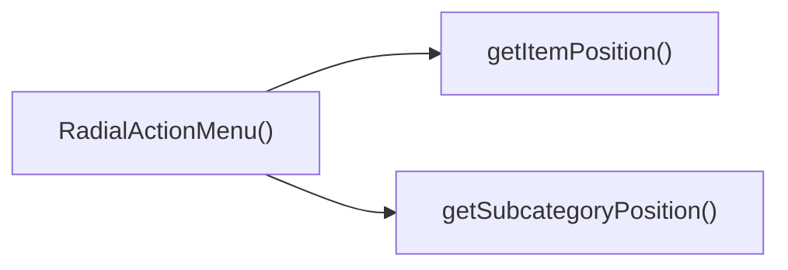

## Genel Bakış
Bu modül, Venthub HVAC platformunun ürünler bölümünde kullanılan dairesel açılır eylem menüsü React bileşenini barındırır. Menü, harici olarak kontrol edilen açık/kapalı durumu, konum bilgisi ve kategori listesiyle çalışarak ürünlerle ilgili eylemleri veya alt kategorileri kullanıcıya sunar. Tüm menü öğelerinin doğru konumda yer alması için dahili hesaplama fonksiyonlarından faydalanır.

## Fonksiyon Grupları
### Ana Menü Bileşeni
Menünün temel çalışma mantığını yöneten ana React bileşenidir. Dışarıdan alınan tüm konfigürasyon verilerini işleyerek menüyü kullanıcı arayüzünde render eder, kapanma gibi temel kullanıcı etkileşimlerini yönetir.
- RadialActionMenu

### Konum Hesaplama Yardımcı Fonksiyonları
Dairesel düzende yer alan menü öğelerinin ekrandaki doğru konumlarını hesaplayan yardımcı fonksiyonlardır. Hem ana menüdeki genel öğeler hem de alt kategori öğeleri için ayrı olarak düzene uygun konum hesaplamaları yapar.
- getItemPosition, getSubcategoryPosition

---

## AXIOMS – Mimari Varsayımlar
Bu modül, seçilen ana kategoriye ait alt kategorileri radyal düzlemde konumlandırarak görüntüleyen açılır menü UI bileşenidir, çalışması için bileşene iletilen tüm prop'ların ve yardımcı konum hesaplama fonksiyonlarına sağlanan girdi parametrelerinin geçerli olması zorunludur.

[Aksiyom 1]: Eğer RadialActionMenu bileşenine iletilen menünün açık/kapalı durumunu tanımlayan isOpen prop'u yoksa, menünün durumu yönetilemez, kalıcı olarak açık/kapalı kalma gibi UI tutarsızlıkları oluşur.
[Aksiyom 2]: Eğer menüyü kapatma işlemini tetikleyen onClose callback prop'u yoksa, kullanıcı menüyü kapatamaz, bileşenle tam etkileşim kurulamaz.
[Aksiyom 3]: Eğer menünün ekrandaki konumunu belirten position prop'u yoksa, menü doğru konumda görüntülenemez, kullanıcı arayüzünde beklenmedik bir yerde çıkar.
[Aksiyom 4]: Eğer menünün bağlı olduğu ana kategori kimliği categoryId prop'u yoksa, alt kategoriler ilgili ana kategoriye bağlanamaz, menü işlevsiz kalır.
[Aksiyom 5]: Eğer menüde listelenecek alt kategori kümesini içeren subcategories prop'u yoksa, menüde görüntülenecek hiçbir öğe kalmaz, boş bir radyal alan görüntülenir.
[Aksiyom 6]: Eğer getItemPosition konum hesaplama fonksiyonuna iletilen index, toplam öğe sayısı total veya radyal yarıçap radius parametrelerinden herhangi biri geçerli sayısal değer olarak sağlanmazsa, menü öğelerinin konumları hesaplanamaz, öğeler yanlış yerde veya hiç görüntülenmez.
[Aksiyom 7]: Eğer getSubcategoryPosition alt kategori konum hesaplama fonksiyonuna iletilen index veya toplam alt kategori sayısı total parametrelerinden herhangi biri geçerli sayısal değer olarak sağlanmazsa, alt kategori öğelerinin radyal konumları doğru hesaplanamaz, menü öğeleri düzensiz bir şekilde görüntülenir.

---

## FONKSIYON DETAYLARI

### RadialActionMenu
**Ne yapar**: VentHub HVAC projesinin ürünler sayfasında kullanılan, iki seviyeli çalışan dairesel aksiyon menüsü bileşenidir. Seviye 1'de ana menü seçenekleri (Alt Kategoriler, Ürünleri Gör, Teklif Al) barındırır, Seviye 2'de dinamik olarak yüklenen alt kategori seçeneklerini kullanıcıya sunar. Kullanıcıların kategoriler ve ürünler hakkında hızlı aksiyonlar almasını sağlayan açılır menü işlevi görür.
**Nasıl yapar**: Aldığı prop'lar ile menünün tüm temel işlevlerini yönetir. `isOpen` değeri ile menünün görünürlüğünü kontrol eder, `onClose` callback'i ile menü kapatma tetiklemelerini yönetir. `position` prop'u ile menünün sayfa üzerindeki yerini ayarlar, `categoryId` ve `subcategories` verileri ile menünün içeriğini ilgili kategoriye özel olarak dinamik şekilde oluşturur. İki seviyeli menü yapısını destekleyerek ana menüden alt kategori menüsüne geçişi sorunsuz şekilde yönetir.
**Parametreler**:
- isOpen: boolean — Menünün açık olup olmadığını belirten boolean değer, true olduğunda menü görünür, false olduğunda gizlenir
- onClose: function — Menü kapatıldığında tetiklenen callback fonksiyonu, kullanıcının menüyü kapatma eylemi gerçekleştirdiğinde çalışır
- position: any — Menünün sayfadaki konumunu tanımlayan nesne, menünün doğru koordinatlarda görüntülenmesini sağlar
- categoryId: string | number — Menünün bağlı olduğu ana kategorinin benzersiz kimliği, içeriğin ilgili kategoriye özel üretilmesini sağlar
- subcategories: array — Menünün ikinci seviyesinde gösterilecek dinamik alt kategori listesi, alt kategori menüsünün içeriğini oluşturur
**Dönüş**: RadialActionMenuProps tipinde prop'lar alan bir React fonksiyonel bileşeni döndürür, proje içerisindeki React uygulamalarında kullanılmak üzere tasarlanmıştır.

### getItemPosition
**Ne yapar**: Radial menüde yer alan her bir menü öğesinin dairesel düzlem üzerindeki konumunu hesaplar. Tüm menü öğelerinin eşit aralıklarla daire üzerine yayılmasını sağlayarak düzenli, okunabilir bir menü görünümü oluşturur. Menü öğelerinin üst üste binmesini veya yanlış konumda görüntülenmesini engeller.
**Nasıl yapar**: Hedef öğenin indeksi, toplam öğe sayısı ve menünün yarıçap değerini kullanarak matematiksel hesaplamalarla her öğe için x ve y koordinatlarını üretir. Toplam öğe sayısına göre aradaki açı aralığını hesaplayarak her öğenin sırayla doğru konuma yerleşmesini sağlar.
**Parametreler**:
- index: number — Konumu hesaplanacak menü öğesinin listedeki sıralı indeks değeri, her öğe için benzersiz sıra numarasıdır
- total: number — Radial menüde yer alan toplam menü öğesi sayısı, öğeler arasındaki açı aralığını hesaplamak için kullanılır
- radius: number — Dairesel menünün merkezinden dış kenarına kadar olan yarıçap değeri, konum koordinatlarının ölçeklenmesini sağlar
**Dönüş**: Fonksiyonun dönüş tipi belirtilmemiştir, hesapladığı menü öğesi konumunu ilgili görüntüleme katmanına iletmek üzere tasarlanmıştır.

### getSubcategoryPosition
**Ne yapar**: Radial menünün ikinci seviyesinde yer alan alt kategori menüsü öğelerinin dairesel düzlem üzerindeki konumunu hesaplar. Alt kategori öğelerinin de düzenli bir şekilde daire üzerine yayılmasını sağlayarak ana menü ile uyumlu bir görüntüleme deneyimi sunar.
**Nasıl yapar**: Hedef alt kategori öğesinin indeksi ve toplam alt kategori sayısını kullanarak alt kategori menüsü için tanımlanmış sabit yarıçap değeri üzerinden konum hesaplaması yapar. Ana menü öğelerinin konumlandırma mantığına benzer şekilde alt kategoriler için özel olarak uyarlanmış koordinatlar üretir.
**Parametreler**:
- index: number — Konumu hesaplanacak alt kategori öğesinin listedeki sıralı indeks değeri, alt kategori listesindeki sıra numarasıdır
- total: number — İkinci seviye menüde yer alan toplam alt kategori öğesi sayısı, öğeler arasındaki açı aralığını belirlemek için kullanılır
**Dönüş**: Fonksiyonun dönüş tipi belirtilmemiştir, hesapladığı alt kategori konumunu menünün görüntüleme katmanına iletmek üzere tasarlanmıştır.

---

## INTERFACES

### RadialMenuItem
- `id: string`
- `label: string`
- `icon: React.ReactNode`
- `color: string`
- `glowColor: string`
- `onClick: () => void`

### SubcategoryItem
- `slug: string`
- `label: string`

### RadialActionMenuProps
- `isOpen: boolean`
- `onClose: () => void`
- `position: { x: number; y: number }`
- `categoryId: string`
- `subcategories?: { slug: string; label: string }[]`
- `onSelectProducts: () => void`
- `onSelectQuote: () => void`
- `onSelectSubcategory: (subSlug: string) => void`

---

## AST POINTERS

### [N1_NASIL] AST Pointer: src/components/products/RadialActionMenu.tsx::RadialActionMenu > useLayoutEffect#1 Callback
- **params**: (parametre yok)
- **ic_degiskenler**:
  - `isOpen` — Menünün açık olup olmadığını kontrol eden koşul değişkeni
  - `categoryId` - Menünün bağlı olduğu kategori kimliği, koşulda kullanılır
  - `setSubcategories` - Alt kategori listesini güncellemek için kullanılan state setter fonksiyonu
  - `initialSubcategories` - Varsayılan alt kategori listesi, state'e atanır
  - `setShowSubcategories` - Alt kategori menüsünün görünürlüğünü ayarlayan state setter, menü her açıldığında false yapılır
- **Dönüş**: yok

### [N2_NASIL] AST Pointer: src/components/products/RadialActionMenu.tsx::RadialActionMenu > useEffect#keyboard Callback
- **params**: (parametre yok)
- **ic_degiskenler**:
  - `handleKeyDown` - Klavye olaylarını yakalayan iç fonksiyon
  - `isOpen` - Menünün açık olup olmadığını kontrol eden değişken, olay dinleyicisini eklemek için kullanılır
  - `document` - Global DOM nesnesi, klavye olay dinleyicisini eklemek/kaldırmak için kullanılır
- **Dönüş**: Klavye olay dinleyicisini temizleyen temizleme fonksiyonu

### [N3_NASIL] AST Pointer: src/components/products/RadialActionMenu.tsx::RadialActionMenu > handleKeyDown
- **params**: e: KeyboardEvent
- **ic_degiskenler**:
  - `e.key` - Basılan tuşun kimliği, Escape tuşu kontrolü için kullanılır
  - `showSubcategories` - Alt kategori menüsünün açık olup olmadığını kontrol eden state değişkeni
  - `setShowSubcategories` - Alt kategori menüsünün görünürlüğünü kapatan state setter
  - `onClose` - Ana menüyü kapatmak için çağrılan prop fonksiyonu
- **Dönüş**: yok

### [N4_NASIL] AST Pointer: src/components/products/RadialActionMenu.tsx::RadialActionMenu > overlayOnClick
- **params**: e: React.MouseEvent
- **ic_degiskenler**:
  - `e.target` - Tıklanan DOM elementi
  - `e.currentTarget` - Olayı dinleyen overlay DOM elementi
  - `onClose` - Sadece overlay kendisi tıklandığında çağrılan ana menü kapatma fonksiyonu
- **Dönüş**: yok

### [N5_NASIL] AST Pointer: src/components/products/RadialActionMenu.tsx::RadialActionMenu > openSubcategoriesMenu
- **params**: (parametre yok)
- **ic_degiskenler**:
  - `subcategories.length` - Mevcut alt kategori sayısı, 0'dan büyükse menü açılır
  - `setShowSubcategories` - Alt kategori menüsünün görünürlüğünü açan state setter
- **Dönüş**: yok

### [N6_NASIL] AST Pointer: src/components/products/RadialActionMenu.tsx::RadialActionMenu > closeSubcategoriesMenu
- **params**: (parametre yok)
- **ic_degiskenler**:
  - `setShowSubcategories` - Alt kategori menüsünün görünürlüğünü kapatan state setter
- **Dönüş**: yok

### [N7_NASIL] AST Pointer: src/components/products/RadialActionMenu.tsx::RadialActionMenu > triggerSelectProducts
- **params**: (parametre yok)
- **ic_degiskenler**:
  - `onSelectProducts` - Ürün seçimi tetikleyen prop fonksiyonu
  - `onClose` - İşlem sonrası ana menüyü kapatmak için çağrılan fonksiyon
- **Dönüş**: yok

### [N8_NASIL] AST Pointer: src/components/products/RadialActionMenu.tsx::RadialActionMenu > triggerSelectQuote
- **params**: (parametre yok)
- **ic_degiskenler**:
  - `onSelectQuote` - Teklif seçimi tetikleyen prop fonksiyonu
  - `onClose` - İşlem sonrası ana menüyü kapatmak için çağrılan fonksiyon
- **Dönüş**: yok

### [N9_NASIL] AST Pointer: src/components/products/RadialActionMenu.tsx::getItemPosition
- **params**: index: number, total: number, radius: number = 120
- **ic_degiskenler**:
  - `startAngle` - Radyal menünün başlangıç açısı, üstten başlamak için -90 olarak ayarlanır
  - `angleStep` - Her menü öğesi arasındaki açı farkı, toplam öğe sayısına göre hesaplanır
  - `angle` - Mevcut öğenin radyan cinsinden açısı, konum hesaplamak için kullanılır
  - `Math.PI` - Açıyı dereceden radyana çevirmek için kullanılan sabit
  - `Math.cos` - X konumunu hesaplamak için kullanılan trigonometrik fonksiyon
  - `Math.sin` - Y konumunu hesaplamak için kullanılan trigonometrik fonksiyon
- **Dönüş**: {x: number, y: number} konum nesnesi

### [N10_NASIL] AST Pointer: src/components/products/RadialActionMenu.tsx::getSubcategoryPosition
- **params**: index: number, total: number
- **ic_degiskenler**:
  - `radius` - Alt kategoriler için dinamik olarak hesaplanan yarıçap, toplam öğe sayısına göre sınırlanır
  - `getItemPosition` - Ana konum hesaplama fonksiyonu, hesaplanan yarıçap ile çağrılır
- **Dönüş**: {x: number, y: number} alt kategori konum nesnesi

### [N11_NASIL] AST Pointer: src/components/products/RadialActionMenu.tsx::RadialActionMenu > mainMenuItemMapCallback
- **params**: item, index
- **ic_degiskenler**:
  - `pos` - Öğenin radyal düzlemdeki hesaplanmış konumu
  - `getItemPosition` - Konum hesaplamak için kullanılan ana fonksiyon
  - `mainMenuItems.length` - Ana menüdeki toplam öğe sayısı, açı adımı hesaplamak için kullanılır
  - `isDisabled` - Öğenin devre dışı olup olmadığını belirten değişken, sadece alt kategoriler boşsa subcategories butonu devre dışı kalır
  - `item.id` - Öğenin benzersiz kimliği, devre dışı kontrolü için kullanılır
  - `subcategories.length` - Mevcut alt kategori sayısı, devre dışı kontrolünde kullanılır
- **Dönüş**: React.FC (motion.button elementi)

### [N12_NASIL] AST Pointer: src/components/products/RadialActionMenu.tsx::RadialActionMenu > mainMenuButtonOnClick
- **params**: e
- **ic_degiskenler**:
  - `e` - Tıklama olayı nesnesi, olayın yayılmasını durdurmak için kullanılır
  - `isDisabled` - Butonun devre dışı olup olmadığını kontrol eden değişken
  - `item.onClick` - Butonun tıklandığında çalışması gereken kendi olay fonksiyonu
- **Dönüş**: yok

### [N13_NASIL] AST Pointer: src/components/products/RadialActionMenu.tsx::RadialActionMenu > subcategoryItemMapCallback
- **params**: sub, index
- **ic_degiskenler**:
  - `pos` - Alt kategori öğesinin radyal düzlemdeki hesaplanmış konumu
  - `getSubcategoryPosition` - Alt kategori konumu hesaplamak için kullanılan fonksiyon
  - `subcategories.length` - Toplam alt kategori sayısı, açı adımı hesaplamak için kullanılır
  - `onSelectSubcategory` - Seçilen alt kategoriyi tetikleyen prop fonksiyonu
  - `sub.slug` - Alt kategorinin benzersiz URL dostu kimliği, seçim fonksiyonuna gönderilir
  - `onClose` - İşlem sonrası ana menüyü kapatmak için çağrılan fonksiyon
- **Dönüş**: React.FC (motion.button elementi)

### [N14_NASIL] AST Pointer: src/components/products/RadialActionMenu.tsx::RadialActionMenu > subcategoryButtonOnClick
- **params**: e
- **ic_degiskenler**:
  - `e` - Tıklama olayı nesnesi, olayın yayılmasını durdurmak için kullanılır
  - `onSelectSubcategory` - Seçilen alt kategoriyi işleyen prop fonksiyonu
  - `sub.slug` - Seçilen alt kategorinin kimliği, işlem fonksiyonuna gönderilir
  - `onClose` - Menüyü kapatmak için çağrılan ana fonksiyon
- **Dönüş**: yok

---

## ÇAĞRI HARİTASI

### Disariya Cagrilar (Outgoing)
RadialActionMenu() ana fonksiyonu, menü öğelerinin konumlarını belirlemek amacıyla dosya içindeki getItemPosition ve getSubcategoryPosition fonksiyonlarını çağırmaktadır.

### Disaridan Cagrilanlar (Incoming)
Verilen çağrı verisinde bu modülü kullanan herhangi bir dış dosya veya fonksiyon bilgisi bulunmamaktadır.

### Ic Ice Fonksiyonlar (Nested)
Yok

---

## DOSYA-İÇİ ÇAĞRI GRAFİĞİ
  RadialActionMenu() → getItemPosition()
  RadialActionMenu() → getSubcategoryPosition()

---

## NODE ID STANDARD

  file: src\components\products\RadialActionMenu.tsx
  function: src\components\products\RadialActionMenu.tsx::RadialActionMenu
  function: src\components\products\RadialActionMenu.tsx::getItemPosition
  function: src\components\products\RadialActionMenu.tsx::getSubcategoryPosition

---

## DISA AKTARILANLAR (EXPORTS)
  export: RadialActionMenu
  export: RadialMenuItem