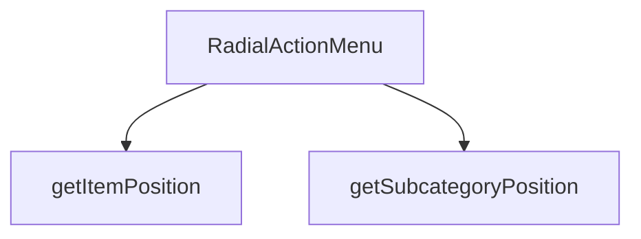

## Genel Bakış

RadialActionMenu modülü, kullanıcıya dairesel (radyal) bir düzenle sunulan bir aksiyon menüsü bileşeni sağlar. Menü, belirli bir kategoriye ait alt kategorileri dairesel formatta konumlandırarak kullanıcıya sunar. Yardımcı fonksiyonlar, menü öğelerinin ve alt kategorilerin ekrandaki pozisyonlarını geometrik hesaplamalarla belirler.

## Fonksiyon Grupları

### Ana Bileşen
Menünün açılıp kapatılmasını, ekrandaki konumunu ve görüntülenecek alt kategorileri yönetir. isOpen ve onClose ile menü görünürlüğünü kontrol eder, position ile ekran üzerindeki yerini belirler, categoryId ve subcategories ile hangi verilerin gösterileceğini belirtir.
- RadialActionMenu

### Konum Hesaplama Yardımcıları
Dairesel menüdeki öğelerin ve alt kategorilerin ekrandaki piksel konumlarını hesaplar. Her iki fonksiyon da öğe indeksi ve toplam öğe sayısına göre dairesel dağılım pozisyonlarını matematiksel olarak belirler; getItemPosition ek olarak bir yarıçap parametresi alır.
- getItemPosition, getSubcategoryPosition

---

## AXIOMS – Mimari Varsayımlar

RadialActionMenu, dairesel bir aksiyon menüsü bileşenidir. Alt kategorilerin dairesel düzen içinde konumlandırılması ve menü açma/kapama davranışının yönetilmesi için gerekli varsayımlar:

**[Aksiyom 1]**: Eğer `isOpen` parametresi yoksa, menünün görünür olup olmadığı kontrol edilemez ve bileşen render kararı veremez.

**[Aksiyom 2]**: Eğer `onClose` fonksiyonu yoksa, kullanıcı menüyü kapatamaz; menü bir kez açıldıktan sonra sonsuza kadar açık kalır.

**[Aksiyom 3]**: Eğer `position` değeri yoksa, menünün ekranda nerede görüntüleneceği belirlenemez.

**[Aksiyom 4]**: Eğer `categoryId` yoksa, menünün hangi kategoriye ait olduğu bilinemez.

**[Aksiyom 5]**: Eğer `subcategories` dizisi yoksa, menüde gösterilecek alt kategori öğeleri bulunamaz; menü boş kalır.

**[Aksiyom 6]**: `getItemPosition` fonksiyonunda eğer `total` değeri 0 ise, öğeler arası dairesel dağılım hesaplanamaz; bölme hatası oluşur.

**[Aksiyom 7]**: `getSubcategoryPosition` fonksiyonunda eğer `total` değeri 0 ise, alt kategori pozisyonu hesaplanamaz; bölme hatası oluşur.

**[Aksiyom 8]**: `getItemPosition` fonksiyonu `radius` parametresi alırken, `getSubcategoryPosition` fonksiyonu almaz; bu durumda alt kategori pozisyonu için kullanılan yarıçap değeri bilinmiyor (fonksiyon gövdesinde tanımlı olmalı).

---

## FONKSİYON DETAYLARI

### RadialActionMenu
**Ne yapar**: Dairesel (radial) yapıda bir aksiyon menüsü bileşeni oluşturur. İki seviyeli menü yapısı sunar: Seviye 1'de ana menü öğeleri (Alt Kategoriler, Ürünleri Gör, Teklif Al), Seviye 2'de ise dinamik alt kategoriler yer alır. Alt kategori desteği sayesinde hiyerarşik gezinme imkânı sağlar.

**Nasıl yapar**: Bileşen, isOpen prop'u ile açılıp kapatılır. position prop'u ile menünün ekrandaki konumu belirlenir. categoryId ve subcategories prop'ları aracılığıyla hangi kategoriye ait alt kategorilerin gösterileceği belirlenir. onClose fonksiyonu menü kapatıldığında tetiklenir. Framer Motion kütüphanesinin `motion.button` ve `motion.div` bileşenleriyle animasyonlu geçişler (scale, opacity, x/y pozisyon) kullanılır. Spring tabanlı animasyonlar (damping: 12, stiffness: 200) ile öğeler dairesel olarak konumlandırılır ve her öğe arasında 0.05 saniyelik gecikme (delay) uygulanarak sıralı açılma efekti elde edilir.

**Parametreler**:
- isOpen: boolean — Menünün açık olup olmadığını belirten durum değişkeni
- onClose: () => void — Menü kapatıldığında çağrılacak geri çağırma fonksiyonu
- position: bilinmiyor — Menünün ekrandaki konumunu belirleyen değer (kaynakta tip bilgisi verilmemiş)
- categoryId: bilinmiyor — İlgili kategorinin kimlik bilgisi (kaynakta tip bilgisi verilmemiş)
- subcategories: bilinmiyor — Alt kategori listesi; her bir alt kategorinin `slug` ve `label` alanlarına sahip olduğu görülmektedir (kaynakta tam tip bilgisi verilmemiş)

**Dönüş**: `React.FC<RadialActionMenuProps>` — RadialActionMenuProps tipinde props alan bir React fonksiyonel bileşeni döndürür.

### getItemPosition
**Ne yapar**: Geliştirildi ancak detay üretilemedi.

### getSubcategoryPosition
**Ne yapar**: Geliştirildi ancak detay üretilemedi.

---

## İTHALATLAR (IMPORTS)
- import: framer-motion::AnimatePresence
- import: framer-motion::motion
- import: lucide-react::ArrowLeft
- import: lucide-react::Eye
- import: lucide-react::Layers
- import: lucide-react::MessageSquareText
- import: lucide-react::Package
- import: react::React
- import: react::useCallback
- import: react::useEffect
- import: react::useState

---

## INTERFACES

### RadialMenuItem
- `id: string`
- `label: string`
- `icon: React.ReactNode`
- `color: string`
- `glowColor: string`
- `onClick: () => void`

### SubcategoryItem
- `slug: string`
- `label: string`

### RadialActionMenuProps
- `isOpen: boolean`
- `onClose: () => void`
- `position: { x: number; y: number }`
- `categoryId: string`
- `subcategories?: { slug: string; label: string }[]`
- `onSelectProducts: () => void`
- `onSelectQuote: () => void`
- `onSelectSubcategory: (subSlug: string) => void`

---

## AST POINTERS

### [N1_NASIL] AST Pointer: RadialActionMenu.tsx::useEffect (menü açılış reset)
- **params**: yok (arrow function, useEffect callback)
- **ic_degiskenler**:
  - `isOpen` — menü açık mı kontrolü; true ise reset işlemi tetiklenir
  - `categoryId` — kategori kimliği; truthy ise alt kategoriler yüklenir
  - `initialSubcategories` — başlangıç alt kategori listesi; `setSubcategories`'a argüman olarak geçilir
  - `setSubcategories` — alt kategori state setter'ı; `initialSubcategories` ile güncellenir
  - `setShowSubcategories` — alt kategori görünümü state setter'ı; `false` yapılır (ana menüye dönülür)
- **Dönüş**: yok

### [N2_NASIL] AST Pointer: RadialActionMenu.tsx::useEffect (klavye olay dinleyici)
- **params**: yok (arrow function, useEffect callback)
- **ic_degiskenler**:
  - `handleKeyDown` — Escape tuşu için tanımlanmış olay işleyici fonksiyon
  - `isOpen` — menü açık mı kontrolü; true ise `document.addEventListener` eklenir
  - `document.addEventListener` — `'keydown'` olayı dinlenmeye başlanır
  - `document.removeEventListener` — cleanup fonksiyonunda `'keydown'` dinleyici kaldırılır
- **Dönüş**: cleanup fonksiyonu (removeEventListener çağıran arrow function)

### [N3_NASIL] AST Pointer: RadialActionMenu.tsx::handleKeyDown
- **params**: `e` — KeyboardEvent nesnesi
- **ic_degiskenler**:
  - `e.key` — basılan tuş; `'Escape'` ile eşleşme kontrolü yapılır
  - `showSubcategories` — alt kategori görünümü açık mı kontrolü; true ise `setShowSubcategories(false)` çağrılır
  - `setShowSubcategories` — alt kategori görünümü kapatılır
  - `onClose` — alt kategori görünümü kapalı iken Escape basılırsa menüyü kapatır
- **Dönüş**: yok

### [N4_NASIL] AST Pointer: RadialActionMenu.tsx::handleOverlayClick
- **params**: `e` — React.MouseEvent nesnesi
- **ic_degiskenler**:
  - `e.target` — tıklanan hedef element
  - `e.currentTarget` — olayı taşıyan element (overlay div)
  - `onClose` — tıklama doğrudan overlay üzerinde ise menüyü kapatır
- **Dönüş**: yok

### [N5_NASIL] AST Pointer: RadialActionMenu.tsx::handleShowSubcategories
- **params**: yok
- **ic_degiskenler**:
  - `subcategories` — alt kategori dizisi; `length > 0` kontrolü yapılır
  - `setShowSubcategories` — alt kategori görünümü açılır (`true` yapılır)
- **Dönüş**: yok

### [N6_NASIL] AST Pointer: RadialActionMenu.tsx::handleHideSubcategories
- **params**: yok
- **ic_degiskenler**:
  - `setShowSubcategories` — alt kategori görünümü kapatılır (`false` yapılır)
- **Dönüş**: yok

### [N7_NASIL] AST Pointer: RadialActionMenu.tsx::onSelectProducts callback
- **params**: yok (arrow function)
- **ic_degiskenler**:
  - `onSelectProducts` — ürün seçimi işlevi çağrılır
  - `onClose` — işlem sonrası menü kapatılır
- **Dönüş**: yok

### [N8_NASIL] AST Pointer: RadialActionMenu.tsx::onSelectQuote callback
- **params**: yok (arrow function)
- **ic_degiskenler**:
  - `onSelectQuote` — teklif seçimi işlevi çağrılır
  - `onClose` — işlem sonrası menü kapatılır
- **Dönüş**: `{ x: number, y: number }` — dairesel konum nesnesi (x ve y koordinatları)

### [N9_NASIL] AST Pointer: RadialActionMenu.tsx::getItemPosition
- **params**: `index` (number), `total` (number), `radius` (number, varsayılan 120)
- **ic_degiskenler**:
  - `startAngle` — başlangıç açısı; `-90` derece (üstten başlama)
  - `angleStep` — her öğe arasındaki açı farkı; `360 / total`
  - `angle` — hesaplanan radyan açı; `(startAngle + index * angleStep) * (Math.PI / 180)`
  - `Math.cos(angle)` — x ekseni bileşeni; `radius` ile çarpılır
  - `Math.sin(angle)` — y ekseni bileşeni; `radius` ile çarpılır
- **Dönüş**: `{ x: number, y: number }` — hesaplanmış dairesel konum

### [N10_NASIL] AST Pointer: RadialActionMenu.tsx::getSubcategoryPosition
- **params**: `index` (number), `total` (number)
- **ic_degiskenler**:
  - `radius` — dinamik yarıçap; `Math.min(100 + total * 8, 150)` ile hesaplanır
  - `getItemPosition` — `index`, `total`, `radius` argümanlarıyla çağrılır
- **Dönüş**: `{ x: number, y: number }` — getItemPosition dönüş değeri

### [N11_NASIL] AST Pointer: RadialActionMenu.tsx::mainMenuItems map render
- **params**: `item` (menü öğesi nesnesi), `index` (number)
- **ic_degiskenler**:
  - `pos` — `getItemPosition(index, mainMenuItems.length)` ile hesaplanan konum
  - `mainMenuItems` — ana menü öğeleri dizisi; `length` özelliği kullanılır
  - `isDisabled` — `item.id === 'subcategories' && subcategories.length === 0` koşulu; alt kategori yoksa devre dışı
  - `item.id` — öğe kimliği; `'subcategories'` ile eşleşme kontrolü
  - `item.color` — gradyan renk sınıfı
  - `item.glowColor` — glow/gölge renk sınıfı
  - `item.icon` — öğe ikonu JSX elemanı
  - `item.label` — öğe etiket metni
  - `item.onClick` — öğe tıklama işlevi
  - `subcategories` — alt kategori dizisi; `length` kontrolü
  - `index * 0.08` — animasyon gecikme süresi
- **Dönüş**: JSX (motion.button elemanı)

### [N12_NASIL] AST Pointer: RadialActionMenu.tsx::mainMenuItem onClick handler
- **params**: `e` (React.MouseEvent)
- **ic_degiskenler**:
  - `e.stopPropagation()` — olayın üst elemanlara yayılması engellenir
  - `isDisabled` — öğe devre dışı mı kontrolü
  - `item.onClick` — öğe devre dışı değilse tıklama işlevi çağrılır
- **Dönüş**: yok

### [N13_NASIL] AST Pointer: RadialActionMenu.tsx::subcategories map render
- **params**: `sub` (alt kategori nesnesi), `index` (number)
- **ic_degiskenler**:
  - `pos` — `getSubcategoryPosition(index, subcategories.length)` ile hesaplanan konum
  - `subcategories` — alt kategori dizisi; `length` özelliği kullanılır
  - `sub.slug` — alt kategori slug'ı; key ve tıklama işlevi için kullanılır
  - `sub.label` — alt kategori etiket metni
  - `onSelectSubcategory` — alt kategori seçim işlevi; `sub.slug` argümanı ile çağrılır
  - `onClose` — seçim sonrası menü kapatılır
  - `Package` — lucide-react ikonu; alt kategori ikonu olarak kullanılır
  - `index * 0.05` — animasyon gecikme süresi
- **Dönüş**: JSX (motion.button elemanı)

### [N14_NASIL] AST Pointer: RadialActionMenu.tsx::subcategory onClick handler
- **params**: `e` (React.MouseEvent)
- **ic_degiskenler**:
  - `e.stopPropagation()` — olayın üst elemanlara yayılması engellenir
  - `onSelectSubcategory` — alt kategori seçim işlevi; `sub.slug` argümanı ile çağrılır
  - `sub.slug` — seçilen alt kategori slug'ı
  - `onClose` — işlem sonrası menü kapatılır
- **Dönüş**: yok

---

## MERMAID CALL GRAPH

## NODE ID STANDARD

  file: RadialActionMenu.tsx
  function: RadialActionMenu.tsx::RadialActionMenu
  function: RadialActionMenu.tsx::getItemPosition
  function: RadialActionMenu.tsx::getSubcategoryPosition

---

## DISA AKTARILANLAR (EXPORTS)
  export: RadialActionMenu
  export: RadialMenuItem

---

## STİL TOKENLERİ

### Arbitrary Değerler (token'a geçirilmemiş)
Yok — tüm stiller token'a geçirilmiş. ✅

### Kullanılan Token'lar (zaten token'a geçirilmiş)
- (yok)

### Tailwind Sınıf Özeti
- **Renkler:** `bg-black/40`, `bg-gradient-to-br`, `bg-gradient-to-t`, `bg-slate-900/90`, `border-2`, `border-white/10`, `border-white/20`, `border-white/30`, `from-cyan-500/20`, `from-slate-600`, `from-transparent`, `group-hover:border-cyan-400/50`, `hover:bg-white/10`, `text-white`, `text-white/70`
- **Layout:** `absolute`, `backdrop-blur-sm`, `fixed`, `flex`, `flex-col`, `from-cyan-500/20`, `from-slate-600`, `from-transparent`, `gap-2`, `group-hover:shadow-2xl`, `group-hover:shadow-cyan-500/30`, `group-hover:shadow-xl`, `h-14`, `h-16`, `h-5`
- **Varyant/Responsive:** `:`, `group-hover:`, `hover:` önekleri
- **Yardımcı Sınıflar:** `${!isDisabled`, `${isDisabled`, `${item.color`, `${item.glowColor`, `-translate-x-1/2`, `-translate-y-1/2`, `:`, `border`, `cursor-not-allowed`, `cursor-pointer`, `duration-300`, `font-medium`, `font-semibold`, `group`, `inset-0`