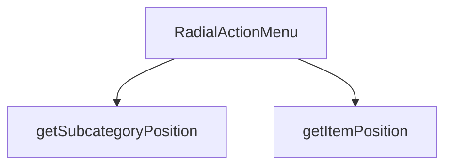

## Genel Bakış
Bu modül, ürünler sayfasında kategori ve alt kategorileri dairesel (radyal) bir açılır menü formatında sunan bir React bileşenini içerir. Menü, dışarıdan kontrol edilen durum, konum ve kategori verileriyle çalışarak, her bir öğeyi belirli bir yarıçapta ve açısal konumda konumlandırır. Bileşen, ana işlevselliğinin yanı sıra, menü öğelerinin fiziksel yerleşimini hesaplayan yardımcı fonksiyonlara dayanır.

## Fonksiyon Grupları
### Ana Menü Bileşeni
Bileşenin temel kullanıcı arayüzünü ve mantığını yöneten ana React bileşenidir. Dışarıdan alınan tüm durum ve veri prop'larını işleyerek menüyü render eder ve kapanma gibi etkileşimleri kontrol eder.
- RadialActionMenu

### Konum Hesaplama Yardımcı Fonksiyonları
Menüdeki her bir öğenin (hem ana menü öğelerinin hem de alt kategorilerin) dairesel düzlemde ekranda alacağı koordinatları hesaplayan yardımcı fonksiyonlardır. Bu hesaplamalar, menünün radyal yerleşim mantığının temelini oluşturur.
- getItemPosition, getSubcategoryPosition

---

## AXIOMS – Mimari Varsayımlar

Bu modül, radyal (dairesel) menü yerleşimi hesaplayan matematiksel yardımcı fonksiyonlara ve dış kontrollü durum Props'larına dayanır.

[Aksiyom 1]: Eğer `getItemPosition` fonksiyonuna `total` parametresi olarak `0` verilirse, açı hesaplamasında sıfıra bölünme hatası oluşur.

[Aksiyom 2]: Eğer `getItemPosition` fonksiyonuna `radius` parametresi olarak `0` verilirse, tüm menü öğeleri merkez noktasında üst üste biner ve görünmez hale gelir.

[Aksiyom 3]: Eğer `getSubcategoryPosition` fonksiyonuna `total` parametresi olarak `0` verilirse, açı hesaplamasında sıfıra bölünme hatası oluşur.

[Aksiyom 4]: Eğer `RadialActionMenu` bileşenine `onClose` callback'i sağlanmazsa, menü açıldıktan sonra kullanıcı tarafından kapatılamaz.

[Aksiyom 5]: Eğer `RadialActionMenu` bileşenine `position` (menü konumu) sağlanmazsa, menünün ekranda hangi noktada açılacağı belirsiz olur.

[Aksiyom 6]: Eğer `RadialActionMenu` bileşenine `subcategories` boş bir dizi olarak verilirse, menüde gösterilecek alt kategori öğesi olmaz.

[Aksiyom 7]: Eğer `getSubcategoryPosition` fonksiyonu `radius` parametresi almıyorsa (fonksiyon imzasında yok), alt kategori yerleşimi için sabit bir yarıçap değeri kullanılır — bu değerin ne olduğu fonksiyon gövdesinden doğrulanmalıdır.

[Aksiyom 8]: Eğer `isOpen` `false` ise ve `position`/`categoryId`/`subcategories` değerleri geçersiz veya tanımsızsa, bileşen render sırasında hata vermemek için bu değerleri yok saymalıdır.

---

## FONKSİYON DETAYLARI

### RadialActionMenu
**Ne yapar**: VentHub HVAC projesinin ürünler sayfasında kullanılan, iki seviyeli çalışan dairesel aksiyon menüsü bileşenidir. Seviye 1'de ana menü seçenekleri (Alt Kategoriler, Ürünleri Gör, Teklif Al) barındırır, Seviye 2'de dinamik olarak yüklenen alt kategori seçeneklerini kullanıcıya sunar. Kullanıcıların kategoriler ve ürünler hakkında hızlı aksiyonlar almasını sağlayan açılır menü işlevi görür.
**Nasıl yapar**: Aldığı prop'lar ile menünün tüm temel işlevlerini yönetir. `isOpen` değeri ile menünün görünürlüğünü kontrol eder, `onClose` callback'i ile menü kapatma tetiklemelerini yönetir. `position` prop'u ile menünün sayfa üzerindeki yerini ayarlar, `categoryId` ve `subcategories` verileri ile menünün içeriğini ilgili kategoriye özel olarak dinamik şekilde oluşturur. İki seviyeli menü yapısını destekleyerek ana menüden alt kategori menüsüne geçişi sorunsuz şekilde yönetir.
**Parametreler**:
- isOpen: boolean — Menünün açık olup olmadığını belirten boolean değer, true olduğunda menü görünür, false olduğunda gizlenir
- onClose: function — Menü kapatıldığında tetiklenen callback fonksiyonu, kullanıcının menüyü kapatma eylemi gerçekleştirdiğinde çalışır
- position: any — Menünün sayfadaki konumunu tanımlayan nesne, menünün doğru koordinatlarda görüntülenmesini sağlar
- categoryId: string | number — Menünün bağlı olduğu ana kategorinin benzersiz kimliği, içeriğin ilgili kategoriye özel üretilmesini sağlar
- subcategories: array — Menünün ikinci seviyesinde gösterilecek dinamik alt kategori listesi, alt kategori menüsünün içeriğini oluşturur
**Dönüş**: RadialActionMenuProps tipinde prop'lar alan bir React fonksiyonel bileşeni döndürür, proje içerisindeki React uygulamalarında kullanılmak üzere tasarlanmıştır.

### getItemPosition
**Ne yapar**: Radial menüde yer alan her bir menü öğesinin dairesel düzlem üzerindeki konumunu hesaplar. Tüm menü öğelerinin eşit aralıklarla daire üzerine yayılmasını sağlayarak düzenli, okunabilir bir menü görünümü oluşturur. Menü öğelerinin üst üste binmesini veya yanlış konumda görüntülenmesini engeller.
**Nasıl yapar**: Hedef öğenin indeksi, toplam öğe sayısı ve menünün yarıçap değerini kullanarak matematiksel hesaplamalarla her öğe için x ve y koordinatlarını üretir. Toplam öğe sayısına göre aradaki açı aralığını hesaplayarak her öğenin sırayla doğru konuma yerleşmesini sağlar.
**Parametreler**:
- index: number — Konumu hesaplanacak menü öğesinin listedeki sıralı indeks değeri, her öğe için benzersiz sıra numarasıdır
- total: number — Radial menüde yer alan toplam menü öğesi sayısı, öğeler arasındaki açı aralığını hesaplamak için kullanılır
- radius: number — Dairesel menünün merkezinden dış kenarına kadar olan yarıçap değeri, konum koordinatlarının ölçeklenmesini sağlar
**Dönüş**: Fonksiyonun dönüş tipi belirtilmemiştir, hesapladığı menü öğesi konumunu ilgili görüntüleme katmanına iletmek üzere tasarlanmıştır.

### getSubcategoryPosition
**Ne yapar**: Radial menünün ikinci seviyesinde yer alan alt kategori menüsü öğelerinin dairesel düzlem üzerindeki konumunu hesaplar. Alt kategori öğelerinin de düzenli bir şekilde daire üzerine yayılmasını sağlayarak ana menü ile uyumlu bir görüntüleme deneyimi sunar.
**Nasıl yapar**: Hedef alt kategori öğesinin indeksi ve toplam alt kategori sayısını kullanarak alt kategori menüsü için tanımlanmış sabit yarıçap değeri üzerinden konum hesaplaması yapar. Ana menü öğelerinin konumlandırma mantığına benzer şekilde alt kategoriler için özel olarak uyarlanmış koordinatlar üretir.
**Parametreler**:
- index: number — Konumu hesaplanacak alt kategori öğesinin listedeki sıralı indeks değeri, alt kategori listesindeki sıra numarasıdır
- total: number — İkinci seviye menüde yer alan toplam alt kategori öğesi sayısı, öğeler arasındaki açı aralığını belirlemek için kullanılır
**Dönüş**: Fonksiyonun dönüş tipi belirtilmemiştir, hesapladığı alt kategori konumunu menünün görüntüleme katmanına iletmek üzere tasarlanmıştır.

---

## INTERFACES

### RadialMenuItem
- `id: string`
- `label: string`
- `icon: React.ReactNode`
- `color: string`
- `glowColor: string`
- `onClick: () => void`

### SubcategoryItem
- `slug: string`
- `label: string`

### RadialActionMenuProps
- `isOpen: boolean`
- `onClose: () => void`
- `position: { x: number; y: number }`
- `categoryId: string`
- `subcategories?: { slug: string; label: string }[]`
- `onSelectProducts: () => void`
- `onSelectQuote: () => void`
- `onSelectSubcategory: (subSlug: string) => void`

---

## AST POINTERS

### [N1_NASIL] AST Pointer: RadialActionMenu.tsx::useEffect_resetState
- **params**: () — anonim callback (useEffect içinde)
- **ic_degiskenler**:
  - `isOpen` — menünün açık olup olmadığını belirtir, true ise state sıfırlanır
  - `categoryId` — mevcut kategorinin ID'si,open durumunda kontrol edilir
  - `setSubcategories` — alt kategorileri başlangıç değerine sıfırlar
  - `initialSubcategories` — alt kategorilerin başlangıç/taze listesi
  - `setShowSubcategories` — alt kategori panelinin görünürlüğünü false yapar, her açılışta ana menüden başlamak için kullanılır
- **Dönüş**: yok (side-effect: state sıfırlar)

### [N2_NASIL] AST Pointer: RadialActionMenu.tsx::useEffect_keyboardListener
- **params**: () — anonim callback (useEffect içinde)
- **ic_degiskenler**:
  - `handleKeyDown` — `(e: KeyboardEvent) => void` tipinde local fonksiyon; Escape tuşu basıldığında menüyü kapatır
    - `e.key` — basılan tuşun değeri, `'Escape'` kontrolü yapılır
    - `showSubcategories` — alt kategori paneli açıksa önce onu kapatır
    - `setShowSubcategories(false)` — alt kategori panelini kapatır
    - `onClose` — ana menüyü kapatır
  - `isOpen` — menü açıksa event listener eklenir
  - `document.addEventListener` — keydown event'ini DOM'a ekler
  - `document.removeEventListener` — cleanup'ta event listener'ı kaldırır
- **Dönüş**: () => void — cleanup fonksiyonu (event listener kaldırma)

### [N3_NASIL] AST Pointer: RadialActionMenu.tsx::handleKeyDown
- **params**: `(e: KeyboardEvent)` — klavye olayı nesnesi
- **ic_degiskenler**:
  - `e.key` — basılan tuşun string değeri, `'Escape'` ile kontrol edilir
  - `showSubcategories` — alt kategori paneli durumu, true ise sadece alt paneli kapatır
  - `setShowSubcategories(false)` — alt kategori panelini kapatır
  - `onClose` — alt kategori paneli kapalıyken Escape basılırsa tüm menüyü kapatır
- **Dönüş**: yok

### [N4_NASIL] AST Pointer: RadialActionMenu.tsx::handleBackdropClick
- **params**: `(e: React.MouseEvent)` — fare tıklama olayı nesnesi
- **ic_degiskenler**:
  - `e.target` — tıklanan en iç DOM elementi
  - `e.currentTarget` — event handler'ın bağlı olduğu element (backdrop自身)
  - `onClose` — sadece backdrop'un kendisine tıklandığında menüyü kapatır (child elementlere tıklanmayı engeller)
- **Dönüş**: yok

### [N5_NASIL] AST Pointer: RadialActionMenu.tsx::handleShowSubcategories
- **params**: () — parametresiz
- **ic_degiskenler**:
  - `subcategories` — mevcut alt kategoriler dizisi, `length > 0` ise panel açılır
  - `setShowSubcategories(true)` — alt kategori panelini görünür yapar
- **Dönüş**: yok

### [N6_NASIL] AST Pointer: RadialActionMenu.tsx::handleHideSubcategories
- **params**: () — parametresiz
- **ic_degiskenler**:
  - `setShowSubcategories(false)` — alt kategori panelini gizler, ana menüye dönüş sağlar
- **Dönüş**: yok

### [N7_NASIL] AST Pointer: RadialActionMenu.tsx::handleSelectProducts
- **params**: () — parametresiz
- **ic_degiskenler**:
  - `onSelectProducts` — ürünler seçildiğinde çağrılan prop callback'i, ürün seçim eylemini tetikler
  - `onClose` — seçim sonrası menüyü kapatır
- **Dönüş**: yok (side-effect: onSelectProducts ve onClose çağırır)

### [N8_NASIL] AST Pointer: RadialActionMenu.tsx::handleSelectQuote
- **params**: () — parametresiz
- **ic_degiskenler**:
  - `onSelectQuote` — teklif seçildiğinde çağrılan prop callback'i, teklif seçim eylemini tetikler
  - `onClose` — seçim sonrası menüyü kapatır
- **Dönüş**: yok (side-effect: onSelectQuote ve onClose çağırır)

### [N9_NASIL] AST Pointer: RadialActionMenu.tsx::getItemPosition
- **params**: `(index: number, total: number, radius: number = 120)` — item indeksi, toplam item sayısı, yarıçap (varsayılan 120)
- **ic_degiskenler**:
  - `startAngle` — `-90` sabiti, açı hesaplamasının üst noktadan (12 yönü) başlamasını sağlar
  - `angleStep` — `360 / total`, her item arasındaki açısal fark (derece)
  - `angle` — `(startAngle + index * angleStep) * (Math.PI / 180)`, item'in radyan cinsinden açısı
  - `Math.cos(angle) * radius` — x koordinatı, birim çember kosinüsü ile yarıçapın çarpımı
  - `Math.sin(angle) * radius` — y koordinatı, birim çember sinüsü ile yarıçapın çarpımı
  - `index` — mevcut item'in sırası
  - `total` — toplam item sayısı
  - `radius` — daire yarıçapı, varsayılan 120px
- **Dönüş**: `{ x: number, y: number }` — item'in_mutlak_pozisyon_koordinatları

### [N10_NASIL] AST Pointer: RadialActionMenu.tsx::getSubcategoryPosition
- **params**: `(index: number, total: number)` — subcategory indeksi, toplam subcategory sayısı
- **ic_degiskenler**:
  - `radius` — `Math.min(100 + total * 8, 150)`, dinamik yarıçap: toplam sayıyla artar ama 150px'i geçmez
  - `index` — mevcut alt kategorinin sırası
  - `total` — toplam alt kategori sayısı
- **Dönüş**: `{ x: number, y: number }` — getItemPosition çağrısıyla hesaplanan pozisyon (dolaylı)

### [N11_NASIL] AST Pointer: RadialActionMenu.tsx::renderMainMenuItem
- **params**: `(item, index)` — menü öğesi nesnesi ve indeksi
- **ic_degiskenler**:
  - `pos` — `getItemPosition(index, mainMenuItems.length)` çağrısıyla elde edilen `{x, y}` pozisyonu, button'un animasyon hedefi
  - `mainMenuItems` — ana menü öğeleri dizisi, toplam sayısını yarıçap hesaplaması için kullanır
  - `isDisabled` — `item.id === 'subcategories' && subcategories.length === 0` koşulu ile hesaplanır, alt kategori yoksa subcategories butonu devre dışıdır
  - `item.id` — öğenin benzersiz tanımlayıcısı, `'subcategories'` kontrolü yapılır
  - `item.onClick` — öğenin tıklama handler'ı, devre dışı değilse çağrılır
  - `item.color` — gradient renk sınıfı (ör: `from-blue-500 to-blue-600`)
  - `item.glowColor` — hover/glow efekti için gölge rengi sınıfı
  - `item.icon` — öğe ikonu (React elementi)
  - `item.label` — öğe metin etiketi
  - `subcategories` — alt kategoriler dizisi, length kontrolü ile isDisabled belirlenir
- **Dönüş**: `JSX.Element` — `motion.button` ile sarılmış menü öğesi

### [N12_NASIL] AST Pointer: RadialActionMenu.tsx::handleMainItemClick
- **params**: `(e)` — React click event nesnesi (anonymous, button onClick içinde)
- **ic_degiskenler**:
  - `e.stopPropagation()` — click event'in üst elementlere yayılmasını engeller
  - `isDisabled` — outer scope'tan gelen devre dışı durumu, true ise nothing yap
  - `item.onClick` — öğe devre dışı değilse öğe tıklama handler'ı çağrılır
- **Dönüş**: yok

### [N13_NASIL] AST Pointer: RadialActionMenu.tsx::renderSubcategoryItem
- **params**: `(sub, index)` — alt kategori nesnesi ve indeksi
- **ic_degiskenler**:
  - `pos` — `getSubcategoryPosition(index, subcategories.length)` ile hesaplanan `{x, y}` pozisyonu
  - `subcategories` — alt kategoriler dizisi, toplam sayısı pozisyon hesabında kullanılır
  - `sub.slug` — alt kategorinin URL dostu tanımlayıcısı, React key ve onClick parametresi olarak kullanılır
  - `sub.label` — alt kategorinin görüntülenen adı
  - `onSelectSubcategory` — prop callback, tıklandığında `sub.slug` ile çağrılır
  - `onClose` — seçim sonrası menüyü kapatır
- **Dönüş**: `JSX.Element` — `motion.button` ile sarılmış alt kategori öğesi

### [N14_NASIL] AST Pointer: RadialActionMenu.tsx::handleSubcategoryClick
- **params**: `(e)` — React click event nesnesi (anonymous, button onClick içinde)
- **ic_degiskenler**:
  - `e.stopPropagation()` — click event'in üst elementlere yayılmasını engeller
  - `sub.slug` — outer scope'tan gelen alt kategori slug'ı, `onSelectSubcategory`'a传递 edilir
  - `onSelectSubcategory` — outer scope prop callback, `sub.slug` parametresiyle çağrılır
  - `onClose` — outer scope prop, tıklama sonrası menüyü kapatır
- **Dönüş**: yok

---

## MERMAID CALL GRAPH

## NODE ID STANDARD

  file: src\components\products\RadialActionMenu.tsx
  function: src\components\products\RadialActionMenu.tsx::RadialActionMenu
  function: src\components\products\RadialActionMenu.tsx::getItemPosition
  function: src\components\products\RadialActionMenu.tsx::getSubcategoryPosition

---

## DISA AKTARILANLAR (EXPORTS)
  export: RadialActionMenu
  export: RadialMenuItem

---

## STİL TOKENLERİ

### Arbitrary Değerler (token'a geçirilmemiş)
Yok — tüm stiller token'a geçirilmiş. ✅

### Kullanılan Token'lar (zaten token'a geçirilmiş)
- (yok)

### Tailwind Sınıf Özeti
- **Renkler:** `bg-black/40`, `bg-gradient-to-br`, `bg-gradient-to-t`, `bg-slate-900/90`, `border-2`, `border-white/10`, `border-white/20`, `border-white/30`, `from-cyan-500/20`, `from-slate-600`, `from-transparent`, `group-hover:border-cyan-400/50`, `hover:bg-white/10`, `text-white`, `text-white/70`
- **Layout:** `absolute`, `backdrop-blur-sm`, `fixed`, `flex`, `flex-col`, `from-cyan-500/20`, `from-slate-600`, `from-transparent`, `gap-2`, `group-hover:shadow-2xl`, `group-hover:shadow-cyan-500/30`, `group-hover:shadow-xl`, `h-14`, `h-16`, `h-5`
- **Varyant/Responsive:** `:`, `group-hover:`, `hover:` önekleri
- **Yardımcı Sınıflar:** `${!isDisabled`, `${isDisabled`, `${item.color`, `${item.glowColor`, `-translate-x-1/2`, `-translate-y-1/2`, `:`, `border`, `cursor-not-allowed`, `cursor-pointer`, `duration-300`, `font-medium`, `font-semibold`, `group`, `inset-0`