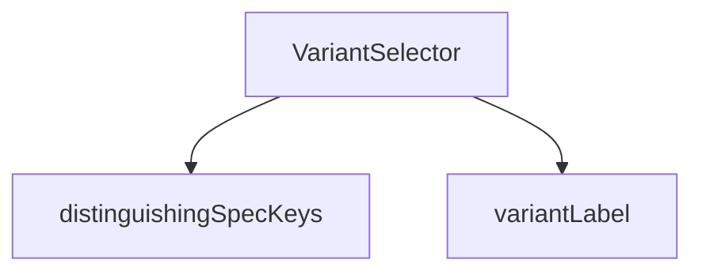

## Genel Bakış

Bu modül, ürün ailesi varyantlarını (FamilyVariant) kullanıcıya sunan ve seçim yapılmasını sağlayan bir React bileşenidir. Varyant etiketlerinin oluşturulması ve varyantları birbirinden ayırt eden teknik özellik anahtarlarının belirlenmesi gibi yardımcı işlemler gerçekleştirir. Bileşen, fiyat gösterimi (vergi dahil/hariç) ve teklif modu gibi farklı kullanım senaryolarını destekler.

## Fonksiyon Grupları

### Yardımcı Fonksiyonlar
Varyant verilerini dönüştürmeye ve analiz etmeye yarayan küçük, bağımsız yardımcı fonksiyonlardır. Bileşenin render mantığında kullanılmak üzere varyant etiketleri üretir ve varyantlar arasındaki farkları tespit eder.
- variantLabel, distinguishingSpecKeys

### Ana Bileşen
Modülün ana dışa aktarımı olan ve varyant seçim arayüzünü oluşturan React bileşenidir. Seçili SKU bilgisini alır, kullanıcı seçimlerini dışarı bildirir ve varyant listesini etkileşimli bir şekilde sunar.
- VariantSelector

---

## AXIOMS – Mimari Varsayımlar

Bu modül için fonksiyon gövdeleri sağlanmadığından (yalnızca imzalar mevcut), fonksiyon gövdesinden türetilen özel aksiyom tanımlanmamıştır.

---

## FONKSİYON DETAYLARI

### variantLabel
**Ne yapar**: Bir `FamilyVariant` nesnesi için insan tarafından okunabilir bir etiket dizesi üretir. Varyantın model kodunu, yoksa SKU değerini kullanarak tekil bir tanımlayıcı oluşturur.

**Nasıl yapar**: Varyant nesnesinin `model_code` alanını kontrol eder. Bu alan truthy (boş olmayan, undefined olmayan) ise doğrudan onu döndürür. Aksi halde fallback olarak `sku` alanını döndürür. JavaScript'in short-circuit mantığı (`||` operatörü) sayesinde bu seçim tek satırda gerçekleşir.

**Parametreler**:
- `v`: `FamilyVariant` — Etiketi oluşturulacak varyant nesnesi. `model_code` ve `sku` alanlarına sahip olmalıdır.

**Dönüş**: `string` — Varyantın tercih edilen tanımlayıcı dizesi. Önce `model_code`, o yoksa `sku` değeri.

### distinguishingSpecKeys
**Ne yapar**: Geliştirildi ancak detay üretilemedi.

### VariantSelector
**Ne yapar**: Geliştirildi ancak detay üretilemedi.

---

## İTHALATLAR (IMPORTS)
- import: ../../i18n/I18nProvider::useI18n
- import: ../../i18n/format::formatCurrency
- import: ../../lib/services/family.service::type { FamilyVariant }
- import: ../../utils/productHelpers::formatSpecValue
- import: ../../utils/specLabel::specFieldLabel
- import: lucide-react::LayoutGrid
- import: lucide-react::List
- import: lucide-react::Search
- import: react::React
- import: react::useMemo
- import: react::useState

---

## INTERFACES

### VariantSelectorProps
- `variants: FamilyVariant[]`
- `selectedSku: string | null`
- `onSelect: (sku: string) => void`
- `quoteMode: boolean`
- `priceTaxIncluded?: boolean | null`

---

## AST POINTERS

### [N1_NASIL] AST Pointer: VariantSelector.tsx::variantLabel
- **params**: `v` — FamilyVariant tipinde varyant nesnesi
- **ic_degiskenler**: yok
- **Dönüş**: `string` — `v.model_code` varsa onu, yoksa `v.sku` değerini döndürür

### [N2_NASIL] AST Pointer: VariantSelector.tsx::distinguishingSpecKeys
- **params**: `variants` — FamilyVariant dizisi
- **ic_degiskenler**:
  - `values` — Map<string, Set<string>>; her teknik spec anahtarı için benzersiz değerleri tutar
  - `coverage` — Map<string, number>; her teknik spec anahtarının kaç varyantta bulunduğunu sayar
  - `v` — for döngüsündeki her varyant
  - `key` — Object.entries ile elde edilen teknik spec anahtarı
  - `raw` — Object.entries ile elde edilen teknik spec değeri
- **Dönüş**: `string[]` — birden fazla farklı değere sahip spec anahtarlarını, coverage'a göre azalan sırayla en fazla `VARIANT_MATRIX_MAX_COLUMNS` adet döndürür

### [N3_NASIL] AST Pointer: VariantSelector.tsx::VariantSelector
- **params**: `variants` — FamilyVariant dizisi; tüm varyantlar
- **params**: `selectedSku` — string; şu an seçili olan varyantın SKU'su
- **params**: `onSelect` — fonksiyon; varyant seçildiğinde çağrılır, SKU parametresi alır
- **params**: `quoteMode` — boolean; fiyat yerine "Teklif Al" gösterilip gösterilmeyeceğini belirler
- **params**: `priceTaxIncluded` — boolean | null; varsayılan null; fiyatın KDV dahil mi hariç mi olduğunu belirtir
- **ic_degiskenler**:
  - `t` — useI18n hook'undan gelen çeviri fonksiyonu
  - `lang` — useI18n hook'undan gelen dil kodu ('en' veya 'tr')
  - `query` — useState ile tutulan arama sorgusu metni
  - `setQuery` — query state'ini güncelleyen setter fonksiyonu
  - `isMatrix` — useState ile tutulan boolean; matris görünümünün aktif olup olmadığını belirtir
  - `setIsMatrix` — isMatrix state'ini güncelleyen setter fonksiyonu
  - `total` — variants.length; toplam varyant sayısı
  - `showSearch` — boolean; total > VARIANT_PILL_MAX koşulu; arama kutusunun gösterilip gösterilmeyeceğini belirler
  - `canMatrix` — boolean; total >= VARIANT_MATRIX_MIN koşulu; matris görünümünün kullanılabilir olup olmadığını belirler
  - `filtered` — useMemo ile hesaplanan FamilyVariant dizisi; query'ye göre filtrelenmiş varyantlar
  - `q` — useMemo içinde; query.trim().toLocaleLowerCase() ile elde edilen normalize edilmiş arama metni
  - `v` — filter callback'indeki her varyant
  - `field` — [v.sku, v.model_code, v.name] dizisindeki her alan
  - `specKeys` — useMemo ile hesaplanan string[]; canMatrix ve isMatrix true ise distinguishingSpecKeys sonucu, değilse boş dizi
  - `priceCell` — arrow fonksiyon; bir FamilyVariant alır, fiyat hücresi içeriğini döndürür (quoteMode veya fiyat yoksa t('pdp.variant.quote'), değilse formatCurrency sonucu)
  - `taxSuffix` — string | null; priceTaxIncluded null ise null, true ise t('pdp.vatIncluded'), false ise t('pdp.vatExcluded')
  - `priceColumnLabel` — string; taxSuffix varsa `${t('pdp.variant.colPrice')} ${taxSuffix}`, yoksa t('pdp.variant.colPrice')
  - `active` — map callback'lerinde; v.sku === selectedSku koşulu; varyantın seçili olup olmadığını belirtir
  - `key` — specKeys.map callback'indeki her spec anahtarı
- **Dönüş**: `React.ReactNode | null` — total <= 1 ise null döndürür; aksi halde JSX ağacı döndürür

### [N4_NASIL] AST Pointer: VariantSelector.tsx::filtered (useMemo callback)
- **params**: yok (useMemo callback; dışarıdan variants, query, lang değişkenlerini yakalar)
- **ic_degiskenler**:
  - `q` — query.trim().toLocaleLowerCase(lang === 'en' ? 'en-US' : 'tr-TR'); normalize edilmiş arama metni
  - `v` — filter callback'indeki her varyant
  - `field` — [v.sku, v.model_code, v.name] dizisindeki her alan
- **Dönüş**: `FamilyVariant[]` — q boşsa variants'in kendisini, değilse sku/model_code/name alanlarından herhangi biri q'yu içeren varyantları döndürür

### [N5_NASIL] AST Pointer: VariantSelector.tsx::specKeys (useMemo callback)
- **params**: yok (useMemo callback; dışarıdan canMatrix, isMatrix, variants değişkenlerini yakalar)
- **ic_degiskenler**: yok
- **Dönüş**: `string[]` — canMatrix ve isMatrix true ise distinguishingSpecKeys(variants) sonucu, değilse boş dizi

### [N6_NASIL] AST Pointer: VariantSelector.tsx::priceCell
- **params**: `v` — FamilyVariant tipinde varyant nesnesi
- **ic_degiskenler**: yok
- **Dönüş**: `string` — quoteMode true ise veya v.price null/undefined ise veya Number(v.price) <= 0 ise t('pdp.variant.quote'); aksi halde formatCurrency(Number(v.price), lang, { currency: 'TRY', maximumFractionDigits: 0 })

### [N7_NASIL] AST Pointer: VariantSelector.tsx::filtered.map (hap liste callback)
- **params**: `v` — FamilyVariant tipinde varyant nesnesi
- **ic_degiskenler**:
  - `active` — v.sku === selectedSku koşulu; varyantın seçili olup olmadığını belirtir
- **Dönüş**: `React.ReactNode` — buton elementi; onClick ile onSelect(v.sku) çağırır, variantLabel(v) görüntüler

### [N8_NASIL] AST Pointer: VariantSelector.tsx::filtered.map (kompakt liste callback)
- **params**: `v` — FamilyVariant tipinde varyant nesnesi
- **ic_degiskenler**:
  - `active` — v.sku === selectedSku koşulu; varyantın seçili olup olmadığını belirtir
- **Dönüş**: `React.ReactNode` — li > button yapısı; variantLabel(v) ve v.name görüntüler, priceCell(v) ile fiyat gösterir

### [N9_NASIL] AST Pointer: VariantSelector.tsx::specKeys.map (matris başlık callback)
- **params**: `key` — string; teknik spec anahtarı
- **ic_degiskenler**: yok
- **Dönüş**: `React.ReactNode` — span elementi; specFieldLabel(key, t) görüntüler

### [N10_NASIL] AST Pointer: VariantSelector.tsx::filtered.map (matris satır callback)
- **params**: `v` — FamilyVariant tipinde varyant nesnesi
- **ic_degiskenler**:
  - `active` — v.sku === selectedSku koşulu; varyantın seçili olup olmadığını belirtir
- **Dönüş**: `React.ReactNode` — grid yapısında button; variantLabel(v), v.sku, specKeys.map ile teknik spec değerleri (formatSpecValue ile) ve priceCell(v) görüntüler

### [N11_NASIL] AST Pointer: VariantSelector.tsx::specKeys.map (matris hücre callback)
- **params**: `key` — string; teknik spec anahtarı
- **ic_degiskenler**: yok (dışarıdan v değişkenini yakalar)
- **Dönüş**: `React.ReactNode` — span elementi; formatSpecValue(key, v.technical_specs?.[key] ?? null) görüntüler

---

## MERMAID CALL GRAPH

## NODE ID STANDARD

  file: src\components\products\VariantSelector.tsx
  function: src\components\products\VariantSelector.tsx::variantLabel
  function: src\components\products\VariantSelector.tsx::distinguishingSpecKeys
  function: src\components\products\VariantSelector.tsx::VariantSelector

---

## DISA AKTARILANLAR (EXPORTS)
  export: VariantSelector
  export: VariantSelectorProps
  export: distinguishingSpecKeys
  export: variantLabel

---

## STİL TOKENLERİ

### Arbitrary Değerler (token'a geçirilmemiş)
Yok — tüm stiller token'a geçirilmiş. ✅

### Kullanılan Token'lar (zaten token'a geçirilmiş)
- (yok)

### Tailwind Sınıf Özeti
- **Renkler:** `bg-air-blue/40`, `bg-primary-navy`, `bg-slate-50`, `bg-white`, `border-b`, `border-light-gray`, `border-light-gray/50`, `border-primary-navy`, `border-transparent`, `hover:bg-slate-50`, `hover:border-light-gray`, `hover:border-primary-navy`, `hover:border-primary-navy/40`, `hover:text-primary-navy`, `placeholder:text-steel-gray/60`
- **Layout:** `absolute`, `flex`, `flex-col`, `flex-wrap`, `gap-1`, `gap-1.5`, `gap-2`, `gap-3`, `grid`, `items-center`, `justify-between`, `left-3`, `max-h-96`, `min-w-0`, `min-w-max`
- **Varyant/Responsive:** `:`, `focus-visible:`, `hover:`, `placeholder:` önekleri
- **Yardımcı Sınıflar:** `${!isMatrix`, `${active`, `${isMatrix`, `-translate-y-1/2`, `:`, `border`, `focus-visible:outline-none`, `focus-visible:ring-2`, `focus-visible:ring-primary-navy`, `font-black`, `font-bold`, `font-medium`, `mb-4`, `mt-1.5`, `opacity-60`