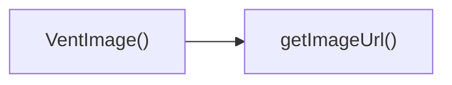

## Genel Bakış
VentHub HVAC projesinin kullanıcı arayüzü katmanında yer alan bu React modülü, havalandırma sistemleri ve ekipmanlarına ait görselleri güvenilir şekilde görüntülemek için geliştirilmiş özel bir görsel bileşenidir. Ana görselin yüklenememesi durumunda yedek görsel desteği sunarak arayüz tutarlılığını korur, temel görsel yönetimi işlevlerini tek bir modülde toplar.

## Fonksiyon Grupları
### Ana Görsel Bileşeni
Girdi olarak aldığı görsel kaynağı, alternatif metin, stillendirme sınıfları ve ek özellikleri kullanarak görseli kullanıcıya sunar, ana görsel yüklenemediğinde tanımlı yedek görsel tipiyle görüntülemeye kesintisiz devam eder.
- VentImage

### Görsel Kaynak Yönetimi Yardımcısı
Bileşenin kullanacağı her görsel için geçerli, erişilebilir URL adresi oluşturan yardımcı işlevdir, ana bileşenin doğru kaynağa ulaşmasını sağlar.
- getImageUrl

---

## AXIOMS – Mimari Varsayımlar
Bu React UI bileşeni, resim yükleme hatalarında önceden tanımlanmış yedek resimleri göstermek üzere tasarlanmıştır, doğru çalışması için modül içinde tanımlı sabitlerin ve yardımcı fonksiyonun beklenen formatta erişilebilir olması zorunludur.

[Aksiyom 1]: Eğer FALLBACK_IMAGES sabiti içinde `fallbackType` prop'u ile eşleşen bir anahtar yoksa, asıl resim yüklemesi başarısız olduğunda yedek resim gösterilemez, bileşen boş görsel alanı oluşturur.
[Aksiyom 2]: Eğer getImageUrl() fonksiyonu geçerli bir resim URL'si döndürmezse, orijinal resim hiçbir koşulda yüklenemez, yedek resim mekanizması zorunlu olarak devreye girmek zorunda kalır.
[Aksiyom 3]: Eğer VentImage bileşenine zorunlu olarak geçirilmesi gereken `src` prop'u geçerli bir resim kaynağı değilse, asıl resim yüklemesi baştan başarısız olur, yalnızca yedek resim gösterilir.
[Aksiyom 4]: Eğer FALLBACK_IMAGES nesnesi içindeki yedek resimlerin kaynak yolları geçersizse, asıl resim yüklemesi başarısız olduğunda kullanıcıya kırık resim simgesi gösterilir.

---

## FONKSIYON DETAYLARI

### VentImage
**Ne yapar**: VentHub HVAC uygulaması için özel olarak geliştirilmiş profesyonel React görsel bileşenidir. Tüm uygulama genelindeki görsel ihtiyaçlarını Supabase Storage entegrasyonu, otomatik hata yönetimi ve performans odaklı optimizasyonlar ile tek bir bileşende toplar. Erişilebilirlik standartlarına uygun, kullanıcı deneyimini artıran ve bakımı kolay bir görsel sunum altyapısı sunar.
**Nasıl yapar**: Öncelikle aldığı görsel yolunu (src) getImageUrl yardımcı fonksiyonu ile Supabase Storage'un erişilebilir tam URL'sine dönüştürür. Görselin herhangi bir nedenle yüklenememesi durumunda belirtilen fallbackType parametresine uygun şık bir yer tutucu (placeholder) görselini otomatik olarak yükler. Next.js Image bileşenini kullanarak resim boyutlandırma, format optimizasyonu ve önbellekleme gibi performans özelliklerinden tam olarak faydalanır, aldığı tüm ek stil ve özellik props'larını temel Image bileşenine ileterek esnek kullanım sağlar.
**Parametreler**:
- src: string — Supabase Storage üzerinde saklanan hedef görselin relative yoludur, bileşen içinde otomatik olarak tam erişim URL'sine çevrilir
- alt: string — Görsel için erişilebilirlik standartlarına uygun alternatif metindir, ekran okuyucular tarafından kullanılır ve görsel yüklenemediğinde metin olarak görüntülenir
- fallbackType: string — Görselin yüklenememesi durumunda gösterilecek yer tutucu görselinin tipini belirler, varsayılan değeri 'generic' olarak ayarlanmıştır
- className: string — Bileşene özel CSS sınıfları eklemek için kullanılan isteğe bağlı string parametresidir, özel stil tanımlamaları için kullanılır
- ...props: any — React görüntü elementine veya Next.js Image bileşenine iletilecek tüm ek standart veya özel props'ları toplar, bileşenin farklı kullanım senaryolarına uyum sağlamasını sağlar
**Dönüş**: React.FC<VentImageProps> — VentImageProps türündeki giriş parametrelerini alan, sayfada sorunsuz şekilde render edilen React fonksiyonel bileşenini döndürür

### getImageUrl
**Ne yapar**: Supabase Storage üzerinde saklanan tüm görsellerin relative yollarını, uygulamadan her yerden erişilebilir tam URL formatına dönüştüren merkezi yardımcı fonksiyondur. VentImage bileşeni tarafından otomatik olarak kullanılır, tüm platformda tutarlı ve hatasız görsel URL yönetimi sağlar.
**Nasıl yapar**: Uygulamanın yapılandırma dosyasından veya ortam değişkenlerinden aldığı Supabase Storage ana domain bilgisini, işlenecek görselin relative yolu ile güvenli bir şekilde birleştirir. Path formatlaması için gerekli kontrolleri yaparak eksik veya hatalı URL oluşumunu engeller, tek tip standart URL yapısı sunar.
**Parametreler**: Bu fonksiyon herhangi bir giriş parametresi almaz
**Dönüş**: string — Supabase Storage'daki hedef görselin tam, erişilebilir URL'sini içeren string değerini döndürür

---

## INTERFACES

### VentImageProps
- `src: string | null | undefined`
- `fallbackType?: 'product' | 'category' | 'brand' | 'generic'`

---

## SABİTLER
- **FALLBACK_IMAGES** (object) — `{
  product: '/images/placeholders/product-placeholder.png',
  category: '/...`

---

## AST POINTERS

### [N1_NASIL] AST Pointer: src/components/ui/VentImage.tsx::VentImage
- **params**: src, alt, fallbackType (varsayılan değer: 'generic'), className, ...props (iletilen tüm kalan prop'lar)
- **ic_degiskenler**:
  - `error` — React.useState ile yönetilen resim yükleme hatası durumunu tutan boolean değişken
  - `setError` — error state'ini güncellemek için kullanılan setter fonksiyonu
  - `isLoaded` — React.useState ile yönetilen resim başarıyla yüklendi durumunu tutan boolean değişken
  - `setIsLoaded` — isLoaded state'ini güncellemek için kullanılan setter fonksiyonu
  - `getImageUrl` — Bileşen içinde tanımlı, kullanılacak son resim URL'sini oluşturan iç fonksiyon
  - `finalSrc` — getImageUrl() çağrısıyla elde edilen, <Image> bileşeninde kullanılacak son resim kaynağı
  - `width` — props'tan ayrıştırılan resim genişlik değeri
  - `height` — props'tan ayrıştırılan resim yükseklik değeri
  - `fill` — props'tan ayrıştırılan Next.js Image fill prop'u
  - `rest` — props'tan width, height, fill çıkarıldıktan sonra kalan tüm iletilen prop'lar
  - `isFillMode` — fill prop'unun aktif olup olmadığını belirten boolean değer
  - `needsDefaultSizes` — fill, width ve height hiçbiri tanımlı değilse varsayılan boyutların kullanılacağını belirten boolean
  - `wrapperClass` — Ana sarmalayıcı 
 için oluşturulan birleştirilmiş CSS class string'i
- **Dönüş**: React JSX elementi (sarmalanmış Next.js Image bileşeni)

### [N2_NASIL] AST Pointer: src/components/ui/VentImage.tsx::getImageUrl
- **params**: (parametre yok)
- **ic_degiskenler**:
  - `supabaseUrl` — process.env.NEXT_PUBLIC_SUPABASE_URL ortam değişkeninden alınan Supabase proje adresi
  - `cleanPath` — Orijinal src'den supabase storage yolunu temizleyerek oluşturulan düzeltilmiş dosya yolu
- **Dönüş**: string (kullanılabilir son resim URL'si)

### [N3_NASIL] AST Pointer: src/components/ui/VentImage.tsx::VentImage_onError
- **params**: (parametre yok)
- **ic_degiskenler**:
  - `src` — Yüklenemeyen orijinal resim kaynağı, konsol uyarısı mesajında kullanılır
  - `setError` — Ana bileşenin error state'ini true olarak ayarlamak için kullanılan setter fonksiyonu
- **Dönüş**: yok (void, sadece konsola uyarı yazar ve yükleme hatası durumunu günceller)

---

## ÇAĞRI HARİTASI

### Disariya Cagrilar (Outgoing)
Dosya içindeki VentImage() fonksiyonu çalışma prensibi gereği yalnızca getImageUrl fonksiyonunu çağırmaktadır.

### Disaridan Cagrilanlar (Incoming)
Sağlanan veride bu modülü kullanan herhangi bir dış dosya veya fonksiyon bilgisi bulunmamaktadır.

### Ic Ice Fonksiyonlar (Nested)
Yok

---

## DOSYA-İÇİ ÇAĞRI GRAFİĞİ
  VentImage() → getImageUrl()

---

## NODE ID STANDARD

  file: src\components\ui\VentImage.tsx
  function: src\components\ui\VentImage.tsx::VentImage
  function: src\components\ui\VentImage.tsx::getImageUrl

---

## DISA AKTARILANLAR (EXPORTS)
  export: VentImage

---

## STİL TOKENLERİ

### Arbitrary Değerler (token'a geçirilmemiş)
Yok — tüm stiller token'a geçirilmiş. ✅

### Kullanılan Token'lar (zaten token'a geçirilmiş)
- (yok)

### Tailwind Sınıf Özeti
- **Renkler:** `bg-gray-100/50`
- **Layout:** `absolute`, `h-auto`, `transform-gpu`, `w-full`, `z-0`
- **Responsive:** (yok)
