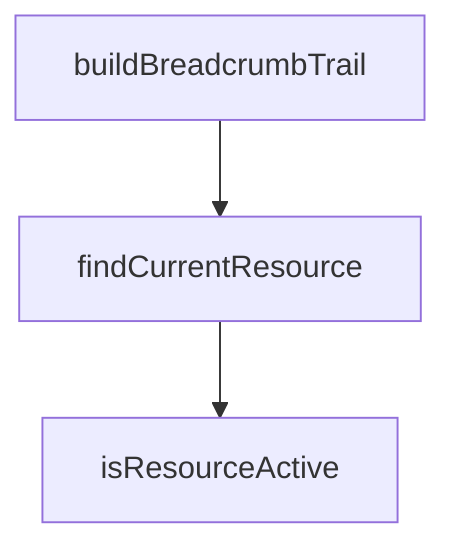

## Genel Bakış
Bu modül, admin panelinin navigasyon yapısını yönetmek için gerekli yardımcı fonksiyonları sunar. Sayfa rotalarına (pathname) göre aktif kaynağı belirleme, güncel kaynağı bulma ve ekmek kırıntısı navigasyon yolunu oluşturma gibi temel arayüz mantığını merkezileştirir.

## Fonksiyon Grupları
### Navigasyon Yardımcıları
Bu grup, kullanıcının mevcut konumuna göre panelin durumunu belirleyen ve gezinme yolunu oluşturan fonksiyonları içerir.
- isResourceActive, findCurrentResource, buildBreadcrumbTrail

---

## AXIOMS – Mimari Varsayımlar
Bu modül, belirli bir `pathname`'e karşılık gelen `AdminResource`'u bulmak, durumunu kontrol etmek ve hiyerarşik breadcrumb verisini üretmek için kullanılır.

[Aksiyom 1]: Eğer verilen `pathname` (tam yol), `ADMIN_RESOURCES` dizinindeki herhangi bir `AdminResource`'un `pathname` alanı ile birebir eşleşmiyorsa, `findCurrentResource(pathname)` fonksiyonu `undefined` döner.

[Aksiyom 2]: Eğer `ADMIN_RESOURCES` sabiti (array) düzgün başlatılmamış, boş veya geçersiz bir yapıdaysa (örneğin, elemanlarının `pathname` alanı yoksa), tüm fonksiyonların (`isResourceActive`, `findCurrentResource`, `buildBreadcrumbTrail`) çıkışları tanımsız veya hata verir.

[Aksiyom 3]: Eğer bir `AdminResource`'un `parentID` alanı, `ADMIN_RESOURCES` dizinindeki var olan başka bir resource'un `id` alanına eşit değilse, `buildBreadcrumbTrail` fonksiyonu o resource'a kadar olan zinciri kırarak eksik veya hatalı bir breadcrumb dizisi üretir.

[Aksiyom 4]: Eğer bir `AdminResource`'un `pathname` alanı, `isResourceActive` fonksiyonuna girdi olarak verilen `pathname`'in bir alt yolu (subpath) ise ve resource'un `isActive` alanı `true` ise, fonksiyon `true` döner. Aksi halde `false` döner.

[Aksiyom 5]: Eğer bir `AdminResource`'un `parentID` alanı `undefined` veya `null` ise (yani üst resource'u yoksa), bu resource kök (root) bir navigasyon elemanıdır ve `buildBreadcrumbTrail` dizisi onunla başlar.

---

## FONKSİYON DETAYLARI

### isResourceActive
**Ne yapar**: Verilen bir `AdminResource` nesnesinin, belirli bir URL pathname'i üzerinde "aktif" (seçili) olup olmadığını belirler. Bu, navigasyon menüsünde veya breadcrumb'da ilgili öğenin vurgulanmasını sağlamak için kullanılır.

**Nasıl yapar**: Fonksiyon, kaynak nesnesinin `exact` özelliğine göre farklı mantık uygular. Eğer `exact` `true` ise, pathname'in kaynak rotasıyla tam olarak eşleşip eşleşmediğini kontrol eder. `exact` `false` ise, pathname'in ya tam rotaya ya da rotanın alt yollarına (rotanın bir `/` ile bitmesi veya bir alt yol içermesi durumunda) eşleşip eşleşmediğini kontrol eder. `pathname` boşsa doğrudan `false` döner. Bu mantık, §2.6'daki kurala göre uygulanır.

**Parametreler**:
- `resource`: `AdminResource` — Etkinliği kontrol edilecek kaynak nesnesi. Bu nesne `route` ve `exact` özelliklerini içermelidir.
- `pathname`: `string` — Kontrol edilecek URL yolu (örn: `/admin/inventory`).

**Dönüş**: `boolean` — Belirtilen pathname, verilen kaynağı aktif kılıyorsa `true`, aksi halde `false` döner.

### findCurrentResource
**Ne yapar**: Verilen pathname'de `aria-current="page"` niteliği atanması gereken *tek* kaynak nesnesini bulur. Navigasyon menüsünde aktif olan öğeyi belirlemek için kullanılır. MDN WCAG kılavuzuna göre, bir dizi öğe arasında yalnızca biri current olarak işaretlenebilir; bu yüzden birden fazla eşleşme olduğunda en "derin" (en uzun rotalı) kaynak seçilir.

**Nasıl yapar**: Fonksiyon, `ADMIN_RESOURCES` dizisindeki tüm kaynakları filtreler. Sadece `inNav` özelliği `true` olan ve `isResourceActive` fonksiyonu tarafından pathname için aktif bulunan kaynakları alır. Eğer hiçbir eşleşme yoksa `undefined` döner. Eşleşenler varsa, `route` uzunluğuna göre en uzun (en derin) olanı `reduce` kullanarak seçer. Bu, hiyerarşide alt sayfaların üstlerine göre önceliklendirilmesini sağlar.

**Parametreler**:
- `pathname`: `string` — Mevcut URL yolu.

**Dönüş**: `AdminResource | undefined` — Verilen pathname için geçerli ve en derin aktif kaynak nesnesi veya hiçbir eşleşme yoksa `undefined`.

### buildBreadcrumbTrail
**Ne yapar**: Verilen pathname için kökten başlayıp en güncel sayfaya kadar uzanan breadcrumb (ekmek kırıntısı) izini (dizi) oluşturur. Bu iz, kullanıcıya mevcut sayfanın hiyerarşik konumunu göstermek için kullanılır.

**Nasıl yapar**: Fonksiyon önce `findCurrentResource` ile geçerli sayfayı bulur. Bulunan kaynaktan başlayarak, her bir kaynağın `parentKey` özelliğini takip ederek yukarı (köke doğru) doğru bir döngü başlatır. Her adımda, `parentKey` kullanılarak `ADMIN_RESOURCES` içindeki üst kaynak bulunur. Döngü, `parentKey` olmadığına veya bir döngüsel referansı önlemek için bir `Set` (guard) kullanarak daha önce ziyaret edilmiş bir key'e ulaşıldığında durur. Bulunan üst kaynaklar, dizinin başına eklenerek (`unshift`) kökten yaprağa doğru sıralanmış bir dizi elde edilir.

**Parametreler**:
- `pathname`: `string` — Breadcrumb izinin oluşturulacağı URL yolu.

**Dönüş**: `AdminResource[]` — Kökten (en üst düzey) mevcut sayfaya (en derin) kadar sıralanmış `AdminResource` nesnelerinden oluşan dizi. Eğer pathname için geçerli bir kaynak bulunamazsa boş bir dizi döner. Çağrılan kod, bu dizinin uzunluğuna bakarak breadcrumb'ı render edip etmemeye karar verir (uzunluğu 2'den kısa ise render edilmez).

---

## INTERFACES

### AdminResource
- `key: string`
- `labelKey: string`
- `group: AdminResourceGroup`
- `route: string`
- `icon: LucideIcon`
- `requiredAccess: string`
- `searchable: boolean`
- `searchHintKey?: string`
- `inNav: boolean`
- `exact?: boolean`
- `parentKey?: string`

---

## TYPE ALIASES

### AdminResourceGroup
ADMIN KAYNAK REGISTRY'Sİ — TEK KAYNAK (SSOT). Cetvel `admin-standard.md §10.4 S1`: "Nav öğeleri + aranabilir kaynaklar + hızlı aksiyonlar TEK listeden. Sidebar + komut paleti aynı registry'yi tüketir → kopya nav listesi yasak.**" Bu dosya hem `AdminSidebar`'ı hem `CommandPalette`'i hem breadcrumb'ı 
```typescript
type AdminResourceGroup = | 'main'
  | 'sales'
  | 'catalog'
  | 'pricing'
  | 'stock'
  | 'system'
```

---

## SABİTLER
- **ADMIN_RESOURCES** (array) — `[
  // ─── Ana ─────────────────────────────────────────────────────────────...`
- **ADMIN_NAV_GROUPS** (array) — `[
  { key: 'main', labelKey: 'admin.menu.groupMain' },
  { key: 'sales', la...`

---

## AST POINTERS

### [N1_NASIL] AST Pointer: C:\Users\alize\venthub-wt-quote\src\config\admin-resources.ts::isResourceActive
- **params**: (resource: AdminResource, pathname: string)
- **ic_degiskenler**:
  - `pathname` — Fonksiyona parametre olarak gelen, kontrol edilecek mevcut URL yolu
  - `resource` — Fonksiyona parametre olarak gelen, kontrol edilecek admin kaynağı nesnesi
- **Dönüş**: boolean — Belirtilen pathname, verilen resource'a aktif mi değil mi

### [N2_NASIL] AST Pointer: C:\Users\alize\venthub-wt-quote\src\config\admin-resources.ts::findCurrentResource
- **params**: (pathname: string)
- **ic_degiskenler**:
  - `pathname` — Fonksiyona parametre olarak gelen mevcut URL yolu
  - `matches` — ADMIN_RESOURCES dizisinden, navigasyonda görünür (inNav) ve mevcut pathname'e aktif olan tüm kaynakların filtrelenmiş dizisi
  - `deepest` — reduce içinde en uzun route'a sahip (en derin) kaynağı tutan geçici değişken
  - `r` — reduce callback'inde mevcut elemanı temsil eden iterasyon değişkeni
- **Dönüş**: AdminResource | undefined — pathname'e en eşleşen (en spesifik) kaynağı döner, eşleşme yoksa undefined

### [N3_NASIL] AST Pointer: C:\Users\alize\venthub-wt-quote\src\config\admin-resources.ts::buildBreadcrumbTrail
- **params**: (pathname: string)
- **ic_degiskenler**:
  - `pathname` — Fonksiyona parametre olarak gelen mevcut URL yolu
  - `current` — findCurrentResource ile bulunan mevcut aktif kaynak
  - `trail` — Oluşturulacak kırıntı izi (breadcrumb) dizisi, başlangıçta current ile başlatılır
  - `cursor` — Kırıntı izi boyunca yukarı doğru gezinirken mevcut kaynağı takip eden gösterge
  - `guard` — Sonsuz döngü ve tekrar ziyaret önlemek için ziyaret edilmiş key'leri tutan Set yapısı
  - `parentKey` — Mevcut kaynağın üst kaydının key değerini tutan özellik
  - `parent` — ADMIN_RESOURCES içinde parentKey ile bulunan üst kaynak
- **Dönüş**: AdminResource[] — current kaynağından başlayarak üst seviyelere doğru sıralanmış (en üstten en dibe) kırıntı izi dizisi

---


## MERMAID CALL GRAPH


## NODE ID STANDARD

  file: src\config\admin-resources.ts
  function: src\config\admin-resources.ts::isResourceActive
  function: src\config\admin-resources.ts::findCurrentResource
  function: src\config\admin-resources.ts::buildBreadcrumbTrail

---

## DISA AKTARILANLAR (EXPORTS)
  export: ADMIN_NAV_GROUPS
  export: ADMIN_RESOURCES
  export: AdminResource
  export: AdminResourceGroup
  export: buildBreadcrumbTrail
  export: findCurrentResource
  export: isResourceActive