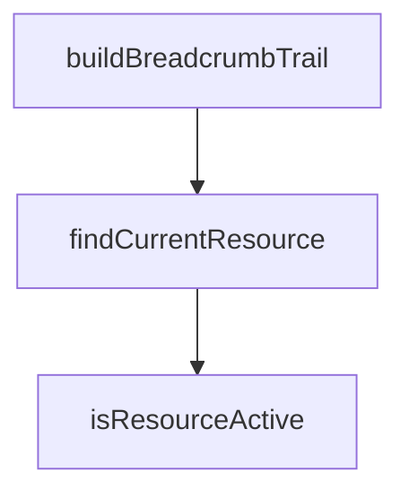

## Genel Bakış
Bu modül, VentHub admin paneli için gerekli kaynak tanımlarını ve yapılandırma verilerini merkezi olarak yönetir. Temel statik veri sunmanın yanı sıra, mevcut URL (pathname) temelinde aktif kaynak belirleme, eşleştirme ve kırıntı yolu (breadcrumb) oluşturma gibi dinamik navigasyon işlevleri de sağlar. Bu sayede admin panelinin menü yapısı, sayfa başlıkları ve rotalandırma mantığı için tekil bir kaynak görevi görür.

## Fonksiyon Grupları
### Kaynak Eşleştirme ve Durum Yönetimi
Bu grup, verilen bir URL parçasını (pathname) kullanarak ilgili admin kaynağı ile eşleşmeyi ve durumunu belirler.
- isResourceActive, findCurrentResource

### Kırıntı Yolu (Breadcrumb) Oluşturma
Bu grup, kullanıcının bulunduğu sayfa hiyerarşisini görsel olarak temsil eden kırıntı yolunu dinamik olarak oluşturur.
- buildBreadcrumbTrail

---

## AXIOMS – Mimari Varsayımlar
- Bu modül davranışsal mantık içermez (salt veri / konfigürasyon / tip tanımı).
- [Aksiyom 1]: Modülün dışa açtığı yapı (anahtar kümesi / şema) bir sözleşmedir; tüketiciler bu sabit yapıya bağlıdır — kırıcı değişiklik tüm tüketicileri etkiler.
- [Aksiyom 2]: Bir öğe ekleme/çıkarma yapısal-uyumlu olmalı; ilgili tipler ve seçiciler aynı commit'te güncel tutulmalıdır.

---

## FONKSİYON DETAYLARI

### isResourceActive
**Ne yapar**: Belirli bir kaynak nesnesinin, verilen URL yol adı (`pathname`) tarafından aktif edilip edilmediğini (yani o rotada bulunulduğunu) belirler.
**Nasıl yapar**: Fonksiyon, kaynaga ait `exact` Boolean özelliğine göre iki farklı mantık uygular. Eğer `exact` ise, sadece yol adının kaynaga ait rota ile tam olarak eşleşip eşleşmediğini kontrol eder (`pathname === resource.route`). `exact` değilse, tam eşleşme veya yol adının rota ile `/` karakteri eklenmiş haliyle başlayıp başlamadığı (`pathname.startsWith(resource.route + '/')`) durumunda kaynagın aktif olduğunu kabul eder. Bu, alt rotaların da (örneğin `/admin/inventory`) üst rotayı (`/admin`) aktif saymasını sağlar.
**Parametreler**:
- `resource`: `AdminResource` — Kontrol edilecek kaynak nesnesi. Üzerinde `route` (string) ve `exact` (boolean) özellikleri bulunur.
- `pathname`: `string` — Kontrol edilecek geçerli URL yolu.
**Dönüş**: `boolean` — Kaynak, verilen yol adı tarafından aktif ediliyorsa `true`, aksi halde `false`.

### findCurrentResource
**Ne yapar**: Verilen URL yol adı (`pathname`) için `aria-current="page"` niteliğine sahip olacak **tek** ve **en uygun** (en derin) AdminResource nesnesini bulur.
**Nasıl yapar**: Fonksiyon, önce `ADMIN_RESOURCES` dizisindeki tüm kaynakları filtreler. Sadece navigasyonda gösterilen (`inNav: true`) ve `isResourceActive` fonksiyonu tarafından aktif olan kaynakları bir `matches` dizisinde toplar. Eğer hiç eşleşme yoksa `undefined` döner. Birden fazla eşleşme varsa, web erişilebilirlik standartlarına uygun olarak (`aria-current` tek bir elemana uygulanmalı) `reduce` metoduyla en uzun `route` özelliğine sahip olanı (yani en derin hiyerarşideki kaynağı) seçer. Bu sayede sadece aktif sayfa değil, o sayfanın kendisi işaretlenmiş olur.
**Parametreler**:
- `pathname`: `string` — Mevcut URL yolu.
**Dönüş**: `AdminResource | undefined` — Verilen yol adı için en derin aktif kaynak; eğer yoksa `undefined`.

### buildBreadcrumbTrail
**Ne yapar**: Mevcut URL yol adı (`pathname`) için, hiyerarşik yapıda bir `AdminResource` örneği içeren breadcrumb (kırıntı yolu) dizisini kökten (en üst seviyeden) aktif sayfaya doğru sıralı olarak oluşturur.
**Nasıl yapar**: Fonksiyon, adımları izler: 1) `findCurrentResource` kullanarak geçerli sayfaya karşılık gelen en derin kaynağı bulur. 2) Bu kaynağı bir dizi (`trail`) başlatmak için kullanır. 3) Ardından, kaynağın `parentKey` özelliği takip edilerek bir `while` döngüsü içinde yukarı doğru (atalarına) gidilir. Her adımda, `ADMIN_RESOURCES` içinde ebeveyn kaynak bulunur ve dizinin başına eklenir (`unshift`). 4) Döngü, artık bir ebeveyn (`parentKey`) kalmadığında veya döngüsel referans (bir kaynak zaten ziyaret edilmişse) algılandığında (`guard` Set'i ile) sonlanır.
**Parametreler**:
- `pathname`: `string` — Breadcrumb zincirinin oluşturulacağı mevcut URL yolu.
**Dönüş**: `AdminResource[]` — Kökten aktif sayfaya (bu dahil) doğru sıralanmış kaynakların bir dizisi. Aktif bir kaynak bulunamazsa boş bir dizi (`[]`) döner.

---

## INTERFACES

### AdminResource
- `key: string`
- `labelKey: string`
- `group: AdminResourceGroup`
- `route: string`
- `icon: LucideIcon`
- `requiredAccess: string`
- `searchable: boolean`
- `searchHintKey?: string`
- `inNav: boolean`
- `exact?: boolean`
- `parentKey?: string`

---

## TYPE ALIASES

### AdminResourceGroup
ADMIN KAYNAK REGISTRY'Sİ — TEK KAYNAK (SSOT). Cetvel `admin-standard.md §10.4 S1`: "Nav öğeleri + aranabilir kaynaklar + hızlı aksiyonlar TEK listeden. Sidebar + komut paleti aynı registry'yi tüketir → kopya nav listesi yasak.**" Bu dosya hem `AdminSidebar`'ı hem `CommandPalette`'i hem breadcrumb'ı 
```typescript
type AdminResourceGroup = | 'main'
  | 'sales'
  | 'catalog'
  | 'pricing'
  | 'stock'
  | 'system'
```

---

## SABİTLER
- **ADMIN_RESOURCES** (array) — `[
  // ─── Ana ─────────────────────────────────────────────────────────────...`
- **ADMIN_NAV_GROUPS** (array) — `[
  { key: 'main', labelKey: 'admin.menu.groupMain' },
  { key: 'sales', la...`

---

## AST POINTERS

### [N1_NASIL] AST Pointer: src/config/admin-resources.ts::isResourceActive
- **params**: `resource: AdminResource` — kontrol edilecek kaynak nesnesi, `pathname: string` — mevcut URL yolu
- **ic_degiskenler**:
  _(değişken yok — doğrudan parametreler ve `resource.route`, `resource.exact`, `resource.key` erişimleri kullanılır)_
- **Dict/Subscript Erişimleri**:
  - `resource.exact` — kaynağın tam eşleşme isteyip istemediğini belirten boolean
  - `resource.route` — kaynağın yönlendirme yolu (3 kez kullanılır: eşleşme kontrolü ve `startsWith` içi)
- **Dönüş**: `boolean` — pathname'in verilen resource'a aktif olup olmadığı

---

### [N2_NASIL] AST Pointer: src/config/admin-resources.ts::findCurrentResource
- **params**: `pathname: string` — aranacak mevcut URL yolu
- **ic_degiskenler**:
  - `matches` — `ADMIN_RESOURCES` içerisinden `inNav` özelliği true olan ve `pathname` ile aktif eşleşen tüm kaynakların filtrelenmiş dizisi
- **Dict/Subscript Erişimleri**:
  - `r.inNav` — filtreme sırasında her kaynağın navigasyonda görünüp görünmediğini kontrol eder
  - `r.route` — `reduce` içinde her kaynağın rotasının uzunluğunu karşılaştırmak için kullanılır
  - `deepest.route` — şu anki en derin (en uzun rotaya sahip) kaynağın rotası
- **Dönüş**: `AdminResource | undefined` — pathname ile eşleşen en derin (en uzun rotalı) navigasyon kaynağı; eşleşme yoksa `undefined`

---

### [N3_NASIL] AST Pointer: src/config/admin-resources.ts::buildBreadcrumbTrail
- **params**: `pathname: string` — breadcrumb zincirinin oluşturulacağı URL yolu
- **ic_degiskenler**:
  - `current` — `findCurrentResource` ile bulunan mevcut (en derin) kaynak nesnesi
  - `trail` — `AdminResource[]` dizisi; breadcrumb zincirinin oluşturulduğu başlangıçta `current` ile başlayan yol
  - `cursor` — döngü içinde backsöz konusu kaynaktan başlayarak üst kaynaklara (parent)走出ilen imleç; başlangıçta `current`'e eşittir
  - `guard` — `Set<string>` — sonsuz döngüyü önlemek için ziyaret edilen `key`'leri tutar; başlangıçta `current.key` ile başlar
- **Dict/Subscript Erişimleri**:
  - `current.key` — mevcut kaynağın benzersiz tanımlayıcısı, `guard` Set'ine eklenir
  - `cursor.parentKey` — döngü koşulunda kontrol edilen üst kaynağın key'i; `undefined` olduğunda döngü biter
  - `r.key` — `ADMIN_RESOURCES.find` aramasında her kaynağın key'i eşleştirilir
  - `parent.key` — bulunan üst kaynağın key'i; `guard` kontrolü ve `guard.add` için kullanılır
- **Dönüş**: `AdminResource[]` — `current`'ten root'a (en üst ebeveyne) doğru sıralanmış breadcrumb dizisi; `current` bulunamazsa boş dizi `[]`

---


## MERMAID CALL GRAPH


## NODE ID STANDARD

  file: src\config\admin-resources.ts
  function: src\config\admin-resources.ts::isResourceActive
  function: src\config\admin-resources.ts::findCurrentResource
  function: src\config\admin-resources.ts::buildBreadcrumbTrail

---

## DISA AKTARILANLAR (EXPORTS)
  export: ADMIN_NAV_GROUPS
  export: ADMIN_RESOURCES
  export: AdminResource
  export: AdminResourceGroup
  export: buildBreadcrumbTrail
  export: findCurrentResource
  export: isResourceActive