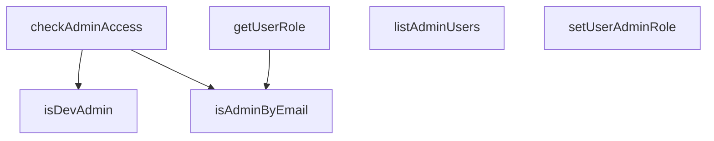

## Genel Bakış
Bu modül, HVAC yönetim platformu VentHub'un konfigürasyon katmanında yer alarak yönetici erişim ve rol yönetimi süreçlerini tek merkezde toplar. Kullanıcı kimlik bilgilerine göre yönetici yetkilerini doğrular, kullanıcı rolleri üzerinde düzenleme ve sorgulama işlemleri yapar, sistemdeki tüm yönetici kullanıcılarını listeleme imkanı sunar.

## Fonksiyon Grupları
### Kullanıcı Rol Yönetimi
Kullanıcı rollerini getirme, yeni yönetici rolü atama ve sistemdeki kayıtlı tüm yönetici kullanıcılarının listesini alma gibi temel rol yönetimi işlemlerini gerçekleştirir.
- getUserRole, setUserAdminRole, listAdminUsers

### Yönetici Erişim Doğrulama
Farklı senaryolara göre kullanıcıların yönetici erişimine sahip olup olmadığını kontrol eden güvenlik kontrollerini sunar, yerel geliştirici statüsünden e-posta ve kullanıcı meta verilerine kadar birçok kriteri baz alır.
- isAdminByEmail, isDevAdmin, checkAdminAccess

---

## AXIOMS – Mimari Varsayımlar
Bu modül, VentHub HVAC sisteminin yönetici erişim kontrolünü ve rol yönetimini gerçekleştirmek üzere tasarlanmıştır, tüm fonksiyonların doğru çalışması için giriş parametrelerinin, sabit tanımlı yönetici listelerinin ve kullanıcı meta verilerinin eksiksiz ve güvenilir olması zorunludur.

[Aksiyom 1]: Eğer FALLBACK_ADMIN_EMAILS sabiti tanımsız veya boş bir dizi ise, e-posta tabanlı temel yönetici erişim kontrolleri çalışmaz, tanımlı yedek yönetici hesapları sisteme erişemez.
[Aksiyom 2]: Eğer checkAdminAccess fonksiyonuna iletilen kullanıcı nesnesi (user) hem email hem de user_metadata.role alanlarından yoksun ise, hiçbir kullanıcıya yönetici erişimi tanımlanamaz, tüm yönetici paneli erişim istekleri reddedilir.
[Aksiyom 3]: Eğer getUserRole veya setUserAdminRole fonksiyonlarına iletilen userId parametresi boş veya geçersiz string ise, kullanıcı rolü ne sorgulanabilir ne de atanabilir, rol tabanlı tüm erişim kontrolleri başarısız olur.
[Aksiyom 4]: Eğer setUserAdminRole fonksiyonuna iletilen role parametresi sistemde tanımsız bir string ise, rol veri tabanına kaydedilse dahi erişim kontrolleri tarafından tanınmaz, ilgili kullanıcıya yönetici erişimi sağlanamaz.
[Aksiyom 5]: Eğer isDevAdmin() fonksiyonunun çalışması için gereken ortam spesifik işaretçi tanımsız ise, geliştirici yönetici erişimi gerektiren tüm işlemler devre dışı kalır.
[Aksiyom 6]: Eğer listAdminUsers fonksiyonunun eriştiği sistemdeki tüm kullanıcı verisi erişilemez ise, fonksiyon eksik veya hatalı yönetici listesi döndürür, yetkisiz hesapların tespiti yapılamaz.

---

## FONKSİYON DETAYLARI

### getUserRole

**Ne yapar**: Verilen kullanıcı ID'sine ait rol bilgisini Supabase veritabanından asenkron olarak çeker. Kullanıcı veritabanında kayıtlı değilse veya bir hata oluşursa, opsiyonel olarak verilen email adresi üzerinden fallback mekanizmasıyla rol belirleme yapar.

**Nasıl yapar**: Fonksiyon öncelikle opsiyonel `userEmail` parametresini kontrol eder ve bu email'in hardcoded superadmin listesinde (`recep.varlik@gmail.com`, `recepvarlk@gmail.com`) olup olmadığına bakar; bu listeye uyan email'ler için `'super_admin'`, `isAdminByEmail()` yardımcısı tarafından tanımlanan diğer admin email'leri için `'admin'` rolünü doğrudan döndürerek veritabanı sorgusunu atlatabilir. Ardından `window` nesnesinin varlığına göre tarayıcı taraflı (`supabaseBrowserClient`) veya statik taraflı (`supabaseStaticClient`) Supabase istemcisini dinamik import ile yükler ve `user_profiles` tablosundan ilgili kullanıcının `role` alanını `maybeSingle()` ile çeker. Sorgu başarılı olup `data.role` mevcutsa bu değer döndürülür; veritabanında kayıt bulunamaması durumunda tekrar email fallback kontrolü yapılarak admin olup olmadığı kontrol edilir. Herhangi bir hata veya istisna durumunda `console.warn` ile log yazdırarak varsayılan `'user'` rolünü döndürür.

**Parametreler**:
- `userId`: `string` — Sorgulanacak kullanıcının benzersiz tanımlayıcısı. `user_profiles` tablosundaki `id` alanıyla eşleşir.
- `userEmail`: `string | undefined` — Opsiyonel. Kullanıcının email adresi. Veritabanı sorgusu başarısız olduğunda veya kayıt bulunamadığında rol belirleme için fallback olarak kullanılır.

**Dönüş**: `Promise<string>` — Kullanıcının rolünü temsil eden dize. Olası değerler: `'super_admin'`, `'admin'`, `'user'`. Veritabanı hatası, istisna veya tanımsız durumlarda varsayılan olarak `'user'` döner.

### isAdminByEmail
**Ne yapar**: E-posta adresi bazlı olarak kullanıcının admin yetkisine sahip olup olmadığını kontrol eden senkron fallback kontrol fonksiyonudur. Genellikle ana rol sorgusu çalışmadığında veya önbellekte rol bilgisi bulunamadığında yetki doğrulamak için kullanılır.
**Nasıl yapar**: Sistemde önceden tanımlanmış yetkili admin e-postaları listesi ile girilen e-posta adresini karşılaştırır. Eğer eşleşme tespit edilirse kullanıcının admin olduğu kabul edilir, eğer hiç e-posta adresi sağlanmazsa otomatik olarak yetkisiz olarak değerlendirilir.
**Parametreler**:
- email?: string — Admin yetkisi kontrol edilmek istenen kullanıcının opsiyonel e-posta adresi
**Dönüş**: boolean — Kullanıcının admin olup olmadığını belirten boolean değer, admin ise true, aksi halde false döndürür

### isDevAdmin
**Ne yapar**: Sadece uygulamanın geliştirme ortamında çalıştığı durumlarda kullanılmak üzere kullanıcının geliştirici statüsündeki admin olup olmadığını kontrol eder, üretim ortamında hiçbir şekilde çalışmaz. Yerel geliştirme süreçlerinde test amaçlı yetki vermek için kullanılır.
**Nasıl yapar**: Uygulamanın çalıştığı ortamı tanımlayan ortam değişkenlerini kontrol eder, eğer ortam geliştirme olarak tanımlıysa sisteme kayıtlı geliştirici kullanıcı bilgileriyle eşleştirme yapar, herhangi bir ortamda eşleşme sağlanmazsa false döndürür.
**Parametreler**: Herhangi bir parametre almaz
**Dönüş**: boolean — Geliştirme ortamında yetki doğrulanırsa true, tüm diğer durumlarda (üretim ortamı, yetkisiz kullanıcı vb.) false döndürür

### checkAdminAccess
**Ne yapar**: Önbellekte tutulan önceki kimlik doğrulama durumu verilerini kullanarak senkron şekilde kullanıcının admin erişimine sahip olup olmadığını kontrol eder, anlık yetki sorguları için optimize edilmiş cache tabanlı bir kontroldür.
**Nasıl yapar**: Öncelikle girdi olarak aldığı kullanıcı nesnesinin user_metadata alanında yer alan rol bilgisini kontrol eder, eğer geçerli bir rol bilgisi varsa bu bilgiye göre yetkiyi belirler. Eğer kullanıcı nesnesinde rol bilgisi bulunamazsa fallback olarak kullanıcının e-posta adresiyle admin kontrolü gerçekleştirir. Eğer kullanıcı nesnesi null olarak gelirse otomatik olarak yetkisiz olarak değerlendirir.
**Parametreler**:
- user: { email?: string; user_metadata?: { role?: string } } | null — Admin erişimi kontrol edilmek istenen kullanıcı nesnesi, null olabilir, içeriğinde opsiyonel e-posta ve yine opsiyonel olarak kullanıcı meta verilerinde rol bilgisini barındırır
**Dönüş**: boolean — Kullanıcının admin erişimine sahip olması durumunda true, aksi halde false döndürür

### setUserAdminRole
**Ne yapar**: Sadece istemci tarafında kullanılmak üzere belirtilen kullanıcıya admin rolü atar, bu işlem sadece yerel istemci verilerini günceller, kalıcı bir veritabanı değişikliği yapmaz. Gerçek veritabanı güncellemesi için ayrı bir admin paneli işlemi yapılması zorunludur.
**Nasıl yapar**: Parametre olarak aldığı kullanıcı ID'si ile istemci tarafındaki yerel kullanıcı listesinde eşleşme yapar, eşleşen kullanıcıya girilen rolü atar. İşlem sadece yerel oturum boyunca geçerlidir, kullanıcı oturumu kapatıp açtığında veya sayfayı yenilediğinde kalıcı olmaz.
**Parametreler**:
- userId: string - Rolü atanacak kullanıcının benzersiz sistem kimliği, zorunlu parametredir
- role: string - Kullanıcıya atanacak olan rol, zorunlu parametredir
**Dönüş**: Promise<boolean> — Rol atama işleminin başarıyla tamamlandığını belirten boolean değer içeren bir promise döndürür, işlem başarılıysa true, aksi halde false döndürür

### listAdminUsers
**Ne yapar**: Sisteme kayıtlı tüm admin kullanıcılarının listesini getirir, bu fonksiyona sadece admin yetkisine sahip kullanıcılar erişebilir, yetkisiz kullanıcıların erişimi engellenir. Admin panelinde yetkili kullanıcıları listelemek için kullanılır.
**Nasıl yapar**: İlk olarak fonksiyonu çağıran kullanıcının admin yetkisini doğrular, yetki doğrulaması başarılı olursa veritabanından tüm admin kullanıcılarının verilerini çeker, yapılandırılmış AdminUser tipinde liste olarak döndürür. Yetki doğrulaması başarısız olursa erişim hatası fırlatır.
**Parametreler**: Herhangi bir parametre almaz
**Dönüş**: Promise<AdminUser[]> — Asenkron olarak gerçekleşen işlem sonucunda tüm admin kullanıcılarının verilerini içeren AdminUser tipinde dizi barındıran bir promise döndürür

---

## INTERFACES

### AdminUser
Admin user interface for type safety
- `id: string`
- `email: string`
- `full_name?: string`
- `phone?: string`
- `role: string`
- `created_at: string`
- `updated_at: string`

---

## SABİTLER
- **FALLBACK_ADMIN_EMAILS** (array) — `[
  'admin@venthub.com',
  'info@venthub.com',
  'alize@venthub.com',
  '...`

---

## AST POINTERS

### [N1_NASIL] AST Pointer: src/config/admin.ts::getUserRole
- **params**: `userId: string`, `userEmail?: string`
- **ic_degiskenler**:
  - `supabase` — Ortam koşuluna göre browser veya static supabase client; `typeof window !== 'undefined'` kontrolü ile seçilir
  - `supabaseBrowserClient` — Dinamik import ile yüklenen tarayıcı tarafı supabase istemcisi (`'../lib/supabase/client'`)
  - `supabaseStaticClient` — Dinamik import ile yüklenen statik/sunucu tarafı supabase istemcisi (`'../lib/supabase/static'`)
  - `data` — `user_profiles` tablosundan `role` alanı ile getirilen satır sonucu
  - `error` — Supabase sorgusu sırasında oluşabilecek hata nesnesi
- **Dönüş**: `Promise<string>` — Kullanıcının rolü (`'super_admin'`, `'admin'` veya `'user'`)

### [N2_NASIL] AST Pointer: src/config/admin.ts::isAdminByEmail
- **params**: `email?: string`
- **ic_degiskenler**: (yok)
- **Dönüş**: `boolean` — E-posta adresi `FALLBACK_ADMIN_EMAILS` listesinde küçük harfe çevrilmiş haliyle varsa `true`

### [N3_NASIL] AST Pointer: src/config/admin.ts::isDevAdmin
- **params**: (yok)
- **ic_degiskenler**:
  - `isDev` — `process.env.NODE_ENV === 'development'` kontrolü ile development ortamında olunduğunu belirtir
  - `isLocalhost` — `window.location.hostname === 'localhost'` kontrolü ile yerel sunucuda olunduğunu belirtir
- **Dönüş**: `boolean` — Hem development ortamı hem localhost ise `true`

### [N4_NASIL] AST Pointer: src/config/admin.ts::checkAdminAccess
- **params**: `user: { email?: string; user_metadata?: { role?: string } } | null`
- **ic_degiskenler**:
  - `lowerEmail` — `user.email` değerinin küçük harfe çevrilmiş hali; email karşılaştırmalarında kullanılır
  - `metadataRole` — Supabase user metadata'sından okunan `role` alanı; izin verilen roller listesinde (`super_admin`, `admin`, `moderator`, `warehouse`, `sales`, `viewer`) kontrol edilir
- **Dönüş**: `boolean` — Kullanıcının admin erişimine sahip olup olmadığı; email fallback, metadata rol veya local dev fallback ile belirlenir

### [N5_NASIL] AST Pointer: src/config/admin.ts::setUserAdminRole
- **params**: `userId: string`, `role: string`
- **ic_degiskenler**:
  - `supabase` — Ortam koşuluna göre browser veya static supabase client; `typeof window !== 'undefined'` kontrolü ile seçilir
  - `supabaseBrowserClient` — Dinamik import ile yüklenen tarayıcı tarafı supabase istemcisi (`'../lib/supabase/client'`)
  - `supabaseStaticClient` — Dinamik import ile yüklenen statik/sunucu tarafı supabase istemcisi (`'../lib/supabase/static'`)
  - `data` — `set_user_admin_role` RPC çağrısının dönüş değeri; `true` ise atama başarılı
  - `error` — RPC çağrısı sırasında oluşabilecek hata nesnesi
- **Dönüş**: `Promise<boolean>` — Rol ataması başarılıysa `true`, hata oluşursa `false`

### [N6_NASIL] AST Pointer: src/config/admin.ts::listAdminUsers
- **params**: (yok)
- **ic_degiskenler**:
  - `ensureSessionFresh` — Dinamik import ile yüklenen oturum tazeleme fonksiyonu (`'../lib/ensureSessionFresh'`); çağrılarak session'un güncel olmasını sağlar
  - `supabase` — Ortam koşuluna göre browser veya static supabase client; `typeof window !== 'undefined'` kontrolü ile seçilir
  - `supabaseBrowserClient` — Dinamik import ile yüklenen tarayıcı tarafı supabase istemcisi (`'../lib/supabase/client'`)
  - `supabaseStaticClient` — Dinamik import ile yüklenen statik/sunucu tarafı supabase istemcisi (`'../lib/supabase/static'`)
  - `rpcRes` — `admin_list_users` RPC çağrısınınham sonucu; `.data` ve `.error` alanları ayrıştırılır
  - `rpcErr` — RPC sonucundaki `.error` alanı; hata varsa `true` döner ve boş dizi döner
  - `rpcData` — RPC başarıyla döndüğünde `AdminUser[]` tipindeki kullanıcı listesi; `data` alanı `null` olabilir, bu durumda boş dizi kullanılır
- **Dönüş**: `Promise<AdminUser[]>` — Admin kullanıcıların listesi; hata durumunda boş dizi `[]` döner

---

## MERMAID CALL GRAPH

## NODE ID STANDARD

  file: src\config\admin.ts
  function: src\config\admin.ts::getUserRole
  function: src\config\admin.ts::isAdminByEmail
  function: src\config\admin.ts::isDevAdmin
  function: src\config\admin.ts::checkAdminAccess
  function: src\config\admin.ts::setUserAdminRole
  function: src\config\admin.ts::listAdminUsers

---

## DISA AKTARILANLAR (EXPORTS)
  export: checkAdminAccess
  export: getUserRole
  export: isAdminByEmail
  export: isDevAdmin
  export: listAdminUsers
  export: setUserAdminRole