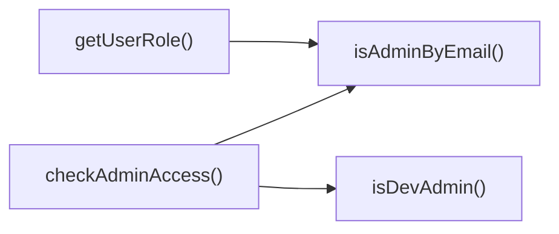

## Genel Bakış
Bu modül, HVAC yönetim platformu VentHub'un konfigürasyon katmanında yer alarak yönetici erişim ve rol yönetimi süreçlerini tek merkezde toplar. Kullanıcı kimlik bilgilerine göre yönetici yetkilerini doğrular, kullanıcı rolleri üzerinde düzenleme ve sorgulama işlemleri yapar, sistemdeki tüm yönetici kullanıcılarını listeleme imkanı sunar.

## Fonksiyon Grupları
### Kullanıcı Rol Yönetimi
Kullanıcı rollerini getirme, yeni yönetici rolü atama ve sistemdeki kayıtlı tüm yönetici kullanıcılarının listesini alma gibi temel rol yönetimi işlemlerini gerçekleştirir.
- getUserRole, setUserAdminRole, listAdminUsers

### Yönetici Erişim Doğrulama
Farklı senaryolara göre kullanıcıların yönetici erişimine sahip olup olmadığını kontrol eden güvenlik kontrollerini sunar, yerel geliştirici statüsünden e-posta ve kullanıcı meta verilerine kadar birçok kriteri baz alır.
- isAdminByEmail, isDevAdmin, checkAdminAccess

---

## AXIOMS – Mimari Varsayımlar
Bu modül, VentHub HVAC sisteminin yönetici erişim kontrolünü ve rol yönetimini gerçekleştirmek üzere tasarlanmıştır, tüm fonksiyonların doğru çalışması için giriş parametrelerinin, sabit tanımlı yönetici listelerinin ve kullanıcı meta verilerinin eksiksiz ve güvenilir olması zorunludur.

[Aksiyom 1]: Eğer FALLBACK_ADMIN_EMAILS sabiti tanımsız veya boş bir dizi ise, e-posta tabanlı temel yönetici erişim kontrolleri çalışmaz, tanımlı yedek yönetici hesapları sisteme erişemez.
[Aksiyom 2]: Eğer checkAdminAccess fonksiyonuna iletilen kullanıcı nesnesi (user) hem email hem de user_metadata.role alanlarından yoksun ise, hiçbir kullanıcıya yönetici erişimi tanımlanamaz, tüm yönetici paneli erişim istekleri reddedilir.
[Aksiyom 3]: Eğer getUserRole veya setUserAdminRole fonksiyonlarına iletilen userId parametresi boş veya geçersiz string ise, kullanıcı rolü ne sorgulanabilir ne de atanabilir, rol tabanlı tüm erişim kontrolleri başarısız olur.
[Aksiyom 4]: Eğer setUserAdminRole fonksiyonuna iletilen role parametresi sistemde tanımsız bir string ise, rol veri tabanına kaydedilse dahi erişim kontrolleri tarafından tanınmaz, ilgili kullanıcıya yönetici erişimi sağlanamaz.
[Aksiyom 5]: Eğer isDevAdmin() fonksiyonunun çalışması için gereken ortam spesifik işaretçi tanımsız ise, geliştirici yönetici erişimi gerektiren tüm işlemler devre dışı kalır.
[Aksiyom 6]: Eğer listAdminUsers fonksiyonunun eriştiği sistemdeki tüm kullanıcı verisi erişilemez ise, fonksiyon eksik veya hatalı yönetici listesi döndürür, yetkisiz hesapların tespiti yapılamaz.

---

## FONKSIYON DETAYLARI

### getUserRole
**Ne yapar**: Veritabanından belirtilen kullanıcının rolünü getirir, opsiyonel olarak sağlanan kullanıcı e-postasını ID ile rol erişimi sağlanamadığında fallback olarak kullanabilir. Tüm kimlik doğrulama ve yetkilendirme akışlarında kullanıcının sahip olduğu yetki seviyesini belirlemek için kullanılan temel asenkron fonksiyondur.
**Nasıl yapar**: Öncelikle zorunlu parametre olarak aldığı kullanıcı ID'si ile veritabanı sorgusu gerçekleştirir. Eğer ID üzerinden kullanıcı rolünü başarıyla çekemezse, opsiyonel olarak sağlanan kullanıcı e-postasını kullanarak aynı sorguyu tekrarlar. Asenkron yapısı sayesinde tüm işlem tamamlanana kadar promise döndürür, işlem bittikten sonra rol bilgisini iletir.
**Parametreler**:
- userId: string — Kontrol edilmek istenen kullanıcının benzersiz, sistemde tanımlı kimliği, zorunlu parametredir
- userEmail?: string — Kullanıcı ID'si ile rol erişimi sağlanamadığında kullanılacak opsiyonel kullanıcı e-posta adresi
**Dönüş**: Promise<string> — Asenkron olarak gerçekleşen işlem sonucunda kullanıcının rolünü içeren string tipinde bir promise döndürür

### isAdminByEmail
**Ne yapar**: E-posta adresi bazlı olarak kullanıcının admin yetkisine sahip olup olmadığını kontrol eden senkron fallback kontrol fonksiyonudur. Genellikle ana rol sorgusu çalışmadığında veya önbellekte rol bilgisi bulunamadığında yetki doğrulamak için kullanılır.
**Nasıl yapar**: Sistemde önceden tanımlanmış yetkili admin e-postaları listesi ile girilen e-posta adresini karşılaştırır. Eğer eşleşme tespit edilirse kullanıcının admin olduğu kabul edilir, eğer hiç e-posta adresi sağlanmazsa otomatik olarak yetkisiz olarak değerlendirilir.
**Parametreler**:
- email?: string — Admin yetkisi kontrol edilmek istenen kullanıcının opsiyonel e-posta adresi
**Dönüş**: boolean — Kullanıcının admin olup olmadığını belirten boolean değer, admin ise true, aksi halde false döndürür

### isDevAdmin
**Ne yapar**: Sadece uygulamanın geliştirme ortamında çalıştığı durumlarda kullanılmak üzere kullanıcının geliştirici statüsündeki admin olup olmadığını kontrol eder, üretim ortamında hiçbir şekilde çalışmaz. Yerel geliştirme süreçlerinde test amaçlı yetki vermek için kullanılır.
**Nasıl yapar**: Uygulamanın çalıştığı ortamı tanımlayan ortam değişkenlerini kontrol eder, eğer ortam geliştirme olarak tanımlıysa sisteme kayıtlı geliştirici kullanıcı bilgileriyle eşleştirme yapar, herhangi bir ortamda eşleşme sağlanmazsa false döndürür.
**Parametreler**: Herhangi bir parametre almaz
**Dönüş**: boolean — Geliştirme ortamında yetki doğrulanırsa true, tüm diğer durumlarda (üretim ortamı, yetkisiz kullanıcı vb.) false döndürür

### checkAdminAccess
**Ne yapar**: Önbellekte tutulan önceki kimlik doğrulama durumu verilerini kullanarak senkron şekilde kullanıcının admin erişimine sahip olup olmadığını kontrol eder, anlık yetki sorguları için optimize edilmiş cache tabanlı bir kontroldür.
**Nasıl yapar**: Öncelikle girdi olarak aldığı kullanıcı nesnesinin user_metadata alanında yer alan rol bilgisini kontrol eder, eğer geçerli bir rol bilgisi varsa bu bilgiye göre yetkiyi belirler. Eğer kullanıcı nesnesinde rol bilgisi bulunamazsa fallback olarak kullanıcının e-posta adresiyle admin kontrolü gerçekleştirir. Eğer kullanıcı nesnesi null olarak gelirse otomatik olarak yetkisiz olarak değerlendirir.
**Parametreler**:
- user: { email?: string; user_metadata?: { role?: string } } | null — Admin erişimi kontrol edilmek istenen kullanıcı nesnesi, null olabilir, içeriğinde opsiyonel e-posta ve yine opsiyonel olarak kullanıcı meta verilerinde rol bilgisini barındırır
**Dönüş**: boolean — Kullanıcının admin erişimine sahip olması durumunda true, aksi halde false döndürür

### setUserAdminRole
**Ne yapar**: Sadece istemci tarafında kullanılmak üzere belirtilen kullanıcıya admin rolü atar, bu işlem sadece yerel istemci verilerini günceller, kalıcı bir veritabanı değişikliği yapmaz. Gerçek veritabanı güncellemesi için ayrı bir admin paneli işlemi yapılması zorunludur.
**Nasıl yapar**: Parametre olarak aldığı kullanıcı ID'si ile istemci tarafındaki yerel kullanıcı listesinde eşleşme yapar, eşleşen kullanıcıya girilen rolü atar. İşlem sadece yerel oturum boyunca geçerlidir, kullanıcı oturumu kapatıp açtığında veya sayfayı yenilediğinde kalıcı olmaz.
**Parametreler**:
- userId: string - Rolü atanacak kullanıcının benzersiz sistem kimliği, zorunlu parametredir
- role: string - Kullanıcıya atanacak olan rol, zorunlu parametredir
**Dönüş**: Promise<boolean> — Rol atama işleminin başarıyla tamamlandığını belirten boolean değer içeren bir promise döndürür, işlem başarılıysa true, aksi halde false döndürür

### listAdminUsers
**Ne yapar**: Sisteme kayıtlı tüm admin kullanıcılarının listesini getirir, bu fonksiyona sadece admin yetkisine sahip kullanıcılar erişebilir, yetkisiz kullanıcıların erişimi engellenir. Admin panelinde yetkili kullanıcıları listelemek için kullanılır.
**Nasıl yapar**: İlk olarak fonksiyonu çağıran kullanıcının admin yetkisini doğrular, yetki doğrulaması başarılı olursa veritabanından tüm admin kullanıcılarının verilerini çeker, yapılandırılmış AdminUser tipinde liste olarak döndürür. Yetki doğrulaması başarısız olursa erişim hatası fırlatır.
**Parametreler**: Herhangi bir parametre almaz
**Dönüş**: Promise<AdminUser[]> — Asenkron olarak gerçekleşen işlem sonucunda tüm admin kullanıcılarının verilerini içeren AdminUser tipinde dizi barındıran bir promise döndürür

---

## INTERFACES

### AdminUser
Admin user interface for type safety
- `id: string`
- `email: string`
- `full_name?: string`
- `phone?: string`
- `role: string`
- `created_at: string`
- `updated_at: string`

---

## SABİTLER
- **FALLBACK_ADMIN_EMAILS** (array) — `[
  'admin@venthub.com',
  'info@venthub.com',
  'alize@venthub.com',
  '...`

---

## AST POINTERS

### [N1_NASIL] AST Pointer: src/config/admin.ts::getUserRole
- **params**: ["userId: string", "userEmail?: string"]
- **ic_degiskenler**:
  - `supabase` -- "../lib/supabase" modülünden dinamik olarak import edilen veritabanı istemcisi
  - `data` -- supabase üzerinden user_profiles tablosundan çekilen kullanıcı rolü içeren veri nesnesi
  - `error` -- supabase sorgusu sırasında oluşabilecek hata nesnesi
- **Dönüş**: Promise<string>

### [N2_NASIL] AST Pointer: src/config/admin.ts::isAdminByEmail
- **params**: ["email?: string"]
- **ic_degiskenler**: yok
- **Dönüş**: boolean

### [N3_NASIL] AST Pointer: src/config/admin.ts::isDevAdmin
- **params**: (parametre yok)
- **ic_degiskenler**:
  - `isDev` -- Uygulamanın geliştirme ortamında çalışıp çalışmadığını tutan boolean değişken
  - `isLocalhost` - Çalışma ortamının tarayıcı olup sunucu hostname'inin localhost olup olmadığını kontrol eden boolean değişken
- **Dönüş**: boolean

### [N4_NASIL] AST Pointer: src/config/admin.ts::checkAdminAccess
- **params**: ["user: { email?: string; user_metadata?: { role?: string } } | null"]
- **ic_degiskenler**:
  - `lowerEmail` -- Kullanıcının email adresini küçük harfe çevirerek saklayan değişken
  - `metadataRole` -- Kullanıcının user_metadata alanındaki rol bilgisini tutan değişken
- **Dönüş**: boolean

### [N5_NASIL] AST Pointer: src/config/admin.ts::setUserAdminRole
- **params**: ["userId: string", "role: string"]
- **ic_degiskenler**:
  - `supabase` -- "../lib/supabase" modülünden dinamik olarak import edilen veritabanı istemcisi
  - `data` -- set_user_admin_role rpc çağrısının dönüş verisi
  - `error` -- rpc çağrısı sırasında oluşan hata nesnesi
- **Dönüş**: Promise<boolean>

### [N6_NASIL] AST Pointer: src/config/admin.ts::listAdminUsers
- **params**: (parametre yok)
- **ic_degiskenler**:
  - `ensureSessionFresh` -- "../lib/ensureSessionFresh" modülünden dinamik import edilen oturum geçerliliğini yenileyen fonksiyon
  - `supabase` -- "../lib/supabase" modülünden dinamik import edilen veritabanı istemcisi
  - `rpcRes` -- admin_list_users rpc çağrısının tüm dönüş değeri
  - `rpcErr` -- rpc dönüşündeki hata nesnesi
  - `rpcData` -- rpc'den dönen AdminUser tipindeki veri dizisi
- **Dönüş**: Promise<AdminUser[]>

---

## ÇAĞRI HARİTASI

### Disariya Cagrilar (Outgoing)
getUserRole() fonksiyonu kullanıcı rolünü doğrulamak amacıyla yalnızca isAdminByEmail fonksiyonunu çağırır; checkAdminAccess() fonksiyonu yönetici erişim kontrolü yapmak için hem isAdminByEmail hem de isDevAdmin fonksiyonlarını çağırır.

### Disaridan Cagrilanlar (Incoming)
Sağlanan çağrı verisinde bu modülün fonksiyonlarını kullanan herhangi bir dış dosya veya fonksiyon belirtilmemiştir.

### Ic Ice Fonksiyonlar (Nested)
Yok

---

## DOSYA-İÇİ ÇAĞRI GRAFİĞİ
  checkAdminAccess() → isAdminByEmail()
  checkAdminAccess() → isDevAdmin()
  getUserRole() → isAdminByEmail()

---

## NODE ID STANDARD

  file: src\config\admin.ts
  function: src\config\admin.ts::getUserRole
  function: src\config\admin.ts::isAdminByEmail
  function: src\config\admin.ts::isDevAdmin
  function: src\config\admin.ts::checkAdminAccess
  function: src\config\admin.ts::setUserAdminRole
  function: src\config\admin.ts::listAdminUsers

---

## DISA AKTARILANLAR (EXPORTS)
  export: checkAdminAccess
  export: getUserRole
  export: isAdminByEmail
  export: isDevAdmin
  export: listAdminUsers
  export: setUserAdminRole