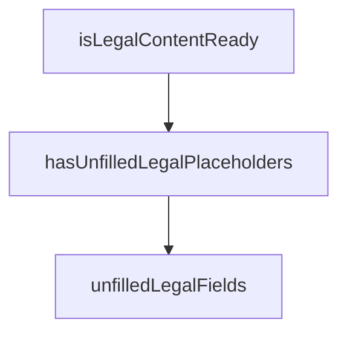

## Genel Bakış
VentHub HVAC projesinin `src/config/legal.ts` modülü, platformun yasal yapılandırma değerlerini merkezi olarak tutar ve bu yapılandırmanın eksiksizliğini doğrulayan yardımcı fonksiyonlar sağlar. Modül, hem statik yasal ayarları barındırır hem de uygulamanın yasal içerik sunumuna hazır olup olmadığını kontrol eden bir arayüz sunar.

## Fonksiyon Grupları
### Yapılandırma Doğrulama
Bu grup, verilen bir yasal yapılandırma nesnesinin durumunu analiz ederek eksik veya hazır olup olmadığını sorgulayan fonksiyonları içerir. Bu fonksiyonlar, uygulamanın yasal uyumluluk gereksinimlerini karşılayıp karşılamadığını programatik olarak denetler.
- unfilledLegalFields, hasUnfilledLegalPlaceholders, isLegalContentReady

---

## AXIOMS – Mimari Varsayımlar
- Bu modül davranışsal mantık içermez (salt veri / konfigürasyon / tip tanımı).
- [Aksiyom 1]: Modülün dışa açtığı yapı (anahtar kümesi / şema) bir sözleşmedir; tüketiciler bu sabit yapıya bağlıdır — kırıcı değişiklik tüm tüketicileri etkiler.
- [Aksiyom 2]: Bir öğe ekleme/çıkarma yapısal-uyumlu olmalı; ilgili tipler ve seçiciler aynı commit'te güncel tutulmalıdır.

---

## FONKSİYON DETAYLARI

### unfilledLegalFields
**Ne yapar**: Verilen `LegalConfig` yapılandırmasında henüz doldurulmamış (placeholder içeren) alanların adlarını bir dizi olarak döndürür. Dizi boşsa, metinlerin veri olarak hazır olduğu anlamına gelir.

**Nasıl yapar**: `Object.entries` ile config nesnesinin tüm anahtar-değer çiftlerini bir diziye dönüştürür. Ardından `filter` ile her bir değerin tipini kontrol eder: değer bir `string` ise ve `PLACEHOLDER_PATTERN` ile eşleşiyorsa bu alan henüz doldurulmamış kabul edilir. Son olarak `map` ile sadece eşleşen anahtar (alan adı) değerlerini içeren bir dizi üretir. Varsayılan parametre olarak `legalConfig` kullanılır; böylece parametre verilmezse modül seviyesindeki varsayılan yapılandırma devreye girer.

**Parametreler**:
- config: `LegalConfig` — Hukuki metinlerin alan adlarını ve değerlerini içeren yapılandırma nesnesi. Varsayılan değeri modül kapsamındaki `legalConfig` değişkenidir.

**Dönüş**: `string[]` — Placeholder kalıbıyla eşleşen (henüz doldurulmamış) alanların adlarından oluşan bir dizi. Dizi boşsa tüm alanların doldurulmuş olduğu anlaşılır.

### hasUnfilledLegalPlaceholders
**Ne yapar**: Geliştirildi ancak detay üretilemedi.

### isLegalContentReady
**Ne yapar**: Geliştirildi ancak detay üretilemedi.

---

## İTHALATLAR (IMPORTS)
- import: ./siteUrl::SITE_URL

---

## INTERFACES

### LegalSellerInfo
Şirket kimliğine dair, Recep tarafından doldurulacak metin alanları.
- `sellerTitle: string`
- `sellerAddress: string`
- `sellerEmail: string`
- `sellerPhone: string`
- `kepAddress: string`
- `taxOffice: string`
- `taxNumber: string`
- `mersis: string`
- `tradeRegistryNo: string`
- `chamberOfCommerce: string`
- `etbisNo: string`
- `iysBrandCode: string`
- `verbisNo: string`
- `websiteUrl: string`
- `deliveryTime: string`
- `shippingFee: string`
- `returnAddress: string`
- `cargoCompanies: string`
- `returnShippingBearer: string`
- `refundTime: string`
- `warrantyPeriod: string`
- `usefulLife: string`
- `afterSalesService: string`
- `invoiceDeliveryTime: string`
- `invoiceIdentityThreshold: number`
- `retentionOrders: string`
- `retentionSupport: string`
- `retentionMarketing: string`
- `retentionLogs: string`
- `applicationEmail: string`
- `lastUpdated: string`

### LegalConfig extends LegalSellerInfo
- `legalReviewCompleted: boolean`

---

## SABİTLER
- **legalConfig** (object) — `{
  // ── Şirket kimliği (BOŞ — Recep dolduracak) ──────────────────────────...`
- **EN_OVERRIDES** (object) — `{
  deliveryTime: '1-5 business days',
  shippingFee: 'Shown in the order s...`
- **PLACEHOLDER_PATTERN** (regex) — `/^\[[A-Z0-9_]+\]$/`

---

## AST POINTERS

### [N1_NASIL] AST Pointer: src/config/legal.ts::unfilledLegalFields
- **params**: `config` — LegalConfig türünde yapılandırma nesnesi, varsayılan değer `legalConfig` sabiti
- **ic_degiskenler**:
  - `config` — Object.entries() ile anahtar-değer çiftlerine ayrılır; her çiftin `value` (ikinci eleman) değeri string türünde ve `PLACEHOLDER_PATTERN` regex'ine uyuyorsa filtrelenir
  - `PLACEHOLDER_PATTERN` — dışarıdan tanımlı regex sabiti; value üzerinde .test() ile eşleşme kontrolü yapar
  - `key` — filtrelenen çiftlerin birinci elemanı (alan adı); map ile diziye dönüştürülür
- **Dönüş**: `string[]` — placeholder kalıbı içeren alan adlarının listesi

### [N2_NASIL] AST Pointer: src/config/legal.ts::hasUnfilledLegalPlaceholders
- **params**: `config` — LegalConfig türünde yapılandırma nesnesi, varsayılan değer `legalConfig` sabiti
- **ic_degiskenler**:
  - `config` — `unfilledLegalFields` fonksiyonuna doğrudan aktarılır
- **Dönüş**: `boolean` — `unfilledLegalFields(config).length > 0` ifadesinin sonucu; doldurulmamış placeholder içeren alan varsa `true`, yoksa `false`

### [N3_NASIL] AST Pointer: src/config/legal.ts::isLegalContentReady
- **params**: `config` — LegalConfig türünde yapılandırma nesnesi, varsayılan değer `legalConfig` sabiti
- **ic_degiskenler**:
  - `config` — `config.legalReviewCompleted` alanına doğrudan erişilir ve `hasUnfilledLegalPlaceholders` fonksiyonuna aktarılır
- **Dönüş**: `boolean` — `config.legalReviewCompleted` truthy VE `hasUnfilledLegalPlaceholders(config)` falsy ise `true`; aksi halde `false`

---

## MERMAID CALL GRAPH

## NODE ID STANDARD

  file: src\config\legal.ts
  function: src\config\legal.ts::unfilledLegalFields
  function: src\config\legal.ts::hasUnfilledLegalPlaceholders
  function: src\config\legal.ts::isLegalContentReady

---

## DISA AKTARILANLAR (EXPORTS)
  export: LegalConfig
  export: LegalSellerInfo
  export: hasUnfilledLegalPlaceholders
  export: isLegalContentReady
  export: unfilledLegalFields

---

## BILEŞIM (CONTAINS)
  contains: LegalSellerInfo