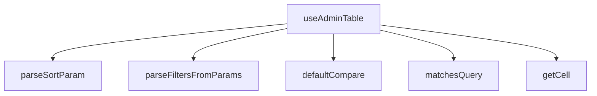

## Genel Bakış
`useAdminTable`, admin panellerindeki tabloların durum yönetimi için tasarlanmış bir React custom hook modülüdür. URL parametrelerinden sıralama ve filtreleme bilgilerini parse eder, tablo hücrelerine erişimi standartlaştırır ve arama/filtreleme mantığını merkezileştirir.

## Fonksiyon Grupları

### Hücre Erişim Yardımcıları
Tablo satırlarındaki hücre değerlerine dinamik olarak erişim sağlayan yardımcı fonksiyonları barındırır.
- `getCell`

### Sıralama Mantığı
Varsayılan karşılaştırma fonksiyonu ve URL'den gelen sıralama parametrelerinin parse edilmesini yönetir. `useAdminTable` hook'u tarafından sıralama durumunu başlatmak için kullanılır.
- `defaultCompare`, `parseSortParam`

### Filtreleme ve Arama
Satırların arama sorgusuyla eşleşip eşleşmediğini kontrol eder ve URLSearchParams objesinden filtre değerlerini çıkarır. Hook'un iç filtreleme mantığının temelini oluşturur.
- `matchesQuery`, `parseFiltersFromParams`

### Ana Hook (Orkestratör)
Tüm yardımcı fonksiyonları bir araya getirerek tablonun sıralama, filtreleme, sayfalama ve hücre erişim durumunu tek bir接口 üzerinden sunar. Dış bağımlılık olarak React ve Next.js'in `useSearchParams` hook'una ihtiyaç duyar.
- `useAdminTable`

---

## AXIOMS – Mimari Varsayımlar
- Bu modül davranışsal mantık içermez (salt veri / konfigürasyon / tip tanımı).
- [Aksiyom 1]: Modülün dışa açtığı yapı (anahtar kümesi / şema) bir sözleşmedir; tüketiciler bu sabit yapıya bağlıdır — kırıcı değişiklik tüm tüketicileri etkiler.
- [Aksiyom 2]: Bir öğe ekleme/çıkarma yapısal-uyumlu olmalı; ilgili tipler ve seçiciler aynı commit'te güncel tutulmalıdır.

---

## FONKSİYON DETAYLARI

### getCell
**Ne yapar**: Belirtilen satır nesnesinden (T türünde) verilen kolon anahtarına karşılık gelen hücre değerini döndürür.
**Nasıl yapar**: Satır nesnesini `Record<string, unknown>` türüne dönüştürerek anahtar erişimini sağlar. Bu, generic bir satır tipinden dinamik olarak alan değerlerini almayı kolaylaştırır.
**Parametreler**:
- row: T — Hücre değeri alınacak satır nesnesi.
- key: string — Alınacak değerin anahtarı (kolon adı).
**Dönüş**: unknown — Anahtarın karşılık geldiği değer; tür dönüşümü yapılmış veya tanımsız olabilir.

### defaultCompare
**Ne yapar**: İki bilinmeyen tipdeki değeri karşılaştırarak sıralama için sayısal bir sonuç üretir.
**Nasıl yapar**: Önce null değerlerin önceliğini belirler, ardından her iki değer de sayıysa aritmetik farkı döndürür. Aksi halde, her iki değeri de dizeye dönüştürerek Türkçe karakter duyarlı bir karşılaştırma (localeCompare) yapar.
**Parametreler**:
- a: unknown — Karşılaştırılacak ilk değer.
- b: unknown — Karşılaştırılacak ikinci değer.
**Dönüş**: number — İlk değer ikinci değerden küçükse negatif, büyükse pozitif, eşitlerse sıfır.

### matchesQuery
**Ne yapar**: Satır nesnesindeki herhangi bir dize değerinin, verilen küçük harf arama dizesini (needleLower) içerip içermediğini kontrol eder.
**Nasıl yapar**: Satır nesnesinin tüm değerlerini Iterate eder; değer bir dize ise, küçük harfe dönüştürüp arama dizesini içerip içermediğini kontrol eder. İlk eşleşmeyi bulursa `true` döner, aksi halde `false` döner.
**Parametreler**:
- row: T — Arama yapılacak satır nesnesi.
- needleLower: string — Küçük harfe dönüştürülmüş arama dizesi.
**Dönüş**: boolean — Satırdaki herhangi bir dize alanının arama dizesini içerip içermediği.

### parseSortParam
**Ne yapar**: Ham bir sıralama parametre dizesini (`"key:dir"` formatında) `SortState` nesnesine dönüştürür.
**Nasıl yapar**: Girdi dizesini `:` karakterine göre böler. İlk parça `key` olarak, ikinci parça `dir` olarak işlenir. `dir` `"desc"` ise `"desc"`, aksi halde `"asc"` olarak ayarlanır. Geçersiz girdiler için `null` döner.
**Parametreler**:
- raw: string | null — Ham sıralama parametresi (örn: `"name:desc"`).
**Dönüş**: SortState | null — `{ key: string, dir: 'asc' | 'desc' }` yapısında sıralama durumu veya ayrıştırılamazsa `null`.

### parseFiltersFromParams
**Ne yapar**: URL arama parametrelerinden (URLSearchParams) filtre parametrelerini ayrıştırarak `Record<string, string[]>` formatına dönüştürür.
**Nasıl yapar**: Tüm parametreleri iterasyonla gezer; reserved parametreleri (`RESERVED_PARAMS` kümesinde tanımlı) ve boş değerleri atlar. Kalan parametre değerlerini virgülle ayırarak diziye dönüştürür ve anahtar-değer çiftlerini nesneye ekler.
**Parametreler**:
- params: URLSearchParams — Ayrıştırılacak URL arama parametreleri.
**Dönüş**: Record<string, string[]> — Her bir filtre anahtarı için seçili değerlerin dizisi.

### useAdminTable
**Ne yapar**: Admin tabloları için gelişmiş bir veri yönetimi, sıralama, filtreleme, sayfalama ve seçim durumu sunan bir React hook'u.
**Nasıl yapar**: Verilen seçeneklere göre (`UseAdminTableOptions<T>`) URL ile senkronize state'ler (sayfa, sıralama, arama, filtreler) yönetir. `paginationMode` ve `sortMode` değerlerine göre veri çekme stratejisini (sunucu veya istemci) belirler. Hook, veri çekme, debounce arama, istemci taraflı filtreleme/sıralama, URL yazma/okuma ve satır seçim mantığını içeren bir dizi state ve callback döndürür. Hatalı mod kombinasyonları için konsol hataları üretir.
**Parametreler**:
- options: UseAdminTableOptions<T> — Hook için yapılandırma seçenekleri (resource, rowId, fetcher, pageSize, paginationMode, sortMode, initialSort, syncUrl, debounceMs).
**Dönüş**: UseAdminTableResult<T> — rows, totalMatched, isLoading, error, reload, fetchAllForExport, pagination, sorting, filtering, selection property'lerini içeren nesne.

---

## INTERFACES

### SortState
- `key: string`
- `dir: TableSortDir`

### FetchParams
fetcher'a geçen normalize parametreler.
- `page: number`
- `pageSize: number`
- `sort: SortState | null`
- `query: string`
- `filters: Record<string, string[]>`

### FetchResult
fetcher sözleşmesi — İKİ-TOTAL [ADV-1#1]: - `totalMatched`: client-süzme SONRASI görünür-eşleşme toplamı (pageCount kaynağı). - `rows`: server-mode'da zaten süzülmüş+sayfalanmış satırlar.
- `rows: T[]`
- `totalMatched: number`

### UseAdminTableOptions
- `resource: string`
- `rowId: (r: T) => string`
- `fetcher: (supabase: SupabaseClient<Database>, params: FetchParams) => Promise<FetchResult<T>>`
- `pageSize?: number`
- `paginationMode?: AdminMode`
- `sortMode?: AdminMode`
- `initialSort?: SortState`
- `syncUrl?: boolean`
- `debounceMs?: number`

### PaginationApi
- `page: number`
- `pageSize: number`
- `pageCount: number`
- `setPage: (p: number) => void`
- `setPageSize: (n: number) => void`

### SortingApi
- `sort: SortState | null`
- `toggleSort: (key: string) => void`

### FilteringApi
- `query: string`
- `setQuery: (q: string) => void`
- `filters: Record<string, string[]>`
- `setFilter: (facetKey: string, values: string[]) => void`
- `clearAll: () => void`
- `hasActiveFilters: boolean`

### SelectionApi
- `selectedIds: string[]`
- `isSelected: (id: string) => boolean`
- `toggle: (id: string, opts?: { shiftKey?: boolean }) => void`
- `toggleAll: () => void`
- `clear: () => void`
- `allSelected: boolean`

### UseAdminTableResult
- `rows: T[]`
- `totalMatched: number`
- `isLoading: boolean`
- `error: string | null`
- `reload: () => Promise<void>`
- `fetchAllForExport: () => Promise<T[]>`
- `pagination: PaginationApi`
- `sorting: SortingApi`
- `filtering: FilteringApi`
- `selection: SelectionApi`

---

## TYPE ALIASES

### AdminMode
```typescript
type AdminMode = 'server' | 'client' | 'none'
```

---

## SABİTLER
- **RESERVED_PARAMS** (new_expression) — `new Set(['page', 'sort', 'q'])`

---

## AST POINTERS

### [N1_NASIL] AST Pointer: C:\Users\alize\venthub-hvac\src\hooks\useAdminTable.ts::getCell
- **params**: `(row: T, key: string)`
- **ic_degiskenler**:
  - `row` — erişilecek nesne
  - `key` — erişim anahtarı
- **Dönüş**: `unknown` — belirtilen anahtarın değeri

### [N2_NASIL] AST Pointer: C:\Users\alize\venthub-hvac\src\hooks\useAdminTable.ts::defaultCompare
- **params**: `(a: unknown, b: unknown)`
- **ic_degiskenler**:
  - `a` — birinci karşılaştırma değeri
  - `b` — ikinci karşılaştırma değeri
- **Dönüş**: `number` — karşılaştırma sonucu (-1, 0, 1)

### [N3_NASIL] AST Pointer: C:\Users\alize\venthub-hvac\src\hooks\useAdminTable.ts::matchesQuery
- **params**: `(row: T, needleLower: string)`
- **ic_degiskenler**:
  - `row` — arama yapılacak satır
  - `needleLower` — küçük harfe dönüştürülmüş arama metni
  - `v` — satır değerleri iterasyon değişkeni
- **Dönüş**: `boolean` — eşleşme durumu

### [N4_NASIL] AST Pointer: C:\Users\alize\venthub-hvac\src\hooks\useAdminTable.ts::parseSortParam
- **params**: `(raw: string | null)`
- **ic_degiskenler**:
  - `raw` — ham URL sıralama parametresi
  - `key` — sıralama alanı adı
  - `dir` — sıralama yönü (asc/desc)
- **Dönüş**: `SortState | null` — ayrıştırılmış sıralama durumu veya null

### [N5_NASIL] AST Pointer: C:\Users\alize\venthub-hvac\src\hooks\useAdminTable.ts::parseFiltersFromParams
- **params**: `(params: URLSearchParams)`
- **ic_degiskenler**:
  - `params` — URLSearchParams nesnesi
  - `out` — sonuç filtre sözlüğü
  - `k` — filtre anahtarı (destructure)
  - `v` — filtre değeri (destructure)
- **Dönüş**: `Record<string, string[]>` — filtre sözlüğü

### [N6_NASIL] AST Pointer: C:\Users\alize\venthub-hvac\src\hooks\useAdminTable.ts::useAdminTable
- **params**: `(options: UseAdminTableOptions<T>)`
- **ic_degiskenler**:
  - `resource` — API kaynak adı (options'dan)
  - `rowId` — satır ID çıkaran fonksiyon (options'dan)
  - `fetcher` — veri çekme fonksiyonu (options'dan)
  - `pageSizeOpt` — varsayılan sayfa boyutu (options'dan, varsayılan: 50)
  - `paginationMode` — sayfalama modu (options'dan, varsayılan: 'server')
  - `sortMode` — sıralama modu (options'dan, varsayılan: 'server')
  - `initialSort` — başlangıç sıralaması (options'dan)
  - `syncUrl` — URL senkronizasyonu (options'dan, varsayılan: true)
  - `debounceMs` – arama gecikme süresi (options'dan, varsayılan: 300)
  - `searchParams` — URL arama parametreleri (useSearchParams hook)
  - `router` – Next.js router (useRouter hook)
  - `pathname` — mevcut URL yolu (usePathname hook)
  - `fetcherRef` — fetcher referansı (useRef)
  - `rowIdRef` – rowId referansı (useRef)
  - `page` – mevcut sayfa numarası (useState)
  - `setPageRaw` – sayfa state setter'ı (useState)
  - `pageSize` – sayfa boyutu (useState)
  - `setPageSize` – sayfa boyutu setter'ı (useState)
  - `sort` – sıralama durumu (useState)
  - `setSort` – sıralama setter'ı (useState)
  - `query` – arama sorgusu (useState)
  - `setQueryRaw` – sorgu setter'ı (useState)
  - `debouncedQuery` – geciktirilmiş arama sorgusu (useState)
  - `setDebouncedQuery` – geciktirilmiş sorgu setter'ı (useState)
  - `filters` – filtre sözlüğü (useState)
  - `setFilters` – filtre setter'ı (useState)
  - `rawRows` – ham satır verileri (useState)
  - `serverTotal` – sunucu toplam eşleşme sayısı (useState)
  - `isLoading` – yükleme durumu (useState)
  - `error` – hata mesajı (useState)
  - `selectedIds` – seçili satır ID'leri (useState)
  - `lastIndexRef` – son seçim indeksi referansı (useRef)
  - `effPage` – etkin sayfa (sayfalama moduna göre)
  - `effSortKey` – etkin sıralama alanı (sıralama moduna göre)
  - `effSortDir` – etkin sıralama yönü (sıralama moduna göre)
  - `effQuery` – etkin sorgu (sayfalama moduna göre)
  - `effFiltersKey` – etkin filtre anahtarı (sayfalama moduna göre)
  - `serverParams` – sunucu istek parametreleri (useMemo)
  - `doFetch` – veri çekme fonksiyonu (useCallback)
  - `processedRows` – işlenmiş satırlar (useMemo)
  - `totalMatched` – toplam eşleşme sayısı
  - `pageCount` – toplam sayfa sayısı
  - `rows` – sayfalanmış satırlar (useMemo)
  - `lastUrlRef` – son URL referansı (useRef)
  - `buildQuery` – URL sorgu oluşturma fonksiyonu (useCallback)
  - `setPage` – sayfa değiştirme fonksiyonu (useCallback)
  - `setQuery` – sorgu değiştirme fonksiyonu (useCallback)
  - `setFilter` – filtre değiştirme fonksiyonu (useCallback)
  - `clearAll` – tüm filtreleri temizleme fonksiyonu (useCallback)
  - `hasActiveFilters` – aktif filtre durumu (useMemo)
  - `toggleSort` – sıralama değiştirme fonksiyonu (useCallback)
  - `rowsRef` – rows referansı (useRef)
  – `toggle` – tek satır seçim/de-seçim (useCallback)
  - `toggleAll` – tüm satırları seç/de-seç (useCallback)
  - `clear` – seçimi temizleme fonksiyonu (useCallback)
  - `isSelected` – ID kontrolü (useCallback)
  - `allSelected` – tüm sayfa seçili mi
  - `selectedIdsArr` – seçili ID dizisi (useMemo)
  - `reload` – yeniden yükleme (useCallback)
  - `fetchAllForExport` – dışa aktarım için tüm veriyi çekme (useCallback)
- **Dönüş**: `UseAdminTableResult<T>` — hook sonucu (satır verileri, sayfalama, sıralama, filtreleme, seçim, yükleme durumu)

---


## MERMAID CALL GRAPH


## NODE ID STANDARD

  file: src\hooks\useAdminTable.ts
  function: src\hooks\useAdminTable.ts::getCell
  function: src\hooks\useAdminTable.ts::defaultCompare
  function: src\hooks\useAdminTable.ts::matchesQuery
  function: src\hooks\useAdminTable.ts::parseSortParam
  function: src\hooks\useAdminTable.ts::parseFiltersFromParams
  function: src\hooks\useAdminTable.ts::useAdminTable

---

## DISA AKTARILANLAR (EXPORTS)
  export: AdminMode
  export: FetchParams
  export: FetchResult
  export: FilteringApi
  export: PaginationApi
  export: SelectionApi
  export: SortState
  export: SortingApi
  export: UseAdminTableOptions
  export: UseAdminTableResult
  export: defaultCompare
  export: getCell
  export: matchesQuery
  export: parseFiltersFromParams
  export: parseSortParam
  export: useAdminTable