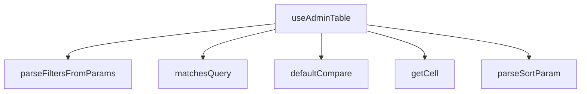

## Genel Bakış
`useAdminTable`, admin panellerindeki tablo bileşenlerinin sıralama, filtreleme, arama ve hücre erişim mantığını merkezi olarak yöneten bir React custom hook modülüdür. URL parametreleri ile senkronize çalışarak tablo durumunun tarayıcı geçmişine bağlanmasını sağlar. Modül,;jenerik yapıda tasarlanmış olup farklı veri türleriyle çalışabilir.

## Fonksiyon Grupları

### Hücre Erişim Yardımcıları
Tablo satırlarındaki hücre değerlerinehiyerarşik veya düz anahtar yapısıyla güvenli erişim sağlar.
- `getCell`

### Sıralama Altyapısı
Varsayılan karşılaştırma mantığını ve URL'den gelen sıralama parametrelerinin ayrıştırılmasını kapsar. Sıralama durumunun başlangıç değerlerini oluşturmak için kullanılır.
- `defaultCompare`, `parseSortParam`

### Filtreleme ve Arama Mantığı
Satırların arama sorgusuyla eşleşip eşleşmediğini kontrol eder ve URLSearchParams objesinden filtre değerlerini çıkarır. Hook'un iç arama/filtreleme mantığının temel taşlarını oluşturur.
- `matchesQuery`, `parseFiltersFromParams`

### Ana Orkestratör Hook
Tüm yardımcı fonksiyonları bir araya getirerek tablonun sıralama, filtreleme, sayfalama ve hücre erişim durumunu tek bir arayüz üzerinden sunar. React state yönetimi ve Next.js `useSearchParams` entegrasyonunu yönetir.
- `useAdminTable`

## Bağımlılıklar
Modül, React'ın `useState`, `useMemo` ve `useCallback` hook'larına doğrudan bağımlıdır. Dinamik olarak Next.js'in `useSearchParams` hook'unu yükler ve URL durumuyla senkronizasyon sağlar. Dışarıya sadece tip tanımları (UseAdminTableOptions, UseAdminTableResult, SortState) açar.

---

## AXIOMS – Mimari Varsayımlar

Bu modül, URL tabanlı tablo durum yönetimi sağlamakla sorumludur. Aşağıdaki mimari varsayımlar, fonksiyon imzalarından türetilmiştir.

---

[Aksiyom 1]: Eğer `getCell` çağrılırken `key` parametresi, `row` nesnesinde mevcut olmayan bir özelliği belirtiyorsa, fonksiyon `undefined` döner.

[Aksiyom 2]: Eğer `parseSortParam` fonksiyonuna geçilen `raw` string'i geçerli bir sıralama formatına uymuyorsa, fonksiyon `null` döner ve geçersiz sıralamareq'i sessizce reddedilir.

[Aksiyom 3]: Eğer `matchesQuery` fonksiyonuna geçirilen `needleLower` parametresi **lowercase (küçük harf)** formatında değilse, büyük/küçük harf duyarsız arama doğru çalışmayabilir. Bu değerin调用前 lowercased olması varsayılmaktadır.

[Aksiyom 4]: Eğer `parseFiltersFromParams` fonksiyonuna geçirilen `URLSearchParams` nesnesi `RESERVED_PARAMS` listesindeki parametreleri içeriyorsa, bu parametreler filtre olarak parse edilmemelidir (aksi halde sıralama sayfası navigasyonu bozulabilir).

[Aksiyom 5]: Eğer `defaultCompare` fonksiyonuna geçirilen `a` ve `b` değerleri karşılaştırılamayan (incomparable) türde ise, dönüş değeri tutarsız olabilir; bu fonksiyonun sayısal veya string değerler için tasarlandığı varsayılmaktadır.

[Aksiyom 6]: Eğer `useAdminTable` hook'u, opsiyonlar aracılığıyla bir `sortParam` veya `filterParams` belirtmiyorsa, bu durum URL parametrelerinden çıkarılacak veya varsayılan değerler atanacaktır — hook her halükarda çalışır durumda olmalıdır.

---

**Not:** Fonksiyon gövdelerine erişim olmadığından, `SortState` yapısının içeriği ve filtre parse formatı hakkında kesin bilgi üretilememiştir.

---

## FONKSİYON DETAYLARI

### getCell

**Ne yapar**: Verilen bir satır (row) nesnesinde, belirtilen anahtara (key) karşılık gelen değeri döndürür. Bu fonksiyon, client-mode'da kolon ve facet anahtarlarının satır üzerindeki property'lerine dinamik erişim sağlamak için kullanılır. Jeśli belirtilen key mevcut değilse `undefined` döner.

**Nasıl yapar**: Fonksiyon, jenerik `T` tipindeki row nesnesini `Record<string, unknown>` tipine cast ederek `(row as Record<string, unknown>)[key]` biçiminde dinamik property erişimi gerçekleştirir. Bu sayede Herhangi bir nesnenin string anahtarlı değerine tip-güvenli olmayan ama esnek bir erişim sağlanmış olur.

**Parametreler**:
- `row`: `T` — Erişilecek değeri içeren satır nesnesi. Genellikle tablonun bir satırını temsil eden bir veri nesnesidir.
- `key`: `string` — Erişilmek istenen property'nin anahtarı. Kolon veya facet tanımlayıcısı olarak kullanılır.

**Dönüş**: `unknown` — Belirtilen anahtarın değeri. Anahtar mevcut değilse `undefined` döner.

### defaultCompare
**Ne yapar**: İki bilinmeyen tipdeki değeri karşılaştırarak sıralama için sayısal bir sonuç üretir.
**Nasıl yapar**: Önce null değerlerin önceliğini belirler, ardından her iki değer de sayıysa aritmetik farkı döndürür. Aksi halde, her iki değeri de dizeye dönüştürerek Türkçe karakter duyarlı bir karşılaştırma (localeCompare) yapar.
**Parametreler**:
- a: unknown — Karşılaştırılacak ilk değer.
- b: unknown — Karşılaştırılacak ikinci değer.
**Dönüş**: number — İlk değer ikinci değerden küçükse negatif, büyükse pozitif, eşitlerse sıfır.

### matchesQuery
**Ne yapar**: Satır nesnesindeki herhangi bir dize değerinin, verilen küçük harf arama dizesini (needleLower) içerip içermediğini kontrol eder.
**Nasıl yapar**: Satır nesnesinin tüm değerlerini Iterate eder; değer bir dize ise, küçük harfe dönüştürüp arama dizesini içerip içermediğini kontrol eder. İlk eşleşmeyi bulursa `true` döner, aksi halde `false` döner.
**Parametreler**:
- row: T — Arama yapılacak satır nesnesi.
- needleLower: string — Küçük harfe dönüştürülmüş arama dizesi.
**Dönüş**: boolean — Satırdaki herhangi bir dize alanının arama dizesini içerip içermediği.

### parseSortParam
**Ne yapar**: Ham bir sıralama parametre dizesini (`"key:dir"` formatında) `SortState` nesnesine dönüştürür.
**Nasıl yapar**: Girdi dizesini `:` karakterine göre böler. İlk parça `key` olarak, ikinci parça `dir` olarak işlenir. `dir` `"desc"` ise `"desc"`, aksi halde `"asc"` olarak ayarlanır. Geçersiz girdiler için `null` döner.
**Parametreler**:
- raw: string | null — Ham sıralama parametresi (örn: `"name:desc"`).
**Dönüş**: SortState | null — `{ key: string, dir: 'asc' | 'desc' }` yapısında sıralama durumu veya ayrıştırılamazsa `null`.

### parseFiltersFromParams
**Ne yapar**: URL arama parametrelerinden (URLSearchParams) filtre parametrelerini ayrıştırarak `Record<string, string[]>` formatına dönüştürür.
**Nasıl yapar**: Tüm parametreleri iterasyonla gezer; reserved parametreleri (`RESERVED_PARAMS` kümesinde tanımlı) ve boş değerleri atlar. Kalan parametre değerlerini virgülle ayırarak diziye dönüştürür ve anahtar-değer çiftlerini nesneye ekler.
**Parametreler**:
- params: URLSearchParams — Ayrıştırılacak URL arama parametreleri.
**Dönüş**: Record<string, string[]> — Her bir filtre anahtarı için seçili değerlerin dizisi.

### useAdminTable

**Ne yapar**: Admin tabloları için kapsamlı durum yönetimi sağlayan özel bir React hook'udur. Sayfalama, sıralama, filtreleme, arama, satır seçimi ve URL senkronizasyonu gibi tablonun tüm temel özelliklerini tek bir hook üzerinden merkezi olarak yönetir. Hem sunucu taraflı (server) hem istemci taraflı (client) hem de sayfalamasız (none) modlarda çalışabilir.

**Nasıl yapar**: Fonksiyon, Next.js'in `useSearchParams`, `useRouter` ve `usePathname` hook'larını kullanarak URL durumu ile tablo durumu arasında iki yönlü senkronizasyon kurar. `syncUrl` seçeneği aktif olduğunda, URL parametrelerinden (`page`, `sort`, `q`, filtreler) başlangıç durumu lazy olarak okunur (seed); durum değişiklikleri ise `router.replace` ile URL'e yazılır (ham history manipülasyonu yapılmaz). `useEffect` içindeki bir kontrol, yasak kombinasyonları (sunucu sayfalama + istemci sıralama veya istemci sayfalama + sunucu sıralama) geliştirici konsoluna uyarı basarak sessiz hataları önler. `fetcher` ve `rowId` callback'leri `useRef` ile sarılarak fetch bağımlılık dizisine girme ve gereksiz yeniden çekme döngüsü engellenir. Arama girdisi, `debounceMs` milisaniye gecikmeyle debounce edilerek sunucu istek sayısını azaltır. Sunucu modunda, sırf alakalı parametre değişikliğinde (`useMemo` ile hesaplanan `serverParams`) fetch tetiklenir; istemci modunda ise tüm işleme (arama → filtre → sıralama) `useMemo` içinde `processedRows` olarak hesaplanır ve sadece geçerli sayfa dilimi döndürülür. Seçim mekanizması, `Set<string>` tabanlı olup `shiftKey` desteği ile aralık seçimini mevcut sayfa satırları üzerinde `lastIndexRef` ile çapraz referans kullanarak gerçekleştirir. `fetchAllForExport` metodu, sunucu modunda tüm eşleşen kayıtları tek seferde çekerek dışa aktarma senaryosunu destekler.

**Parametreler**:
- `options: UseAdminTableOptions<T>` — Hook'un tüm yapılandırma seçeneklerini içeren nesne. Aşağıdaki alt özelliklerin hepsini barındırır.
  - `resource: string` — Tablonun kaynak adı. Konsol uyarılarında ve hata tanımlarında tanımlayıcı olarak kullanılır.
  - `rowId: (row: T) => string` — Her satır nesnesinden benzersiz bir kimlik stringi üreten fonksiyon. Seçim seti, satır eşleme ve geçinme (anchor) mantığı bu fonksiyonun döndüğü değere bağlıdır.
  - `fetcher: (client: SupabaseClient, params: FetchParams) => Promise<{ rows: T[]; totalMatched: number }>` — Sunucudan veri çeken asenkron fonksiyon. Supabase istemcisi ve sayfalama/sıralama/filtre parametrelerini alıp satır dizisi ve toplam eşleşme sayısını döndürür. `useRef` ile sarılarak bağımlılık döngüsü önlenir.
  - `pageSize: number` — Sayfa başına satır sayısı (varsayılan: `50`). Hem sunucu hem istemci sayfalama modunda dilimleme için kullanılır.
  - `paginationMode: 'server' | 'client' | 'none'` — Sayfalama stratejisi (varsayılan: `'server'`). `'server'`da sunucu paginasyonu, `'client'`da tüm veri çekip istemci dilimleme, `'none'`da sayfalama devre dışıdır.
  - `sortMode: 'server' | 'client' | 'none'` — Sıralama stratejisi (varsayılan: `'server'`). Sunucu modunda sıralama parametreleri fetcher'a iletilir, istemci modunda `defaultCompare` ile `processedRows` üzerinde sıralanır.
  - `initialSort: SortState | null` — Başlangıç sıralama durumu. URL senkronizasyonu devre dışıyken veya URL'de sıralama parametresi olmadığında kullanılır.
  - `syncUrl: boolean` — Tablo durumunun URL parametrelerine senkronize edilip edilmeyeceği (varsayılan: `true`). Aktifken sayfa, sıralama, arama ve filtre durumları URL'e yazılır; geri/ileri tuşu ile URL değişikliklerinden durum geri yüklenir.
  - `debounceMs: number` — Arama girdisi için debounce gecikme süresi milisaniye cinsinden (varsayılan: `300`). Arama inputu her değiştiğinde bu süre kadar bekleyip tetikleme yapar.
  - `initialFilters: Record<string, string[]>` — Başlangıç filtre değerleri. Anahtarlar filtre alanı adları, değerler ise seçili seçeneklerin dizileridir. URL senkronizasyonu devre dışıyken veya URL'de filtre yokken kullanılır.

**Dönüş**: `UseAdminTableResult<T>` — Tablonun tüm durumunu ve kontrol fonksiyonlarını içeren nesne. İçeriği şu alt nesnelerden oluşur:
- `rows: T[]` — Görüntülenen (geçerli sayfadaki) satırlar. Sunucu modunda doğrudan `rawRows`, istemci modunda filtrelenmiş ve sıralanmış diziden dilimlenmiş sayfa, none modunda tüm işlenmiş satırlar.
- `allRows: T[]` — Sunucu modunda geçerli sayfadaki satırlar (`rows` ile aynı), istemci ve none modlarında ham çekilen tüm satırlar (`rawRows`).
- `totalMatched: number` — Filtre/arama sonrası eşleşen toplam satır sayısı. Sunucu modunda sunucudan gelen `totalMatched`, istemci modunda `processedRows.length`.
- `isLoading: boolean` — Veri çekme işlemi devam ediyorsa `true`.
- `error: string | null` — Son fetch işleminde oluştuysa hata mesajı, başarılıysa `null`.
- `reload: () => Promise<void>` — Mevcut parametrelerle veriyi yeniden çeker.
- `fetchAllForExport: () => Promise<T[]>` — Sunucu modunda tüm eşleşen kayıtları tek istekte çeker; istemci/none modunda zaten mevcut olan `processedRows`'u döndürür. Dışa aktarma (export) senaryoları için tasarlanmıştır.
- `pagination: { page: number; pageSize: number; pageCount: number; setPage: (p: number) => void; setPageSize: (s: number) => void }` — Sayfalama durumu ve kontrol fonksiyonları. `pageCount` toplam sayfa sayısını; `setPage` geçerli sayfayı ayarlar ve 1'den küçük değerlere izin vermez.
- `sorting: { sort: SortState | null; toggleSort: (key: string) => void }` — Sıralama durumu ve kontrol fonksiyonları. `toggleSort` aynı sütuna tekrar basıldığında yönü tersine çevirir; farklı sütuna basıldığında artan sıralama ile başlar. `sortMode` `'none'` ise fonksiyon hiçbir şey yapmaz.
- `filtering: { query: string; setQuery: (q: string) => void; filters: Record<string, string[]>; setFilter: (facetKey: string, values: string[]) => void; clearAll: () => void; hasActiveFilters: boolean }` — Filtreleme durumu ve kontrol fonksiyonları. `setQuery` debounce edilmiş arama girdisini yönetir; `setFilter` belirli bir faceted alanı ayarlar ve sayfayı 1'e döndürür; `clearAll` tüm arama ve filtreleri sıfırlar; `hasActiveFilters` herhangi bir aktif filtre veya arama olup olmadığını belirtir.
- `selection: { selectedIds: string[]; isSelected: (id: string) => boolean; toggle: (id: string, opts?: { shiftKey?: boolean }) => void; toggleAll: () => void; clear: () => void; allSelected: boolean }` — Satır seçim durumu ve kontrol fonksiyonları. `toggle` normal tıklamada tek satır seçimini değiştirir; `shiftKey: true` seçeneğinde ise son ankordan (lastIndex) mevcut indeks arasındaki tüm satırları ekler. `toggleAll` mevcut sayfadaki tüm satırları seçer veya seçimini kaldırır (mevcut sayfada hepsi seçiliyse kaldırır). `allSelected` mevcut sayfadaki tüm satırların seçili olup olmadığını belirtir. `clear` tüm seçimleri sıfırlar.

---

## İTHALATLAR (IMPORTS)
- import: ../i18n/I18nProvider::useI18n
- import: @/lib/supabase/client::supabaseBrowserClient
- import: @/types/admin-shared::type { TableSortDir }
- import: @/types/database.types::type { Database }
- import: @supabase/supabase-js::type { SupabaseClient }
- import: next/navigation::usePathname
- import: next/navigation::useRouter
- import: next/navigation::useSearchParams
- import: react::useCallback
- import: react::useEffect
- import: react::useMemo
- import: react::useRef
- import: react::useState

---

## INTERFACES

### SortState
- `key: string`
- `dir: TableSortDir`

### FetchParams
fetcher'a geçen normalize parametreler.
- `page: number`
- `pageSize: number`
- `sort: SortState | null`
- `query: string`
- `filters: Record<string, string[]>`

### FetchResult
fetcher sözleşmesi — İKİ-TOTAL [ADV-1#1]: - `totalMatched`: client-süzme SONRASI görünür-eşleşme toplamı (pageCount kaynağı). - `rows`: server-mode'da zaten süzülmüş+sayfalanmış satırlar.
- `rows: T[]`
- `totalMatched: number`

### UseAdminTableOptions
- `resource: string`
- `rowId: (r: T) => string`
- `fetcher: (supabase: SupabaseClient<Database>, params: FetchParams) => Promise<FetchResult<T>>`
- `pageSize?: number`
- `paginationMode?: AdminMode`
- `sortMode?: AdminMode`
- `initialSort?: SortState`
- `syncUrl?: boolean`
- `debounceMs?: number`
- `initialFilters?: Record<string, string[]>`

### PaginationApi
- `page: number`
- `pageSize: number`
- `pageCount: number`
- `setPage: (p: number) => void`
- `setPageSize: (n: number) => void`

### SortingApi
- `sort: SortState | null`
- `toggleSort: (key: string) => void`

### FilteringApi
- `query: string`
- `setQuery: (q: string) => void`
- `filters: Record<string, string[]>`
- `setFilter: (facetKey: string, values: string[]) => void`
- `clearAll: () => void`
- `hasActiveFilters: boolean`

### SelectionApi
- `selectedIds: string[]`
- `isSelected: (id: string) => boolean`
- `toggle: (id: string, opts?: { shiftKey?: boolean }) => void`
- `toggleAll: () => void`
- `clear: () => void`
- `allSelected: boolean`

### UseAdminTableResult
- `rows: T[]`
- `allRows: T[]`
- `totalMatched: number`
- `isLoading: boolean`
- `error: string | null`
- `reload: () => Promise<void>`
- `fetchAllForExport: () => Promise<T[]>`
- `pagination: PaginationApi`
- `sorting: SortingApi`
- `filtering: FilteringApi`
- `selection: SelectionApi`

---

## TYPE ALIASES

### AdminMode
```typescript
type AdminMode = 'server' | 'client' | 'none'
```

---

## SABİTLER
- **RESERVED_PARAMS** (new_expression) — `new Set(['page', 'sort', 'q'])`

---

## AST POINTERS

### [N1_NASIL] AST Pointer: src/hooks/useAdminTable.ts::getCell
- **params**: `(row: T, key: string)`
- **ic_degiskenler**:
  - `row` — Satır verisi, generic T tipinde
  - `key` — Erişilecek özelliğin anahtarı
- **Dönüş**: `unknown` — row objesinin belirtilen key'ine karşılık gelen değer

### [N2_NASIL] AST Pointer: src/hooks/useAdminTable.ts::defaultCompare
- **params**: `(a: unknown, b: unknown)`
- **ic_degiskenler**:
  - `a` — Birinci karşılaştırma değeri
  - `b` — İkinci karşılaştırma değeri
- **Dönüş**: `number` — Sıralama için negatif/sıfır/pozitif sonuç

### [N3_NASIL] AST Pointer: src/hooks/useAdminTable.ts::matchesQuery
- **params**: `(row: T, needleLower: string)`
- **ic_degiskenler**:
  - `row` — Satır verisi, generic T tipinde
  - `needleLower` — Küçük harfe çevrilmiş arama terimi
  - `v` — Satırın değerlerinin her biri (Object.values iterasyonundan)
- **Dönüş**: `boolean` — Arama terimi satırın herhangi bir alanında bulunuyorsa true

### [N4_NASIL] AST Pointer: src/hooks/useAdminTable.ts::parseSortParam
- **params**: `(raw: string | null)`
- **ic_degiskenler**:
  - `raw` — Ham sıralama parametresi (ör: "created_at:desc")
  - `key` — Sıralanacak sütun adı (split sonucu)
  - `dir` — Sıralama yönü (asc veya desc)
- **Dönüş**: `SortState | null` — Geçerli sıralama durumu veya null

### [N5_NASIL] AST Pointer: src/hooks/useAdminTable.ts::parseFiltersFromParams
- **params**: `(params: URLSearchParams)`
- **ic_degiskenler**:
  - `params` — URL arama parametreleri
  - `out` — Filtre sonuçlarını tutan nesne (Record<string, string[]>)
  - `k` — Her bir parametre anahtarı (URLSearchParams iterasyonundan)
  - `v` — Her bir parametre değeri (URLSearchParams iterasyonundan)
- **Dönüş**: `Record<string, string[]>` — Filtrelerin anahtar-değer çiftleri olarak parsed hali

### [N6_NASIL] AST Pointer: src/hooks/useAdminTable.ts::useAdminTable
- **params**: `(options: UseAdminTableOptions<T>)`
- **ic_degiskenler**:
  - `t` — useI18n hook'undan çeviri fonksiyonu
  - `resource` — options'dan, veri kaynağı adı (tablo adı)
  - `rowId` — options'dan, satır ID'sini seçen fonksiyon
  - `fetcher` — options'dan, veri çekme fonksiyonu
  - `pageSizeOpt` — options'dan, sayfa boyutu (varsayılan 50)
  - `paginationMode` — options'dan, sayfalama modu ('server', 'client', 'none')
  - `sortMode` — options'dan, sıralama modu ('server', 'client', 'none')
  - `initialSort` — options'dan, başlangıç sıralama durumu
  - `syncUrl` — options'dan, URL ile senkronizasyon açma/kapama
  - `debounceMs` — options'dan, arama gecikme süresi (ms)
  - `initialFilters` — options'dan, başlangıç filtre değerleri
  - `searchParams` — useSearchParams() hook'undan URL parametreleri
  - `router` — useRouter() hook'undan Next.js yönlendirici
  - `pathname` — usePathname() hook'undan mevcut URL yolu
  - `fetcherRef` — fetcher fonksiyonunu ref ile saklayan referans
  - `rowIdRef` — rowId fonksiyonunu ref ile saklayan referans
  - `page` — Mevcut sayfa numarası state'i
  - `pageSize` — Sayfa boyutu state'i
  - `sort` — Sıralama durumu state'i (SortState | null)
  - `query` — Ham arama sorgusu state'i
  - `debouncedQuery` — Geciktirilmiş arama sorgusu state'i
  - `filters` — Filtre değerleri state'i (Record<string, string[]>)
  - `rawRows` — Ham satır verileri state'i (T[])
  - `serverTotal` — Sunucu tarafı toplam eşleşme sayısı state'i
  - `isLoading` — Yükleme durumu state'i
  - `error` — Hata mesajı state'i
  - `selectedIds` — Seçili satır ID'leri state'i (Set<string>)
  - `lastIndexRef` — Son tıklanan satır indeksi referansı
  - `effPage` — Etkin sayfa (paginationMode'a göre sayfa veya 1)
  - `effSortKey` — Etkin sıralama anahtarı (sortMode='server' ise)
  - `effSortDir` — Etkin sıralama yönü (sortMode='server' ise)
  - `effQuery` — Etkin arama sorgusu (paginationMode='server' ise)
  - `effFiltersKey` — Etkin filtrelerin JSON anahtarı (paginationMode='server' ise)
  - `serverParams` — Sunucu isteği parametreleri (useMemo ile hesaplanan)
  - `doFetch` — Veri çekme fonksiyonu (useCallback ile tanımlanmış)
  - `processedRows` — İşlenmiş satırlar (client-side filtreleme ve sıralama sonrası)
  - `totalMatched` — Toplam eşleşme sayısı (sunucu veya client moduna göre)
  - `pageCount` — Toplam sayfa sayısı
  - `rows` — Görüntülenecek satırlar (sayfalama uygulanmış hali)
  - `lastUrlRef` — Son yazılan URL referansı
  - `justWroteRef` — URL'ye yeni yazıldığını belirten flag referansı
  - `buildQuery` — URL query string oluşturma fonksiyonu
  - `setPage` — Sayfa değiştirme fonksiyonu
  - `setQuery` — Arama sorgusu değiştirme fonksiyonu
  - `setFilter` — Filtre değiştirme fonksiyonu
  - `clearAll` — Tüm filtre ve aramayı temizleme fonksiyonu
  - `hasActiveFilters` — Aktif filtre varsa true dönen memoized değer
  - `toggleSort` — Sıralama togggle fonksiyonu
  - `rowsRef` — rows state'ini ref ile saklayan referans
  - `toggle` — Tek satır seçim togggle fonksiyonu (shift-aralık desteği)
  - `toggleAll` — Tüm satırları seç/kaldır fonksiyonu
  - `clear` — Tüm seçimleri temizleme fonksiyonu
  - `isSelected` — Belirli bir satırın seçili olup olmadığını kontrol eden fonksiyon
  - `allSelected` — Tüm sayfadaki satırların seçili olup olmadığını belirleyen boolean
  - `selectedIdsArr` — Seçili ID'lerin array hali
  - `reload` — Veriyi yeniden çekme fonksiyonu
  - `fetchAllForExport` — Tüm veriyi dışa aktarma için çekme fonksiyonu
- **Dönüş**: `UseAdminTableResult<T>` — Admin tablosu için tüm state ve fonksiyonları içeren nesne

---


## MERMAID CALL GRAPH


## NODE ID STANDARD

  file: src\hooks\useAdminTable.ts
  function: src\hooks\useAdminTable.ts::getCell
  function: src\hooks\useAdminTable.ts::defaultCompare
  function: src\hooks\useAdminTable.ts::matchesQuery
  function: src\hooks\useAdminTable.ts::parseSortParam
  function: src\hooks\useAdminTable.ts::parseFiltersFromParams
  function: src\hooks\useAdminTable.ts::useAdminTable

---

## DISA AKTARILANLAR (EXPORTS)
  export: AdminMode
  export: FetchParams
  export: FetchResult
  export: FilteringApi
  export: PaginationApi
  export: SelectionApi
  export: SortState
  export: SortingApi
  export: UseAdminTableOptions
  export: UseAdminTableResult
  export: defaultCompare
  export: getCell
  export: matchesQuery
  export: parseFiltersFromParams
  export: parseSortParam
  export: useAdminTable