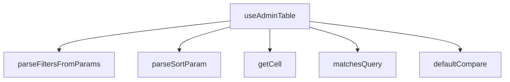

## Genel Bakış
Bu modül, admin panelinde kullanılan tablo bileşenleri için bir React hook sunar. URL parametrelerinden sıralama ve filtre bilgilerini ayrıştırarak tablo verilerinin filtrelenmesini, sıralanmasını ve aranmasını yönetir. Yardımcı fonksiyonlar aracılığıyla hücre erişimi, karşılaştırma ve sorgu eşleştirmesi gibi temel tablo işlemlerini gerçekleştirir.

## Fonksiyon Grupları

### Parametre Ayrıştırma
URLSearchParams nesnesinden sıralama durumu ve filtre bilgilerini çıkarır. Bu fonksiyonlar, tarayıcı URL'sindeki sorgu parametrelerini modülün anlayacağı veri yapılarına dönüştürür.
- parseSortParam, parseFiltersFromParams

### Yardımcı Tablo İşlemleri
Tablo satırları üzerinde temel işlemleri gerçekleştirir: hücre değerine erişim, iki değerin karşılaştırılması ve bir satırın arama sorgusuyla eşleşip eşleşmediğinin kontrolü. Bu fonksiyonlar hem ana hook hem de dışarıdan bağımsız olarak kullanılabilir.
- getCell, defaultCompare, matchesQuery

### Ana Hook
Modülün ana giriş noktasıdır. Verilen seçenekler doğrultusunda tablo durumunu yönetir; sıralama, filtreleme ve arama fonksiyonlarını bir araya getirerek bileşenin kullanacağı sonuç nesnesini döndürür. Diğer tüm fonksiyonları koordine eder.
- useAdminTable

---

## AXIOMS – Mimari Varsayımlar

[Aksiyom 1]: Eğer `getCell` fonksiyonuna iletilen `row` nesnesi, `key` parametresiyle erişilebilir bir yapıda değilse (örneğin `row[key]` çağrısı undefined/property yok hatası verirse), hücre değeri okunamaz.

[Aksiyom 2]: Eğer `matchesQuery` fonksiyonuna iletilen `needleFolded` parametresi zaten case-folded (büyük/küçük harf duyarsız hale getirilmiş) bir string değilse, arama eşleştirmesi tutarsız sonuçlar üretebilir. Fonksiyon adındaki "Folded" bu önişlemi çağırana bırakır.

[Aksiyom 3]: Eğer `parseSortParam` fonksiyonuna `raw` olarak `null` iletilirse, sıralama durumu yoktur ve `null` döner. Geçersiz veya ayrıştırılamayan bir sıralama string'i de `null` ile sonuçlanır.

[Aksiyom 4]: Eğer `parseFiltersFromParams` fonksiyonuna iletilen `params` nesnesi geçerli bir `URLSearchParams` değilse, filtre çıkartma işlemi yapılamaz.

[Aksiyom 5]: Eğer `RESERVED_PARAMS` sabitinde tanımlı parametre adları URL'den ayrıştırma sırasında filtrelere veya sıralamaya dahil edilirse, bu parametreler çakışmalara neden olur. `RESERVED_PARAMS` bu çakışmayı önlemek için var olmalıdır.

[Aksiyom 6]: Eğer `useAdminTable` hook'una iletilen `options` nesnesinde gerekli yapılandırma alanları yoksa, hook düzgün biçimde başlatılamaz. Hangi alanların zorunlu olduğu `UseAdminTableOptions<T>` tip tanımında belirlenir; fonksiyon gövdesi incelenmediği için zorunlu alan listesi bilinmiyor.

[Aksiyom 7]: Eğer `defaultCompare` fonksiyonuna iletilen `a` ve `b` değerleri aynı türde değilse veya sıralanabilir bir temsili yoksa, sı

---

## FONKSİYON DETAYLARI

### getCell
**Ne yapar**: Verilen bir satır nesnesinden belirtilen key'e karşılık gelen hücre değerini döndürür. Client-mode tablo operasyonlarında kolon veya facet key'inin satır property'sine eşlenmesi için kullanılır. Server-mode durumunda bu eşleme sunucu tarafında gerçekleşir.

**Nasıl yapar**: Generic `T` tipindeki `row` parametresini `Record<string, unknown>` tipine zorla dönüştürür (type assertion) ve ardından verilen `key` ile indeksleyerek değeri döndürür. Bu işlem, satırın hangi tip olursa olsun dinamik property erişimi sağlar.

**Parametreler**:
- `row: T` — Hücre değeri okunacak satır nesnesi. Herhangi bir generic tipe sahip olabilir.
- `key: string` — Satır nesnesinden okunacak property (kolon) adı.

**Dönüş**: `unknown` — Belirtilen key'e karşılık gelen hücre değeri. Değerin tipi bilinmediğinden `unknown` döner.

### defaultCompare
**Ne yapar**: Geliştirildi ancak detay üretilemedi.

### matchesQuery
**Ne yapar**: Geliştirildi ancak detay üretilemedi.

### parseSortParam
**Ne yapar**: Geliştirildi ancak detay üretilemedi.

### parseFiltersFromParams
**Ne yapar**: Geliştirildi ancak detay üretilemedi.

### useAdminTable
**Ne yapar**: Geliştirildi ancak detay üretilemedi.

---

## İTHALATLAR (IMPORTS)
- import: ../i18n/I18nProvider::useI18n
- import: ../i18n/case::foldForSearch
- import: @/lib/supabase/client::supabaseBrowserClient
- import: @/types/admin-shared::type { TableSortDir }
- import: @/types/database.types::type { Database }
- import: @supabase/supabase-js::type { SupabaseClient }
- import: next/navigation::usePathname
- import: next/navigation::useRouter
- import: next/navigation::useSearchParams
- import: react::useCallback
- import: react::useEffect
- import: react::useMemo
- import: react::useRef
- import: react::useState

---

## INTERFACES

### SortState
- `key: string`
- `dir: TableSortDir`

### FetchParams
fetcher'a geçen normalize parametreler.
- `page: number`
- `pageSize: number`
- `sort: SortState | null`
- `query: string`
- `filters: Record<string, string[]>`

### FetchResult
fetcher sözleşmesi — İKİ-TOTAL [ADV-1#1]: - `totalMatched`: client-süzme SONRASI görünür-eşleşme toplamı (pageCount kaynağı). - `rows`: server-mode'da zaten süzülmüş+sayfalanmış satırlar.
- `rows: T[]`
- `totalMatched: number`

### UseAdminTableOptions
- `resource: string`
- `rowId: (r: T) => string`
- `fetcher: (supabase: SupabaseClient<Database>, params: FetchParams) => Promise<FetchResult<T>>`
- `pageSize?: number`
- `paginationMode?: AdminMode`
- `sortMode?: AdminMode`
- `initialSort?: SortState`
- `syncUrl?: boolean`
- `debounceMs?: number`
- `initialFilters?: Record<string, string[]>`

### PaginationApi
- `page: number`
- `pageSize: number`
- `pageCount: number`
- `setPage: (p: number) => void`
- `setPageSize: (n: number) => void`

### SortingApi
- `sort: SortState | null`
- `toggleSort: (key: string) => void`

### FilteringApi
- `query: string`
- `setQuery: (q: string) => void`
- `filters: Record<string, string[]>`
- `setFilter: (facetKey: string, values: string[]) => void`
- `clearAll: () => void`
- `hasActiveFilters: boolean`

### SelectionApi
- `selectedIds: string[]`
- `isSelected: (id: string) => boolean`
- `toggle: (id: string, opts?: { shiftKey?: boolean }) => void`
- `toggleAll: () => void`
- `clear: () => void`
- `allSelected: boolean`

### UseAdminTableResult
- `rows: T[]`
- `allRows: T[]`
- `totalMatched: number`
- `isLoading: boolean`
- `error: string | null`
- `reload: () => Promise<void>`
- `fetchAllForExport: () => Promise<T[]>`
- `pagination: PaginationApi`
- `sorting: SortingApi`
- `filtering: FilteringApi`
- `selection: SelectionApi`

---

## TYPE ALIASES

### AdminMode
```typescript
type AdminMode = 'server' | 'client' | 'none'
```

---

## SABİTLER
- **RESERVED_PARAMS** (new_expression) — `new Set(['page', 'sort', 'q'])`

---

## AST POINTERS

### [N1_NASIL] AST Pointer: src/hooks/useAdminTable.ts::getCell
- **params**: `row: T`, `key: string`
- **ic_degiskenler**: yok
- **Dönüş**: `unknown` — row nesnesinin key alanındaki değer

### [N2_NASIL] AST Pointer: src/hooks/useAdminTable.ts::defaultCompare
- **params**: `a: unknown`, `b: unknown`
- **ic_degiskenler**: yok
- **Dönüş**: `number` — iki değerin sıralama sonucu (-1, 0 veya 1); null değerler en başa gelir, sayılar sayısal olarak, diğerleri `String.localeCompare` ile `'tr'` yerel ayarına göre karşılaştırılır

### [N3_NASIL] AST Pointer: src/hooks/useAdminTable.ts::matchesQuery
- **params**: `row: T`, `needleFolded: string`, `lang: string`
- **ic_degiskenler**:
  - `v` — `Object.values(row)` ile elde edilen her satır alanının değeri; döngü değişkeni
- **Dönüş**: `boolean` — satırın herhangi bir string alanının `foldForSearch(v, lang)` sonucu `needleFolded` içeriyorsa `true`, aksi halde `false`

### [N4_NASIL] AST Pointer: src/hooks/useAdminTable.ts::parseSortParam
- **params**: `raw: string | null`
- **ic_degiskenler**:
  - `key` — `raw.split(':')[0]` ile elde edilen sıralama alan adı
  - `dir` — `raw.split(':')[1]` ile elde edilen yön değeri; `'desc'` ise `'desc'`, diğer durumda `'asc'`
- **Dönüş**: `SortState | null` — `key` boşsa `null`, değilse `{ key, dir }` nesnesi

### [N5_NASIL] AST Pointer: src/hooks/useAdminTable.ts::parseFiltersFromParams
- **params**: `params: URLSearchParams`
- **ic_degiskenler**:
  - `out` — `Record<string, string[]>` tipinde sonuç nesnesi; her filtrenin virgülle ayrılmış değerlerini dizi olarak tutar
  - `k` — `params.entries()` döngüsündeki anahtar
  - `v` — `params.entries()` döngüsündeki değer
- **Dönüş**: `Record<string, string[]>` — `RESERVED_PARAMS` içinde olmayan ve boş olmayan parametrelerin virgülle ayrılmış, boş olmayan değerlerinden oluşan nesne

### [N6_NASIL] AST Pointer: src/hooks/useAdminTable.ts::useAdminTable
- **params**: `options: UseAdminTableOptions<T>`
- **ic_degiskenler**:
  - `t` — `useI18n()`'den gelen çeviri fonksiyonu
  - `lang` — `useI18n()`'den gelen mevcut dil kodu
  - `resource` — `options.resource`; tablo/kaynak adı, hata mesajlarında kullanılır
  - `rowId` — `options.rowId`; satırdan benzersiz kimlik çıkaran fonksiyon
  - `fetcher` — `options.fetcher`; veri çekme fonksiyonu
  - `pageSizeOpt` — `options.pageSize`; sayfa başına satır sayısı, varsayılan `50`
  - `paginationMode` — `options.paginationMode`; `'server'`, `'client'` veya `'none'`, varsayılan `'server'`
  - `sortMode` — `options.sortMode`; `'server'`, `'client'` veya `'none'`, varsayılan `'server'`
  - `initialSort` — `options.initialSort`; başlangıç sıralama durumu
  - `syncUrl` — `options.syncUrl`; URL ile durum senkronizasyonu, varsayılan `true`
  - `debounceMs` — `options.debounceMs`; arama debounce süresi (ms), varsayılan `300`
  - `initialFilters` — `options.initialFilters`; başlangıç filtre değerleri
  - `searchParams` — `useSearchParams()` ile elde edilen mevcut URL arama parametreleri
  - `router` — `useRouter()` ile elde edilen Next.js router nesnesi
  - `pathname` — `usePathname()` ile elde edilen mevcut URL yolu
  - `fetcherRef` — `fetcher` fonksiyonunu tutan ref; fetch bağımlılıklarını önlemek için kullanılır
  - `rowIdRef` — `rowId` fonksiyonunu tutan ref; seçim mantığında kullanılır
  - `page` / `setPageRaw` — mevcut sayfa numarası state'i; `syncUrl` aktifse URL'den başlatılır
  - `pageSize` / `setPageSize` — sayfa boyutu state'i
  - `sort` / `setSort` — sıralama durumu state'i; `syncUrl` aktifse URL'den başlatılır, yoksa `initialSort` kullanılır
  - `query` / `setQueryRaw` — ham arama sorgusu state'i
  - `debouncedQuery` / `setDebouncedQuery` — debounce edilmiş arama sorgusu state'i
  - `filters` / `setFilters` — filtre durumu state'i; `syncUrl` aktifse URL'den başlatılır
  - `rawRows` / `setRawRows` — sunucudan gelen ham satır verisi state'i
  - `serverTotal` / `setServerTotal` — sunucudan gelen toplam eşleşen satır sayısı state'i
  - `isLoading` / `setIsLoading` — yükleme durumu state'i
  - `error` / `setError` — hata mesajı state'i
  - `selectedIds` / `setSelectedIds` — seçili satır kimlikleri state'i (`Set<string>`)
  - `lastIndexRef` — son tıklanan satır indeksi ref'i; shift-aralık seçimi için kullanılır
  - `effPage` — sunucuya gönderilecek etkin sayfa numarası; `paginationMode === 'server'` ise `page`, değilse `1`
  - `effSortKey` — sunucuya gönderilecek etkin sıralama anahtarı; `sortMode === 'server'` ise `sort?.key`, değilse boş string
  - `effSortDir` — sunucuya gönderilecek etkin sıralama yönü; `sortMode === 'server'` ise `sort?.dir`, değilse `'asc'`
  - `effQuery` — sunucuya gönderilecek etkin sorgu; `paginationMode === 'server'` ise `debouncedQuery`, değilse boş string
  - `effFiltersKey` — sunucuya gönderilecek etkin filtrelerin JSON string'i; `paginationMode === 'server'` ise `JSON.stringify(filters)`, değilse boş string
  - `serverParams` — `useMemo` ile hesaplanan `FetchParams` nesnesi; sunucuya gönderilecek tüm parametreleri içerir
  - `doFetch` — `useCallback` ile tanımlanan async veri çekme fonksiyonu; `fetcherRef.current`'ı çağırır, sonucu `rawRows` ve `serverTotal` state'lerine yazar, hata durumunda `error` state'ini günceller
  - `processedRows` — `useMemo` ile hesaplanan işlenmiş satırlar; `paginationMode === 'server'` ise `rawRows` döner, değilse sorgu/filtre/sıralama uygulanır
  - `totalMatched` — toplam eşleşen satır sayısı; sunucu modunda `serverTotal`, client modunda `processedRows.length`
  - `pageCount` — toplam sayfa sayısı; `paginationMode === 'none'` ise `1`, değilse `Math.ceil(totalMatched / pageSize)`
  - `rows` — `useMemo` ile hesaplanan mevcut sayfadaki satırlar; `paginationMode === 'client'` ise `processedRows`'ın dilimi, değilse `processedRows`
  - `lastUrlRef` — son yazılan URL query string ref'i; gereksiz yazmaları önlemek için kullanılır
  - `justWroteRef` — kendi yazdığımız URL değişikliğini takip eden ref; geri/ileri tuşu echo'sunu önlemek için kullanılır
  - `buildQuery` — `useCallback` ile tanımlanan fonksiyon; mevcut durumdan URL query string oluşturur
  - `setPage` — `useCallback` ile tanımlanan sayfa değiştirme fonksiyonu; `Math.max(1, p)` ile en az 1 olmasını sağlar
  - `setQuery` — `useCallback` ile tanımlanan sorgu değiştirme fonksiyonu
  - `setFilter` — `useCallback` ile tanımlanan filtre değiştirme fonksiyonu; filtre değerlerini günceller ve sayfayı 1'e sıfırlar
  - `clearAll` — `useCallback` ile tanımlanan tüm filtre ve sorguyu temizleme fonksiyonu
  - `hasActiveFilters` — `useMemo` ile hesaplanan boolean; `debouncedQuery` boş değilse veya herhangi bir filtre aktifse `true`
  - `toggleSort` — `useCallback` ile tanımlanan sıralama değiştirme fonksiyonu; aynı alana tıklanırsa yönü ters çevirir, farklı alana tıklanırsa `'asc'` ile başlatır; `sortMode === 'none'` ise hiçbir şey yapmaz
  - `rowsRef` — mevcut `rows` dizisini tutan ref; seçim fonksiyonlarında güncel satırlara erişmek için kullanılır
  - `toggle` — `useCallback` ile tanımlanan tek satır seçme/kaldırma fonksiyonu; `shiftKey` opsiyonu ile aralık seçimi destekler
  - `toggleAll` — `useCallback` ile tanımlanan mevcut sayfadaki tüm satırları seçme/kaldırma fonksiyonu; tümü seçiliyse kaldırır, değilse seçer
  - `clear` — `useCallback` ile tanımlanan tüm seçimleri temizleme fonksiyonu
  - `isSelected` — `useCallback` ile tanımlanan fonksiyon; verilen `id`'nin seçili olup olmadığını döner
  - `allSelected` — mevcut sayfadaki tüm satırların seçili olup olmadığını gösteren boolean
  - `selectedIdsArr` — `useMemo` ile hesaplanan seçili kimliklerin dizisi
  - `reload` — `useCallback` ile tanımlanan async veri yeniden çekme fonksiyonu; `doFetch`'i çağırır
  - `fetchAllForExport` — `useCallback` ile tanımlanan async fonksiyon; dışa aktarma için tüm veriyi çeker; sunucu modunda tüm eşleşen satırları getirir, client modunda `processedRows` döner
- **Dönüş**: `UseAdminTableResult<T>` — `{ rows, allRows, totalMatched, isLoading, error, reload, fetchAllForExport, pagination, sorting, filtering, selection }` nesnesi

---


## MERMAID CALL GRAPH


## NODE ID STANDARD

  file: src\hooks\useAdminTable.ts
  function: src\hooks\useAdminTable.ts::getCell
  function: src\hooks\useAdminTable.ts::defaultCompare
  function: src\hooks\useAdminTable.ts::matchesQuery
  function: src\hooks\useAdminTable.ts::parseSortParam
  function: src\hooks\useAdminTable.ts::parseFiltersFromParams
  function: src\hooks\useAdminTable.ts::useAdminTable

---

## DISA AKTARILANLAR (EXPORTS)
  export: AdminMode
  export: FetchParams
  export: FetchResult
  export: FilteringApi
  export: PaginationApi
  export: SelectionApi
  export: SortState
  export: SortingApi
  export: UseAdminTableOptions
  export: UseAdminTableResult
  export: defaultCompare
  export: getCell
  export: matchesQuery
  export: parseFiltersFromParams
  export: parseSortParam
  export: useAdminTable