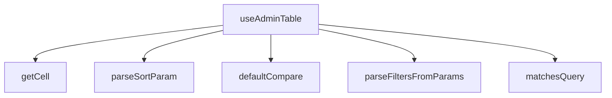

## Genel Bakış
`useAdminTable`, admin panellerindeki tabloların durum yönetimi için tasarlanmış bir React custom hook modülüdür. URL parametrelerinden sıralama ve filtreleme bilgilerini parse eder, tablo hücrelerine erişimi standartlaştırır ve arama/filtreleme mantığını merkezileştirir.

## Fonksiyon Grupları

### Hücre Erişim Yardımcıları
Tablo satırlarındaki hücre değerlerine dinamik olarak erişim sağlayan yardımcı fonksiyonları barındırır.
- `getCell`

### Sıralama Mantığı
Varsayılan karşılaştırma fonksiyonu ve URL'den gelen sıralama parametrelerinin parse edilmesini yönetir. `useAdminTable` hook'u tarafından sıralama durumunu başlatmak için kullanılır.
- `defaultCompare`, `parseSortParam`

### Filtreleme ve Arama
Satırların arama sorgusuyla eşleşip eşleşmediğini kontrol eder ve URLSearchParams objesinden filtre değerlerini çıkarır. Hook'un iç filtreleme mantığının temelini oluşturur.
- `matchesQuery`, `parseFiltersFromParams`

### Ana Hook (Orkestratör)
Tüm yardımcı fonksiyonları bir araya getirerek tablonun sıralama, filtreleme, sayfalama ve hücre erişim durumunu tek bir接口 üzerinden sunar. Dış bağımlılık olarak React ve Next.js'in `useSearchParams` hook'una ihtiyaç duyar.
- `useAdminTable`

---

## AXIOMS – Mimari Varsayımlar
- Bu modül davranışsal mantık içermez (salt veri / konfigürasyon / tip tanımı).
- [Aksiyom 1]: Modülün dışa açtığı yapı (anahtar kümesi / şema) bir sözleşmedir; tüketiciler bu sabit yapıya bağlıdır — kırıcı değişiklik tüm tüketicileri etkiler.
- [Aksiyom 2]: Bir öğe ekleme/çıkarma yapısal-uyumlu olmalı; ilgili tipler ve seçiciler aynı commit'te güncel tutulmalıdır.

---

## FONKSİYON DETAYLARI

### getCell
**Ne yapar**: Belirtilen satır nesnesinden (T türünde) verilen kolon anahtarına karşılık gelen hücre değerini döndürür.
**Nasıl yapar**: Satır nesnesini `Record<string, unknown>` türüne dönüştürerek anahtar erişimini sağlar. Bu, generic bir satır tipinden dinamik olarak alan değerlerini almayı kolaylaştırır.
**Parametreler**:
- row: T — Hücre değeri alınacak satır nesnesi.
- key: string — Alınacak değerin anahtarı (kolon adı).
**Dönüş**: unknown — Anahtarın karşılık geldiği değer; tür dönüşümü yapılmış veya tanımsız olabilir.

### defaultCompare
**Ne yapar**: İki bilinmeyen tipdeki değeri karşılaştırarak sıralama için sayısal bir sonuç üretir.
**Nasıl yapar**: Önce null değerlerin önceliğini belirler, ardından her iki değer de sayıysa aritmetik farkı döndürür. Aksi halde, her iki değeri de dizeye dönüştürerek Türkçe karakter duyarlı bir karşılaştırma (localeCompare) yapar.
**Parametreler**:
- a: unknown — Karşılaştırılacak ilk değer.
- b: unknown — Karşılaştırılacak ikinci değer.
**Dönüş**: number — İlk değer ikinci değerden küçükse negatif, büyükse pozitif, eşitlerse sıfır.

### matchesQuery
**Ne yapar**: Satır nesnesindeki herhangi bir dize değerinin, verilen küçük harf arama dizesini (needleLower) içerip içermediğini kontrol eder.
**Nasıl yapar**: Satır nesnesinin tüm değerlerini Iterate eder; değer bir dize ise, küçük harfe dönüştürüp arama dizesini içerip içermediğini kontrol eder. İlk eşleşmeyi bulursa `true` döner, aksi halde `false` döner.
**Parametreler**:
- row: T — Arama yapılacak satır nesnesi.
- needleLower: string — Küçük harfe dönüştürülmüş arama dizesi.
**Dönüş**: boolean — Satırdaki herhangi bir dize alanının arama dizesini içerip içermediği.

### parseSortParam
**Ne yapar**: Ham bir sıralama parametre dizesini (`"key:dir"` formatında) `SortState` nesnesine dönüştürür.
**Nasıl yapar**: Girdi dizesini `:` karakterine göre böler. İlk parça `key` olarak, ikinci parça `dir` olarak işlenir. `dir` `"desc"` ise `"desc"`, aksi halde `"asc"` olarak ayarlanır. Geçersiz girdiler için `null` döner.
**Parametreler**:
- raw: string | null — Ham sıralama parametresi (örn: `"name:desc"`).
**Dönüş**: SortState | null — `{ key: string, dir: 'asc' | 'desc' }` yapısında sıralama durumu veya ayrıştırılamazsa `null`.

### parseFiltersFromParams
**Ne yapar**: URL arama parametrelerinden (URLSearchParams) filtre parametrelerini ayrıştırarak `Record<string, string[]>` formatına dönüştürür.
**Nasıl yapar**: Tüm parametreleri iterasyonla gezer; reserved parametreleri (`RESERVED_PARAMS` kümesinde tanımlı) ve boş değerleri atlar. Kalan parametre değerlerini virgülle ayırarak diziye dönüştürür ve anahtar-değer çiftlerini nesneye ekler.
**Parametreler**:
- params: URLSearchParams — Ayrıştırılacak URL arama parametreleri.
**Dönüş**: Record<string, string[]> — Her bir filtre anahtarı için seçili değerlerin dizisi.

### useAdminTable

**Ne yapar**: Admin tabloları için kapsamlı durum yönetimi sağlayan özel bir React hook'udur. Sayfalama, sıralama, filtreleme, arama, satır seçimi ve URL senkronizasyonu gibi tablonun tüm temel özelliklerini tek bir hook üzerinden merkezi olarak yönetir. Hem sunucu taraflı (server) hem istemci taraflı (client) hem de sayfalamasız (none) modlarda çalışabilir.

**Nasıl yapar**: Fonksiyon, Next.js'in `useSearchParams`, `useRouter` ve `usePathname` hook'larını kullanarak URL durumu ile tablo durumu arasında iki yönlü senkronizasyon kurar. `syncUrl` seçeneği aktif olduğunda, URL parametrelerinden (`page`, `sort`, `q`, filtreler) başlangıç durumu lazy olarak okunur (seed); durum değişiklikleri ise `router.replace` ile URL'e yazılır (ham history manipülasyonu yapılmaz). `useEffect` içindeki bir kontrol, yasak kombinasyonları (sunucu sayfalama + istemci sıralama veya istemci sayfalama + sunucu sıralama) geliştirici konsoluna uyarı basarak sessiz hataları önler. `fetcher` ve `rowId` callback'leri `useRef` ile sarılarak fetch bağımlılık dizisine girme ve gereksiz yeniden çekme döngüsü engellenir. Arama girdisi, `debounceMs` milisaniye gecikmeyle debounce edilerek sunucu istek sayısını azaltır. Sunucu modunda, sırf alakalı parametre değişikliğinde (`useMemo` ile hesaplanan `serverParams`) fetch tetiklenir; istemci modunda ise tüm işleme (arama → filtre → sıralama) `useMemo` içinde `processedRows` olarak hesaplanır ve sadece geçerli sayfa dilimi döndürülür. Seçim mekanizması, `Set<string>` tabanlı olup `shiftKey` desteği ile aralık seçimini mevcut sayfa satırları üzerinde `lastIndexRef` ile çapraz referans kullanarak gerçekleştirir. `fetchAllForExport` metodu, sunucu modunda tüm eşleşen kayıtları tek seferde çekerek dışa aktarma senaryosunu destekler.

**Parametreler**:
- `options: UseAdminTableOptions<T>` — Hook'un tüm yapılandırma seçeneklerini içeren nesne. Aşağıdaki alt özelliklerin hepsini barındırır.
  - `resource: string` — Tablonun kaynak adı. Konsol uyarılarında ve hata tanımlarında tanımlayıcı olarak kullanılır.
  - `rowId: (row: T) => string` — Her satır nesnesinden benzersiz bir kimlik stringi üreten fonksiyon. Seçim seti, satır eşleme ve geçinme (anchor) mantığı bu fonksiyonun döndüğü değere bağlıdır.
  - `fetcher: (client: SupabaseClient, params: FetchParams) => Promise<{ rows: T[]; totalMatched: number }>` — Sunucudan veri çeken asenkron fonksiyon. Supabase istemcisi ve sayfalama/sıralama/filtre parametrelerini alıp satır dizisi ve toplam eşleşme sayısını döndürür. `useRef` ile sarılarak bağımlılık döngüsü önlenir.
  - `pageSize: number` — Sayfa başına satır sayısı (varsayılan: `50`). Hem sunucu hem istemci sayfalama modunda dilimleme için kullanılır.
  - `paginationMode: 'server' | 'client' | 'none'` — Sayfalama stratejisi (varsayılan: `'server'`). `'server'`da sunucu paginasyonu, `'client'`da tüm veri çekip istemci dilimleme, `'none'`da sayfalama devre dışıdır.
  - `sortMode: 'server' | 'client' | 'none'` — Sıralama stratejisi (varsayılan: `'server'`). Sunucu modunda sıralama parametreleri fetcher'a iletilir, istemci modunda `defaultCompare` ile `processedRows` üzerinde sıralanır.
  - `initialSort: SortState | null` — Başlangıç sıralama durumu. URL senkronizasyonu devre dışıyken veya URL'de sıralama parametresi olmadığında kullanılır.
  - `syncUrl: boolean` — Tablo durumunun URL parametrelerine senkronize edilip edilmeyeceği (varsayılan: `true`). Aktifken sayfa, sıralama, arama ve filtre durumları URL'e yazılır; geri/ileri tuşu ile URL değişikliklerinden durum geri yüklenir.
  - `debounceMs: number` — Arama girdisi için debounce gecikme süresi milisaniye cinsinden (varsayılan: `300`). Arama inputu her değiştiğinde bu süre kadar bekleyip tetikleme yapar.
  - `initialFilters: Record<string, string[]>` — Başlangıç filtre değerleri. Anahtarlar filtre alanı adları, değerler ise seçili seçeneklerin dizileridir. URL senkronizasyonu devre dışıyken veya URL'de filtre yokken kullanılır.

**Dönüş**: `UseAdminTableResult<T>` — Tablonun tüm durumunu ve kontrol fonksiyonlarını içeren nesne. İçeriği şu alt nesnelerden oluşur:
- `rows: T[]` — Görüntülenen (geçerli sayfadaki) satırlar. Sunucu modunda doğrudan `rawRows`, istemci modunda filtrelenmiş ve sıralanmış diziden dilimlenmiş sayfa, none modunda tüm işlenmiş satırlar.
- `allRows: T[]` — Sunucu modunda geçerli sayfadaki satırlar (`rows` ile aynı), istemci ve none modlarında ham çekilen tüm satırlar (`rawRows`).
- `totalMatched: number` — Filtre/arama sonrası eşleşen toplam satır sayısı. Sunucu modunda sunucudan gelen `totalMatched`, istemci modunda `processedRows.length`.
- `isLoading: boolean` — Veri çekme işlemi devam ediyorsa `true`.
- `error: string | null` — Son fetch işleminde oluştuysa hata mesajı, başarılıysa `null`.
- `reload: () => Promise<void>` — Mevcut parametrelerle veriyi yeniden çeker.
- `fetchAllForExport: () => Promise<T[]>` — Sunucu modunda tüm eşleşen kayıtları tek istekte çeker; istemci/none modunda zaten mevcut olan `processedRows`'u döndürür. Dışa aktarma (export) senaryoları için tasarlanmıştır.
- `pagination: { page: number; pageSize: number; pageCount: number; setPage: (p: number) => void; setPageSize: (s: number) => void }` — Sayfalama durumu ve kontrol fonksiyonları. `pageCount` toplam sayfa sayısını; `setPage` geçerli sayfayı ayarlar ve 1'den küçük değerlere izin vermez.
- `sorting: { sort: SortState | null; toggleSort: (key: string) => void }` — Sıralama durumu ve kontrol fonksiyonları. `toggleSort` aynı sütuna tekrar basıldığında yönü tersine çevirir; farklı sütuna basıldığında artan sıralama ile başlar. `sortMode` `'none'` ise fonksiyon hiçbir şey yapmaz.
- `filtering: { query: string; setQuery: (q: string) => void; filters: Record<string, string[]>; setFilter: (facetKey: string, values: string[]) => void; clearAll: () => void; hasActiveFilters: boolean }` — Filtreleme durumu ve kontrol fonksiyonları. `setQuery` debounce edilmiş arama girdisini yönetir; `setFilter` belirli bir faceted alanı ayarlar ve sayfayı 1'e döndürür; `clearAll` tüm arama ve filtreleri sıfırlar; `hasActiveFilters` herhangi bir aktif filtre veya arama olup olmadığını belirtir.
- `selection: { selectedIds: string[]; isSelected: (id: string) => boolean; toggle: (id: string, opts?: { shiftKey?: boolean }) => void; toggleAll: () => void; clear: () => void; allSelected: boolean }` — Satır seçim durumu ve kontrol fonksiyonları. `toggle` normal tıklamada tek satır seçimini değiştirir; `shiftKey: true` seçeneğinde ise son ankordan (lastIndex) mevcut indeks arasındaki tüm satırları ekler. `toggleAll` mevcut sayfadaki tüm satırları seçer veya seçimini kaldırır (mevcut sayfada hepsi seçiliyse kaldırır). `allSelected` mevcut sayfadaki tüm satırların seçili olup olmadığını belirtir. `clear` tüm seçimleri sıfırlar.

---

## İTHALATLAR (IMPORTS)
- import: @/lib/supabase/client::supabaseBrowserClient
- import: @/types/admin-shared::type { TableSortDir }
- import: @/types/database.types::type { Database }
- import: @supabase/supabase-js::type { SupabaseClient }
- import: next/navigation::usePathname
- import: next/navigation::useRouter
- import: next/navigation::useSearchParams
- import: react::useCallback
- import: react::useEffect
- import: react::useMemo
- import: react::useRef
- import: react::useState

---

## INTERFACES

### SortState
- `key: string`
- `dir: TableSortDir`

### FetchParams
fetcher'a geçen normalize parametreler.
- `page: number`
- `pageSize: number`
- `sort: SortState | null`
- `query: string`
- `filters: Record<string, string[]>`

### FetchResult
fetcher sözleşmesi — İKİ-TOTAL [ADV-1#1]: - `totalMatched`: client-süzme SONRASI görünür-eşleşme toplamı (pageCount kaynağı). - `rows`: server-mode'da zaten süzülmüş+sayfalanmış satırlar.
- `rows: T[]`
- `totalMatched: number`

### UseAdminTableOptions
- `resource: string`
- `rowId: (r: T) => string`
- `fetcher: (supabase: SupabaseClient<Database>, params: FetchParams) => Promise<FetchResult<T>>`
- `pageSize?: number`
- `paginationMode?: AdminMode`
- `sortMode?: AdminMode`
- `initialSort?: SortState`
- `syncUrl?: boolean`
- `debounceMs?: number`
- `initialFilters?: Record<string, string[]>`

### PaginationApi
- `page: number`
- `pageSize: number`
- `pageCount: number`
- `setPage: (p: number) => void`
- `setPageSize: (n: number) => void`

### SortingApi
- `sort: SortState | null`
- `toggleSort: (key: string) => void`

### FilteringApi
- `query: string`
- `setQuery: (q: string) => void`
- `filters: Record<string, string[]>`
- `setFilter: (facetKey: string, values: string[]) => void`
- `clearAll: () => void`
- `hasActiveFilters: boolean`

### SelectionApi
- `selectedIds: string[]`
- `isSelected: (id: string) => boolean`
- `toggle: (id: string, opts?: { shiftKey?: boolean }) => void`
- `toggleAll: () => void`
- `clear: () => void`
- `allSelected: boolean`

### UseAdminTableResult
- `rows: T[]`
- `allRows: T[]`
- `totalMatched: number`
- `isLoading: boolean`
- `error: string | null`
- `reload: () => Promise<void>`
- `fetchAllForExport: () => Promise<T[]>`
- `pagination: PaginationApi`
- `sorting: SortingApi`
- `filtering: FilteringApi`
- `selection: SelectionApi`

---

## TYPE ALIASES

### AdminMode
```typescript
type AdminMode = 'server' | 'client' | 'none'
```

---

## SABİTLER
- **RESERVED_PARAMS** (new_expression) — `new Set(['page', 'sort', 'q'])`

---

## AST POINTERS

### [N1_NASIL] AST Pointer: src/hooks/useAdminTable.ts::getCell
- **params**: `row: T, key: string`
- **ic_degiskenler**: (yok)
- **Dönüş**: `(row as Record<string, unknown>)[key]` — row objesinin key alanını unknown olarak döndürür

### [N2_NASIL] AST Pointer: src/hooks/useAdminTable.ts::defaultCompare
- **params**: `a: unknown, b: unknown`
- **ic_degiskenler**: (yok)
- **Dönüş**: `number` — null karşılaştırması, sayısal fark veya 'tr' locale ile String.localeCompare sonucu

### [N3_NASIL] AST Pointer: src/hooks/useAdminTable.ts::matchesQuery
- **params**: `row: T, needleLower: string`
- **ic_degiskenler**: `v` — row'un her bir alan değeri (Object.values iterasyonu)
- **Dönüş**: `boolean` — row'un herhangi bir string değerinin needleLower'ı içerip içermediği

### [N4_NASIL] AST Pointer: src/hooks/useAdminTable.ts::parseSortParam
- **params**: `raw: string | null`
- **ic_degiskenler**: `key` — sıralama alanı adı (colon ile ayrılmış ilk parça), `dir` — sıralama yönü ('desc' veya 'asc')
- **Dönüş**: `SortState | null` — `{ key, dir }` objesi veya null

### [N5_NASIL] AST Pointer: src/hooks/useAdminTable.ts::parseFiltersFromParams
- **params**: `params: URLSearchParams`
- **ic_degiskenler**: `out` — sonuç filtre sözlüğü, `k` — parametre adı, `v` — parametre değeri
- **Dönüş**: `Record<string, string[]>` — RESERVED_PARAMS olmayan ve değeri boş olmayan tüm parametrelerin virgülle ayrılmış dizi karşılıkları

### [N6_NASIL] AST Pointer: src/hooks/useAdminTable.ts::useAdminTable
- **params**: `options: UseAdminTableOptions<T>`
- **ic_degiskenler**:
  - `resource` — options'tan destructured, tablo/kaynak adı, log mesajlarında kullanılır
  - `rowId` — options'tan destructured, satır benzersiz tanımlayıcısını üreten fonksiyon
  - `fetcher` — options'tan destructured, veri çekme fonksiyonu
  - `pageSizeOpt` — options'tan destructured, varsayılan sayfa boyutu (default 50)
  - `paginationMode` — options'tan destructured, sayfalama modu ('server'|'client'|'none')
  - `sortMode` — options'tan destructured, sıralama modu ('server'|'client'|'none')
  - `initialSort` — options'tan destructured, başlangıç sıralama durumu
  - `syncUrl` — options'tan destructured, URL ile senkronizasyon flag'i (default true)
  - `debounceMs` — options'tan destructured, arama debounce gecikmesi (default 300ms)
  - `initialFilters` — options'tan destructured, başlangıç filtre değerleri
  - `searchParams` — useSearchParams() hook'undan, URL arama parametrelerine erişim
  - `router` — useRouter() hook'undan, navigasyon için
  - `pathname` — usePathname() hook'undan, mevcut URL yolu
  - `fetcherRef` — fetcher fonksiyonunu ref'te tutar, fetch deps'ine girmesini önler
  - `rowIdRef` — rowId fonksiyonunu ref'te tutar
  - `page` — mevcut sayfa numarası state'i
  - `setPageRaw` — sayfa numarası raw setter
  - `pageSize` — sayfa boyutu state'i
  - `setPageSize` — sayfa boyutu setter
  - `sort` — sıralama durumu state'i (SortState | null)
  - `setSort` — sıralama setter
  - `query` — ham arama sorgusu state'i
  - `setQueryRaw` — ham arama sorgusu setter
  - `debouncedQuery` — debounce edilmiş arama sorgusu state'i
  - `setDebouncedQuery` — debounce edilmiş arama sorgusu setter
  - `filters` — filtre sözlüğü state'i (Record<string, string[]>)
  - `setFilters` — filtre sözlüğü setter
  - `rawRows` — ham satır verisi state'i (T[])
  - `setRawRows` — ham satır verisi setter
  - `serverTotal` — sunucu tarafı toplam eşleşme sayısı state'i
  - `setServerTotal` — sunucu toplam sayısı setter
  - `isLoading` — yükleme durumu state'i
  - `setIsLoading` — yükleme durumu setter
  - `error` — hata mesajı state'i (string | null)
  - `setError` — hata mesajı setter
  - `selectedIds` — seçili satır ID set'i state'i (Set<string>)
  - `setSelectedIds` — seçili ID set'i setter
  - `lastIndexRef` — shift-seçim için son tıklanan satır indeksini tutar (number | null)
  - `effPage` — server modda geçerli sayfa, client modda 1
  - `effSortKey` — server modda geçerli sıralama alanı, client modda boş string
  - `effSortDir` — server modda geçerli sıralama yönü, client modda 'asc'
  - `effQuery` — server modda geçerli arama sorgusu, client modda boş string
  - `effFiltersKey` — server modda JSON.stringify edilmiş filtreler, client modda boş string
  - `serverParams` — useMemo ile hesaplanan FetchParams objesi
  - `doFetch` — useCallback ile tanımlanan veri çekme fonksiyonu
  - `processedRows` — useMemo ile hesaplanan client-side işlenmiş satırlar
  - `totalMatched` — toplam eşleşme sayısı (server veya client moduna göre)
  - `pageCount` — toplam sayfa sayısı
  - `rows` — useMemo ile hesaplanan sayfalı satırlar
  - `lastUrlRef` — son yazılan URL query string'ini tutar
  - `justWroteRef` — kendi yazımımızın echo'sunu tespit eder
  - `buildQuery` — useCallback ile tanımlanan URL query string oluşturma fonksiyonu
  - `setPage` — sayfa numarasını ayarlayan memoized callback
  - `setQuery` — arama sorgusunu ayarlayan memoized callback
  - `setFilter` — belirli bir facet anahtarı için filtre değerlerini ayarlayan callback
  - `clearAll` — tüm filtreleri ve sorguyu sıfırlayan callback
  - `hasActiveFilters` — useMemo ile hesaplanan aktif filtre olup olmadığını gösteren boolean
  - `toggleSort` — useCallback ile tanımlanan sıralama toggle fonksiyonu
  - `rowsRef` — mevcut rows dizisini ref'te tutar
  - `toggle` — useCallback ile tanımlanan tek satır seçim toggle fonksiyonu (shift-aralık destekli)
  - `toggleAll` — useCallback ile tanımlanan tüm sayfa satırlarını seç/kaldır fonksiyonu
  - `clear` — useCallback ile tanımlanan tüm seçimleri temizleyen callback
  - `isSelected` — useCallback ile tanımlanan belirli bir ID'nin seçili olup olmadığını kontrol eden fonksiyon
  - `allSelected` — tüm satırların seçili olup olmadığını gösteren boolean
  - `selectedIdsArr` — selectedIds set'ini useMemo ile diziye dönüştüren memoized değer
  - `reload` — useCallback ile tanımlanan doFetch'i çağıran yenileme fonksiyonu
  - `fetchAllForExport` — useCallback ile tanımlanan tüm verileri çekip dizi olarak döndüren fonksiyon
- **Dönüş**: `UseAdminTableResult<T>` — { rows, allRows, totalMatched, isLoading, error, reload, fetchAllForExport, pagination, sorting, filtering, selection } objesi; yan etkiler: URL senkronizasyonu, veri çekme, konsol hata uyarıları

### [N7_NASIL] AST Pointer: src/hooks/useAdminTable.ts::useEffect(pagination-sort-validation)
- **params**: (yok — anonim effect)
- **ic_degiskenler**: (yok)
- **Dönüş**: yok — yasak/hata kombinasyonlarını konsola error olarak yazar

### [N8_NASIL] AST Pointer: src/hooks/useAdminTable.ts::useState initializer(page)
- **params**: (yok — anonim lazy initializer)
- **ic_degiskenler**: `v` — parseInt ile parse edilmiş sayfa numarası
- **Dönüş**: `number` — URL'den okunan sayfa numarası veya 1

### [N9_NASIL] AST Pointer: src/hooks/useAdminTable.ts::useState initializer(sort)
- **params**: (yok — anonim lazy initializer)
- **ic_degiskenler**: `s` — parseSortParam ile parse edilmiş sıralama durumu
- **Dönüş**: `SortState | null` — URL'den sort veya initialSort veya null

### [N10_NASIL] AST Pointer: src/hooks/useAdminTable.ts::useState initializer(filters)
- **params**: (yok — anonim lazy initializer)
- **ic_degiskenler**: `parsed` — parseFiltersFromParams ile parse edilmiş filtre sözlüğü
- **Dönüş**: `Record<string, string[]>` — URL'den filtreler veya initialFilters veya boş obje

### [N11_NASIL] AST Pointer: src/hooks/useAdminTable.ts::useEffect(debounce)
- **params**: (yok — anonim effect)
- **ic_degiskenler**: `t` — setTimeout ID'si
- **Dönüş**: yok — debounce gecikmesi ile debouncedQuery'yi günceller, cleanup'ta timer'ı temizler

### [N12_NASIL] AST Pointer: src/hooks/useAdminTable.ts::useMemo(serverParams)
- **params**: (yok — anonim memo)
- **ic_degiskenler**: (yok)
- **Dönüş**: `FetchParams` — { page, pageSize, sort, query, filters } objesi

### [N13_NASIL] AST Pointer: src/hooks/useAdminTable.ts::doFetch
- **params**: (yok)
- **ic_degiskenler**: `res` — fetcherRef.current() çağrısından dönen yanıt (res.rows ve res.totalMatched)
- **Dönüş**: `Promise<void>` — rawRows, serverTotal, isLoading ve error state'lerini günceller

### [N14_NASIL] AST Pointer: src/hooks/useAdminTable.ts::useEffect(fetch-trigger)
- **params**: (yok — anonim effect)
- **ic_degiskenler**: (yok)
- **Dönüş**: yok — doFetch() çağırarak veri çeker

### [N15_NASIL] AST Pointer: src/hooks/useAdminTable.ts::useMemo(processedRows)
- **params**: (yok — anonim memo)
- **ic_degiskenler**: `needle` — debouncedQuery'nin lowercased hali
- **Dönüş**: `T[]` — server modda rawRows; client modda arama + filtre + sıralama uygulanmış satırlar

### [N16_NASIL] AST Pointer: src/hooks/useAdminTable.ts::useMemo(rows)
- **params**: (yok — anonim memo)
- **ic_degiskenler**: `from` — sayfalama için başlangıç indeksi
- **Dönüş**: `T[]` — client pagination modda sayfalı satırlar, diğer modlarda processedRows

### [N17_NASIL] AST Pointer: src/hooks/useAdminTable.ts::buildQuery
- **params**: (yok)
- **ic_degiskenler**: `params` — URLSearchParams instance'ı
- **Dönüş**: `string` — page, sort, q ve filter parametrelerinden oluşan URL query string

### [N18_NASIL] AST Pointer: src/hooks/useAdminTable.ts::useEffect(url-write)
- **params**: (yok — anonim effect)
- **ic_degiskenler**: `qs` — buildQuery() ile üretilen query string
- **Dönüş**: yok — syncUrl aktifse ve değişiklik varsa router.replace ile URL'yi günceller

### [N19_NASIL] AST Pointer: src/hooks/useAdminTable.ts::useEffect(url-read)
- **params**: (yok — anonim effect)
- **ic_degiskenler**: `current` — mevcut searchParams string'i, `sp` — URLSearchParams instance'ı, `q` — URL'den okunan arama sorgusu
- **Dönüş**: yok — dış URL değişikliklerinde (geri/ileri) state'leri URL'den yeniler

### [N20_NASIL] AST Pointer: src/hooks/useAdminTable.ts::setFilter
- **params**: `facetKey: string, values: string[]`
- **ic_degiskenler**: `prev` — setFilters updater parametresi, mevcut filtre sözlüğü
- **Dönüş**: yok — filters state'ini günceller ve sayfayı 1'e sıfırlar

### [N21_NASIL] AST Pointer: src/hooks/useAdminTable.ts::clearAll
- **params**: (yok)
- **ic_degiskenler**: (yok)
- **Dönüş**: yok — query, debouncedQuery, filters ve page state'lerini sıfırlar

### [N22_NASIL] AST Pointer: src/hooks/useAdminTable.ts::toggleSort
- **params**: `key: string`
- **ic_degiskenler**: `prev` — setSort updater parametresi, mevcut sıralama durumu
- **Dönüş**: yok — sortMode 'none' değilse sıralamayı toggler ve sayfayı 1'e sıfırlar

### [N23_NASIL] AST Pointer: src/hooks/useAdminTable.ts::toggle
- **params**: `id: string, opts?: { shiftKey?: boolean }`
- **ic_degiskenler**: `currentRows` — rowsRef.current'tan alınan güncel satırlar, `curIdx` — tıklanan satırın indeksi, `anchor` — lastIndexRef'den yakalanan son tıklama indeksi, `next` — setSelectedIds updater içindeki yeni Set kopyası, `lo` — shift-aralık için alt sınır, `hi` — shift-aralık için üst sınır
- **Dönüş**: yok — tek satır seçimini toggler veya shift ile aralık seçimi yapar; lastIndexRef'i günceller

### [N24_NASIL] AST Pointer: src/hooks/useAdminTable.ts::toggle (setSelectedIds updater)
- **params**: `prev` — mevcut selectedIds Set'i
- **ic_degiskenler**: `next` — prev'in kopyası
- **Dönüş**: `Set<string>` — güncellenmiş selected ID seti

### [N25_NASIL] AST Pointer: src/hooks/useAdminTable.ts::toggleAll
- **params**: (yok)
- **ic_degiskenler**: `currentRows` — rowsRef.current'tan alınan güncel satırlar, `next` — setSelectedIds updater içindeki yeni Set kopyası, `allOnPage` — tüm sayfa satırlarının seçili olup olmadığını gösteren boolean
- **Dönüş**: yok — tüm sayfa satırlarını seçer veya seçimleri kaldırır

### [N26_NASIL] AST Pointer: src/hooks/useAdminTable.ts::toggleAll (setSelectedIds updater)
- **params**: `prev` — mevcut selectedIds Set'i
- **ic_degiskenler**: `next` — prev'in kopyası, `allOnPage` — tüm satırların seçili olup olmadığını kontrol eden boolean
- **Dönüş**: `Set<string>` — güncellenmiş selected ID seti

### [N27_NASIL] AST Pointer: src/hooks/useAdminTable.ts::clear
- **params**: (yok)
- **ic_degiskenler**: (yok)
- **Dönüş**: yok — selectedIds'i boş Set ile değiştirir, lastIndexRef'i null yapar

### [N28_NASIL] AST Pointer: src/hooks/useAdminTable.ts::reload
- **params**: (

---


## MERMAID CALL GRAPH


## NODE ID STANDARD

  file: src\hooks\useAdminTable.ts
  function: src\hooks\useAdminTable.ts::getCell
  function: src\hooks\useAdminTable.ts::defaultCompare
  function: src\hooks\useAdminTable.ts::matchesQuery
  function: src\hooks\useAdminTable.ts::parseSortParam
  function: src\hooks\useAdminTable.ts::parseFiltersFromParams
  function: src\hooks\useAdminTable.ts::useAdminTable

---

## DISA AKTARILANLAR (EXPORTS)
  export: AdminMode
  export: FetchParams
  export: FetchResult
  export: FilteringApi
  export: PaginationApi
  export: SelectionApi
  export: SortState
  export: SortingApi
  export: UseAdminTableOptions
  export: UseAdminTableResult
  export: defaultCompare
  export: getCell
  export: matchesQuery
  export: parseFiltersFromParams
  export: parseSortParam
  export: useAdminTable