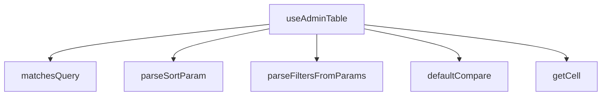

## Genel Bakış
`useAdminTable`, admin panellerindeki tabloların durum yönetimi için tasarlanmış bir React custom hook modülüdür. URL parametrelerinden sıralama ve filtreleme bilgilerini parse eder, tablo hücrelerine erişimi standartlaştırır ve arama/filtreleme mantığını merkezileştirir.

## Fonksiyon Grupları

### Hücre Erişim Yardımcıları
Tablo satırlarındaki hücre değerlerine dinamik olarak erişim sağlayan yardımcı fonksiyonları barındırır.
- `getCell`

### Sıralama Mantığı
Varsayılan karşılaştırma fonksiyonu ve URL'den gelen sıralama parametrelerinin parse edilmesini yönetir. `useAdminTable` hook'u tarafından sıralama durumunu başlatmak için kullanılır.
- `defaultCompare`, `parseSortParam`

### Filtreleme ve Arama
Satırların arama sorgusuyla eşleşip eşleşmediğini kontrol eder ve URLSearchParams objesinden filtre değerlerini çıkarır. Hook'un iç filtreleme mantığının temelini oluşturur.
- `matchesQuery`, `parseFiltersFromParams`

### Ana Hook (Orkestratör)
Tüm yardımcı fonksiyonları bir araya getirerek tablonun sıralama, filtreleme, sayfalama ve hücre erişim durumunu tek bir接口 üzerinden sunar. Dış bağımlılık olarak React ve Next.js'in `useSearchParams` hook'una ihtiyaç duyar.
- `useAdminTable`

---

## AXIOMS – Mimari Varsayımlar
- Bu modül davranışsal mantık içermez (salt veri / konfigürasyon / tip tanımı).
- [Aksiyom 1]: Modülün dışa açtığı yapı (anahtar kümesi / şema) bir sözleşmedir; tüketiciler bu sabit yapıya bağlıdır — kırıcı değişiklik tüm tüketicileri etkiler.
- [Aksiyom 2]: Bir öğe ekleme/çıkarma yapısal-uyumlu olmalı; ilgili tipler ve seçiciler aynı commit'te güncel tutulmalıdır.

---

## FONKSİYON DETAYLARI

### getCell
**Ne yapar**: Belirtilen satır nesnesinden (T türünde) verilen kolon anahtarına karşılık gelen hücre değerini döndürür.
**Nasıl yapar**: Satır nesnesini `Record<string, unknown>` türüne dönüştürerek anahtar erişimini sağlar. Bu, generic bir satır tipinden dinamik olarak alan değerlerini almayı kolaylaştırır.
**Parametreler**:
- row: T — Hücre değeri alınacak satır nesnesi.
- key: string — Alınacak değerin anahtarı (kolon adı).
**Dönüş**: unknown — Anahtarın karşılık geldiği değer; tür dönüşümü yapılmış veya tanımsız olabilir.

### defaultCompare
**Ne yapar**: İki bilinmeyen tipdeki değeri karşılaştırarak sıralama için sayısal bir sonuç üretir.
**Nasıl yapar**: Önce null değerlerin önceliğini belirler, ardından her iki değer de sayıysa aritmetik farkı döndürür. Aksi halde, her iki değeri de dizeye dönüştürerek Türkçe karakter duyarlı bir karşılaştırma (localeCompare) yapar.
**Parametreler**:
- a: unknown — Karşılaştırılacak ilk değer.
- b: unknown — Karşılaştırılacak ikinci değer.
**Dönüş**: number — İlk değer ikinci değerden küçükse negatif, büyükse pozitif, eşitlerse sıfır.

### matchesQuery
**Ne yapar**: Satır nesnesindeki herhangi bir dize değerinin, verilen küçük harf arama dizesini (needleLower) içerip içermediğini kontrol eder.
**Nasıl yapar**: Satır nesnesinin tüm değerlerini Iterate eder; değer bir dize ise, küçük harfe dönüştürüp arama dizesini içerip içermediğini kontrol eder. İlk eşleşmeyi bulursa `true` döner, aksi halde `false` döner.
**Parametreler**:
- row: T — Arama yapılacak satır nesnesi.
- needleLower: string — Küçük harfe dönüştürülmüş arama dizesi.
**Dönüş**: boolean — Satırdaki herhangi bir dize alanının arama dizesini içerip içermediği.

### parseSortParam
**Ne yapar**: Ham bir sıralama parametre dizesini (`"key:dir"` formatında) `SortState` nesnesine dönüştürür.
**Nasıl yapar**: Girdi dizesini `:` karakterine göre böler. İlk parça `key` olarak, ikinci parça `dir` olarak işlenir. `dir` `"desc"` ise `"desc"`, aksi halde `"asc"` olarak ayarlanır. Geçersiz girdiler için `null` döner.
**Parametreler**:
- raw: string | null — Ham sıralama parametresi (örn: `"name:desc"`).
**Dönüş**: SortState | null — `{ key: string, dir: 'asc' | 'desc' }` yapısında sıralama durumu veya ayrıştırılamazsa `null`.

### parseFiltersFromParams
**Ne yapar**: URL arama parametrelerinden (URLSearchParams) filtre parametrelerini ayrıştırarak `Record<string, string[]>` formatına dönüştürür.
**Nasıl yapar**: Tüm parametreleri iterasyonla gezer; reserved parametreleri (`RESERVED_PARAMS` kümesinde tanımlı) ve boş değerleri atlar. Kalan parametre değerlerini virgülle ayırarak diziye dönüştürür ve anahtar-değer çiftlerini nesneye ekler.
**Parametreler**:
- params: URLSearchParams — Ayrıştırılacak URL arama parametreleri.
**Dönüş**: Record<string, string[]> — Her bir filtre anahtarı için seçili değerlerin dizisi.

### useAdminTable
**Ne yapar**: Admin tabloları için gelişmiş bir veri yönetimi, sıralama, filtreleme, sayfalama ve seçim durumu sunan bir React hook'u.
**Nasıl yapar**: Verilen seçeneklere göre (`UseAdminTableOptions<T>`) URL ile senkronize state'ler (sayfa, sıralama, arama, filtreler) yönetir. `paginationMode` ve `sortMode` değerlerine göre veri çekme stratejisini (sunucu veya istemci) belirler. Hook, veri çekme, debounce arama, istemci taraflı filtreleme/sıralama, URL yazma/okuma ve satır seçim mantığını içeren bir dizi state ve callback döndürür. Hatalı mod kombinasyonları için konsol hataları üretir.
**Parametreler**:
- options: UseAdminTableOptions<T> — Hook için yapılandırma seçenekleri (resource, rowId, fetcher, pageSize, paginationMode, sortMode, initialSort, syncUrl, debounceMs).
**Dönüş**: UseAdminTableResult<T> — rows, totalMatched, isLoading, error, reload, fetchAllForExport, pagination, sorting, filtering, selection property'lerini içeren nesne.

---

## INTERFACES

### SortState
- `key: string`
- `dir: TableSortDir`

### FetchParams
fetcher'a geçen normalize parametreler.
- `page: number`
- `pageSize: number`
- `sort: SortState | null`
- `query: string`
- `filters: Record<string, string[]>`

### FetchResult
fetcher sözleşmesi — İKİ-TOTAL [ADV-1#1]: - `totalMatched`: client-süzme SONRASI görünür-eşleşme toplamı (pageCount kaynağı). - `rows`: server-mode'da zaten süzülmüş+sayfalanmış satırlar.
- `rows: T[]`
- `totalMatched: number`

### UseAdminTableOptions
- `resource: string`
- `rowId: (r: T) => string`
- `fetcher: (supabase: SupabaseClient<Database>, params: FetchParams) => Promise<FetchResult<T>>`
- `pageSize?: number`
- `paginationMode?: AdminMode`
- `sortMode?: AdminMode`
- `initialSort?: SortState`
- `syncUrl?: boolean`
- `debounceMs?: number`

### PaginationApi
- `page: number`
- `pageSize: number`
- `pageCount: number`
- `setPage: (p: number) => void`
- `setPageSize: (n: number) => void`

### SortingApi
- `sort: SortState | null`
- `toggleSort: (key: string) => void`

### FilteringApi
- `query: string`
- `setQuery: (q: string) => void`
- `filters: Record<string, string[]>`
- `setFilter: (facetKey: string, values: string[]) => void`
- `clearAll: () => void`
- `hasActiveFilters: boolean`

### SelectionApi
- `selectedIds: string[]`
- `isSelected: (id: string) => boolean`
- `toggle: (id: string, opts?: { shiftKey?: boolean }) => void`
- `toggleAll: () => void`
- `clear: () => void`
- `allSelected: boolean`

### UseAdminTableResult
- `rows: T[]`
- `allRows: T[]`
- `totalMatched: number`
- `isLoading: boolean`
- `error: string | null`
- `reload: () => Promise<void>`
- `fetchAllForExport: () => Promise<T[]>`
- `pagination: PaginationApi`
- `sorting: SortingApi`
- `filtering: FilteringApi`
- `selection: SelectionApi`

---

## TYPE ALIASES

### AdminMode
```typescript
type AdminMode = 'server' | 'client' | 'none'
```

---

## SABİTLER
- **RESERVED_PARAMS** (new_expression) — `new Set(['page', 'sort', 'q'])`

---

## AST POINTERS

### [N1_NASIL] AST Pointer: src/hooks/useAdminTable.ts::getCell
- **params**: `(row: T, key: string)` — row: lookup yapılacak satır nesnesi, key: erişilecek alan anahtarı
- **ic_degiskenler**:
  _(iç değişken yok)_
- **Dönüş**: `unknown` — row[key] değerini bilinmeyen türde döndürür; row Record<string, unknown>'a cast edilerek erişilir

---

### [N2_NASIL] AST Pointer: src/hooks/useAdminTable.ts::defaultCompare
- **params**: `(a: unknown, b: unknown)` — karşılaştırılacak iki değer
- **ic_degiskenler**:
  _(iç değişken yok; tüm mantık parametreler üzerinde doğrudan çalışır)_
- **Dönüş**: `number` — a < b için negatif, a > b için pozitif, eşit için 0; null değerler en başa sıralanır; sayısal ise aritmetik fark, değilse Türk locale'inde localeCompare

---

### [N3_NASIL] AST Pointer: src/hooks/useAdminTable.ts::matchesQuery
- **params**: `(row: T, needleLower: string)` — row: aranacak satır, needleLower: küçük harfe çevrilmiş arama metni
- **ic_degiskenler**:
  _(for-of döngüsü içinde `v` iterasyon değişkeni kullanılır — row'un tüm değerlerini dolaşır)_
- **Dönüş**: `boolean` — row'un herhangi bir string değeri needleLower'ı içeriyorsa true, aksi halde false

---

### [N4_NASIL] AST Pointer: src/hooks/useAdminTable.ts::parseSortParam
- **params**: `(raw: string | null)` — URL'den gelen sort parametre string'i veya null
- **ic_degiskenler**:
  - `key` — split(':') ile elde edilen sıralama alan adı; boşsa null döner
  - `dir` — split(':') ile elde edilen sıralama yönü; 'desc' ise 'desc', değilse 'asc' olarak normalize edilir
- **Dönüş**: `SortState | null` — `{ key: string, dir: 'asc' | 'desc' }` veya geçersiz girdide null

---

### [N5_NASIL] AST Pointer: src/hooks/useAdminTable.ts::parseFiltersFromParams
- **params**: `(params: URLSearchParams)` — URLSearchParams nesnesi, tüm query parametrelerini içerir
- **ic_degiskenler**:
  - `out` — `Record<string, string[]>` tipinde sonuç nesnesi; filtrelenmiş key-value çiftlerini toplar
  - `k` — params.entries() iterasyonundaki her bir parametre anahtarı
  - `v` — params.entries() iterasyonundaki her bir parametre değeri (virgülle ayrılmış filtre değerleri)
- **Dönüş**: `Record<string, string[]>` — RESERVED_PARAMS'ta olmayan ve değeri boş olmayan tüm parametrelerin virgülle ayrılmış değer array'i

---

### [N6_NASIL] AST Pointer: src/hooks/useAdminTable.ts::useAdminTable
- **params**: `(options: UseAdminTableOptions<T>)` — hook konfigürasyon nesnesi; resource, rowId, fetcher, pageSize, paginationMode, sortMode, initialSort, syncUrl, debounceMs alanlarını içerir
- **ic_degiskenler**:
  - `resource` — options'dan destructured; API kaynak adı, hata loglarında ve konsol uyarılarında etiket olarak kullanılır
  - `rowId` — options'dan destructured; `(row: T) => string` fonksiyonu, her satırın benzersiz ID'sini üretir
  - `fetcher` — options'dan destructured; `(client, params) => Promise<{rows, totalMatched}>` veri çekme fonksiyonu
  - `pageSizeOpt` — options'dan destructured (varsayılan 50); initial sayfa boyutu
  - `paginationMode` — options'dan destructured (varsayılan 'server'); sayfalama stratejisi: 'server' | 'client' | 'none'
  - `sortMode` — options'dan destructured (varsayılan 'server'); sıralama stratejisi: 'server' | 'client' | 'none'
  - `initialSort` — options'dan destructured; başlangıç sıralama durumu `SortState | null`
  - `syncUrl` — options'dan destructured (varsayılan true); durumun URL ile senkronize edilip edilmeyeceği
  - `debounceMs` — options'dan destructured (varsayılan 300); arama gecikme süresi (ms)
  - `searchParams` — `useSearchParams()` hook'undan; URL'deki mevcut query parametrelerini okur
  - `router` — `useRouter()` hook'undan; URL navigasyonu (router.replace) için kullanılır
  - `pathname` — `usePathname()` hook'undan; mevcut URL path'i, URL yazımında base olarak kullanılır
  - `fetcherRef` — `useRef(fetcher)`; fetcher fonksiyonunu ref'te saklar, state/deps tetiklemeden güncel erişim sağlar
  - `rowIdRef` — `useRef(rowId)`; rowId fonksiyonunu ref'te saklar, selection callback'lerinde güncel erişim sağlar
  - `page` — `useState<number>`; mevcut sayfa numarası (1-tabanlı); syncUrl ise URL'den lazy seed edilir
  - `pageSize` — `useState<number>`; sayfa başına satır sayısı; pageSizeOpt'ten başlangıç değerini alır
  - `sort` — `useState<SortState | null>`; aktif sıralama durumu `{ key, dir }` veya null; syncUrl ise URL'den parse edilir
  - `query` — `useState<string>`; kullanıcının yazdığı ham arama sorgusu (debounce öncesi)
  - `debouncedQuery` — `useState<string>`; debounce uygulanmış arama sorgusu; filtreleme ve URL yazımında kullanılır
  - `filters` — `useState<Record<string, string[]>>`; facet bazlı filtre değerleri { facetKey: [değer1, değer2] }; syncUrl ise URL'den parse edilir
  - `rawRows` — `useState<T[]>`; fetcher'dan dönen ham satır dizisi; client-side işleme için kullanılır
  - `serverTotal` — `useState<number>`; sunucunun döndürdüğü toplam eşleşme sayısı
  - `isLoading` — `useState<boolean>`; veri çekme sırasında true olan yükleme durumu bayrağı
  - `error` — `useState<string | null>`; hata mesajı veya null; catch bloğunda Error.message'dan doldurulur
  - `selectedIds` — `useState<Set<string>>`; seçili satır ID'lerinin kümesi; tekli/çoklu/shift seçim yönetimi
  - `lastIndexRef` — `useRef<number | null>`; shift-aralık seçimi için son tıklanan satırın indeksi; updater ertelenirken anchor olarak kullanılır
  - `effPage` — server mode'da page, client/none mode'da sabit 1; useMemo/deps hesaplamalarında etkin sayfa
  - `effSortKey` — server mode'da sort?.key, client/none mode'da boş string; sunucu parametrelerinde sıralama alanı
  - `effSortDir` — server mode'da sort?.dir ?? 'asc', client/none mode'da 'asc'; sunucu parametrelerinde sıralama yönü
  - `effQuery` — server mode'da debouncedQuery, client/none mode'da boş string; sunucu arama parametresi
  - `effFiltersKey` — server mode'da JSON.stringify(filters), client/none mode'da boş string; useMemo deps karşılaştırması için string representation
  - `serverParams` — `useMemo<FetchParams>` hesaplaması; sunucuya gönderilecek parametre nesnesi { page, pageSize, sort, query, filters }
  - `doFetch` — `useCallback(async () => {...})` asenkron veri çekme fonksiyonu; fetcherRef.current'i çağırır, rawRows/serverTotal'ı günceller, hata yakalar
  - `processedRows` — `useMemo` hesaplaması; client mode'da ham satırlar query/filtre/sıralama ile işlenmiş nihai satır dizisi; server mode'da rawRows'un aynısı
  - `totalMatched` — server mode'da serverTotal, client mode'da processedRows.length; toplam eşleşme sayfasız toplam
  - `pageCount` — toplam sayfa sayısı; none mode'da 1, diğerinde Math.ceil(totalMatched / pageSize)
  - `rows` — `useMemo` hesaplaması; client pagination uygulanmış nihai görünür satırlar; server/none mode'da processedRows'un aynısı
  - `lastUrlRef` — `useRef<string>`; son yazılan URL query string'i; tekrar yazmayı önlemek için compare edilir
  - `justWroteRef` — `useRef<boolean>`; kendi router.replace yazımının echo'su mu diye bayrak tutar; okuma effect'inde false yapılırsa state sıfırlanmaz
  - `buildQuery` — `useCallback(() => string)`; mevcut state'i (page, sort, debouncedQuery, filters) URLSearchParams'a dönüştürüp query string döndürür
  - `setPage` — `useCallback((p: number) => void)`; sayfa numarasını günceller, minimum 1 kısıtlaması uygular
  - `setQuery` — `useCallback((q: string) => void)`; ham arama sorgusunu günceller (debounce tetikler)
  - `setFilter` — `useCallback((facetKey: string, values: string[]) => void)`; belirli bir facet anahtarının filtre değerlerini günceller ve sayfayı 1'e resetler
  - `clearAll` — `useCallback(() => void)`; tüm state'leri başlangıç değerlerine sıfırlar (query, filters, page)
  - `hasActiveFilters` — `useMemo<boolean>`; debouncedQuery boş değilse veya herhangi bir filter values.length > 0 ise true
  - `toggleSort` — `useCallback((key: string) => void)`; sortMode 'none' değilse sıralamayı toggler (asc↔desc), aynı alana tekrar basılırsa yön çevirir, yeni alana basılırsa asc başlatır; sayfayı 1'e resetler
  - `rowsRef` — `useRef<T[]>`; mevcut rows dizisini ref'te saklar; toggle/toggleAll callback'lerinde güncel satırlara erişim
  - `toggle` — `useCallback((id: string, opts?: { shiftKey?: boolean }) => void)`; tek satır seçim toggler; shift tuşu ile basılırsa son indeks arası aralık seçimi yapar
  - `toggleAll` — `useCallback(() => void)`; mevcut sayfadaki tüm satırları seçer veya seçimlerini kaldırır (tümü seçiliyse kaldır, değilse tümünü seç)
  - `clear` — `useCallback(() => void)`; tüm seçimleri temizler ve lastIndexRef'i null'a sıfırlar
  - `isSelected` — `useCallback((id: string) => boolean)`; verilen ID'nin selectedIds setinde olup olmadığını kontrol eder
  - `allSelected` — `boolean` (hesaplanmış); rows dizisindeki tüm satırlar selectedIds içindeyse true
  - `selectedIdsArr` — `useMemo<string[]>`; selectedIds Set'ini array'e dönüştürür; dışarıya array olarak sunulur
  - `reload` — `useCallback(async () => void)`; doFetch'i tekrar çağırarak verileri yeniden yükler
  - `fetchAllForExport` — `useCallback(async () => Promise<T[]>)`; dışa aktarma için tüm eşleşen satırları tek istekte çeker; client mode'da processedRows'u doğrudan döndürür, server mode'da fetcher'ı tüm sayfayı alacak şekilde çağırır
- **Dönüş**: `UseAdminTableResult<T>` — `{ rows, allRows, totalMatched, isLoading, error, reload, fetchAllForExport, pagination, sorting, filtering, selection }` nesnesi; tablo bileşeninin ihtiyaç duyduğu tüm durum ve aksiyonları sağlar. Yan etkiler: URL senkronizasyonu (router.replace), useEffect ile otomatik veri çekme (doFetch), konsol hata uyarıları (geçersiz mode kombinasyonları)

---


## MERMAID CALL GRAPH


## NODE ID STANDARD

  file: src\hooks\useAdminTable.ts
  function: src\hooks\useAdminTable.ts::getCell
  function: src\hooks\useAdminTable.ts::defaultCompare
  function: src\hooks\useAdminTable.ts::matchesQuery
  function: src\hooks\useAdminTable.ts::parseSortParam
  function: src\hooks\useAdminTable.ts::parseFiltersFromParams
  function: src\hooks\useAdminTable.ts::useAdminTable

---

## DISA AKTARILANLAR (EXPORTS)
  export: AdminMode
  export: FetchParams
  export: FetchResult
  export: FilteringApi
  export: PaginationApi
  export: SelectionApi
  export: SortState
  export: SortingApi
  export: UseAdminTableOptions
  export: UseAdminTableResult
  export: defaultCompare
  export: getCell
  export: matchesQuery
  export: parseFiltersFromParams
  export: parseSortParam
  export: useAdminTable