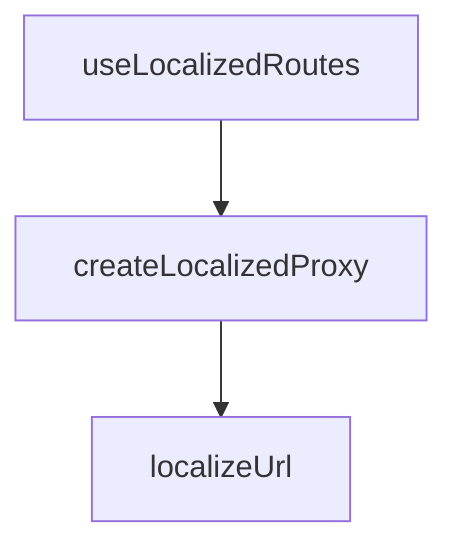

## Genel Bakış
useLocalizedRoutes hook'u, uygulama genelindeki merkezi `Routes` tanımlarını dinamik olarak o anki aktif dile (`lang`) göre yerelleştirilmiş (localized) rotalara dönüştüren akıllı bir Proxy mekanizması sunar.

## Fonksiyon Grupları
### Yardımcı Metotlar
Dil ön eki ekleme ve proxy sarmalama işlemlerini yöneten iç metotlar.
- localizeUrl
- createLocalizedProxy

### Ana Hook
Dile göre yerelleştirilmiş Routes nesnesini döndüren ana kanca.
- useLocalizedRoutes

---

## AXIOMS – Mimari Varsayımlar
Bu modülün çalışması için yerelleştirilmiş I18nProvider'ın ve merkezi rota nesnesinin erişilebilir olması gerekir.

[Aksiyom 1]: I18nProvider context yapısı erişilebilir olmalıdır, aksi takdirde aktif dil (`lang`) tespit edilemez.
[Aksiyom 2]: Admin ve API rotaları dil ön eki (`/tr` veya `/en`) almamalıdır, aksi takdirde backend entegrasyonları ve yönetim paneli kilitlenir.
[Aksiyom 3]: Zaten dil ön eki barındıran rotalar (`/tr/...` veya `/en/...`) tekrar işlenmemelidir, aksi takdirde `/en/en` gibi mükerrer dil segmentli 404 sayfaları oluşur.

---

## FONKSİYON DETAYLARI

### useLocalizedRoutes
**Ne yapar**: Aktif dil context'ine duyarlı, yerelleştirilmiş bir Routes proxy nesnesi döner.  
**Nasıl yapar**: `useI18n()` hook'u üzerinden aktif dili okur ve `createLocalizedProxy` fonksiyonunu kullanarak `Routes` nesnesini bu dile göre sarmalar.  
**Dönüş**: Yerelleştirilmiş rota fonksiyonlarını içeren dinamik Proxy nesnesi.

---

## TYPE ALIASES

### RouteFunction
```typescript
type RouteFunction = (...args: unknown[]) => string
```

---

## AST POINTERS

### [N1_NASIL] AST Pointer: src/hooks/useLocalizedRoutes.ts::useLocalizedRoutes
- **ic_degiskenler**:
  - `lang` — useI18n kancası üzerinden okunan aktif dil ön eki.
- **Dönüş**: Proxy<Routes>

---


## MERMAID CALL GRAPH


## NODE ID STANDARD

  file: src\hooks\useLocalizedRoutes.ts
  function: src\hooks\useLocalizedRoutes.ts::localizeUrl
  function: src\hooks\useLocalizedRoutes.ts::createLocalizedProxy
  function: src\hooks\useLocalizedRoutes.ts::useLocalizedRoutes

---

## DISA AKTARILANLAR (EXPORTS)
  export: createLocalizedProxy
  export: localizeUrl
  export: useLocalizedRoutes