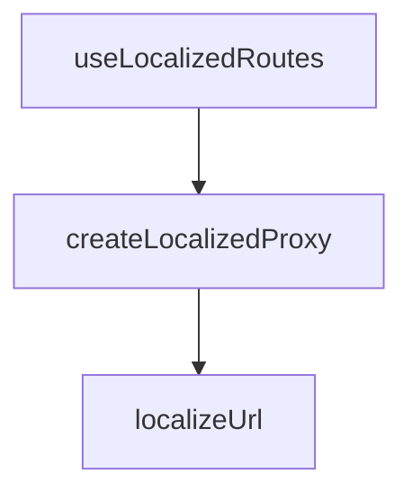

## Genel Bakış
Bu modül, uygulama içindeki merkezi rota tanımlarını o anki aktif dile göre otomatik olarak dönüştüren bir hook ve yardımcı fonksiyonlar sağlar. Temel işlevi, her dil için ayrı route tanımları oluşturmak yerine mevcut rotaları bir Proxy aracılığıyla dinamik olarak işleyerek dil ön ekleri ekleyerek URL'leri oluşturmaktır.

## Fonksiyon Grupları
### Yardımcı Fonksiyonlar
URL'leri dile göre dönüştüren ve yerelleştirilmiş bir Proxy nesnesi oluşturan yardımcı işlevleri içerir.
- localizeUrl, createLocalizedProxy

### Ana Hook
Aktif dil context'ini kullanarak yerelleştirilmiş Routes nesnesini döndüren ana React hook'u.
- useLocalizedRoutes

---

## AXIOMS – Mimari Varsayımlar
Bu modülün çalışması için yerelleştirilmiş I18nProvider'ın ve merkezi rota nesnesinin erişilebilir olması gerekir.

[Aksiyom 1]: Eğer `useLocalizedRoutes` hook'u, uygulama içinde bir React bileşeni dışından veya uygun bir Context Provider'ın altı dışında çağrılırsa, dil bilgisi (`lang`) için gerekli bağlam sağlanamaz.

[Aksiyom 2]: Eğer `createLocalizedProxy` fonksiyonuna geçilen `target` nesnesi (merkezi `Routes` nesnesi) tanımlanmamış veya null ise, proxy nesnesi oluşturulamaz ve rota erişimi çalışmaz.

[Aksiyom 3]: Eğer `localizeUrl` fonksiyonuna geçilen `url` parametresi geçerli bir rota formatına (örneğin başlangıcı `/` olan bir string) uymuyorsa, döndürülen yerelleştirilmiş URL beklenmeyen bir yapıya sahip olabilir.

[Aksiyom 4]: Eğer `localizeUrl` fonksiyonuna geçilen `lang` parametresi, uygulama tarafından desteklenen geçerli bir dil kodu (örneğin `'en'`, `'tr'`) formatında değilse, URL ön ek eklenmesi çalışmayabilir veya hata oluşabilir.

[Aksiyom 5]: Eğer `useLocalizedRoutes` hook'u, uygulamanın dil bilgisini sağlayan bir Context Provider'ın (örneğin I18nProvider) alt birimlerinde kullanılmıyorsa, hook içinde dil bilgisine erişilemez ve yerelleştirme yapılamaz.

[Aksiyom 6]: Eğer merkezi `Routes` nesnesi, `createLocalizedProxy` fonksiyonuna verilmeden önce modifiye edilmiş veya üzerine ek yapılmışsa, proxy bu değişiklikleri yansıtmaz; s

---

## FONKSİYON DETAYLARI

### localizeUrl

**Ne yapar**: Verilen URL'ye dil kodu (lang) ön ekini ekleyerek lokalize bir URL üretir. Admin ve API rotaları gibi dil gerektirmeyen yolları hariç tutar.

**Nasıl yapar**: Fonksiyon, üç aşamalı bir kontrol sırası izler. Önce URL'nin `/admin` veya `/api` ile başlayıp başlamadığını kontrol eder — bu rotalar dil segmenti almadığı için doğrudan orijinal URL döner. Ardından URL'nin zaten `/tr` veya `/en` ile başlayıp başlamadığına bakılır; böylece mükerrer dil ön eki eklenmesi engellenir. Son olarak, her iki koşul da sağlanmıyorsa URL'nin başına `${lang}` eklenir ve kök sayfa (`/`) özel olarak işlenerek çift eğik çizgi oluşumu önlenir.

**Parametreler**:
- `url` : `string` — Lokalize edilecek olan URL yolu. Örneğin `/hvac-solutions` veya `/`.
- `lang` : `string` — Hedef dil kodu. Geçerli değerler `/tr` ve `/en` önekleri ile eşleşen `"tr"` veya `"en"` gibi değerlerdir.

**Dönüş**: `string` — Dil kodu eklenmiş veya korunmuş tam lokalize URL. Örneğin `localizeUrl("/hvac-solutions", "tr")` çağrısı `"/tr/hvac-solutions"` sonucunu döndürür.

### createLocalizedProxy
**Ne yapar**: Geliştirildi ancak detay üretilemedi.

### useLocalizedRoutes
**Ne yapar**: Aktif dil context'ine duyarlı, yerelleştirilmiş bir Routes proxy nesnesi döner.  
**Nasıl yapar**: `useI18n()` hook'u üzerinden aktif dili okur ve `createLocalizedProxy` fonksiyonunu kullanarak `Routes` nesnesini bu dile göre sarmalar.  
**Dönüş**: Yerelleştirilmiş rota fonksiyonlarını içeren dinamik Proxy nesnesi.

---

## TYPE ALIASES

### RouteFunction
```typescript
type RouteFunction = (...args: unknown[]) => string
```

---

## AST POINTERS

### [N1_NASIL] AST Pointer: useLocalizedRoutes.ts::localizeUrl
- **params**: `(url: string, lang: string)`
- **ic_degiskenler**: (yok)
- **Dönüş**: `string` — Dil segmenti eklenmiş veya korunmuş URL'yi döndürür

### [N2_NASIL] AST Pointer: useLocalizedRoutes.ts::createLocalizedProxy
- **params**: `(target: T, lang: string)`
- **ic_degiskenler**:
  - `target` — Localization uygulanacak orijinal nesne
  - `lang` — Hedef dil kodu (örn: 'tr', 'en')
- **Dönüş**: `T` — Localization proxy'si sarılmış nesne

### [N3_NASIL] AST Pointer: useLocalizedRoutes.ts::useLocalizedRoutes
- **params**: (parametre yok)
- **ic_degiskenler**:
  - `lang` — useI18n() hook'undan alınan mevcut dil kodu
- **Dönüş**: yok — Localization proxy'si oluşturulup useMemo ile memoize edilmiş nesne döndürülür

---


## MERMAID CALL GRAPH


## NODE ID STANDARD

  file: src\hooks\useLocalizedRoutes.ts
  function: src\hooks\useLocalizedRoutes.ts::localizeUrl
  function: src\hooks\useLocalizedRoutes.ts::createLocalizedProxy
  function: src\hooks\useLocalizedRoutes.ts::useLocalizedRoutes

---

## DISA AKTARILANLAR (EXPORTS)
  export: createLocalizedProxy
  export: localizeUrl
  export: useLocalizedRoutes