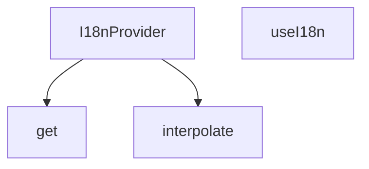

## Genel Bakış
Bu modül, Venthub HVAC platformunda React tabanlı çok dilli (uluslararasılaştırma / i18n) desteğini yöneten temel sağlayıcı modülüdür. Uygulama genelinde tüm bileşenlerin çeviri metinlerine erişmesini, dil değişikliklerini takip etmesini ve dinamik içerikli çevirileri kullanmasını sağlar. React context mimarisi üzerinden i18n işlevlerini tüm uygulamaya yayarak merkezi bir dil yönetimi sunar.

## Fonksiyon Grupları
### Çekirdek I18n Altyapısı
Uygulama genelinde çok dilli desteğin temelini oluşturan, tüm alt bileşenlerin i18n özelliklerine erişmesini sağlayan temel yapı taşlarını içerir.
- I18nProvider, useI18n

### Çeviri Metni İşleme Yardımcıları
Çeviri kaynaklarındaki metinlere güvenli erişim sağlamak ve dinamik parametreler içeren çeviri metinlerini işlemek için kullanılan yardımcı fonksiyonları barındırır.
- get, interpolate

### Dil Değişikliği İzleyici Bileşeni
URL üzerinden gelen dil kodundaki değişiklikleri takip ederek, uygulama genelinde dil güncelleme sürecini tetikleyen izleyici bileşenidir.
- LanguageUrlWatcher

---

## AXIOMS – Mimari Varsayımlar
React tabanlı uluslararasılaştırma (i18n) modülüdür, uygulama genelinde çoklu dil desteği sağlamak için tasarlanmıştır; doğru çalışması için React runtime ortamı, geçerli çeviri veri seti ve tüm prop/bağımlılıkların eksiksiz sağlanması zorunludur.

[Aksiyom 1]: Eğer React runtime ortamı sağlanmazsa, I18nProvider, useI18n gibi React bileşen ve hook'ları çalışmaz, uygulama başlatılamaz.
[Aksiyom 2]: Eğer get fonksiyonuna iletilecek geçerli çeviri sözlüğü (Dict tipindeki obj parametresi) sağlanmazsa, istenen path'teki çeviri metni getirilemez, arayüzde boş veya hatalı metinler görüntülenir.
[Aksiyom 3]: Eğer interpolate fonksiyonuna geçerli şablon string'i veya yer tutucuları doldurmak için gerekli parametre nesnesi sağlanmazsa, dinamik içerikli çeviriler doğru oluşturulamaz, arayüzde hatalı metinler görünür.
[Aksiyom 4]: Eğer LanguageUrlWatcher bileşenine iletilen onLangChange geçerli bir callback fonksiyonu değilse, dil değişikliği tetiklendiğinde bu değişiklik uygulama genelinde yayınlanamaz, seçilen dil tüm arayüze uygulanamaz.
[Aksiyom 5]: Eğer I18nProvider componentine geçerli alt ağacı temsil eden children prop'u sağlanmazsa, provider sarmaladığı uygulama içeriğini oluşturtamaz, uygulama arayüzü yüklenemez.
[Aksiyom 6]: Eğer useI18n hook'u I18nProvider ile sarmalanmamış bir React bileşeninde kullanılırsa, hook i18n bağlamına erişemez, çalışma zamanında hatası fırlatır.

---

## FONKSİYON DETAYLARI

### get
**Ne yapar**: i18n sisteminde çeviri anahtarlarına erişmek için kullanılan, verilen nesne üzerinden belirtilen yoldaki değeri çeken yardımcı fonksiyondur. Sözlük yapısındaki çeviri metinlerine hiyerarşik olarak erişim sağlayarak geliştiricilerin derinlemesine nesne yapılarında kolayca değer çekmesini mümkün kılar.
**Nasıl yapar**: Gelen path stringini hiyerarşik parçalara ayırarak sırayla nesnenin içlerine girer, en son ulaşılan değeri string formatında döndürür. Basit ama etkili bu yapıyla nokta ile ayrılmış çeviri anahtarlarının (örneğin `auth.login.title`) çözümlenmesini sağlar.
**Parametreler**:
- obj: Dict — İçinden değer çekilecek olan anahtar-değer sözlüğü, genellikle tüm çeviri metinlerini barındıran aktif dil sözlüğüdür.
- path: string — Hedef değere ulaşmak için kullanılan hiyerarşik yol, genellikle nokta ile ayrılmış bir formatta iletilir.
**Dönüş**: string — Belirtilen path üzerinden erişilen, çeviri veya ilgili metin içeren string türündeki değer.

### interpolate
**Ne yapar**: Dinamik içerik barındıran çeviri şablonlarını kullanıma hazır stringe dönüştüren yardımcı fonksiyondur. i18n sisteminde değişkenlere sahip çeviri metinlerinin (örneğin "Hoş geldin {{name}}") doldurulmasını sağlar. Sadece string birleştirme işlemi yapmaz, şablondaki tüm yer tutucuların doğru değerlerle eşleşmesini garantiler.
**Nasıl yapar**: Gelen şablon string içindeki {{key}} formatındaki yer tutucuları tespit eder, her bir yer tutucuyu params nesnesindeki karşılık gelen değerle değiştirir. Eğer params parametresi iletilmezse herhangi bir değişiklik yapmadan orijinal stringi döndürür, çalışmasını her durumda kararlı hale getirir.
**Parametreler**:
- str: string — İçinde yer tutucular barındıran ham şablon stringi, genellikle çeviri sözlüklerinden alınan ham metindir.
- params?: Record<string, unknown> — Yer tutucuları doldurmak için kullanılan anahtar-değer sözlüğü, opsiyoneldir, belirtilmediğinde şablon değişmeden döndürülür.
**Dönüş**: string — Yer tutucuları parametrelerle doldurulmuş, kullanıma hazır son string.

### I18nProvider
**Ne yapar**: Tüm i18n sistemini uygulamanın alt bileşenlerine sunan React context sağlayıcısıdır. Aktif dil ayarı, tüm çeviri sözlükleri, dil değiştirme ve çeviri çekme gibi tüm fonksiyonları saklayarak, I18nProvider ile sarmalanmış herhangi bir bileşenin bu özelliklere erişmesini sağlar. Uygulamanın kök kısmında sarmalanarak tüm sayfaların i18n sistemini kullanmasını mümkün kılar.
**Nasıl yapar**: React'in yerel context API'sini kullanarak oluşturduğu bağlamı tüm çocuk bileşenlere paylaşır, i18n ile ilgili tüm durum ve metotları tek bir merkezde yönetir. Alt bileşenler useI18n özel hooku ile bu merkezi bağlama erişerek tüm i18n özelliklerini kullanabilir.
**Parametreler**:
- children: React.ReactNode — Sağlayıcı tarafından sarmalanacak, i18n sistemine erişmesi gereken tüm alt bileşenleri ve React node'larını içerir.
**Dönüş**: React.FC<{ children: React.ReactNode }> — İçindeki tüm çocukları sarmalayan, i18n bağlamını paylaştıran React fonksiyonel bileşeni olarak döner.

### useI18n
**Ne yapar**: I18nProvider tarafından sunulan i18n bağlamına erişmek için kullanılan özel React hookudur. Herhangi bir alt bileşen içinden çağrılarak aktif dil bilgisi, çeviri metinleri çekme, dil değiştirme gibi tüm i18n özelliklerine erişim sağlar. Yalnızca I18nProvider ile sarmalanmış ağacın içindeki bileşenlerde kullanılabilir, aksi takdirde erişim hatası fırlatır.
**Nasıl yapar**: React'in yerel useContext hookunu kullanarak I18nProvider tarafından oluşturulan i18n bağlam nesnesini çeker ve kullanıcıya sunar. Geliştiricilerin bileşenlerinde i18n özelliklerini kullanmasını kolaylaştıran basit bir arayüz sunar, tüm bağlamdaki verileri ve metotları tek bir nesne altında toplar.
**Parametreler**: Herhangi bir parametre almaz.
**Dönüş**: ctx — İçinde aktif dil bilgisi, çeviri alma, dil değiştirme gibi tüm i18n ile ilgili metotları ve verileri barındıran bağlam nesnesi.

---

## INTERFACES

### I18nProviderProps
- `children: React.ReactNode`
- `lang?: Lang`
- `dictionary?: AppDictionary`

---

## TYPE ALIASES

### Dict
```typescript
type Dict = Record<string, unknown>
```

---

## AST POINTERS

### [N1_NASIL] AST Pointer: C:\Users\alize\venthub-hvac\src\i18n\I18nProvider.tsx::get
- **params**: (obj: Dict, path: string)
- **ic_degiskenler**:
  - `keys` — path string'ini noktalara göre bölerek oluşturulan nesne erişim anahtarları dizisi
  - `current` — nesne üzerinde anahtarlarla gezinirken her adımda güncel durumu tutan değişken
  - `k` — keys dizisi üzerinden döngüde işlenen sıradaki erişim anahtarı
- **Dönüş**: string

### [N2_NASIL] AST Pointer: C:\Users\alize\venthub-hvac\src\i18n\I18nProvider.tsx::interpolate
- **params**: (str: string, params?: Record<string, unknown>)
- **ic_degiskenler**:
  - `_m` — String.replace regex eşleşmesinin tam metni, kullanılmayan yer tutucu
  - `p1` — regex ile yakalanan şablon içindeki değişken adı
  - `v` — params nesnesinden p1 anahtarı ile alınan şablon değişkeninin değeri
- **Dönüş**: string

### [N3_NASIL] AST Pointer: C:\Users\alize\venthub-hvac\src\i18n\I18nProvider.tsx::LanguageUrlWatcher
- **params**: ({ onLangChange }: { onLangChange: (l: Lang) => void })
- **ic_degiskenler**:
  - `searchParams` — Next.js useSearchParams hook'u ile alınan URL arama parametreleri nesnesi
  - `fromUrl` — searchParams'tan alınan lang sorgu parametresinin değeri
- **Dönüş**: null (yok)

### [N4_NASIL] AST Pointer: C:\Users\alize\venthub-hvac\src\i18n\I18nProvider.tsx::I18nProvider
- **params**: ({ children }: { children: React.ReactNode })
- **ic_degiskenler**:
  - `lang` — useState ile yönetilen aktif dil kodu, varsayılan 'tr'
  - `setLangState` — Aktif dili güncellemek için kullanılan useState setter fonksiyonu
  - `saved` — localStorage'dan okunan önceki kullanıcı dil ayarının değeri
  - `nav` — Tarayıcının varsayılan dilini tutan, küçük harfe dönüştürülmüş navigator.language değeri
  - `setLang` — useCallback ile sarmalanmış, dışarıya sunulan dil değiştirme fonksiyonu
  - `t` — useMemo ile oluşturulmuş, çeviri almak için kullanılan fonksiyon
  - `key` — t fonksiyonunun aldığı, sözlükten erişilecek çeviri anahtarı
  - `paramsOrAlt` — t fonksiyonunun aldığı, şablon değişkenleri veya yedek çeviri metni olan opsiyonel parametre
  - `translation` — get fonksiyonu ile aktif dil sözlüğünden alınan ham çeviri metni
  - `hasTranslation` — Çeviri anahtarının sözlükte var olup olmadığını gösteren boolean değer
  - `dict` — useMemo ile oluşturulan, aktif dile ait AppDictionary tipinde tam sözlük nesnesi
  - `value` — I18nContext.Provider'a aktarılacak tüm bağlam değerlerini içeren nesne
- **Dönüş**: React.JSX.Element (Context sağlayıcısı ve alt bileşenler)

### [N5_NASIL] AST Pointer: C:\Users\alize\venthub-hvac\src\i18n\I18nProvider.tsx::useI18n
- **params**: (parametre yok)
- **ic_degiskenler**:
  - `ctx` — useContext hook'u ile erişilen I18nContext nesnesi
  - `lang` — Context yoksa varsayılan olarak atanan 'tr' dil kodu
  - `setLang` — Context yoksa boş olarak tanımlanan dil değiştirme fonksiyonu
  - `t` — Context yoksa tanımlanan yedek çeviri fonksiyonu
  - `key` — Yedek t fonksiyonunun aldığı çeviri anahtarı
  - `paramsOrAlt` — Yedek t fonksiyonunun aldığı yedek metin veya parametre olan opsiyonel değer
  - `dict` — Context yoksa varsayılan olarak atanan Türkçe sözlük nesnesi
- **Dönüş**: I18nContext değeri veya context yoksa varsayılan yedek nesne

---


## MERMAID CALL GRAPH


## NODE ID STANDARD

  file: src\i18n\I18nProvider.tsx
  function: src\i18n\I18nProvider.tsx::get
  function: src\i18n\I18nProvider.tsx::interpolate
  function: src\i18n\I18nProvider.tsx::I18nProvider
  function: src\i18n\I18nProvider.tsx::useI18n

---

## DISA AKTARILANLAR (EXPORTS)
  export: I18nProvider
  export: get
  export: interpolate
  export: useI18n

---

## STİL TOKENLERİ

### Arbitrary Değerler (token'a geçirilmemiş)
Yok — tüm stiller token'a geçirilmiş. ✅

### Kullanılan Token'lar (zaten token'a geçirilmiş)
- (yok)

### Tailwind Sınıf Özeti
- **Renkler:** (yok)
- **Layout:** (yok)
- **Varyant/Responsive:** (yok)
- **Yardımcı Sınıflar:** (yok)