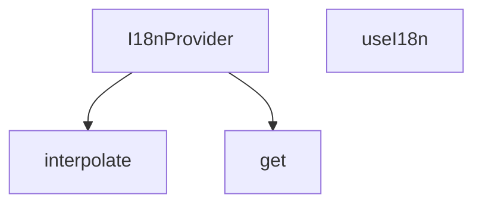

## Genel Bakış
React uygulamalarında çok dilli (uluslararasılaştırma) desteğini merkezi olarak yöneten bir sağlayıcı modülüdür. Çeviri sözlüklerinden iç içe anahtarlarla değer okunmasını, dinamik parametrelerle metin kalıplarının doldurulmasını ve React context aracılığıyla tüm bileşenlere dil bağlamının dağıtılmasını sağlar.

## Fonksiyon Grupları

### Bağlam Sağlayıcıları (Context Providers)
Uygulama ağaçının üst seviyelerinde çeviri sözlüğünü ve aktif dili barındırarak tüm alt bileşenlere i18n bağlamını dağıtır. Bileşenler bu bağlama bir hook ile erişir.
- I18nProvider, useI18n

### Çeviri Araç Fonksiyonları (Translation Utilities)
Sözlük objelerinden iç içe anahtar yollarıyla güvenli değer okumasını ve çeviri metinlerindeki yer tutucuları dinamik parametrelerle değiştirmeyi sağlar.
- get, interpolate

---

## AXIOMS – Mimari Varsayımlar

Bu modül, React tabanlı uygulamalarda uluslararasılaştırma (i18n) altyapısını sağlar. Aşağıdaki varsayımlar yalnızca fonksiyon imzalarından türetilmiştir.

**[Aksiyom 1]:** `useI18n()` bir `I18nProvider` bileşeninin alt ağacı içinde çağrılmazsa, geçerli bir React Context mevcut değildir ve hook hatalı çalışır.

**[Aksiyom 2]:** `I18nProvider` bileşeni `dictionary` parametresi sağlanmadan çağrılırsa, çeviri sözlüğü boş olur ve tüm dil anahtarı çözümlenemeyen (undefined) değerler döner.

**[Aksiyom 3]:** `get(obj, path)` fonksiyonunda `obj` parametresi geçerli bir sözlük (Dict) yapısı değilse veya `path` string'i bu sözlük hiyerarşisinde var olmayan bir yola karşılık geliyorsa, fonksiyon `undefined` veya fallback bir değer döner; hata fırlatmaz.

**[Aksiyom 4]:** `interpolate(str, params)` fonksiyonunda `str` içindeki yer tutucu token'ları (değişken adları) `params` nesnesinin anahtarlarıyla eşleşmezse veya `params` hiç sağlanmazsa, yer tutucular değiştirilmeden olduğu gibi kalır; fırlatılan bir hata yoktur.

**[Aksiyom 5]:** `I18nProvider` bileşeni `initialLang` parametresi ile hangi dilin aktif olacağını belirler; `dictionary` yapısının bu dil anahtarını (örn. `"tr"`, `"en"`) içermesi gerekir. Aksi takdirde o dil için çeviri anahtarı çözümlemesi başarısız olur.

**[Aksiyom 6]:** `get(obj, path)` fonksiyonunun `path` parametresi için kullanacağı ayrıştırma (parse) stratejisi bilinmiyor —点 (dot) notasyonu, bracket notasyonu veya her ikisi birden olabilir; imza içerisinden bu ayrım çıkarılamamaktadır.

---

## FONKSİYON DETAYLARI

### get
**Ne yapar**: i18n sisteminde çeviri anahtarlarına erişmek için kullanılan, verilen nesne üzerinden belirtilen yoldaki değeri çeken yardımcı fonksiyondur. Sözlük yapısındaki çeviri metinlerine hiyerarşik olarak erişim sağlayarak geliştiricilerin derinlemesine nesne yapılarında kolayca değer çekmesini mümkün kılar.
**Nasıl yapar**: Gelen path stringini hiyerarşik parçalara ayırarak sırayla nesnenin içlerine girer, en son ulaşılan değeri string formatında döndürür. Basit ama etkili bu yapıyla nokta ile ayrılmış çeviri anahtarlarının (örneğin `auth.login.title`) çözümlenmesini sağlar.
**Parametreler**:
- obj: Dict — İçinden değer çekilecek olan anahtar-değer sözlüğü, genellikle tüm çeviri metinlerini barındıran aktif dil sözlüğüdür.
- path: string — Hedef değere ulaşmak için kullanılan hiyerarşik yol, genellikle nokta ile ayrılmış bir formatta iletilir.
**Dönüş**: string — Belirtilen path üzerinden erişilen, çeviri veya ilgili metin içeren string türündeki değer.

### interpolate
**Ne yapar**: Dinamik içerik barındıran çeviri şablonlarını kullanıma hazır stringe dönüştüren yardımcı fonksiyondur. i18n sisteminde değişkenlere sahip çeviri metinlerinin (örneğin "Hoş geldin {{name}}") doldurulmasını sağlar. Sadece string birleştirme işlemi yapmaz, şablondaki tüm yer tutucuların doğru değerlerle eşleşmesini garantiler.
**Nasıl yapar**: Gelen şablon string içindeki {{key}} formatındaki yer tutucuları tespit eder, her bir yer tutucuyu params nesnesindeki karşılık gelen değerle değiştirir. Eğer params parametresi iletilmezse herhangi bir değişiklik yapmadan orijinal stringi döndürür, çalışmasını her durumda kararlı hale getirir.
**Parametreler**:
- str: string — İçinde yer tutucular barındıran ham şablon stringi, genellikle çeviri sözlüklerinden alınan ham metindir.
- params?: Record<string, unknown> — Yer tutucuları doldurmak için kullanılan anahtar-değer sözlüğü, opsiyoneldir, belirtilmediğinde şablon değişmeden döndürülür.
**Dönüş**: string — Yer tutucuları parametrelerle doldurulmuş, kullanıma hazır son string.

### I18nProvider
**Ne yapar**: Tüm i18n sistemini uygulamanın alt bileşenlerine sunan React context sağlayıcısıdır. Aktif dil ayarı, tüm çeviri sözlükleri, dil değiştirme ve çeviri çekme gibi tüm fonksiyonları saklayarak, I18nProvider ile sarmalanmış herhangi bir bileşenin bu özelliklere erişmesini sağlar. Uygulamanın kök kısmında sarmalanarak tüm sayfaların i18n sistemini kullanmasını mümkün kılar.
**Nasıl yapar**: React'in yerel context API'sini kullanarak oluşturduğu bağlamı tüm çocuk bileşenlere paylaşır, i18n ile ilgili tüm durum ve metotları tek bir merkezde yönetir. Alt bileşenler useI18n özel hooku ile bu merkezi bağlama erişerek tüm i18n özelliklerini kullanabilir.
**Parametreler**:
- children: React.ReactNode — Sağlayıcı tarafından sarmalanacak, i18n sistemine erişmesi gereken tüm alt bileşenleri ve React node'larını içerir.
**Dönüş**: React.FC<{ children: React.ReactNode }> — İçindeki tüm çocukları sarmalayan, i18n bağlamını paylaştıran React fonksiyonel bileşeni olarak döner.

### useI18n

**Ne yapar**: React bileşenleri içinde internationalization (uluslararasılaşma) bağlamına erişmek için özel bir hook sağlar. Uygulama genelinde dil tercihini okumak ve çeviri fonksiyonuna erişmek amacıyla kullanılır.

**Nasıl yapar**: `useContext` hook'u ile `I18nContext` değerini alır. Eğer bu hook bir sağlayıcı (Provider) dışında çağrılıyorsa veya bağlam henüz hazırlanmamışsa, uygulamanın çökmemesi için varsayılan Türkçe değerler döner. Bu sayede bileşenler her durumda güvenli bir şekilde çeviri fonksiyonlarını ve dil bilgisini kullanabilir.

**Parametreler**:

Bu fonksiyon herhangi bir parametre almaz.

**Dönüş**:

`{ lang: Lang, setLang: () => void, t: (key: TranslationKeyInput, paramsOrAlt?: Record<string, unknown> | string) => string, dict: AppDictionary }` — Dil bilgisini, dil değiştirme fonksiyonunu, çeviri fonksiyonunu ve sözlük nesnesini içeren bir nesne döner. Context mevcut değilse varsayılan değerler şunlardır:

- `lang`: `'tr'` olarak ayarlanmıştır, yani Türkçe
- `setLang`: Boş bir ok-fonksiyonudur, hiçbir işlem yapmaz
- `t`: Verilen çeviri anahtarını döndürür; eğer ikinci parametre bir string ise alternatif metni döndürür, bir nesne ise anahtarın kendisini döndürür
- `dict`: Türkçe (`tr`) sözlük nesnesi olarak ayarlanmıştır

---

## INTERFACES

### I18nProviderProps
- `children: React.ReactNode`
- `lang?: Lang`
- `dictionary?: AppDictionary`

---

## TYPE ALIASES

### Dict
```typescript
type Dict = Record<string, unknown>
```

---

## AST POINTERS

### [N1_NASIL] AST Pointer: I18nProvider.tsx::get
- **params**: `(obj: Dict, path: string)`
- **ic_degiskenler**:
  - `keys` — path.split('.') ile oluşturulan, nokta ile ayrılmış anahtar dizisi
  - `current` — traversal sırasında mevcut değeri tutan değişken
  - `k` — for döngüsündeki her bir anahtar (keys array'inden gelen eleman)
- **Dönüş**: `string` — bulunursa value, bulunamazsa path

### [N2_NASIL] AST Pointer: I18nProvider.tsx::interpolate
- **params**: `(str: string, params?: Record<string, unknown>)`
- **ic_degiskenler**:
  - `_m` — regex replace callback'indeki tam eşleşen string
  - `p1` — regex ile yakalanan anahtar adı (word grubu)
  - `v` — params[p1] erişiminden elde edilen değer
- **Dönüş**: `string` — parametrelerle değiştirilmiş string

### [N3_NASIL] AST Pointer: I18nProvider.tsx::I18nProvider
- **params**: `({ children, lang: initialLang, dictionary })`
- **ic_degiskenler**:
  - `lang` — mevcut dil state'i, useState ile yönetilir
  - `setLangState` — useState'ten dönen state setter fonksiyonu
  - `saved` — localStorage'dan okunan kayıtlı dil değeri
  - `nav` — navigator.language değerinin lowercased hali
  - `setLang` — React.useCallback ile memoize edilmiş dil değiştirme fonksiyonu
  - `currentDict` — dictionary prop'u veya DICTS[lang] sözlüğü
  - `translation` — get fonksiyonu ile bulunmuş çeviri stringi
  - `hasTranslation` — çeviri bulunup bulunmadığını belirleyen boolean
  - `dict` — useMemo ile memoize edilmiş sözlük
  - `value` — useMemo ile memoize edilmiş context value nesnesi
- **Dönüş**: JSX.Provider — I18nContext.Provider ile sarmalanmış children

### [N4_NASIL] AST Pointer: I18nProvider.tsx::useI18n
- **params**: yok
- **ic_degiskenler**:
  - `ctx` — useContext(I18nContext) ile alınan context değeri
- **Dönüş**: `{ lang, setLang, t, dict }` veya fallback nesnesi

---


## MERMAID CALL GRAPH


## NODE ID STANDARD

  file: src\i18n\I18nProvider.tsx
  function: src\i18n\I18nProvider.tsx::get
  function: src\i18n\I18nProvider.tsx::interpolate
  function: src\i18n\I18nProvider.tsx::I18nProvider
  function: src\i18n\I18nProvider.tsx::useI18n

---

## DISA AKTARILANLAR (EXPORTS)
  export: I18nProvider
  export: get
  export: interpolate
  export: useI18n

---

## STİL TOKENLERİ

### Arbitrary Değerler (token'a geçirilmemiş)
Yok — tüm stiller token'a geçirilmiş. ✅

### Kullanılan Token'lar (zaten token'a geçirilmiş)
- (yok)

### Tailwind Sınıf Özeti
- **Renkler:** (yok)
- **Layout:** (yok)
- **Varyant/Responsive:** (yok)
- **Yardımcı Sınıflar:** (yok)