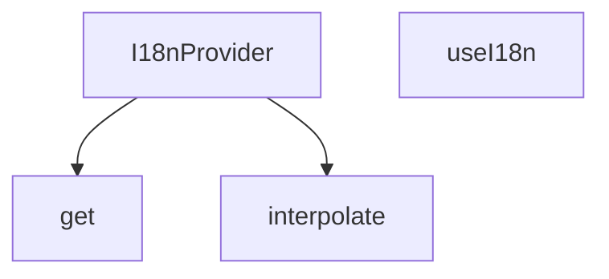

## Genel Bakış
Bu modül, React uygulamalarında çok dilli (uluslararasılaştırma) desteğini yönetmek için kullanılan temel i18n altyapısını sunar. Çeviri sözlüklerinden güvenli erişim, dinamik parametrelerle metin interpolasyonu ve React context aracılığıyla bileşenlere dil desteği dağıtma gibi temel işlemleri merkezi olarak yönetir.

## Fonksiyon Grupları

### Çekirdek I18n Altyapısı
Uygulama genelinde çeviri bağlamının (context) oluşturulmasını ve bileşenlerin bu bağlama erişmesini sağlayan React tabanlı yapı taşlarını içerir.
- I18nProvider, useI18n

### Çeviri Metni Yardımcıları
Çeviri sözlüklerinden iç içe anahtarlarla değer almayı ve dinamik parametrelerle metin kalıplarını doldurmayı sağlayan yardımcı işlevleri kapsar.
- get, interpolate

---

## AXIOMS – Mimari Varsayımlar

Bu modül, React context tabanlı bir i18n (uluslararasılaştırma) sağlayıcısıdır. Aşağıdaki mimari varsayımlar fonksiyon imzalarından türetilmiştir.

**[Aksiyom 1]**: Eğer `useI18n()` bir `I18nProvider` üst bileşeninin dışında (ancestor zincirinde yer almıyorsa) çağrılırsa, React context'ten değer okunamaz ve hook hata/fail verir.

**[Aksiyom 2]**: Eğer `I18nProvider`'a verilen `dictionary`, `get(obj, path)` fonksiyonunun beklediği hiyerarşik yapıya (üst seviye anahtar dil kodları, iç içe çeviri anahtarları) sahip değilse, çeviri aramaları başarısız olur ve `undefined` döner.

**[Aksiyom 3]**: Eğer `I18nProvider`'a geçirilen `lang` (initialLang) değeri, `dictionary` objesinde tanımlı bir dil anahtarı değilse, geçerli bir çeviri bulunamaz ve boş/hata çıktısı üretilir.

**[Axiom 4]**: Eğer `interpolate(str, params)` çağrısındaki `params` içindeki anahtarlar, `str` içindeki yer tutucu desenleriyle (örn. `{{key}}`) eşleşmiyorsa, yer tutucuların hiçbiri değiştirilmez ve ham string geri döner.

**[Axiom 5]**: Eğer `get(obj, path)` çağrısındaki `path` (dot-notation), `obj` içinde geçerli bir yolu temsil etmiyorsa, fonksiyon `undefined` döner; modül bu durumda bir fırlatma (throw) yapmaz.

---

*Not: Bu modülde tanımlı sabit (constant) bulunmamaktadır. Eşik değer, domain-specific kural veya varsayılan parametre değeri fonksiyon imzalarında belirtilmemiştir; bu nedenle uydurulmamıştır.*

---

## FONKSİYON DETAYLARI

### get
**Ne yapar**: i18n sisteminde çeviri anahtarlarına erişmek için kullanılan, verilen nesne üzerinden belirtilen yoldaki değeri çeken yardımcı fonksiyondur. Sözlük yapısındaki çeviri metinlerine hiyerarşik olarak erişim sağlayarak geliştiricilerin derinlemesine nesne yapılarında kolayca değer çekmesini mümkün kılar.
**Nasıl yapar**: Gelen path stringini hiyerarşik parçalara ayırarak sırayla nesnenin içlerine girer, en son ulaşılan değeri string formatında döndürür. Basit ama etkili bu yapıyla nokta ile ayrılmış çeviri anahtarlarının (örneğin `auth.login.title`) çözümlenmesini sağlar.
**Parametreler**:
- obj: Dict — İçinden değer çekilecek olan anahtar-değer sözlüğü, genellikle tüm çeviri metinlerini barındıran aktif dil sözlüğüdür.
- path: string — Hedef değere ulaşmak için kullanılan hiyerarşik yol, genellikle nokta ile ayrılmış bir formatta iletilir.
**Dönüş**: string — Belirtilen path üzerinden erişilen, çeviri veya ilgili metin içeren string türündeki değer.

### interpolate
**Ne yapar**: Dinamik içerik barındıran çeviri şablonlarını kullanıma hazır stringe dönüştüren yardımcı fonksiyondur. i18n sisteminde değişkenlere sahip çeviri metinlerinin (örneğin "Hoş geldin {{name}}") doldurulmasını sağlar. Sadece string birleştirme işlemi yapmaz, şablondaki tüm yer tutucuların doğru değerlerle eşleşmesini garantiler.
**Nasıl yapar**: Gelen şablon string içindeki {{key}} formatındaki yer tutucuları tespit eder, her bir yer tutucuyu params nesnesindeki karşılık gelen değerle değiştirir. Eğer params parametresi iletilmezse herhangi bir değişiklik yapmadan orijinal stringi döndürür, çalışmasını her durumda kararlı hale getirir.
**Parametreler**:
- str: string — İçinde yer tutucular barındıran ham şablon stringi, genellikle çeviri sözlüklerinden alınan ham metindir.
- params?: Record<string, unknown> — Yer tutucuları doldurmak için kullanılan anahtar-değer sözlüğü, opsiyoneldir, belirtilmediğinde şablon değişmeden döndürülür.
**Dönüş**: string — Yer tutucuları parametrelerle doldurulmuş, kullanıma hazır son string.

### I18nProvider
**Ne yapar**: Tüm i18n sistemini uygulamanın alt bileşenlerine sunan React context sağlayıcısıdır. Aktif dil ayarı, tüm çeviri sözlükleri, dil değiştirme ve çeviri çekme gibi tüm fonksiyonları saklayarak, I18nProvider ile sarmalanmış herhangi bir bileşenin bu özelliklere erişmesini sağlar. Uygulamanın kök kısmında sarmalanarak tüm sayfaların i18n sistemini kullanmasını mümkün kılar.
**Nasıl yapar**: React'in yerel context API'sini kullanarak oluşturduğu bağlamı tüm çocuk bileşenlere paylaşır, i18n ile ilgili tüm durum ve metotları tek bir merkezde yönetir. Alt bileşenler useI18n özel hooku ile bu merkezi bağlama erişerek tüm i18n özelliklerini kullanabilir.
**Parametreler**:
- children: React.ReactNode — Sağlayıcı tarafından sarmalanacak, i18n sistemine erişmesi gereken tüm alt bileşenleri ve React node'larını içerir.
**Dönüş**: React.FC<{ children: React.ReactNode }> — İçindeki tüm çocukları sarmalayan, i18n bağlamını paylaştıran React fonksiyonel bileşeni olarak döner.

### useI18n

**Ne yapar**: React bileşenleri içinde internationalization (uluslararasılaşma) bağlamına erişmek için özel bir hook sağlar. Uygulama genelinde dil tercihini okumak ve çeviri fonksiyonuna erişmek amacıyla kullanılır.

**Nasıl yapar**: `useContext` hook'u ile `I18nContext` değerini alır. Eğer bu hook bir sağlayıcı (Provider) dışında çağrılıyorsa veya bağlam henüz hazırlanmamışsa, uygulamanın çökmemesi için varsayılan Türkçe değerler döner. Bu sayede bileşenler her durumda güvenli bir şekilde çeviri fonksiyonlarını ve dil bilgisini kullanabilir.

**Parametreler**:

Bu fonksiyon herhangi bir parametre almaz.

**Dönüş**:

`{ lang: Lang, setLang: () => void, t: (key: TranslationKeyInput, paramsOrAlt?: Record<string, unknown> | string) => string, dict: AppDictionary }` — Dil bilgisini, dil değiştirme fonksiyonunu, çeviri fonksiyonunu ve sözlük nesnesini içeren bir nesne döner. Context mevcut değilse varsayılan değerler şunlardır:

- `lang`: `'tr'` olarak ayarlanmıştır, yani Türkçe
- `setLang`: Boş bir ok-fonksiyonudur, hiçbir işlem yapmaz
- `t`: Verilen çeviri anahtarını döndürür; eğer ikinci parametre bir string ise alternatif metni döndürür, bir nesne ise anahtarın kendisini döndürür
- `dict`: Türkçe (`tr`) sözlük nesnesi olarak ayarlanmıştır

---

## INTERFACES

### I18nProviderProps
- `children: React.ReactNode`
- `lang?: Lang`
- `dictionary?: AppDictionary`

---

## TYPE ALIASES

### Dict
```typescript
type Dict = Record<string, unknown>
```

---

## AST POINTERS

### [N1_NASIL] AST Pointer: i18n/I18nProvider.tsx::get
- **params**: `(obj: Dict, path: string)`
- **ic_degiskenler**:
  - `keys` — path.split('.') ile elde edilen noktayla ayrılmış anahtarlar dizisi
  - `current` — döngü içinde mevcut seviyedeki değeri tutan değişken, başlangıçta `obj`'ye eşit
  - `k` — for döngüsünde her bir anahtarı temsil eden döngü değişkeni
- **Dönüş**: `string`

### [N2_NASIL] AST Pointer: i18n/I18nProvider.tsx::interpolate
- **params**: `(str: string, params?: Record<string, unknown>)`
- **ic_degiskenler**: (yok)
- **Dönüş**: `string`

### [N3_NASIL] AST Pointer: i18n/I18nProvider.tsx::I18nProvider
- **params**: `({ children, lang: initialLang, dictionary })`
- **ic_degiskenler**:
  - `lang` — useState ile tanımlanan mevcut dil durumu, başlangıçta `initialLang || 'tr'`
  - `setLangState` — useState'ten dönen dil durumunu güncellemek için fonksiyon
  - `saved` — localStorage'dan okunan kayıtlı dil tercihi
  - `nav` — `navigator.language` değerinin küçük harfli versiyonu
  - `setLang` — React.useCallback ile tanımlanan, dil durumunu güncellemek için kararlı fonksiyon
  - `currentDict` — `dictionary` prop'u veya `DICTS[lang]` sözlüğü
  - `translation` — `get()` ile anahtar karşılığı alınan çeviri metni
  - `hasTranslation` — çevirinin anahtarla aynı olup olmadığını kontrol eden mantıksal değişken
  - `v` — replace fonksiyonundaki geri çağırma ile elde edilen parametre değeri
  - `dict` — useMemo ile hesaplanan mevcut sözlük
  - `value` — useMemo ile hesaplanan context değeri
- **Dönüş**: `React.FC<I18nProviderProps>` (JSX Element)

### [N4_NASIL] AST Pointer: i18n/I18nProvider.tsx::useI18n
- **params**: (yok)
- **ic_degiskenler**:
  - `ctx` — I18nContext'ten alınan context değeri
- **Dönüş**: `{ lang: Lang, setLang: (l: Lang) => void, t: (key: TranslationKeyInput, paramsOrAlt?: Record<string, unknown> | string) => string, dict: AppDictionary }`

---


## MERMAID CALL GRAPH


## NODE ID STANDARD

  file: src\i18n\I18nProvider.tsx
  function: src\i18n\I18nProvider.tsx::get
  function: src\i18n\I18nProvider.tsx::interpolate
  function: src\i18n\I18nProvider.tsx::I18nProvider
  function: src\i18n\I18nProvider.tsx::useI18n

---

## DISA AKTARILANLAR (EXPORTS)
  export: I18nProvider
  export: get
  export: interpolate
  export: useI18n

---

## STİL TOKENLERİ

### Arbitrary Değerler (token'a geçirilmemiş)
Yok — tüm stiller token'a geçirilmiş. ✅

### Kullanılan Token'lar (zaten token'a geçirilmiş)
- (yok)

### Tailwind Sınıf Özeti
- **Renkler:** (yok)
- **Layout:** (yok)
- **Varyant/Responsive:** (yok)
- **Yardımcı Sınıflar:** (yok)