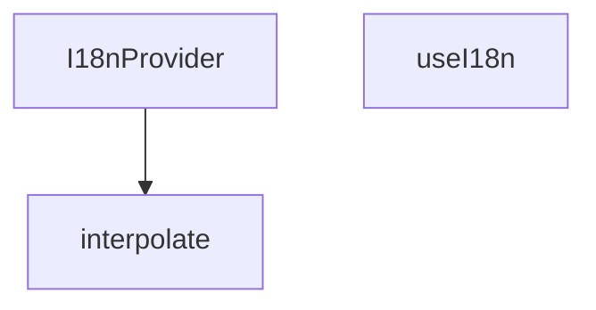

## Genel Bakış
React tabanlı uygulamalarda çok dilli (uluslararasılaştırma) desteğini merkezi olarak yöneten bir sağlayıcı modülüdür. Çeviri sözlüklerinden metinlerin okunmasını, dinamik parametrelerle metin kalıplarının doldurulmasını ve React context aracılığıyla tüm bileşenlere dil bağlamının dağıtılmasını sağlar.

## Fonksiyon Grupları
### Bağlam Sağlayıcıları
Uygulama ağaçının üst seviyelerinde çeviri sözlüğünü ve aktif dili barındırarak tüm alt bileşenlere i18n bağlamını dağıtır. Bileşenler bu bağlama bir hook ile erişir.
- I18nProvider, useI18n

### Çeviri Araç Fonksiyonları
Çeviri metinlerindeki yer tutucuları (örneğin `{name}`) dinamik parametrelerle değiştirerek_personalize edilmiş metinlerin üretilmesini sağlar.
- interpolate

---

## AXIOMS – Mimari Varsayımlar

Bu modül, React Context tabanlı bir uluslararasılaştırma (i18n) sağlayıcısıdır. Aşağıdaki mimari varsayımlar fonksiyon imzalarından çıkarılmıştır.

[Aksiyom 1]: Eğer `useI18n` hook'u `I18nProvider` bileşeninin alt ağaç dışında bir yerde çağrılırsa, bağlam değeri (`undefined` veya varsayılan) döner ve çeviri erişimi çalışması olası değildir.

[Aksiyom 2]: Eğer `I18nProvider` bileşenine `dictionary` parametresi olarak geçilen değer, iç içe anahtar yapısını desteklemeyen bir yapıda olursa, iç içe anahtarlı erişim (örn: `"navigation.home.title"`) sonuç üretemez.

[Aksiyom 3]: Eğer `interpolate` fonksiyonuna bir `str` parametresi geçilmezse, fonksiyon geçersiz duruma düşer (`str` zorunlu parametredir).

[Aksiyom 4]: Eğer `interpolate` fonksiyonuna verilen `str` içindeki yer tutucu (placeholder) anahtarları, `params` nesnesinde tanımlı değilse, yer tutucular oldukları gibi (doldurulmamış olarak) dönen string içinde kalır.

[Aksiyom 5]: Eğer `I18nProvider` bileşenine `lang` parametresi geçilmezse, başlangıç dilinin ne olacağı fonksiyon imzasından bilinmemektedir (varsayılan bir değer tanımlı değildir).

[Aksiyom 6]: Eğer `useI18n` hook'u çağrı anında geçerli bir `React.Context` sağlayıcısı (I18nProvider) altında değilse, React çalışma zamanı hata fırlatır.

---

## FONKSİYON DETAYLARI

### interpolate
**Ne yapar**: Dinamik içerik barındıran çeviri şablonlarını kullanıma hazır stringe dönüştüren yardımcı fonksiyondur. i18n sisteminde değişkenlere sahip çeviri metinlerinin (örneğin "Hoş geldin {{name}}") doldurulmasını sağlar. Sadece string birleştirme işlemi yapmaz, şablondaki tüm yer tutucuların doğru değerlerle eşleşmesini garantiler.
**Nasıl yapar**: Gelen şablon string içindeki {{key}} formatındaki yer tutucuları tespit eder, her bir yer tutucuyu params nesnesindeki karşılık gelen değerle değiştirir. Eğer params parametresi iletilmezse herhangi bir değişiklik yapmadan orijinal stringi döndürür, çalışmasını her durumda kararlı hale getirir.
**Parametreler**:
- str: string — İçinde yer tutucular barındıran ham şablon stringi, genellikle çeviri sözlüklerinden alınan ham metindir.
- params?: Record<string, unknown> — Yer tutucuları doldurmak için kullanılan anahtar-değer sözlüğü, opsiyoneldir, belirtilmediğinde şablon değişmeden döndürülür.
**Dönüş**: string — Yer tutucuları parametrelerle doldurulmuş, kullanıma hazır son string.

### I18nProvider
**Ne yapar**: Tüm i18n sistemini uygulamanın alt bileşenlerine sunan React context sağlayıcısıdır. Aktif dil ayarı, tüm çeviri sözlükleri, dil değiştirme ve çeviri çekme gibi tüm fonksiyonları saklayarak, I18nProvider ile sarmalanmış herhangi bir bileşenin bu özelliklere erişmesini sağlar. Uygulamanın kök kısmında sarmalanarak tüm sayfaların i18n sistemini kullanmasını mümkün kılar.
**Nasıl yapar**: React'in yerel context API'sini kullanarak oluşturduğu bağlamı tüm çocuk bileşenlere paylaşır, i18n ile ilgili tüm durum ve metotları tek bir merkezde yönetir. Alt bileşenler useI18n özel hooku ile bu merkezi bağlama erişerek tüm i18n özelliklerini kullanabilir.
**Parametreler**:
- children: React.ReactNode — Sağlayıcı tarafından sarmalanacak, i18n sistemine erişmesi gereken tüm alt bileşenleri ve React node'larını içerir.
**Dönüş**: React.FC<{ children: React.ReactNode }> — İçindeki tüm çocukları sarmalayan, i18n bağlamını paylaştıran React fonksiyonel bileşeni olarak döner.

### useI18n

**Ne yapar**: React bileşenleri içinde internationalization (uluslararasılaşma) bağlamına erişmek için özel bir hook sağlar. Uygulama genelinde dil tercihini okumak ve çeviri fonksiyonuna erişmek amacıyla kullanılır.

**Nasıl yapar**: `useContext` hook'u ile `I18nContext` değerini alır. Eğer bu hook bir sağlayıcı (Provider) dışında çağrılıyorsa veya bağlam henüz hazırlanmamışsa, uygulamanın çökmemesi için varsayılan Türkçe değerler döner. Bu sayede bileşenler her durumda güvenli bir şekilde çeviri fonksiyonlarını ve dil bilgisini kullanabilir.

**Parametreler**:

Bu fonksiyon herhangi bir parametre almaz.

**Dönüş**:

`{ lang: Lang, setLang: () => void, t: (key: TranslationKeyInput, paramsOrAlt?: Record<string, unknown> | string) => string, dict: AppDictionary }` — Dil bilgisini, dil değiştirme fonksiyonunu, çeviri fonksiyonunu ve sözlük nesnesini içeren bir nesne döner. Context mevcut değilse varsayılan değerler şunlardır:

- `lang`: `'tr'` olarak ayarlanmıştır, yani Türkçe
- `setLang`: Boş bir ok-fonksiyonudur, hiçbir işlem yapmaz
- `t`: Verilen çeviri anahtarını döndürür; eğer ikinci parametre bir string ise alternatif metni döndürür, bir nesne ise anahtarın kendisini döndürür
- `dict`: Türkçe (`tr`) sözlük nesnesi olarak ayarlanmıştır

---

## İTHALATLAR (IMPORTS)
- import: ./I18nContext::I18nContext
- import: ./I18nContext::type AppDictionary
- import: ./I18nContext::type Lang
- import: ./I18nContext::type TranslationKeyInput
- import: ./dictionaries/en::en
- import: ./dictionaries/tr::tr
- import: ./getDictValue::getDictValue
- import: react::React
- import: react::useContext
- import: react::useEffect
- import: react::useMemo
- import: react::useState

---

## INTERFACES

### I18nProviderProps
- `children: React.ReactNode`
- `lang?: Lang`
- `dictionary?: AppDictionary`

---

## TYPE ALIASES

### Dict
```typescript
type Dict = Record<string, unknown>
```

---

## AST POINTERS

### [N1_NASIL] AST Pointer: I18nProvider.tsx::interpolate
- **params**: `(str: string, params?: Record<string, unknown>)`
- **ic_degiskenler**:
  - `_m` — regex replace callback'inde eşleşen tam kalıp metni (kullanılmıyor, placeholder)
  - `p1` — regex grubundan yakalanan parametre adı (ör: `{{ name }}` → `"name"`)
  - `v` — `params` dict'inden `p1` anahtarıyla erişilen değer
- **Dönüş**: `string` — şablon içindeki `{{ parametre }}`lerin değerlerle değiştirilmiş hali; parametre bulunamazsa boş string

---


## MERMAID CALL GRAPH


## NODE ID STANDARD

  file: src\i18n\I18nProvider.tsx
  function: src\i18n\I18nProvider.tsx::interpolate
  function: src\i18n\I18nProvider.tsx::I18nProvider
  function: src\i18n\I18nProvider.tsx::useI18n

---

## DISA AKTARILANLAR (EXPORTS)
  export: I18nProvider
  export: interpolate
  export: useI18n

---

## STİL TOKENLERİ

### Arbitrary Değerler (token'a geçirilmemiş)
Yok — tüm stiller token'a geçirilmiş. ✅

### Kullanılan Token'lar (zaten token'a geçirilmiş)
- (yok)

### Tailwind Sınıf Özeti
- **Renkler:** (yok)
- **Layout:** (yok)
- **Varyant/Responsive:** (yok)
- **Yardımcı Sınıflar:** (yok)