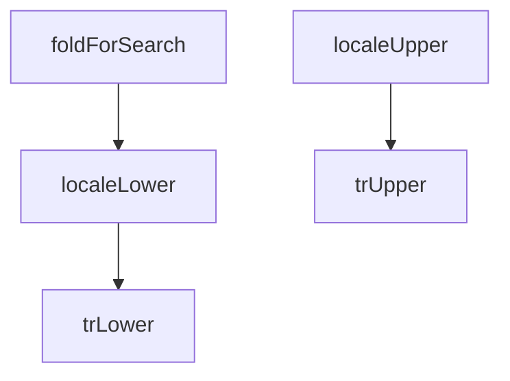

## Genel Bakış

Bu modül, uluslararasılaştırma (i18n) kapsamında metinlerin harf dönüşümlerini gerçekleştirir. Türkçe'ye özgü karakter duyarlı küçük/büyük harf dönüşümlerinin yanı sıra, genel dil destekli dönüşüm ve arama amaçlı normalizasyon fonksiyonları sunar.

## Fonksiyon Grupları

### Türkçe Harf Dönüşümleri
Türkçe dil kurallarına uygun olarak metinlerin küçük ve büyük harfe dönüştürülmesini sağlar. Türkçe'ye özgü karakterler (örneğin İ/i, I/ı) standart dönüşümlerden farklı işlenir.
- trLower, trUpper

### Genel Dil Desteği
Belirtilen dile göre harf dönüşümü yapar. Dil parametresi alarak farklı locale'ler için uygun dönüşümü uygular.
- localeLower, localeUpper

### Arama Normalizasyonu
Arama işlemleri için metni normalize eder. Farklı dillerdeki aksan işaretleri ve harf varyasyonlarını arama dostu forma dönüştürür.
- foldForSearch

---

## AXIOMS – Mimari Varsayımlar

Bu modül için fonksiyon gövdeleri verilmediğinden, yalnızca imzalardan çıkarılabilecek varsayımlar belirtilebilir.

[Aksiyom 1]: Eğer `value` parametresi verilmezse (undefined/null), fonksiyon davranışı bilinmiyor — fonksiyon gövdesi incelenmeden null/undefined girdiye nasıl tepki verildiği belirlenemez.

[Aksiyom 2]: Eğer `lang` parametresi `localeLower`, `localeUpper` veya `foldForSearch` fonksiyonlarına verilmezse, fonksiyon davranışı bilinmiyor — hangi dilin varsayılan olarak kullanılacağı fonksiyon gövdesinden anlaşılamaz.

[Aksiyom 3]: Eğer `lang` parametresi desteklenmeyen bir dil değeri alırsa, fonksiyon davranışı bilinmiyor — hangi dillerin desteklendiği fonksiyon gövdesinden anlaşılamaz.

[Aksiyom 4]: Eğer `trLower` veya `trUpper` fonksiyonlarına dil parametresi geçilmek istenirse, bu mümkün değildir — bu fonksiyonların imzasında `lang` parametresi bulunmaz ve yalnızca Türkçe'ye özel dönüşüm yaptığı varsayılabilir (ancak bu varsayım fonksiyon gövdesi doğrulanmadan kesin değildir).

---

## FONKSİYON DETAYLARI

### trLower
**Ne yapar**: Türkçe'ye özgü küçük harf dönüşümü uygular. Standart `toLowerCase()` İ harfini `i`'ye çevirirken, bu fonksiyon Türkçeye uygun olarak `İ → i` ve `I → ı` dönüşümlerini doğru şekilde gerçekleştirir.
**Nasıl yapar**: Önce `İ` karakterlerini regex ile `i`'ye, ardından `I` karakterlerini `ı`'ya dönüştürür. Son olarak kalan harfler için JavaScript'in yerleşik `toLowerCase()` metodunu çağırır. Bu sıralama önemlidir; çünkü `toLowerCase()` çağrısından önce Türkçe'ye özgü iki harfin dönüşümü yapılmış olur.
**Parametreler**:
- value: string — Türkçe küçük harfe dönüştürülecek metin
**Dönüş**: string — Türkçe kurallarına göre küçük harfe dönüştürülmüş metin

### trUpper
**Ne yapar**: Türkçe'ye özgü büyük harf dönüşümü uygular. Standart `toUpperCase()` `i` harfini `I`'ya çevirirken, bu fonksiyon Türkçeye uygun olarak `i → İ` ve `ı → I` dönüşümlerini doğru şekilde gerçekleştirir.
**Nasıl yapar**: Önce `i` karakterlerini regex ile `İ`'ye, ardından `ı` karakterlerini `I`'ya dönüştürür. Son olarak kalan harfler için JavaScript'in yerleşik `toUpperCase()` metodunu çağırır. Bu sıralama, `toUpperCase()` çağrılmadan önce Türkçe'ye özgü iki harfin dönüşümünün yapılmasını sağlar.
**Parametreler**:
- value: string — Türkçe büyük harfe dönüştürülecek metin
**Dönüş**: string — Türkçe kurallarına göre büyük harfe dönüştürülmüş metin

### localeLower
**Ne yapar**: Verilen dile göre küçük harfe dönüştürür. `lang` parametresi Türkçe'yi işaret ediyorsa Türkçe kuralları uygulanır; aksi halde standart locale-bağımsız kural kullanılır.
**Nasıl yapar**: `lang` parametresinin `'tr'` ile başlayıp başlamadığını kontrol eder. Türkçe ise `trLower` fonksiyonunu çağırır; değilse JavaScript'in yerleşik `toLowerCase()` metodunu kullanır. Docstring'e göre İngilizce için locale-bağımsız kural zaten doğrudur.
**Parametreler**:
- value: string — küçük harfe dönüştürülecek metin
- string — dil kodu (örneğin `'tr'`, `'tr-TR'`, `'en'`)
**Dönüş**: string — belirtilen dile göre küçük harfe dönüştürülmüş metin

### localeUpper
**Ne yapar**: Verilen dile göre büyük harfe dönüştürür. `localeLower` fonksiyonunun büyük harf karşılığıdır; aynı dil algılama mantığını kullanır.
**Nasıl yapar**: `lang` parametresinin `'tr'` ile başlayıp başlamadığını kontrol eder. Türkçe ise `trUpper` fonksiyonunu çağırır; değilse JavaScript'in yerleşik `toUpperCase()` metodunu kullanır.
**Parametreler**:
- value: string — büyük harfe dönüştürülecek metin
- lang: string — dil kodu (örneğin `'tr'`, `'tr-TR'`, `'en'`)
**Dönüş**: string — belirtilen dile göre büyük harfe dönüştürülmüş metin

### foldForSearch
**Ne yapar**: Arama ve eşleştirme işlemleri için metni kasa ve aksan duyarsız hale getirir. Türkçe klavyesi olmayan veya Türkçe karakter kullanmayan kullanıcıların yazdıkları metin ile ürün adları arasındaki eşleşmeyi mümkün kılar. Docstring'e göre yalnızca kasayı düzeltmek, aksan farkından kaynaklanan eşleşme başarısızlığını gidermez.
**Nasıl yapar**: İlk olarak `localeLower` ile dile uygun küçük harf dönüşümü uygular. Ardından `ı` harfini regex ile `i`'ye dönüştürür — çünkü `ı` NFD normalizasyonuyla ayrışmaz, elle indirilmesi gerekir. Sonrasında Unicode NFD normalizasyonu (`normalize('NFD')`) ile birleşen aksan işaretlerini ayırır ve `[\u0300-\u036f]` aralığındaki tüm combining karakterleri regex ile atar. Bu sayede `ç → c`, `ğ → g`, `ö → o`, `ş → s`, `ü → u` ve yabancı aksanlı harfler de sadeleştirilir.
**Parametreler**:
- value: string — arama için katlanacak metin
- lang: string — dil kodu; küçük harf dönüşümünde hangi dilin kurallarının uygulanacağını belirler
**Dönüş**: string — kasa ve aksan duyarsız, arama için sadeleştirilmiş metin

---

## AST POINTERS

### [N1_NASIL] AST Pointer: case.ts::trLower
- **params**: `value` (string)
- **ic_degiskenler**: (yok — fonksiyon gövdesinde değişken tanımlanmamış)
- **Dönüş**: string — Türkçe büyük İ harfini küçük i'ye, büyük I harfini küçük ı'ya dönüştürdükten sonra `toLowerCase()` uygulanmış metin

### [N2_NASIL] AST Pointer: case.ts::trUpper
- **params**: `value` (string)
- **ic_degiskenler**: (yok — fonksiyon gövdesinde değişken tanımlanmamış)
- **Dönüş**: string — küçük i harfini büyük İ'ye, küçük ı harfini büyük I'ye dönüştürdükten sonra `toUpperCase()` uygulanmış metin

### [N3_NASIL] AST Pointer: case.ts::localeLower
- **params**: `value` (string), `lang` (string)
- **ic_degiskenler**: (yok — fonksiyon gövdesinde değişken tanımlanmamış)
- **Dönüş**: string — `lang` parametresi `'tr'` ile başlıyorsa `trLower(value)` çağrılır, aksi halde `value.toLowerCase()` döndürülür

### [N4_NASIL] AST Pointer: case.ts::localeUpper
- **params**: `value` (string), `lang` (string)
- **ic_degiskenler**: (yok — fonksiyon gövdesinde değişken tanımlanmamış)
- **Dönüş**: string — `lang` parametresi `'tr'` ile başlıyorsa `trUpper(value)` çağrılır, aksi halde `value.toUpperCase()` döndürülür

### [N5_NASIL] AST Pointer: case.ts::foldForSearch
- **params**: `value` (string), `lang` (string)
- **ic_degiskenler**: (yok — fonksiyon gövdesinde değişken tanımlanmamış, zincirleme metot çağrıları doğrudan return üzerinde yapılır)
- **Dönüş**: string — arama için normalize edilmiş metin. İşlem sırası:
  1. `localeLower(value, lang)` çağrılır
  2. `ı` harfi `i` harfine elle dönüştürülür (NFD ile ayrışmayacağı belirtilmiş)
  3. `normalize('NFD')` ile Unicode bileşenlere ayrıştırılır
  4. `\u0300-\u036f` aralığındaki birleşen işaretleri (aksanlar) `replace` ile atılır

---

## MERMAID CALL GRAPH

## NODE ID STANDARD

  file: src\i18n\case.ts
  function: src\i18n\case.ts::trLower
  function: src\i18n\case.ts::trUpper
  function: src\i18n\case.ts::localeLower
  function: src\i18n\case.ts::localeUpper
  function: src\i18n\case.ts::foldForSearch

---

## DISA AKTARILANLAR (EXPORTS)
  export: foldForSearch
  export: localeLower
  export: localeUpper
  export: trLower
  export: trUpper