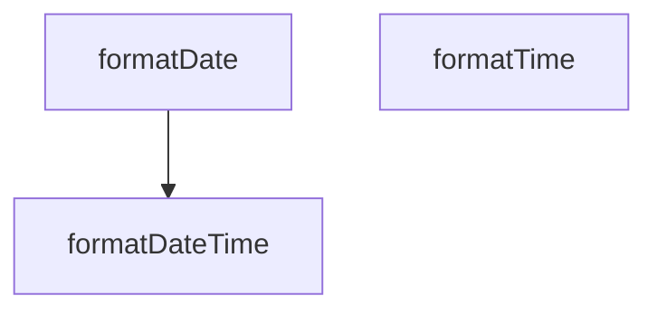

## Genel Bakış
VentHub HVAC projesinin uluslararasılaştırma (i18n) katmanında yer alan bu modül, tarih ve saat değerlerinin kullanıcının dil tercihine uygun olarak formatlanmasını sağlar. Sadece Türkçe ve İngilizce dillerini destekleyen modül, farklı girdi tipleriyle çalışarak tam tarih-saat, yalnızca tarih veya yalnızca saat formatlamaları sunar. Tarayıcının yerleşik standart tarih formatlama altyapısını kullanarak yerel kurallara uygun, tutarlı çıktılar üretir.

## Fonksiyon Grupları
### Kullanım Senaryolarına Özel Formatlama Fonksiyonları
Arayüzdeki farklı ihtiyaçlara cevap veren bu fonksiyonlar, tüm standart tarih girdi tipleriyle uyumlu çalışır ve özel formatlama ayarlarını destekleyerek esnek kullanım sunar.
- formatDateTime, formatDate, formatTime

---

## AXIOMS – Mimari Varsayımlar
Bu modül, çalışma ortamının ECMAScript Intl API'sini desteklemesi, fonksiyonlara verilen girdilerin imzalardaki tür ve değer kısıtlamalarına uyması koşuluyla uluslararasılaştırılmış tarih/saat formatlaması gerçekleştirir.

[Aksiyom 1]: Eğer çalışma ortamı Intl.DateTimeFormat standardını desteklemiyorsa, modülün tüm formatlama fonksiyonları çalışmaz, hata fırlatır.
[Aksiyom 2]: Eğer formatlama fonksiyonlarına geçirilen lang parametresi 'tr' veya 'en' değerlerinden biri değilse, geçerli dil ayarına sahip formatlanmış çıktı üretilemez, fonksiyon hata fırlatır.
[Aksiyom 3]: Eğer input parametresi string | number | Date türlerinde geçerli bir tarih temsil etmiyorsa, doğru formatlanmış tarih/saat çıktısı üretilemez, sonuç tanımsız olur.
[Aksiyom 4]: Eğer options parametresi Intl.DateTimeFormatOptions arayüzüne uymayan geçersiz bir nesne ise, istenen özel formatlama ayarları uygulanmaz, hatalı çıktı üretilir veya fonksiyon hata fırlatır.

---

## FONKSİYON DETAYLARI

### formatDateTime
**Ne yapar**: VentHub HVAC projesinin i18n altyapısında kullanılan, gelen tarih/saat değerini belirtilen dil ve format ayarlarına göre yerelleştirilmiş biçimde biçimlendiren temel fonksiyondur. UI'de gösterilecek tüm tarih ve saat değerlerinin standart bir formatta sunulmasını sağlar, hem Türkçe hem İngilizce dil ayarlarına uyumlu çalışır.
**Nasıl yapar**: JavaScript/TypeScript'in yerleşik Intl.DateTimeFormat API'sini kullanarak, desteklediği tüm giriş tiplerini tek tip Date nesnesine dönüştürür ve yerel ayarlara uygun formatlama işlemini gerçekleştirir. Farklı kaynaklardan gelen (string, sayı, Date nesnesi) tarih/saat değerlerini sorunsuz bir şekilde işleyerek tek tip çıktı üretir.
**Parametreler**:
- name: input, type: string | number | Date — Biçimlendirilecek tarih/saat değeri, ISO tarih stringi, epoch timestamp'i veya önceden oluşturulmuş Date nesnesi olabilir
- name: lang, type: 'tr' | 'en' — Formatlamanın uygulanacağı dil kodu, sadece Türkçe (tr) ve İngilizce (en) dilleri için yerelleştirme desteği sunar
- name: options, type: Intl.DateTimeFormatOptions — Intl standardında tanımlı tarih/saat biçimlendirme seçenekleri, yıl, ay, gün, saat, dakika, saniye gibi tüm tarih/saat bileşenlerinin gösterim şeklini detaylı olarak ayarlamak için kullanılır
**Dönüş**: Fonksiyonun dönüş tipi resmi olarak tanımlanmamıştır, biçimlendirilmiş yerelleştirilmiş tarih/saat stringini döndürmesi beklenmektedir.

### formatDate
**Ne yapar**: Sadece tarih bilgisini biçimlendirmek için tasarlanmış özel fonksiyondur, tüm zaman bileşenlerini (saat, dakika, saniye) hariç tutarak sadece tarih kısmının kullanıcıya sunulmasını sağlar. Arayüzde sadece tarih göstermek gereken durumlarda, örneğin bakım kayıt tarihleri, cihaz kurulum tarihleri gibi kullanım senaryolarında kullanılır.
**Nasıl yapar**: Temel formatDateTime fonksiyonunu çağırarak kod tekrarını önler, kullanıcının gönderdiği format seçeneklerine ek olarak saat, dakika ve saniye alanlarını tanımsız olarak ayarlar. Bu sayede zaman bileşenleri formatlamaya dahil olmaz, sadece yıl, ay, gün gibi tarih bileşenleri biçimlendirilerek çıktı üretilir, tüm yerelleştirme mantığını formatDateTime fonksiyonundan devralır.
**Parametreler**:
- name: input, type: string | number | Date — Biçimlendirilecek tarih değeri, ISO tarih stringi, epoch timestamp'i veya önceden oluşturulmuş Date nesnesi olabilir
- name: lang, type: 'tr' | 'en' — Formatlamanın uygulanacağı dil kodu, sadece Türkçe (tr) ve İngilizce (en) dilleri için yerelleştirme desteği sunar
- name: options, type: Intl.DateTimeFormatOptions — Intl standardında tanımlı tarih biçimlendirme seçenekleri, yıl, ay, gün gibi tarih bileşenlerinin gösterim şeklini detaylı olarak ayarlamak için kullanılır
**Dönüş**: formatDateTime fonksiyonunun ürettiği, sadece tarih içeren biçimlendirilmiş yerelleştirilmiş stringi döndürür.

### formatTime
**Ne yapar**: Gelen tarih/saat değerinden sadece zaman bilgisini ayıklayarak, belirtilen dil ayarlarına göre yerelleştirilmiş biçimde biçimlendiren özel fonksiyondur. Arayüzde sadece saat/dakika/saniye bilgisi göstermek gereken durumlarda, örneğin sistem log zaman damgaları, çalışma saatleri gibi kullanım senaryolarında kullanılır.
**Nasıl yapar**: Yerleşik Intl.DateTimeFormat API'sini kullanarak sadece zaman bileşenlerini formatlar, tüm tarih bileşenlerini işleme dahil etmez. formatDateTime ile aynı giriş tipi desteğini sunarak farklı kaynaklardan gelen zaman değerlerini tek tip formatta kullanıcıya sunar, proje içindeki tüm zaman gösterimlerinin standartlaşmasını sağlar.
**Parametreler**:
- name: input, type: string | number | Date — Biçimlendirilecek zaman değeri, tarih içeren string, epoch timestamp'i veya önceden oluşturulmuş Date nesnesi olabilir
- name: lang, type: 'tr' | 'en' — Formatlamanın uygulanacağı dil kodu, sadece Türkçe (tr) ve İngilizce (en) dilleri için yerelleştirme desteği sunar
- name: options, type: Intl.DateTimeFormatOptions — Intl standardında tanımlı zaman biçimlendirme seçenekleri, 12/24 saat formatı, saniyenin gösterilip gösterilmeyeceği gibi zaman bileşenlerinin ayarlarını yapmak için kullanılır
**Dönüş**: Fonksiyonun dönüş tipi resmi olarak tanımlanmamıştır, biçimlendirilmiş yerelleştirilmiş zaman stringini döndürmesi beklenmektedir.

---

## AST POINTERS

### [N1_NASIL] AST Pointer: C:\Users\alize\venthub-hvac\src\i18n\datetime.ts::formatDateTime
- **params**: input: string | number | Date, lang: 'tr' | 'en', options: Intl.DateTimeFormatOptions
- **ic_degiskenler**:
  - `locale` — Gelen dil kodunu Intl.DateTimeFormat'un kullanabileceği standart bölge koduna çevirir, tr için 'tr-TR', en için 'en-US' atanır
  - `date` — Giriş input'unu Date nesnesine dönüştürür, eğer input zaten Date nesnesiyse doğrudan kullanır
  - `opts` — Intl.DateTimeFormat için varsayılan tarih-saat formatlama ayarlarını tutar, gelen opsiyonlar ile birleştirilerek kullanılır
- **Dönüş**: Formatlanmış tarih-saat string'i, hata durumunda input'un string hali veya boş string

### [N2_NASIL] AST Pointer: C:\Users\alize\venthub-hvac\src\i18n\datetime.ts::formatDate
- **params**: input: string | number | Date, lang: 'tr' | 'en', options: Intl.DateTimeFormatOptions
- **ic_degiskenler**: Hiçbir yerel değişken tanımlanmamıştır, sadece parametreler kullanılarak formatDateTime fonksiyonu çağrılır, saat/dakika/saniye ayarları devre dışı bırakılır
- **Dönüş**: Sadece tarih içeren formatlanmış string, formatDateTime fonksiyonunun döndüğü değer

### [N3_NASIL] AST Pointer: C:\Users\alize\venthub-hvac\src\i18n\datetime.ts::formatTime
- **params**: input: string | number | Date, lang: 'tr' | 'en', options: Intl.DateTimeFormatOptions
- **ic_degiskenler**:
  - `locale` — Gelen dil kodunu Intl.DateTimeFormat'un kullanabileceği standart bölge koduna çevirir, tr için 'tr-TR', en için 'en-US' atanır
  - `date` — Giriş input'unu Date nesnesine dönüştürür, eğer input zaten Date nesnesiyse doğrudan kullanır
  - `opts` — Intl.DateTimeFormat için varsayılan saat-dakika formatlama ayarlarını tutar, gelen opsiyonlar ile birleştirilerek kullanılır
- **Dönüş**: Formatlanmış zaman string'i, hata durumunda input'un string hali veya boş string

---

## MERMAID CALL GRAPH

## NODE ID STANDARD

  file: src\i18n\datetime.ts
  function: src\i18n\datetime.ts::formatDateTime
  function: src\i18n\datetime.ts::formatDate
  function: src\i18n\datetime.ts::formatTime

---

## DISA AKTARILANLAR (EXPORTS)
  export: formatDate
  export: formatDateTime
  export: formatTime