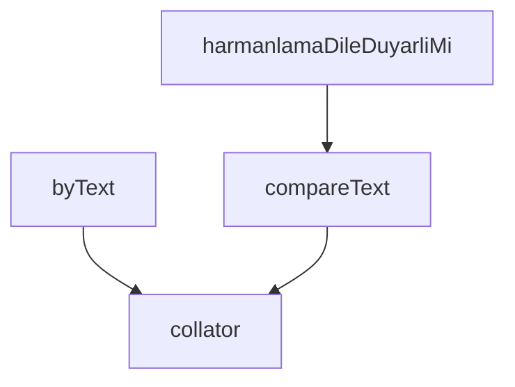

## Genel Bakış

Bu modül, uluslararasılaştırma (i18n) kapsamında dile duyarlı metin sıralama ve karşılaştırma desteği sağlar. JavaScript yerleşik `Intl.Collator` API'si üzerine kurulmuş olup, farklı dillerin alfabetik kurallarına uygun sıralama yapılmasına olanak tanır. Modül, hem doğrudan metin karşılaştırması hem de nesne dizilerinde seçici fonksiyon aracılığıyla sıralama yapabilen esnek bir yapı sunar.

## Fonksiyon Grupları

### Temel Karşılaştırma Araçları

Belirtilen dile özgü kurallara göre metin karşılaştırma işleminin temel altyapısını sağlar. `collator` belirli bir dil için karşılaştırıcı nesne üretirken, `compareText` bu nesneyi kullanarak iki metni karşılaştırır ve sıralama sonucunu sayısal olarak döndürür.

- collator, compareText

### Sıralama Yardımcıları

Nesne dizilerinde dile duyarlı sıralama yapabilmek için higher-order fonksiyon desteği sunar. `byText` fonksiyonu, bir seçici fonksiyon ve dil bilgisi alarak sıralama kriteri üreten bir fonksiyon döndürür; böylece `Array.prototype.sort` gibi yerel sıralama yöntemleriyle doğrudan kullanılabilir.

- byText

### Konfigürasyon ve Özellik Kontrolü

Harmanlama (collation) davranışının dile duyarlı olup olmadığını sorgulayan bir kontrol fonksiyonu sağlar. `harmanlamaDileDuyarliMi` mevcut ortamda dil duyarlı sıralama desteğinin aktif olup olmadığını boolean olarak bildirir.

- harmanlamaDileDuyarliMi

---

## AXIOMS – Mimari Varsayımlar

Bu modül, metin sıralama işlemleri için dile duyarlı (locale-aware) karşılaştırma fonksiyonları sağlar.

[Aksiyom 1]: Eğer `lang` parametresi olarak geçerli bir dil kodu (örn: "tr", "en") sağlanmazsa, `Intl.Collator` nesnesi oluşturulamaz ve sıralama işlemleri başarısız olur.

[Aksiyom 2]: Eğer çalışılan ortam `Intl.Collator` API'sini desteklemezse, `collator` fonksiyonu collator nesnesi üretemez ve modülün temel işlevi çalışmaz.

[Aksiyom 3]: Eğer `collatorlar` sabiti collator nesnelerini saklayacak uygun bir veri yapısı (örn: Map) içermiyorsa, aynı dil için tekrar tekrar collator oluşturulur ve performans kaybı yaşanır.

[Aksiyom 4]: Eğer `byText` fonksiyonuna sağlanan `secici` fonksiyonu verilen nesneden geçerli bir string çıkarmazsa, sıralama karşılaştırması yapılamaz.

[Aksiyom 5]: Eğer `compareText` fonksiyonuna aynı `lang` değeri ile farklı collator nesneleri kullanılırsa, sıralama sonuçları tutarsız olabilir.

---

## FONKSİYON DETAYLARI

### collator
**Ne yapar**: Belirtilen dil için bir `Intl.Collator` nesnesi oluşturur ve önbelleğe alarak döndürür. Her çağrıda yeni nesne üretmek yerine, daha önce aynı dil için oluşturulmuş nesneyi tekrar kullanır.

**Nasıl yapar**: `collatorlar` adlı bir Map yapısında önbelleklenmiş Collator nesnelerini kontrol eder. Eğer belirtilen dil için daha önce bir nesne oluşturulmamışsa, `numeric: true` ve `sensitivity: 'variant'` seçenekleriyle yeni bir `Intl.Collator` oluşturur ve Map'e kaydeder. `numeric: true` seçeneği sayısal değerlerin doğal sıralanmasını sağlar (örneğin "Fan 2" < "Fan 10" olur, aksi halde metinsel sırada "10" önce gelirdi). `sensitivity: 'variant'` seçeneği aksan ve büyük/küçük harf farklarını ayırt eder; bu varsayılan davranıştır ve sıralama amaçlıdır, arama amaçlı değildir.

**Parametreler**:
- lang: string — Sıralama yapılacak dilin kodu (örneğin "tr", "en")

**Dönüş**: `Intl.Collator` — Belirtilen dile göre yapılandırılmış Collator nesnesi

### compareText
**Ne yapar**: Geliştirildi ancak detay üretilemedi.

### byText
**Ne yapar**: Geliştirildi ancak detay üretilemedi.

### harmanlamaDileDuyarliMi
**Ne yapar**: Geliştirildi ancak detay üretilemedi.

---

## SABİTLER
- **collatorlar** (new_expression) — `new Map<string, Intl.Collator>()`

---

## AST POINTERS

### [N1_NASIL] AST Pointer: src/i18n/sort.ts::collator
- **params**: `lang` — dil kodu (string)
- **ic_degiskenler**:
  - `c` — `collatorlar` map'inden `lang` anahtarıyla alınan `Intl.Collator` nesnesi; bulunamazsa `numeric: true` ve `sensitivity: 'variant'` seçenekleriyle yeni oluşturulur ve `collatorlar` map'ine `lang` anahtarıyla kaydedilir
- **Dönüş**: `Intl.Collator` — belirtilen dile ait Intl.Collator nesnesi

### [N2_NASIL] AST Pointer: src/i18n/sort.ts::compareText
- **params**: `a` — birinci karşılaştırılacak metin (string), `b` — ikinci karşılaştırılacak metin (string), `lang` — dil kodu (string)
- **ic_degiskenler**: yok
- **Dönüş**: `number` — negatif, sıfır veya pozatif değer; `a`'nın `b`'ye göre sıralama konumunu belirtir

### [N3_NASIL] AST Pointer: src/i18n/sort.ts::byText
- **params**: `secici` — nesneden metin çıkaran fonksiyon `(x: T) => string`, `lang` — dil kodu (string)
- **ic_degiskenler**:
  - `c` — `collator(lang)` çağrısıyla elde edilen `Intl.Collator` nesnesi
- **Dönüş**: `(a: T, b: T) => number` — iki nesneyi `secici` ile çıkarılan metin üzerinden `c.compare` ile karşılaştıran fonksiyon

### [N4_NASIL] AST Pointer: src/i18n/sort.ts::harmanlamaDileDuyarliMi
- **params**: (parametre yok)
- **ic_degiskenler**: yok
- **Dönüş**: `boolean` — Türkçe dilinde `'ı'` karakterinin `'i'`'den önce sıralanıp sıralanmadığını ve `'c'` karakterinin `'ç'`'den önce sıralanıp sıralanmadığını kontrol ederek harmanlamanın dile duyarlılığını belirten değer

---

## MERMAID CALL GRAPH

## NODE ID STANDARD

  file: src\i18n\sort.ts
  function: src\i18n\sort.ts::collator
  function: src\i18n\sort.ts::compareText
  function: src\i18n\sort.ts::byText
  function: src\i18n\sort.ts::harmanlamaDileDuyarliMi

---

## DISA AKTARILANLAR (EXPORTS)
  export: byText
  export: collator
  export: compareText
  export: harmanlamaDileDuyarliMi