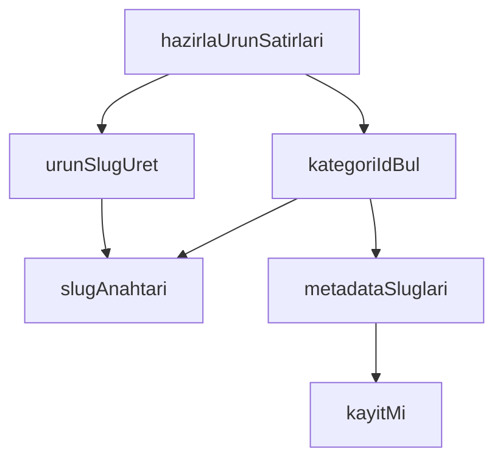

## Genel Bakış

Bu modül, CSV dosyalarından okunan ham ürün satırlarını veritabanına yazılabilecek yapılandırılmış ürün verilerine dönüştürmekten sorumludur. Slug üretimi, kategori eşleştirmesi ve eksik veri kontrolü gibi dönüşüm adımlarını gerçekleştirir. Modülün ana çıktı fonksiyonu `hazirlaUrunSatirlari` olup, diğer fonksiyonlar bu süreci destekleyen yardımcı işlevlerdir.

## Fonksiyon Grupları

### Slug Üretimi ve Dönüştürme
Ürün adı ve metadata gibi metin alanlarından URL-dostu, normalize edilmiş slug anahtarları üretir. Bu fonksiyonlar, veri eşleştirme ve karşılaştırma işlemlerinde tutarlı anahtar oluşturulmasını sağlar.
- slugAnahtari, urunSlugUret, metadataSluglari

### Veri Doğrulama ve Kontrol
Gelen verilerin geçerliliğini kontrol eden yardımcı fonksiyonları içerir. Eksik veya tanımsız değerlerin tespit edilmesinde kullanılır.
- kayitMi

### Kategori Eşleştirme
Verilen bir kategori girdisini, mevcut kategori seçenekleri listesiyle eşleştirerek karşılık gelen kategori kimliğini bulur. Eşleşme bulunamazsa null değer döndürür.
- kategoriIdBul

### Ana İşlem Hattı
CSV satırlarını ve kategori listesini alarak ürün kayıtlarını hazırlayan ana fonksiyondur. Slug üretimi, kategori eşleştirmesi ve veri doğrulama gibi diğer fonksiyonları çağırarak tüm dönüşüm sürecini koordine eder ve `HazirlamaSonucu` tipinde sonuç döndürür.
- hazirlaUrunSatirlari

---

## AXIOMS – Mimari Varsayımlar

[Aksiyom 1]: Eğer `hazirlaUrunSatirlari` fonksiyonuna verilen `kategoriler` dizisi boşsa, `kategoriIdBul` çağrıları her zaman `null` döndürür ve ürünler kategorisiz kalır.

[Aksiyom 2]: Eğer `kategoriIdBul` fonksiyonuna verilen `girdi` parametresi, `kategoriler` dizisindeki hiçbir `KategoriSecenegi` ile eşleşmiyorsa, sonuç `null` olur.

[Aksiyom 3]: Eğer `hazirlaUrunSatirlari` fonksiyonuna verilen `rows` dizisi boşsa, işlenecek ürün satırı yoktur ve `HazirlamaSonucu` buna göre oluşur.

[Aksiyom 4]: Eğer `rows` içindeki bir `Record<string, string>` nesnesinde beklenen anahtarlar (ürün adı, metadata vb.) bulunmuyorsa, ilgili satırın dönüştürülmesi eksik veya hatalı olur.

[Aksiyom 5]: Eğer `metadataSluglari` fonksiyonuna geçerli bir metadata yapısı verilmezse, boş bir `string[]` dönmesi beklenir.

[Aksiyom 6]: Eğer `urunSlugUret` fonksiyonuna boş string verilirse, geçerli bir slug üretilemez.

---

## FONKSİYON DETAYLARI

### slugAnahtari
**Ne yapar**: Verilen değeri karşılaştırma anahtarına dönüştürür. Bu fonksiyon, hem CSV hücresindeki hem de veritabanındaki değerlerin aynı normalizasyondan geçirilmesini sağlayarak eşleşme kaçırılmasını önler. Kullanıcı "Çatı Tipi Fan" da yazabilir `cati-tipi-fan` da; ikisi de aynı kategoriyi kasteder ve bu fonksiyon sayesinde eşleşir.

**Nasıl yapar**: Önce `foldForSearch` fonksiyonunu Türkçe locale ile çağırarak değeri normalize eder. Ardından alfanümerik olmayan karakterleri tire ile değiştirir, baştaki ve sondaki tireleri temizler. Bu sayede farklı yazım biçimleri aynı anahtara indirgenir.

**Parametreler**:
- `deger`: `string` — Normalize edilecek ham değer. `null` veya `undefined` gelirse boş string olarak işlenir.

**Dönüş**: `string` — Normalize edilmiş, yalnızca küçük harf, rakam ve tire içeren karşılaştırma anahtarı.

### urunSlugUret
**Ne yapar**: Geliştirildi ancak detay üretilemedi.

### kayitMi
**Ne yapar**: Geliştirildi ancak detay üretilemedi.

### metadataSluglari
**Ne yapar**: Geliştirildi ancak detay üretilemedi.

### kategoriIdBul
**Ne yapar**: Geliştirildi ancak detay üretilemedi.

### hazirlaUrunSatirlari
**Ne yapar**: Geliştirildi ancak detay üretilemedi.

---

## İTHALATLAR (IMPORTS)
- import: @/i18n/case::foldForSearch
- import: @/types/database.types::type { Database }

---

## INTERFACES

### KategoriSecenegi
Bileşene giren kategori seçeneği. `slug`/`metadata` opsiyoneldir ki çağıran kademeli geçebilsin.
- `id: string`
- `name: string`
- `slug?: string | null`
- `metadata?: unknown`

### ReddedilenSatir
Kategorisi çözülemediği için YAZILMAYACAK satır. Cetvel §4: ERR_SLUG_NOT_IN_DB.
- `sku: string`
- `deger: string`

### HazirlamaSonucu
- `payloads: UrunYazimi[]`
- `reddedilen: ReddedilenSatir[]`

---

## TYPE ALIASES

### UrunYazimi
```typescript
type UrunYazimi = Database['public']['Tables']['products']['Insert']
```

---

## AST POINTERS

### [N1_NASIL] AST Pointer: src/lib/admin/csvProductMapping.ts::slugAnahtari
- **params**: `deger` — string türünde girdi değeri
- **ic_degiskenler**: yok (işlem doğrudan return ifadesinde zincirleme yapılır)
- **Dönüş**: string — `foldForSearch` ile Türkçe küçük harfe dönüştürülmüş, alfanümerik olmayan karakterler tire ile değiştirilmiş, baştaki ve sondaki tireler kaldırılmış slug anahtarı

### [N2_NASIL] AST Pointer: src/lib/admin/csvProductMapping.ts::urunSlugUret
- **params**: `ad` — string türünde ürün adı
- **ic_degiskenler**: yok (doğrudan `slugAnahtari` çağrısının sonucu döndürülür)
- **Dönüş**: string — `slugAnahtari(ad)` çağrısının dönüş değeri

### [N3_NASIL] AST Pointer: src/lib/admin/csvProductMapping.ts::kayitMi
- **params**: `deger` — unknown türünde sınanacak değer
- **ic_degiskenler**: yok (type guard ifadesi doğrudan return ile döndürülür)
- **Dönüş**: boolean (type guard: `deger is Record<string, unknown>`) — `deger` nesne ise, null değilse ve dizi değilse true

### [N4_NASIL] AST Pointer: src/lib/admin/csvProductMapping.ts::metadataSluglari
- **params**: `metadata` — unknown türünde metadata nesnesi
- **ic_degiskenler**:
  - `slug` — `metadata.slug` alanından okunan değer; `kayitMi` ile nesne olup olmadığı sınanır, nesne değilse boş dizi dönülür
- **Dönüş**: string[] — `slug` nesnesinin değerleri arasından türü string olan ve uzunluğu sıfırdan büyük olanların filtrelenmiş dizisi; metadata veya slug nesne değilse boş dizi

### [N5_NASIL] AST Pointer: src/lib/admin/csvProductMapping.ts::kategoriIdBul
- **params**:
  - `girdi` — string türünde aranacak kategori girdisi
  - `kategoriler` — readonly `KategoriSecenegi[]` türünde kategori seçenekleri dizisi
- **ic_degiskenler**:
  - `aranan` — `slugAnahtari(girdi)` çağrısının sonucu; boş string ise null dönülür
  - `kategori` — for-of döngüsünde her bir kategori nesnesi (ilk döngüde slug ve metadata üzerinden, ikinci döngüde name üzerinden eşleşme aranır)
  - `adaylar` — `[kategori.slug ?? '', ...metadataSluglari(kategori.metadata)]` ile oluşturulan aday slug dizisi; `some` ile `aranan` ile eşleşme kontrolü yapılır
- **Dönüş**: string | null — eşleşen kategorinin `id` alanı; eşleşme bulunamazsa null

### [N6_NASIL] AST Pointer: src/lib/admin/csvProductMapping.ts::hazirlaUrunSatirlari
- **params**:
  - `rows` — readonly `Record<string, string>[]` türünde CSV satırları
  - `kategoriler` — readonly `KategoriSecenegi[]` türünde kategori seçenekleri dizisi
- **ic_degiskenler**:
  - `payloads` — `UrunYazimi[]` türünde başarılı ürün kayıtları dizisi
  - `reddedilen` — `ReddedilenSatir[]` türünde kategori bulunamayan satırlar dizisi
  - `r` — for-of döngüsünde her bir satır nesnesi (`Record<string, string>`)
  - `p` — `UrunYazimi` türünde oluşturulan ürün payload nesnesi; `r['sku']`, `r['name']`, `r['brand']`, `r['model_code']`, `r['model']`, `r['status']`, `r['price']`, `r['stock_qty']`, `r['low_stock_threshold']`, `r['category_id']`, `r['category_slug']`, `r['category']` alanlarından doldurulur
  - `deger` — `r['category_slug'] || r['category']` ifadesinden elde edilen kategori slug/category değeri; `kategoriIdBul` fonksiyonuna girdi olarak verilir
  - `id` — `kategoriIdBul(deger, kategoriler)` çağrısının dönüş değeri; null ise satır `reddedilen` dizisine eklenir ve `continue` ile atlanır
- **Dönüş**: `HazirlamaSonucu` — `{ payloads, reddedilen }` yapısında nesne; `payloads` başarılı ürünleri, `reddedilen` kategori eşleşmeyen satırları içerir

---


## MERMAID CALL GRAPH


## NODE ID STANDARD

  file: src\lib\admin\csvProductMapping.ts
  function: src\lib\admin\csvProductMapping.ts::slugAnahtari
  function: src\lib\admin\csvProductMapping.ts::urunSlugUret
  function: src\lib\admin\csvProductMapping.ts::kayitMi
  function: src\lib\admin\csvProductMapping.ts::metadataSluglari
  function: src\lib\admin\csvProductMapping.ts::kategoriIdBul
  function: src\lib\admin\csvProductMapping.ts::hazirlaUrunSatirlari

---

## DISA AKTARILANLAR (EXPORTS)
  export: HazirlamaSonucu
  export: KategoriSecenegi
  export: ReddedilenSatir
  export: hazirlaUrunSatirlari
  export: kategoriIdBul
  export: kayitMi
  export: metadataSluglari
  export: slugAnahtari
  export: urunSlugUret