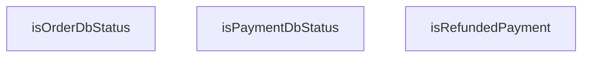

## Genel Bakış

Bu modül, sipariş ve ödeme süreçlerinde kullanılan veritabanı durum değerlerinin doğrulanması ve yorumlanmasından sorumludur. Modül, sipariş durumu ve ödeme durumu gibi alanlara yazılacak değerlerin geçerliliğini kontrol eden yardımcı fonksiyonlar sunar. Ayrıca ödeme durumunun iade işlemiyle sonuçlanıp sonuçlanmadığını belirlemek için bir kontrol fonksiyonu içerir.

## Fonksiyon Grupları

### Durum Değeri Doğrulama

Verilen string değerlerin sırasıyla sipariş veritabanı durumu ve ödeme veritabanı durumu olarak geçerli olup olmadığını kontrol eder. Bu fonksiyonlar, veritabanına yazılacak durum alanlarının yalnızca tanımlı değerlerden biri olmasını garantiler.

- isOrderDbStatus, isPaymentDbStatus

### Ödeme Durumu Analizi

Ödeme durumu bilgisinin iade edilmiş bir ödemeye ait olup olmadığını belirler. Null veya undefined gibi eksik değerleri de işleyerek güvenli bir boolean sonuç üretir.

- isRefundedPayment

---

## AXIOMS – Mimari Varsayımlar

Bu modül, sipariş ve ödeme durumlarının veritabanı seviyesinde doğrulanması ve iade kontrolü için alan mantığı sağlar.

[Aksiyom 1]: Eğer `ORDER_DB_STATUSES` sabiti tanımlı değilse, `isOrderDbStatus` fonksiyonu geçerli sipariş durumlarını doğrulayamaz.

[Aksiyom 2]: Eğer `PAYMENT_DB_STATUSES` sabiti tanımlı değilse, `isPaymentDbStatus` fonksiyonu geçerli ödeme durumlarını doğrulayamaz.

[Aksiyom 3]: Eğer `isRefundedPayment` fonksiyonuna `null` veya `undefined` değerleri kabul edilmiyorsa, ödeme durumu bilgisi olmayan siparişlerde hata oluşur (fonksiyon imzası bu değerleri kabul edecek şekilde tanımlanmıştır).

[Aksiyom 4]: Eğer `PAYMENT_ONLY_STATUSES` sabiti mevcut değilse, yalnızca ödeme tarafına özgü durumlar ayrıştırılamaz.

[Aksiyom 5]: Eğer `isOrderDbStatus` ve `isPaymentDbStatus` fonksiyonları boolean döndürmüyorsa, bu fonksiyonları koşul ifadelerinde kullanan kodlar beklenmedik davranış sergiler (dönüş tipi imzada belirtilmemiştir, bilinmiyor).

---

## FONKSİYON DETAYLARI

### isOrderDbStatus
**Ne yapar**: Verilen string değerinin geçerli bir sipariş veritabanı durumu (OrderDbStatus) olup olmadığını kontrol eden bir type guard fonksiyonudur. TypeScript'in type narrowing mekanizmasıyla, fonksiyon true döndürdüğünde parametre `OrderDbStatus` tipine daraltılır.

**Nasıl yapar**: `ORDER_DB_STATUSES` sabit dizisini readonly string dizisi olarak cast eder ve parametre olarak gelen `value` değerinin bu dizide bulunup bulunmadığını `includes` metoduyla kontrol eder. Dizide varsa true, yoksa false döner.

**Parametreler**:
- value: string — kontrol edilecek durum değeri

**Dönüş**: value is OrderDbStatus — TypeScript type guard dönüşü; true olduğunda `value` parametresi `OrderDbStatus` tipine daraltılır

### isPaymentDbStatus
**Ne yapar**: Geliştirildi ancak detay üretilemedi.

### isRefundedPayment
**Ne yapar**: Geliştirildi ancak detay üretilemedi.

---

## TYPE ALIASES

### OrderDbStatus
```typescript
type OrderDbStatus = (typeof ORDER_DB_STATUSES)[number]
```

### PaymentDbStatus
```typescript
type PaymentDbStatus = (typeof PAYMENT_DB_STATUSES)[number]
```

---

## SABİTLER
- **ORDER_DB_STATUSES** (as_expression) — `[
  'pending',
  'confirmed',
  'processing',
  'shipped',
  'delivered'...`
- **PAYMENT_DB_STATUSES** (as_expression) — `[
  'pending',
  'paid',
  'failed',
  'refunded',
  'partial_refunded',...`
- **PAYMENT_ONLY_STATUSES** (call) — `PAYMENT_DB_STATUSES.filter(
  (p): p is PaymentDbStatus => !(ORDER_DB_STATUS...`

---

## AST POINTERS

### [N1_NASIL] AST Pointer: src/lib/admin/orderStatusDomain.ts::isOrderDbStatus
- **params**: `value` — string türünde, sipariş durumu değeri
- **ic_degiskenler**:
  - `ORDER_DB_STATUSES` — readonly string[] olarak cast edilen sabit dizi; `.includes(value)` ile value'nun bu dizide olup olmadığı kontrol edilir
- **Dönüş**: `value is OrderDbStatus` (type guard — boolean)

### [N2_NASIL] AST Pointer: src/lib/admin/orderStatusDomain.ts::isPaymentDbStatus
- **params**: `value` — string türünde, ödeme durumu değeri
- **ic_degiskenler**:
  - `PAYMENT_DB_STATUSES` — readonly string[] olarak cast edilen sabit dizi; `.includes(value)` ile value'nun bu dizide olup olmadığı kontrol edilir
- **Dönüş**: `value is PaymentDbStatus` (type guard — boolean)

### [N3_NASIL] AST Pointer: src/lib/admin/orderStatusDomain.ts::isRefundedPayment
- **params**: `paymentStatus` — string, null veya undefined türünde, ödeme durumu değeri
- **ic_degiskenler**:
  - `paymentStatus` — `'refunded'` veya `'partial_refunded'` sabitleriyle strict equality (`===`) ile karşılaştırılır
- **Dönüş**: `boolean`

---


## MERMAID CALL GRAPH


## NODE ID STANDARD

  file: src\lib\admin\orderStatusDomain.ts
  function: src\lib\admin\orderStatusDomain.ts::isOrderDbStatus
  function: src\lib\admin\orderStatusDomain.ts::isPaymentDbStatus
  function: src\lib\admin\orderStatusDomain.ts::isRefundedPayment

---

## DISA AKTARILANLAR (EXPORTS)
  export: ORDER_DB_STATUSES
  export: OrderDbStatus
  export: PAYMENT_DB_STATUSES
  export: PAYMENT_ONLY_STATUSES
  export: PaymentDbStatus
  export: isOrderDbStatus
  export: isPaymentDbStatus
  export: isRefundedPayment