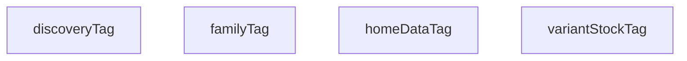

## Genel Bakış
Bu modül, önbellek (cache) geçersizleştirme işlemleri için kullanılan etiket (tag) dizeleri üretir. Her fonksiyon, belirli bir sayfa veya veri türüne karşılık gelen benzersiz bir cache tag dizesi döndürür. Modül, Next.js veya benzeri bir framework'ün cache invalidation mekanizmasıyla birlikte kullanılmak üzere tasarlanmıştır.

## Fonksiyon Grupları

### Cache Tag Üreticileri
Bu fonksiyonlar, farklı sayfa ve veri türleri için önbellek etiketleri oluşturur. Üretilen tag'ler, ilgili veri değiştiğinde belirli cache girdilerinin geçersiz kılınmasına olanak tanır. Fonksiyonlar birbirini çağırmaz; her biri bağımsız olarak çalışır ve kendi tag dizesini üretir.

- `homeDataTag`, `discoveryTag`, `familyTag`, `variantStockTag`

**Parametre yapısı:**
- `homeDataTag` ve `discoveryTag` fonksiyonları opsiyonel bir `tenantId` parametresi alır; bu sayede çoklu kiracı (multi-tenant) ortamlarda kiracıya özel tag'ler üretilebilir.
- `familyTag` fonksiyonu bir `slug` parametresi alır; bu slug, ürün ailesini benzersiz biçimde tanımlar.
- `variantStockTag` fonksiyonu parametre almaz; genel bir stok tag'i döndürür.

---

## AXIOMS – Mimari Varsayımlar

Bu modül için fonksiyon gövdeleri verilmediğinden, fonksiyon gövdesine dayalı aksiyom üretilememektedir. Yalnızca imzalardan (parametre varlığı/yokluğu, dönüş tipi) bilgi mevcuttur; bu bilgiler derleme zamanı sözleşmesi olup runtime davranışına ilişkin aksiyom niteliği taşımaz.

Bu modül için özel aksiyom tanımlanmamıştır.

---

## FONKSİYON DETAYLARI

### homeDataTag
**Ne yapar**: Ana sayfa veri önbelleği için bir tag (etiket) değeri üretir. Tenant'a özel tag oluşturur; tenant belirtilmemişse genel bir sabit tag döndürür.

**Nasıl yapar**: Opsiyonel olarak verilen `tenantId` parametresini kontrol eder. Eğer `tenantId` tanımlı ve truthy ise, bu tenant'a özel `home-data-${tenantId}` formatında bir string oluşturur. `tenantId` verilmemişse, kodda tanımlı olan `HOME_DATA_TAG` sabitini döndürür.

**Parametreler**:
- tenantId: string (opsiyonel) — Kiracı (tenant) kimlik bilgisi. Verildiğinde tag bu tenant'a özgü hale gelir; verilmediğinde genel bir sabit tag kullanılır.

**Dönüş**: string — Ana sayfa veri önbelleğini temsil eden tag değeri.

### discoveryTag
**Ne yapar**: Geliştirildi ancak detay üretilemedi.

### familyTag
**Ne yapar**: Geliştirildi ancak detay üretilemedi.

### variantStockTag
**Ne yapar**: Geliştirildi ancak detay üretilemedi.

---

## AST POINTERS

### [N1_NASIL] AST Pointer: src/lib/cache/tags.ts::homeDataTag
- **params**: `tenantId` (opsiyonel string)
- **ic_degiskenler**:
  - `tenantId` — koşul kontrolü için kullanılır; tanımlıysa template literal içinde yer alır
  - `HOME_DATA_TAG` — tenantId tanımlı olmadığında döndürülen sabit değer; kaynağı bilinmiyor
- **Dönüş**: string — tenantId varsa `home-data-${tenantId}`, yoksa `HOME_DATA_TAG`

### [N2_NASIL] AST Pointer: src/lib/cache/tags.ts::discoveryTag
- **params**: `tenantId` (opsiyonel string)
- **ic_degiskenler**:
  - `tenantId` — koşul kontrolü için kullanılır; tanımlıysa template literal içinde yer alır
  - `PRODUCTS_DISCOVERY_TAG` — tenantId tanımlı olmadığında döndürülen sabit değer; kaynağı bilinmiyor
- **Dönüş**: string — tenantId varsa `products-discovery-${tenantId}`, yoksa `PRODUCTS_DISCOVERY_TAG`

### [N3_NASIL] AST Pointer: src/lib/cache/tags.ts::familyTag
- **params**: `slug` (string)
- **ic_degiskenler**:
  - `slug` — template literal içinde `product-family-${slug}` oluşturmak için kullanılır
- **Dönüş**: string — `product-family-${slug}`

### [N4_NASIL] AST Pointer: src/lib/cache/tags.ts::variantStockTag
- **params**: (parametre yok)
- **ic_degiskenler**: (değişken yok)
- **Dönüş**: string — sabit `'variant-stock'`

---

## MERMAID CALL GRAPH

## NODE ID STANDARD

  file: src\lib\cache\tags.ts
  function: src\lib\cache\tags.ts::homeDataTag
  function: src\lib\cache\tags.ts::discoveryTag
  function: src\lib\cache\tags.ts::familyTag
  function: src\lib\cache\tags.ts::variantStockTag

---

## DISA AKTARILANLAR (EXPORTS)
  export: discoveryTag
  export: familyTag
  export: homeDataTag
  export: variantStockTag