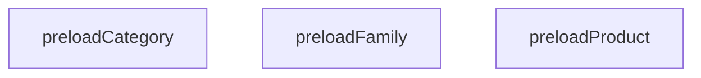

## Genel Bakış

Bu modül, uygulamanın ihtiyaç duyduğu temel veri varlıklarının (aile, ürün, kategori) önceden yüklenmesini sağlayan fonksiyonları içerir. Her fonksiyon, ilgili veri türünün slug bilgisini alarak veriyi hazır hale getirir. Modül, `lib/data` altında konumlanmıştır ve veri erişim katmanının bir parçası olarak çalışır.

## Fonksiyon Grupları

### Veri Ön Yükleme İşlemleri

Bu üç fonksiyon da aynı amaca hizmet eder: belirtilen slug'a sahip veri kaydını önceden yükleyerek uygulamanın ilerleyen adımlarda bu veriye hızlı erişimini sağlamak. Üçü de benzer bir desen izler; ancak `preloadFamily` fonksiyonu ek olarak bir dil parametresi alır ve çok dilli içerik desteği sunar.

- `preloadFamily`, `preloadProduct`, `preloadCategory`

---

## AXIOMS – Mimari Varsayımlar
- Bu modül davranışsal mantık içermez (salt veri / konfigürasyon / tip tanımı).
- [Aksiyom 1]: Modülün dışa açtığı yapı (anahtar kümesi / şema) bir sözleşmedir; tüketiciler bu sabit yapıya bağlıdır — kırıcı değişiklik tüm tüketicileri etkiler.
- [Aksiyom 2]: Bir öğe ekleme/çıkarma yapısal-uyumlu olmalı; ilgili tipler ve seçiciler aynı commit'te güncel tutulmalıdır.

---

## FONKSİYON DETAYLARI

### preloadFamily
**Ne yapar**: Aile verisini önceden yüklemek için `getCachedFamilyDetail` fonksiyonunu çağırır. Çağrının sonucu kullanılmaz; yalnızca yan etki (side effect) amaçlı tetikleme yapılır.
**Nasıl yapar**: `getCachedFamilyDetail` fonksiyonunu `slug` ve `lang` parametreleriyle çağırır. JavaScript'te `void` operatörü ifadeyi değerlendirir ancak sonucu `undefined` olarak atar; bu sayede fonksiyonun dönüş değeri göz ardı edilir. Bu yapı, bir fonksiyonun yalnızca yan etkilerini (örneğin cache'e yazma) tetiklemek amacıyla kullanılır.
**Parametreler**:
- slug: string — Aile verisinin benzersiz tanımlayıcısı (URL slug'ı)
- lang: string — Dil kodu
**Dönüş**: Fonksiyonda açık bir `return` ifadesi bulunmamaktadır; bu nedenle `undefined` döner. TypeScript tarafında dönüş tipi belirtilmemiştir.

### preloadProduct
**Ne yapar**: Geliştirildi ancak detay üretilemedi.

### preloadCategory
**Ne yapar**: Geliştirildi ancak detay üretilemedi.

---

## İTHALATLAR (IMPORTS)
- import: ../../types/db-rows::type { AuthorityContent,CategoryMetadata, DbCategory }
- import: ../type-converters::mapDatabaseCategoryToDomain
- import: @/lib/services/family.service::getFamilyDetail
- import: @/lib/services/family.service::getSeriesLanding
- import: @/lib/services/product.service::getProductBySlug
- import: @/lib/supabase/static::supabaseStaticClient
- import: react::cache

---

## SABİTLER
- **getCachedProductBySlug** (call) — `cache(async (slug: string) => {
  return getProductBySlug(supabase, slug)
})`
- **fetchFamilyDetail** (call) — `cache(async (slug: string, lang: string) => {
  return getFamilyDetail(supab...`
- **getCachedFamilyDetail** (call) — `cache(async (slug: string, lang: string) => {
  try {
    return await fetc...`
- **fetchFamilyDetail** (unknown)
- **getCachedSeriesLanding** (call) — `cache(async (slug: string) => {
  return getSeriesLanding(supabase, slug)
})`
- **getCachedFamilySlugById** (call) — `cache(async (familyId: string) => {
  const { data, error } = await supabase...`
- **SAFE_SLUG** (regex) — `/^[a-zA-Z0-9._~-]+$/`
- **getCachedCategoryData** (call) — `cache(async (slug: string) => {
  const query = supabase.from('categories')....`

---

## AST POINTERS

### [N1_NASIL] AST Pointer: src/lib/data/preload.ts::preloadFamily
- **params**: `slug` (string), `lang` (string)
- **ic_degiskenler**: yok
- **Dönüş**: yok (void)

### [N2_NASIL] AST Pointer: src/lib/data/preload.ts::preloadProduct
- **params**: `slug` (string)
- **ic_degiskenler**: yok
- **Dönüş**: yok (void)

### [N3_NASIL] AST Pointer: src/lib/data/preload.ts::preloadCategory
- **params**: `slug` (string)
- **ic_degiskenler**: yok
- **Dönüş**: yok (void)

### [N4_NASIL] AST Pointer: src/lib/data/preload.ts::getCachedProductBySlug
- **params**: `slug` (string)
- **ic_degiskenler**: yok
- **Dönüş**: `getProductBySlug(supabase, slug)` çağrısının dönüşü (Promise)

### [N5_NASIL] AST Pointer: src/lib/data/preload.ts::fetchFamilyDetail
- **params**: `slug` (string), `lang` (string)
- **ic_degiskenler**: yok
- **Dönüş**: `getFamilyDetail(supabase, slug, lang)` çağrısının dönüşü (Promise)

### [N6_NASIL] AST Pointer: src/lib/data/preload.ts::getCachedFamilyDetail
- **params**: `slug` (string), `lang` (string)
- **ic_degiskenler**:
  - `e` — catch bloğunda yakalanan hata nesnesi; `console.warn` ile loglanır
- **Dönüş**: `fetchFamilyDetail(slug, lang)` başarılıysa onun dönüşü, hata durumunda `null`

### [N7_NASIL] AST Pointer: src/lib/data/preload.ts::getCachedSeriesLanding
- **params**: `slug` (string)
- **ic_degiskenler**: yok
- **Dönüş**: `getSeriesLanding(supabase, slug)` çağrısının dönüşü (Promise)

### [N8_NASIL] AST Pointer: src/lib/data/preload.ts::getCachedFamilySlugById
- **params**: `familyId` (string)
- **ic_degiskenler**:
  - `data` — `supabase.from('product_families').select('slug').eq('id', familyId).limit(1).maybeSingle()` sorgusundan dönen veri; `data.slug` olarak erişilir
  - `error` — aynı sorgudan dönen hata; varsa `null` dönülür
- **Dönüş**: `data.slug` (string) veya hata/veri yoksa `null`

### [N9_NASIL] AST Pointer: src/lib/data/preload.ts::getCachedCategoryData
- **params**: `slug` (string)
- **ic_degiskenler**:
  - `query` — `supabase.from('categories').select(CATEGORY_COLUMNS)` sorgu nesnesi
  - `rows` — sorgu sonucu dönen satırlar dizisi (`data` olarak destructure edilir); `rows[0]` veya slug eşleşeni seçilir
  - `error` — sorgudan dönen hata; varsa `null` dönülür
  - `data` — `rows` içinden `row.slug === slug` koşulunu sağlayan satır, bulunamazsa `rows[0]`; `mapDatabaseCategoryToDomain` fonksiyonuna `name`, `menu_label`, `marketing_title`, `translation_key`, `description`, `metadata`, `authority_content` alanlarıyla birlikte gönderilir
- **Dönüş**: `mapDatabaseCategoryToDomain(...)` çağrısının dönüşü veya hata/veri yoksa `null`

---

## MERMAID CALL GRAPH

## NODE ID STANDARD

  file: preload.ts
  function: preload.ts::preloadFamily
  function: preload.ts::preloadProduct
  function: preload.ts::preloadCategory

---

## DISA AKTARILANLAR (EXPORTS)
  export: fetchFamilyDetail
  export: getCachedCategoryData
  export: getCachedFamilyDetail
  export: getCachedFamilySlugById
  export: getCachedProductBySlug
  export: getCachedSeriesLanding
  export: preloadCategory
  export: preloadFamily
  export: preloadProduct