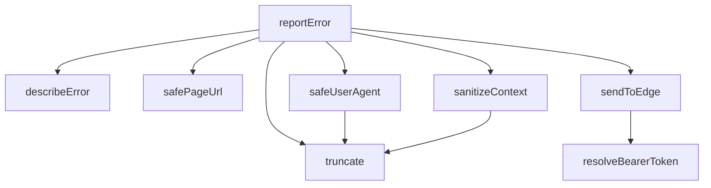

## Genel Bakış

Bu modül, istemci tarafında oluşan hataları yakalayarak yapılandırılmış bir şekilde bir edge servisine raporlamakla sorumludur. Hata bilgisini, tarayıcı bağlamını ve kimlik doğrulama bilgilerini bir araya getirip güvenli bir payload oluşturarak dışarıya gönderir. Modül, hata raporlama sürecinin tamamını tek bir fonksiyon üzerinden orkestre eder.

## Fonksiyon Grupları

### Hata Bilgisi Toplama ve Biçimlendirme
Hata nesnesinden anlamlı bilgi çıkarır, tarayıcı ortam bilgilerini güvenli biçimde toplar ve metin alanlarını kontrollü uzunlukta sınırlar.
- truncate, describeError, safePageUrl, safeUserAgent, sanitizeContext

### Kimlik Doğrulama
İstemcinin anonim anahtarını kullanarak edge servise yapılacak istek için gerekli bearer token'ı çözümleme işlemini yürütür.
- resolveBearerToken

### Dış Servise Gönderim
Hazırlanan hata payload'ını edge servisine iletir.
- sendToEdge

### Ana Raporlama Orkestrasyonu
Hata bilgisini toplama, bağlamı temizleme, kimlik doğrulama ve gönderim adımlarını birleştirerek tek bir çağrıyla hata raporlama sürecini başlatır.
- reportError

---

## AXIOMS – Mimari Varsayımlar
- Bu modül davranışsal mantık içermez (salt veri / konfigürasyon / tip tanımı).
- [Aksiyom 1]: Modülün dışa açtığı yapı (anahtar kümesi / şema) bir sözleşmedir; tüketiciler bu sabit yapıya bağlıdır — kırıcı değişiklik tüm tüketicileri etkiler.
- [Aksiyom 2]: Bir öğe ekleme/çıkarma yapısal-uyumlu olmalı; ilgili tipler ve seçiciler aynı commit'te güncel tutulmalıdır.

---

## FONKSİYON DETAYLARI

### truncate
**Ne yapar**: Verilen bir string değerini belirtilen maksimum uzunlukta kırpar. Eğer string'in uzunluğu maksimum değerden büyükse, yalnızca ilk `max` karakteri döndürür; aksi halde string'i olduğu gibi döndürür.

**Nasıl yapar**: `value.length` ile string uzunluğunu kontrol eder. Uzunluk `max` değerini aşıyorsa `value.slice(0, max)` ile string'i keser, aşıyorsa orijinal `value` değerini döndürür.

**Parametreler**:
- `value`: `string` — Kırpılacak kaynak string.
- `max`: `number` — İzin verilen maksimum karakter sayısı.

**Dönüş**: `string` — Kırpılmış veya orijinal string.

### describeError
**Ne yapar**: Geliştirildi ancak detay üretilemedi.

### safePageUrl
**Ne yapar**: Geliştirildi ancak detay üretilemedi.

### safeUserAgent
**Ne yapar**: Geliştirildi ancak detay üretilemedi.

### sanitizeContext
**Ne yapar**: Geliştirildi ancak detay üretilemedi.

### resolveBearerToken
**Ne yapar**: Geliştirildi ancak detay üretilemedi.

### sendToEdge
**Ne yapar**: Geliştirildi ancak detay üretilemedi.

### reportError
**Ne yapar**: Geliştirildi ancak detay üretilemedi.

---

## INTERFACES

### ClientErrorPayload
log-client-error zod şemasının BİREBİR karşılığı.
- `msg: string`
- `stack: string`
- `url: string`
- `ua: string`
- `release: string`
- `env: string`
- `level: string`
- `extra: Record<string, unknown> | null`

---

## TYPE ALIASES

### ErrorContext
Çağıranların verdiği serbest metadata.
```typescript
type ErrorContext = Record<string, unknown>
```

---

## SABİTLER
- **SENSITIVE_KEY_PATTERN** (regex) — `/(token|jwt|secret|password|passwd|auth|apikey|api_key|key|email|mail|phone|t...`
- **lastSentAt** (new_expression) — `new Map<string, number>()`

---

## AST POINTERS

### [N1_NASIL] AST Pointer: src/lib/errorReporter.ts::truncate
- **params**: `value` (string), `max` (number)
- **ic_degiskenler**: yok
- **Dönüş**: string — `value` uzunluğu `max`'ı aşıyorsa ilk `max` karakteri, aşıyorsa `value`'nun kendisi

### [N2_NASIL] AST Pointer: src/lib/errorReporter.ts::describeError
- **params**: `err` (unknown)
- **ic_degiskenler**: yok
- **Dönüş**: `{ message: string; stack: string }` — `err` bir Error nesnesi ise `err.message` (yoksa `err.name`) ve `err.stack` (yoksa boş string); string ise doğrudan mesaj olarak kullanılır; diğer türlerde `JSON.stringify` denenir, başarısız olursa `String(err)` kullanılır

### [N3_NASIL] AST Pointer: src/lib/errorReporter.ts::safePageUrl
- **params**: (parametre yok)
- **ic_degiskenler**:
  - `loc` — `window.location` referansı; yoksa veya erişim hata verirse boş string dönülür
- **Dönüş**: string — `loc.origin` (yoksa boş) ile `loc.pathname` (yoksa boş) birleştirilerek oluşturulmuş URL; hata durumunda boş string

### [N4_NASIL] AST Pointer: src/lib/errorReporter.ts::safeUserAgent
- **params**: (parametre yok)
- **ic_degiskenler**: yok
- **Dönüş**: string — `navigator?.userAgent` değeri `truncate` ile 300 karaktere kesilerek döndürülür; hata durumunda boş string

### [N5_NASIL] AST Pointer: src/lib/errorReporter.ts::sanitizeContext
- **params**: `context` (ErrorContext, opsiyonel)
- **ic_degiskenler**:
  - `out` — hassas olmayan anahtar/değer çiftlerinin toplandığı boş Record nesnesi
  - `key` — `Object.entries(context)` ile döngüdeki mevcut anahtar
  - `value` — `Object.entries(context)` ile döngüdeki mevcut değer
- **Dönüş**: `Record<string, unknown> | null` — `context` yoksa veya object değilse null; `SENSITIVE_KEY_PATTERN` ile eşleşen anahtarlar atlanır; null/number/boolean değerler aynen, string değerler `truncate` ile `EXTRA_VALUE_MAX` boyutuna kesilerek, nesne/dizi/fonksiyon türleri `[${typeof value}]` olarak kaydedilir; sonuç boşsa null, değilse filtrelenmiş nesne

### [N6_NASIL] AST Pointer: src/lib/errorReporter.ts::resolveBearerToken
- **params**: `anonKey` (string)
- **ic_degiskenler**:
  - `supabaseBrowserClient` — dinamik import ile `./supabase/client` modülünden alınan istemci nesnesi
  - `data` — `supabaseBrowserClient.auth.getSession()` çağrısının dönüşündeki `data` alanı
- **Dönüş**: `Promise<string>` — mevcut oturumun `access_token` değeri varsa o, yoksa `anonKey`; hata durumunda `anonKey`

### [N7_NASIL] AST Pointer: src/lib/errorReporter.ts::sendToEdge
- **params**: `payload` (ClientErrorPayload)
- **ic_degiskenler**:
  - `baseUrl` — `process.env.NEXT_PUBLIC_SUPABASE_URL` değeri; yoksa boş string
  - `anonKey` — `process.env.NEXT_PUBLIC_SUPABASE_ANON_KEY` değeri; yoksa boş string
  - `bearer` — `resolveBearerToken(anonKey)` ile elde edilen yetkilendirme belirteci
- **Dönüş**: void — asenkron IIFE içinde `fetch` ile `${baseUrl}${ENDPOINT_PATH}` adresine POST isteği gönderilir; `keepalive: true` ile sayfa kapanırken bile gönderilmesi sağlanır; hata durumunda sessizce yutulur

### [N8_NASIL] AST Pointer: src/lib/errorReporter.ts::reportError
- **params**: `err` (unknown), `context` (ErrorContext, opsiyonel)
- **ic_degiskenler**:
  - `message` — `describeError(err)` dönüşündeki hata mesajı
  - `stack` — `describeError(err)` dönüşündeki yığın izi
  - `isProduction` — `process.env.NODE_ENV === 'production` kontrolü
  - `forceEnabled` — `process.env.NEXT_PUBLIC_ERROR_REPORTING === 'on'` kontrolü
  - `url` — `safePageUrl()` ile alınan mevcut sayfa URL'si
  - `firstStackLine` — `stack`'in ilk satırı (`stack.split('\n')[0]`)
  - `signature` — tekilleştirme amaçlı `${message}::${firstStackLine}::${url}` birleşimi
  - `now` — `Date.now()` ile alınan mevcut zaman damgası
  - `last` — `lastSentAt` Map'inden `signature` anahtarıyla okunan son gönderim zamanı
- **Dönüş**: void — tarayıcı ortamında değilse (window yoksa) çıkılır; production değilse `console.warn` ile uyarı yazdırılır; production değil ve forceEnabled de değilse çıkılır; `DEDUP_WINDOW_MS` içinde aynı imzayla gönderilmişse atlanır; `sentCount` `MAX_REPORTS_PER_PAGE`'e ulaşmışsa atlanır; `lastSentAt` boyutu `MAX_SIGNATURES`'ı aşarsa temizlenir; aksi halde `sendToEdge` çağrılarak payload gönderilir; hata durumunda sessizce yutulur

---


## MERMAID CALL GRAPH


## NODE ID STANDARD

  file: src\lib\errorReporter.ts
  function: src\lib\errorReporter.ts::truncate
  function: src\lib\errorReporter.ts::describeError
  function: src\lib\errorReporter.ts::safePageUrl
  function: src\lib\errorReporter.ts::safeUserAgent
  function: src\lib\errorReporter.ts::sanitizeContext
  function: src\lib\errorReporter.ts::resolveBearerToken
  function: src\lib\errorReporter.ts::sendToEdge
  function: src\lib\errorReporter.ts::reportError

---

## DISA AKTARILANLAR (EXPORTS)
  export: describeError
  export: reportError
  export: resolveBearerToken
  export: safePageUrl
  export: safeUserAgent
  export: sanitizeContext
  export: sendToEdge
  export: truncate