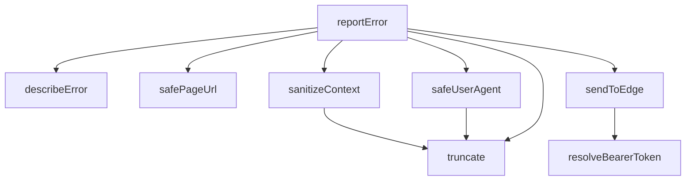

## Genel Bakış
Bu modül, uygulama genelinde oluşan hataları standartlaştırılmış bir biçimde yakalar, bağlam bilgisiyle zenginleştirir ve merkezi bir hata raporlama servisine güvenli bir şekilde iletir. Asenkron yapısı sayesinde ana iş akışını engellemeden hata raporlama sürecini yürütür.

## Fonksiyon Grupları
### Hata Bilgisi Hazırlama ve Güvenli Temizleme
Hata nesnesinden temel bilgileri çıkarır, gizlilik veya güvenlik içerebilecek verileri temizler ve istemci ortamına ait safely erişilebilir bağlam bilgilerini derler.
- truncate, describeError, safePageUrl, safeUserAgent, sanitizeContext

### Oturum ve Erişim Kimlik Doğrulaması
Raporun gönderileceği servise erişim için gerekli olan taşıyıcı (bearer) token'ı, anonim anahtar kullanarak dinamik ve asenkron bir şekilde çözer.
- resolveBearerToken

### Merkezi Hata Raporlama Akışı
Temizlenmiş hata ve bağlam bilgisini, gerekli kimlik doğrulama adımlarından geçirerek hedef servise iletir. Modülün dışarıya açılan ana giriş noktasıdır.
- sendToEdge, reportError

---

## AXIOMS – Mimari Varsayımlar
Bu hata raporlama modülünün hataları doğru şekilde toplayıp iletebilmesi için çalışma zamanı ortamı ve girdi parametreleri hakkında belirli koşulların karşılanması gerekir.

**[Aksiyom 1 - Ağ Bağlantısı]:** Eğer `sendToEdge` fonksiyonunun çalıştığı ortamda güvenilir bir ağ bağlantısı yoksa, hata raporları edge endpoint'e ulaştırılamaz ve hata kaybolur.

**[Aksiyom 2 - AnonKey Sağlanması]:** Eğer `resolveBearerToken` fonksiyonuna geçerli bir `anonKey` parametresi verilmiyorsa, Supabase anonim oturum token'ı çözülemez ve kimlik doğrulanamamış istekler oluşur.

**[Aksiyom 3 - Sensör Verisi Filtreleme]:** Eğer `sanitizeContext` fonksiyonu çalışırken `SENSITIVE_KEY_PATTERN` regex'i bağlam (context) içindeki alanlara uygulanmıyorsa, hassas bilgiler (şifre, token vb.) hata raporlarıyla birlikte dışarıya sızar.

**[Aksiyom 4 - Tarayıcı Ortamı]:** Eğer `safePageUrl` veya `safeUserAgent` fonksiyonları tarayıcı dışı bir ortamda (Node.js sunucusu, Web Worker gibi) çalıştırılıyorsa ve uygun fallback mekanizması yoksa, bu bilgiler alınamaz.

**[Aksiyom 5 - Hata Tanımlama]:** Eğer `describeError` fonksiyonuna geçilen `err` nesnesi `message` veya `stack` özelliklerine sahip değilse ve bu özellikler çıkarılamıyorsa, boş veya varsayılan değerlerle döner.

**[Aksiyom 6 - Truncate Sınırları]:** Eğer `truncate` fonksiyonuna geçilen `max` değeri 0 veya negatif bir sayıysa, fonksiyonun davranışı belirsizdir (boş string veya hata döner).

**[Aksiyom 7 - Rate Limiting]:** Eğer `lastSentAt` zaman damgası tabanlı rate limiting mekanizması正确 çalışmıyorsa veya `reportError` çağrıları çok sık tetikleniyorsa, aşırı sayıda istek oluşarak edge endpoint'e yük biner.

**[Aksiyom 8 - Context Türü]:** Eğer `reportError` veya `sanitizeContext` fonksiyonlarına geçilen `context` parametresi beklenen `ErrorContext` yapısına uymuyorsa (örn: çok derin iç içe geçmiş nesneler, döngüsel referanslar), bağlam bilgisi düzgün işlenemeyebilir.

---

## FONKSİYON DETAYLARI

### truncate
**Ne yapar**: Bir string değerini belirtilen maksimum karakter uzunluğuna göre kırpma işlemi yapar. Uzunluk belirtilen max değerini aşarsa stringi keser, aksi halde olduğu gibi döndürür. Hata raporlama sürecinde hassas verilerin ve uzun metinlerin kontrollü şekilde budanmasını sağlar.

**Nasıl yapar**: `value.length > max` koşuluyla stringin uzunluğunu kontrol eder. Koşul sağlandığında `value.slice(0, max)` ile stringin ilk `max` karakterini alarak döndürür; koşul sağlanmazsa orijinal değeri aynen iade eder. Basit ve saf bir budama (trimming) mantığı kullanır.

**Parametreler**:
- `value`: `string` — Kırpılacak kaynak string değeri.
- `max`: `number` — İzin verilen maksimum karakter sayısı.

**Dönüş**: `string` — Kırpılmış veya orijinal haliyle döndürülen string.

### describeError
**Ne yapar**: Geliştirildi ancak detay üretilemedi.

### safePageUrl
**Ne yapar**: Geliştirildi ancak detay üretilemedi.

### safeUserAgent
**Ne yapar**: Geliştirildi ancak detay üretilemedi.

### sanitizeContext
**Ne yapar**: Geliştirildi ancak detay üretilemedi.

### resolveBearerToken
**Ne yapar**: Geliştirildi ancak detay üretilemedi.

### sendToEdge
**Ne yapar**: Geliştirildi ancak detay üretilemedi.

### reportError

**Ne yapar**: Yapılandırılmış hata raporlayıcısına (manualReporter) hata bilgisini güvenli bir şekilde iletir. Hata raporlayıcı kurulmamışsa geliştirme ortamında konsola uyarı yazdırarak sessiz bir geri dönüş sağlar; üretim ortamında ise uygulamanın çökmesini önlemek adına tamamen sessiz kalır.

**Nasıl yapar**: Fonksiyon öncelikle modül seviyesinde tanımlı `manualReporter` değişkeninin varlığını kontrol eder. Eğer bir raporlayıcı kuruluysa, hata nesnesini ve opsiyonel bağlam bilgisini doğrudan bu raporlayıcıya aktarır. Raporlayıcı kurulu değilse, ortamın tarayıcı tabanlı olup olmadığını ve `NODE_ENV` değerinin `production` olup olmadığını kontrol eder. Geliştirme ortamındaysa, hatanın raporlanmadığını belirten bir uyarı mesajını konsola yazar; üretim ortamında ise herhangi bir işlem yapmaz.

**Parametreler**:
- `err`: unknown — Raporlanacak hata nesnesi veya bilinmeyen türdeki değer. Fonksiyon, bu değeri doğrudan raporlayıcıya iletir.
- `context` (opsiyonel): Record\<string, unknown\> — Hata çevresindeki opsiyonel metadata veya bağlam bilgisi. Örneğin, hatanın oluştuğu sayfa, kullanıcı durumu veya ek ayarlar gibi bilgiler taşınabilir.

**Dönüş**: void — Fonksiyon herhangi bir değer döndürmez. Hata raporlama işlemi yan etki olarak gerçekleştirilir.

---

## INTERFACES

### ClientErrorPayload
log-client-error zod şemasının BİREBİR karşılığı.
- `msg: string`
- `stack: string`
- `url: string`
- `ua: string`
- `release: string`
- `env: string`
- `level: string`
- `extra: Record<string, unknown> | null`

---

## TYPE ALIASES

### ErrorContext
Çağıranların verdiği serbest metadata.
```typescript
type ErrorContext = Record<string, unknown>
```

---

## SABİTLER
- **SENSITIVE_KEY_PATTERN** (regex) — `/(token|jwt|secret|password|passwd|auth|apikey|api_key|key|email|mail|phone|t...`
- **lastSentAt** (new_expression) — `new Map<string, number>()`

---

## AST POINTERS

### [N1_NASIL] AST Pointer: src/lib/errorReporter.ts::truncate
- **params**: `value: string`, `max: number`
- **ic_degiskenler**: (yok — tek bir ifade döndürür)
- **Dönüş**: `string` — value'nun uzunluğu max'den büyükse ilk `max` karakteri, değilse aynısını döndürür

---

### [N2_NASIL] AST Pointer: src/lib/errorReporter.ts::describeError
- **params**: `err: unknown`
- **ic_degiskenler**:
  - `err.message` — Error instance ise hata mesajı (fallback olarak `err.name`)
  - `err.stack` — Error instance ise stack trace stringi
  - `err.name` — `message` boşsa fallback olarak kullanılır
- **Dönüş**: `{ message: string; stack: string }` — bilinmeyen hata tipini message/stack çiftine dönüştürür

---

### [N3_NASIL] AST Pointer: src/lib/errorReporter.ts::safePageUrl
- **params**: (yok)
- **ic_degiskenler**:
  - `loc` — `window.location` referansı; mevcut sayfanın origin ve pathname değerlerini taşır
- **Dönüş**: `string` — `${loc.origin}${loc.pathname}` birleşimi; erişilemezse boş string

---

### [N4_NASIL] AST Pointer: src/lib/errorReporter.ts::safeUserAgent
- **params**: (yok)
- **ic_degiskenler**: (yok — inline ifadeler kullanır)
  - `navigator?.userAgent` — tarayıcı user-agent stringi, truncate ile 300 karaktere kısaltılır
- **Dönüş**: `string` — kısaltılmış user-agent veya hata durumunda boş string

---

### [N5_NASIL] AST Pointer: src/lib/errorReporter.ts::sanitizeContext
- **params**: `context?: ErrorContext`
- **ic_degiskenler**:
  - `out` — `Record<string, unknown>`; hassas anahtarlar filtrelenmiş temiz context nesnesi
  - `[key, value]` — `Object.entries(context)` döngüsü destructuring'inden gelen her bir anahtar-değer çifti
- **Dönüş**: `Record<string, unknown> | null` — hassas key'leri çıkarılmış, string değerleri `EXTRA_VALUE_MAX` ile kısaltılmış, nesne/dizi/fonksiyon değerleri tür etiketine dönüştürülmüş context; boşsa `null`

---

### [N6_NASIL] AST Pointer: src/lib/errorReporter.ts::resolveBearerToken
- **params**: `anonKey: string`
- **ic_degiskenler**:
  - `supabaseBrowserClient` — `./supabase/client` modülünden dinamik import ile alınan Supabase istemcisi
  - `data` — `supabaseBrowserClient.auth.getSession()` sonucu; mevcut oturum bilgisi (session, access_token)
- **Dönüş**: `Promise<string>` — mevcut session varsa `access_token`, yoksa hata olursa `anonKey`

---

### [N7_NASIL] AST Pointer: src/lib/errorReporter.ts::sendToEdge
- **params**: `payload: ClientErrorPayload`
- **ic_degiskenler**:
  - `baseUrl` — `process.env.NEXT_PUBLIC_SUPABASE_URL` Supabase proje URL'i; yoksa boş string
  - `anonKey` — `process.env.NEXT_PUBLIC_SUPABASE_ANON_KEY` Supabase anon anahtarı; yoksa boş string
  - `bearer` — `resolveBearerToken(anonKey)` sonucu; Authorization header için Bearer token
- **Dönüş**: `void` — payload'ı Supabase Edge Function'a POST ile gönderir; `keepalive: true` ile sayfa kapanırken bile gönderilir; hatalar sessizce yutulur

---

### [N8_NASIL] AST Pointer: src/lib/errorReporter.ts::reportError
- **params**: `err: unknown`, `context?: ErrorContext`
- **ic_degiskenler**:
  - `message` — `describeError(err)` destructuring'inden; hata mesajı
  - `stack` — `describeError(err)` destructuring'inden; stack trace stringi
  - `isProduction` — `process.env.NODE_ENV === 'production'` boolean; prod ortamı kontrolü
  - `forceEnabled` — `process.env.NEXT_PUBLIC_ERROR_REPORTING === 'on'` boolean; zorunlu raporlama açma
  - `url` — `safePageUrl()` sonucu; hata anındaki sayfa URL'i
  - `firstStackLine` — `stack.split('\n')[0]` ilk satırı; imza üretimi için kullanılır
  - `signature` — `${message}::${firstStackLine}::${url}` birleşimi; deduplication anahtarı
  - `now` — `Date.now()` zaman damgası; milisaniye cinsinden
  - `last` — `lastSentAt.get(signature)` sonucu; bu imzanın ne zaman gönderildiği (millisaniye)
- **Modül-level değişkenler (farklı scope)**:
  - `lastSentAt` — `Map<string, number>`; imza → son gönderim zamanı haritası (dedup için)
  - `sentCount` — sayaç; sayfa başına gönderilen maksimum rapor sayısını takip eder
- **Dönüş**: `void` — hatayı `sendToEdge` ile raporlar; prod dışı ortamda `console.warn` ile loglar; dedup kontrolü ve sayfa başına MAX_REPORTS_PER_PAGE limiti uygular; kendi hataları çağıranı etkilemez

---


## MERMAID CALL GRAPH


## NODE ID STANDARD

  file: src\lib\errorReporter.ts
  function: src\lib\errorReporter.ts::truncate
  function: src\lib\errorReporter.ts::describeError
  function: src\lib\errorReporter.ts::safePageUrl
  function: src\lib\errorReporter.ts::safeUserAgent
  function: src\lib\errorReporter.ts::sanitizeContext
  function: src\lib\errorReporter.ts::resolveBearerToken
  function: src\lib\errorReporter.ts::sendToEdge
  function: src\lib\errorReporter.ts::reportError

---

## DISA AKTARILANLAR (EXPORTS)
  export: describeError
  export: reportError
  export: resolveBearerToken
  export: safePageUrl
  export: safeUserAgent
  export: sanitizeContext
  export: sendToEdge
  export: truncate