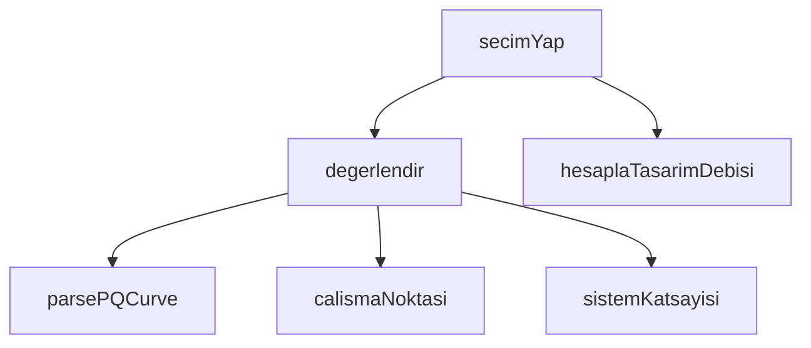

## Genel Bakış
Bu modül, kanal fanı seçimi sürecini yönetir. Mahal özelliklerine göre tasarım debisi hesaplar, kanal sistemi parametrelerinden sistem katsayısını belirler, PQ eğri verilerini işleyerek fan çalışma noktasını bulur ve birden fazla fan adayını değerlendirip en uygun seçimi yapar.

## Fonksiyon Grupları

### Veri İşleme
Ham PQ eğrisi verisini uygulama içinde kullanılabilir nokta dizisine dönüştürür.
- `parsePQCurve`

### Hesaplama
Mahal tipi ve fiziksel boyutlardan tasarım debisini, kanal özelliklerinden ise sistem katsayısını hesaplar. PQ eğrisi ile sistem katsayısını birleştirerek fanın çalışma noktasını belirler.
- `hesaplaTasarimDebisi`, `sistemKatsayisi`, `calismaNoktasi`

### Değerlendirme ve Seçim
Tek bir fan adayını debi ve seçim kriterlerine göre değerlendirir. Tüm adaylar arasından karşılaştırma yaparak nihai fan seçim sonucunu üretir.
- `degerlendir`, `secimYap`

---

## AXIOMS – Mimari Varsayımlar
- Bu modül davranışsal mantık içermez (salt veri / konfigürasyon / tip tanımı).
- [Aksiyom 1]: Modülün dışa açtığı yapı (anahtar kümesi / şema) bir sözleşmedir; tüketiciler bu sabit yapıya bağlıdır — kırıcı değişiklik tüm tüketicileri etkiler.
- [Aksiyom 2]: Bir öğe ekleme/çıkarma yapısal-uyumlu olmalı; ilgili tipler ve seçiciler aynı commit'te güncel tutulmalıdır.

---

## FONKSİYON DETAYLARI

### parsePQCurve
**Ne yapar**: `pq_curve` alanını güvenli bir şekilde `PQNoktasi` dizisine dönüştürür. Canlı ortamda bu alan JSONB **string** olarak ("[[0, 210.9], …]" biçiminde) duruyor olabilir ama doğrudan dizi olarak da gelebilir; her iki biçimi de kabul eder. Tanıyamadığı hiçbir veriyi uydurmaz, boş dizi döner. Boş dizi, "eğri yok" anlamına gelir ve çağıran kod buna göre yedeğe (maksDebi) düşer.

**Nasıl yapar**: Önce gelen değerin türünü kontrol eder. Eğer `string` ise `JSON.parse` ile çözümlemeye çalışır; çözümleme başarısız olursa boş dizi döner. Çözümlenen ya da zaten dizi olan veri `Array.isArray` ile doğrulanır; dizi değilse yine boş dizi döner. Ardından her bir öğeyi iterasyona alır: öğe dizi değilse ya da uzunluğu 2'den azsa atlanır. İlk iki eleman `Number()` ile sayıya dönüştürülür; sonucu sonlu olmayan ya da negatif olan öğeler elenir. Geçerli öğeler `{ debiM3h, basincPa }` nesnelerine dönüştürülür. Son olarak debiye göre artan sıralama yapılır çünkü kaynak sırasına güvenilmez.

**Parametreler**:
- ham: unknown — İşlenecek ham veri. JSONB string ("[[0, 210.9], …]") ya da doğrudan dizi biçiminde gelebilir.

**Dönüş**: `PQNoktasi[]` — Her elemanı `{ debiM3h: number, basincPa: number }` biçiminde olan, debiye göre artan sıralı dizi. Geçersiz veya boş veri durumunda boş dizi döner.

### hesaplaTasarimDebisi
**Ne yapar**: Geliştirildi ancak detay üretilemedi.

### sistemKatsayisi
**Ne yapar**: Geliştirildi ancak detay üretilemedi.

### calismaNoktasi
**Ne yapar**: Geliştirildi ancak detay üretilemedi.

### degerlendir
**Ne yapar**: Geliştirildi ancak detay üretilemedi.

### secimYap
**Ne yapar**: Geliştirildi ancak detay üretilemedi.

---

## İTHALATLAR (IMPORTS)
- import: ./ductPressure::kanalBasincKaybi
- import: ./ductPressure::type KanalMalzemesi

---

## INTERFACES

### PQNoktasi
Fan eğrisinin tek noktası: bu debide fanın üretebildiği statik basınç.
- `debiM3h: number`
- `basincPa: number`

### SecimGirdisi
Sihirbazın kullanıcıdan topladığı ham girdi.
- `mahal: MahalTipi`
- `alanM2: number`
- `tavanYuksekligiM: number`
- `guzergah: KanalGuzergahi`
- `sessizlik: SessizlikOnceligi`
- `kanalCapiMm: number | null`
- `malzeme: KanalMalzemesi`

### FanAdayi
Seçim motorunun değerlendirdiği tek ürün adayı.
- `id: string`
- `sku: string`
- `ad: string`
- `slug: string`
- `pqCurveHam: unknown`
- `maksDebiM3h: number | null`
- `sesDbA: number | null`
- `gucW: number | null`
- `capMm: number | null`

### AdaySonucu
Bir adayın hesaplanmış sonucu.
- `aday: FanAdayi`
- `calismaDebisiM3h: number`
- `calismaBasinciPa: number`
- `karsilamaOrani: number`
- `puan: number`
- `elenmeSebebi: ElenmeSebebi | null`

### DebiHesabi
Debi hesabının şeffaf dökümü — kullanıcıya "neden bu sayı" diye gösterilir.
- `hacimM3: number`
- `ach: number`
- `hamDebiM3h: number`
- `minimumM3h: number`
- `tasarimDebiM3h: number`
- `minimumUygulandi: boolean`

### SecimSonucu
- `hesap: DebiHesabi`
- `sistemBasinciPa: number`
- `uygunlar: AdaySonucu[]`
- `elenenler: AdaySonucu[]`
- `enUygun: AdaySonucu | null`
- `enSessiz: AdaySonucu | null`
- `enVerimli: AdaySonucu | null`

---

## TYPE ALIASES

### MahalTipi
Kullanıcının seçtiği mahal — hava değişim sayısını (ACH) belirler.
```typescript
type MahalTipi = 'bathroom' | 'kitchen' | 'bedroom' | 'living' | 'office' | 'shop'
```

### KanalGuzergahi
Kanal güzergâhının kabaca uzunluğu/dirsekliliği — sistem direncini belirler.
```typescript
type KanalGuzergahi = 'short' | 'medium' | 'long'
```

### SessizlikOnceligi
Sessizliğin kullanıcı için önemi — puanlamada ses ağırlığını belirler.
```typescript
type SessizlikOnceligi = 'normal' | 'important' | 'critical'
```

### ElenmeSebebi
```typescript
type ElenmeSebebi = 'debi-yetersiz' | 'cap-uyusmuyor' | 'veri-yok'
```

---

## SABİTLER
- **MAHAL_KURALLARI** (object) — `{
  bathroom: { ach: 8, minimumM3h: 85 },
  kitchen: { ach: 15, minimumM3h:...`
- **GUZERGAH_GEOMETRISI** (object) — `{
  short: { uzunlukM: 3, dirsek90: 1, dirsek45: 0 },
  medium: { uzunlukM:...`
- **SESSIZLIK_AGIRLIGI** (object) — `{
  normal: 0.2,
  important: 0.4,
  critical: 0.6,
}`

---

## AST POINTERS

### [N1_NASIL] AST Pointer: src/lib/hvac/ductFanSelection.ts::parsePQCurve
- **params**: `ham: unknown`
- **ic_degiskenler**:
  - `dizi` — `ham` parametresinin işlenmiş hali; `ham` string ise `JSON.parse` ile parse edilir, değilse doğrudan `ham` atanır
  - `noktalar` — geçerli PQ noktalarının biriktirildiği dizi (`PQNoktasi[]`)
  - `oge` — `dizi` içindeki her bir eleman (for-of döngüsü)
  - `q` — `oge[0]` değerinden `Number()` ile dönüştürülen debi (`M3/h`)
  - `p` — `oge[1]` değerinden `Number()` ile dönüştürülen basınç (`Pa`)
- **Dönüş**: `PQNoktasi[]` — debiye göre artan sırada sıralanmış geçerli PQ noktaları dizisi; geçersiz girdi durumunda boş dizi

### [N2_NASIL] AST Pointer: src/lib/hvac/ductFanSelection.ts::hesaplaTasarimDebisi
- **params**: `mahal: MahalTipi`, `alanM2: number`, `tavanYuksekligiM: number`
- **ic_degiskenler**:
  - `kural` — `MAHAL_KURALLARI[mahal]` erişimiyle elde edilen mahal tipine ait kural nesnesi (`.ach` ve `.minimumM3h` alanlarına erişilir)
  - `hacimM3` — `Math.max(0, alanM2) * Math.max(0, tavanYuksekligiM)` ile hesaplanan hacim
  - `hamDebiM3h` — `hacimM3 * kural.ach` ile hesaplanan ham debi
  - `tasarimDebiM3h` — `Math.max(hamDebiM3h, kural.minimumM3h)` ile hesaplanan tasarım debisi
- **Dönüş**: `DebiHesabi` — `{ hacimM3, ach, hamDebiM3h, minimumM3h, tasarimDebiM3h, minimumUygulandi }` alanlarını içeren nesne

### [N3_NASIL] AST Pointer: src/lib/hvac/ductFanSelection.ts::sistemKatsayisi
- **params**: `tasarimDebiM3h: number`, `guzergah: KanalGuzergahi`, `capMm: number`, `malzeme: KanalMalzemesi`
- **ic_degiskenler**:
  - `geo` — `GUZERGAH_GEOMETRISI[guzergah]` erişimiyle elde edilen güzergah geometri nesnesi (`.uzunlukM`, `.dirsek90`, `.dirsek45` alanlarına erişilir)
  - `dokum` — `kanalBasincKaybi()` fonksiyonunun dönüş değeri; `.toplamPa` alanına erişilir
- **Dönüş**: `number` — `dokum.toplamPa / (tasarimDebiM3h * tasarimDebiM3h)` formülüyle hesaplanan sistem direnç katsayısı; geçersiz girdi durumunda `0`

### [N4_NASIL] AST Pointer: src/lib/hvac/ductFanSelection.ts::calismaNoktasi
- **params**: `egri: PQNoktasi[]`, `k: number`
- **ic_degiskenler**:
  - `son` — `egri[egri.length - 1]` erişimiyle elde edilen eğrinin son (en yüksek debili) noktası; `k <= 0` durumunda kullanılır
  - `a` — `egri[i]` erişimiyle elde edilen segmentin başlangıç noktası
  - `b` — `egri[i + 1]` erişimiyle elde edilen segmentin bitiş noktası
  - `dQ` — `b.debiM3h - a.debiM3h` hesaplamasıyla elde edilen segment debi farkı
  - `egim` — `(b.basincPa - a.basincPa) / dQ` formülüyle hesaplanan segment eğimi
  - `c` — `a.basincPa - egim * a.debiM3h` formülüyle hesaplanan denklem sabiti
  - `disk` — `egim * egim + 4 * k * c` formülüyle hesaplanan diskriminant
  - `kok` — `(egim + Math.sqrt(disk)) / (2 * k)` formülüyle hesaplanan ikinci derece denklemin kökü
  - `q` — `Math.min(Math.max(kok, a.debiM3h), b.debiM3h)` ile segment sınırları içinde sıkıştırılmış debi değeri
- **Dönüş**: `PQNoktasi | null` — `{ debiM3h, basincPa }` çalışma noktası; eğri yetersizse `null`, sistem eğrisi tamamen üstündeyse `{ debiM3h: 0, basincPa: 0 }`

### [N5_NASIL] AST Pointer: src/lib/hvac/ductFanSelection.ts::degerlendir
- **params**: `aday: FanAdayi`, `hesap: DebiHesabi`, `girdi: SecimGirdisi`
- **ic_degiskenler**:
  - `capMm` — `girdi.kanalCapiMm ?? aday.capMm ?? 0` ifadesiyle belirlenen kanal çapı
  - `k` — `sistemKatsayisi()` çağrısıyla hesaplanan sistem direnç katsayısı
  - `egri` — `parsePQCurve(aday.pqCurveHam)` çağrısıyla elde edilen PQ eğrisi
  - `nokta` — `calismaNoktasi(egri, k)` çağrısıyla elde edilen çalışma noktası
  - `karsilamaOrani` — `hesap.tasarimDebiM3h > 0 ? nokta.debiM3h / hesap.tasarimDebiM3h : 0` formülüyle hesaplanan debi karşılama oranı
  - `elenmeSebebi` — `ElenmeSebebi | null` tipinde eleme sebebi; çap uyuşmazlığında `'cap-uyusmuyor'`, debi yetersizliğinde `'debi-yetersiz'`
  - `debiPuani` — karşılama oranına göre 0-1 arası debi uygunluk puanı; 1.0–1.3 arası tam puan, üstü kademeli düşer
  - `sesPuani` — `Math.min(1, Math.max(0, (55 - aday.sesDbA) / 30))` formülüyle hesaplanan ses puanı; `sesDbA` yoksa `0.5`
  - `ozgulGuc` — `aday.gucW / nokta.debiM3h` formülüyle hesaplanan spesifik güç (`W/(m³/h)`); veri yoksa `null`
  - `verimPuani` — `Math.min(1, Math.max(0, (0.5 - ozgulGuc) / 0.45))` formülüyle hesaplanan verim puanı; `ozgulGuc` yoksa `0.5`
  - `sesAgirligi` — `SESSIZLIK_AGIRLIGI[girdi.sessizlik]` erişimiyle elde edilen sessizlik ağırlık katsayısı
  - `kalan` — `1 - sesAgirligi` hesaplamasıyla elde edilen kalan ağırlık
  - `puan` — `100 * (sesAgirligi * sesPuani + kalan * ((2/3) * debiPuani + (1/3) * verimPuani))` formülüyle hesaplanan toplam puan
- **Dönüş**: `AdaySonucu` — `{ aday, calismaDebisiM3h, calismaBasinciPa, karsilamaOrani, puan, elenmeSebebi }` alanlarını içeren nesne; nokta bulunamazsa `puan: 0`, `elenmeSebebi: 'veri-yok'`

### [N6_NASIL] AST Pointer: src/lib/hvac/ductFanSelection.ts::secimYap
- **params**: `adaylar: FanAdayi[]`, `girdi: SecimGirdisi`
- **ic_degiskenler**:
  - `hesap` — `hesaplaTasarimDebisi(girdi.mahal, girdi.alanM2, girdi.tavanYuksekligiM)` çağrısıyla elde edilen debi hesap sonucu
  - `referansCap` — `girdi.kanalCapiMm ?? 150` ifadesiyle belirlenen referans kanal çapı
  - `geo` — `GUZERGAH_GEOMETRISI[girdi.guzergah]` erişimiyle elde edilen güzergah geometri nesnesi
  - `sistemBasinciPa` — `kanalBasincKaybi()` çağrısının `.toplamPa` değeriyle elde edilen temsilî sistem basınç kaybı
  - `tumu` — `adaylar.map((a) => degerlendir(a, hesap, girdi))` ile elde edilen tüm aday değerlendirme sonuçları
  - `uygunlar` — `tumu.filter((s) => s.elenmeSebebi === null).sort((a, b) => b.puan - a.puan)` ile elde edilen elenmemiş ve puana göre azalan sıralı adaylar
  - `elenenler` — `tumu.filter((s) => s.elenmeSebebi !== null)` ile elde edilen elenmiş adaylar
  - `sesliOlanlar` — `uygunlar.filter((s) => s.aday.sesDbA != null)` ile elde edilen ses verisi olan uygun adaylar
  - `enSessiz` — `sesliOlanlar.reduce()` ile bulunan en düşük `sesDbA` değerine sahip uygun aday; ses verisi yoksa `null`
  - `guclu` — `uygunlar.filter((s) => s.aday.gucW != null && s.calismaDebisiM3h > 0)` ile elde edilen güç verisi olan ve pozitif debili adaylar
  - `enVerimli` — `guclu.reduce()` ile bulunan en düşük `gucW / calismaDebisiM3h` oranına sahip uygun aday; güç verisi yoksa `null`
- **Dönüş**: `SecimSonucu` — `{ hesap, sistemBasinciPa, uygunlar, elenenler, enUygun, enSessiz, enVerimli }` alanlarını içeren nesne; `enUygun` uygunlar boşsa `null`

---


## MERMAID CALL GRAPH


## NODE ID STANDARD

  file: src\lib\hvac\ductFanSelection.ts
  function: src\lib\hvac\ductFanSelection.ts::parsePQCurve
  function: src\lib\hvac\ductFanSelection.ts::hesaplaTasarimDebisi
  function: src\lib\hvac\ductFanSelection.ts::sistemKatsayisi
  function: src\lib\hvac\ductFanSelection.ts::calismaNoktasi
  function: src\lib\hvac\ductFanSelection.ts::degerlendir
  function: src\lib\hvac\ductFanSelection.ts::secimYap

---

## DISA AKTARILANLAR (EXPORTS)
  export: AdaySonucu
  export: DebiHesabi
  export: ElenmeSebebi
  export: FanAdayi
  export: GUZERGAH_GEOMETRISI
  export: KanalGuzergahi
  export: MAHAL_KURALLARI
  export: MahalTipi
  export: PQNoktasi
  export: SESSIZLIK_AGIRLIGI
  export: SecimGirdisi
  export: SecimSonucu
  export: SessizlikOnceligi
  export: calismaNoktasi
  export: degerlendir
  export: hesaplaTasarimDebisi
  export: parsePQCurve
  export: secimYap
  export: sistemKatsayisi