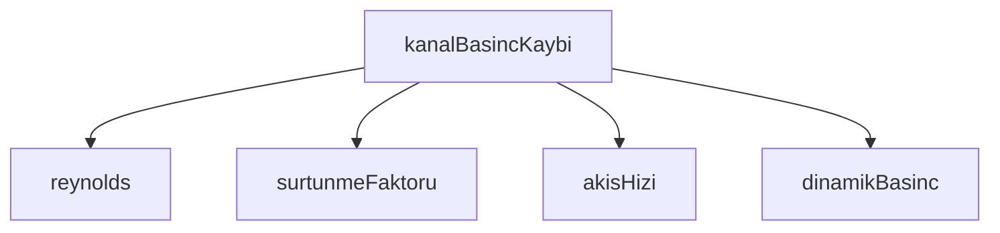

## Genel Bakış
Bu modül, HVAC kanal sistemlerinde basınç kaybı hesaplamalarını gerçekleştiren temel akışkan mekaniği fonksiyonlarını içerir. Hava debisi, kanal çapı ve pürüzlülük gibi girdilere dayanarak akış hızı, Reynolds sayısı, sürtünme faktörü ve dinamik basınç gibi büyüklükleri hesaplar. Ana fonksiyon `kanalBasincKaybi`, bu temel hesaplamaları birleştirerek kanalın toplam basınç kaybını detaylı bir döküm halinde sunar.

## Fonksiyon Grupları

### Temel Akışkan Mekaniği Hesaplamaları
Debi, çap ve hız gibi temel girdilerden akışkan mekaniğinin kritik büyüklüklerini hesaplayan bağımsız yardımcı fonksiyonlardır. Bu fonksiyonlar birbirlerini doğrudan çağırmaz; her biri kendi girdileriyle çalışır.
- `akisHizi`, `reynolds`, `dinamikBasinc`

### Sürtünme Faktörü Hesaplama
Reynolds sayısı ve bağıl pürüzlülük değerine göre Darcy sürtünme faktörünü hesaplar. Moody diyagramı veya Colebrook denklemi benzeri bir ilişki kullanılarak boru/kanal duvarındaki sürtünme kaybını belirler.
- `surtunmeFaktoru`

### Ana Basınç Kaybı Hesaplama
Modülün üst düzey fonksiyonudur. Verilen debi ve kanal tanımına göre akış hızını, Reynolds sayısını, sürtünme faktörünü ve dinamik basıncı hesaplayarak toplam kanal basınç kaybını bir `BasincDokumu` nesnesi olarak döndürür. Diğer tüm fonksiyonları orkestrasyon altında çağırır.
- `kanalBasincKaybi`

---

## AXIOMS – Mimari Varsayımlar

Bu modül HVAC kanal basınç kaybı hesaplamaları için temel akış dinamiği fonksiyonlarını içerir.

[Aksiyom 1]: Eğer `capMm` 0 ise, `akisHizi` ve `reynolds` fonksiyonlarında sıfıra bölme hatası oluşur ve sonuç hesaplanamaz.

[Aksiyom 2]: Eğer `Re` 0 ise, `surtunmeFaktoru` fonksiyonunda sürtünme faktörü hesaplanamaz.

[Aksiyom 3]: Eğer `debiM3h` negatif ise, `akisHizi` fonksiyonu negatif hız değeri üretir; bu fiziksel olarak anlamsız bir sonuçtur.

[Aksiyom 4]: Eğer `hizMs` negatif ise, `dinamikBasinc` fonksiyonu negatif basınç değeri üretir; bu fiziksel olarak anlamsız bir sonuçtur.

[Aksiyom 5]: Eğer `KanalTanimi` içinde çap bilgisi yoksa veya 0 ise, `kanalBasincKaybi` fonksiyonu basınç kaybını hesaplayamaz.

[Aksiyom 6]: Eğer `bagilPuruzluluk` negatif ise, `surtunmeFaktoru` fonksiyonu geçersiz bir sürtünme faktörü üretir.

---

## FONKSİYON DETAYLARI

### surtunmeFaktoru
**Ne yapar**: Colebrook-White denklemini çözerek dairesel bir kanalın Darcy sürtünme faktörünü hesaplar. Denklem örtüktür (f her iki tarafta da yer alır); bu nedenle sabit nokta iterasyonu kullanılarak sayısal çözüm yapılır. Laminer akış bölgesinde (Re < 2300) analitik çözüm (f = 64/Re) geçerlidir; türbülanslı bölge için iterasyon uygulanır.

**Nasıl yapar**: Fonksiyon öncelikle girdi doğrulaması yapar; Re sonlu ve pozitif değilse 0 döner. Re < 2300 olduğunda laminer formül doğrudan uygulanır. Türbülanslı bölge için başlangıç tahmini olarak Swamee-Jain açık formülü kullanılır (0.25 / [log₁₀(ε/D / 3.7 + 5.74 / Re^0.9)]²). Ardından 1/√f için sabit nokta iterasyonu yapılır: her adımda mevcut f değerinden √f hesaplanır, Colebrook-White denkleminin sağ tarafı kullanılarak yeni f değeri elde edilir. İki ardışık f değeri arasındaki fark 1e-12 eşik değerinin altına düştüğünde yakınsama sağlanmış sayılır ve sonuç döndürülür. Maksimum 20 iterasyon adımından sonra mevcut f değeri döndürülür.

**Parametreler**:
- Re: number — Reynolds sayısı (boyutsuz). Sonlu ve pozitif olmalıdır; aksi halde 0 döner.
- bagilPuruzluluk: number — ε/D, yani yüzey pürüzlülüğünün çapa oranı (boyutsuz).

**Dönüş**: number — Darcy sürtünme faktörü (f, boyutsuz). Laminer bölgede 64/Re, türbülanslı bölgede iterasyonla elde edilen değerdir. Geçersiz girdi durumunda 0 döner.

### akisHizi
**Ne yapar**: Geliştirildi ancak detay üretilemedi.

### reynolds
**Ne yapar**: Geliştirildi ancak detay üretilemedi.

### dinamikBasinc
**Ne yapar**: Geliştirildi ancak detay üretilemedi.

### kanalBasincKaybi
**Ne yapar**: Geliştirildi ancak detay üretilemedi.

---

## INTERFACES

### KanalTanimi
- `uzunlukM: number`
- `capMm: number`
- `malzeme: KanalMalzemesi`
- `dirsek90: number`
- `dirsek45: number`

### BasincDokumu
- `hizMs: number`
- `reynolds: number`
- `surtunmeFaktoru: number`
- `surtunmeKaybiPa: number`
- `yerelKayipPa: number`
- `toplamPa: number`

---

## TYPE ALIASES

### KanalMalzemesi
```typescript
type KanalMalzemesi = keyof typeof PURUZLULUK_M
```

---

## SABİTLER
- **PURUZLULUK_M** (as_expression) — `{
  galvanized: 0.00015,
  pvc: 0.00001,
  flex: 0.003,
} as const`
- **FITTING_K** (as_expression) — `{
  /** 90° yuvarlak dirsek, eğrilik yarıçapı = 1,5·D (tipik hazır dirsek). ...`
- **TERMINAL_K** (as_expression) — `{
  /** İç mahal egzoz menfezi/ızgarası. */
  menfez: 2.5,
  /** Geri-akış...`
- **TERMINAL_K_TOPLAM** (binary_expression) — `TERMINAL_K.menfez + TERMINAL_K.klape + TERMINAL_K.disPanjur`

---

## AST POINTERS

### [N1_NASIL] AST Pointer: ductPressure.ts::surtunmeFaktoru
- **params**: `Re` (number), `bagilPuruzluluk` (number)
- **ic_degiskenler**:
  - `f` — Swamee-Jain açık formülüyle hesaplanan başlangıç sürtünme faktörü tahmini; döngü içinde Colebrook iterasyonuyla güncellenir
  - `i` — for döngü sayacı, 0'dan 19'a kadar (en fazla 20 iterasyon)
  - `sqrtF` — `f` değerinin kareköyü; Colebrook denkleminde `2.51 / (Re * sqrtF)` teriminde kullanılır
  - `sag` — `-2 * log10(bagilPuruzluluk/3.7 + 2.51/(Re*sqrtF))` ifadesinin sonucu; Colebrook iterasyonunda ara değer
  - `yeniF` — `1 / (sag * sag)` formülüyle hesaplanan bir sonraki iterasyon sürtünme faktörü adayı
- **Dönüş**: number — hesaplanmış sürtünme faktörü (Darcy-Weisbach); Re geçersiz veya ≤0 ise 0, Re < 2300 ise `64/Re` (laminer), aksi halde iteratif çözüm sonucu

### [N2_NASIL] AST Pointer: ductPressure.ts::akisHizi
- **params**: `debiM3h` (number), `capMm` (number)
- **ic_degiskenler**:
  - `yaricapM` — kanal çapının metre cinsinden yarısı (`capMm / 2000`)
  - `alanM2` — dairesel kesit alanı metre kare cinsinden (`π * yaricapM²`)
- **Dönüş**: number — akış hızı m/s cinsinden (`debiM3h / 3600 / alanM2`); `capMm` ≤ 0 veya `alanM2` ≤ 0 ise 0

### [N3_NASIL] AST Pointer: ductPressure.ts::reynolds
- **params**: `hizMs` (number), `capMm` (number)
- **ic_degiskenler**: yok
- **sabit_erisimi**: `HAVA_KINEMATIK_VISKOZITE` — paydayda kullanılır
- **Dönüş**: number — Reynolds sayısı (`hizMs * (capMm/1000) / HAVA_KINEMATIK_VISKOZITE`)

### [N4_NASIL] AST Pointer: ductPressure.ts::dinamikBasinc
- **params**: `hizMs` (number)
- **ic_degiskenler**: yok
- **sabit_erisimi**: `HAVA_YOGUNLUGU` — çarpan olarak kullanılır
- **Dönüş**: number — dinamik basınç Pa cinsinden (`HAVA_YOGUNLUGU * hizMs² / 2`)

### [N5_NASIL] AST Pointer: ductPressure.ts::kanalBasincKaybi
- **params**: `debiM3h` (number), `kanal` (KanalTanimi)
- **ic_degiskenler**:
  - `hizMs` — `akisHizi(debiM3h, kanal.capMm)` çağrısından dönen akış hızı (m/s)
  - `Re` — `reynolds(hizMs, kanal.capMm)` çağrısından dönen Reynolds sayısı
  - `bagil` — bağıl pürüzlülük; `PURUZLULUK_M[kanal.malzeme]` sabitinden malzeme bazlı değer alınıp `(kanal.capMm / 1000)` çapına bölünür
  - `f` — `surtunmeFaktoru(Re, bagil)` çağrısından dönen Darcy sürtünme faktörü
  - `pDin` — `dinamikBasinc(hizMs)` çağrısından dönen dinamik basınç (Pa)
  - `capM` — kanal çapı metre cinsinden (`kanal.capMm / 1000`)
  - `surtunmeKaybiPa` — sürtünme kaybı basınç düşümü (Pa); `capM > 0` ise `f * (kanal.uzunlukM / capM) * pDin`, aksi halde 0
  - `toplamK` — toplam yerel kayıp katsayısı; `kanal.dirsek90 * FITTING_K.dirsek90` + `kanal.dirsek45 * FITTING_K.dirsek45` + `TERMINAL_K_TOPLAM`
  - `yerelKayipPa` — yerel kayıp basınç düşümü (Pa); `toplamK * pDin`
- **sabit_erisimi**: `PURUZLULUK_M[kanal.malzeme]` — malzeme bazlı mutlak pürüzlülük (m), `FITTING_K.dirsek90` — 90° dirsek kayıp katsayısı, `FITTING_K.dirsek45` — 45° dirsek kayıp katsayısı, `TERMINAL_K_TOPLAM` — terminal toplam kayıp katsayısı
- **kanal_alan_erisimleri**: `kanal.capMm`, `kanal.malzeme`, `kanal.uzunlukM`, `kanal.dirsek90`, `kanal.dirsek45`
- **Dönüş**: BasincDokumu — `{ hizMs, reynolds, surtunmeFaktoru, surtunmeKaybiPa, yerelKayipPa, toplamPa }` alanlarını içeren nesne; `toplamPa` = `surtunmeKaybiPa + yerelKayipPa`

---


## MERMAID CALL GRAPH


## NODE ID STANDARD

  file: src\lib\hvac\ductPressure.ts
  function: src\lib\hvac\ductPressure.ts::surtunmeFaktoru
  function: src\lib\hvac\ductPressure.ts::akisHizi
  function: src\lib\hvac\ductPressure.ts::reynolds
  function: src\lib\hvac\ductPressure.ts::dinamikBasinc
  function: src\lib\hvac\ductPressure.ts::kanalBasincKaybi

---

## DISA AKTARILANLAR (EXPORTS)
  export: BasincDokumu
  export: FITTING_K
  export: KanalMalzemesi
  export: KanalTanimi
  export: PURUZLULUK_M
  export: TERMINAL_K
  export: TERMINAL_K_TOPLAM
  export: akisHizi
  export: dinamikBasinc
  export: kanalBasincKaybi
  export: reynolds
  export: surtunmeFaktoru