## Genel Bakış
Bu modül, ısıtma havalandırma ve iklimlendirme (HVAC) sistemlerinin temel mühendislik hesaplamalarını merkezileştiren bir yardımcı kütüphanedir. Hava perdesi, kanal sistemi, ısı geri kazanım ünitesi (HRV) ve jet fan gibi ekipmanların boyutlandırılması ve performans analizi için gerekli tüm hesaplama fonksiyonlarını içerir. Modül, fiziksel formüller ve standart verileri kullanarak proje koşullarına özel sonuçlar üretir.

## Fonksiyon Grupları
### Ana Ekipman Hesaplayıcıları
Bu fonksiyonlar, farklı HVAC ekipmanları için kapsamlı hesaplamaları yönetir ve nihai sonuçları üretir. Girdi parametrelerini alarak ilgili yardımcı fonksiyonları çağırır ve ekipman boyutlandırma ile performans analizini gerçekleştirir.
- calculateAirCurtain, calculateDuct, calculateHRV, calculateJetFan

### Hava Perdesi Hesaplama Yardımcıları
Hava perdesi boyutlandırma ve performans hesaplamaları için gerekli ara değerleri ve düzeltme faktörlerini hesaplayan fonksiyonlardır. Bu fonksiyonlar, ana hava perdesi hesaplayıcısı tarafından kullanılır.
- getNozzleVelocityRange, getTargetFloorVelocity, getAdjustmentFactor

### Kanal Sistemi Hesaplama Yardımcıları
Kanal sistemlerinin fiziksel özelliklerini, basınç kayıplarını ve hava hızını değerlendiren fonksiyonlardır. Bu fonksiyonlar, ana kanal hesaplayıcısının temel bileşenleridir ve kanal boyutlandırma sürecini destekler.
- getRoughness, calculateEquivalentDiameter, calculateArea, calculatePressureLoss, evaluateVelocity, suggestDimensions

### HRV ve Jet Fan Veri Sağlayıcıları
Isı geri kazanım ünitesi ve jet fan hesaplamaları için gerekli standart verileri ve katsayıları sağlayan fonksiyonlardır. Bu fonksiyonlar, ana hesaplayıcılar tarafından çağırılarak proje koşullarına uygun temel değerlerin

---

## AXIOMS – Mimari Varsayımlar

Bu modül için fonksiyon gövdeleri sağlanmadığından, yalnızca fonksiyon imzalarından çıkarılabilen varsayımlar listelenmektedir.

[Aksiyom 1]: Eğer `calculateArea` fonksiyonuna `ductType` parametresi verilmezse, fonksiyon çağrılamaz (zorunlu parametre). Dairesel kesit için `diameter`, dikdörtgen/üçgen kesit için `width` ve `height` parametrelerinden uygun olanı sağlanmalıdır; sağlanmazsa hesaplama yapılamaz.

[Aksiyom 2]: Eğer `calculateEquivalentDiameter` fonksiyonuna `width` veya `height` değerlerinden biri sıfır veya negatifse, eşdeğer çap hesaplanamaz.

[Aksiyom 3]: Eğer `calculatePressureLoss` fonksiyonuna `velocity`, `diameter` veya `roughness` parametrelerinden biri sıfır veya negatif verilirse, basınç kaybı hesaplaması yapılamaz.

[Aksiyom 4]: Eğer `calculateAirCurtain` fonksiyonuna geçerli bir `AirCurtainInput` nesnesi sağlanmazsa, hava perdesi hesaplaması yapılamaz.

[Aksiyom 5]: Eğer `calculateDuct` fonksiyonuna geçerli bir `DuctInput` nesnesi sağlanmazsa, kanal hesaplaması yapılamaz.

[Aksiyom 6]: Eğer `calculateHRV` fonksiyonuna geçerli bir `HRVInput` nesnesi sağlanmazsa, ısı geri kazanım ventilatörü hesaplaması yapılamaz.

[Aksiyom 7]: Eğer `calculateJetFan` fonksiyonuna geçerli bir `JetFanInput` nesnesi sağlanmazsa, jet fan hesaplaması yapılamaz.

[Aksiyom 8]: Eğer `getNozzleVelocityRange` fonksiyonuna `doorHeight` sıfır veya negatif verilirse, nozül hız aralığı belirlenemez.

[Aksiyom 9]: Eğer `suggestDimensions` fonksiyonuna `airflow` veya `targetVelocity` sıfır veya negatif verilirse, kanal boyutu önerisi üretilemez.

[Aksiyom 10]: Eğer `evaluateVelocity` fonksiyonuna negatif bir `velocity` değeri verilirse, durum değerlendirmesi yapılamaz.

[Aksiyom 11]: Eğer `getAdjustmentFactor` fonksiyonuna geçerli bir `WindCondition` veya `TrafficIntensity` değeri sağlanmazsa, düzeltme faktörü hesaplanamaz.

[Aksiyom 12]: Eğer `getRequiredACH` fonksiyonuna geçerli bir `JetFanApplication` veya `JetFanMode` değeri sağlanmazsa, gerekli hava değişim sayısı belirlenemez.

[Aksiyom 13]: `TYPICAL_JET_FAN` sabiti modül kapsamında tanımlıdır ve jet fan hesaplamalarında referans değer olarak kullanılır; bu sabit yoksa ilgili hesaplamalar yapılamaz.

---

## FONKSİYON DETAYLARI

### getNozzleVelocityRange
**Ne yapar**: Hava perdesinin uygulama türü ve monte edileceği kapının yüksekliğine göre nozül çıkış hızının minimum, maksimum ve hedef değerlerini m/s cinsinden sunar. Tüm değerler klimaglobal.com ve airtecnics.com gibi endüstri kaynaklarındaki standartlara uygun olarak belirlenir. Farklı kullanım alanları için gereken hız aralıklarını standartlaştırarak doğru boyutlandırma için temel değerler sunar.
**Nasıl yapar**: Uygulama türüne ve kapı yüksekliğine göre önceden kaynaklarda tanımlanmış standart hız aralıklarını giriş parametreleriyle eşleştirir. Her kullanım senaryosu için izin verilen hız sınırlarını ve optimum çalışma noktasını tek bir nesne içinde toplayarak kullanıma sunar, hesaplamalarda tutarlılık sağlar.
**Parametreler**:
- application: AirCurtainApplication — Hava perdesinin kullanılacağı uygulama türünü tanımlayan tip değeri, farklı işletmeler veya alanlar için özel standartları tetikler
- doorHeight: number — Hava perdesinin monte edileceği kapının metre cinsinden yüksekliği, ihtiyaç duyulan nozül hızını doğrudan etkileyen boyut değeri
**Dönüş**: { min: number; max: number; target: number } — Sırasıyla minimum izin verilen nozül hızı, maksimum izin verilen nozül hızı ve sürekli çalışma için önerilen hedef nozül hızı, tüm değerler m/s cinsindendir.

### getTargetFloorVelocity
**Ne yapar**: Kullanılan hava perdesi uygulama türüne göre zemin seviyesinde olması gereken hedef hava hızını m/s cinsinden döndürür. Tüm değerler klimaglobal.com kaynaklı endüstri standartlarına uygun olarak belirlenir, hava perdesinin etkinliğini zemin seviyesinde garanti altına almak için gereken eşik değeri sunar.
**Nasıl yapar**: Uygulama özelinde tanımlanmış standart zemin hızı değerlerini giriş olarak alınan uygulama türüyle eşleştirir. Her ortamın ihtiyaç duyduğu zemin hızı farklı olduğundan, ilgili senaryoya uygun olan hedef değeri tek bir sayı olarak iletir, boyutlandırma hesaplarında referans olarak kullanılmasını sağlar.
**Parametreler**:
- application: AirCurtainApplication — Hava perdesinin kullanılacağı işletim ortamı veya kullanım alanını tanımlayan tip değeri, hedef zemin hızını belirleyen temel parametredir
**Dönüş**: number — Zemin seviyesinde ulaşılması gereken hedef hız, m/s cinsindendir.

### getAdjustmentFactor
**Ne yapar**: Hava perdesinin çalıştığı ortamdaki rüzgar koşulları ve mekandaki trafik yoğunluğuna göre, tüm hesaplamalarda kullanılacak düzeltme faktörünü hesaplar. Standart laboratuvar koşullarında yapılan hesaplamaları gerçek dünya kullanım koşullarına uyacak şekilde ayarlamak için kullanılır.
**Nasıl yapar**: Rüzgar gücü ve trafik yoğunluğu seviyelerine göre atanmış çarpımsal düzeltme katsayılarını birleştirerek tek bir genel düzeltme faktörü oluşturur. Her iki çevresel etkenin hesaplamalar üzerindeki etkisini tek bir katsayıda toplar, ana boyutlandırma hesaplarında bu katsayı ile çarpma yapılarak gerçek koşullara uygun sonuçlar elde edilir.
**Parametreler**:
- wind: WindCondition — Hava perdesinin çalışacağı ortamdaki rüzgar koşulunun şiddetini veya sınıfını tanımlayan tip değeri
- traffic: TrafficIntensity — Mekandaki insan veya araç geçiş yoğunluğunu ifade eden, perdenin etkinliğini etkileyen trafik sınıfını tanımlayan tip değeri
**Dönüş**: number — Tüm hesaplamalarda kullanılacak toplam düzeltme faktörü değeri, standart sonuçları gerçek koşullara uyarlamak için kullanılır.

### calculateAirCurtain
**Ne yapar**: Girişte verilen tüm parametreleri kullanarak hava perdesi boyutlandırma hesaplamasını gerçekleştirir. Ana hesaplama formülü CFM = Hız × Çıkış Alanı olarak kullanılır, perdenin ihtiyaç duyduğu tüm teknik değerleri tek bir sonuç nesnesinde toplar.
**Nasıl yapar**: Önce nozül çıkış alanını kapı genişliği ile tipik 50-100mm aralığında olan nozül yüksekliğini çarparak hesaplar. Ardından hesaplanan çıkış alanını nozül çıkış hızı ile çarparak gerekli hava debisini CFM cinsinden çıkarır, tüm ara hesaplamalar ve nihai boyutlandırma sonuçlarını bir araya getirerek sonuç nesnesi olarak sunar.
**Parametreler**:
- input: AirCurtainInput — Hava perdesi hesaplaması için gerekli tüm giriş verilerini, kapı boyutları, uygulama türü, çevresel koşullar gibi tüm parametreleri barındıran tip nesnesi
**Dönüş**: AirCurtainResult — Hesaplanan boyutlandırma sonuçlarını, gerekli hava debisi, çalışma parametreleri gibi tüm çıktıları içeren tip nesnesi.

### getRoughness
**Ne yapar**: Hava kanalının üretildiği malzemeye göre malzemenin pürüzlülük faktörünü mm cinsinden döndürür. Kanal içindeki hava akışının sürtünmeden kaynaklanan etkilerini hesaplamak için temel bir değer sunar, basınç kaybı hesaplarında kullanılır.
**Nasıl yapar**: Farklı kanal malzemeleri için önceden tanımlanmış standart pürüzlülük değerlerini giriş olarak alınan malzeme türüyle eşleştirir. Her malzemenin akışa farklı derecede direnç göstermesi nedeniyle, ilgili malzemeye ait doğru pürüzlülük değerini ileterek basınç kaybı hesaplarının doğruluğunu garanti altına alır.
**Parametreler**:
- material: DuctMaterial — Hava kanalının üretildiği malzeme türünü tanımlayan, metal, plastik gibi seçenekleri içeren tip değeri
**Dönüş**: number — İlgili malzemenin pürüzlülük faktörü, mm cinsindendir ve basınç kaybı hesaplarında kullanılır.

### calculateEquivalentDiameter
**Ne yapar**: Dikdörtgen kesitli hava kanalları için eşdeğer çap değerini hesaplar. Dikdörtgen kanalların daire kesitli kanallarla aynı akış özelliklerine sahip olacak şekilde bir çap değerine dönüştürülmesini sağlar, tek çap parametresiyle tüm standart hesaplamaların kullanılmasına olanak tanır.
**Nasıl yapar**: Deq = (1.30 × (w × h)^0.625) / (w + h)^0.25 formülünü kullanarak giriş olarak alınan kanalın genişlik ve yükseklik değerlerini eşdeğer çapa dönüştürür. Bu endüstri standardı formül ile dikdörtgen kanalların akış özellikleri doğru bir şekilde yuvarlak kanal standartlarına uyarlanır, karmaşık hesapları basitleştirir.
**Parametreler**:
- width: number — Dikdörtgen kanalın metre cinsinden genişliği, eşdeğer çap hesaplamasının temel girdisidir
- height: number — Dikdörtgen kanalın metre cinsinden yüksekliği, genişlik ile birlikte formülde kullanılır
**Dönüş**: number — Hesaplanan eşdeğer çap değeri, tüm standart kanal hesaplamalarında kullanılmak üzere uygun birimlerle sunulur.

### calculateArea
**Ne yapar**: Farklı türdeki hava kanallarının kesit alanını m² cinsinden hesaplar. Kanal içindeki hava hızı, debi gibi parametreleri hesaplamak için gereken temel kesit alan değerini, kanal türüne uygun olarak doğru şekilde hesaplar.
**Nasıl yapar**: Girişte alınan kanal türüne göre uygun alan hesaplama formülünü seçer ve uygular. Dairesel kanallar için sadece çap değerini kullanarak alanı hesaplarken, dikdörtgen kanallar için genişlik ve yükseklik değerlerini kullanır, ilgili kanal türü için zorunlu olmayan parametreleri hesaplamaya dahil etmez, her tür için doğru alan değerini sunar.
**Parametreler**:
- ductType: DuctType — Hesaplama yapılacak kanalın türünü belirten, dairesel, dikdörtgen gibi seçenekleri içeren tip değeri
- diameter?: number — Yalnızca dairesel kanallar için gerekli olan kanalın metre cinsinden çapı, diğer kanal türleri için zorunlu değildir
- width?: number — Dikdörtgen gibi çap kullanmayan kanal türleri için gerekli olan kanalın metre cinsinden genişliği
- height?: number — Yalnızca dikdörtgen kanallar için gerekli olan kanalın metre cinsinden yüksekliği
**Dönüş**: number — Hesaplanan kanal kesit alanı, m² cinsindendir ve tüm akış hesaplarında kullanılır.

### calculatePressureLoss
**Ne yapar**: HVAC kanal sisteminde hava akışının neden olduğu sürtünme kaynaklı basınç kaybını hesaplar. Darcy-Weisbach denklemi kullanarak birim uzunluk başına basınç düşümünü (Pa/m) döndürür. Sürtünme faktörü (f) Colebrook-White denklemiyle belirlenir.

**Nasıl yapar**: Öncelikle çap değerini milimetreden metreye çevirir. Geçersiz girdi kontrolü yapar (çap veya hız sıfır ya da negatifse 0 döner). Ardından mutlak pürüzlülük değerini (mm) kanal çapına (m) bölerek boyutsuz bağıl pürüzlülük (ε/D) hesaplar. Reynolds sayısını `reynolds` fonksiyonuyla, sürtünme faktörünü ise `surtunmeFaktoru` fonksiyonuyla hesaplar. Son olarak Darcy-Weisbach formülünü uygular: ΔP/L = f × (ρ × V²) / (2 × D). Burada `AIR_DENSITY` sabiti hava yoğunluğunu temsil eder.

**Parametreler**:
- velocity: number — Hava akış hızı (m/s cinsinden). Sıfır veya negatif değer girilirse fonksiyon 0 döner.
- diameter: number — Kanal iç çapı (mm cinsinden). Fonksiyon içinde metreye dönüştürülür (÷1000). Sıfır veya negatif değer girilirse fonksiyon 0 döner.
- roughness: number — Kanal malzemesinin mutlak pürüzlülük değeri (mm cinsinden). Örneğin galvaniz kanal için yaklaşık 0,015 mm. Fonksiyon içinde 1000'e bölünerek metreye çevrilir, ardından çapa bölünerek boyutsuz bağıl pürüzlülük (ε/D) elde edilir.

**Dönüş**: number — Birim uzunluk başına basınç kaybı (Pa/m cinsinden). Geçersiz girdi durumunda 0 döner.

### evaluateVelocity
**Ne yapar**: Kanal içindeki veya hava perdesi çıkışındaki hava hızının ASHRAE önerilerine uygunluğunu değerlendirir. Hızın durumunu sınıflandırır ve durumu açıklayan bir mesajla birlikte döndürür, sistemin çalışma koşullarının uygunluğunu kontrol etmeye olanak tanır.
**Nasıl yapar**: Giriş olarak alınan hız değerini ASHRAE standartlarında tanımlanan düşük, optimal, yüksek ve kritik eşik değerleriyle karşılaştırır. Hızın hangi aralıkta kaldığını tespit ederek ilgili durum etiketini atar, kullanıcının sorunu anlamasını sağlayan açıklayıcı bir mesajla birlikte bu değerleri sunar, hızın iyileştirilmesi gereken durumları işaret eder.
**Parametreler**:
- velocity: number — Değerlendirilecek olan m/s cinsinden hava hızı, eşik değerlerle karşılaştırılan temel girdidir
**Dönüş**: { status: 'low' | 'optimal' | 'high' | 'critical'; message: string } — Hızın uygunluk durumunu belirten durum etiketi ve durumu açıklayan kullanıcı dostu mesajı içeren nesne.

### suggestDimensions
**Ne yapar**: İstenen toplam hava debisi ve hedef kanal içi hız değerine uygun olarak kullanılabilecek alternatif standart kanal boyutu önerilerini sunar. Kullanıcının projesinin gereksinimlerine en uygun kanal boyutunu seçmesine yardımcı olur, mühendislik tasarım sürecini hızlandırır.
**Nasıl yapar**: Önce hedef hız ve hava debisi değerlerini kullanarak ihtiyaç duyulan toplam kesit alanını hesaplar. Ardından sektörde yaygın olarak kullanılan standart kanal boyutları arasından bu alana uygun olan birden fazla alternatifi seçer, her bir alternatifi genişlik ve yükseklik değerleriyle sunarak kullanıcının seçim yapmasına olanak tanır, tüm önerilerin hedef hızı sağlayacak şekilde hesaplanmasını garanti eder.
**Parametreler**:
- airflow: number — Kanalda taşınması gereken toplam hava debisi, gerekli kesit alanını hesaplamak için kullanılan girdi
- targetVelocity: number — Kanal içinde olması hedeflenen m/s cinsinden hava hızı, ihtiyaç duyulan alanı belirleyen temel parametre
**Dönüş**: { width: number; height: number }[] - Her bir alternatif kanalın metre cinsinden genişliği ve yüksekliğini içeren nesnelerden oluşan dizi, birden fazla uygulanabilir boyut seçeneği sunar.

### calculateDuct
**Ne yapar**: Verilen kanal parametreleri ile kanal boyutlandırma hesaplaması yapar. Hava hızı, basınç kaybı, eşdeğer çap ve önerilen ebatları hesaplayarak kullanıcının kanal seçimine yönelik öneriler sunar.

**Nasıl yapar**: Hava debisini m³/h'den m³/s'ye çevirir, kanal kesit alanını hesaplayarak hava hızını belirler. Hız durumunu değerlendirir, dairesel kanallarda çapı, dikdörtgen kanallarda eşdeğer çapı kullanarak malzeme pürüzlülüğü ile birlikte basınç kaybını hesaplar. Hız durumuna, malzeme türüne ve basınç kaybı seviyesine göre öneriler üretir.

**Parametreler**:
- `input`: DuctInput — Kanal boyutlandırma hesaplaması için gerekli tüm parametreleri içeren nesne. İçerisinde airflow, ductType, diameter, width, height, length ve material alanları bulunur.

**Dönüş**: DuctResult — velocity (m/s), velocityStatus, velocityMessage, pressureLossPerMeter (Pa/m), totalPressureLoss (Pa), equivalentDiameter (mm), suggestedDimensions ve recommendations alanlarını içeren sonuç nesnesi.

### getAirflowPerPerson
**Ne yapar**: Bina tipine göre kişi başı taze hava ihtiyacı değerini (m³/h·kişi) döndürür. ASHRAE 62.1 standardına dayalı olarak konut, ofis, ticari ve endüstriyel bina tipleri için farklı debi değerleri sağlar.

**Nasıl yapar**: Bina tipine karşılık gelen sabit bir değer döndüren basit bir eşleme (mapping) fonksiyonudur. Her bina tipi için standartlara uygun önceden tanımlı bir hava debisi değeri bulunur ve bu değer hesaplamalarda kullanılmak üzere döndürülür.

**Parametreler**:
- `buildingType`: BuildingType — Hava debisi hesaplanacak bina tipi (residential, office, commercial, industrial).

**Dönüş**: number — Kişi başı taze hava ihtiyacı (m³/h·kişi).

### getAirflowPerArea
**Ne yapar**: Bina tipine göre alan başı havalandırma değerini (m³/h·m²) döndürür. ASHRAE 62.1 standardına göre her bina tipi için metrekare başına düşen hava debisini tanımlar.

**Nasıl yapar**: Bina tipine göre önceden tanımlı sabit bir hava debisi değerini eşleme yoluyla döndürür. Konut, ofis, ticari ve endüstriyel alanlar için farklı metrekare başına düşen havalandırma değerleri mevcuttur.

**Parametreler**:
- `buildingType`: BuildingType — Alan başı havalandırma değerinin hesaplanacağı bina tipi (residential, office, commercial, industrial).

**Dönüş**: number — Alan başı havalandırma miktarı (m³/h·m²).

### getClimateDeltaT
**Ne yapar**: İklim bölgesine göre ortalama ısıtma ve soğutma sıcaklık farklarını (ΔT) döndürür. Soğuk, ılıman ve sıcak bölgeler için farklı sıcaklık farkı değerleri sağlar.

**Nasıl yapar**: İklim bölgesine karşılık gelen nesneyi doğrudan döndüren eşleme tabanlı bir fonksiyondur. Her bölge için ısıtma ve soğutma dönemlerinde beklenen ortalama sıcaklık farkları tanımlıdır ve ısı geri kazanım hesaplamalarında kullanılır.

**Parametreler**:
- `zone`: ClimateZone — Sıcaklık farklarının belirleneceği iklim bölgesi (cold, temperate, hot).

**Dönüş**: { heating: number; cooling: number } — Isıtma ve soğutma dönemleri için sıcaklık farkları (°C).

### calculateHRV
**Ne yapar**: Isı geri kazanım cihazı (HRV/ERV) hesaplaması yapar. Gerekli hava debisini, ısı ve soğutma geri kazanım miktarlarını, yıllık enerji tasarrufunu, maliyet tasarrufunu, CO2 azaltımını ve geri ödeme süresini hesaplar.

**Nasıl yapar**: Kişi başı ve alan başı hava debisi değerlerini (getAirflowPerPerson ve getAirflowPerArea) kullanarak toplam gerekli hava debisini belirler. İklim bölgesine göre sıcaklık farklarını alarak (getClimateDeltaT) ısıtma ve soğutma dönemleri için geri kazanım miktarlarını hesaplar. ERV cihazları için latent verimlilik eklenerek soğutma verimliliği yükseltilir. Yıllık enerji ve maliyet tasarrufu, cihaz kapasitesine göre logaritmik maliyet modeli ile geri ödeme süresi hesaplanır.

**Parametreler**:
- `input`: HRVInput — Isı geri kazanım hesaplaması için tüm parametreleri içeren nesne. recoveryType, buildingType, climateZone, occupancy, area, sensibleEfficiency, latentEfficiency, operatingHoursPerDay ve electricityCostPerKWh alanlarını barındırır.

**Dönüş**: HRVResult — requiredAirflow (m³/h), airflowPerPerson (m³/h·kişi), heatingRecovery (W), coolingRecovery (W), totalEfficiency (%), annualEnergySaving (kWh/yıl), annualCostSaving (₺/yıl), co2Reduction (kg CO₂/yıl), paybackPeriod (yıl) ve recommendations (string[]) alanlarını içeren sonuç nesnesi.

### getRequiredACH
**Ne yapar**: Uygulama türü ve havalandırma moduna göre gerekli hava değişim sayısını (ACH - Air Changes per Hour) döndürür. NFPA 88A ve BS 7346-7 standartlarına dayanır.

**Nasıl yapar**: Havalandırma modunun 'smoke' (duman tahliye) olup olmadığına ve uygulama türünün otopark veya tünel olup olmadığına bağlı olarak önceden tanımlı ACH değerlerini döndürür. Duman tahliye modunda daha yüksek, normal havalandırma modunda daha düşük değerler kullanılır.

**Parametreler**:
- `application`: JetFanApplication — Uygulama türü (parking veya tunnel).
- `mode`: JetFanMode — Havalandırma modu (normal veya smoke).

**Dönüş**: number — Gerekli hava değişim sayısı (ACH).

### calculateJetFan
**Ne yapar**: Otopark veya tünel uygulamaları için jet fan sistemi hesaplaması yapar. Gerekli hacim, hava debisi, ACH, toplam itki kuvveti, fan sayısı ve önerilen fan aralığını hesaplar.

**Nasıl yapar**: Alan boyutlarını kullanarak hacmi hesaplar ve getRequiredACH fonksiyonu ile gerekli ACH değerini belirler. Havalandırma moduna göre hedef hız seçerek (duman tahliyede 2.0 m/s, normalde 1.5 m/s) kütle debisi ve toplam itki kuvvetini hesaplar. Kurulum faktörünü (0.75) uygulayarak standart bir jet fan kapasitesine göre gerekli fan sayısını ve fanlar arası önerilen mesafeyi belirler.

**Parametreler**:
- `input`: JetFanInput — Jet fan hesaplaması için gerekli parametreleri içeren nesne. length, width, height, applicationType ve ventilationMode alanlarını barındırır.

**Dönüş**: JetFanResult — volume (m³), requiredAirflow (m³/h), ach, totalThrust (N), fanCount, recommendedSpacing (m), installationFactor ve recommendations (string[]) alanlarını içeren sonuç nesnesi.

---

## İTHALATLAR (IMPORTS)
- import: ./hvac/ductPressure::reynolds
- import: ./hvac/ductPressure::surtunmeFaktoru

---

## INTERFACES

### AirCurtainInput
- `doorWidth: number`
- `doorHeight: number`
- `application: AirCurtainApplication`
- `windCondition: WindCondition`
- `trafficIntensity: TrafficIntensity`

### AirCurtainResult
- `requiredAirflow: number`
- `nozzleVelocity: number`
- `floorVelocity: number`
- `suggestedPower: number`
- `nozzleWidth: number`
- `nozzleHeight: number`
- `efficiency: 'optimal' | 'acceptable' | 'marginal'`
- `recommendations: string[]`

### DuctInput
- `airflow: number`
- `ductType: DuctType`
- `diameter?: number`
- `width?: number`
- `height?: number`
- `length: number`
- `material: DuctMaterial`

### DuctResult
- `velocity: number`
- `velocityStatus: 'low' | 'optimal' | 'high' | 'critical'`
- `velocityMessage: string`
- `pressureLossPerMeter: number`
- `totalPressureLoss: number`
- `equivalentDiameter?: number`
- `suggestedDimensions: { width: number; height: number }[]`
- `recommendations: string[]`

### HRVInput
- `recoveryType: RecoveryType`
- `buildingType: BuildingType`
- `climateZone: ClimateZone`
- `area: number`
- `occupancy: number`
- `operatingHoursPerDay: number`
- `sensibleEfficiency: number`
- `latentEfficiency: number`
- `electricityCostPerKWh: number`

### HRVResult
- `requiredAirflow: number`
- `airflowPerPerson: number`
- `heatingRecovery: number`
- `coolingRecovery: number`
- `totalEfficiency: number`
- `annualEnergySaving: number`
- `annualCostSaving: number`
- `co2Reduction: number`
- `paybackPeriod: number`
- `recommendations: string[]`

### JetFanInput
- `applicationType: JetFanApplicationType`
- `ventilationMode: JetFanMode`
- `length: number`
- `width: number`
- `height: number`
- `carCapacity: number`
- `trafficFlowPerHour: number`

### JetFanResult
- `volume: number`
- `requiredAirflow: number`
- `ach: number`
- `totalThrust: number`
- `fanCount: number`
- `recommendedSpacing: number`
- `installationFactor: number`
- `recommendations: string[]`

---

## TYPE ALIASES

### AirCurtainApplication
```typescript
type AirCurtainApplication = 'comfort' | 'insect' | 'coldRoom'
```

### WindCondition
```typescript
type WindCondition = 'none' | 'light' | 'moderate' | 'strong'
```

### TrafficIntensity
```typescript
type TrafficIntensity = 'low' | 'medium' | 'high'
```

### DuctType
```typescript
type DuctType = 'circular' | 'rectangular'
```

### DuctMaterial
```typescript
type DuctMaterial = 'galvanized' | 'pvc' | 'flex'
```

### BuildingType
```typescript
type BuildingType = 'residential' | 'office' | 'commercial' | 'industrial'
```

### RecoveryType
```typescript
type RecoveryType = 'hrv' | 'erv'
```

### ClimateZone
```typescript
type ClimateZone = 'cold' | 'temperate' | 'hot'
```

### JetFanApplication
```typescript
type JetFanApplication = 'parking' | 'tunnel'
```

### JetFanApplicationType

### JetFanMode
```typescript
type JetFanMode = 'normal' | 'smoke'
```

---

## SABİTLER
- **TYPICAL_JET_FAN** (object) — `{
    thrust: 25,       // N (tek fan)
    airflow: 3500,    // m³/h
    p...`

---

## AST POINTERS

### [N1_NASIL] AST Pointer: src/lib/hvacCalculations.ts::getNozzleVelocityRange
- **params**: `application: AirCurtainApplication`, `doorHeight: number`
- **ic_degiskenler**:
  - `baselineHeight` — referans montaj yüksekliği sabiti (2.5 m); yükseklik düzeltme çarpanının hesaplanmasında eşik değer olarak kullanılır
  - `heightFactor` — montaj yüksekliğinin baselineHeight'e göre farkının 0.2 ile çarpılıp 1.0 ile max alınarak oluşturulan logaritmik düzeltme katsayısı; çıkış hızı aralıklarını ölçeklendirmek için kullanılır
- **Dönüş**: `{ min: number; max: number; target: number }` — uygulama tipine göre minimum, maksimum ve hedef nozül çıkış hızı (m/s); heightFactor ile ölçeklenmiş değerler

### [N2_NASIL] AST Pointer: src/lib/hvacCalculations.ts::getTargetFloorVelocity
- **params**: `application: AirCurtainApplication`
- **ic_degiskenler**: (yok)
- **Dönüş**: `number` — uygulama tipine göre hedef zemin hızı (m/s): comfort=2.25, insect=2.75, coldRoom=2.5

### [N3_NASIL] AST Pointer: src/lib/hvacCalculations.ts::getAdjustmentFactor
- **params**: `wind: WindCondition`, `traffic: TrafficIntensity`
- **ic_degiskenler**:
  - `factor` — rüzgar ve trafik koşullarına göre hesaplanan toplam düzeltme katsayısı; başlangıç değeri 1.0, switch-case'lerle çarpılarak artırılır
- **Dönüş**: `number` — rüzgar ve trafik etkilerini birleştiren toplam düzeltme katsayısı

### [N4_NASIL] AST Pointer: src/lib/hvacCalculations.ts::calculateAirCurtain
- **params**: `input: AirCurtainInput`
- **ic_degiskenler**:
  - `doorWidth` — input nesnesinden destructure edilen kapı genişliği (m); nozül genişliği olarak doğrudan kullanılır
  - `doorHeight` — input nesnesinden destructure edilen kapı yüksekliği (m); nozül hız aralığı ve zemin hızı sönümleme hesabında kullanılır
  - `application` — input nesnesinden destructure edilen uygulama tipi (comfort/insect/coldRoom); hız aralığı ve zemin hedefi seçiminde kullanılır
  - `windCondition` — input nesnesinden destructure edilen rüzgar koşulu; düzeltme katsayısı hesabına aktarılır
  - `trafficIntensity` — input nesnesinden destructure edilen trafik yoğunluğu; düzeltme katsayısı hesabına aktarılır
  - `nozzleWidth` — kapı genişliğine eşit nozül genişliği (m); nozzleArea hesabında kullanılır
  - `nozzleDepth` — sabit nozül derinliği (0.042 m = 42 mm); nozzleArea ve zemin hızı sönümleme formülünde kullanılır
  - `nozzleArea` — nozzleWidth × nozzleArea çarpımı ile hesaplanan nozül kesit alanı (m²); hava debisi hesabında kullanılır
  - `velocityRange` — getNozzleVelocityRange çağrısından dönen nozül hız aralığı nesnesi; target değeri nozzleVelocity hesabında kullanılır
  - `adjustmentFactor` — getAdjustmentFactor çağrısından dönen çevresel düzeltme katsayısı; nozzleVelocity hesabında çarpan olarak kullanılır
  - `nozzleVelocity` — velocityRange.target × adjustmentFactor ile hesaplanan gerekli nozül çıkış hızı (m/s); debi ve güç hesabında kullanılır
  - `airflowM3s` — nozzleVelocity × nozzleArea ile hesaplanan hava debisi (m³/s); requiredAirflow ve güç hesabında kullanılır
  - `requiredAirflow` — airflowM3s × 3600 ile hesaplanan saatlik hava debisi (m³/h); dönüş değerinde kullanılır
  - `floorVelocity` — nozzleVelocity × (1 / (1 + 0.12 × (doorHeight / nozzleDepth))) formülüyle hesaplanan tahmini zemin hızı (m/s); verimlilik kontrolünde kullanılır
  - `targetFloor` — getTargetFloorVelocity çağrısından dönen hedef zemin hızı (m/s); verimlilik eşiklerinde kullanılır
  - `suggestedPower` — 0.5 × AIR_DENSITY × nozzleVelocity² × airflowM3s / 0.55 formülüyle hesaplanan önerilen motor gücü (W); dönüş değerinde kullanılır
  - `efficiency` — floorVelocity/targetFloor oranına göre belirlenen verimlilik durumu ('optimal'/'acceptable'/'marginal'); dönüş değerinde kullanılır
  - `recommendations` — kapı yüksekliği, rüzgar koşulu ve kapı genişliğine göre oluşturulan öneri dizisi; dönüş değerinde kullanılır
- **Dönüş**: `AirCurtainResult` — requiredAirflow, nozzleVelocity, floorVelocity, suggestedPower, nozzleWidth, nozzleHeight (mm), efficiency, recommendations alanlarını içeren nesne

### [N5_NASIL] AST Pointer: src/lib/hvacCalculations.ts::getRoughness
- **params**: `material: DuctMaterial`
- **ic_degiskenler**: (yok)
- **Dönüş**: `number` — kanal malzemesine karşılık gelen pürüzlülük değeri (mm): galvanized=0.15, pvc=0.01, flex=3.0

### [N6_NASIL] AST Pointer: src/lib/hvacCalculations.ts::calculateEquivalentDiameter
- **params**: `width: number`, `height: number`
- **ic_degiskenler**:
  - `w` — width parametresinin 1000'e bölünmesiyle elde edilen genişlik (mm → m); eşdeğer çap formülünde kullanılır
  - `h` — height parametresinin 1000'e bölünmesiyle elde edilen yükseklik (mm → m); eşdeğer çap formülünde kullanılır
  - `deq` — (1.30 × (w × h)^0.625) / (w + h)^0.25 formülüyle hesaplanan eşdeğer çap (m); 1000 ile çarpılarak mm'ye dönüştürülür
- **Dönüş**: `number` — dikdörtgen kanalın eşdeğer dairesel çapı (mm)

### [N7_NASIL] AST Pointer: src/lib/hvacCalculations.ts::calculateArea
- **params**: `ductType: DuctType`, `diameter?: number`, `width?: number`, `height?: number`
- **ic_degiskenler**:
  - `r` — diameter parametresinin 2000'e bölünmesiyle elde edilen yarıçap (mm → m); dairesel kanal alanı hesabında kullanılır
- **Dönüş**: `number` — kanal kesit alanı (m²); dairesel kanalda π×r², dikdörtgende (width/1000)×(height/1000), geçersiz durumda 0

### [N8_NASIL] AST Pointer: src/lib/hvacCalculations.ts::calculatePressureLoss
- **params**: `velocity: number`, `diameter: number`, `roughness: number`
- **ic_degiskenler**:
  - `D` — diameter parametresinin 1000'e bölünmesiyle elde edilen çap (mm → m); Reynolds sayısı ve basınç kaybı formülünde kullanılır
  - `bagilPuruzluluk` — roughness/1000/D formülüyle hesaplanan bağıl pürüzlülük (boyutsuz); sürtünme faktörü hesabında kullanılır
  - `f` — reynolds ve bagilPuruzluluk değerleriyle surtunmeFaktoru fonksiyonundan dönen Darcy sürtünme faktörü; basınç kaybı formülünde kullanılır
- **Dönüş**: `number` — birim uzunluk başına basınç kaybı (Pa/m); D veya velocity sıfır veya negatifse 0 döner

### [N9_NASIL] AST Pointer: src/lib/hvacCalculations.ts::evaluateVelocity
- **params**: `velocity: number`
- **ic_degiskenler**: (yok)
- **Dönüş**: `{ status: 'low' | 'optimal' | 'high' | 'critical'; message: string }` — hıza göre durum ve Türkçe mesaj: <2 low, 2-8 optimal (4-8 ana kanal, 2-4 branşman), 8-12 high, ≥12 critical

### [N10_NASIL] AST Pointer: src/lib/hvacCalculations.ts::suggestDimensions
- **params**: `airflow: number`, `targetVelocity: number` (varsayılan 6)
- **ic_degiskenler**:
  - `Q` — airflow parametresinin 3600'e bölünmesiyle elde edilen hava debisi (m³/h → m³/s); hedef alan ve gerçek hız hesabında kullanılır
  - `targetArea` — Q / targetVelocity ile hesaplanan hedef kesit alanı (m²); boyut önerilerinde referans olarak kullanılır
  - `suggestions` — uygun boyut çiftlerini toplayan dizi; döngü sonunda dönüş değeri olarak kullanılır
  - `standardSizes` — standart kanal boyutları dizisi [100, 150, 200, 250, 300, 400, 500, 600, 800, 1000] (mm); genişlik iterasyonunda kullanılır
  - `w` — standardSizes dizisindeki mevcut genişlik değeri (mm); yükseklik hesabında ve eşleşme kontrolünde kullanılır
  - `h` — (targetArea × 1000000) / w formülüyle hesaplanan ve yuvarlanan yükseklik adayı (mm); closestH hesabında kullanılır
  - `closestH` — standardSizes dizisindeki h değerine en yakın standart boyut (mm); geçerlilik kontrolünde kullanılır
  - `actualArea` — (w/1000) × (closestH/1000) ile hesaplanan gerçek kesit alanı (m²); gerçek hız hesabında kullanılır
  - `actualVelocity` — Q / actualArea ile hesaplanan gerçek hava hızı (m/s); 4-8 m/s aralığı kontrolünde kullanılır
- **Dönüş**: `{ width: number; height: number }[]` — hedef hıza uygun, 4-8 m/s aralığında, en fazla 3 adet standart boyut çifti (mm)

### [N11_NASIL] AST Pointer: src/lib/hvacCalculations.ts::calculateDuct
- **params**: `input: DuctInput`
- **ic_degiskenler**:
  - `airflow` — input nesnesinden destructure edilen hava debisi (m³/s); Q hesabında kullanılır
  - `ductType` — input nesnesinden destructure edilen kanal tipi (circular/rectangular); alan ve eşdeğer çap hesabında dallanma sağlar
  - `diameter` — input nesnesinden destructure edilen dairesel kanal çapı (mm); circular durumunda effectiveDiameter olarak kullanılır
  - `width` — input nesnesinden destructure edilen dikdörtgen kanal genişliği (mm); rectangular durumunda eşdeğer çap ve alan hesabında kullanılır
  - `height` — input nesnesinden destructure edilen dikdörtgen kanal yüksekliği (mm); rectangular durumunda eşdeğer çap ve alan hesabında kullanılır
  - `length` — input nesnesinden destructure edilen kanal uzunluğu (m); toplam basınç kaybı hesabında çarpan olarak kullanılır
  - `material` — input nesnesinden destructure edilen kanal malzemesi; pürüzlülük değerinin belirlenmesinde kullanılır
  - `Q` — airflow / 3600 ile hesaplanan hava debisi (m³/s); hız hesabında kullanılır
  - `area` — calculateArea fonksiyonundan dönen kanal kesit alanı (m²); hız hesabında bölen olarak kullanılır
  - `velocity` — Q / area ile hesaplanan hava hızı (m/s); durum değerlendirmesi ve basınç kaybı hesabında kullanılır
  - `velocityStatus` — evaluateVelocity fonksiyonundan dönen hız durumu; dönüş değerinde ve öneri oluşturmasında kullanılır
  - `velocityMessage` — evaluateVelocity fonksiyonundan dönen hız mesajı; dönüş değerinde kullanılır
  - `equivalentDiameter` — calculateEquivalentDiameter fonksiyonundan dönen eşdeğer çap (mm); sadece rectangular durumunda hesaplanır, dönüş değerinde kullanılır
  - `effectiveDiameter` — circular'da diameter, rectangular'da equivalentDiameter, diğer durumda 200 (mm); basınç kaybı hesabında kullanılır
  - `roughness` — getRoughness fonksiyonundan dönen pürüzlülük değeri (mm); basınç kaybı hesabına aktarılır
  - `pressureLossPerMeter` — calculatePressureLoss fonksiyonundan dönen birim basınç kaybı (Pa/m); toplam basınç kaybı ve dönüş değerinde kullanılır
  - `totalPressureLoss` — pressureLossPerMeter × length ile hesaplanan toplam basınç kaybı (Pa); dönüş değerinde ve öneri kontrolünde kullanılır
  - `suggestedDimensions` — suggestDimensions fonksiyonundan dönen alternatif boyut önerileri dizisi; dönüş değerinde kullanılır
  - `recommendations` — hız durumu, malzeme ve basınç kaybına göre oluşturulan öneri dizisi; dönüş değerinde kullanılır
- **Dönüş**: `DuctResult` — velocity, velocityStatus, velocityMessage, pressureLossPerMeter, totalPressureLoss, equivalentDiameter (opsiyonel), suggestedDimensions, recommendations alanlarını içeren nesne

### [N12_NASIL] AST Pointer: src/lib/hvacCalculations.ts::getAirflowPerPerson
- **params**: `buildingType: BuildingType`
- **ic_degiskenler**: (yok)
- **Dönüş**: `number` — bina tipine göre kişi başına hava debisi (m³/h): residential=25, office=36, commercial=45, industrial=54

### [N13_NASIL] AST Pointer: src/lib/hvacCalculations.ts::getAirflowPerArea
- **params**: `buildingType: BuildingType`
- **ic_degiskenler**: (yok)
- **Dönüş**: `number` — bina tipine göre alan başına hava debisi (m³/h·m²): residential=1.08, office=1.44, commercial=2.16, industrial=3.6

### [N14_NASIL] AST Pointer: src/lib/hvacCalculations.ts::getClimateDeltaT
- **params**: `zone: ClimateZone`
- **ic_degiskenler**: (yok)
- **Dönüş**: `{ heating: number; cooling: number }` — iklim bölgesine göre ısıtma ve soğutma sıcaklık farkı (°C): cold={32,6}, temperate={22,10}, hot={12,18}

### [N15_NASIL] AST Pointer: src/lib/hvacCalculations.ts::calculateHRV
- **params**: `input: HRVInput`
- **ic_degiskenler**:
  - `recoveryType` — input nesnesinden destructure edilen geri kazanım tipi ('hrv'/'erv'); soğutma verimliliği hesabında dallanma sağlar
  - `buildingType` — input nesnesinden destructure edilen bina tipi; kişi ve alan başına debi değerlerinin belirlenmesinde kullanılır
  - `climateZone` — input nesnesinden destructure edilen iklim bölgesi; Delta-T değerlerinin belirlenmesinde kullanılır
  - `occupancy` — input nesnesinden destructure edilen kişi sayısı; kişi bazlı debi hesabında çarpan olarak kullanılır
  - `area` — input nesnesinden destructure edilen alan (m²); alan bazlı debi hesabında çarpan olarak kullanılır
  - `sensibleEfficiency` — input nesnesinden destructure edilen duyulur ısı verimliliği (%); sensEff hesabında kullanılır
  - `latentEfficiency` — input nesnesinden destructure edilen gizli ısı verimliliği (%); latEff hesabında kullanılır
  - `operatingHoursPerDay` — input nesnesinden destructure edilen günlük çalışma saati; yıllık çalışma saati hesabında çarpan olarak kullanılır
  - `electricityCostPerKWh` — input nesnesinden destructure edilen elektrik birim fiyatı (₺/kWh); maliyet tasarrufu hesabında çarpan olarak kullanılır
  - `airflowPerPerson` — getAirflowPerPerson fonksiyonundan dönen kişi başına debi (m³/h); requiredAirflow hesabında kullanılır
  - `airflowPerArea` — getAirflowPerArea fonksiyonundan dönen alan başına debi (m³/h·m²); requiredAirflow hesabında kullanılır
  - `requiredAirflow` — occupancy × airflowPerPerson ile area × airflowPerArea'nın max'ı alınarak hesaplanan gerekli hava debisi (m³/h); tüm enerji ve maliyet hesaplarında kullanılır
  - `deltaT` — getClimateDeltaT fonksiyonundan dönen ısıtma/soğutma sıcaklık farkı nesnesi; ısı geri kazanım hesaplarında kullanılır
  - `sensEff` — sensibleEfficiency / 100 ile hesaplanan duyulur verimlilik (0-1 arası); ısı geri kazanım hesaplarında kullanılır
  - `latEff` — latentEfficiency / 100 ile hesaplanan gizli verimlilik (0-1 arası); ERV soğutma verimliliği hesabında kullanılır
  - `heatingRecovery` — requiredAirflow × 0.34 × deltaT.heating × sensEff formülüyle hesaplanan ısıtma geri kazanımı (W); yıllık enerji tasarrufu hesabında kullanılır
  - `coolingEfficiency` — ERV ise sensEff + latEff × 0.4, HRV ise sensEff olarak hesaplanan soğutma verimliliği; coolingRecovery ve totalEfficiency hesabında kullanılır
  - `coolingRecovery` — requiredAirflow × 0.34 × deltaT.cooling × coolingEfficiency formülüyle hesaplanan soğutma geri kazanımı (W); yıllık enerji tasarrufu hesabında kullanılır
  - `heatingHours` — operatingHoursPerDay × 180 ile hesaplanan yıllık ısıtma çalışma saati; yıllık enerji tasarrufu hesabında kullanılır
  - `coolingHours` — operatingHoursPerDay × 120 ile hesaplanan yıllık soğutma çalışma saati; yıllık enerji tasarrufu hesabında kullanılır
  - `annualEnergySaving` — (heatingRecovery × heatingHours + coolingRecovery × coolingHours) / 1000 formülüyle hesaplanan yıllık enerji tasarrufu (kWh); maliyet ve CO2 hesaplarında kullanılır
  - `annualCostSaving` — annualEnergySaving × electricityCostPerKWh ile hesaplanan yıllık maliyet tasarrufu (₺); geri ödeme süresi hesabında kullanılır
  - `co2Reduction` — annualEnergySaving × 0.45 ile hesaplanan CO2 azaltımı (kg); dönüş değerinde kullanılır
  - `baseCost` — cihaz sabit maliyeti (10000 TL); estimatedDeviceCost hesabında kullanılır
  - `capacityFactor` — (requiredAirflow / 500)^0.7 × 15000 formülüyle hesaplanan kapasite bazlı maliyet; estimatedDeviceCost hesabında kullanılır
  - `estimatedDeviceCost` — baseCost + capacityFactor ile hesaplanan tahmini cihaz maliyeti (₺); geri ödeme süresi hesabında kullanılır
  - `paybackPeriod` — annualCostSaving > 100 ise estimatedDeviceCost / annualCostSaving, değilse 99 olarak hesaplanan geri ödeme süresi (yıl); dönüş değerinde kullanılır
  - `recommendations` — verimlilik, iklim ve geri ödeme süresine göre oluşturulan öneri dizisi; dönüş değerinde kullanılır
- **Dönüş**: `HRVResult` — requiredAirflow, airflowPerPerson, heatingRecovery, coolingRecovery, totalEfficiency, annualEnergySaving, annualCostSaving, co2Reduction, paybackPeriod, recommendations alanlarını içeren nesne

### [N16_NASIL] AST Pointer: src/lib/hvacCalculations.ts::getRequiredACH
- **params**: `application: JetFanApplication`, `mode: JetFanMode`
- **ic_degiskenler**: (yok)
- **Dönüş**: `number` — uygulama ve moda göre gerekli saatlik hava değişim sayısı (ACH): smoke modunda parking=10/diğer=12, normal modda parking=6/diğer=8

### [N17_NASIL] AST Pointer: src/lib/hvacCalculations.ts::calculateJetFan
- **params**: `input: JetFanInput`
- **ic_degiskenler**:
  - `length` — input nesnesinden destructure edilen oda uzunluğu (m); hacim ve fan aralığı hesabında kullanılır
  - `width` — input nesnesinden destructure edilen oda genişliği (m); hacim hesabında kullanılır
  - `height` — input nesnesinden destructure edilen oda yüksekliği (m); hacim hesabında kullanılır
  - `applicationType` — input nesnesinden destructure edilen uygulama tipi (parking/diğer); ACH değerinin belirlenmesinde kullanılır
  - `ventilationMode` — input nesnesinden destructure edilen havalandırma modu (smoke/normal); ACH ve hedef hız değerinin belirlenmesinde kullanılır
  - `volume` — length × width × height ile hesaplanan oda hacmi (m³); gerekli debi hesabında kullanılır
  - `ach` — getRequiredACH fonksiyonundan dönen saatlik hava değişim sayısı; requiredAirflow hesabında çarpan olarak kullanılır
  - `requiredAirflow` — volume × ach ile hesaplanan gerekli hava debisi (m³/h); dönüş değerinde kullanılır
  - `targetVelocity` — ventilationMode === 'smoke' ise 2.0, değilse 1.5 m/s olarak belirlenen hedef hava hızı; toplam itki hesabında kullanılır
  - `massFlowRate` — AIR_DENSITY × (requiredAirflow / 3600) formülüyle hesaplanan kütle akış hızı (kg/s); toplam itki hesabında kullanılır
  - `totalThrust` — massFlowRate × targetVelocity ile hesaplanan gerekli toplam itki kuvveti (N); fan sayısı hesabında kullanılır
  - `installationFactor` — sabit kurulum kayıp faktörü (0.75); fan sayısı hesabında bölen olarak kullanılır
  - `fanCount` — (totalThrust / installationFactor) / TYPICAL_JET_FAN.thrust formülüyle hesaplanan ve yukarı yuvarlanan önerilen jet fan sayısı; dönüş değerinde kullanılır
  - `recommendedSpacing` — fanCount > 1 ise length / (fanCount + 1), değilse length / 2 formülüyle hesaplanan önerilen fan aralığı (m); dönüş değerinde kullanılır
- **Dönüş**: `JetFanResult` — volume, requiredAirflow, ach, totalThrust, fanCount, recommendedSpacing, installationFactor, recommendations alanlarını içeren nesne

---


## MERMAID CALL GRAPH

```mermaid
graph TD
    hvacCalculations_ts__calculateAirCurtain["calculateAirCurtain"]
    hvacCalculations_ts__calculateArea["calculateArea"]
    hvacCalculations_ts__calculateDuct["calculateDuct"]
    hvacCalculations_ts__calculateEquivalentDiameter["calculateEquivalentDiameter"]
    hvacCalculations_ts__calculateHRV["calculateHRV"]
    hvacCalculations_ts__calculateJetFan["calculateJetFan"]
    hvacCalculations_ts__calculatePressureLoss["calculatePressureLoss"]
    hvacCalculations_ts__evaluateVelocity["evaluateVelocity"]
    hvacCalculations_ts__getAdjustmentFactor["getAdjustmentFactor"]
    hvacCalculations_ts__getAirflowPerArea["getAirflowPerArea"]
    hvacCalculations_ts__getAirflowPerPerson["getAirflowPerPerson"]
    hvacCalculations_ts__getClimateDeltaT["getClimateDeltaT"]
    hvacCalculations_ts__getNozzleVelocityRange["getNozzleVelocityRange"]
    hvacCalculations_ts__getRequiredACH["getRequiredACH"]
    hvacCalculations_ts__getRoughness["getRoughness"]
    hvacCalculations_ts__getTargetFloorVelocity["getTargetFloorVelocity"]
    hvacCalculations_ts__suggestDimensions["suggestDimensions"]
    hvacCalculations_ts__calculateAirCurtain --> hvacCalculations_ts__getTargetFloorVelocity
    hvacCalculations_ts__calculateDuct --> hvacCalculations_ts__calculateEquivalentDiameter
    hvacCalculations_ts__calculateHRV --> hvacCalculations_ts__getAirflowPerArea
    hvacCalculations_ts__calculateAirCurtain --> hvacCalculations_ts__getAdjustmentFactor
    hvacCalculations_ts__calculateHRV --> hvacCalculations_ts__getAirflowPerPerson
    hvacCalculations_ts__calculateJetFan --> hvacCalculations_ts__getRequiredACH
    hvacCalculations_ts__calculateDuct --> hvacCalculations_ts__evaluateVelocity
    hvacCalculations_ts__calculateHRV --> hvacCalculations_ts__getClimateDeltaT
    hvacCalculations_ts__calculateDuct --> hvacCalculations_ts__calculatePressureLoss
    hvacCalculations_ts__calculateDuct --> hvacCalculations_ts__suggestDimensions
    hvacCalculations_ts__calculateDuct --> hvacCalculations_ts__calculateArea
    hvacCalculations_ts__calculateAirCurtain --> hvacCalculations_ts__getNozzleVelocityRange
    hvacCalculations_ts__calculateDuct --> hvacCalculations_ts__getRoughness
```


## NODE ID STANDARD

  file: src\lib\hvacCalculations.ts
  function: src\lib\hvacCalculations.ts::getNozzleVelocityRange
  function: src\lib\hvacCalculations.ts::getTargetFloorVelocity
  function: src\lib\hvacCalculations.ts::getAdjustmentFactor
  function: src\lib\hvacCalculations.ts::calculateAirCurtain
  function: src\lib\hvacCalculations.ts::getRoughness
  function: src\lib\hvacCalculations.ts::calculateEquivalentDiameter
  function: src\lib\hvacCalculations.ts::calculateArea
  function: src\lib\hvacCalculations.ts::calculatePressureLoss
  function: src\lib\hvacCalculations.ts::evaluateVelocity
  function: src\lib\hvacCalculations.ts::suggestDimensions
  function: src\lib\hvacCalculations.ts::calculateDuct
  function: src\lib\hvacCalculations.ts::getAirflowPerPerson
  function: src\lib\hvacCalculations.ts::getAirflowPerArea
  function: src\lib\hvacCalculations.ts::getClimateDeltaT
  function: src\lib\hvacCalculations.ts::calculateHRV
  function: src\lib\hvacCalculations.ts::getRequiredACH
  function: src\lib\hvacCalculations.ts::calculateJetFan

---

## DISA AKTARILANLAR (EXPORTS)
  export: AirCurtainApplication
  export: BuildingType
  export: ClimateZone
  export: DuctMaterial
  export: DuctType
  export: HRVInput
  export: HRVResult
  export: JetFanApplication
  export: JetFanApplicationType
  export: JetFanInput
  export: JetFanMode
  export: JetFanResult
  export: RecoveryType
  export: TrafficIntensity
  export: WindCondition
  export: calculateAirCurtain
  export: calculateArea
  export: calculateDuct
  export: calculateEquivalentDiameter
  export: calculateHRV
  export: calculateJetFan
  export: calculatePressureLoss
  export: evaluateVelocity
  export: getAdjustmentFactor
  export: getAirflowPerArea
  export: getAirflowPerPerson
  export: getClimateDeltaT
  export: getNozzleVelocityRange
  export: getRequiredACH
  export: getRoughness
  export: getTargetFloorVelocity
  export: suggestDimensions