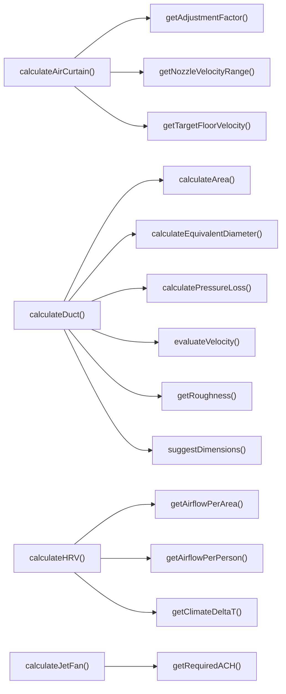

## Genel Bakış
Bu modül, ısıtma havalandırma ve iklimlendirme (HVAC) sistemleri için gerekli tüm mühendislik hesaplamalarını tek bir merkezde toplayan, havalandırma ekipmanı boyutlandırma ve performans analizini destekleyen bir araçtır. Hava perdesi, kanal sistemi, ısı geri kazanım ünitesi (HRV) ve jet fan gibi yaygın HVAC ekipmanları için projeye özel koşullara uygun özelleştirilmiş hesaplamalar sunar. Fiziksel formüller ve uluslararası mühendislik standartlarını birleştirerek ekipman seçimi ve tasarımı süreçlerini kolaylaştırır.

## Fonksiyon Grupları
### Ana HVAC Ekipmanı Hesaplama Fonksiyonları
Modülün temel işlevini yerine getiren, tüm alt hesaplamaları birleştirerek farklı HVAC ekipmanları için nihai sonuçları üreten ana hesaplayıcılardır. Girdi olarak projeye özel tüm parametreleri alarak ekipman boyutlandırması ve performans analizini gerçekleştirir.
- calculateAirCurtain, calculateDuct, calculateHRV, calculateJetFan

### Hava Perdesi Hesaplama Yardımcıları
Hava perdesi boyutlandırma ve performans değerlendirme süreçlerinde ihtiyaç duyulan standart hız aralıkları, düzeltme katsayıları ve hız değerlendirmesi gibi ara hesaplamaları yapar. Ana hava perdesi hesaplama fonksiyonu tarafından çağrılarak süreçleri parçalara ayırır.
- getNozzleVelocityRange, getTargetFloorVelocity, getAdjustmentFactor, evaluateVelocity, suggestDimensions

### Kanal Sistemi Hesaplama Yardımcıları
Hava kanallarının fiziksel özelliklerine göre alan, eşdeğer çap, basınç kaybı gibi mühendislik değerlerini hesaplamak için kullanılan yardımcı fonksiyonlardır. Farklı kanal tipleri ve malzemeleri için uyarlanmış hesaplamalar sunar.
- getRoughness, calculateEquivalentDiameter, calculateArea, calculatePressureLoss

### Genel HVAC Standart Değer Getiricileri
Bina tipi, iklim bölgesi, uygulama türü gibi parametrelere göre uluslararası mühendislik standartlarındaki sabit değerleri döndürür. Tüm ana hesaplamaların temelini oluşturan standart değerleri tek merkezde yöneterek tutarlılık sağlar.
- getAirflowPerPerson, getAirflowPerArea, getClimateDeltaT, getRequiredACH

---

## AXIOMS – Mimari Varsayımlar
Bu modül, HVAC ve havalandırma sistemleri parametrelerini hesaplamak için tasarlanmış matematiksel bir hesaplama modülüdür; tüm fonksiyonların geçerli, fiziksel olarak anlamlı sonuçlar üretebilmesi için girdi parametrelerinin tanımlı aralıklarda ve biçimlerde olması zorunludur.

[Aksiyom 1]: Eğer tüm girdi olarak kullanılan enum tiplerine (AirCurtainApplication, WindCondition, TrafficIntensity, DuctMaterial, DuctType, BuildingType, ClimateZone, JetFanApplication, JetFanMode) ait verilen değerler tanımlı geçerli seçenekler arasında yer almıyorsa, tüm get* ve calculate* fonksiyonları geçersiz sonuçlar üretir.
[Aksiyom 2]: Eğer tüm sayısal girdiler (kapı yüksekliği, kanal boyutları, hız, hava akışı vb.) sıfırdan büyük pozitif değerler değilse, hesaplama fonksiyonları çalışma zamanı hatası ya da fiziksel olarak imkansız sonuçlar üretir.
[Aksiyom 3]: Eğer calculateArea fonksiyonuna verilen DuctType değerine göre zorunlu olan boyut parametreleri (yuvarlak kanal için diameter, dikdörtgen kanal için width ve height) tam olarak sağlanmamışsa, fonksiyon geçerli bir alan değeri hesaplayamaz.
[Aksiyom 4]: Eğer modül içinde tanımlanan TYPICAL_JET_FAN sabit nesnesi tüm gerekli jet fan parametrelerine sahip değilse, calculateJetFan ve getRequiredACH gibi jet fan odaklı fonksiyonlar geçerli sonuç üretemez.
[Aksiyom 5]: Eğer tüm calculate* fonksiyonlarına girdi olarak verilen input nesnelerinin (AirCurtainInput, DuctInput, HRVInput, JetFanInput) tüm zorunlu alanları tanımlı ve geçerli değilse, ilgili hesaplama fonksiyonu geçerli çıktı üretemez.

---

## FONKSIYON DETAYLARI

### getNozzleVelocityRange
**Ne yapar**: Hava perdesinin uygulama türü ve monte edileceği kapının yüksekliğine göre nozül çıkış hızının minimum, maksimum ve hedef değerlerini m/s cinsinden sunar. Tüm değerler klimaglobal.com ve airtecnics.com gibi endüstri kaynaklarındaki standartlara uygun olarak belirlenir. Farklı kullanım alanları için gereken hız aralıklarını standartlaştırarak doğru boyutlandırma için temel değerler sunar.
**Nasıl yapar**: Uygulama türüne ve kapı yüksekliğine göre önceden kaynaklarda tanımlanmış standart hız aralıklarını giriş parametreleriyle eşleştirir. Her kullanım senaryosu için izin verilen hız sınırlarını ve optimum çalışma noktasını tek bir nesne içinde toplayarak kullanıma sunar, hesaplamalarda tutarlılık sağlar.
**Parametreler**:
- application: AirCurtainApplication — Hava perdesinin kullanılacağı uygulama türünü tanımlayan tip değeri, farklı işletmeler veya alanlar için özel standartları tetikler
- doorHeight: number — Hava perdesinin monte edileceği kapının metre cinsinden yüksekliği, ihtiyaç duyulan nozül hızını doğrudan etkileyen boyut değeri
**Dönüş**: { min: number; max: number; target: number } — Sırasıyla minimum izin verilen nozül hızı, maksimum izin verilen nozül hızı ve sürekli çalışma için önerilen hedef nozül hızı, tüm değerler m/s cinsindendir.

### getTargetFloorVelocity
**Ne yapar**: Kullanılan hava perdesi uygulama türüne göre zemin seviyesinde olması gereken hedef hava hızını m/s cinsinden döndürür. Tüm değerler klimaglobal.com kaynaklı endüstri standartlarına uygun olarak belirlenir, hava perdesinin etkinliğini zemin seviyesinde garanti altına almak için gereken eşik değeri sunar.
**Nasıl yapar**: Uygulama özelinde tanımlanmış standart zemin hızı değerlerini giriş olarak alınan uygulama türüyle eşleştirir. Her ortamın ihtiyaç duyduğu zemin hızı farklı olduğundan, ilgili senaryoya uygun olan hedef değeri tek bir sayı olarak iletir, boyutlandırma hesaplarında referans olarak kullanılmasını sağlar.
**Parametreler**:
- application: AirCurtainApplication — Hava perdesinin kullanılacağı işletim ortamı veya kullanım alanını tanımlayan tip değeri, hedef zemin hızını belirleyen temel parametredir
**Dönüş**: number — Zemin seviyesinde ulaşılması gereken hedef hız, m/s cinsindendir.

### getAdjustmentFactor
**Ne yapar**: Hava perdesinin çalıştığı ortamdaki rüzgar koşulları ve mekandaki trafik yoğunluğuna göre, tüm hesaplamalarda kullanılacak düzeltme faktörünü hesaplar. Standart laboratuvar koşullarında yapılan hesaplamaları gerçek dünya kullanım koşullarına uyacak şekilde ayarlamak için kullanılır.
**Nasıl yapar**: Rüzgar gücü ve trafik yoğunluğu seviyelerine göre atanmış çarpımsal düzeltme katsayılarını birleştirerek tek bir genel düzeltme faktörü oluşturur. Her iki çevresel etkenin hesaplamalar üzerindeki etkisini tek bir katsayıda toplar, ana boyutlandırma hesaplarında bu katsayı ile çarpma yapılarak gerçek koşullara uygun sonuçlar elde edilir.
**Parametreler**:
- wind: WindCondition — Hava perdesinin çalışacağı ortamdaki rüzgar koşulunun şiddetini veya sınıfını tanımlayan tip değeri
- traffic: TrafficIntensity — Mekandaki insan veya araç geçiş yoğunluğunu ifade eden, perdenin etkinliğini etkileyen trafik sınıfını tanımlayan tip değeri
**Dönüş**: number — Tüm hesaplamalarda kullanılacak toplam düzeltme faktörü değeri, standart sonuçları gerçek koşullara uyarlamak için kullanılır.

### calculateAirCurtain
**Ne yapar**: Girişte verilen tüm parametreleri kullanarak hava perdesi boyutlandırma hesaplamasını gerçekleştirir. Ana hesaplama formülü CFM = Hız × Çıkış Alanı olarak kullanılır, perdenin ihtiyaç duyduğu tüm teknik değerleri tek bir sonuç nesnesinde toplar.
**Nasıl yapar**: Önce nozül çıkış alanını kapı genişliği ile tipik 50-100mm aralığında olan nozül yüksekliğini çarparak hesaplar. Ardından hesaplanan çıkış alanını nozül çıkış hızı ile çarparak gerekli hava debisini CFM cinsinden çıkarır, tüm ara hesaplamalar ve nihai boyutlandırma sonuçlarını bir araya getirerek sonuç nesnesi olarak sunar.
**Parametreler**:
- input: AirCurtainInput — Hava perdesi hesaplaması için gerekli tüm giriş verilerini, kapı boyutları, uygulama türü, çevresel koşullar gibi tüm parametreleri barındıran tip nesnesi
**Dönüş**: AirCurtainResult — Hesaplanan boyutlandırma sonuçlarını, gerekli hava debisi, çalışma parametreleri gibi tüm çıktıları içeren tip nesnesi.

### getRoughness
**Ne yapar**: Hava kanalının üretildiği malzemeye göre malzemenin pürüzlülük faktörünü mm cinsinden döndürür. Kanal içindeki hava akışının sürtünmeden kaynaklanan etkilerini hesaplamak için temel bir değer sunar, basınç kaybı hesaplarında kullanılır.
**Nasıl yapar**: Farklı kanal malzemeleri için önceden tanımlanmış standart pürüzlülük değerlerini giriş olarak alınan malzeme türüyle eşleştirir. Her malzemenin akışa farklı derecede direnç göstermesi nedeniyle, ilgili malzemeye ait doğru pürüzlülük değerini ileterek basınç kaybı hesaplarının doğruluğunu garanti altına alır.
**Parametreler**:
- material: DuctMaterial — Hava kanalının üretildiği malzeme türünü tanımlayan, metal, plastik gibi seçenekleri içeren tip değeri
**Dönüş**: number — İlgili malzemenin pürüzlülük faktörü, mm cinsindendir ve basınç kaybı hesaplarında kullanılır.

### calculateEquivalentDiameter
**Ne yapar**: Dikdörtgen kesitli hava kanalları için eşdeğer çap değerini hesaplar. Dikdörtgen kanalların daire kesitli kanallarla aynı akış özelliklerine sahip olacak şekilde bir çap değerine dönüştürülmesini sağlar, tek çap parametresiyle tüm standart hesaplamaların kullanılmasına olanak tanır.
**Nasıl yapar**: Deq = (1.30 × (w × h)^0.625) / (w + h)^0.25 formülünü kullanarak giriş olarak alınan kanalın genişlik ve yükseklik değerlerini eşdeğer çapa dönüştürür. Bu endüstri standardı formül ile dikdörtgen kanalların akış özellikleri doğru bir şekilde yuvarlak kanal standartlarına uyarlanır, karmaşık hesapları basitleştirir.
**Parametreler**:
- width: number — Dikdörtgen kanalın metre cinsinden genişliği, eşdeğer çap hesaplamasının temel girdisidir
- height: number — Dikdörtgen kanalın metre cinsinden yüksekliği, genişlik ile birlikte formülde kullanılır
**Dönüş**: number — Hesaplanan eşdeğer çap değeri, tüm standart kanal hesaplamalarında kullanılmak üzere uygun birimlerle sunulur.

### calculateArea
**Ne yapar**: Farklı türdeki hava kanallarının kesit alanını m² cinsinden hesaplar. Kanal içindeki hava hızı, debi gibi parametreleri hesaplamak için gereken temel kesit alan değerini, kanal türüne uygun olarak doğru şekilde hesaplar.
**Nasıl yapar**: Girişte alınan kanal türüne göre uygun alan hesaplama formülünü seçer ve uygular. Dairesel kanallar için sadece çap değerini kullanarak alanı hesaplarken, dikdörtgen kanallar için genişlik ve yükseklik değerlerini kullanır, ilgili kanal türü için zorunlu olmayan parametreleri hesaplamaya dahil etmez, her tür için doğru alan değerini sunar.
**Parametreler**:
- ductType: DuctType — Hesaplama yapılacak kanalın türünü belirten, dairesel, dikdörtgen gibi seçenekleri içeren tip değeri
- diameter?: number — Yalnızca dairesel kanallar için gerekli olan kanalın metre cinsinden çapı, diğer kanal türleri için zorunlu değildir
- width?: number — Dikdörtgen gibi çap kullanmayan kanal türleri için gerekli olan kanalın metre cinsinden genişliği
- height?: number — Yalnızca dikdörtgen kanallar için gerekli olan kanalın metre cinsinden yüksekliği
**Dönüş**: number — Hesaplanan kanal kesit alanı, m² cinsindendir ve tüm akış hesaplarında kullanılır.

### calculatePressureLoss
**Ne yapar**: Hava kanallarındaki birim uzunluk başına basınç kaybını, türbülanslı akış ve pürüzsüz kanal varsayımıyla basitleştirilmiş Darcy-Weisbach denklemini kullanarak hesaplar. Sistemin fan gücü seçimi için gereken basınç düşümü değerini tahmin eder.
**Nasıl yapar**: ΔP/L = f × (ρ × V²) / (2 × D) formülünü kullanarak, sürtünme katsayısı f'yi yaklaşık 0.02 alarak basınç kaybını hesaplar. Giriş olarak alınan kanal içi hız, kanal çapı ve malzeme pürüzlülüğü değerlerini formülde işleyerek, kanalda birim uzunluk başına oluşacak basınç kaybını tahmin eder, fan seçimi için gerekli veriyi sunar.
**Parametreler**:
- velocity: number — Kanal içindeki havanın m/s cinsinden hızı, basınç kaybını doğrudan etkileyen temel parametredir
- diameter: number — Kanalın metre cinsinden gerçek veya eşdeğer çapı, formülde mesafe parametresi olarak kullanılır
- roughness: number — Kanal malzemesinin mm cinsinden pürüzlülük faktörü, sürtünme etkilerini hesaba katan girdi değeridir
**Dönüş**: number — Hesaplanan birim uzunluk başına basınç kaybı, fan gücü ve sistem tasarımı için kullanılır.

### evaluateVelocity
**Ne yapar**: Kanal içindeki veya hava perdesi çıkışındaki hava hızının ASHRAE önerilerine uygunluğunu değerlendirir. Hızın durumunu sınıflandırır ve durumu açıklayan bir mesajla birlikte döndürür, sistemin çalışma koşullarının uygunluğunu kontrol etmeye olanak tanır.
**Nasıl yapar**: Giriş olarak alınan hız değerini ASHRAE standartlarında tanımlanan düşük, optimal, yüksek ve kritik eşik değerleriyle karşılaştırır. Hızın hangi aralıkta kaldığını tespit ederek ilgili durum etiketini atar, kullanıcının sorunu anlamasını sağlayan açıklayıcı bir mesajla birlikte bu değerleri sunar, hızın iyileştirilmesi gereken durumları işaret eder.
**Parametreler**:
- velocity: number — Değerlendirilecek olan m/s cinsinden hava hızı, eşik değerlerle karşılaştırılan temel girdidir
**Dönüş**: { status: 'low' | 'optimal' | 'high' | 'critical'; message: string } — Hızın uygunluk durumunu belirten durum etiketi ve durumu açıklayan kullanıcı dostu mesajı içeren nesne.

### suggestDimensions
**Ne yapar**: İstenen toplam hava debisi ve hedef kanal içi hız değerine uygun olarak kullanılabilecek alternatif standart kanal boyutu önerilerini sunar. Kullanıcının projesinin gereksinimlerine en uygun kanal boyutunu seçmesine yardımcı olur, mühendislik tasarım sürecini hızlandırır.
**Nasıl yapar**: Önce hedef hız ve hava debisi değerlerini kullanarak ihtiyaç duyulan toplam kesit alanını hesaplar. Ardından sektörde yaygın olarak kullanılan standart kanal boyutları arasından bu alana uygun olan birden fazla alternatifi seçer, her bir alternatifi genişlik ve yükseklik değerleriyle sunarak kullanıcının seçim yapmasına olanak tanır, tüm önerilerin hedef hızı sağlayacak şekilde hesaplanmasını garanti eder.
**Parametreler**:
- airflow: number — Kanalda taşınması gereken toplam hava debisi, gerekli kesit alanını hesaplamak için kullanılan girdi
- targetVelocity: number — Kanal içinde olması hedeflenen m/s cinsinden hava hızı, ihtiyaç duyulan alanı belirleyen temel parametre
**Dönüş**: { width: number; height: number }[] - Her bir alternatif kanalın metre cinsinden genişliği ve yüksekliğini içeren nesnelerden oluşan dizi, birden fazla uygulanabilir boyut seçeneği sunar.

---


### calculateDuct
**Ne yapar**: HVAC sistemlerinde kullanılan hava kanalları için standartlara uygun kanal boyutlandırma hesaplaması yapar. Hesaplama sonucunda kanalin çalışma koşullarına uygun boyutları ve performans değerlerini sunar.
**Nasıl yapar**: Girdi olarak aldığı kanal hesaplaması için gerekli tüm parametreleri işleyerek endüstri standartlarındaki kanal boyutlandırma metotlarını uygular. İşlem akışı boyunca girdi verilerinin doğruluğunu temel alarak hesaplamaları yürütür ve sonuçları yapılandırılmış bir şekilde döndürür.
**Parametreler**:
- input: DuctInput — Kanal boyutlandırma hesaplaması için ihtiyaç duyulan tüm girdi verilerini (boyut, debi, basınç gibi) içeren özel veri yapısı
**Dönüş**: DuctResult — Hesaplanan kanal boyutları, basınç kaybı, uygunluk durumu gibi tüm sonuç parametrelerini içeren özel veri yapısı

### getAirflowPerPerson
**Ne yapar**: Bina tipine göre kişi başı düşen asgari saatlik taze hava ihtiyacını m³/h·kişi birimiyle sunar. Değerler endüstri standardı ASHRAE 62.1'den alınarak güncel ve standartlara uygun değerler sunulmasını sağlar.
**Nasıl yapar**: Girdi olarak alınan bina tipi enum değerine göre ASHRAE 62.1 standardında tanımlı önceden kayıtlı kişi başı taze hava değerini eşleştirerek doğrudan döndürür. Her bina tipi için standartta belirtilen asgari zorunlu değerleri sunarak havalandırma hesaplarında kullanılmak üzere hazır hale getirir.
**Parametreler**:
- buildingType: BuildingType — Hava ihtiyacı hesaplanacak binanın kullanım amacını (konut, ofis, alışveriş merkezi vb.) belirten enum yapısı
**Dönüş**: number — Standarttan alınan kişi başı taze hava ihtiyacı değeri, m³/h·kişi birimindedir

### getAirflowPerArea
**Ne yapar**: Bina tipine göre alan başına düşen asgari saatlik havalandırma ihtiyacını m³/h·m² birimiyle sunar. Tüm değerler ASHRAE 62.1 standardındaki zorunlu asgari seviyelere uygun olarak sunulur.
**Nasıl yapar**: Girdi olarak alınan bina tipine göre standartta tanımlı alan başı havalandırma değerini eşleştirerek döndürür. Her bina tipi için farklı olan havalandırma gereksinimlerini tek bir fonksiyon üzerinden erişilebilir hale getirerek genel HVAC hesaplamalarında kullanıma sunar.
**Parametreler**:
- buildingType: BuildingType — Havalandırma ihtiyacı hesaplanacak binanın kullanım amacını belirten enum yapısı
**Dönüş**: number — Standarttan alınan alan başı havalandırma değeri, m³/h·m² birimindedir

### getClimateDeltaT
**Ne yapar**: İklim bölgesine göre ısıtma ve soğutma işlemleri için gerekli ortalama sıcaklık farklarını döndürür. Bu değerler HVAC sistemlerinin ısı kaybı ve ısı kazancı hesaplarında temel girdi olarak kullanılır.
**Nasıl yapar**: Girdi olarak alınan iklim bölgesi enum değerine göre o bölge için önceden tanımlanmış ortalama sıcaklık farkı değerlerini yapı halinde sunar. Her iklim bölgesinin kendine özgü dış hava sıcaklığı koşullarına uygun olarak hesaplanmış değerleri erişilebilir hale getirir.
**Parametreler**:
- zone: ClimateZone — Sıcaklık farkları alınacak iklim bölgesini (türkiye'nin iç bölgeleri, karadeniz, akdeniz vb.) belirten enum yapısı
**Dönüş**: { heating: number; cooling: number } — Isıtma ve soğutma işlemleri için ayrı ayrı tanımlanmış ortalama sıcaklık farklarını içeren yapı, her iki değer de santigrat derece birimindedir

### calculateHRV
**Ne yapar**: Isı Geri Kazanım Üniteleri (HRV) için ısı geri kazanımı hesaplaması yapar. Verilen formül doğrultusunda ünite tarafından geri kazanılabilen toplam ısı miktarını watt birimiyle hesaplar.
**Nasıl yapar**: HRV hesaplaması için gerekli girdi verilerini kullanarak tanımlı Q = Debi × 0.34 × ΔT × Verimlilik formülünü uygular. Kullanılan 0.34 sabiti hava yoğunluğu ve özgül ısı kapasitesinin saatlik birim dönüşümüyle elde edilen ρ×Cp/3600 = 1.2×1005/3600 değerine eşittir. Hesaplama sonucunda elde edilen ısı geri kazanımı değeri ile birlikte üniteye ait tüm performans sonuçlarını yapılandırılmış şekilde döndürür.
**Parametreler**:
- input: HRVInput — HRV hesaplaması için gerekli olan hava debisi, iç-dış sıcaklık farkı, ünite verimliliği gibi tüm girdi verilerini içeren özel veri yapısı
**Dönüş**: HRVResult — Hesaplanan toplam ısı geri kazanımı miktarı ve üniteye ait diğer performans değerlerini içeren sonuç yapısı

### getRequiredACH
**Ne yapar**: Jet fan uygulamaları ve çalışma moduna göre gerekli saatlik hava değişimi (ACH) değerini döndürür. Tüm değerler NFPA 88A ve BS 7346-7 standartlarındaki asgari gereksinimlere uygun olarak sunulur.
**Nasıl yapar**: Girdi olarak alınan uygulama türü ve jet fan çalışma moduna göre standartlarda tanımlı asgari ACH değerini eşleştirerek döndürür. Normal hava sirkülasyonu modu ve acil durum duman tahliyesi modu için farklı standart değerleri sunarak her çalışma senaryosuna uygun ACH değerinin kullanılmasını sağlar.
**Parametreler**:
- application: JetFanApplication — Jet fan sisteminin kullanılacağı uygulama türünü (otopark, tünel vb.) belirten enum yapısı
- mode: JetFanMode — Jet fan sisteminin çalışma modunu (normal havalandırma, acil durum duman tahliyesi vb.) belirten enum yapısı
**Dönüş**: number — Uygulama ve moda göre gerekli olan ACH (saatlik hava değişimi) değeri, saat başına mekan havasının kaç kez tam olarak değiştirilmesi gerektiğini ifade eder

### calculateJetFan
**Ne yapar**: Otopark veya tünel gibi uygulamalarda kullanılacak jet fan sistemleri için gerekli tüm sistem parametrelerini hesaplar. Hem normal hava sirkülasyonu hem de acil durum duman tahliyesi modları için doğru gereksinimleri karşılayan sistem tasarımı için gerekli değerleri sunar.
**Nasıl yapar**: Girdi olarak alınan mekan boyutları, uygulama türü ve çalışma modu verilerini kullanarak önce mekanın toplam hacmini hesaplar. Ardından getRequiredACH fonksiyonundan elde edilen ACH değeri ile gerekli toplam hava debisini hesaplar. Hesaplanan toplam ihtiyaca göre tek bir jet fanının standart kapasitesine uygun olarak gerekli toplam fan sayısını ve toplam itme kuvvetini hesaplar. Tüm sonuçları birleştirerek yapılandırılmış bir şekilde döndürür.
**Parametreler**:
- input: JetFanInput — Jet fan sistemi hesaplamaları için gerekli olan mekan boyutları, uygulama türü, çalışma modu gibi tüm girdi verilerini içeren özel veri yapısı
**Dönüş**: JetFanResult — Hesaplanan mekan hacmi, gerekli toplam hava debisi, ACH değeri, toplam itme kuvveti ve gerekli fan sayısı gibi tüm sistem parametrelerini içeren özel sonuç yapısı

---

## INTERFACES

### AirCurtainInput
- `doorWidth: number`
- `doorHeight: number`
- `application: AirCurtainApplication`
- `windCondition: WindCondition`
- `trafficIntensity: TrafficIntensity`

### AirCurtainResult
- `requiredAirflow: number`
- `nozzleVelocity: number`
- `floorVelocity: number`
- `suggestedPower: number`
- `nozzleWidth: number`
- `nozzleHeight: number`
- `efficiency: 'optimal' | 'acceptable' | 'marginal'`
- `recommendations: string[]`

### DuctInput
- `airflow: number`
- `ductType: DuctType`
- `diameter?: number`
- `width?: number`
- `height?: number`
- `length: number`
- `material: DuctMaterial`

### DuctResult
- `velocity: number`
- `velocityStatus: 'low' | 'optimal' | 'high' | 'critical'`
- `velocityMessage: string`
- `pressureLossPerMeter: number`
- `totalPressureLoss: number`
- `equivalentDiameter?: number`
- `suggestedDimensions: { width: number; height: number }[]`
- `recommendations: string[]`

### HRVInput
- `recoveryType: RecoveryType`
- `buildingType: BuildingType`
- `climateZone: ClimateZone`
- `area: number`
- `occupancy: number`
- `operatingHoursPerDay: number`
- `sensibleEfficiency: number`
- `latentEfficiency: number`
- `electricityCostPerKWh: number`

### HRVResult
- `requiredAirflow: number`
- `airflowPerPerson: number`
- `heatingRecovery: number`
- `coolingRecovery: number`
- `totalEfficiency: number`
- `annualEnergySaving: number`
- `annualCostSaving: number`
- `co2Reduction: number`
- `paybackPeriod: number`
- `recommendations: string[]`

### JetFanInput
- `applicationType: JetFanApplicationType`
- `ventilationMode: JetFanMode`
- `length: number`
- `width: number`
- `height: number`
- `carCapacity: number`
- `trafficFlowPerHour: number`

### JetFanResult
- `volume: number`
- `requiredAirflow: number`
- `ach: number`
- `totalThrust: number`
- `fanCount: number`
- `recommendedSpacing: number`
- `installationFactor: number`
- `recommendations: string[]`

---

## TYPE ALIASES

### AirCurtainApplication
```typescript
type AirCurtainApplication = 'comfort' | 'insect' | 'coldRoom'
```

### WindCondition
```typescript
type WindCondition = 'none' | 'light' | 'moderate' | 'strong'
```

### TrafficIntensity
```typescript
type TrafficIntensity = 'low' | 'medium' | 'high'
```

### DuctType
```typescript
type DuctType = 'circular' | 'rectangular'
```

### DuctMaterial
```typescript
type DuctMaterial = 'galvanized' | 'pvc' | 'flex'
```

### BuildingType
```typescript
type BuildingType = 'residential' | 'office' | 'commercial' | 'industrial'
```

### RecoveryType
```typescript
type RecoveryType = 'hrv' | 'erv'
```

### ClimateZone
```typescript
type ClimateZone = 'cold' | 'temperate' | 'hot'
```

### JetFanApplication
```typescript
type JetFanApplication = 'parking' | 'tunnel'
```

### JetFanApplicationType

### JetFanMode
```typescript
type JetFanMode = 'normal' | 'smoke'
```

---

## SABİTLER
- **TYPICAL_JET_FAN** (object) — `{
    thrust: 25,       // N (tek fan)
    airflow: 3500,    // m³/h
    p...`

---

## AST POINTERS

### [N1_NASIL] AST Pointer: src/lib/hvacCalculations.ts::getNozzleVelocityRange
- **params**: [application: AirCurtainApplication, doorHeight: number]
- **ic_degiskenler**:
  - `baselineHeight` — Referans standart kapı yüksekliği (2.5m), yükseklik faktörü hesaplamasında kullanılır
  - `heightFactor` — Kapı yüksekliğine göre hesaplanan hız çarpanı, artan kapı yüksekliğiyle hız artışını sağlar
- **Dönüş**: { min: number; max: number; target: number }

### [N2_NASIL] AST Pointer: src/lib/hvacCalculations.ts::getTargetFloorVelocity
- **params**: [application: AirCurtainApplication]
- **ic_degiskenler**: yok
- **Dönüş**: number

### [N3_NASIL] AST Pointer: src/lib/hvacCalculations.ts::getAdjustmentFactor
- **params**: [wind: WindCondition, traffic: TrafficIntensity]
- **ic_degiskenler**:
  - `factor` — Başlangıç değeri 1.0 olan, rüzgar ve trafik koşullarına göre çarpılarak nihai ayarlama katsayısını tutan değişken
- **Dönüş**: number

### [N4_NASIL] AST Pointer: src/lib/hvacCalculations.ts::calculateAirCurtain
- **params**: [input: AirCurtainInput]
- **ic_degiskenler**:
  - `input.doorWidth` — Giriş nesnesinden alınan kapı genişliği, nozül boyutları hesaplamasında kullanılır
  - `input.doorHeight` — Giriş nesnesinden alınan kapı yüksekliği, jet hızı ve zemin hızı hesaplamalarında kullanılır
  - `input.application` — Giriş nesnesinden alınan hava perdesi uygulama tipi, hedef hızları belirlemek için kullanılır
  - `input.windCondition` — Giriş nesnesinden alınan rüzgar koşulu, ayarlama faktörü hesaplamasında kullanılır
  - `input.trafficIntensity` — Giriş nesnesinden alınan trafik yoğunluğu, ayarlama faktörü hesaplamasında kullanılır
  - `nozzleWidth` — Kapı genişliğine eşitlenen nozül genişliği, alan hesaplamasında kullanılır
  - `nozzleDepth` — Sabit 42mm fiziksel nozül derinliği, nozül alanı ve zemin hızı hesaplamalarında kullanılır
  - `nozzleArea` — Nozül genişlik ve derinliğiyle hesaplanan toplam nozül alanı, hava debisi hesaplamasında kullanılır
  - `velocityRange` — getNozzleVelocityRange fonksiyonundan dönen uygulama ve kapı yüksekliğine özel hız aralığı
  - `adjustmentFactor` — getAdjustmentFactor fonksiyonundan dönen rüzgar ve trafik etkisini yansıtan katsayı
  - `nozzleVelocity` — Uygulanan ayarlama faktörüyle çarpılarak hesaplanan gerçek nozül çıkış hızı
  - `airflowM3s` — Saniye başına metreküp cinsinden ham hava debisi, yıllık hesaplamalarda kullanılır
  - `requiredAirflow` — Yuvarlanmış saatlik gerekli toplam hava debisi, sonuç nesnesinde döndürülür
  - `floorVelocity` — Jet hızı sönümleme formülüyle hesaplanan zemin seviyesindeki hava hızı, verimlilik kontrolünde kullanılır
  - `targetFloor` — getTargetFloorVelocity fonksiyonundan dönen uygulama özel hedef zemin hızı
  - `suggestedPower` — Fiziksel iş formülüyle hesaplanan önerilen motor gücü, sonuç nesnesinde döndürülür
  - `efficiency` — Zemin hızının hedefe göre durumunu tutan değişken, 'optimal', 'acceptable' veya 'marginal' değerlerini alabilir
  - `recommendations` — Kapı ve çevre koşullarına göre oluşturulan öneri listesi, sonuç nesnesinde döndürülür
- **Dönüş**: AirCurtainResult

### [N5_NASIL] AST Pointer: src/lib/hvacCalculations.ts::getRoughness
- **params**: [material: DuctMaterial]
- **ic_degiskenler**: yok
- **Dönüş**: number

### [N6_NASIL] AST Pointer: src/lib/hvacCalculations.ts::calculateEquivalentDiameter
- **params**: [width: number, height: number]
- **ic_degiskenler**:
  - `w` — Milimetreden metreye çevrilen kanal genişliği, eşdeğer çap hesaplamasında kullanılır
  - `h` — Milimetreden metreye çevrilen kanal yüksekliği, eşdeğer çap hesaplamasında kullanılır
  - `deq` — Metre cinsinden ara eşdeğer çap değeri, milimetreye çevrilerek sonuç olarak döndürülür
- **Dönüş**: number

### [N7_NASIL] AST Pointer: src/lib/hvacCalculations.ts::calculateArea
- **params**: [ductType: DuctType, diameter?: number, width?: number, height?: number]
- **ic_degiskenler**:
  - `r` — Milimetreden metreye çevrilen dairesel kanal yarıçapı, alan hesaplamasında kullanılır
- **Dönüş**: number

### [N8_NASIL] AST Pointer: src/lib/hvacCalculations.ts::calculatePressureLoss
- **params**: [velocity: number, diameter: number, roughness: number]
- **ic_degiskenler**:
  - `D` — Milimetreden metreye çevrilen kanal çapı, basınç kaybı hesaplamasında kullanılır
  - `f` — Basitleştirilmiş sürtünme faktörü, basınç kaybı formülünde kullanılır
  - `deltaP` — Metre başına Pa cinsinden hesaplanan basınç kaybı değeri
- **Dönüş**: number

### [N9_NASIL] AST Pointer: src/lib/hvacCalculations.ts::evaluateVelocity
- **params**: [velocity: number]
- **ic_degiskenler**: yok
- **Dönüş**: { status: 'low' | 'optimal' | 'high' | 'critical'; message: string }

### [N10_NASIL] AST Pointer: src/lib/hvacCalculations.ts::suggestDimensions
- **params**: [airflow: number, targetVelocity: number = 6]
- **ic_degiskenler**:
  - `Q` — m³/h'den m³/s'e çevrilen hava debisi, alan hesaplamasında kullanılır
  - `targetArea` — Hedef hız ve debiye göre hesaplanan gerekli toplam kanal alanı
  - `suggestions` — Standart boyutlardan oluşan önerilen kanal boyutları listesi
  - `standardSizes` — Kullanılabilir standart kanal boyutları listesi, öneri üretmede kullanılır
  - `w` — Döngüdeki mevcut standart kanal genişliği değeri
  - `h` — Mevcut genişliğe göre hesaplanan gerekli yükseklik
  - `closestH` — Hesaplanan yükseklik standart boyutlara en yakın olan standart yükseklik
  - `actualArea` — Seçilen standart genişlik ve yükseklikle hesaplanan gerçek kanal alanı
  - `actualVelocity` — Gerçek kanal alanı ve debiye göre hesaplanan gerçek kanal içi hava hızı
- **Dönüş**: { width: number; height: number }[]

## AST POINTERS

### [N1_NASIL] AST Pointer: C:\Users\alize\venthub-hvac\src\lib\hvacCalculations.ts::calculateDuct
- **params**: (input: DuctInput)
- **ic_degiskenler**:
  - `airflow` — Girdi nesnesinden çıkarılan kanal hava debisi (m³/h)
  - `ductType` — Girdi nesnesinden çıkarılan kanal tipi (dairesel/dikdörtgen)
  - `diameter` — Girdi nesnesinden çıkarılan dairesel kanal çapı
  - `width` — Girdi nesnesinden çıkarılan dikdörtgen kanal genişliği
  - `height` — Girdi nesnesinden çıkarılan dikdörtgen kanal yüksekliği
  - `length` — Girdi nesnesinden çıkarılan kanal toplam uzunluğu
  - `material` — Girdi nesnesinden çıkarılan kanal malzemesi
  - `Q` — Hava debisinin saniye bazına çevrilmiş değeri (m³/s)
  - `area` — calculateArea fonksiyonu ile hesaplanan kanal kesit alanı
  - `velocity` — Kanal içindeki hava hızı, alan sıfırdan büyükse Q/area olarak hesaplanır
  - `velocityStatus` — evaluateVelocity fonksiyonundan dönen hız durumu (low/optimal/high/critical)
  - `velocityMessage` — evaluateVelocity fonksiyonundan dönen hız açıklama mesajı
  - `equivalentDiameter` — Dikdörtgen kanallar için hesaplanan eşdeğer çap değeri
  - `effectiveDiameter` — Basınç kaybı hesaplamasında kullanılan geçerli çap (varsayılan 200)
  - `roughness` — getRoughness fonksiyonu ile malzemeye göre hesaplanan pürüzlülük değeri
  - `pressureLossPerMeter` — calculatePressureLoss ile hesaplanan metrekare başına basınç kaybı
  - `totalPressureLoss` — Toplam kanal uzunluğu için hesaplanan toplam basınç kaybı
  - `suggestedDimensions` — suggestDimensions fonksiyonu ile önerilen alternatif kanal boyutları
  - `recommendations` — Hız ve basınç durumuna göre oluşturulan öneri metinleri dizisi
- **Dönüş**: velocity, durumlar, basınç değerleri ve önerileri içeren DuctResult nesnesi

### [N2_NASIL] AST Pointer: C:\Users\alize\venthub-hvac\src\lib\hvacCalculations.ts::getAirflowPerPerson
- **params**: (buildingType: BuildingType)
- **ic_degiskenler**: (yok)
- **Dönüş**: Bina tipine göre kişi başına gereken hava debisi (sayı)

### [N3_NASIL] AST Pointer: C:\Users\alize\venthub-hvac\src\lib\hvacCalculations.ts::getAirflowPerArea
- **params**: (buildingType: BuildingType)
- **ic_degiskenler**: (yok)
- **Dönüş**: Bina tipine göre birim alan başına gereken hava debisi (sayı)

### [N4_NASIL] AST Pointer: C:\Users\alize\venthub-hvac\src\lib\hvacCalculations.ts::getClimateDeltaT
- **params**: (zone: ClimateZone)
- **ic_degiskenler**: (yok)
- **Dönüş**: İklim bölgesine göre ısıtma ve soğutma için sıcaklık farkını içeren nesne { heating: number; cooling: number }

### [N5_NASIL] AST Pointer: C:\Users\alize\venthub-hvac\src\lib\hvacCalculations.ts::calculateHRV
- **params**: (input: HRVInput)
- **ic_degiskenler**:
  - `recoveryType` — Girdi nesnesinden çıkarılan ısı geri kazanım sistemi tipi (hrv/erv)
  - `buildingType` — Girdi nesnesinden çıkarılan bina tipi
  - `climateZone` — Girdi nesnesinden çıkarılan bulunduğu iklim bölgesi
  - `occupancy` — Girdi nesnesinden çıkarılan binadaki kişi sayısı
  - `area` — Girdi nesnesinden çıkarılan bina toplam alanı
  - `sensibleEfficiency` — Girdi nesnesinden çıkarılan duyulur ısı verimliliği yüzdesi
  - `latentEfficiency` — Girdi nesnesinden çıkarılan gizli ısı verimliliği yüzdesi
  - `operatingHoursPerDay` — Girdi nesnesinden çıkarılan günlük çalışma saati
  - `electricityCostPerKWh` — Girdi nesnesinden çıkarılan kWh başına elektrik maliyeti
  - `airflowPerPerson` — getAirflowPerPerson ile hesaplanan kişi başına hava debisi
  - `airflowPerArea` — getAirflowPerArea ile hesaplanan birim alan başına hava debisi
  - `requiredAirflow` — Kişi ve alan bazlı hesaplamaların maksimumu olarak bulunan toplam gerekli hava debisi
  - `deltaT` — getClimateDeltaT ile iklim bölgesine göre hesaplanan sıcaklık farkı nesnesi
  - `sensEff` — Yüzde olarak gelen duyulur verimliliğin ondalık olarak normalize edilmiş değeri
  - `latEff` — Yüzde olarak gelen gizli verimliliğin ondalık olarak normalize edilmiş değeri
  - `heatingRecovery` — Yıllık ısıtma döneminde geri kazanılan duyulur ısı miktarı (W)
  - `coolingEfficiency` — Sistem tipine göre hesaplanan toplam soğutma verimliliği (ERV için gizli ısı dahil)
  - `coolingRecovery` — Soğutma döneminde geri kazanılan toplam ısı miktarı (W)
  - `heatingHours` — Yıllık toplam ısıtma dönemi çalışma saati
  - `coolingHours` — Yıllık toplam soğutma dönemi çalışma saati
  - `annualEnergySaving` — Yılda kazanılan toplam enerji (kWh)
  - `annualCostSaving` — Yılda kazanılan toplam maliyet (TL)
  - `co2Reduction` — Yılda azaltılan CO2 emisyonu (kg)
  - `baseCost` — HRV/ERV cihazı için sabit temel maliyet
  - `capacityFactor` — Hava debisine göre hesaplanan kapasiteye bağlı maliyet faktörü
  - `estimatedDeviceCost` — Hesaplanan toplam tahmini cihaz maliyeti
  - `paybackPeriod` — Yatırımın geri dönüş süresi (yıl), 100TL altında yıllık tasarruf için 99 atanır
  - `recommendations` — Verimlilik ve iklim durumuna göre oluşturulan öneri metinleri dizisi
- **Dönüş**: Gerekli hava debisi, geri kazanımlar, tasarruf değerleri ve önerileri içeren HRVResult nesnesi

### [N6_NASIL] AST Pointer: C:\Users\alize\venthub-hvac\src\lib\hvacCalculations.ts::getRequiredACH
- **params**: (application: JetFanApplication, mode: JetFanMode)
- **ic_degiskenler**: (yok)
- **Dönüş**: Uygulama ve çalışma moduna göre gereken saatlik hava değişim sayısı (ACH, sayı)

### [N7_NASIL] AST Pointer: C:\Users\alize\venthub-hvac\src\lib\hvacCalculations.ts::calculateJetFan
- **params**: (input: JetFanInput)
- **ic_degiskenler**:
  - `length` — Girdi nesnesinden çıkarılan alan uzunluğu
  - `width` — Girdi nesnesinden çıkarılan alan genişliği
  - `height` — Girdi nesnesinden çıkarılan alan yüksekliği
  - `applicationType` — Girdi nesnesinden çıkarılan jet fan uygulama tipi
  - `ventilationMode` — Girdi nesnesinden çıkarılan çalışma modu (normal/duman tahliye)
  - `volume` — Uzunluk, genişlik ve yükseklik çarpımı ile hesaplanan alan toplam hacmi
  - `ach` — getRequiredACH ile hesaplanan gerekli saatlik hava değişim sayısı
  - `requiredAirflow` — Hacim ve ACH çarpımı ile hesaplanan toplam gerekli hava debisi (m³/h)
  - `targetVelocity` — Çalışma moduna göre hedeflenen hava hızı (duman modunda 2.0, normalde 1.5 m/s)
  - `massFlowRate` — Hava yoğunluğu ve debiye göre hesaplanan kütle akış hızı
  - `totalThrust` — Jet fanlar için gereken toplam itki kuvveti (N)
  - `installationFactor` — Kurulum kayıplarını hesaba katan 0.75 sabit faktörü
  - `fanCount` — Gereken toplam jet fan sayısı, yukarı yuvarlanarak hesaplanır
  - `recommendedSpacing` — Fanlar arası önerilen mesafe
- **Dönüş**: Hacim, gerekli debiler, fan sayısı ve önerilen mesafeleri içeren JetFanResult nesnesi

---

## ÇAĞRI HARİTASI

### Disariya Cagrilar (Outgoing)
calculateAirCurtain() fonksiyonu hava perdesi hesaplamaları için getNozzleVelocityRange, getTargetFloorVelocity ve getAdjustmentFactor yardımcı fonksiyonlarını çağırır. calculateJetFan() jet fanı hesaplamaları için yalnızca getRequiredACH fonksiyonunu çağırır. calculateDuct() kanal boyutlandırma hesapları için calculateArea, suggestDimensions, evaluateVelocity, getRoughness, calculatePressureLoss ve calculateEquivalentDiameter fonksiyonlarını kullanır. calculateHRV() ısı geri kazanım ventilatörü hesapları için getClimateDeltaT, getAirflowPerPerson ve getAirflowPerArea fonksiyonlarını çağırır.

### Disaridan Cagrilanlar (Incoming)
Sağlanan çağrı verisinde bu modülü kullanan dış dosya veya fonksiyon bilgisi bulunmamaktadır.

### Ic Ice Fonksiyonlar (Nested)
Yok

---

## DOSYA-İÇİ ÇAĞRI GRAFİĞİ
  calculateAirCurtain() → getAdjustmentFactor()
  calculateAirCurtain() → getNozzleVelocityRange()
  calculateAirCurtain() → getTargetFloorVelocity()
  calculateDuct() → calculateArea()
  calculateDuct() → calculateEquivalentDiameter()
  calculateDuct() → calculatePressureLoss()
  calculateDuct() → evaluateVelocity()
  calculateDuct() → getRoughness()
  calculateDuct() → suggestDimensions()
  calculateHRV() → getAirflowPerArea()
  calculateHRV() → getAirflowPerPerson()
  calculateHRV() → getClimateDeltaT()
  calculateJetFan() → getRequiredACH()



---

## NODE ID STANDARD

  file: src\lib\hvacCalculations.ts
  function: src\lib\hvacCalculations.ts::getNozzleVelocityRange
  function: src\lib\hvacCalculations.ts::getTargetFloorVelocity
  function: src\lib\hvacCalculations.ts::getAdjustmentFactor
  function: src\lib\hvacCalculations.ts::calculateAirCurtain
  function: src\lib\hvacCalculations.ts::getRoughness
  function: src\lib\hvacCalculations.ts::calculateEquivalentDiameter
  function: src\lib\hvacCalculations.ts::calculateArea
  function: src\lib\hvacCalculations.ts::calculatePressureLoss
  function: src\lib\hvacCalculations.ts::evaluateVelocity
  function: src\lib\hvacCalculations.ts::suggestDimensions
  function: src\lib\hvacCalculations.ts::calculateDuct
  function: src\lib\hvacCalculations.ts::getAirflowPerPerson
  function: src\lib\hvacCalculations.ts::getAirflowPerArea
  function: src\lib\hvacCalculations.ts::getClimateDeltaT
  function: src\lib\hvacCalculations.ts::calculateHRV
  function: src\lib\hvacCalculations.ts::getRequiredACH
  function: src\lib\hvacCalculations.ts::calculateJetFan

---

## DISA AKTARILANLAR (EXPORTS)
  export: AirCurtainApplication
  export: BuildingType
  export: ClimateZone
  export: DuctMaterial
  export: DuctType
  export: HRVInput
  export: HRVResult
  export: JetFanApplication
  export: JetFanApplicationType
  export: JetFanInput
  export: JetFanMode
  export: JetFanResult
  export: RecoveryType
  export: TrafficIntensity
  export: WindCondition
  export: calculateAirCurtain
  export: calculateArea
  export: calculateDuct
  export: calculateEquivalentDiameter
  export: calculateHRV
  export: calculateJetFan
  export: calculatePressureLoss
  export: evaluateVelocity
  export: getAdjustmentFactor
  export: getAirflowPerArea
  export: getAirflowPerPerson
  export: getClimateDeltaT
  export: getNozzleVelocityRange
  export: getRequiredACH
  export: getRoughness
  export: getTargetFloorVelocity
  export: suggestDimensions