## Genel Bakış
Bu modül, ısıtma havalandırma ve iklimlendirme (HVAC) sistemleri için gerekli tüm mühendislik hesaplamalarını tek bir merkezde toplayan, havalandırma ekipmanı boyutlandırma ve performans analizini destekleyen bir araçtır. Hava perdesi, kanal sistemi, ısı geri kazanım ünitesi (HRV) ve jet fan gibi yaygın HVAC ekipmanları için projeye özel koşullara uygun özelleştirilmiş hesaplamalar sunar. Fiziksel formüller ve uluslararası mühendislik standartlarını birleştirerek ekipman seçimi ve tasarımı süreçlerini kolaylaştırır.

## Fonksiyon Grupları
### Ana HVAC Ekipmanı Hesaplama Fonksiyonları
Modülün temel işlevini yerine getiren, tüm alt hesaplamaları birleştirerek farklı HVAC ekipmanları için nihai sonuçları üreten ana hesaplayıcılardır. Girdi olarak projeye özel tüm parametreleri alarak ekipman boyutlandırması ve performans analizini gerçekleştirir.
- calculateAirCurtain, calculateDuct, calculateHRV, calculateJetFan

### Hava Perdesi Hesaplama Yardımcıları
Hava perdesi boyutlandırma ve performans değerlendirme süreçlerinde ihtiyaç duyulan standart hız aralıkları, düzeltme katsayıları ve hız değerlendirmesi gibi ara hesaplamaları yapar. Ana hava perdesi hesaplama fonksiyonu tarafından çağrılarak süreçleri parçalara ayırır.
- getNozzleVelocityRange, getTargetFloorVelocity, getAdjustmentFactor, evaluateVelocity, suggestDimensions

### Kanal Sistemi Hesaplama Yardımcıları
Hava kanallarının fiziksel özelliklerine göre alan, eşdeğer çap, basınç kaybı gibi mühendislik değerlerini hesaplamak için kullanılan yardımcı fonksiyonlardır. Farklı kanal tipleri ve malzemeleri için uyarlanmış hesaplamalar sunar.
- getRoughness, calculateEquivalentDiameter, calculateArea, calculatePressureLoss

### Genel HVAC Standart Değer Getiricileri
Bina tipi, iklim bölgesi, uygulama türü gibi parametrelere göre uluslararası mühendislik standartlarındaki sabit değerleri döndürür. Tüm ana hesaplamaların temelini oluşturan standart değerleri tek merkezde yöneterek tutarlılık sağlar.
- getAirflowPerPerson, getAirflowPerArea, getClimateDeltaT, getRequiredACH

---

## AXIOMS – Mimari Varsayımlar
Bu modül, HVAC ve havalandırma sistemleri parametrelerini hesaplamak için tasarlanmış matematiksel bir hesaplama modülüdür; tüm fonksiyonların geçerli, fiziksel olarak anlamlı sonuçlar üretebilmesi için girdi parametrelerinin tanımlı aralıklarda ve biçimlerde olması zorunludur.

[Aksiyom 1]: Eğer tüm girdi olarak kullanılan enum tiplerine (AirCurtainApplication, WindCondition, TrafficIntensity, DuctMaterial, DuctType, BuildingType, ClimateZone, JetFanApplication, JetFanMode) ait verilen değerler tanımlı geçerli seçenekler arasında yer almıyorsa, tüm get* ve calculate* fonksiyonları geçersiz sonuçlar üretir.
[Aksiyom 2]: Eğer tüm sayısal girdiler (kapı yüksekliği, kanal boyutları, hız, hava akışı vb.) sıfırdan büyük pozitif değerler değilse, hesaplama fonksiyonları çalışma zamanı hatası ya da fiziksel olarak imkansız sonuçlar üretir.
[Aksiyom 3]: Eğer calculateArea fonksiyonuna verilen DuctType değerine göre zorunlu olan boyut parametreleri (yuvarlak kanal için diameter, dikdörtgen kanal için width ve height) tam olarak sağlanmamışsa, fonksiyon geçerli bir alan değeri hesaplayamaz.
[Aksiyom 4]: Eğer modül içinde tanımlanan TYPICAL_JET_FAN sabit nesnesi tüm gerekli jet fan parametrelerine sahip değilse, calculateJetFan ve getRequiredACH gibi jet fan odaklı fonksiyonlar geçerli sonuç üretemez.
[Aksiyom 5]: Eğer tüm calculate* fonksiyonlarına girdi olarak verilen input nesnelerinin (AirCurtainInput, DuctInput, HRVInput, JetFanInput) tüm zorunlu alanları tanımlı ve geçerli değilse, ilgili hesaplama fonksiyonu geçerli çıktı üretemez.

---

## FONKSİYON DETAYLARI

### getNozzleVelocityRange
**Ne yapar**: Hava perdesinin uygulama türü ve monte edileceği kapının yüksekliğine göre nozül çıkış hızının minimum, maksimum ve hedef değerlerini m/s cinsinden sunar. Tüm değerler klimaglobal.com ve airtecnics.com gibi endüstri kaynaklarındaki standartlara uygun olarak belirlenir. Farklı kullanım alanları için gereken hız aralıklarını standartlaştırarak doğru boyutlandırma için temel değerler sunar.
**Nasıl yapar**: Uygulama türüne ve kapı yüksekliğine göre önceden kaynaklarda tanımlanmış standart hız aralıklarını giriş parametreleriyle eşleştirir. Her kullanım senaryosu için izin verilen hız sınırlarını ve optimum çalışma noktasını tek bir nesne içinde toplayarak kullanıma sunar, hesaplamalarda tutarlılık sağlar.
**Parametreler**:
- application: AirCurtainApplication — Hava perdesinin kullanılacağı uygulama türünü tanımlayan tip değeri, farklı işletmeler veya alanlar için özel standartları tetikler
- doorHeight: number — Hava perdesinin monte edileceği kapının metre cinsinden yüksekliği, ihtiyaç duyulan nozül hızını doğrudan etkileyen boyut değeri
**Dönüş**: { min: number; max: number; target: number } — Sırasıyla minimum izin verilen nozül hızı, maksimum izin verilen nozül hızı ve sürekli çalışma için önerilen hedef nozül hızı, tüm değerler m/s cinsindendir.

### getTargetFloorVelocity
**Ne yapar**: Kullanılan hava perdesi uygulama türüne göre zemin seviyesinde olması gereken hedef hava hızını m/s cinsinden döndürür. Tüm değerler klimaglobal.com kaynaklı endüstri standartlarına uygun olarak belirlenir, hava perdesinin etkinliğini zemin seviyesinde garanti altına almak için gereken eşik değeri sunar.
**Nasıl yapar**: Uygulama özelinde tanımlanmış standart zemin hızı değerlerini giriş olarak alınan uygulama türüyle eşleştirir. Her ortamın ihtiyaç duyduğu zemin hızı farklı olduğundan, ilgili senaryoya uygun olan hedef değeri tek bir sayı olarak iletir, boyutlandırma hesaplarında referans olarak kullanılmasını sağlar.
**Parametreler**:
- application: AirCurtainApplication — Hava perdesinin kullanılacağı işletim ortamı veya kullanım alanını tanımlayan tip değeri, hedef zemin hızını belirleyen temel parametredir
**Dönüş**: number — Zemin seviyesinde ulaşılması gereken hedef hız, m/s cinsindendir.

### getAdjustmentFactor
**Ne yapar**: Hava perdesinin çalıştığı ortamdaki rüzgar koşulları ve mekandaki trafik yoğunluğuna göre, tüm hesaplamalarda kullanılacak düzeltme faktörünü hesaplar. Standart laboratuvar koşullarında yapılan hesaplamaları gerçek dünya kullanım koşullarına uyacak şekilde ayarlamak için kullanılır.
**Nasıl yapar**: Rüzgar gücü ve trafik yoğunluğu seviyelerine göre atanmış çarpımsal düzeltme katsayılarını birleştirerek tek bir genel düzeltme faktörü oluşturur. Her iki çevresel etkenin hesaplamalar üzerindeki etkisini tek bir katsayıda toplar, ana boyutlandırma hesaplarında bu katsayı ile çarpma yapılarak gerçek koşullara uygun sonuçlar elde edilir.
**Parametreler**:
- wind: WindCondition — Hava perdesinin çalışacağı ortamdaki rüzgar koşulunun şiddetini veya sınıfını tanımlayan tip değeri
- traffic: TrafficIntensity — Mekandaki insan veya araç geçiş yoğunluğunu ifade eden, perdenin etkinliğini etkileyen trafik sınıfını tanımlayan tip değeri
**Dönüş**: number — Tüm hesaplamalarda kullanılacak toplam düzeltme faktörü değeri, standart sonuçları gerçek koşullara uyarlamak için kullanılır.

### calculateAirCurtain
**Ne yapar**: Girişte verilen tüm parametreleri kullanarak hava perdesi boyutlandırma hesaplamasını gerçekleştirir. Ana hesaplama formülü CFM = Hız × Çıkış Alanı olarak kullanılır, perdenin ihtiyaç duyduğu tüm teknik değerleri tek bir sonuç nesnesinde toplar.
**Nasıl yapar**: Önce nozül çıkış alanını kapı genişliği ile tipik 50-100mm aralığında olan nozül yüksekliğini çarparak hesaplar. Ardından hesaplanan çıkış alanını nozül çıkış hızı ile çarparak gerekli hava debisini CFM cinsinden çıkarır, tüm ara hesaplamalar ve nihai boyutlandırma sonuçlarını bir araya getirerek sonuç nesnesi olarak sunar.
**Parametreler**:
- input: AirCurtainInput — Hava perdesi hesaplaması için gerekli tüm giriş verilerini, kapı boyutları, uygulama türü, çevresel koşullar gibi tüm parametreleri barındıran tip nesnesi
**Dönüş**: AirCurtainResult — Hesaplanan boyutlandırma sonuçlarını, gerekli hava debisi, çalışma parametreleri gibi tüm çıktıları içeren tip nesnesi.

### getRoughness
**Ne yapar**: Hava kanalının üretildiği malzemeye göre malzemenin pürüzlülük faktörünü mm cinsinden döndürür. Kanal içindeki hava akışının sürtünmeden kaynaklanan etkilerini hesaplamak için temel bir değer sunar, basınç kaybı hesaplarında kullanılır.
**Nasıl yapar**: Farklı kanal malzemeleri için önceden tanımlanmış standart pürüzlülük değerlerini giriş olarak alınan malzeme türüyle eşleştirir. Her malzemenin akışa farklı derecede direnç göstermesi nedeniyle, ilgili malzemeye ait doğru pürüzlülük değerini ileterek basınç kaybı hesaplarının doğruluğunu garanti altına alır.
**Parametreler**:
- material: DuctMaterial — Hava kanalının üretildiği malzeme türünü tanımlayan, metal, plastik gibi seçenekleri içeren tip değeri
**Dönüş**: number — İlgili malzemenin pürüzlülük faktörü, mm cinsindendir ve basınç kaybı hesaplarında kullanılır.

### calculateEquivalentDiameter
**Ne yapar**: Dikdörtgen kesitli hava kanalları için eşdeğer çap değerini hesaplar. Dikdörtgen kanalların daire kesitli kanallarla aynı akış özelliklerine sahip olacak şekilde bir çap değerine dönüştürülmesini sağlar, tek çap parametresiyle tüm standart hesaplamaların kullanılmasına olanak tanır.
**Nasıl yapar**: Deq = (1.30 × (w × h)^0.625) / (w + h)^0.25 formülünü kullanarak giriş olarak alınan kanalın genişlik ve yükseklik değerlerini eşdeğer çapa dönüştürür. Bu endüstri standardı formül ile dikdörtgen kanalların akış özellikleri doğru bir şekilde yuvarlak kanal standartlarına uyarlanır, karmaşık hesapları basitleştirir.
**Parametreler**:
- width: number — Dikdörtgen kanalın metre cinsinden genişliği, eşdeğer çap hesaplamasının temel girdisidir
- height: number — Dikdörtgen kanalın metre cinsinden yüksekliği, genişlik ile birlikte formülde kullanılır
**Dönüş**: number — Hesaplanan eşdeğer çap değeri, tüm standart kanal hesaplamalarında kullanılmak üzere uygun birimlerle sunulur.

### calculateArea
**Ne yapar**: Farklı türdeki hava kanallarının kesit alanını m² cinsinden hesaplar. Kanal içindeki hava hızı, debi gibi parametreleri hesaplamak için gereken temel kesit alan değerini, kanal türüne uygun olarak doğru şekilde hesaplar.
**Nasıl yapar**: Girişte alınan kanal türüne göre uygun alan hesaplama formülünü seçer ve uygular. Dairesel kanallar için sadece çap değerini kullanarak alanı hesaplarken, dikdörtgen kanallar için genişlik ve yükseklik değerlerini kullanır, ilgili kanal türü için zorunlu olmayan parametreleri hesaplamaya dahil etmez, her tür için doğru alan değerini sunar.
**Parametreler**:
- ductType: DuctType — Hesaplama yapılacak kanalın türünü belirten, dairesel, dikdörtgen gibi seçenekleri içeren tip değeri
- diameter?: number — Yalnızca dairesel kanallar için gerekli olan kanalın metre cinsinden çapı, diğer kanal türleri için zorunlu değildir
- width?: number — Dikdörtgen gibi çap kullanmayan kanal türleri için gerekli olan kanalın metre cinsinden genişliği
- height?: number — Yalnızca dikdörtgen kanallar için gerekli olan kanalın metre cinsinden yüksekliği
**Dönüş**: number — Hesaplanan kanal kesit alanı, m² cinsindendir ve tüm akış hesaplarında kullanılır.

### calculatePressureLoss
**Ne yapar**: Hava kanallarındaki birim uzunluk başına basınç kaybını, türbülanslı akış ve pürüzsüz kanal varsayımıyla basitleştirilmiş Darcy-Weisbach denklemini kullanarak hesaplar. Sistemin fan gücü seçimi için gereken basınç düşümü değerini tahmin eder.
**Nasıl yapar**: ΔP/L = f × (ρ × V²) / (2 × D) formülünü kullanarak, sürtünme katsayısı f'yi yaklaşık 0.02 alarak basınç kaybını hesaplar. Giriş olarak alınan kanal içi hız, kanal çapı ve malzeme pürüzlülüğü değerlerini formülde işleyerek, kanalda birim uzunluk başına oluşacak basınç kaybını tahmin eder, fan seçimi için gerekli veriyi sunar.
**Parametreler**:
- velocity: number — Kanal içindeki havanın m/s cinsinden hızı, basınç kaybını doğrudan etkileyen temel parametredir
- diameter: number — Kanalın metre cinsinden gerçek veya eşdeğer çapı, formülde mesafe parametresi olarak kullanılır
- roughness: number — Kanal malzemesinin mm cinsinden pürüzlülük faktörü, sürtünme etkilerini hesaba katan girdi değeridir
**Dönüş**: number — Hesaplanan birim uzunluk başına basınç kaybı, fan gücü ve sistem tasarımı için kullanılır.

### evaluateVelocity
**Ne yapar**: Kanal içindeki veya hava perdesi çıkışındaki hava hızının ASHRAE önerilerine uygunluğunu değerlendirir. Hızın durumunu sınıflandırır ve durumu açıklayan bir mesajla birlikte döndürür, sistemin çalışma koşullarının uygunluğunu kontrol etmeye olanak tanır.
**Nasıl yapar**: Giriş olarak alınan hız değerini ASHRAE standartlarında tanımlanan düşük, optimal, yüksek ve kritik eşik değerleriyle karşılaştırır. Hızın hangi aralıkta kaldığını tespit ederek ilgili durum etiketini atar, kullanıcının sorunu anlamasını sağlayan açıklayıcı bir mesajla birlikte bu değerleri sunar, hızın iyileştirilmesi gereken durumları işaret eder.
**Parametreler**:
- velocity: number — Değerlendirilecek olan m/s cinsinden hava hızı, eşik değerlerle karşılaştırılan temel girdidir
**Dönüş**: { status: 'low' | 'optimal' | 'high' | 'critical'; message: string } — Hızın uygunluk durumunu belirten durum etiketi ve durumu açıklayan kullanıcı dostu mesajı içeren nesne.

### suggestDimensions
**Ne yapar**: İstenen toplam hava debisi ve hedef kanal içi hız değerine uygun olarak kullanılabilecek alternatif standart kanal boyutu önerilerini sunar. Kullanıcının projesinin gereksinimlerine en uygun kanal boyutunu seçmesine yardımcı olur, mühendislik tasarım sürecini hızlandırır.
**Nasıl yapar**: Önce hedef hız ve hava debisi değerlerini kullanarak ihtiyaç duyulan toplam kesit alanını hesaplar. Ardından sektörde yaygın olarak kullanılan standart kanal boyutları arasından bu alana uygun olan birden fazla alternatifi seçer, her bir alternatifi genişlik ve yükseklik değerleriyle sunarak kullanıcının seçim yapmasına olanak tanır, tüm önerilerin hedef hızı sağlayacak şekilde hesaplanmasını garanti eder.
**Parametreler**:
- airflow: number — Kanalda taşınması gereken toplam hava debisi, gerekli kesit alanını hesaplamak için kullanılan girdi
- targetVelocity: number — Kanal içinde olması hedeflenen m/s cinsinden hava hızı, ihtiyaç duyulan alanı belirleyen temel parametre
**Dönüş**: { width: number; height: number }[] - Her bir alternatif kanalın metre cinsinden genişliği ve yüksekliğini içeren nesnelerden oluşan dizi, birden fazla uygulanabilir boyut seçeneği sunar.

### calculateDuct
**Ne yapar**: Verilen kanal parametreleri ile kanal boyutlandırma hesaplaması yapar. Hava hızı, basınç kaybı, eşdeğer çap ve önerilen ebatları hesaplayarak kullanıcının kanal seçimine yönelik öneriler sunar.

**Nasıl yapar**: Hava debisini m³/h'den m³/s'ye çevirir, kanal kesit alanını hesaplayarak hava hızını belirler. Hız durumunu değerlendirir, dairesel kanallarda çapı, dikdörtgen kanallarda eşdeğer çapı kullanarak malzeme pürüzlülüğü ile birlikte basınç kaybını hesaplar. Hız durumuna, malzeme türüne ve basınç kaybı seviyesine göre öneriler üretir.

**Parametreler**:
- `input`: DuctInput — Kanal boyutlandırma hesaplaması için gerekli tüm parametreleri içeren nesne. İçerisinde airflow, ductType, diameter, width, height, length ve material alanları bulunur.

**Dönüş**: DuctResult — velocity (m/s), velocityStatus, velocityMessage, pressureLossPerMeter (Pa/m), totalPressureLoss (Pa), equivalentDiameter (mm), suggestedDimensions ve recommendations alanlarını içeren sonuç nesnesi.

### getAirflowPerPerson
**Ne yapar**: Bina tipine göre kişi başı taze hava ihtiyacı değerini (m³/h·kişi) döndürür. ASHRAE 62.1 standardına dayalı olarak konut, ofis, ticari ve endüstriyel bina tipleri için farklı debi değerleri sağlar.

**Nasıl yapar**: Bina tipine karşılık gelen sabit bir değer döndüren basit bir eşleme (mapping) fonksiyonudur. Her bina tipi için standartlara uygun önceden tanımlı bir hava debisi değeri bulunur ve bu değer hesaplamalarda kullanılmak üzere döndürülür.

**Parametreler**:
- `buildingType`: BuildingType — Hava debisi hesaplanacak bina tipi (residential, office, commercial, industrial).

**Dönüş**: number — Kişi başı taze hava ihtiyacı (m³/h·kişi).

### getAirflowPerArea
**Ne yapar**: Bina tipine göre alan başı havalandırma değerini (m³/h·m²) döndürür. ASHRAE 62.1 standardına göre her bina tipi için metrekare başına düşen hava debisini tanımlar.

**Nasıl yapar**: Bina tipine göre önceden tanımlı sabit bir hava debisi değerini eşleme yoluyla döndürür. Konut, ofis, ticari ve endüstriyel alanlar için farklı metrekare başına düşen havalandırma değerleri mevcuttur.

**Parametreler**:
- `buildingType`: BuildingType — Alan başı havalandırma değerinin hesaplanacağı bina tipi (residential, office, commercial, industrial).

**Dönüş**: number — Alan başı havalandırma miktarı (m³/h·m²).

### getClimateDeltaT
**Ne yapar**: İklim bölgesine göre ortalama ısıtma ve soğutma sıcaklık farklarını (ΔT) döndürür. Soğuk, ılıman ve sıcak bölgeler için farklı sıcaklık farkı değerleri sağlar.

**Nasıl yapar**: İklim bölgesine karşılık gelen nesneyi doğrudan döndüren eşleme tabanlı bir fonksiyondur. Her bölge için ısıtma ve soğutma dönemlerinde beklenen ortalama sıcaklık farkları tanımlıdır ve ısı geri kazanım hesaplamalarında kullanılır.

**Parametreler**:
- `zone`: ClimateZone — Sıcaklık farklarının belirleneceği iklim bölgesi (cold, temperate, hot).

**Dönüş**: { heating: number; cooling: number } — Isıtma ve soğutma dönemleri için sıcaklık farkları (°C).

### calculateHRV
**Ne yapar**: Isı geri kazanım cihazı (HRV/ERV) hesaplaması yapar. Gerekli hava debisini, ısı ve soğutma geri kazanım miktarlarını, yıllık enerji tasarrufunu, maliyet tasarrufunu, CO2 azaltımını ve geri ödeme süresini hesaplar.

**Nasıl yapar**: Kişi başı ve alan başı hava debisi değerlerini (getAirflowPerPerson ve getAirflowPerArea) kullanarak toplam gerekli hava debisini belirler. İklim bölgesine göre sıcaklık farklarını alarak (getClimateDeltaT) ısıtma ve soğutma dönemleri için geri kazanım miktarlarını hesaplar. ERV cihazları için latent verimlilik eklenerek soğutma verimliliği yükseltilir. Yıllık enerji ve maliyet tasarrufu, cihaz kapasitesine göre logaritmik maliyet modeli ile geri ödeme süresi hesaplanır.

**Parametreler**:
- `input`: HRVInput — Isı geri kazanım hesaplaması için tüm parametreleri içeren nesne. recoveryType, buildingType, climateZone, occupancy, area, sensibleEfficiency, latentEfficiency, operatingHoursPerDay ve electricityCostPerKWh alanlarını barındırır.

**Dönüş**: HRVResult — requiredAirflow (m³/h), airflowPerPerson (m³/h·kişi), heatingRecovery (W), coolingRecovery (W), totalEfficiency (%), annualEnergySaving (kWh/yıl), annualCostSaving (₺/yıl), co2Reduction (kg CO₂/yıl), paybackPeriod (yıl) ve recommendations (string[]) alanlarını içeren sonuç nesnesi.

### getRequiredACH
**Ne yapar**: Uygulama türü ve havalandırma moduna göre gerekli hava değişim sayısını (ACH - Air Changes per Hour) döndürür. NFPA 88A ve BS 7346-7 standartlarına dayanır.

**Nasıl yapar**: Havalandırma modunun 'smoke' (duman tahliye) olup olmadığına ve uygulama türünün otopark veya tünel olup olmadığına bağlı olarak önceden tanımlı ACH değerlerini döndürür. Duman tahliye modunda daha yüksek, normal havalandırma modunda daha düşük değerler kullanılır.

**Parametreler**:
- `application`: JetFanApplication — Uygulama türü (parking veya tunnel).
- `mode`: JetFanMode — Havalandırma modu (normal veya smoke).

**Dönüş**: number — Gerekli hava değişim sayısı (ACH).

### calculateJetFan
**Ne yapar**: Otopark veya tünel uygulamaları için jet fan sistemi hesaplaması yapar. Gerekli hacim, hava debisi, ACH, toplam itki kuvveti, fan sayısı ve önerilen fan aralığını hesaplar.

**Nasıl yapar**: Alan boyutlarını kullanarak hacmi hesaplar ve getRequiredACH fonksiyonu ile gerekli ACH değerini belirler. Havalandırma moduna göre hedef hız seçerek (duman tahliyede 2.0 m/s, normalde 1.5 m/s) kütle debisi ve toplam itki kuvvetini hesaplar. Kurulum faktörünü (0.75) uygulayarak standart bir jet fan kapasitesine göre gerekli fan sayısını ve fanlar arası önerilen mesafeyi belirler.

**Parametreler**:
- `input`: JetFanInput — Jet fan hesaplaması için gerekli parametreleri içeren nesne. length, width, height, applicationType ve ventilationMode alanlarını barındırır.

**Dönüş**: JetFanResult — volume (m³), requiredAirflow (m³/h), ach, totalThrust (N), fanCount, recommendedSpacing (m), installationFactor ve recommendations (string[]) alanlarını içeren sonuç nesnesi.

---

## INTERFACES

### AirCurtainInput
- `doorWidth: number`
- `doorHeight: number`
- `application: AirCurtainApplication`
- `windCondition: WindCondition`
- `trafficIntensity: TrafficIntensity`

### AirCurtainResult
- `requiredAirflow: number`
- `nozzleVelocity: number`
- `floorVelocity: number`
- `suggestedPower: number`
- `nozzleWidth: number`
- `nozzleHeight: number`
- `efficiency: 'optimal' | 'acceptable' | 'marginal'`
- `recommendations: string[]`

### DuctInput
- `airflow: number`
- `ductType: DuctType`
- `diameter?: number`
- `width?: number`
- `height?: number`
- `length: number`
- `material: DuctMaterial`

### DuctResult
- `velocity: number`
- `velocityStatus: 'low' | 'optimal' | 'high' | 'critical'`
- `velocityMessage: string`
- `pressureLossPerMeter: number`
- `totalPressureLoss: number`
- `equivalentDiameter?: number`
- `suggestedDimensions: { width: number; height: number }[]`
- `recommendations: string[]`

### HRVInput
- `recoveryType: RecoveryType`
- `buildingType: BuildingType`
- `climateZone: ClimateZone`
- `area: number`
- `occupancy: number`
- `operatingHoursPerDay: number`
- `sensibleEfficiency: number`
- `latentEfficiency: number`
- `electricityCostPerKWh: number`

### HRVResult
- `requiredAirflow: number`
- `airflowPerPerson: number`
- `heatingRecovery: number`
- `coolingRecovery: number`
- `totalEfficiency: number`
- `annualEnergySaving: number`
- `annualCostSaving: number`
- `co2Reduction: number`
- `paybackPeriod: number`
- `recommendations: string[]`

### JetFanInput
- `applicationType: JetFanApplicationType`
- `ventilationMode: JetFanMode`
- `length: number`
- `width: number`
- `height: number`
- `carCapacity: number`
- `trafficFlowPerHour: number`

### JetFanResult
- `volume: number`
- `requiredAirflow: number`
- `ach: number`
- `totalThrust: number`
- `fanCount: number`
- `recommendedSpacing: number`
- `installationFactor: number`
- `recommendations: string[]`

---

## TYPE ALIASES

### AirCurtainApplication
```typescript
type AirCurtainApplication = 'comfort' | 'insect' | 'coldRoom'
```

### WindCondition
```typescript
type WindCondition = 'none' | 'light' | 'moderate' | 'strong'
```

### TrafficIntensity
```typescript
type TrafficIntensity = 'low' | 'medium' | 'high'
```

### DuctType
```typescript
type DuctType = 'circular' | 'rectangular'
```

### DuctMaterial
```typescript
type DuctMaterial = 'galvanized' | 'pvc' | 'flex'
```

### BuildingType
```typescript
type BuildingType = 'residential' | 'office' | 'commercial' | 'industrial'
```

### RecoveryType
```typescript
type RecoveryType = 'hrv' | 'erv'
```

### ClimateZone
```typescript
type ClimateZone = 'cold' | 'temperate' | 'hot'
```

### JetFanApplication
```typescript
type JetFanApplication = 'parking' | 'tunnel'
```

### JetFanApplicationType

### JetFanMode
```typescript
type JetFanMode = 'normal' | 'smoke'
```

---

## SABİTLER
- **TYPICAL_JET_FAN** (object) — `{
    thrust: 25,       // N (tek fan)
    airflow: 3500,    // m³/h
    p...`

---

## AST POINTERS

### [N1_NASIL] AST Pointer: `src/lib/hvacCalculations.ts::getNozzleVelocityRange`
- **params**: `application: AirCurtainApplication`, `doorHeight: number`
- **ic_degiskenler**:
  - `baselineHeight` — referans montaj yüksekliği sabiti (2.5m), heightFactor hesabında kullanılır
  - `heightFactor` — kap yüksekliğine göre çıkış hızını ölçeklendiren çarpan, `Math.max(1.0, 1.0 + (doorHeight - baselineHeight) * 0.2)` ile hesaplanır
- **Dönüş**: `{ min: number; max: number; target: number }` — nozül çıkış hızı aralığı ve hedefi

---


## MERMAID CALL GRAPH

```mermaid
graph TD
    hvacCalculations_ts__calculateAirCurtain["calculateAirCurtain"]
    hvacCalculations_ts__calculateArea["calculateArea"]
    hvacCalculations_ts__calculateDuct["calculateDuct"]
    hvacCalculations_ts__calculateEquivalentDiameter["calculateEquivalentDiameter"]
    hvacCalculations_ts__calculateHRV["calculateHRV"]
    hvacCalculations_ts__calculateJetFan["calculateJetFan"]
    hvacCalculations_ts__calculatePressureLoss["calculatePressureLoss"]
    hvacCalculations_ts__evaluateVelocity["evaluateVelocity"]
    hvacCalculations_ts__getAdjustmentFactor["getAdjustmentFactor"]
    hvacCalculations_ts__getAirflowPerArea["getAirflowPerArea"]
    hvacCalculations_ts__getAirflowPerPerson["getAirflowPerPerson"]
    hvacCalculations_ts__getClimateDeltaT["getClimateDeltaT"]
    hvacCalculations_ts__getNozzleVelocityRange["getNozzleVelocityRange"]
    hvacCalculations_ts__getRequiredACH["getRequiredACH"]
    hvacCalculations_ts__getRoughness["getRoughness"]
    hvacCalculations_ts__getTargetFloorVelocity["getTargetFloorVelocity"]
    hvacCalculations_ts__suggestDimensions["suggestDimensions"]
    hvacCalculations_ts__calculateHRV --> hvacCalculations_ts__getAirflowPerPerson
    hvacCalculations_ts__calculateJetFan --> hvacCalculations_ts__getRequiredACH
    hvacCalculations_ts__calculateDuct --> hvacCalculations_ts__getRoughness
    hvacCalculations_ts__calculateDuct --> hvacCalculations_ts__suggestDimensions
    hvacCalculations_ts__calculateDuct --> hvacCalculations_ts__calculatePressureLoss
    hvacCalculations_ts__calculateDuct --> hvacCalculations_ts__evaluateVelocity
    hvacCalculations_ts__calculateAirCurtain --> hvacCalculations_ts__getAdjustmentFactor
    hvacCalculations_ts__calculateHRV --> hvacCalculations_ts__getClimateDeltaT
    hvacCalculations_ts__calculateDuct --> hvacCalculations_ts__calculateArea
    hvacCalculations_ts__calculateAirCurtain --> hvacCalculations_ts__getTargetFloorVelocity
    hvacCalculations_ts__calculateAirCurtain --> hvacCalculations_ts__getNozzleVelocityRange
    hvacCalculations_ts__calculateHRV --> hvacCalculations_ts__getAirflowPerArea
    hvacCalculations_ts__calculateDuct --> hvacCalculations_ts__calculateEquivalentDiameter
```


## NODE ID STANDARD

  file: src\lib\hvacCalculations.ts
  function: src\lib\hvacCalculations.ts::getNozzleVelocityRange
  function: src\lib\hvacCalculations.ts::getTargetFloorVelocity
  function: src\lib\hvacCalculations.ts::getAdjustmentFactor
  function: src\lib\hvacCalculations.ts::calculateAirCurtain
  function: src\lib\hvacCalculations.ts::getRoughness
  function: src\lib\hvacCalculations.ts::calculateEquivalentDiameter
  function: src\lib\hvacCalculations.ts::calculateArea
  function: src\lib\hvacCalculations.ts::calculatePressureLoss
  function: src\lib\hvacCalculations.ts::evaluateVelocity
  function: src\lib\hvacCalculations.ts::suggestDimensions
  function: src\lib\hvacCalculations.ts::calculateDuct
  function: src\lib\hvacCalculations.ts::getAirflowPerPerson
  function: src\lib\hvacCalculations.ts::getAirflowPerArea
  function: src\lib\hvacCalculations.ts::getClimateDeltaT
  function: src\lib\hvacCalculations.ts::calculateHRV
  function: src\lib\hvacCalculations.ts::getRequiredACH
  function: src\lib\hvacCalculations.ts::calculateJetFan

---

## DISA AKTARILANLAR (EXPORTS)
  export: AirCurtainApplication
  export: BuildingType
  export: ClimateZone
  export: DuctMaterial
  export: DuctType
  export: HRVInput
  export: HRVResult
  export: JetFanApplication
  export: JetFanApplicationType
  export: JetFanInput
  export: JetFanMode
  export: JetFanResult
  export: RecoveryType
  export: TrafficIntensity
  export: WindCondition
  export: calculateAirCurtain
  export: calculateArea
  export: calculateDuct
  export: calculateEquivalentDiameter
  export: calculateHRV
  export: calculateJetFan
  export: calculatePressureLoss
  export: evaluateVelocity
  export: getAdjustmentFactor
  export: getAirflowPerArea
  export: getAirflowPerPerson
  export: getClimateDeltaT
  export: getNozzleVelocityRange
  export: getRequiredACH
  export: getRoughness
  export: getTargetFloorVelocity
  export: suggestDimensions