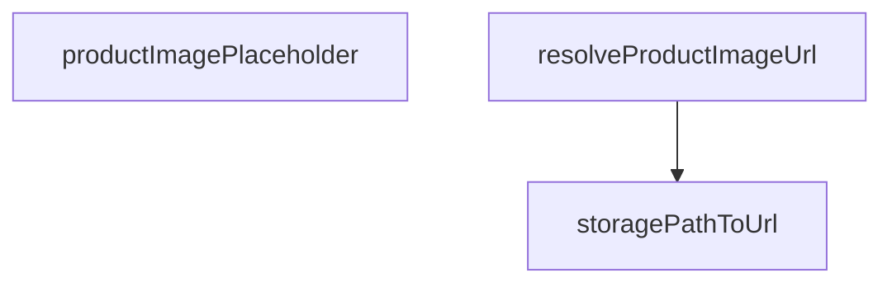

## Genel Bakış

Bu modül, ürün görsellerine ait URL'lerin çözümlemesinden ve oluşturulmasından sorumludur. Depolama yollarını erişilebilir URL'lere dönüştürür, ürün nesnelerinden uygun görsel URL'sini seçer ve gerektiğinde yer tutucu (placeholder) görsel URL'leri üretir.

## Fonksiyon Grupları

### URL Dönüştürme ve Çözümleme

Depolama sistemindeki yolları tarayıcının erişebileceği URL'lere çevirir ve ürün nesnelerindeki farklı görsel alanlarından uygun olanı seçerek son URL'i belirler.

- storagePathToUrl, resolveProductImageUrl

### Yer Tutucu Görsel Üretimi

Gerçek bir görsel atanmamış ürünler için deterministik bir yer tutucu görsel URL'si oluşturur; seed parametresi sayesinde aynı ürün için her zaman aynı placeholder görseli döner.

- productImagePlaceholder

---

## AXIOMS – Mimari Varsayımlar
- Bu modül davranışsal mantık içermez (salt veri / konfigürasyon / tip tanımı).
- [Aksiyom 1]: Modülün dışa açtığı yapı (anahtar kümesi / şema) bir sözleşmedir; tüketiciler bu sabit yapıya bağlıdır — kırıcı değişiklik tüm tüketicileri etkiler.
- [Aksiyom 2]: Bir öğe ekleme/çıkarma yapısal-uyumlu olmalı; ilgili tipler ve seçiciler aynı commit'te güncel tutulmalıdır.

---

## FONKSİYON DETAYLARI

### storagePathToUrl
**Ne yapar**: `product_images.path` alanındaki Supabase Storage yolunu herkese açık (public) tam Supabase Storage URL'ine dönüştürür. Kullanılan bucket sabiti `PRODUCT_IMAGE_BUCKET` olup, bu değer docstring'e göre `product-images` olarak tanımlıdır ve ImageGallery.tsx ile aynıdır.

**Nasıl yapar**: Gelen path önce `trim()` ile baştaki ve sondaki boşluklardan arındırılır. Ardından yolun zaten bucket adıyla başlayıp başlamadığı kontrol edilir; başlamıyorsa `PRODUCT_IMAGE_BUCKET/` öneki eklenir. Ortam değişkeni `NEXT_PUBLIC_SUPABASE_URL` mevcut değilse, bucket'lı yol başına `/` eklenerek göreli (relative) bir yol döndürülür — bu durumda tam URL oluşturulamaz. Supabase URL'i mevcutsa, mükerrer öneki önlemek adına yol, `supabaseUrl` ve `PUBLIC_OBJECT_SEGMENT` birleşiminden oluşan kısımdan temizlenir; ardından `supabaseUrl + PUBLIC_OBJECT_SEGMENT + cleanPath` şeklinde tam public URL üretilir.

**Parametreler**:
- path: `string` — Supabase Storage'daki görselin yolu. `product_images.path` alanından gelir; başına bucket adı eklenmiş ya da eklenmemiş olabilir.

**Dönüş**: `string` — Herkese açık Supabase Storage URL'i. Ortam değişkeni eksikse göreli yol (örneğin `/product-images/...`) döner.

### resolveProductImageUrl
**Ne yapar**: Geliştirildi ancak detay üretilemedi.

### productImagePlaceholder
**Ne yapar**: Geliştirildi ancak detay üretilemedi.

---

## AST POINTERS

### [N1_NASIL] AST Pointer: src/lib/images/productImage.ts::storagePathToUrl
- **params**: `path` (string) — depolama yolu
- **ic_degiskenler**:
  - `trimmed` — `path` parametresinin başındaki ve sonundaki boşlukların temizlenmiş hali
  - `pathWithBucket` — `trimmed` değeri `PRODUCT_IMAGE_BUCKET` ile başlamıyorsa başına `PRODUCT_IMAGE_BUCKET/` eklenmiş yol; zaten başlıyorsa `trimmed` değeri aynen kullanılır
  - `supabaseUrl` — `process.env.NEXT_PUBLIC_SUPABASE_URL` ortam değişkeni; tanımlı değilse fonksiyon erken dönüş yapar
  - `cleanPath` — `pathWithBucket` içinden `${supabaseUrl}${PUBLIC_OBJECT_SEGMENT}` ifadesi çıkarılarak mükerrer prefix temizlenmiş yol
- **Dönüş**: string — `supabaseUrl` tanımlıysa `${supabaseUrl}${PUBLIC_OBJECT_SEGMENT}${cleanPath}` biçiminde tam public URL; tanımlı değilse `/${pathWithBucket}` biçiminde göreli yol

### [N2_NASIL] AST Pointer: src/lib/images/productImage.ts::resolveProductImageUrl
- **params**: `p` (nesne) — `image_url?: string | null` ve `cover_image_path?: string | null` alanlarını içeren ürün nesnesi
- **ic_degiskenler**:
  - `p.cover_image_path` — varsa `storagePathToUrl` fonksiyonuna gönderilerek URL'e dönüştürülür
  - `p.image_url` — `cover_image_path` yoksa ve bu değer `https://` veya `http://` ile başlayan bir tam URL ise doğrudan kullanılır
- **Dönüş**: string | null — `cover_image_path` varsa `storagePathToUrl` dönüşü; yoksa `image_url` geçerli bir tam URL ise o değer; aksi halde `null`

### [N3_NASIL] AST Pointer: src/lib/images/productImage.ts::productImagePlaceholder
- **params**: `_seed` (string) — kullanılmıyor (alt çizgi öneki ile işaretli)
- **ic_degiskenler**: yok
- **Dönüş**: string — `PRODUCT_IMAGE_PLACEHOLDER` sabitinin değeri

---

## MERMAID CALL GRAPH

## NODE ID STANDARD

  file: src\lib\images\productImage.ts
  function: src\lib\images\productImage.ts::storagePathToUrl
  function: src\lib\images\productImage.ts::resolveProductImageUrl
  function: src\lib\images\productImage.ts::productImagePlaceholder

---

## DISA AKTARILANLAR (EXPORTS)
  export: productImagePlaceholder
  export: resolveProductImageUrl
  export: storagePathToUrl