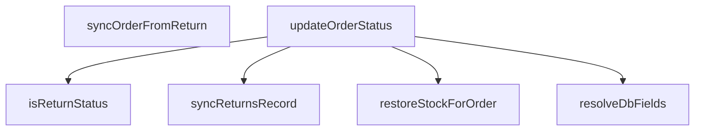

## Genel Bakış
Bu modül, VentHub HVAC platformundaki sipariş yaşam döngüsü yönetimi için geliştirilmiş merkezi bir sipariş durumu servisidir. UI'dan gelen durum taleplerini veritabanı uyumlu formatlara dönüştürür, temel sipariş durumu güncellemelerini yönetir, iade süreçlerini tüm ilgili kayıtlarla senkronize eder ve iade edilen siparişler için stok geri yükleme işlemlerini yürütür. Tüm durum değişikliklerini tek noktadan yöneterek sistemdeki sipariş, stok ve iade kayıtları arasındaki tutarlılığı garanti eder.

## Fonksiyon Grupları
### Yardımcı Durum İşleme Fonksiyonları
UI ve veritabanı arasındaki durum formatı uyumsuzluklarını gideren, durum türlerini teyit eden temel yardımcı işlemleri barındırır.
- resolveDbFields, isReturnStatus

### Ana Sipariş Durumu Güncelleme Servisi
Tüm sipariş durumu değişikliklerinin temel iş akışını yöneten, asenkron olarak güncelleme işlemlerini gerçekleştiren ana servis fonksiyonunu içerir.
- updateOrderStatus

### İade Süreci Senkronizasyon İşlemleri
İade modülünden gelen durum değişikliklerini ana sipariş kayıtlarıyla eşleştirir, iade ile ilgili tüm sistem kayıtlarının güncel ve tutarlı kalmasını sağlar.
- syncOrderFromReturn, syncReturnsRecord

### Stok Entegrasyon Fonksiyonları
İade edilen veya iptal edilen siparişler için sistem envanterindeki stok miktarlarını geri yükleyerek envanter tutarlılığını koruyan entegrasyon işlemini barındırır.
- restoreStockForOrder

---

## AXIOMS – Mimari Varsayımlar
Bu modül, sistemdeki siparişlerin durum yönetimi, iade işlemleriyle sipariş durumlarının senkronizasyonu ve iade edilen siparişler için stok geri yükleme işlemlerini gerçekleştirmek üzere modül içindeki statü sabitlerinin geçerliliği, harici veritabanı ve servis erişimlerinin varlığını zorunlu kılar.

[Aksiyom 1]: Eğer RETURN_STATUSES veya VALID_ORDER_STATUSES modül sabitleri tanımlı değilse, iade statüsü tespiti, tüm statü validasyonları ve durum güncelleme işlemleri çalışmaz, modül hiçbir temel işlevini yerine getiremez.
[Aksiyom 2]: Eğer sipariş verilerini tutan veritabanına modülün erişimi yoksa, resolveDbFields ile veritabanı alanı çözümleme, updateOrderStatus ile durum güncelleme işlemleri başarısız olur, sistemde tutarsız sipariş durumları oluşur.
[Aksiyom 3]: Eğer RETURN_STATUSES sabiti içindeki değerler sistemdeki gerçek geçerli iade statüleriyle eşleşmiyorsa, isReturnStatus ile iade statüsü tespiti ve tüm iade senkronizasyon işlemleri yanlış çalışır, gerektiğinde stok geri yüklenmez veya yanlış siparişlerde stok işlemi tetiklenir.
[Aksiyom 4]: Eğer iade kayıtlarını tutan servise/veritabanına modülün erişimi yoksa, syncOrderFromReturn ile sipariş-iade durumu senkronizasyonu ve syncReturnsRecord ile iade kaydı güncelleme işlemleri başarısız olur, sipariş ve iade durumları arasında kalıcı uyumsuzluk oluşur.
[Aksiyom 5]: Eğer stok yönetimi servisine modülün iletişim kurma imkanı yoksa, restoreStockForOrder ile iade edilen siparişler için stok geri yükleme işlemi gerçekleştirilemez, sistem stok envanteri tutarsız hale gelir.
[Aksiyom 6]: Eğer UI'dan gelen statü değerleri ile veritabanı tarafından kullanılan statü değerleri arasındaki eşleşme haritası tanımlı değilse, resolveDbFields fonksiyonu geçersiz veritabanı alanı değeri döndürür, tüm durum güncelleme işlemleri veritabanı hatalarına neden olur.
[Aksiyom 7]: Eğer senkronizasyon veya işlem yapılmak istenen orderId sistemde mevcut bir siparişe ait değilse, tüm sipariş durumu güncelleme, iade senkronizasyonu ve stok geri yükleme işlemleri başarısız olur, kayıpsız veri güncellemesi garantilenemez.
[Aksiyom 8]: Eğer VALID_ORDER_STATUSES sabiti sistemdeki tüm geçerli sipariş statülerini tam olarak içermiyorsa, sipariş durum güncellemelerinde geçersiz statülerin sisteme kaydedilmesi engellenemez, sipariş yaşam döngüsünün bütünlüğü bozulur.

---

## FONKSİYON DETAYLARI

### resolveDbFields
**Ne yapar**: UI katmanından gelen sipariş statüsünü veritabanı yapısına uygun status ve opsiyonel payment_status alanları çiftine dönüştürür. Gelen UI statüsünün türüne göre gerekli veritabanı alanlarını doldurur, örneğin "refunded" UI statüsünü { status: "cancelled", payment_status: "refunded" } nesnesine, "shipped" UI statüsünü ise { status: "shipped", payment_status: undefined } nesnesine çevirir.
**Nasıl yapar**: Sistemde önceden tanımlanmış UI ve veritabanı statüsü eşleştirmelerini kullanarak gelen değerin hangi veritabanı alanlarına karşılık geldiğini belirler. Eğer gelen statü ek bir ödeme durumu bilgisi gerektirmiyorsa payment_status alanını otomatik olarak undefined olarak ayarlar, sadece zorunlu status alanını doldurur.
**Parametreler**:
- name: uiStatus — type: string — UI katmanından iletilen, kullanıcı dostu sipariş statüsü string değeri
**Dönüş**: { status: string; payment_status?: string } — Veritabanı kullanımına uyarlanmış, zorunlu sipariş statüsü alanı ve opsiyonel ödeme durumu alanını içeren nesne. İşlem sonucu her zaman geçerli bir nesne olarak döndürülür.

### updateOrderStatus

**Ne yapar**: Merkezi sipariş statüsü güncelleme fonksiyonudur. Siparişin durumunu veritabanında ileri yönlü olarak günceller, teslim zaman damgası yazar, iade/iptal senaryolarında stok restorasyonu ve returns senkronizasyonu yapar, teslim durumunda müşteriye bildirim e-postası gönderir ve tüm değişiklikleri audit log'a kaydeder. Tek bir merkezi noktadan tüm sipariş yaşam döngüsü yönetimini koordine eder.

**Nasıl yapar**: Fonksiyon çalışma zamanında (runtime) Several adımlı bir pipeline izler:

1. **Monotonluk Kapısı**: `canTransitionOrder` yardımcı fonksiyonunu çağırarak geçişin geçerliliğini kontrol eder. `oldStatus` verilmemişse (senkronizasyon çağrıları durumu) kontrol atlanır. Geçersiz geçiş tespit edilirse fonksiyon erken döner ve hata mesajı döndürür.
2. **Statü Güncellemesi**: `resolveDbFields` ile yeni statüye karşılık gelen veritabanı alanlarını çözümler. Eğer statü `delivered` ise `delivered_at` alanını mevcut zaman damgasıyla yazar — ancak `is('delivered_at', null)` koşuluyla idempotent davranışı sağlar (zaten damgalanmış kayıtları ezmez). Damga ilk kez yazıldıysa `deliveredNow` flag'i true olur; aksi halde yalnızca statü alanını hizalar.
3. **İade/İptal Senkronizasyonu**: `isReturnStatus` ile yeni statünün iade/iptal olup olmadığını kontrol eder. İade durumunda `syncReturnsRecord` ile `venthub_returns` tablosunu senkronize eder ve eğer önceki statü iade/iptal değilse `restoreStockForOrder` ile stokları iade eder.
4. **Teslim Bildirimi**: Yalnızca `deliveredNow` true olduğunda (ilk teslim anında) `supabase.functions.invoke` ile `delivery-notification` edge function'ını çağırır. Hata durumunda yutulur (best-effort).
5. **Audit Log**: `logAdminAction` ile değişikliği kaydeder. Audit log hatası da sessizce yutularak UI'ın bloklanması engellenir.

`skipReturnsSync` ve `skipOrdersSync` bayrakları ile ilgili senkronizasyon adımları atlanabilir. Bu, senkronizasyon çağrılarının kendi içlerinde tekrar tetikleme döngüsüne girmesini engeller.

**Parametreler**:

- `input`: `UpdateOrderStatusInput` — Fonksiyona giren tüm parametreleri taşıyan nesne. Aşağıdaki alanları içerir:
  - `orderId`: `string` — Güncellenecek siparişin benzersiz tanımlayıcısı.
  - `newStatus`: `string` — Hedeflenen yeni statü değeri.
  - `oldStatus`: `string | undefined` — Mevcut (eski) statü değeri. Tanımlanmadığında monotonluk kontrolü atlanır; bu durum yalnızca senkronizasyon çağrılarında kullanılır.
  - `userId`: `string` — İşlemi yapan kullanıcının tanımlayıcısı; iade senkronizasyonunda kaydedilir.
  - `reason`: `string | undefined` — Statü değişikliğinin nedeni; iade/iptal senkronizasyonunda kullanılır.
  - `auditComment`: `string | undefined` — Audit log'a yazılacak özel yorum. Tanımlanmazsa `status → ${newStatus}` formatında varsayılan mesaj üretilir.
  - `skipReturnsSync`: `boolean` — Varsayılan `false`. `true` olduğunda iade/iptal senkronizasyonu ve stok restorasyonu adımları atlanır.
  - `skipOrdersSync`: `boolean` — Varsayılan `false`. `true` olduğunda veritabanı statü güncellemesi ve monotonluk kontrolü atlanır.

**Dönüş**: `Promise<UpdateOrderStatusResult>` — İşlemin sonucunu temsil eden nesne. İki olası durum döner:
- `{ ok: true }` — İşlem başarıyla tamamlandı.
- `{ ok: false, error: string }` — İşlem başarısız oldu; `error` alanında insan tarafından okunabilir hata mesajı bulunur. Monotonluk kuralı ihlali durumunda "`Geçersiz statü geçişi: {old} → {new} (sipariş durumu yalnız ileri taşınabilir)`" formatında hata döner. Veritabanı hatalarında "`Sipariş güncellenemedi: {hata_detayı}`" formatında hata döner. Yakalanan tüm hatalar `console.error` ile loglanır ve `{ ok: false, error: mesaj }` olarak zarif biçimde kullanıcıya iletilir; function asla exception fırlatmaz.

### syncOrderFromReturn
**Ne yapar**: İade (Returns) tablosundaki statü değişikliklerini ana sipariş (Orders) tablosuna yansıtan iki yönlü senkronizasyonun iadeden siparişe doğru olan ayağını gerçekleştirir. İki tablo arasındaki veri tutarlılığını korumak için kullanılır, iade işlemlerindeki tüm değişikliklerin ana sipariş kaydına da yansımasını sağlar.
**Nasıl yapar**: İade tablosundan alınan yeni iade statüsünü veritabanı uyumlu sipariş statüsüne dönüştürür, ardından merkezi updateOrderStatus fonksiyonunu çağırarak ilgili sipariş kaydının güncellenmesini sağlar. İşlem sırasında yetki ve doğrulama kontrollerini de tamamlayarak geçersiz statü değişikliklerinin engellenmesini sağlar.
**Parametreler**:
- name: orderId — type: string — Güncellenecek ana siparişin benzersiz sistem kimliği
- name: returnStatus — type: string — İade tablosunda güncellenen yeni iade statüsünün string değeri
**Dönüş**: Promise<UpdateOrderStatusResult> — Tetiklenen sipariş statüsü güncelleme işleminin sonucunu, başarı durumu ve varsa hata detaylarını içeren nesneyi asenkron olarak döndürür.

### isReturnStatus
**Ne yapar**: Sisteme gelen herhangi bir statü string'inin tanımlı bir iade statüsü olup olmadığını kontrol eder. İade ile ilgili özel statüleri genel sipariş statülerinden ayırt etmek için tüm senkronizasyon ve statü güncelleme işlemlerinde kullanılır.
**Nasıl yapar**: Sistemde önceden tanımlanmış tüm geçerli iade statüsü değerlerinin listesini referans alarak, fonksiyona iletilen statü string'inin bu listede yer alıp almadığını kontrol eder. Eşleşme varsa true, aksi halde false değeri döndürür.
**Parametreler**:
- name: status — type: string — Kontrol edilmesi gereken sistem statüsü string değeri
**Dönüş**: boolean — İletilen statü bir geçerli iade statüsü ise true, aksi takdirde false değerini döndürür.

### syncReturnsRecord
**Ne yapar**: Ana sipariş (Orders) tablosundaki statü değişikliklerini ilgili iade (Returns) tablosu kaydına yansıtan senkronizasyon işlemini gerçekleştirir. İki yönlü veri tutarlılığını koruyan, siparişten iade kaydına doğru senkronizasyon ayağını oluşturur.
**Nasıl yapar**: İletilen sipariş kimliği ile eşleşen iade kaydını veritabanında bulur, gelen yeni statü, isteğe bağlı kullanıcı kimliği ve değişiklik sebebi gibi verileri kullanarak iade kaydını günceller. Tüm doğrulama ve yetki kontrollerini tamamladıktan sonra işlemi sonlandırır.
**Parametreler**:
- name: orderId — type: string — Eşleşen bir iade kaydına sahip olan ana siparişin benzersiz sistem kimliği
- name: newStatus — type: string — İade kaydına yazılacak olan yeni statü değeri
- name: userId — type: string | null | undefined — Statü değişikliğini gerçekleştiren kullanıcının benzersiz kimliği, zorunlu değildir, null veya undefined olarak gönderilebilir
- name: reason — type: string | undefined — Statü değişikliğinin açıklaması, iade sürecindeki sebebi ifade eden string değeri, zorunlu değildir
**Dönüş**: Promise<void> — Senkronizasyon işlemi başarıyla tamamlandığında herhangi bir değer döndürmeden tamamlanan asenkron işlem, oluşması halinde hataları dışarı fırlatır.

### restoreStockForOrder
**Ne yapar**: İptal edilen, iade alınan veya statüsü gereği stoklarının envantere geri eklenmesi gereken siparişler için sistemdeki stok miktarlarını geri yükler. Envanter tutarlılığını korumak için kullanılır, iade veya iptal durumlarında yanlış stok sayımlarının önüne geçer.
**Nasıl yapar**: İletilen sipariş kimliği ile siparişteki tüm ürünleri ve satın alınan miktarlarını veritabanından çeker, her ürün için mevcut stok kayıtlarına ilgili miktarları tekrar ekler. Tüm stok güncellemeleri başarıyla kaydedildikten sonra işlemi sonlandırır.
**Parametreler**:
- name: orderId — type: string — Stokları envantere geri yüklenecek olan siparişin benzersiz sistem kimliği
**Dönüş**: Promise<void> — Stok geri yükleme işlemi başarıyla tamamlandığında herhangi bir değer döndürmeden tamamlanan asenkron işlem, oluşması halinde hataları dışarı fırlatır.

---

## İTHALATLAR (IMPORTS)
- import: ../types/database.types::type { Database }
- import: ./audit::logAdminAction
- import: ./supabase::supabase

---

## INTERFACES

### UpdateOrderStatusInput
- `orderId: string`
- `newStatus: string`
- `oldStatus?: string`
- `userId?: string | null`
- `reason?: string`
- `auditComment?: string`
- `skipReturnsSync?: boolean`
- `skipOrdersSync?: boolean`

### UpdateOrderStatusResult
- `ok: boolean`
- `error?: string`

---

## SABİTLER
- **RETURN_STATUSES** (as_expression) — `['cancelled', 'refunded', 'partial_refunded'] as const`
- **VALID_ORDER_STATUSES** (as_expression) — `['pending', 'confirmed', 'processing', 'shipped', 'delivered', 'cancelled'] a...`

---

## AST POINTERS

### [N1_NASIL] AST Pointer: src/lib/orderStatusService.ts::resolveDbFields
- **params**: (uiStatus: string)
- **ic_degiskenler**: 
  - `uiStatus` — Girilen UI statüsü, DB alanlarına dönüştürülecek değer
- **Dönüş**: { status: string; payment_status?: string }

### [N2_NASIL] AST Pointer: src/lib/orderStatusService.ts::updateOrderStatus
- **params**: (input: UpdateOrderStatusInput)
- **ic_degiskenler**:
  - `input` — Sipariş güncelleme girdisi, içeriği destructuring ile ayrıştırılır
  - `orderId` — Güncellenecek siparişin ID'si
  - `newStatus` — Hedeflenen yeni sipariş statüsü
  - `oldStatus` — Siparişin mevcut statüsü, geçiş kontrolü için kullanılır
  - `userId` — İşlemi yapan kullanıcının ID'si (audit log için)
  - `reason` — Statü değişikliği nedeni (iade/iptal kaydı için)
  - `auditComment` — Audit log için özel yorum metni
  - `skipReturnsSync` — Returns tablosu senkronizasyonunu atla bayrağı (varsayılan false)
  - `skipOrdersSync` — Orders tablosu güncellemesini atla bayrağı (varsayılan false)
  - `deliveredNow` — Teslimatın ilk kez yapılıp yapılmadığını belirten boolean flag
  - `dbFields` — UI statüsünden DB alanlarına dönüştürülmüş değerler
  - `updatePayload` — venthub_orders tablosuna gönderilecek güncelleme nesnesi
  - `stamped` — Teslimat zaman damgası yazılan satır verisi (ID döner)
  - `deliverErr` — Teslimat zaman damgası yazma hatası
  - `alignErr` — Teslimat alanını hizalama hatası
  - `orderErr` — Sipariş statüsü güncelleme hatası
- **Dönüş**: Promise<UpdateOrderStatusResult>

### [N3_NASIL] AST Pointer: src/lib/orderStatusService.ts::syncOrderFromReturn
- **params**: (orderId: string, returnStatus: string)
- **ic_degiskenler**:
  - `orderId` — Senkronize edilecek siparişin ID'si
  - `returnStatus` — İade/iptal durumu
  - `orderStatusMap` — Return statülerini Order statülerine eşleyen harita
  - `mapped` — Seçilen returnStatus'a karşılık gelen order mapping
  - `updatePayload` — venthub_orders tablosuna gönderilecek güncelleme nesnesi
  - `error` — Veritabanı güncelleme hatası
- **Dönüş**: Promise<UpdateOrderStatusResult>

### [N4_NASIL] AST Pointer: src/lib/orderStatusService.ts::isReturnStatus
- **params**: (status: string)
- **ic_degiskenler**:
  - `status` — Kontrol edilen statü değeri
- **Dönüş**: boolean

### [N5_NASIL] AST Pointer: src/lib/orderStatusService.ts::syncReturnsRecord
- **params**: (orderId: string, newStatus: string, userId?: string | null, reason?: string)
- **ic_degiskenler**:
  - `orderId` — İlgili siparişin ID'si
  - `newStatus` — Yeni return statüsü
  - `userId` — Kullanıcı ID'si (yeni kayıt oluşturulurken kullanılır)
  - `reason` — İade/iptal nedeni (yeni kayıt oluşturulurken kullanılır)
  - `existing` — Mevcut venthub_returns kaydı (ID döner, varsa güncelleme yapılır)
  - `defaultReason` — Reason parametresi verilmediğinde kullanılacak varsayılan metin
- **Dönüş**: Promise<void> (yan etki: venthub_returns tablosuna insert/update)

### [N6_NASIL] AST Pointer: src/lib/orderStatusService.ts::restoreStockForOrder
- **params**: (orderId: string)
- **ic_degiskenler**:
  - `orderId` — Stokları iade edilecek siparişin ID'si
  - `items` — Sipariş kalemleri ve ilişkili ürün verileri (product_id, quantity, products relation)
  - `updates` — Ürün stok güncelleme listesi (her eleman: {id, stock_qty})
  - `movements` — Envanter hareket kayıtları listesi (her eleman: {product_id, delta, reason, order_id})
  - `groupedItems` — Ürün bazında gruplandırılmış sipariş kalemleri {product_id: {quantity, currentStock}}
- **Dönüş**: Promise<void> (yan etki: products tablosunda stock_qty güncelleme, inventory_movements tablosuna insert)

---

## MERMAID CALL GRAPH

## NODE ID STANDARD

  file: src\lib\orderStatusService.ts
  function: src\lib\orderStatusService.ts::resolveDbFields
  function: src\lib\orderStatusService.ts::updateOrderStatus
  function: src\lib\orderStatusService.ts::syncOrderFromReturn
  function: src\lib\orderStatusService.ts::isReturnStatus
  function: src\lib\orderStatusService.ts::syncReturnsRecord
  function: src\lib\orderStatusService.ts::restoreStockForOrder

---

## DISA AKTARILANLAR (EXPORTS)
  export: isReturnStatus
  export: resolveDbFields
  export: restoreStockForOrder
  export: syncOrderFromReturn
  export: syncReturnsRecord
  export: updateOrderStatus