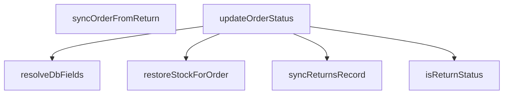

## Genel Bakış
VentHub platformunda sipariş yaşam döngüsünün merkezi yöneticisi olan bu modül, UI katmanından gelen durum güncellemelerini veritabanı ile senkronize eder. Sipariş durumlarını dönüştürür, ana güncelleme iş akışlarını yürütür, iade süreçlerini ilgili tüm kayıtlarla tutarlı hale getirir ve gerektiğinde stok seviyelerini geri yükler. Modül, sipariş, iade ve envanter verileri arasındaki kritik bağlantıyı koruyarak sistem bütünlüğünü sağlar.

## Fonksiyon Grupları
### Yardımcı Durum İşleme Fonksiyonları
UI ve veritabanı arasındaki durum formatı uyumsuzluklarını gideren, durum türlerini (özellikle iade durumunu) teyit eden temel yardımcı işlemleri barındırır.
- resolveDbFields, isReturnStatus

### Ana Sipariş Durumu Güncelleme Servisi
Tüm sipariş durumu değişikliklerinin temel iş akışını yöneten, gerekli veritabanı alanlarını hesaplayan ve asenkron olarak güncelleme işlemini gerçekleştiren ana servis fonksiyonunu içerir.
- updateOrderStatus

### İade Süreci Senkronizasyon İşlemleri
İade modülünden gelen durum değişikliklerini ana sipariş kayıtlarıyla eşleştirir, iade kayıtlarını oluşturur/günceller ve ilgili tüm sistem kayıtlarının güncel kalmasını sağlar.
- syncOrderFromReturn, syncReturnsRecord

### Stok Entegrasyon Fonksiyonları
İade edilen siparişler için sistem envanterindeki stok miktarlarını geri yükleyerek envanter tutarlılığını koruyan entegrasyon işlemini barındırır.
- restoreStockForOrder

## AXIOMS – Mimari Varsayımlar
Bu modül, sistemdeki sipariş, iade ve stok verilerinin tutarlılığını tek bir kaynaktan yöneterek veri bütünlüğünü garanti eden bir **yazılama (write orchestrator)** olarak tasarlanmıştır. Asenkron iş akışları ve geri dönüş (rollback) mekanizmaları içerebilir; bu nedenle hata yönetimi ve izlenebilirlik (ör. userId, reason parametreleri) kritik öneme sahiptir. Modül, UI veya iade alt sistemi gibi dış kaynaklardan tetiklenen durum geçişlerini **olay驱动 (event-driven)** bir yaklaşımla orkestra eder.

---

## AXIOMS – Mimari Varsayımlar
- Bu modül davranışsal mantık içermez (salt veri / konfigürasyon / tip tanımı).
- [Aksiyom 1]: Modülün dışa açtığı yapı (anahtar kümesi / şema) bir sözleşmedir; tüketiciler bu sabit yapıya bağlıdır — kırıcı değişiklik tüm tüketicileri etkiler.
- [Aksiyom 2]: Bir öğe ekleme/çıkarma yapısal-uyumlu olmalı; ilgili tipler ve seçiciler aynı commit'te güncel tutulmalıdır.

---

## FONKSİYON DETAYLARI

### resolveDbFields
**Ne yapar**: UI katmanından gelen sipariş statüsünü veritabanı yapısına uygun status ve opsiyonel payment_status alanları çiftine dönüştürür. Gelen UI statüsünün türüne göre gerekli veritabanı alanlarını doldurur, örneğin "refunded" UI statüsünü { status: "cancelled", payment_status: "refunded" } nesnesine, "shipped" UI statüsünü ise { status: "shipped", payment_status: undefined } nesnesine çevirir.
**Nasıl yapar**: Sistemde önceden tanımlanmış UI ve veritabanı statüsü eşleştirmelerini kullanarak gelen değerin hangi veritabanı alanlarına karşılık geldiğini belirler. Eğer gelen statü ek bir ödeme durumu bilgisi gerektirmiyorsa payment_status alanını otomatik olarak undefined olarak ayarlar, sadece zorunlu status alanını doldurur.
**Parametreler**:
- name: uiStatus — type: string — UI katmanından iletilen, kullanıcı dostu sipariş statüsü string değeri
**Dönüş**: { status: string; payment_status?: string } — Veritabanı kullanımına uyarlanmış, zorunlu sipariş statüsü alanı ve opsiyonel ödeme durumu alanını içeren nesne. İşlem sonucu her zaman geçerli bir nesne olarak döndürülür.

### updateOrderStatus
**Ne yapar**: Merkezi sipariş statüsü güncelleme fonksiyonudur. Siparişin durumunu veritabanında günceller, gerektiğinde teslim zaman damgası yazar, iade/iptal senkronizasyonunu tetikler, stok restorasyonunu başlatır, teslim bildirimi gönderir ve audit log kaydı oluşturur. Sistemin sipariş durum geçişlerinin tek yetkili ve değişmez koruma noktası olarak tasarlanmıştır.

**Nasıl yapar**: Fonksiyon, input nesnesinden gerekli alanları destructure eder ve çok aşamalı bir güncelleme süreci yürütür. İlk olarak `canTransitionOrder` ile monotonluk kontrolü yapılır (şu an `false &&` ile devre dışıdır, bilerek koruma hizmet katmanında tutulmaktadır — arayüzdeki kontrol yalnızca bir nezaket katmanıdır). Ardından `resolveDbFields` ile statü veritabanı alanlarına dönüştürülür ve `venthub_orders` tablosu güncellenir. Teslim (`delivered`) durumuna geçişte `delivered_at` zaman damgası idempotent şekilde yazılır — `is('delivered_at', null)` koşulu ile ilk teslim anı korunur ve tekrar yazım önlenir. Damga ilk kez yazıldıysa `deliveredNow` flag'i true olur. İade/iptal durumlarında `syncReturnsRecord` ile `venthub_returns` tablosu senkronize edilir ve daha önce iade/iptal haline gelmemişse `restoreStockForOrder` ile stoklar iade edilir. Teslim bildirimi (`delivery-notification`) ve audit log kaydı best-effort çalışır; her ikisinin de hata yutulur ve statü güncellemesini geri almaz.

**Parametreler**:
- `input`: `UpdateOrderStatusInput` — Fonksiyona verilen tüm güncelleme bilgilerini içeren nesne. Aşağıdaki alt alanlara ayrıştırılır.
  - `orderId`: `string` — Güncellenecek siparişin benzersiz tanımlayıcısı.
  - `newStatus`: `string` — Siparişin geçilecek yeni durum değeri (ör. `delivered`, `cancelled`, `returned` vb.).
  - `oldStatus`: `string | undefined` — Siparişin bir önceki durum değeri. Senkronizasyon çağrılarında `undefined` olabilir; bu durumda monotonluk kontrolü atlanır.
  - `userId`: `string` — İşlemi gerçekleştiren kullanıcının tanımlayıcısı, iade senkronizasyonunda kullanılır.
  - `reason`: `string | undefined` — Durum değişikliğinin nedeni, iade/iptal senkronizasyonunda kaydedilir.
  - `auditComment`: `string | undefined` — Audit log'a yazılacak özel yorum. Belirtilmezse `status → ${newStatus}` formatında varsayılan bir yorum üretilir.
  - `skipReturnsSync`: `boolean` — Varsayılan `true`. `true` olduğunda iade/iptal senkronizasyonu ve stok restorasyonu adımları atlanır.
  - `skipOrdersSync`: `boolean` — Varsayılan `true`. `true` olduğunda veritabanında sipariş statüsü güncellemesi yapılmaz.

**Dönüş**: `Promise<UpdateOrderStatusResult>` — İşlemin başarılı olup olmadığını belirten nesne. Başarılı ise `{ ok: true }`, başarısız ise `{ ok: false, error: string }` döner. Hata mesajı hem `console.error`'a yazılır hem de dönen nesnenin `error` alanına yerleştirilir.

### syncOrderFromReturn
**Ne yapar**: İade (Returns) tablosundaki statü değişikliklerini ana sipariş (Orders) tablosuna yansıtan iki yönlü senkronizasyonun iadeden siparişe doğru olan ayağını gerçekleştirir. İki tablo arasındaki veri tutarlılığını korumak için kullanılır, iade işlemlerindeki tüm değişikliklerin ana sipariş kaydına da yansımasını sağlar.
**Nasıl yapar**: İade tablosundan alınan yeni iade statüsünü veritabanı uyumlu sipariş statüsüne dönüştürür, ardından merkezi updateOrderStatus fonksiyonunu çağırarak ilgili sipariş kaydının güncellenmesini sağlar. İşlem sırasında yetki ve doğrulama kontrollerini de tamamlayarak geçersiz statü değişikliklerinin engellenmesini sağlar.
**Parametreler**:
- name: orderId — type: string — Güncellenecek ana siparişin benzersiz sistem kimliği
- name: returnStatus — type: string — İade tablosunda güncellenen yeni iade statüsünün string değeri
**Dönüş**: Promise<UpdateOrderStatusResult> — Tetiklenen sipariş statüsü güncelleme işleminin sonucunu, başarı durumu ve varsa hata detaylarını içeren nesneyi asenkron olarak döndürür.

### isReturnStatus
**Ne yapar**: Sisteme gelen herhangi bir statü string'inin tanımlı bir iade statüsü olup olmadığını kontrol eder. İade ile ilgili özel statüleri genel sipariş statülerinden ayırt etmek için tüm senkronizasyon ve statü güncelleme işlemlerinde kullanılır.
**Nasıl yapar**: Sistemde önceden tanımlanmış tüm geçerli iade statüsü değerlerinin listesini referans alarak, fonksiyona iletilen statü string'inin bu listede yer alıp almadığını kontrol eder. Eşleşme varsa true, aksi halde false değeri döndürür.
**Parametreler**:
- name: status — type: string — Kontrol edilmesi gereken sistem statüsü string değeri
**Dönüş**: boolean — İletilen statü bir geçerli iade statüsü ise true, aksi takdirde false değerini döndürür.

### syncReturnsRecord
**Ne yapar**: Ana sipariş (Orders) tablosundaki statü değişikliklerini ilgili iade (Returns) tablosu kaydına yansıtan senkronizasyon işlemini gerçekleştirir. İki yönlü veri tutarlılığını koruyan, siparişten iade kaydına doğru senkronizasyon ayağını oluşturur.
**Nasıl yapar**: İletilen sipariş kimliği ile eşleşen iade kaydını veritabanında bulur, gelen yeni statü, isteğe bağlı kullanıcı kimliği ve değişiklik sebebi gibi verileri kullanarak iade kaydını günceller. Tüm doğrulama ve yetki kontrollerini tamamladıktan sonra işlemi sonlandırır.
**Parametreler**:
- name: orderId — type: string — Eşleşen bir iade kaydına sahip olan ana siparişin benzersiz sistem kimliği
- name: newStatus — type: string — İade kaydına yazılacak olan yeni statü değeri
- name: userId — type: string | null | undefined — Statü değişikliğini gerçekleştiren kullanıcının benzersiz kimliği, zorunlu değildir, null veya undefined olarak gönderilebilir
- name: reason — type: string | undefined — Statü değişikliğinin açıklaması, iade sürecindeki sebebi ifade eden string değeri, zorunlu değildir
**Dönüş**: Promise<void> — Senkronizasyon işlemi başarıyla tamamlandığında herhangi bir değer döndürmeden tamamlanan asenkron işlem, oluşması halinde hataları dışarı fırlatır.

### restoreStockForOrder
**Ne yapar**: İptal edilen, iade alınan veya statüsü gereği stoklarının envantere geri eklenmesi gereken siparişler için sistemdeki stok miktarlarını geri yükler. Envanter tutarlılığını korumak için kullanılır, iade veya iptal durumlarında yanlış stok sayımlarının önüne geçer.
**Nasıl yapar**: İletilen sipariş kimliği ile siparişteki tüm ürünleri ve satın alınan miktarlarını veritabanından çeker, her ürün için mevcut stok kayıtlarına ilgili miktarları tekrar ekler. Tüm stok güncellemeleri başarıyla kaydedildikten sonra işlemi sonlandırır.
**Parametreler**:
- name: orderId — type: string — Stokları envantere geri yüklenecek olan siparişin benzersiz sistem kimliği
**Dönüş**: Promise<void> — Stok geri yükleme işlemi başarıyla tamamlandığında herhangi bir değer döndürmeden tamamlanan asenkron işlem, oluşması halinde hataları dışarı fırlatır.

---

## İTHALATLAR (IMPORTS)
- import: ../types/database.types::type { Database }
- import: ./admin/orderStatusMachine::canTransitionOrder
- import: ./audit::logAdminAction
- import: ./supabase::supabase

---

## INTERFACES

### UpdateOrderStatusInput
- `orderId: string`
- `newStatus: string`
- `oldStatus?: string`
- `userId?: string | null`
- `reason?: string`
- `auditComment?: string`
- `skipReturnsSync?: boolean`
- `skipOrdersSync?: boolean`

### UpdateOrderStatusResult
- `ok: boolean`
- `error?: string`

---

## SABİTLER
- **RETURN_STATUSES** (as_expression) — `['cancelled', 'refunded', 'partial_refunded'] as const`
- **VALID_ORDER_STATUSES** (as_expression) — `['pending', 'confirmed', 'processing', 'shipped', 'delivered', 'cancelled'] a...`

---

## AST POINTERS

### [N1_NASIL] AST Pointer: src/lib/orderStatusService.ts::resolveDbFields
- **params**: (uiStatus: string)
- **ic_degiskenler**:
  - yok
- **Dönüş**: `{ status: string; payment_status?: string }`

### [N2_NASIL] AST Pointer: src/lib/orderStatusService.ts::updateOrderStatus
- **params**: (input: UpdateOrderStatusInput)
- **ic_degiskenler**:
  - `orderId` — input'tan gelen sipariş ID'si
  - `newStatus` — hedeflenen yeni durum
  - `oldStatus` — geçerli eski durum (geçiş kontrolü için)
  - `userId` — işlemi yapan kullanıcının ID'si
  - `reason` — durum değişikliği reason'su
  - `auditComment` — audit log'a yazılacak yorum
  - `skipReturnsSync` — returns senkronizasyonunu atla bayrağı (varsayılan: false)
  - `skipOrdersSync` — orders güncelleme işlemini atla bayrağı (varsayılan: false)
  - `deliveredNow` — teslim damgasının ilk kez yazılıp yazılmadığını izler
  - `dbFields` — resolveDbFields() ile hesaplanan DB alanları
  - `updatePayload` — DB'ye gönderilecek güncelleme nesnesi
  - `stamped` — teslim damgası sonrası dönen satır verisi
  - `deliverErr` — teslim damgası güncelleme hatası
  - `alignErr` — teslim sonrası statü hizalama hatası
  - `orderErr` — genel sipariş güncelleme hatası
  - `err` — try-catch bloğunda yakalanan hata nesnesi
  - `message` — hata mesajı (err nesnesinden çıkarılır)
- **Dönüş**: `Promise<UpdateOrderStatusResult>`

### [N3_NASIL] AST Pointer: src/lib/orderStatusService.ts::syncOrderFromReturn
- **params**: (orderId: string, returnStatus: string)
- **ic_degiskenler**:
  - `orderStatusMap` — return durumlarını order durumlarına eşleyen harita
  - `mapped` — returnStatus'e karşılık gelen eşleme nesnesi
  - `updatePayload` — DB'ye gönderilecek güncelleme nesnesi
  - `error` — supabase.update() çağrısından dönen hata
  - `err` — try-catch bloğunda yakalanan hata nesnesi
- **Dönüş**: `Promise<UpdateOrderStatusResult>`

### [N4_NASIL] AST Pointer: src/lib/orderStatusService.ts::isReturnStatus
- **params**: (status: string)
- **ic_degiskenler**:
  - yok
- **Dönüş**: `boolean`

### [N5_NASIL] AST Pointer: src/lib/orderStatusService.ts::syncReturnsRecord
- **params**: (orderId: string, newStatus: string, userId?: string | null, reason?: string)
- **ic_degiskenler**:
  - `existing` — venthub_returns tablosundan mevcut iade kaydı sorgusu sonucu
  - `defaultReason` — reason parametresi verilmediğinde kullanılacak varsayılan neden metni
- **Dönüş**: `Promise<void>`

### [N6_NASIL] AST Pointer: src/lib/orderStatusService.ts::restoreStockForOrder
- **params**: (orderId: string)
- **ic_degiskenler**:
  - `items` — venthub_order_items tablosundan sipariş kalemleri ve ilişkili ürün verileri
  - `updates` — ürün stok güncellemeleri için nesne dizisi (id ve yeni stock_qty)
  - `movements` — inventory_movements tablosuna eklenecek hareket kayıtları dizisi
  - `groupedItems` — ürün ID'lerine göre gruplanmış sipariş kalemleri (toplam miktar ve mevcut stok)
  - `err` — try-catch bloğunda yakalanan hata nesnesi
- **Dönüş**: `Promise<void>`

---

## MERMAID CALL GRAPH

## NODE ID STANDARD

  file: src\lib\orderStatusService.ts
  function: src\lib\orderStatusService.ts::resolveDbFields
  function: src\lib\orderStatusService.ts::updateOrderStatus
  function: src\lib\orderStatusService.ts::syncOrderFromReturn
  function: src\lib\orderStatusService.ts::isReturnStatus
  function: src\lib\orderStatusService.ts::syncReturnsRecord
  function: src\lib\orderStatusService.ts::restoreStockForOrder

---

## DISA AKTARILANLAR (EXPORTS)
  export: isReturnStatus
  export: resolveDbFields
  export: restoreStockForOrder
  export: syncOrderFromReturn
  export: syncReturnsRecord
  export: updateOrderStatus