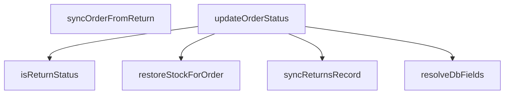

## Genel Bakış
Bu modül, VentHub HVAC platformundaki sipariş yaşam döngüsü yönetimini sağlayan merkezi bir sipariş durumu servisidir. UI katmanından gelen durum taleplerini veritabanı uyumlu formatlara dönüştürür, sipariş durumu güncellemelerini yönetir, iade süreçlerini tüm ilgili kayıtlarla senkronize eder ve iptal/iade edilen siparişler için stok geri yükleme işlemlerini yürütür. Tüm durum değişikliklerini tek noktadan yöneterek sipariş, stok ve iade kayıtları arasındaki tutarlılığı garanti altına alır.

## Fonksiyon Grupları
### Yardımcı Durum İşleme Fonksiyonları
UI ve veritabanı arasındaki durum formatı uyumsuzluklarını gideren, durum türlerini teyit eden temel yardımcı işlemleri barındırır. Bu fonksiyonlar diğer servis fonksiyonları tarafından çağrılarak durum dönüşümü ve sınıflandırma desteği sağlar.
- resolveDbFields, isReturnStatus

### Ana Sipariş Durumu Güncelleme Servisi
Tüm sipariş durumu değişikliklerinin temel iş akışını yöneten, asenkron olarak güncelleme işlemlerini gerçekleştiren ana servis fonksiyonunu içerir. Sipariş yaşam döngüsündeki tüm durum geçişlerinin merkezi noktasıdır.
- updateOrderStatus

### İade Süreci Senkronizasyon İşlemleri
İade modülünden gelen durum değişikliklerini ana sipariş kayıtlarıyla eşleştirir, iade ile ilgili tüm sistem kayıtlarının güncel ve tutarlı kalmasını sağlar. İade durumu değişikliklerinin sipariş ve iade tablolarına tutarlı şekilde yansımasını koordine eder.
- syncOrderFromReturn, syncReturnsRecord

### Stok Entegrasyon Fonksiyonları
İade edilen veya iptal edilen siparişler için sistem envanterindeki stok miktarlarını geri yükleyerek envanter tutarlılığını koruyan entegrasyon işlemini barındırır. Sipariş iptali ve iade senaryolarında stok hareketlerini yönetir.
- restoreStockForOrder

---

## AXIOMS – Mimari Varsayımlar

Bu modül, sipariş durumu yönetiminde `RETURN_STATUSES` ve `VALID_ORDER_STATUSES` sabitlerine ve veritabanı erişimine dayanır.

[Aksiyom 1]: Eğer `RETURN_STATUSES` sabiti yoksa, `isReturnStatus`, `syncOrderFromReturn` ve `syncReturnsRecord` fonksiyonları iade durumlarını tanımlayamaz ve doğru çalışamaz.
[Aksiyom 2]: Eğer `VALID_ORDER_STATUSES` sabiti yoksa, `resolveDbFields` fonksiyonu UI durumlarını geçerli veritabanı durumlarına eşleyemez.
[Aksiyom 3]: Eğer veritabanı bağlantısı veya gerekli tablolar (siparişler, iadeler, stok) yoksa, `updateOrderStatus`, `syncOrderFromReturn`, `syncReturnsRecord` ve `restoreStockForOrder` fonksiyonları çalışamaz.
[Aksiyom 4]: Eğer `restoreStockForOrder` fonksiyonuna verilen `reason` parametresi `'order_cancel'` veya `'order_refund'` değerlerinden biri değilse, fonksiyon stok geri yükleme işlemini gerçekleştirmez.
[Aksiyom 5]: Eğer `updateOrderStatus` veya `syncOrderFromReturn` fonksiyonuna verilen `orderId` veritabanında mevcut bir siparişe karşılık gelmiyorsa, güncelleme işlemi başarısız olur.

---

## FONKSİYON DETAYLARI

### resolveDbFields
**Ne yapar**: UI katmanından gelen sipariş statüsünü veritabanı yapısına uygun status ve opsiyonel payment_status alanları çiftine dönüştürür. Gelen UI statüsünün türüne göre gerekli veritabanı alanlarını doldurur, örneğin "refunded" UI statüsünü { status: "cancelled", payment_status: "refunded" } nesnesine, "shipped" UI statüsünü ise { status: "shipped", payment_status: undefined } nesnesine çevirir.
**Nasıl yapar**: Sistemde önceden tanımlanmış UI ve veritabanı statüsü eşleştirmelerini kullanarak gelen değerin hangi veritabanı alanlarına karşılık geldiğini belirler. Eğer gelen statü ek bir ödeme durumu bilgisi gerektirmiyorsa payment_status alanını otomatik olarak undefined olarak ayarlar, sadece zorunlu status alanını doldurur.
**Parametreler**:
- name: uiStatus — type: string — UI katmanından iletilen, kullanıcı dostu sipariş statüsü string değeri
**Dönüş**: { status: string; payment_status?: string } — Veritabanı kullanımına uyarlanmış, zorunlu sipariş statüsü alanı ve opsiyonel ödeme durumu alanını içeren nesne. İşlem sonucu her zaman geçerli bir nesne olarak döndürülür.

### updateOrderStatus
**Ne yapar**: Merkezi sipariş statüsü güncelleme fonksiyonudur. Siparişin durumunu değiştirir, teslim zaman damgası ekler, iade/iptal durumlarında stok geri verme işlemini tetikler, teslim bildirimi gönderir ve audit log kaydı oluşturur. Tüm bu işlemleri tek bir atomik akışta yönetir.

**Nasıl yapar**: Fonksiyon öncelikle monotonluk kapısı kontrolü yapar — `oldStatus` verilmişse ve `skipOrdersSync` false ise `canTransitionOrder` fonksiyonuyla geçişin geçerli olup olmadığını denetler; geçersiz geçişlerde hata döndürür. Ardından sipariş statüsünü günceller: `skipOrdersSync` false ise `resolveDbFields` ile veritabanı alanlarını çözer ve Supabase'e güncelleme gönderir. Teslim durumunda (`delivered`) `delivered_at` zaman damgası yalnızca daha önce yazılmamışsa eklenir (idempotent); damga zaten varsa sadece statü hizalanır ve tekrar teslim e-postası gönderilmesi engellenir. İade/iptal durumlarında (`skipReturnsSync` false ve `isReturnStatus(newStatus)` true ise) `syncReturnsRecord` ile returns tablosu senkronize edilir ve eğer eski statü iade/iptal değilse `restoreStockForOrder` ile stoklar geri verilir; stok geri verme başarısız olursa hata yutulmaz ama statü geri alınmaz, bunun yerine kullanıcıya uyarı olarak bildirilir. Teslim bildirimi yalnızca `delivered_at` damgasının ilk kez yazıldığı çağrıda tetiklenir; `supabase.functions.invoke('delivery-notification')` ile gönderilir ve hata durumunda sessizce yutulur. Son olarak audit log kaydı oluşturulur; bu hata da UI'ı bloklamaması için sessizce yutulur. Tüm süreç try-catch ile sarılıdır; yakalanan hatalar konsola yazılır ve `{ ok: false, error }` döndürülür.

**Parametreler**:
- input: `UpdateOrderStatusInput` — Güncelleme işleminin tüm parametrelerini içeren nesne. Aşağıdaki alanları içerir:
  - orderId: string — Güncellenecek siparişin benzersiz kimliği.
  - newStatus: string — Siparişin taşınacağı yeni statü değeri.
  - oldStatus: string — Siparişin mevcut statü değeri. Verilmediğinde monotonluk kontrolü atlanır; bu yol yalnızca senkronizasyon çağrılarında kullanılır.
  - userId: string — İşlemi gerçekleştiren kullanıcının kimliği.
  - reason: string — Statü değişikliğinin sebebi.
  - auditComment: string — Audit log kaydına eklenecek yorum metni.
  - skipReturnsSync: boolean — İade/iptal senkronizasyonunu atlamak için kullanılır. Varsayılan değeri `false`'tur.
  - skipOrdersSync: boolean — Orders tablosu güncellemesini atlamak için kullanılır. Varsayılan değeri `false`'tur.

**Dönüş**: `Promise<UpdateOrderStatusResult>` — İşlem sonucunu içeren nesne. Başarılı durumda `{ ok: true }` veya stok uyarısı varsa `{ ok: true, warning: string }` döner. Başarısız durumda `{ ok: false, error: string }` döner.

### syncOrderFromReturn
**Ne yapar**: İade (Returns) tablosundaki statü değişikliklerini ana sipariş (Orders) tablosuna yansıtan iki yönlü senkronizasyonun iadeden siparişe doğru olan ayağını gerçekleştirir. İki tablo arasındaki veri tutarlılığını korumak için kullanılır, iade işlemlerindeki tüm değişikliklerin ana sipariş kaydına da yansımasını sağlar.
**Nasıl yapar**: İade tablosundan alınan yeni iade statüsünü veritabanı uyumlu sipariş statüsüne dönüştürür, ardından merkezi updateOrderStatus fonksiyonunu çağırarak ilgili sipariş kaydının güncellenmesini sağlar. İşlem sırasında yetki ve doğrulama kontrollerini de tamamlayarak geçersiz statü değişikliklerinin engellenmesini sağlar.
**Parametreler**:
- name: orderId — type: string — Güncellenecek ana siparişin benzersiz sistem kimliği
- name: returnStatus — type: string — İade tablosunda güncellenen yeni iade statüsünün string değeri
**Dönüş**: Promise<UpdateOrderStatusResult> — Tetiklenen sipariş statüsü güncelleme işleminin sonucunu, başarı durumu ve varsa hata detaylarını içeren nesneyi asenkron olarak döndürür.

### isReturnStatus
**Ne yapar**: Sisteme gelen herhangi bir statü string'inin tanımlı bir iade statüsü olup olmadığını kontrol eder. İade ile ilgili özel statüleri genel sipariş statülerinden ayırt etmek için tüm senkronizasyon ve statü güncelleme işlemlerinde kullanılır.
**Nasıl yapar**: Sistemde önceden tanımlanmış tüm geçerli iade statüsü değerlerinin listesini referans alarak, fonksiyona iletilen statü string'inin bu listede yer alıp almadığını kontrol eder. Eşleşme varsa true, aksi halde false değeri döndürür.
**Parametreler**:
- name: status — type: string — Kontrol edilmesi gereken sistem statüsü string değeri
**Dönüş**: boolean — İletilen statü bir geçerli iade statüsü ise true, aksi takdirde false değerini döndürür.

### syncReturnsRecord
**Ne yapar**: Ana sipariş (Orders) tablosundaki statü değişikliklerini ilgili iade (Returns) tablosu kaydına yansıtan senkronizasyon işlemini gerçekleştirir. İki yönlü veri tutarlılığını koruyan, siparişten iade kaydına doğru senkronizasyon ayağını oluşturur.
**Nasıl yapar**: İletilen sipariş kimliği ile eşleşen iade kaydını veritabanında bulur, gelen yeni statü, isteğe bağlı kullanıcı kimliği ve değişiklik sebebi gibi verileri kullanarak iade kaydını günceller. Tüm doğrulama ve yetki kontrollerini tamamladıktan sonra işlemi sonlandırır.
**Parametreler**:
- name: orderId — type: string — Eşleşen bir iade kaydına sahip olan ana siparişin benzersiz sistem kimliği
- name: newStatus — type: string — İade kaydına yazılacak olan yeni statü değeri
- name: userId — type: string | null | undefined — Statü değişikliğini gerçekleştiren kullanıcının benzersiz kimliği, zorunlu değildir, null veya undefined olarak gönderilebilir
- name: reason — type: string | undefined — Statü değişikliğinin açıklaması, iade sürecindeki sebebi ifade eden string değeri, zorunlu değildir
**Dönüş**: Promise<void> — Senkronizasyon işlemi başarıyla tamamlandığında herhangi bir değer döndürmeden tamamlanan asenkron işlem, oluşması halinde hataları dışarı fırlatır.

### restoreStockForOrder
**Ne yapar**: İptal edilen, iade alınan veya statüsü gereği stoklarının envantere geri eklenmesi gereken siparişler için sistemdeki stok miktarlarını geri yükler. Envanter tutarlılığını korumak için kullanılır, iade veya iptal durumlarında yanlış stok sayımlarının önüne geçer.
**Nasıl yapar**: İletilen sipariş kimliği ile siparişteki tüm ürünleri ve satın alınan miktarlarını veritabanından çeker, her ürün için mevcut stok kayıtlarına ilgili miktarları tekrar ekler. Tüm stok güncellemeleri başarıyla kaydedildikten sonra işlemi sonlandırır.
**Parametreler**:
- name: orderId — type: string — Stokları envantere geri yüklenecek olan siparişin benzersiz sistem kimliği
**Dönüş**: Promise<void> — Stok geri yükleme işlemi başarıyla tamamlandığında herhangi bir değer döndürmeden tamamlanan asenkron işlem, oluşması halinde hataları dışarı fırlatır.

---

## İTHALATLAR (IMPORTS)
- import: ../types/database.types::type { Database }
- import: ./admin/orderStatusMachine::canTransitionOrder
- import: ./audit::logAdminAction
- import: ./supabase::supabase

---

## INTERFACES

### UpdateOrderStatusInput
- `orderId: string`
- `newStatus: string`
- `oldStatus?: string`
- `userId?: string | null`
- `reason?: string`
- `auditComment?: string`
- `skipReturnsSync?: boolean`
- `skipOrdersSync?: boolean`

### UpdateOrderStatusResult
- `ok: boolean`
- `error?: string`
- `warning?: string`

### StockRestoreResult
RPC'nin döndürdüğü zarf — `success` bayrağı HTTP durumundan ayrı okunur.
- `success?: boolean`
- `error?: string`
- `restored_count?: number`
- `restored_units?: number`

---

## SABİTLER
- **RETURN_STATUSES** (as_expression) — `['cancelled', 'refunded', 'partial_refunded'] as const`
- **VALID_ORDER_STATUSES** (as_expression) — `['pending', 'confirmed', 'processing', 'shipped', 'delivered', 'cancelled'] a...`

---

## AST POINTERS

### [N1_NASIL] AST Pointer: src/lib/orderStatusService.ts::resolveDbFields
- **params**: `uiStatus` — string; UI'dan gelen sipariş durumu etiketi
- **ic_degiskenler**: yok
- **Dönüş**: `{ status: string; payment_status?: string }` — veritabanına yazılacak alan çifti; `uiStatus` `'refunded'` ise `{ status: 'cancelled', payment_status: 'refunded' }`, `'partial_refunded'` ise `{ status: 'cancelled', payment_status: 'partial_refunded' }`, `VALID_ORDER_STATUSES` içinde varsa `{ status: uiStatus }`, aksi halde güvenli varsayılan olarak `{ status: 'cancelled' }`

### [N2_NASIL] AST Pointer: src/lib/orderStatusService.ts::updateOrderStatus
- **params**: `input` — `UpdateOrderStatusInput` türünde; sipariş kimliği, yeni/eski durum, kullanıcı, sebep, audit yorumu ve senkron atlama bayraklarını içerir
- **ic_degiskenler**:
  - `orderId` — `input.orderId`; güncellenecek siparişin birincil anahtarı
  - `newStatus` — `input.newStatus`; hedef sipariş durumu
  - `oldStatus` — `input.oldStatus`; mevcut (kaynak) sipariş durumu; monotoni kontrolü için kullanılır
  - `userId` — `input.userId`; işlemi yapan admin kullanıcısı
  - `reason` — `input.reason`; durum değişikliğinin sebebi
  - `auditComment` — `input.auditComment`; audit log'a yazılacak yorum
  - `skipReturnsSync` — `input.skipReturnsSync`; varsayılan `false`; iade senkronizasyonunu atlamak için bayrak
  - `skipOrdersSync` — `input.skipOrdersSync`; varsayılan `false`; sipariş tablosu güncellemesini atlamak için bayrak
  - `stockWarning` — `string | undefined`; stok geri verme başarısız olursa buraya uyarı mesajı atanır
  - `deliveredNow` — `boolean`; `delivered_at` damgasının bu çağrıda ilk kez yazılıp yazılmadığını tutar; `supabase` sorgusundan dönen satır sayısına göre belirlenir
  - `dbFields` — `resolveDbFields(newStatus)` dönüşü; veritabanına yazılacak `status` ve opsiyonel `payment_status` alanları
  - `updatePayload` — `Database['public']['Tables']['venthub_orders']['Update']`; `venthub_orders` tablosuna gönderilecek güncelleme nesnesi
  - `stamped` — `supabase` `.update(...).eq('id', orderId).is('delivered_at', null).select('id')` sorgusundan dönen `data`; damga ilk kez yazıldığında dolu dizi döner
  - `deliverErr` — teslim damgası sorgusundaki hata; fırlatılırsa fonksiyon `catch` bloğuna düşer
  - `alignErr` — damga zaten varken sadece statü hizalama güncellemesindeki hata
  - `orderErr` — teslim dışı durum güncellemelerindeki hata
  - `restore` — `restoreStockForOrder(orderId, ...)` dönüşü; `{ ok: boolean; error?: string }`
  - `err` — üst `catch` bloğundaki yakalanan hata
  - `message` — `err`'den çıkarılan hata mesajı string'i
- **Dönüş**: `Promise<UpdateOrderStatusResult>` — başarılıysa `{ ok: true }` veya `{ ok: true, warning: stockWarning }`, başarısızsa `{ ok: false, error: message }`

### [N3_NASIL] AST Pointer: src/lib/orderStatusService.ts::syncOrderFromReturn
- **params**: `orderId` — string; sipariş birincil anahtarı; `returnStatus` — string; iade kaydının yeni durumu
- **ic_degiskenler**:
  - `orderStatusMap` — `Record<string, { status: string; payment_status?: string }>`; iade durumunu sipariş durumuna eşleyen sabit harita; anahtarlar: `refunded`, `cancelled`, `approved`, `rejected`, `received`
  - `mapped` — `orderStatusMap[returnStatus]`; eşleşen hedef durum nesnesi; tanımsızsa fonksiyon erken döner
  - `updatePayload` — `Database['public']['Tables']['venthub_orders']['Update']`; `mapped.status` ve opsiyonel `mapped.payment_status` alanlarını içerir
  - `error` — `supabase` `.update(...).eq('id', orderId)` sorgusundaki hata
  - `err` — üst `catch` bloğundaki yakalanan hata
- **Dönüş**: `Promise<UpdateOrderStatusResult>` — başarılıysa `{ ok: true }`, başarısızsa `{ ok: false, error: (err as Error).message }`

### [N4_NASIL] AST Pointer: src/lib/orderStatusService.ts::isReturnStatus
- **params**: `status` — string; kontrol edilecek durum etiketi
- **ic_degiskenler**: yok
- **Dönüş**: `boolean` — `RETURN_STATUSES` sabit dizisi `status`'ı içeriyorsa `true`, aksi halde `false`

### [N5_NASIL] AST Pointer: src/lib/orderStatusService.ts::syncReturnsRecord
- **params**: `orderId` — string; sipariş birincil anahtarı; `newStatus` — string; iade kaydının hedef durumu; `userId` — `string | null | undefined`; iadeyi başlatan kullanıcı; `reason` — `string | undefined`; iade sebebi
- **ic_degiskenler**:
  - `existing` — `supabase` `.from('venthub_returns').select('id').eq('order_id', orderId).maybeSingle()` sorgusundan dönen `data`; mevcut iade kaydı varsa `{ id }` nesnesi, yoksa `null`
  - `defaultReason` — `string`; `reason` verilmediğinde kullanılacak varsayılan metin; `newStatus === 'cancelled'` ise `'Sipariş İptal Edildi'`, aksi halde `'Sipariş İade Edildi'`
- **Dönüş**: `Promise<void>` — yan etki: `venthub_returns` tablosunda kayıt yoksa insert, varsa status update yapılır

### [N6_NASIL] AST Pointer: src/lib/orderStatusService.ts::restoreStockForOrder
- **params**: `orderId` — string; sipariş birincil anahtarı; `reason` — `'order_cancel' | 'order_refund'`; stok geri verme sebebi
- **ic_degiskenler**:
  - `data` — `supabase.rpc('process_order_stock_restore', { p_order_id: orderId, p_reason: reason })` çağrısından dönen yanıt gövdesi
  - `error` — RPC çağrısındaki hata; varsa `{ ok: false, error: error.message }` döner
  - `result` — `(data ?? null) as StockRestoreResult | null`; RPC yanıtının tip dönüşümü; `result.success !== true` ise başarısız sayılır
  - `err` — üst `catch` bloğundaki yakalanan hata
- **Dönüş**: `Promise<{ ok: boolean; error?: string }>` — RPC başarılı ve `result.success === true` ise `{ ok: true }`, aksi halde `{ ok: false, error: ... }`

---

## MERMAID CALL GRAPH

## NODE ID STANDARD

  file: src\lib\orderStatusService.ts
  function: src\lib\orderStatusService.ts::resolveDbFields
  function: src\lib\orderStatusService.ts::updateOrderStatus
  function: src\lib\orderStatusService.ts::syncOrderFromReturn
  function: src\lib\orderStatusService.ts::isReturnStatus
  function: src\lib\orderStatusService.ts::syncReturnsRecord
  function: src\lib\orderStatusService.ts::restoreStockForOrder

---

## DISA AKTARILANLAR (EXPORTS)
  export: isReturnStatus
  export: resolveDbFields
  export: restoreStockForOrder
  export: syncOrderFromReturn
  export: syncReturnsRecord
  export: updateOrderStatus